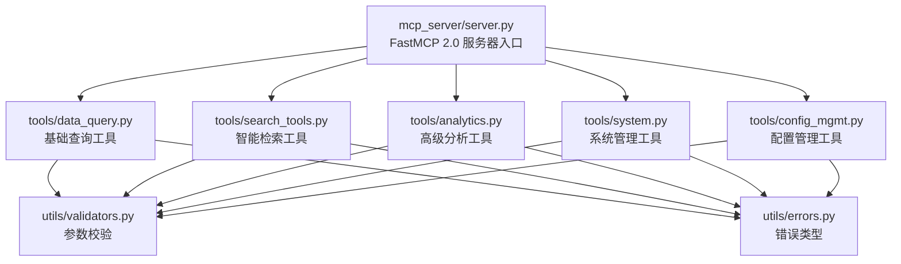
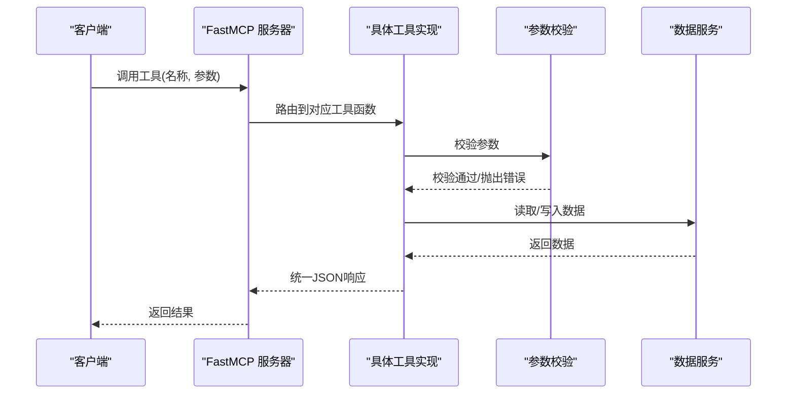
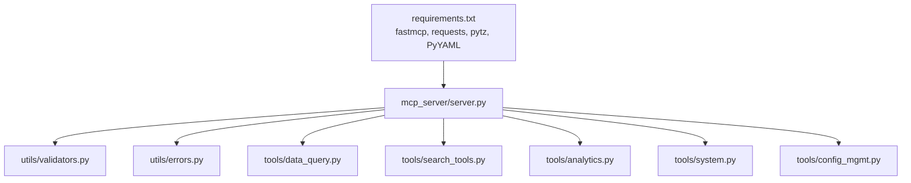

# MCP API参考文档

<cite>
**本文引用的文件**
- [docs/MCP-API-Reference.md](file://docs/MCP-API-Reference.md)
- [mcp_server/server.py](file://mcp_server/server.py)
- [mcp_server/tools/data_query.py](file://mcp_server/tools/data_query.py)
- [mcp_server/tools/search_tools.py](file://mcp_server/tools/search_tools.py)
- [mcp_server/tools/analytics.py](file://mcp_server/tools/analytics.py)
- [mcp_server/tools/system.py](file://mcp_server/tools/system.py)
- [mcp_server/tools/config_mgmt.py](file://mcp_server/tools/config_mgmt.py)
- [mcp_server/utils/validators.py](file://mcp_server/utils/validators.py)
- [mcp_server/utils/errors.py](file://mcp_server/utils/errors.py)
- [requirements.txt](file://requirements.txt)
</cite>

## 目录
1. [简介](#简介)
2. [项目结构](#项目结构)
3. [核心组件](#核心组件)
4. [架构总览](#架构总览)
5. [详细组件分析](#详细组件分析)
6. [依赖关系分析](#依赖关系分析)
7. [性能考量](#性能考量)
8. [故障排查指南](#故障排查指南)
9. [结论](#结论)
10. [附录](#附录)

## 简介
本文件为 TrendRadar MCP 服务器的API参考文档，基于仓库中的“MCP-API-Reference.md”定义，系统化梳理16个工具API的HTTP方法、请求/响应格式、参数说明与错误码，并重点覆盖基础查询工具（get_latest_news、get_news_by_date、get_trending_topics）、智能检索工具（search_news、search_related_news_history）、高级分析工具（analyze_topic_trend、analyze_data_insights、analyze_sentiment、find_similar_news、generate_summary_report、detect_viral_topics、predict_trending_topics）、以及系统管理工具（get_current_config、get_system_status、trigger_crawl）。文档同时提供Python与JavaScript客户端调用示例路径、错误处理规范与性能优化建议，帮助开发者与集成者高效、稳定地使用MCP协议进行工具调用。

## 项目结构
- 服务端入口与工具注册集中在 mcp_server/server.py，通过 FastMCP 2.0 注册16个工具函数。
- 工具实现按功能拆分为模块：
  - data_query.py：基础数据查询工具
  - search_tools.py：智能检索工具
  - analytics.py：高级分析工具
  - system.py：系统管理工具
  - config_mgmt.py：配置管理工具
- 参数校验与错误类型集中在 utils/validators.py 与 utils/errors.py。
- 文档参考与示例位于 docs/MCP-API-Reference.md。

图表来源
- [mcp_server/server.py](file://mcp_server/server.py#L1-L120)
- [mcp_server/tools/data_query.py](file://mcp_server/tools/data_query.py#L1-L60)
- [mcp_server/tools/search_tools.py](file://mcp_server/tools/search_tools.py#L1-L60)
- [mcp_server/tools/analytics.py](file://mcp_server/tools/analytics.py#L1-L60)
- [mcp_server/tools/system.py](file://mcp_server/tools/system.py#L1-L40)
- [mcp_server/tools/config_mgmt.py](file://mcp_server/tools/config_mgmt.py#L1-L30)
- [mcp_server/utils/validators.py](file://mcp_server/utils/validators.py#L1-L40)
- [mcp_server/utils/errors.py](file://mcp_server/utils/errors.py#L1-L40)

章节来源
- [mcp_server/server.py](file://mcp_server/server.py#L1-L120)
- [docs/MCP-API-Reference.md](file://docs/MCP-API-Reference.md#L1-L60)

## 核心组件
- FastMCP 2.0 服务器：负责注册工具、接收MCP请求、路由到对应工具实现。
- 工具层：
  - 基础查询：最新新闻、按日期查询、趋势话题
  - 智能检索：统一搜索、历史相关新闻
  - 高级分析：话题趋势、数据洞察、情感分析、相似新闻、摘要报告、异常检测、预测
  - 系统管理：配置查询、系统状态、手动触发爬取
- 工具调用链路：server.py 的 @mcp.tool 装饰器将工具函数暴露为MCP工具；工具内部通过 validators 校验参数，通过 services 读取数据，最终返回统一JSON结构；错误通过统一的 MCPError/子类抛出。

章节来源
- [mcp_server/server.py](file://mcp_server/server.py#L110-L220)
- [mcp_server/tools/data_query.py](file://mcp_server/tools/data_query.py#L1-L60)
- [mcp_server/tools/search_tools.py](file://mcp_server/tools/search_tools.py#L1-L60)
- [mcp_server/tools/analytics.py](file://mcp_server/tools/analytics.py#L1-L60)
- [mcp_server/tools/system.py](file://mcp_server/tools/system.py#L1-L40)
- [mcp_server/tools/config_mgmt.py](file://mcp_server/tools/config_mgmt.py#L1-L30)

## 架构总览
MCP服务器采用“工具函数即API”的设计，每个工具函数通过装饰器注册为MCP工具，客户端通过MCP协议调用。工具内部通过统一的参数校验与错误处理，保证API一致性与稳定性。

图表来源
- [mcp_server/server.py](file://mcp_server/server.py#L110-L220)
- [mcp_server/utils/validators.py](file://mcp_server/utils/validators.py#L90-L121)
- [mcp_server/utils/errors.py](file://mcp_server/utils/errors.py#L1-L40)

## 详细组件分析

### 基础查询工具

#### 1) get_latest_news
- HTTP方法：GET/POST（通过MCP协议调用）
- 描述：获取最新一批爬取的新闻数据，支持平台过滤、数量限制、URL包含开关。
- 请求参数
  - platforms: 可选，平台ID列表
  - limit: 可选，返回条数，默认50，最大1000
  - include_url: 可选，是否包含URL链接，默认false
- 响应
  - success: 布尔，是否成功
  - news: 新闻列表
  - total: 返回条数
  - platforms: 实际使用的平台列表
- 错误码
  - INVALID_PARAMETER：参数类型或范围不合法
  - INTERNAL_ERROR：内部异常
- 调用示例（Python）
  - 参考路径：[docs/MCP-API-Reference.md](file://docs/MCP-API-Reference.md#L410-L436)
- 调用示例（JavaScript）
  - 参考路径：[docs/MCP-API-Reference.md](file://docs/MCP-API-Reference.md#L438-L457)

章节来源
- [mcp_server/server.py](file://mcp_server/server.py#L113-L149)
- [mcp_server/tools/data_query.py](file://mcp_server/tools/data_query.py#L34-L89)
- [docs/MCP-API-Reference.md](file://docs/MCP-API-Reference.md#L18-L68)

#### 2) get_news_by_date
- HTTP方法：GET/POST（通过MCP协议调用）
- 描述：按日期查询新闻，支持自然语言日期（如“今天”、“昨天”、“3天前”）。
- 请求参数
  - date_query: 可选，日期查询字符串，默认“今天”
  - platforms: 可选，平台ID列表
  - limit: 可选，返回条数，默认50，最大1000
  - include_url: 可选，是否包含URL链接，默认false
- 响应
  - success: 布尔，是否成功
  - news: 新闻列表
  - total: 返回条数
  - date: 实际查询日期
  - date_query: 原始日期查询
  - platforms: 实际使用的平台列表
- 错误码
  - INVALID_PARAMETER：日期格式或范围不合法
  - DATA_NOT_FOUND：未找到数据
  - INTERNAL_ERROR：内部异常

章节来源
- [mcp_server/server.py](file://mcp_server/server.py#L176-L222)
- [mcp_server/tools/data_query.py](file://mcp_server/tools/data_query.py#L211-L285)
- [docs/MCP-API-Reference.md](file://docs/MCP-API-Reference.md#L48-L118)

#### 3) get_trending_topics
- HTTP方法：GET/POST（通过MCP协议调用）
- 描述：获取个人关注词的出现频率统计，来源于频率词表。
- 请求参数
  - top_n: 可选，返回TOP N，默认10，最大50
  - mode: 可选，统计模式，默认“current”，可选“daily”“current”“incremental”
- 响应
  - success: 布尔，是否成功
  - topics: 关注词统计列表
  - total_words: 关注词总数
  - mode: 实际使用的模式
- 错误码
  - INVALID_PARAMETER：参数不合法
  - INTERNAL_ERROR：内部异常

章节来源
- [mcp_server/server.py](file://mcp_server/server.py#L151-L174)
- [mcp_server/tools/data_query.py](file://mcp_server/tools/data_query.py#L154-L210)
- [docs/MCP-API-Reference.md](file://docs/MCP-API-Reference.md#L69-L95)

### 智能检索工具

#### 4) search_news（统一搜索）
- HTTP方法：GET/POST（通过MCP协议调用）
- 描述：统一新闻搜索，支持关键词、模糊、实体三种模式，支持日期范围、平台过滤、排序与阈值控制。
- 请求参数
  - query: 必需，查询内容
  - search_mode: 可选，默认“keyword”，可选“keyword”“fuzzy”“entity”
  - date_range: 可选，{"start": "YYYY-MM-DD","end": "YYYY-MM-DD"}
  - platforms: 可选，平台过滤列表
  - limit: 可选，默认50，最大1000
  - sort_by: 可选，默认“relevance”，可选“relevance”“weight”“date”
  - threshold: 可选，模糊模式相似度阈值(0-1)，默认0.6
  - include_url: 可选，默认false
- 响应
  - success: 布尔，是否成功
  - summary: 搜索摘要（总命中、返回数量、请求limit、模式、查询、平台、时间范围、排序）
  - results: 搜索结果列表
  - note: 可选，提示信息（如模糊阈值导致的结果较少）
- 错误码
  - INVALID_PARAMETER：参数不合法
  - NO_DATA_AVAILABLE：无可用数据
  - INTERNAL_ERROR：内部异常

章节来源
- [mcp_server/server.py](file://mcp_server/server.py#L462-L539)
- [mcp_server/tools/search_tools.py](file://mcp_server/tools/search_tools.py#L38-L241)
- [docs/MCP-API-Reference.md](file://docs/MCP-API-Reference.md#L99-L148)

#### 5) search_related_news_history（历史相关新闻）
- HTTP方法：GET/POST（通过MCP协议调用）
- 描述：在历史数据中搜索与给定新闻相关的新闻，支持时间预设与自定义日期范围。
- 请求参数
  - reference_text: 必需，参考新闻标题或内容
  - time_preset: 可选，默认“yesterday”，可选“yesterday”“last_week”“last_month”“custom”
  - start_date: 可选，自定义开始日期（仅time_preset为“custom”时有效）
  - end_date: 可选，自定义结束日期（仅time_preset为“custom”时有效）
  - threshold: 可选，默认0.4
  - limit: 可选，默认50，最大100
  - include_url: 可选，默认false
- 响应
  - success: 布尔，是否成功
  - summary: 相关性摘要（总命中、返回数量、请求limit、阈值、参考文本、参考关键词、时间预设、日期范围）
  - results: 相关新闻列表（含相似度、关键词重合度、共同关键词、时间分布）
  - statistics: 平台分布、日期分布、平均相似度
  - note: 可选，提示信息
- 错误码
  - INVALID_PARAMETER：参数不合法
  - INTERNAL_ERROR：内部异常

章节来源
- [mcp_server/server.py](file://mcp_server/server.py#L541-L583)
- [mcp_server/tools/search_tools.py](file://mcp_server/tools/search_tools.py#L494-L702)
- [docs/MCP-API-Reference.md](file://docs/MCP-API-Reference.md#L131-L147)

### 高级分析工具

#### 6) analyze_topic_trend（统一话题趋势分析）
- HTTP方法：GET/POST（通过MCP协议调用）
- 描述：整合趋势、生命周期、异常检测、预测四种分析模式，支持日期范围、粒度、阈值与预测窗口。
- 请求参数
  - topic: 必需（除viral/predict模式外），话题关键词
  - analysis_type: 可选，默认“trend”，可选“trend”“lifecycle”“viral”“predict”
  - date_range: 可选，{"start": "YYYY-MM-DD","end": "YYYY-MM-DD"}
  - granularity: 可选，默认“day”
  - threshold: 可选，异常检测阈值，默认3.0
  - time_window: 可选，异常检测时间窗口，默认24
  - lookahead_hours: 可选，预测未来小时数，默认6
  - confidence_threshold: 可选，默认0.7
- 响应
  - success: 布尔，是否成功
  - topic/date_range/granularity: 输入参数摘要
  - trend_data/statistics/trend_direction: 趋势分析结果
  - viral_topics/predictions等：其他模式的专属字段
- 错误码
  - INVALID_PARAMETER：参数不合法
  - INTERNAL_ERROR：内部异常

章节来源
- [mcp_server/server.py](file://mcp_server/server.py#L227-L289)
- [mcp_server/tools/analytics.py](file://mcp_server/tools/analytics.py#L156-L242)
- [docs/MCP-API-Reference.md](file://docs/MCP-API-Reference.md#L150-L181)

#### 7) analyze_data_insights（统一数据洞察）
- HTTP方法：GET/POST（通过MCP协议调用）
- 描述：整合平台对比、平台活跃度、关键词共现三种洞察模式。
- 请求参数
  - insight_type: 必需，可选“platform_compare”“platform_activity”“keyword_cooccur”
  - topic: 可选（仅platform_compare），话题关键词
  - date_range: 可选，{"start": "YYYY-MM-DD","end": "YYYY-MM-DD"}
  - min_frequency: 可选，默认3
  - top_n: 可选，默认20
- 响应
  - success: 布尔，是否成功
  - platform_compare/platform_activity/keyword_cooccur：根据模式返回对应结果
- 错误码
  - INVALID_PARAMETER：参数不合法
  - INTERNAL_ERROR：内部异常

章节来源
- [mcp_server/server.py](file://mcp_server/server.py#L291-L332)
- [mcp_server/tools/analytics.py](file://mcp_server/tools/analytics.py#L89-L155)
- [docs/MCP-API-Reference.md](file://docs/MCP-API-Reference.md#L183-L196)

#### 8) analyze_sentiment（情感倾向分析）
- HTTP方法：GET/POST（通过MCP协议调用）
- 描述：生成AI提示词，用于情感分析；支持按权重排序、URL包含、去重等。
- 请求参数
  - topic: 可选，话题关键词
  - platforms: 可选，平台过滤列表
  - date_range: 可选，{"start": "YYYY-MM-DD","end": "YYYY-MM-DD"}
  - limit: 可选，默认50，最大100
  - sort_by_weight: 可选，默认true
  - include_url: 可选，默认false
- 响应
  - success: 布尔，是否成功
  - method: ai_prompt_generation
  - summary: 摘要（总命中、返回数量、请求limit、去重数量、话题、时间范围、平台、排序）
  - ai_prompt: 生成的提示词
  - news_sample: 新闻样本
  - usage_note: 使用说明
- 错误码
  - INVALID_PARAMETER：参数不合法
  - DATA_NOT_FOUND：未找到数据
  - INTERNAL_ERROR：内部异常

章节来源
- [mcp_server/server.py](file://mcp_server/server.py#L334-L396)
- [mcp_server/tools/analytics.py](file://mcp_server/tools/analytics.py#L631-L800)
- [docs/MCP-API-Reference.md](file://docs/MCP-API-Reference.md#L197-L224)

#### 9) find_similar_news（相似新闻查找）
- HTTP方法：GET/POST（通过MCP协议调用）
- 描述：基于标题相似度查找相关新闻。
- 请求参数
  - reference_title: 必需，参考标题
  - threshold: 可选，默认0.6
  - limit: 可选，默认50，最大100
  - include_url: 可选，默认false
- 响应
  - success: 布尔，是否成功
  - 结果列表（含相似度分数）
- 错误码
  - INVALID_PARAMETER：参数不合法
  - INTERNAL_ERROR：内部异常

章节来源
- [mcp_server/server.py](file://mcp_server/server.py#L398-L432)
- [mcp_server/tools/analytics.py](file://mcp_server/tools/analytics.py#L1-L60)
- [docs/MCP-API-Reference.md](file://docs/MCP-API-Reference.md#L226-L248)

#### 10) search_by_entity（实体识别搜索）
- HTTP方法：GET/POST（通过MCP协议调用）
- 描述：实体识别搜索（工具函数名与文档名略有差异，实际实现为实体模式的搜索）。
- 请求参数
  - entity: 必需，实体名称
  - entity_type: 可选，“person”“location”“organization”
  - limit: 可选，默认50，最大200
  - sort_by_weight: 可选，默认true
- 响应
  - success: 布尔，是否成功
  - 结果列表
- 错误码
  - INVALID_PARAMETER：参数不合法
  - INTERNAL_ERROR：内部异常

章节来源
- [mcp_server/server.py](file://mcp_server/server.py#L462-L539)
- [mcp_server/tools/search_tools.py](file://mcp_server/tools/search_tools.py#L38-L120)
- [docs/MCP-API-Reference.md](file://docs/MCP-API-Reference.md#L236-L248)

#### 11) generate_summary_report（自动生成热点摘要报告）
- HTTP方法：GET/POST（通过MCP协议调用）
- 描述：自动生成每日/每周摘要报告。
- 请求参数
  - report_type: 可选，默认“daily”，可选“daily”“weekly”
  - date_range: 可选，{"start": "YYYY-MM-DD","end": "YYYY-MM-DD"}
- 响应
  - success: 布尔，是否成功
  - report_type/date_range/markdown_report/statistics：报告内容与统计
- 错误码
  - INVALID_PARAMETER：参数不合法
  - INTERNAL_ERROR：内部异常

章节来源
- [mcp_server/server.py](file://mcp_server/server.py#L433-L458)
- [mcp_server/tools/analytics.py](file://mcp_server/tools/analytics.py#L1-L60)
- [docs/MCP-API-Reference.md](file://docs/MCP-API-Reference.md#L249-L275)

#### 12) detect_viral_topics（异常热度检测）
- HTTP方法：GET/POST（通过MCP协议调用）
- 描述：识别突然爆火的话题。
- 请求参数
  - threshold: 可选，默认3.0
  - time_window: 可选，默认24，最大72
- 响应
  - success: 布尔，是否成功
  - viral_topics/total_detected/threshold/detection_time：检测结果
- 错误码
  - INVALID_PARAMETER：参数不合法
  - INTERNAL_ERROR：内部异常

章节来源
- [mcp_server/server.py](file://mcp_server/server.py#L227-L289)
- [mcp_server/tools/analytics.py](file://mcp_server/tools/analytics.py#L1-L60)
- [docs/MCP-API-Reference.md](file://docs/MCP-API-Reference.md#L277-L303)

#### 13) predict_trending_topics（预测未来热点）
- HTTP方法：GET/POST（通过MCP协议调用）
- 描述：基于历史数据预测未来热点。
- 请求参数
  - lookahead_hours: 可选，默认6，最大48
  - confidence_threshold: 可选，默认0.7
- 响应
  - success: 布尔，是否成功
  - predictions/...：预测结果
- 错误码
  - INVALID_PARAMETER：参数不合法
  - INTERNAL_ERROR：内部异常

章节来源
- [mcp_server/server.py](file://mcp_server/server.py#L227-L289)
- [mcp_server/tools/analytics.py](file://mcp_server/tools/analytics.py#L1-L60)
- [docs/MCP-API-Reference.md](file://docs/MCP-API-Reference.md#L305-L312)

### 系统管理工具

#### 14) get_current_config
- HTTP方法：GET/POST（通过MCP协议调用）
- 描述：获取当前系统配置。
- 请求参数
  - section: 可选，默认“all”，可选“all”“crawler”“push”“keywords”“weights”
- 响应
  - success: 布尔，是否成功
  - config/section：配置内容与节名
- 错误码
  - INVALID_PARAMETER：参数不合法
  - INTERNAL_ERROR：内部异常

章节来源
- [mcp_server/server.py](file://mcp_server/server.py#L587-L608)
- [mcp_server/tools/config_mgmt.py](file://mcp_server/tools/config_mgmt.py#L26-L67)
- [docs/MCP-API-Reference.md](file://docs/MCP-API-Reference.md#L315-L326)

#### 15) get_system_status
- HTTP方法：GET/POST（通过MCP协议调用）
- 描述：获取系统运行状态和健康检查。
- 请求参数：无
- 响应
  - success: 布尔，是否成功
  - system/data/cache：系统版本、数据统计、缓存状态
- 错误码
  - INTERNAL_ERROR：内部异常

章节来源
- [mcp_server/server.py](file://mcp_server/server.py#L610-L623)
- [mcp_server/tools/system.py](file://mcp_server/tools/system.py#L33-L67)
- [docs/MCP-API-Reference.md](file://docs/MCP-API-Reference.md#L327-L354)

#### 16) trigger_crawl
- HTTP方法：GET/POST（通过MCP协议调用）
- 描述：手动触发爬取任务，支持平台过滤、本地保存与URL包含。
- 请求参数
  - platforms: 可选，平台ID列表
  - save_to_local: 可选，默认false
  - include_url: 可选，默认false
- 响应
  - success: 布尔，是否成功
  - task_id/status/crawl_time/platforms/total_news/failed_platforms/data/saved_to_local/saved_files：任务状态与结果
- 错误码
  - INVALID_PARAMETER：参数不合法
  - CRAWL_TASK_ERROR：爬取任务错误
  - INTERNAL_ERROR：内部异常

章节来源
- [mcp_server/server.py](file://mcp_server/server.py#L625-L658)
- [mcp_server/tools/system.py](file://mcp_server/tools/system.py#L68-L180)
- [docs/MCP-API-Reference.md](file://docs/MCP-API-Reference.md#L356-L382)

## 依赖关系分析
- 服务器依赖 FastMCP 2.0（requirements.txt）
- 工具依赖 validators（参数校验）与 errors（错误类型）
- 工具内部通过 services 读取数据（如 data_service），并返回统一JSON结构
- 系统管理工具依赖配置文件与外部爬虫接口

图表来源
- [requirements.txt](file://requirements.txt#L1-L6)
- [mcp_server/server.py](file://mcp_server/server.py#L1-L40)

章节来源
- [requirements.txt](file://requirements.txt#L1-L6)
- [mcp_server/server.py](file://mcp_server/server.py#L1-L40)

## 性能考量
- 合理使用limit参数，避免一次性获取过多数据
- 启用缓存：系统会自动缓存常用查询结果
- 分批处理大数据：使用date_range分批查询历史数据
- 选择合适的搜索模式：精确匹配使用“keyword”，模糊搜索使用“fuzzy”，实体搜索使用“entity”
- 定期清理缓存：系统会自动清理过期缓存
- 爬取任务：合理设置请求间隔与重试机制，避免频繁请求

章节来源
- [docs/MCP-API-Reference.md](file://docs/MCP-API-Reference.md#L459-L475)

## 故障排查指南
- 统一错误响应格式
  - success: false
  - error: {code, message, suggestion, details}
- 常见错误码
  - INVALID_PARAMETER：参数无效
  - DATA_NOT_FOUND：数据未找到
  - CRAWL_TASK_ERROR：爬虫任务错误
  - INTERNAL_ERROR：内部错误
  - NO_DATA_AVAILABLE：没有可用数据
- 参数校验
  - 平台ID必须在配置中存在
  - 日期范围必须合法且不可在未来
  - limit必须为正整数且不超过上限
- 爬取失败
  - 检查平台配置是否存在
  - 检查网络与目标接口状态
  - 查看失败平台列表与日志

章节来源
- [docs/MCP-API-Reference.md](file://docs/MCP-API-Reference.md#L384-L408)
- [mcp_server/utils/validators.py](file://mcp_server/utils/validators.py#L90-L121)
- [mcp_server/utils/errors.py](file://mcp_server/utils/errors.py#L1-L94)
- [mcp_server/tools/system.py](file://mcp_server/tools/system.py#L98-L131)

## 结论
本参考文档系统化梳理了 TrendRadar MCP 服务器的16个工具API，明确了参数、响应与错误处理规范，并提供了Python与JavaScript客户端调用示例路径。通过统一的参数校验与错误处理机制，工具API具备良好的一致性与稳定性。建议在生产环境中结合性能优化建议与故障排查指南，确保系统的高效与可靠运行。

## 附录

### API调用示例路径
- Python 客户端示例
  - 参考路径：[docs/MCP-API-Reference.md](file://docs/MCP-API-Reference.md#L410-L436)
- JavaScript 客户端示例
  - 参考路径：[docs/MCP-API-Reference.md](file://docs/MCP-API-Reference.md#L438-L457)

### 参数与返回结构要点
- 所有工具均返回统一JSON结构，包含success字段与业务数据；错误时返回error对象
- 日期范围参数必须为{"start": "YYYY-MM-DD","end": "YYYY-MM-DD"}格式
- 平台ID必须在配置文件中存在，否则将触发参数错误
- limit参数存在默认值与上限，超出将触发参数错误

章节来源
- [docs/MCP-API-Reference.md](file://docs/MCP-API-Reference.md#L384-L408)
- [mcp_server/utils/validators.py](file://mcp_server/utils/validators.py#L145-L210)