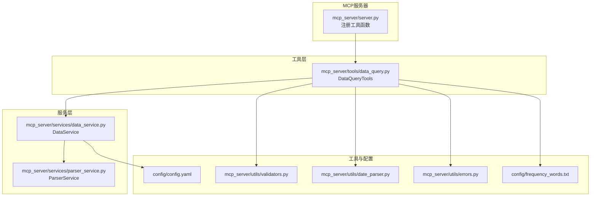
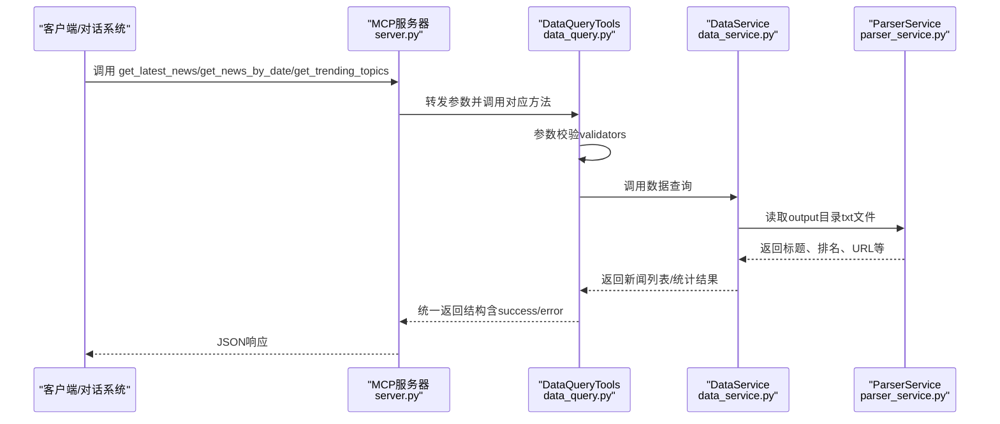
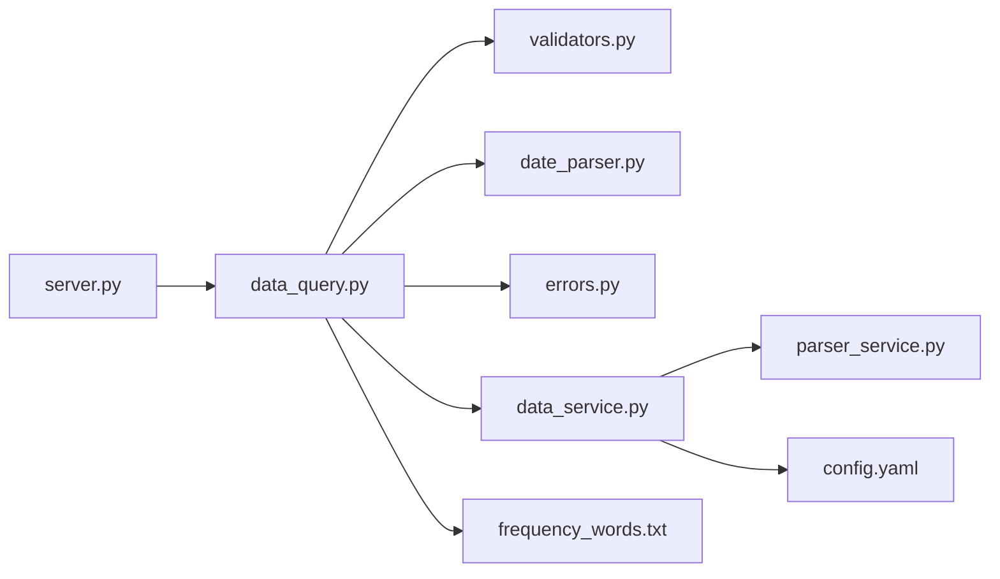

# 基础查询工具

<cite>
**本文引用的文件**
- [mcp_server/server.py](file://mcp_server/server.py)
- [mcp_server/tools/data_query.py](file://mcp_server/tools/data_query.py)
- [mcp_server/services/data_service.py](file://mcp_server/services/data_service.py)
- [mcp_server/utils/validators.py](file://mcp_server/utils/validators.py)
- [mcp_server/utils/date_parser.py](file://mcp_server/utils/date_parser.py)
- [mcp_server/utils/errors.py](file://mcp_server/utils/errors.py)
- [config/config.yaml](file://config/config.yaml)
- [config/frequency_words.txt](file://config/frequency_words.txt)
</cite>

## 目录
1. [简介](#简介)
2. [项目结构](#项目结构)
3. [核心组件](#核心组件)
4. [架构总览](#架构总览)
5. [详细组件分析](#详细组件分析)
6. [依赖关系分析](#依赖关系分析)
7. [性能考量](#性能考量)
8. [故障排查指南](#故障排查指南)
9. [结论](#结论)
10. [附录](#附录)

## 简介
本文件面向“基础查询工具”的API参考，聚焦以下三个端点：
- get_latest_news：获取最新一批爬取的新闻
- get_news_by_date：按日期查询新闻（支持自然语言日期）
- get_trending_topics：获取个人关注词的新闻出现频率统计

文档覆盖HTTP方法、请求参数、响应结构、使用场景、错误处理机制，并结合代码路径说明如何在AI对话系统中集成这些基础查询功能。同时解释参数如platforms、limit、date_query和mode的作用，以及返回数据中ranks、count等字段的业务含义。

## 项目结构
基础查询工具由MCP服务器暴露为工具函数，内部通过DataQueryTools封装调用DataService实现数据查询；参数校验由validators模块负责；日期解析由date_parser模块负责；错误类型由errors模块统一定义。

图表来源
- [mcp_server/server.py](file://mcp_server/server.py#L113-L221)
- [mcp_server/tools/data_query.py](file://mcp_server/tools/data_query.py#L22-L285)
- [mcp_server/services/data_service.py](file://mcp_server/services/data_service.py#L1-L200)
- [mcp_server/utils/validators.py](file://mcp_server/utils/validators.py#L1-L352)
- [mcp_server/utils/date_parser.py](file://mcp_server/utils/date_parser.py#L1-L200)
- [config/config.yaml](file://config/config.yaml#L110-L140)
- [config/frequency_words.txt](file://config/frequency_words.txt#L1-L114)

章节来源
- [mcp_server/server.py](file://mcp_server/server.py#L113-L221)
- [mcp_server/tools/data_query.py](file://mcp_server/tools/data_query.py#L22-L285)
- [mcp_server/services/data_service.py](file://mcp_server/services/data_service.py#L1-L200)
- [mcp_server/utils/validators.py](file://mcp_server/utils/validators.py#L1-L352)
- [mcp_server/utils/date_parser.py](file://mcp_server/utils/date_parser.py#L1-L200)
- [config/config.yaml](file://config/config.yaml#L110-L140)
- [config/frequency_words.txt](file://config/frequency_words.txt#L1-L114)

## 核心组件
- DataQueryTools：封装基础查询工具，负责参数校验、调用DataService并统一返回结构。
- DataService：统一的数据访问层，负责从output目录按日期读取txt文件，解析标题、排名、URL等信息。
- Validators：参数校验工具，包括平台列表、limit、日期范围、关键词、top_n、mode、date_query等。
- DateParser：日期解析工具，支持中文/英文相对日期、绝对日期、星期、最近N天等自然语言表达。
- 错误体系：统一的MCPError及其子类，便于前端或AI对话系统识别与处理。

章节来源
- [mcp_server/tools/data_query.py](file://mcp_server/tools/data_query.py#L22-L285)
- [mcp_server/services/data_service.py](file://mcp_server/services/data_service.py#L1-L200)
- [mcp_server/utils/validators.py](file://mcp_server/utils/validators.py#L1-L352)
- [mcp_server/utils/date_parser.py](file://mcp_server/utils/date_parser.py#L1-L200)
- [mcp_server/utils/errors.py](file://mcp_server/utils/errors.py#L1-L94)

## 架构总览
基础查询工具的调用链路如下：MCP服务器注册工具函数，工具函数调用DataQueryTools，DataQueryTools通过validators进行参数校验，再调用DataService读取output目录下的txt文件，最终返回统一JSON结构。

图表来源
- [mcp_server/server.py](file://mcp_server/server.py#L113-L221)
- [mcp_server/tools/data_query.py](file://mcp_server/tools/data_query.py#L22-L285)
- [mcp_server/services/data_service.py](file://mcp_server/services/data_service.py#L1-L200)
- [mcp_server/services/parser_service.py](file://mcp_server/services/parser_service.py#L160-L200)

## 详细组件分析

### get_latest_news
- HTTP方法与端点
  - 通过MCP工具注册为get_latest_news，可在HTTP模式下通过MCP协议调用；具体HTTP端点由MCP服务器暴露，客户端需遵循MCP协议。
- 请求参数
  - platforms: 可选，平台ID列表；若为None或空列表，使用config.yaml中配置的所有平台。
  - limit: 可选，返回条数限制，默认50，最大1000。
  - include_url: 可选，是否包含URL链接，默认False（节省token）。
- 响应结构
  - 成功时返回包含news列表、total、platforms、success字段的字典；失败时返回success:false与error字典（包含code/message，必要时含suggestion）。
- 使用场景
  - 快速了解当前热点，适合在对话系统中作为“最新资讯”入口。
- 错误处理
  - 参数非法抛出InvalidParameterError；平台不支持抛出PlatformNotSupportedError；内部异常返回INTERNAL_ERROR。
- 业务字段说明
  - news列表中每条新闻包含title、platform、platform_name、rank、timestamp等；当include_url为True时包含url、mobileUrl。
- Python/JavaScript调用示例（路径参考）
  - Python调用路径参考：[mcp_server/server.py](file://mcp_server/server.py#L113-L149)
  - 参数校验路径参考：[mcp_server/utils/validators.py](file://mcp_server/utils/validators.py#L43-L88)、[mcp_server/utils/validators.py](file://mcp_server/utils/validators.py#L90-L121)
  - 数据读取路径参考：[mcp_server/services/data_service.py](file://mcp_server/services/data_service.py#L30-L103)

章节来源
- [mcp_server/server.py](file://mcp_server/server.py#L113-L149)
- [mcp_server/tools/data_query.py](file://mcp_server/tools/data_query.py#L34-L89)
- [mcp_server/utils/validators.py](file://mcp_server/utils/validators.py#L43-L88)
- [mcp_server/utils/validators.py](file://mcp_server/utils/validators.py#L90-L121)
- [mcp_server/services/data_service.py](file://mcp_server/services/data_service.py#L30-L103)

### get_news_by_date
- HTTP方法与端点
  - 通过MCP工具注册为get_news_by_date，支持自然语言日期（如“今天”、“昨天”、“3天前”、“上周一”、“2025-10-10”等）。
- 请求参数
  - date_query: 可选，日期查询字符串，默认“今天”，支持相对/绝对/星期/自然语言最近N天等。
  - platforms: 可选，平台ID列表；若为None或空列表，使用config.yaml中配置的所有平台。
  - limit: 可选，返回条数限制，默认50，最大1000。
  - include_url: 可选，是否包含URL链接，默认False（节省token）。
- 响应结构
  - 成功时返回包含news列表、total、date、date_query、platforms、success字段的字典；失败时返回success:false与error字典。
- 使用场景
  - 历史对比分析、回溯某日热点；适合在对话系统中回答“昨天发生了什么”等问题。
- 错误处理
  - 日期解析失败抛出InvalidParameterError；日期在未来或过旧抛出InvalidParameterError；平台不支持抛出PlatformNotSupportedError；内部异常返回INTERNAL_ERROR。
- 业务字段说明
  - news列表中每条新闻包含title、platform、platform_name、rank、avg_rank、count、date等；当include_url为True时包含url、mobileUrl。
- Python/JavaScript调用示例（路径参考）
  - Python调用路径参考：[mcp_server/server.py](file://mcp_server/server.py#L176-L221)
  - 日期解析路径参考：[mcp_server/utils/date_parser.py](file://mcp_server/utils/date_parser.py#L92-L248)
  - 参数校验路径参考：[mcp_server/utils/validators.py](file://mcp_server/utils/validators.py#L145-L210)、[mcp_server/utils/validators.py](file://mcp_server/utils/validators.py#L309-L352)
  - 数据读取路径参考：[mcp_server/services/data_service.py](file://mcp_server/services/data_service.py#L104-L182)

章节来源
- [mcp_server/server.py](file://mcp_server/server.py#L176-L221)
- [mcp_server/tools/data_query.py](file://mcp_server/tools/data_query.py#L211-L285)
- [mcp_server/utils/date_parser.py](file://mcp_server/utils/date_parser.py#L92-L248)
- [mcp_server/utils/validators.py](file://mcp_server/utils/validators.py#L145-L210)
- [mcp_server/utils/validators.py](file://mcp_server/utils/validators.py#L309-L352)
- [mcp_server/services/data_service.py](file://mcp_server/services/data_service.py#L104-L182)

### get_trending_topics
- HTTP方法与端点
  - 通过MCP工具注册为get_trending_topics，基于个人关注词列表进行统计。
- 请求参数
  - top_n: 可选，返回TOP N关注词，默认10，最大100。
  - mode: 可选，模式选择，支持daily/current/incremental，默认current。
- 响应结构
  - 成功时返回包含topics列表、total、mode、success字段的字典；失败时返回success:false与error字典。
- 使用场景
  - 个性化热点追踪，适合在对话系统中回答“我关注的词最近出现频率如何”等问题。
- 错误处理
  - mode非法抛出InvalidParameterError；内部异常返回INTERNAL_ERROR。
- 业务字段说明
  - topics列表中每项包含关注词及出现次数；返回的是在config/frequency_words.txt中设置的关注词的频率统计。
- Python/JavaScript调用示例（路径参考）
  - Python调用路径参考：[mcp_server/server.py](file://mcp_server/server.py#L151-L174)
  - 参数校验路径参考：[mcp_server/utils/validators.py](file://mcp_server/utils/validators.py#L245-L259)、[mcp_server/utils/validators.py](file://mcp_server/utils/validators.py#L262-L289)
  - 数据读取路径参考：[mcp_server/services/data_service.py](file://mcp_server/services/data_service.py#L184-L200)
  - 关注词来源：[config/frequency_words.txt](file://config/frequency_words.txt#L1-L114)

章节来源
- [mcp_server/server.py](file://mcp_server/server.py#L151-L174)
- [mcp_server/tools/data_query.py](file://mcp_server/tools/data_query.py#L154-L210)
- [mcp_server/utils/validators.py](file://mcp_server/utils/validators.py#L245-L259)
- [mcp_server/utils/validators.py](file://mcp_server/utils/validators.py#L262-L289)
- [mcp_server/services/data_service.py](file://mcp_server/services/data_service.py#L184-L200)
- [config/frequency_words.txt](file://config/frequency_words.txt#L1-L114)

### 参数与字段详解
- platforms
  - 作用：过滤平台，支持的平台来自config/config.yaml中的platforms配置。
  - 行为：若为None或空列表，使用配置文件中的平台列表；若配置加载失败，允许所有平台通过（降级策略）。
  - 参考路径：[mcp_server/utils/validators.py](file://mcp_server/utils/validators.py#L43-L88)、[config/config.yaml](file://config/config.yaml#L116-L140)
- limit
  - 作用：限制返回条数，默认值与最大值在不同工具中略有差异，但均有限制上限。
  - 参考路径：[mcp_server/utils/validators.py](file://mcp_server/utils/validators.py#L90-L121)
- date_query
  - 作用：自然语言日期查询，支持“今天”、“昨天”、“3天前”、“上周一”、“2025-10-10”等。
  - 参考路径：[mcp_server/utils/date_parser.py](file://mcp_server/utils/date_parser.py#L92-L248)、[mcp_server/utils/validators.py](file://mcp_server/utils/validators.py#L309-L352)
- mode
  - 作用：趋势统计模式，支持daily/current/incremental。
  - 参考路径：[mcp_server/utils/validators.py](file://mcp_server/utils/validators.py#L262-L289)
- ranks/count
  - ranks：新闻在各榜单中的排名列表，用于计算权重与热度。
  - count：ranks长度，代表出现次数。
  - 参考路径：[mcp_server/services/data_service.py](file://mcp_server/services/data_service.py#L70-L103)、[mcp_server/services/data_service.py](file://mcp_server/services/data_service.py#L141-L182)

章节来源
- [mcp_server/utils/validators.py](file://mcp_server/utils/validators.py#L43-L88)
- [mcp_server/utils/validators.py](file://mcp_server/utils/validators.py#L90-L121)
- [mcp_server/utils/validators.py](file://mcp_server/utils/validators.py#L262-L289)
- [mcp_server/utils/validators.py](file://mcp_server/utils/validators.py#L309-L352)
- [mcp_server/utils/date_parser.py](file://mcp_server/utils/date_parser.py#L92-L248)
- [mcp_server/services/data_service.py](file://mcp_server/services/data_service.py#L70-L103)
- [mcp_server/services/data_service.py](file://mcp_server/services/data_service.py#L141-L182)

## 依赖关系分析
- 组件耦合
  - server.py依赖tools/data_query.py；data_query.py依赖validators、date_parser、errors；data_service依赖parser_service与cache_service。
- 外部依赖
  - config/config.yaml提供平台配置；config/frequency_words.txt提供关注词列表。
- 潜在循环依赖
  - 代码结构清晰，未发现循环导入。

图表来源
- [mcp_server/server.py](file://mcp_server/server.py#L113-L221)
- [mcp_server/tools/data_query.py](file://mcp_server/tools/data_query.py#L22-L285)
- [mcp_server/utils/validators.py](file://mcp_server/utils/validators.py#L1-L352)
- [mcp_server/utils/date_parser.py](file://mcp_server/utils/date_parser.py#L1-L200)
- [mcp_server/utils/errors.py](file://mcp_server/utils/errors.py#L1-L94)
- [mcp_server/services/data_service.py](file://mcp_server/services/data_service.py#L1-L200)
- [config/config.yaml](file://config/config.yaml#L116-L140)
- [config/frequency_words.txt](file://config/frequency_words.txt#L1-L114)

章节来源
- [mcp_server/server.py](file://mcp_server/server.py#L113-L221)
- [mcp_server/tools/data_query.py](file://mcp_server/tools/data_query.py#L22-L285)
- [mcp_server/utils/validators.py](file://mcp_server/utils/validators.py#L1-L352)
- [mcp_server/utils/date_parser.py](file://mcp_server/utils/date_parser.py#L1-L200)
- [mcp_server/utils/errors.py](file://mcp_server/utils/errors.py#L1-L94)
- [mcp_server/services/data_service.py](file://mcp_server/services/data_service.py#L1-L200)
- [config/config.yaml](file://config/config.yaml#L116-L140)
- [config/frequency_words.txt](file://config/frequency_words.txt#L1-L114)

## 性能考量
- 缓存策略
  - latest_news按15分钟缓存；news_by_date对历史数据按1小时缓存，今日数据按15分钟缓存，减少I/O压力。
- 排序与限制
  - 按rank排序并限制返回数量，避免一次性返回过多数据。
- URL字段按需返回
  - include_url为False时避免携带URL，减少token消耗。

章节来源
- [mcp_server/services/data_service.py](file://mcp_server/services/data_service.py#L50-L102)
- [mcp_server/services/data_service.py](file://mcp_server/services/data_service.py#L134-L182)

## 故障排查指南
- 常见错误类型
  - INVALID_PARAMETER：参数格式或取值不合法（如limit超限、date_range格式错误、date_query无法解析、mode非法）。
  - DATA_NOT_FOUND：未找到数据（如指定日期无数据）。
  - PLATFORM_NOT_SUPPORTED：平台ID不在配置列表中。
  - INTERNAL_ERROR：内部异常。
- 定位要点
  - 查看返回的error字典中的code与message；若存在suggestion，按提示调整参数。
  - 确认config/config.yaml中的platforms配置是否正确。
  - 确认output目录是否存在目标日期的txt文件。
- 代码定位
  - 错误类型定义：[mcp_server/utils/errors.py](file://mcp_server/utils/errors.py#L1-L94)
  - 参数校验与日期解析：[mcp_server/utils/validators.py](file://mcp_server/utils/validators.py#L145-L210)、[mcp_server/utils/date_parser.py](file://mcp_server/utils/date_parser.py#L92-L248)
  - 数据读取与错误抛出：[mcp_server/services/parser_service.py](file://mcp_server/services/parser_service.py#L160-L200)

章节来源
- [mcp_server/utils/errors.py](file://mcp_server/utils/errors.py#L1-L94)
- [mcp_server/utils/validators.py](file://mcp_server/utils/validators.py#L145-L210)
- [mcp_server/utils/date_parser.py](file://mcp_server/utils/date_parser.py#L92-L248)
- [mcp_server/services/parser_service.py](file://mcp_server/services/parser_service.py#L160-L200)

## 结论
基础查询工具通过统一的MCP工具接口对外提供最新新闻、历史日期新闻与个人关注词统计能力。参数校验与日期解析保障了输入质量，缓存与排序提升了性能与体验。在AI对话系统中，可优先使用resolve_date_range工具解析自然语言日期，再调用上述三个基础查询工具，以获得一致且可控的查询结果。

## 附录

### Python/JavaScript调用示例（路径参考）
- Python调用get_latest_news
  - 参考路径：[mcp_server/server.py](file://mcp_server/server.py#L113-L149)
- Python调用get_news_by_date
  - 参考路径：[mcp_server/server.py](file://mcp_server/server.py#L176-L221)
- Python调用get_trending_topics
  - 参考路径：[mcp_server/server.py](file://mcp_server/server.py#L151-L174)
- JavaScript调用（HTTP模式）
  - 服务地址：http://localhost:3333/mcp
  - 客户端需遵循MCP协议，通过工具名调用对应函数；具体客户端实现请参考MCP官方客户端示例。

章节来源
- [mcp_server/server.py](file://mcp_server/server.py#L113-L149)
- [mcp_server/server.py](file://mcp_server/server.py#L151-L174)
- [mcp_server/server.py](file://mcp_server/server.py#L176-L221)