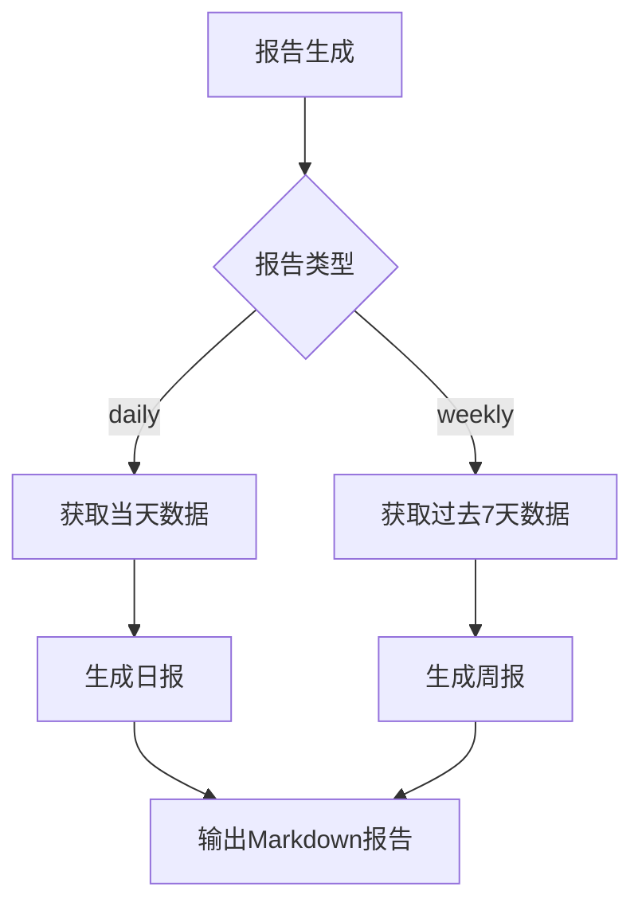
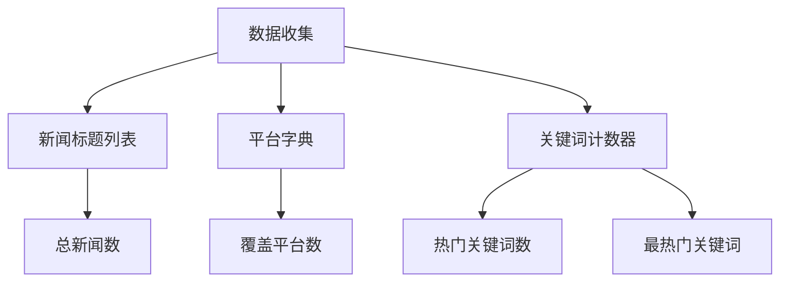
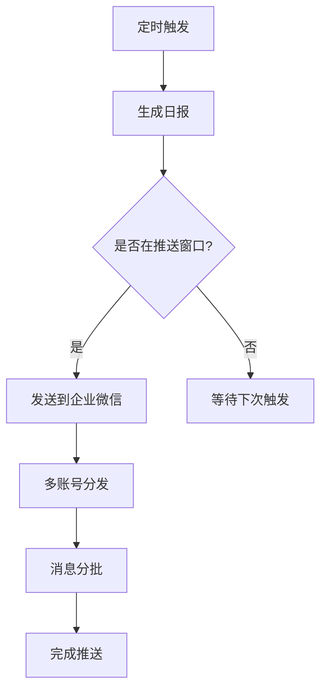
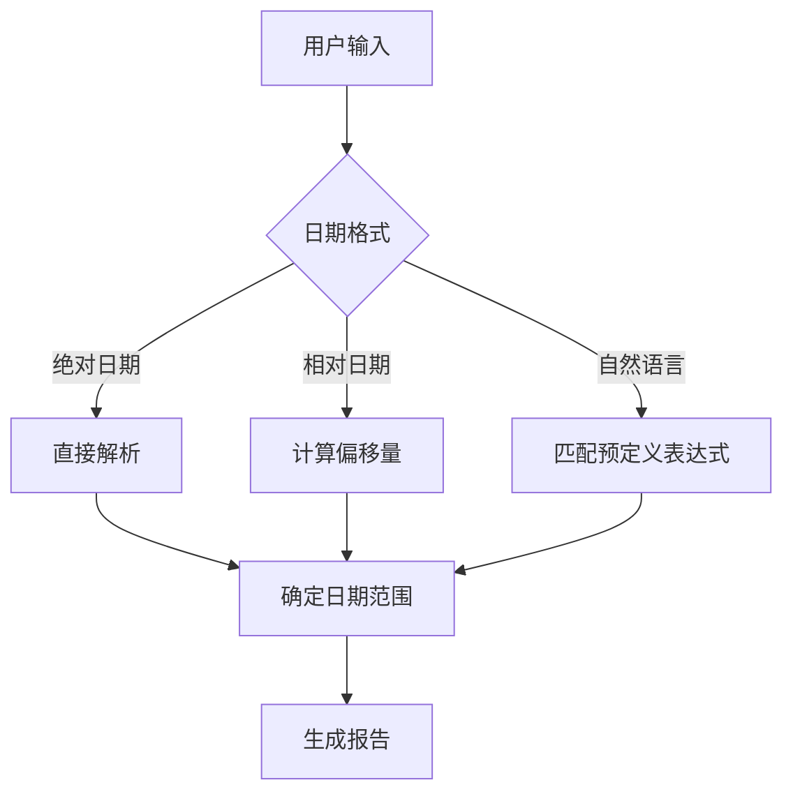

# 报告生成工具

<cite>
**本文档引用的文件**   
- [main.py](file://main.py)
- [mcp_server/tools/analytics.py](file://mcp_server/tools/analytics.py)
- [config/config.yaml](file://config/config.yaml)
- [mcp_server/utils/date_parser.py](file://mcp_server/utils/date_parser.py)
- [docker/entrypoint.sh](file://docker/entrypoint.sh)
</cite>

## 目录
1. [简介](#简介)
2. [generate_summary_report API功能](#generate_summary_report-api功能)
3. [报告类型与生成逻辑](#报告类型与生成逻辑)
4. [markdown_report字段结构](#markdown_report字段结构)
5. [statistics统计指标计算](#statistics统计指标计算)
6. [自动化工作流集成](#自动化工作流集成)
7. [自定义日期范围报告](#自定义日期范围报告)

## 简介
本报告生成工具是TrendRadar项目的核心功能之一，旨在为用户提供每日和每周的新闻热点摘要。通过`generate_summary_report` API，用户可以获取结构化的Markdown格式报告，包含数据概览、热门话题、平台活跃度等关键信息。该工具支持多种通知渠道，可灵活集成到自动化工作流中，满足不同场景下的信息推送需求。

## generate_summary_report API功能
`generate_summary_report` API是报告生成的核心接口，提供每日和每周两种报告类型。该API通过MCP（Model Context Protocol）协议暴露，可被AI模型或其他系统调用。API的主要功能包括：

- **报告类型选择**：支持`daily`（每日）和`weekly`（每周）两种报告类型
- **日期范围控制**：可通过`date_range`参数指定自定义日期范围
- **数据聚合**：自动从多个新闻平台收集数据，进行关键词提取和频率统计
- **报告生成**：生成包含数据概览、热门话题、平台活跃度和精选新闻的完整报告

API的调用示例如下：
```python
tools = AnalyticsTools()
result = tools.generate_summary_report(
    report_type="daily"
)
print(result['markdown_report'])
```

**Section sources**
- [mcp_server/tools/analytics.py](file://mcp_server/tools/analytics.py#L1158-L1357)

## 报告类型与生成逻辑
### 日报与周报的差异
日报和周报在生成逻辑和内容结构上存在显著差异，以满足不同时间维度的分析需求。

**日报（daily）**：
- **时间范围**：仅包含当天的数据
- **数据粒度**：更精细，反映当天的实时热点
- **适用场景**：日常监控、即时决策支持
- **内容特点**：侧重于当天的突发新闻和热点事件

**周报（weekly）**：
- **时间范围**：包含过去7天的数据（从6天前到今天）
- **数据粒度**：更宏观，反映一周的趋势变化
- **适用场景**：趋势分析、周期性总结
- **内容特点**：包含趋势分析部分，识别持续热门的话题



**Diagram sources **
- [mcp_server/tools/analytics.py](file://mcp_server/tools/analytics.py#L1199-L1203)

### 生成逻辑流程
报告的生成遵循以下流程：
1. **参数验证**：检查`report_type`是否为`daily`或`weekly`
2. **日期范围确定**：根据报告类型或自定义范围确定数据收集的时间窗口
3. **数据收集**：遍历日期范围内的每一天，从各新闻平台收集标题数据
4. **关键词提取**：从新闻标题中提取关键词并统计出现频率
5. **报告构建**：基于收集的数据构建Markdown格式的报告

**Section sources**
- [mcp_server/tools/analytics.py](file://mcp_server/tools/analytics.py#L1188-L1236)

## markdown_report字段结构
### 报告整体结构
`markdown_report`字段包含完整的Markdown格式报告，其结构如下：

```markdown
# 报告标题

**报告日期**: 日期范围
**生成时间**: 生成时间戳

---

## 数据概览
- **总新闻数**: 数量
- **覆盖平台**: 数量
- **热门关键词数**: 数量

## TOP 10 热门话题
1. **关键词** - 出现次数
2. **关键词** - 出现次数
...

## 平台活跃度
- **平台名称**: 新闻数量
...

## 趋势分析（仅周报）
本周热度持续的话题（样本数据）：
- **关键词**: 持续热门
...

## 精选新闻样本
- [平台] 新闻标题
...
```

### 样式规范
报告采用统一的样式规范，确保在不同平台上的显示一致性：

- **标题**：使用`#`和`##`标记，加粗显示
- **列表**：使用`-`或数字序号，保持缩进一致
- **强调**：使用`**`包裹关键词，实现加粗效果
- **分隔线**：使用`---`创建水平分隔线
- **图标**：使用Emoji图标增强可读性（如📊、🔥、📈）

**Section sources**
- [mcp_server/tools/analytics.py](file://mcp_server/tools/analytics.py#L1242-L1306)

## statistics统计指标计算
### 统计指标定义
`statistics`字段包含报告的关键统计指标，用于量化分析结果：

| 指标 | 描述 | 计算方式 |
|------|------|----------|
| total_news | 总新闻数 | 所有收集到的新闻标题总数 |
| platforms_count | 覆盖平台数 | 出现新闻的独立平台数量 |
| keywords_count | 热门关键词数 | 提取到的独立关键词总数 |
| top_keyword | 最热门关键词 | 出现频率最高的关键词及其频次 |

### 计算方法
统计指标的计算基于以下逻辑：

- **总新闻数**：遍历所有日期和平台，累加新闻标题的数量
- **覆盖平台数**：使用字典记录各平台的新闻数量，字典的键数量即为平台数
- **热门关键词数**：使用`Counter`对象统计关键词频率，对象的长度即为关键词数
- **最热门关键词**：使用`Counter.most_common(1)`方法获取频率最高的关键词



**Diagram sources **
- [mcp_server/tools/analytics.py](file://mcp_server/tools/analytics.py#L1317-L1320)

## 自动化工作流集成
### 定时生成日报
通过Docker部署和cron调度，可实现日报的定时自动生成和推送。具体配置如下：

1. **Docker环境变量**：
```bash
PUSH_WINDOW_ENABLED=true
PUSH_WINDOW_START=09:00
PUSH_WINDOW_END=18:00
CRON_SCHEDULE="0 * * * *"  # 每小时执行一次
```

2. **推送时间窗口**：
- 通过`PUSH_WINDOW_START`和`PUSH_WINDOW_END`设置推送时间范围
- `PUSH_WINDOW_ONCE_PER_DAY`设置为`true`可确保每天只推送一次

### 推送到企业微信群
将生成的报告推送到企业微信群需要以下步骤：

1. **配置Webhook**：
   - 在企业微信中创建群机器人
   - 获取Webhook URL并配置到`config.yaml`的`wework_url`字段

2. **多账号支持**：
   - 使用分号`;`分隔多个Webhook URL
   - 系统会自动向所有配置的账号发送报告

3. **消息分批**：
   - 当报告内容过长时，系统会自动分批发送
   - 批次大小由`message_batch_size`参数控制



**Diagram sources **
- [docker/entrypoint.sh](file://docker/entrypoint.sh#L13-L45)
- [config/config.yaml](file://config/config.yaml#L50-L58)

## 自定义日期范围报告
### 调用方法
通过`date_range`参数，可以生成任意日期范围的报告。调用方法如下：

```python
result = tools.generate_summary_report(
    report_type="daily",
    date_range={
        "start": "2025-11-01",
        "end": "2025-11-10"
    }
)
```

### 适用场景
自定义日期范围报告适用于以下场景：

- **事件回顾**：分析特定事件期间的新闻热点
- **竞品分析**：对比不同时间段的市场关注度
- **趋势研究**：研究特定话题在一段时间内的演变

### 日期解析
系统使用`DateParser`类解析日期表达式，支持多种格式：

- **绝对日期**：`2025-11-01`、`2025/11/01`
- **相对日期**：`今天`、`昨天`、`3天前`
- **自然语言**：`最近7天`、`本月`、`上周`



**Diagram sources **
- [mcp_server/utils/date_parser.py](file://mcp_server/utils/date_parser.py#L330-L423)