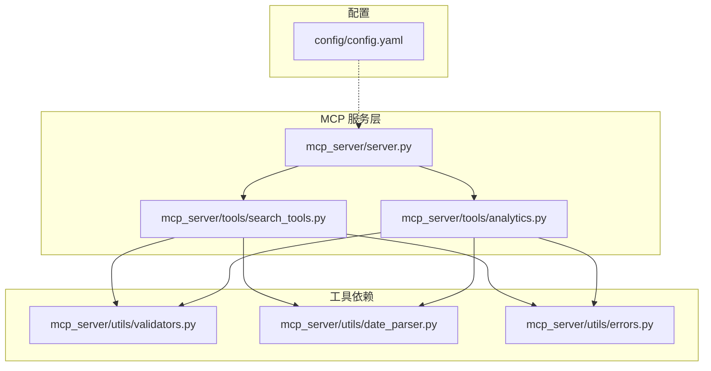
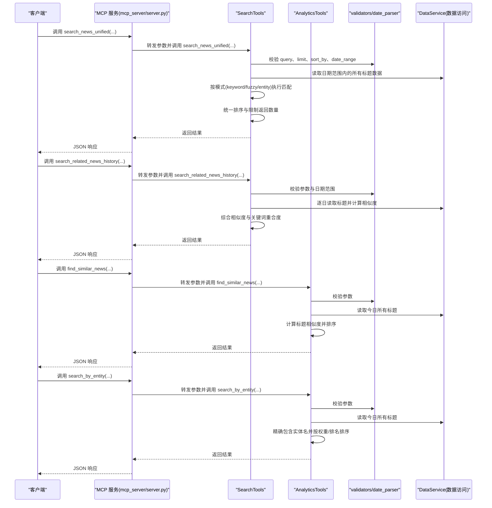
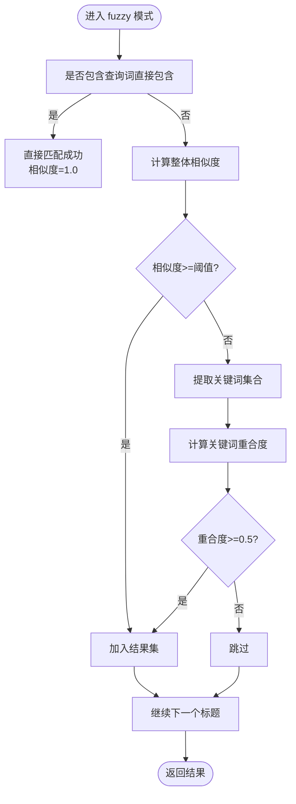
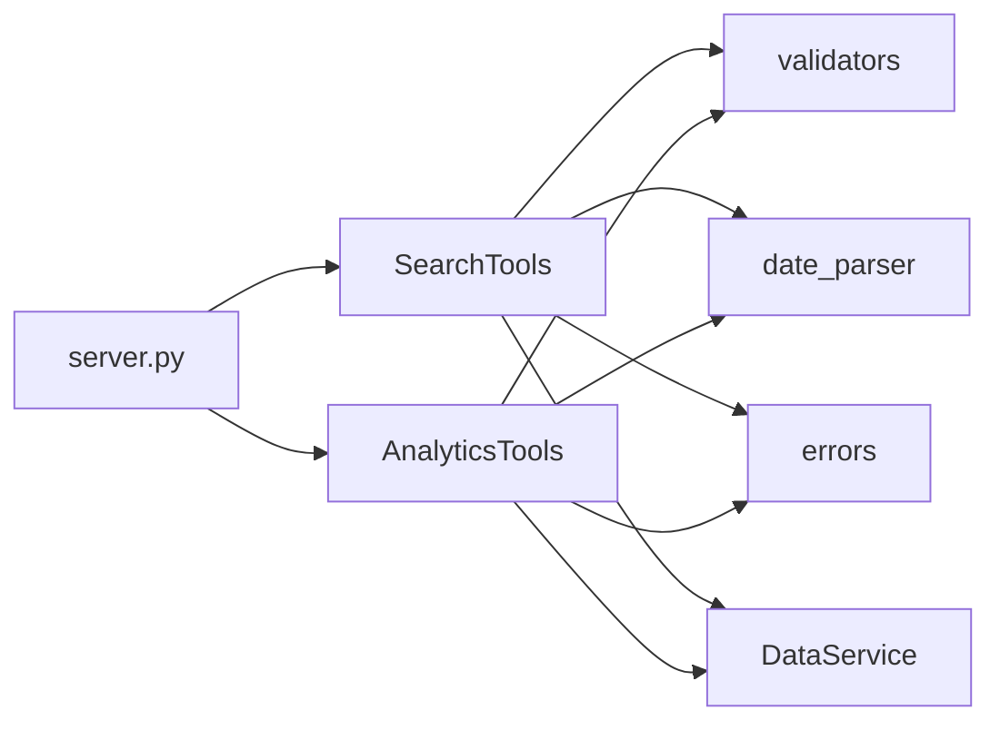

# 智能检索工具

<cite>
**本文引用的文件**
- [mcp_server/tools/search_tools.py](file://mcp_server/tools/search_tools.py)
- [mcp_server/tools/analytics.py](file://mcp_server/tools/analytics.py)
- [mcp_server/server.py](file://mcp_server/server.py)
- [mcp_server/utils/validators.py](file://mcp_server/utils/validators.py)
- [mcp_server/utils/date_parser.py](file://mcp_server/utils/date_parser.py)
- [mcp_server/utils/errors.py](file://mcp_server/utils/errors.py)
- [config/config.yaml](file://config/config.yaml)
</cite>

## 目录
1. [简介](#简介)
2. [项目结构](#项目结构)
3. [核心组件](#核心组件)
4. [架构总览](#架构总览)
5. [详细组件分析](#详细组件分析)
6. [依赖关系分析](#依赖关系分析)
7. [性能考量](#性能考量)
8. [故障排查指南](#故障排查指南)
9. [结论](#结论)
10. [附录](#附录)

## 简介
本文件面向“智能检索工具”的使用者与维护者，围绕四个核心API进行深入说明：search_news_unified、search_related_news_history、find_similar_news、search_by_entity。文档将系统阐述不同搜索模式（keyword、fuzzy、entity）的技术实现差异与适用场景；解释date_range、threshold、sort_by等关键参数的配置策略；提供跨平台新闻搜索、基于内容的相关性检索、标题相似度匹配与实体识别搜索的实际调用示例；并给出性能优化建议（如合理设置相似度阈值与结果限制）。

## 项目结构
智能检索工具位于 MCP 服务层，通过统一的工具注册接口对外提供能力，并由参数校验与日期解析工具保障输入合法性与一致性。

图表来源
- [mcp_server/server.py](file://mcp_server/server.py#L460-L782)
- [mcp_server/tools/search_tools.py](file://mcp_server/tools/search_tools.py#L1-L240)
- [mcp_server/tools/analytics.py](file://mcp_server/tools/analytics.py#L1-L120)
- [mcp_server/utils/validators.py](file://mcp_server/utils/validators.py#L1-L120)
- [mcp_server/utils/date_parser.py](file://mcp_server/utils/date_parser.py#L1-L120)
- [mcp_server/utils/errors.py](file://mcp_server/utils/errors.py#L1-L94)
- [config/config.yaml](file://config/config.yaml#L110-L140)

章节来源
- [mcp_server/server.py](file://mcp_server/server.py#L460-L782)
- [mcp_server/tools/search_tools.py](file://mcp_server/tools/search_tools.py#L1-L240)
- [mcp_server/tools/analytics.py](file://mcp_server/tools/analytics.py#L1-L120)
- [mcp_server/utils/validators.py](file://mcp_server/utils/validators.py#L1-L120)
- [mcp_server/utils/date_parser.py](file://mcp_server/utils/date_parser.py#L1-L120)
- [mcp_server/utils/errors.py](file://mcp_server/utils/errors.py#L1-L94)
- [config/config.yaml](file://config/config.yaml#L110-L140)

## 核心组件
- SearchTools：统一新闻搜索工具，支持 keyword/fuzzy/entity 三种模式，提供跨平台、跨日期范围的检索能力。
- AnalyticsTools：高级分析工具，提供相似新闻查找与实体识别搜索能力，并支持权重排序。
- 参数校验与日期解析：validators、date_parser 提供统一的参数校验、日期范围校验与自然语言日期解析。
- 错误体系：errors 提供统一的错误类型与错误字典转换。

章节来源
- [mcp_server/tools/search_tools.py](file://mcp_server/tools/search_tools.py#L18-L240)
- [mcp_server/tools/analytics.py](file://mcp_server/tools/analytics.py#L1-L120)
- [mcp_server/utils/validators.py](file://mcp_server/utils/validators.py#L1-L120)
- [mcp_server/utils/date_parser.py](file://mcp_server/utils/date_parser.py#L1-L120)
- [mcp_server/utils/errors.py](file://mcp_server/utils/errors.py#L1-L94)

## 架构总览
MCP 服务通过装饰器注册工具，对外暴露统一的搜索与分析接口。SearchTools 与 AnalyticsTools 共同构成智能检索能力，二者在参数校验、日期解析与错误处理方面保持一致的契约。

图表来源
- [mcp_server/server.py](file://mcp_server/server.py#L460-L782)
- [mcp_server/tools/search_tools.py](file://mcp_server/tools/search_tools.py#L38-L240)
- [mcp_server/tools/analytics.py](file://mcp_server/tools/analytics.py#L910-L1142)
- [mcp_server/utils/validators.py](file://mcp_server/utils/validators.py#L120-L210)
- [mcp_server/utils/date_parser.py](file://mcp_server/utils/date_parser.py#L330-L424)

## 详细组件分析

### API：search_news_unified（统一新闻搜索）
- 功能概述：整合 keyword、fuzzy、entity 三种搜索模式，支持跨平台、跨日期范围检索，提供统一排序与结果限制。
- 关键参数
  - query：查询内容（关键词、内容片段或实体名称）
  - search_mode：搜索模式（keyword/fuzzy/entity）
  - date_range：日期范围（{"start":"YYYY-MM-DD","end":"YYYY-MM-DD"}）
  - platforms：平台过滤列表（如 ['zhihu','weibo']）
  - limit：返回条数限制
  - sort_by：排序方式（relevance/weight/date）
  - threshold：模糊模式下的相似度阈值（0-1）
  - include_url：是否包含URL链接
- 模式差异与适用场景
  - keyword：精确包含匹配，适用于确定性强的关键词搜索，返回结果相似度为1.0。
  - fuzzy：综合相似度（整体相似度、关键词重合度），适用于内容片段或模糊语义匹配，需合理设置阈值。
  - entity：精确包含实体名，适用于人物、地点、机构等实体识别，返回结果相似度为1.0。
- 排序策略
  - relevance：按相似度分数排序（fuzzy模式）或按权重排序（weight模式）。
  - weight：按新闻权重排序（综合排名、频次、热度）。
  - date：按日期倒序排序。
- 日期范围处理
  - 若未提供 date_range，默认使用可用数据的最新日期（避免使用当前系统时间）。
  - 支持单日与多日范围遍历，逐日读取标题并合并结果。
- 错误处理
  - 无效参数抛出 InvalidParameterError。
  - 无数据时返回成功但空结果与友好提示。
- 性能要点
  - 合理设置 limit，避免一次性返回过多数据。
  - fuzzy 模式下适当提高 threshold，减少低质量匹配。
  - 使用 platforms 过滤缩小搜索范围。

章节来源
- [mcp_server/tools/search_tools.py](file://mcp_server/tools/search_tools.py#L38-L240)
- [mcp_server/tools/search_tools.py](file://mcp_server/tools/search_tools.py#L242-L390)
- [mcp_server/tools/search_tools.py](file://mcp_server/tools/search_tools.py#L391-L467)
- [mcp_server/utils/validators.py](file://mcp_server/utils/validators.py#L145-L210)
- [mcp_server/utils/date_parser.py](file://mcp_server/utils/date_parser.py#L330-L424)

#### 模式实现流程图（fuzzy）

图表来源
- [mcp_server/tools/search_tools.py](file://mcp_server/tools/search_tools.py#L405-L467)

### API：search_related_news_history（历史相关新闻检索）
- 功能概述：基于参考新闻（标题或内容），在历史数据中检索相关内容，综合相似度与关键词重合度进行评分。
- 关键参数
  - reference_text：参考新闻标题或内容
  - time_preset：时间范围预设（yesterday/last_week/last_month/custom）
  - start_date/end_date：自定义日期范围（仅当 time_preset="custom"）
  - threshold：相关性阈值（0-1）
  - limit：返回条数限制
  - include_url：是否包含URL链接
- 相似度计算
  - 标题整体相似度（基于 difflib.SequenceMatcher）
  - 关键词重合度（Jaccard 相似度）
  - 综合相似度 = 0.7 × 关键词重合度 + 0.3 × 标题整体相似度
- 适用场景
  - 事件回溯：在历史数据中寻找与某事件相关的前后文或关联新闻。
  - 内容扩展：基于已有新闻标题扩展相关话题的检索范围。
- 性能要点
  - 合理设置 threshold，避免返回过多噪声。
  - 使用 custom 时明确起止日期，减少不必要的遍历。

章节来源
- [mcp_server/tools/search_tools.py](file://mcp_server/tools/search_tools.py#L494-L702)
- [mcp_server/tools/search_tools.py](file://mcp_server/tools/search_tools.py#L566-L633)
- [mcp_server/utils/validators.py](file://mcp_server/utils/validators.py#L145-L210)

### API：find_similar_news（标题相似度匹配）
- 功能概述：在今日数据中，基于参考标题计算与其他标题的相似度，返回相似度最高的新闻列表。
- 关键参数
  - reference_title：参考标题
  - threshold：相似度阈值（0-1）
  - limit：返回条数限制
  - include_url：是否包含URL链接
- 相似度计算
  - 基于 difflib.SequenceMatcher 的整体相似度。
- 适用场景
  - 标题去重：快速发现与某标题高度相似的新闻。
  - 内容复现：定位与某篇报道风格相近的其他平台新闻。
- 性能要点
  - 适当提高 threshold，减少低质量匹配。
  - limit 控制返回规模，避免过多相似度相近的结果。

章节来源
- [mcp_server/tools/analytics.py](file://mcp_server/tools/analytics.py#L910-L1015)
- [mcp_server/tools/analytics.py](file://mcp_server/tools/analytics.py#L944-L991)

### API：search_by_entity（实体识别搜索）
- 功能概述：在今日数据中，搜索包含特定实体（人物/地点/机构）的新闻，并提供实体周边关键词统计。
- 关键参数
  - entity：实体名称
  - entity_type：实体类型（person/location/organization，可选）
  - limit：返回条数限制
  - sort_by_weight：是否按权重排序（默认True）
- 排序策略
  - sort_by_weight=True：按新闻权重排序（综合排名、频次、热度）。
  - sort_by_weight=False：按首次排名排序。
- 适用场景
  - 人物/机构追踪：快速定位与某实体相关的所有新闻。
  - 话题聚合：结合实体周边关键词，辅助理解实体相关话题。
- 性能要点
  - 合理设置 limit，避免返回过多结果。
  - 若需快速浏览，可关闭权重排序，按排名排序更快。

章节来源
- [mcp_server/tools/analytics.py](file://mcp_server/tools/analytics.py#L1030-L1142)
- [mcp_server/tools/analytics.py](file://mcp_server/tools/analytics.py#L1117-L1141)

## 依赖关系分析
- SearchTools 依赖 validators（参数校验）、date_parser（日期范围解析）、errors（错误类型）、DataService（数据读取）。
- AnalyticsTools 依赖 validators、date_parser、errors、DataService，并提供 find_similar_news 与 search_by_entity 的实现。
- server.py 通过装饰器注册工具，将上述能力暴露为 MCP 工具。

图表来源
- [mcp_server/tools/search_tools.py](file://mcp_server/tools/search_tools.py#L1-L40)
- [mcp_server/tools/analytics.py](file://mcp_server/tools/analytics.py#L1-L25)
- [mcp_server/server.py](file://mcp_server/server.py#L460-L583)

章节来源
- [mcp_server/tools/search_tools.py](file://mcp_server/tools/search_tools.py#L1-L40)
- [mcp_server/tools/analytics.py](file://mcp_server/tools/analytics.py#L1-L25)
- [mcp_server/server.py](file://mcp_server/server.py#L460-L583)

## 性能考量
- 相似度阈值设置
  - fuzzy 模式：建议从 0.4~0.6 开始尝试，逐步提高以减少噪声。
  - search_related_news_history：建议从 0.3~0.5 开始尝试，综合相似度权重较高，可适当放宽。
  - find_similar_news：建议从 0.6~0.8 开始尝试，标题相似度要求更高。
- 结果限制
  - 合理设置 limit，避免一次性返回过多数据导致响应缓慢与token浪费。
  - 对于 keyword 与 entity 模式，若命中较多，建议配合 platforms 过滤平台缩小范围。
- 排序策略
  - relevance 模式下，fuzzy 模式按相似度排序；entity 模式按权重排序。
  - weight 模式下，综合排名、频次、热度，适合热点聚合场景。
  - date 模式下，按日期倒序，适合时间线梳理。
- 日期范围
  - 默认使用可用数据的最新日期，避免无效查询。
  - 自定义日期范围时，尽量缩短时间跨度，减少遍历成本。

[本节为通用指导，无需引用具体文件]

## 故障排查指南
- 常见错误类型
  - INVALID_PARAMETER：参数格式或取值不合法（如模式、排序方式、日期范围、阈值范围）。
  - DATA_NOT_FOUND：未找到匹配结果或无可用数据。
  - INTERNAL_ERROR：内部异常，建议检查输入参数与数据目录。
- 常见问题定位
  - 日期范围未来或过远：validators.validate_date_range 会拒绝未来日期与过远日期。
  - 无可用数据：search_news_unified 在未提供 date_range 时会使用可用数据的最新日期，若无数据则返回友好提示。
  - 平台不支持：validators.validate_platforms 会校验平台列表，不支持的平台会报错。
- 建议排查步骤
  - 确认参数类型与取值范围（如 threshold 在 0~1 之间）。
  - 使用 resolve_date_range 工具解析自然语言日期，确保 date_range 格式正确。
  - 检查 platforms 是否在 config.yaml 中配置。
  - 若返回空结果，尝试放宽阈值或扩大日期范围。

章节来源
- [mcp_server/utils/validators.py](file://mcp_server/utils/validators.py#L145-L210)
- [mcp_server/utils/validators.py](file://mcp_server/utils/validators.py#L212-L352)
- [mcp_server/utils/errors.py](file://mcp_server/utils/errors.py#L1-L94)
- [mcp_server/server.py](file://mcp_server/server.py#L40-L109)

## 结论
- search_news_unified 提供统一入口，支持 keyword/fuzzy/entity 三种模式与跨平台、跨日期范围检索，适合日常热点聚合与多模态检索需求。
- search_related_news_history 通过综合相似度与关键词重合度，帮助回溯历史相关新闻，适合事件关联分析。
- find_similar_news 专注于标题相似度匹配，适合去重与内容复现场景。
- search_by_entity 专注于实体识别与周边话题聚合，适合人物/机构追踪与话题聚类。
- 合理设置阈值与结果限制、选择合适的排序策略、使用平台过滤与日期范围，是获得高质量检索结果的关键。

[本节为总结性内容，无需引用具体文件]

## 附录

### 实际调用示例（基于工具注册与参数说明）
- 跨平台新闻搜索（keyword 模式）
  - 调用 search_news_unified(query="人工智能", search_mode="keyword", platforms=["zhihu","weibo"], limit=50)
- 基于内容的相关性检索（fuzzy 模式）
  - 调用 search_news_unified(query="特斯拉降价", search_mode="fuzzy", threshold=0.4, limit=50)
- 标题相似度匹配
  - 调用 find_similar_news(reference_title="iPhone 16 发布", threshold=0.6, limit=50)
- 实体识别搜索
  - 调用 search_by_entity(entity="马斯克", entity_type="person", limit=20, sort_by_weight=True)
- 历史相关新闻检索
  - 调用 search_related_news_history(reference_text="人工智能技术突破", time_preset="last_week", threshold=0.4, limit=50)

章节来源
- [mcp_server/server.py](file://mcp_server/server.py#L460-L782)
- [mcp_server/tools/search_tools.py](file://mcp_server/tools/search_tools.py#L38-L240)
- [mcp_server/tools/analytics.py](file://mcp_server/tools/analytics.py#L910-L1142)

### 关键参数配置策略
- date_range
  - 未提供时：默认使用可用数据的最新日期。
  - 自定义时：使用 resolve_date_range 工具解析自然语言日期，确保 start ≤ end 且不为未来日期。
- threshold
  - keyword/fuzzy/entity：fuzzy 模式建议 0.4~0.6；search_related_news_history 建议 0.3~0.5；find_similar_news 建议 0.6~0.8。
- sort_by
  - relevance：按相似度或权重排序。
  - weight：按权重排序，适合热点聚合。
  - date：按日期排序，适合时间线梳理。
- include_url
  - 默认关闭以节省token，需要链接时再开启。

章节来源
- [mcp_server/server.py](file://mcp_server/server.py#L40-L109)
- [mcp_server/utils/validators.py](file://mcp_server/utils/validators.py#L145-L210)
- [mcp_server/utils/date_parser.py](file://mcp_server/utils/date_parser.py#L330-L424)