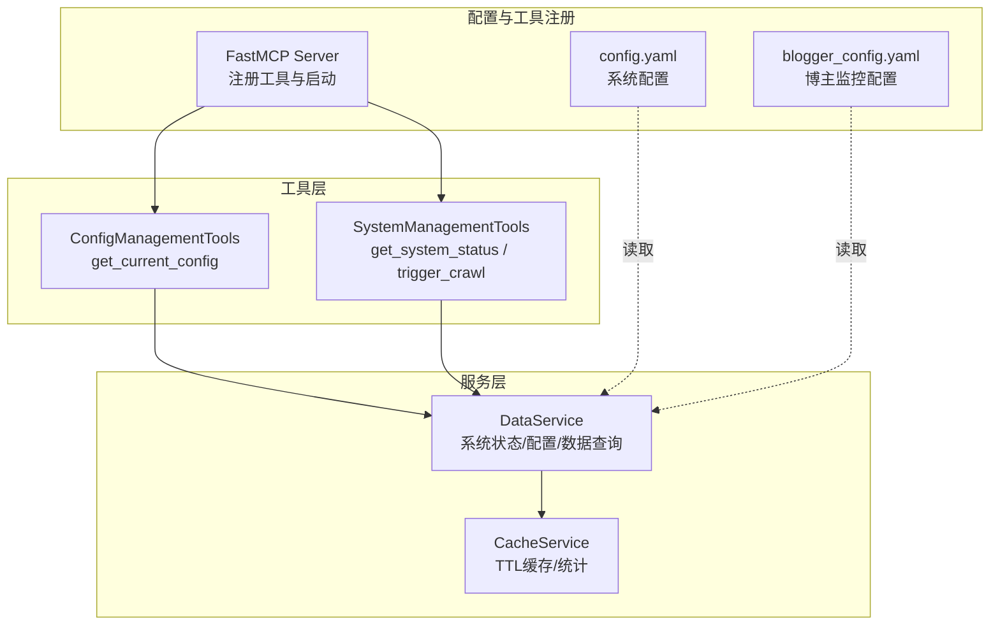
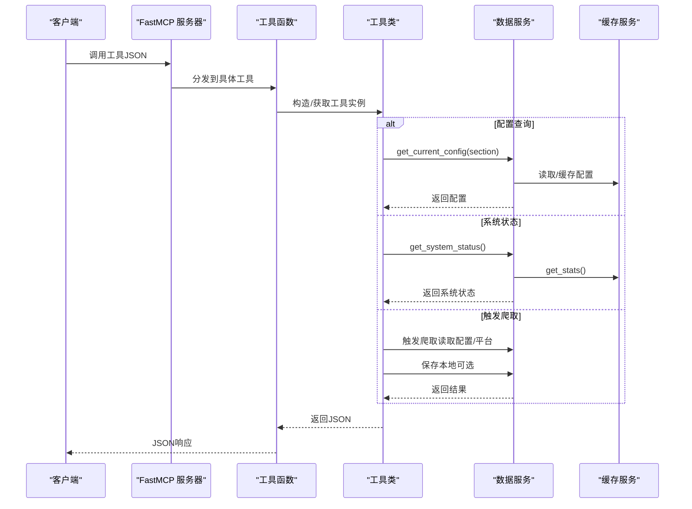
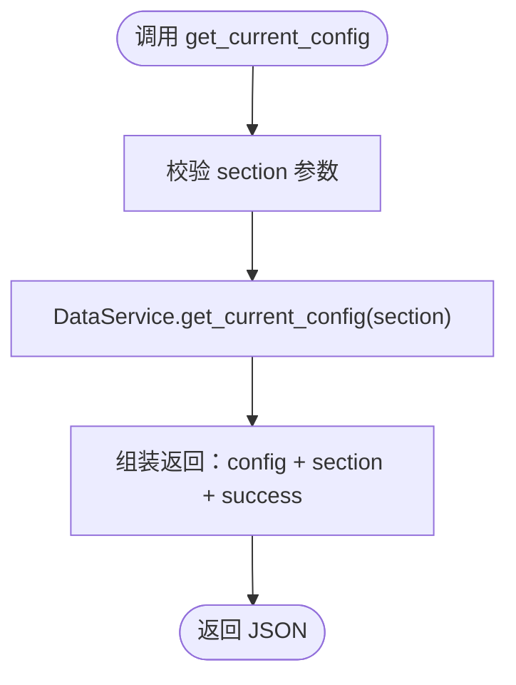
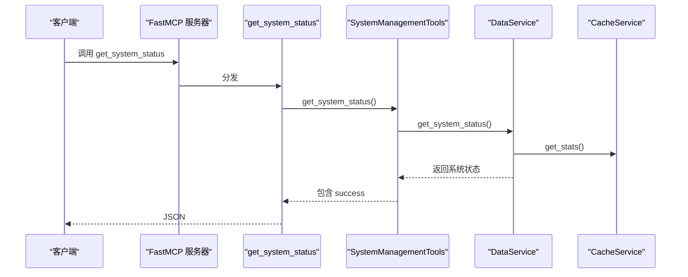
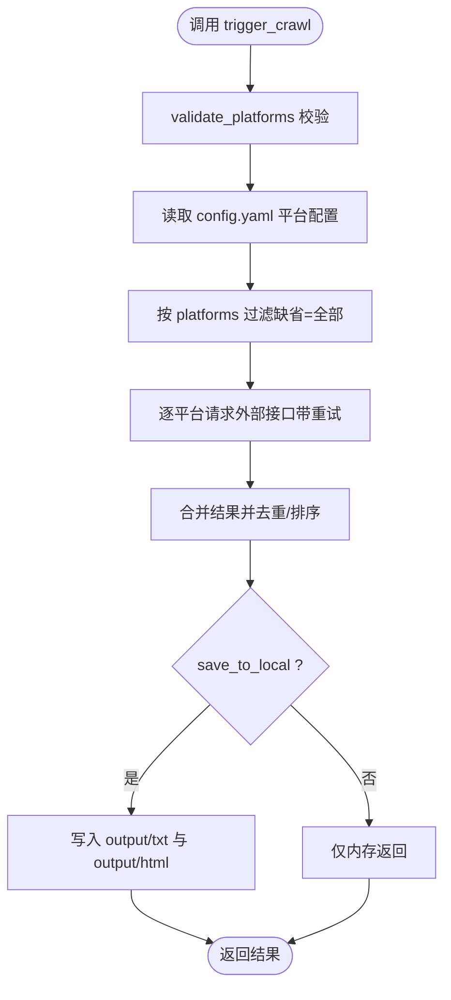
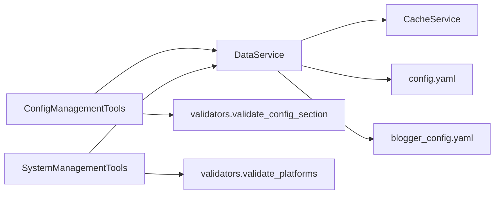

# 系统管理工具

<cite>
**本文引用的文件**
- [mcp_server/server.py](file://mcp_server/server.py)
- [mcp_server/tools/config_mgmt.py](file://mcp_server/tools/config_mgmt.py)
- [mcp_server/tools/system.py](file://mcp_server/tools/system.py)
- [mcp_server/services/data_service.py](file://mcp_server/services/data_service.py)
- [mcp_server/services/cache_service.py](file://mcp_server/services/cache_service.py)
- [mcp_server/utils/validators.py](file://mcp_server/utils/validators.py)
- [mcp_server/utils/errors.py](file://mcp_server/utils/errors.py)
- [config/config.yaml](file://config/config.yaml)
- [config/blogger_config.yaml](file://config/blogger_config.yaml)
- [docs/Deployment-Guide.md](file://docs/Deployment-Guide.md)
</cite>

## 目录
1. [简介](#简介)
2. [项目结构](#项目结构)
3. [核心组件](#核心组件)
4. [架构总览](#架构总览)
5. [详细组件分析](#详细组件分析)
6. [依赖关系分析](#依赖关系分析)
7. [性能考量](#性能考量)
8. [故障排查指南](#故障排查指南)
9. [结论](#结论)
10. [附录](#附录)

## 简介
本文件面向系统管理员与运维工程师，系统性阐述 TrendRadar MCP 服务器中的三类系统管理能力：
- 获取当前配置：支持按节（all、crawler、push、keywords、weights）查询配置，便于快速核对爬虫、推送、关键词与权重等参数。
- 获取系统状态：返回系统版本、数据存储、缓存统计与健康状态等指标，辅助日常巡检与容量规划。
- 手动触发爬取：支持按平台指定、本地持久化与URL包含等参数，满足应急抓取与离线归档需求。

同时，文档解释“uptime”“memory_usage”“hit_rate”等健康检查指标的监控意义，并给出最佳实践建议，包括定期状态检查与按需触发爬取。

## 项目结构
系统管理工具位于 MCP 服务器的工具层，通过 FastMCP 注册为可调用工具。核心文件组织如下：
- mcp_server/server.py：注册工具（含 get_current_config、get_system_status、trigger_crawl），并提供 HTTP/stdio 启动入口。
- mcp_server/tools/config_mgmt.py：配置查询工具，封装按节获取配置的逻辑。
- mcp_server/tools/system.py：系统管理工具，封装系统状态查询与手动触发爬取。
- mcp_server/services/data_service.py：数据服务，负责系统状态统计、配置读取与缓存统计。
- mcp_server/services/cache_service.py：缓存服务，提供 TTL 缓存与统计。
- mcp_server/utils/validators.py：参数校验工具，统一校验平台、配置节等参数。
- mcp_server/utils/errors.py：自定义错误类型，规范错误返回。
- config/config.yaml：系统配置（爬虫、推送、权重、平台等）。
- config/blogger_config.yaml：博主监控配置（与系统管理工具同属管理范畴）。
- docs/Deployment-Guide.md：部署与运维指南，包含健康检查端点与监控建议。

图表来源
- [mcp_server/server.py](file://mcp_server/server.py#L585-L658)
- [mcp_server/tools/config_mgmt.py](file://mcp_server/tools/config_mgmt.py#L26-L67)
- [mcp_server/tools/system.py](file://mcp_server/tools/system.py#L33-L376)
- [mcp_server/services/data_service.py](file://mcp_server/services/data_service.py#L411-L604)
- [mcp_server/services/cache_service.py](file://mcp_server/services/cache_service.py#L1-L137)
- [config/config.yaml](file://config/config.yaml#L1-L140)
- [config/blogger_config.yaml](file://config/blogger_config.yaml#L1-L60)

章节来源
- [mcp_server/server.py](file://mcp_server/server.py#L585-L658)
- [config/config.yaml](file://config/config.yaml#L1-L140)

## 核心组件
- 配置查询工具（get_current_config）
  - 功能：按节返回当前系统配置，支持 all、crawler、push、keywords、weights。
  - 输入：section（字符串，缺省=all）。
  - 输出：包含 config、section、success 字段；失败时返回 error 字段。
  - 依赖：DataService.get_current_config、参数校验 validate_config_section。
- 系统状态工具（get_system_status）
  - 功能：返回系统版本、数据存储、缓存统计与健康状态。
  - 输出：包含 system、data、cache、health、success 等字段。
  - 依赖：DataService.get_system_status、CacheService.get_stats。
- 爬取触发工具（trigger_crawl）
  - 功能：手动触发一次临时爬取任务，可选保存到本地 output 目录。
  - 输入：platforms（平台ID列表，缺省=使用配置中的全部平台）、save_to_local（是否保存）、include_url（是否包含URL）。
  - 输出：包含 task_id、status、crawl_time、platforms、total_news、failed_platforms、data、saved_to_local、note 等；若保存成功包含 saved_files；失败包含 error。
  - 依赖：DataService、validators.validate_platforms、CrawlTaskError、外部新闻接口。

章节来源
- [mcp_server/tools/config_mgmt.py](file://mcp_server/tools/config_mgmt.py#L26-L67)
- [mcp_server/tools/system.py](file://mcp_server/tools/system.py#L33-L376)
- [mcp_server/server.py](file://mcp_server/server.py#L585-L658)
- [mcp_server/services/data_service.py](file://mcp_server/services/data_service.py#L411-L604)
- [mcp_server/services/cache_service.py](file://mcp_server/services/cache_service.py#L101-L119)

## 架构总览
系统管理工具通过 FastMCP 工具注册，统一对外暴露为 JSON 接口。调用链路如下：
- 客户端调用工具（HTTP/stdio）。
- 服务器路由到对应工具函数（get_current_config、get_system_status、trigger_crawl）。
- 工具函数委托至工具类（ConfigManagementTools/SystemManagementTools）。
- 工具类进一步调用数据服务（DataService）与缓存服务（CacheService）。
- 参数校验与错误处理由 validators 与 errors 统一提供。

图表来源
- [mcp_server/server.py](file://mcp_server/server.py#L585-L658)
- [mcp_server/tools/config_mgmt.py](file://mcp_server/tools/config_mgmt.py#L26-L67)
- [mcp_server/tools/system.py](file://mcp_server/tools/system.py#L33-L376)
- [mcp_server/services/data_service.py](file://mcp_server/services/data_service.py#L411-L604)
- [mcp_server/services/cache_service.py](file://mcp_server/services/cache_service.py#L101-L119)

## 详细组件分析

### 配置查询工具（get_current_config）
- 功能要点
  - 支持按节查询：all、crawler、push、keywords、weights。
  - 自动校验 section 参数，非法值将被拒绝。
  - 返回结构包含 config、section、success；失败时返回 error。
- 关键实现路径
  - 工具函数：[mcp_server/server.py](file://mcp_server/server.py#L587-L608)
  - 工具类方法：[mcp_server/tools/config_mgmt.py](file://mcp_server/tools/config_mgmt.py#L26-L67)
  - 数据服务实现：[mcp_server/services/data_service.py](file://mcp_server/services/data_service.py#L411-L496)
  - 参数校验：[mcp_server/utils/validators.py](file://mcp_server/utils/validators.py#L292-L307)
- 配置节说明
  - all：返回 crawler、push、keywords、weights 四节的聚合。
  - crawler：爬虫开关、代理、请求间隔、平台列表等。
  - push：通知开关、通道、推送窗口等。
  - keywords：个人关注词组与总数。
  - weights：排名、频次、热度权重。
- 使用建议
  - 在变更配置后，先用 section=all 核对生效情况。
  - 仅在需要时使用具体节（如 crawler、push）缩小排查范围。

图表来源
- [mcp_server/server.py](file://mcp_server/server.py#L587-L608)
- [mcp_server/tools/config_mgmt.py](file://mcp_server/tools/config_mgmt.py#L26-L67)
- [mcp_server/services/data_service.py](file://mcp_server/services/data_service.py#L411-L496)
- [mcp_server/utils/validators.py](file://mcp_server/utils/validators.py#L292-L307)

章节来源
- [mcp_server/server.py](file://mcp_server/server.py#L587-L608)
- [mcp_server/tools/config_mgmt.py](file://mcp_server/tools/config_mgmt.py#L26-L67)
- [mcp_server/services/data_service.py](file://mcp_server/services/data_service.py#L411-L496)
- [mcp_server/utils/validators.py](file://mcp_server/utils/validators.py#L292-L307)

### 系统状态工具（get_system_status）
- 功能要点
  - 返回系统版本、项目根目录、数据存储总量、最早/最新记录日期、缓存统计与健康状态。
  - 健康状态字段为字符串（如 healthy），便于快速判断。
- 关键实现路径
  - 工具函数：[mcp_server/server.py](file://mcp_server/server.py#L610-L623)
  - 工具类方法：[mcp_server/tools/system.py](file://mcp_server/tools/system.py#L33-L66)
  - 数据服务实现：[mcp_server/services/data_service.py](file://mcp_server/services/data_service.py#L538-L604)
  - 缓存统计：[mcp_server/services/cache_service.py](file://mcp_server/services/cache_service.py#L101-L119)
- 指标解读
  - system.version：当前版本号，用于确认升级是否生效。
  - data.total_storage：output 目录占用空间，用于容量预警。
  - data.oldest_record/latest_record：数据覆盖时间范围，用于确认数据连续性。
  - cache.total_entries/oldest/newest_entry_age：缓存规模与新鲜度，用于评估缓存命中与回收效率。
  - health：系统健康状态字符串，便于自动化巡检。
- 监控建议
  - 结合 Deployment-Guide 的健康检查端点与脚本，定期巡检 uptime、memory_usage、hit_rate 等指标。
  - 当 total_storage 持续增长时，结合 oldest_record/latest_record 判断是否需要清理历史数据。

图表来源
- [mcp_server/server.py](file://mcp_server/server.py#L610-L623)
- [mcp_server/tools/system.py](file://mcp_server/tools/system.py#L33-L66)
- [mcp_server/services/data_service.py](file://mcp_server/services/data_service.py#L538-L604)
- [mcp_server/services/cache_service.py](file://mcp_server/services/cache_service.py#L101-L119)

章节来源
- [mcp_server/server.py](file://mcp_server/server.py#L610-L623)
- [mcp_server/tools/system.py](file://mcp_server/tools/system.py#L33-L66)
- [mcp_server/services/data_service.py](file://mcp_server/services/data_service.py#L538-L604)
- [mcp_server/services/cache_service.py](file://mcp_server/services/cache_service.py#L101-L119)

### 爬取触发工具（trigger_crawl）
- 功能要点
  - 支持按平台指定（platforms），默认使用 config.yaml 中配置的全部平台。
  - 可选保存到本地 output 目录（txt/html），便于离线归档与审计。
  - 可选包含 URL 字段（include_url），节省 token 开销。
- 关键实现路径
  - 工具函数：[mcp_server/server.py](file://mcp_server/server.py#L625-L658)
  - 工具类方法：[mcp_server/tools/system.py](file://mcp_server/tools/system.py#L68-L376)
  - 参数校验：[mcp_server/utils/validators.py](file://mcp_server/utils/validators.py#L43-L88)
  - 错误类型：[mcp_server/utils/errors.py](file://mcp_server/utils/errors.py#L74-L83)
  - 配置读取：[config/config.yaml](file://config/config.yaml#L116-L140)
- 参数说明
  - platforms：平台ID列表，如 ['zhihu', 'weibo']；为空或缺省时使用配置中的全部平台。
  - save_to_local：是否保存到 output 目录（默认 False）。
  - include_url：是否包含 URL（默认 False）。
- 返回说明
  - 成功：包含 task_id、status、crawl_time、platforms、total_news、failed_platforms、data、saved_to_local、note；若保存成功包含 saved_files。
  - 失败：包含 error 字段（含 code/message/suggestion）。
- 使用建议
  - 在紧急事件或突发热点时，按需触发爬取并开启 save_to_local 以便留存。
  - 若仅做快速验证，可关闭 include_url 以减少 token 消耗。
  - 失败平台会列在 failed_platforms 中，便于针对性排查。

图表来源
- [mcp_server/server.py](file://mcp_server/server.py#L625-L658)
- [mcp_server/tools/system.py](file://mcp_server/tools/system.py#L68-L376)
- [mcp_server/utils/validators.py](file://mcp_server/utils/validators.py#L43-L88)
- [config/config.yaml](file://config/config.yaml#L116-L140)

章节来源
- [mcp_server/server.py](file://mcp_server/server.py#L625-L658)
- [mcp_server/tools/system.py](file://mcp_server/tools/system.py#L68-L376)
- [mcp_server/utils/validators.py](file://mcp_server/utils/validators.py#L43-L88)
- [config/config.yaml](file://config/config.yaml#L116-L140)

## 依赖关系分析
- 工具层依赖
  - ConfigManagementTools 依赖 DataService 与 validate_config_section。
  - SystemManagementTools 依赖 DataService、validate_platforms、CrawlTaskError。
- 服务层依赖
  - DataService 依赖 CacheService 与 ParserService（未在本文展开）。
  - CacheService 提供 get_stats，用于系统状态中的缓存统计。
- 配置依赖
  - config.yaml 提供 platforms、crawler、notification、weight 等配置项。
  - blogger_config.yaml 提供博主监控配置（与系统管理工具同属管理范畴）。

图表来源
- [mcp_server/tools/config_mgmt.py](file://mcp_server/tools/config_mgmt.py#L26-L67)
- [mcp_server/tools/system.py](file://mcp_server/tools/system.py#L33-L66)
- [mcp_server/services/data_service.py](file://mcp_server/services/data_service.py#L411-L604)
- [mcp_server/services/cache_service.py](file://mcp_server/services/cache_service.py#L101-L119)
- [mcp_server/utils/validators.py](file://mcp_server/utils/validators.py#L43-L88)
- [config/config.yaml](file://config/config.yaml#L1-L140)
- [config/blogger_config.yaml](file://config/blogger_config.yaml#L1-L60)

章节来源
- [mcp_server/tools/config_mgmt.py](file://mcp_server/tools/config_mgmt.py#L26-L67)
- [mcp_server/tools/system.py](file://mcp_server/tools/system.py#L33-L66)
- [mcp_server/services/data_service.py](file://mcp_server/services/data_service.py#L411-L604)
- [mcp_server/services/cache_service.py](file://mcp_server/services/cache_service.py#L101-L119)
- [mcp_server/utils/validators.py](file://mcp_server/utils/validators.py#L43-L88)
- [config/config.yaml](file://config/config.yaml#L1-L140)
- [config/blogger_config.yaml](file://config/blogger_config.yaml#L1-L60)

## 性能考量
- 缓存命中与新鲜度
  - 缓存统计（total_entries、oldest_entry_age、newest_entry_age）可用于评估缓存命中率与回收效率。
  - 建议结合业务热点周期调整缓存 TTL，平衡延迟与一致性。
- 爬取间隔与重试
  - request_interval 控制请求间隔，避免过于频繁导致外部接口限流。
  - 爬取过程内置重试与随机抖动，降低偶发失败的影响。
- 输出目录与磁盘压力
  - save_to_local 会产生大量 txt/html 文件，需定期清理历史数据，避免磁盘占用过高。
- HTTP 健康检查
  - Deployment-Guide 提供健康检查端点与脚本，建议纳入自动化巡检。

[本节为通用指导，不直接分析具体文件]

## 故障排查指南
- 配置查询失败
  - 检查 section 是否为合法值（all、crawler、push、keywords、weights）。
  - 确认 config.yaml 可读且格式正确。
- 系统状态异常
  - 若 data.total_storage 持续增长且 oldest_record 不变，可能存在数据生成异常或未清理历史。
  - cache.total_entries 异常升高可能意味着缓存未及时回收，检查 TTL 与清理策略。
- 爬取触发失败
  - platforms 参数校验失败：确认平台ID存在于 config.yaml 的 platforms 列表。
  - 外部接口不可达：观察 failed_platforms，重试或调整请求间隔。
  - 保存失败：检查 output 目录权限与磁盘空间。
- 常见错误类型
  - InvalidParameterError：参数格式或范围不合法。
  - CrawlTaskError：爬取任务异常。
  - DataNotFoundError：数据不存在。

章节来源
- [mcp_server/utils/errors.py](file://mcp_server/utils/errors.py#L10-L94)
- [mcp_server/utils/validators.py](file://mcp_server/utils/validators.py#L43-L88)
- [mcp_server/tools/system.py](file://mcp_server/tools/system.py#L68-L376)
- [docs/Deployment-Guide.md](file://docs/Deployment-Guide.md#L334-L409)

## 结论
本文围绕系统管理工具的三大能力（get_current_config、get_system_status、trigger_crawl）进行了深入解析，明确了参数语义、返回结构与最佳实践。通过合理利用配置节查询、系统状态指标与按需爬取，可显著提升系统的可观测性与运维效率。建议将系统状态巡检与健康检查端点纳入自动化运维流程，并根据业务负载动态调整缓存与爬取策略。

[本节为总结性内容，不直接分析具体文件]

## 附录

### A. 系统状态返回字段说明
- system.version：系统版本号。
- system.project_root：项目根目录路径。
- data.total_storage：数据存储总量（MB）。
- data.oldest_record/latest_record：最早/最新记录日期。
- cache.total_entries：缓存条目总数。
- cache.oldest_entry_age/newest_entry_age：最老/最新缓存条目的存活时间（秒）。
- health：系统健康状态（字符串）。

章节来源
- [mcp_server/services/data_service.py](file://mcp_server/services/data_service.py#L538-L604)
- [mcp_server/services/cache_service.py](file://mcp_server/services/cache_service.py#L101-L119)

### B. 配置节字段说明（节选）
- crawler：enable_crawler、use_proxy、request_interval、retry_times、platforms。
- push：enable_notification、enabled_channels、message_batch_size、push_window。
- keywords：word_groups、total_groups。
- weights：rank_weight、frequency_weight、hotness_weight。
- platforms：平台ID与名称列表。

章节来源
- [mcp_server/services/data_service.py](file://mcp_server/services/data_service.py#L411-L496)
- [config/config.yaml](file://config/config.yaml#L1-L140)

### C. 最佳实践清单
- 定期状态检查
  - 使用 get_system_status 检查 data.total_storage、cache 统计与 health。
  - 结合 Deployment-Guide 的健康检查端点与脚本，纳入巡检。
- 按需触发爬取
  - 在热点事件发生时，按平台指定触发爬取并开启 save_to_local。
  - 仅在必要时开启 include_url，以节省 token。
- 配置变更核对
  - 变更后使用 get_current_config(section=all) 核对生效。
  - 仅在定位问题时使用具体节（crawler、push、keywords、weights）缩小范围。

章节来源
- [mcp_server/server.py](file://mcp_server/server.py#L585-L658)
- [docs/Deployment-Guide.md](file://docs/Deployment-Guide.md#L334-L409)