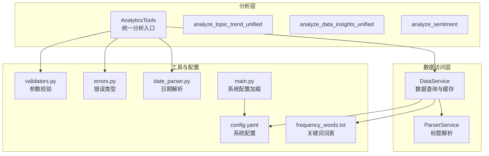
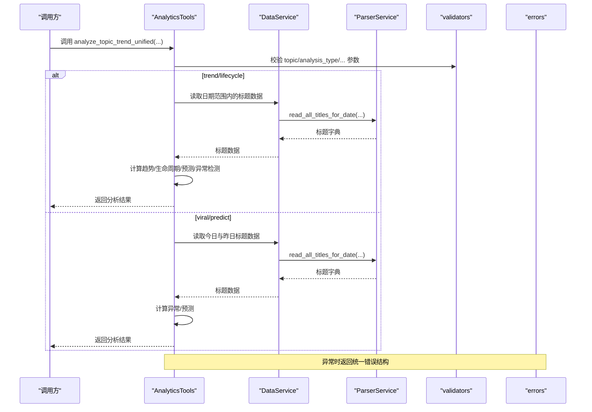
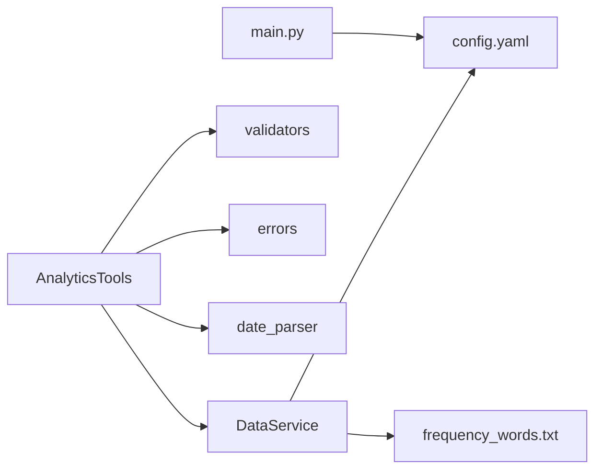

# 高级分析工具

<cite>
**本文引用的文件**
- [analytics.py](file://mcp_server/tools/analytics.py)
- [data_service.py](file://mcp_server/services/data_service.py)
- [validators.py](file://mcp_server/utils/validators.py)
- [errors.py](file://mcp_server/utils/errors.py)
- [date_parser.py](file://mcp_server/utils/date_parser.py)
- [config.yaml](file://config/config.yaml)
- [frequency_words.txt](file://config/frequency_words.txt)
- [main.py](file://main.py)
- [MCP-API-Reference.md](file://docs/MCP-API-Reference.md)
</cite>

## 目录
1. [简介](#简介)
2. [项目结构](#项目结构)
3. [核心组件](#核心组件)
4. [架构总览](#架构总览)
5. [详细组件分析](#详细组件分析)
6. [依赖关系分析](#依赖关系分析)
7. [性能考量](#性能考量)
8. [故障排查指南](#故障排查指南)
9. [结论](#结论)
10. [附录](#附录)

## 简介
本文件面向“高级分析工具”的使用者与维护者，系统化梳理并解读以下核心分析能力：
- 统一话题趋势分析：trend（热度趋势）、lifecycle（生命周期）、viral（异常热度检测）、predict（趋势预测）
- 统一数据洞察：platform_compare（平台对比）、platform_activity（平台活跃度）、keyword_cooccur（关键词共现）
- 情感倾向分析：生成结构化提示词，辅助AI进行情感分析

文档重点覆盖：
- 各分析类型的算法逻辑与业务价值
- 关键参数（granularity、threshold、lookahead_hours等）的配置与调优
- 返回数据结构与典型示例
- 如何将分析结果用于商业决策与趋势预测

## 项目结构
高级分析工具位于 mcp_server/tools/analytics.py，围绕统一入口方法 analyze_topic_trend_unified 与 analyze_data_insights_unified，分别提供趋势、生命周期、异常检测、预测与平台对比、活跃度、关键词共现等能力；数据访问由 mcp_server/services/data_service.py 提供，参数校验与错误类型由 validators.py、errors.py、date_parser.py 提供支撑；配置与关键词词表位于 config/config.yaml 与 config/frequency_words.txt；主程序 main.py 提供系统级配置与推送能力。

图表来源
- [analytics.py](file://mcp_server/tools/analytics.py#L1-L200)
- [data_service.py](file://mcp_server/services/data_service.py#L1-L120)
- [validators.py](file://mcp_server/utils/validators.py#L1-L120)
- [errors.py](file://mcp_server/utils/errors.py#L1-L94)
- [date_parser.py](file://mcp_server/utils/date_parser.py#L1-L120)
- [config.yaml](file://config/config.yaml#L1-L140)
- [frequency_words.txt](file://config/frequency_words.txt#L1-L114)
- [main.py](file://main.py#L160-L260)

章节来源
- [analytics.py](file://mcp_server/tools/analytics.py#L1-L200)
- [data_service.py](file://mcp_server/services/data_service.py#L1-L120)
- [validators.py](file://mcp_server/utils/validators.py#L1-L120)
- [errors.py](file://mcp_server/utils/errors.py#L1-L94)
- [date_parser.py](file://mcp_server/utils/date_parser.py#L1-L120)
- [config.yaml](file://config/config.yaml#L1-L140)
- [frequency_words.txt](file://config/frequency_words.txt#L1-L114)
- [main.py](file://main.py#L160-L260)

## 核心组件
- 统一话题趋势分析入口：analyze_topic_trend_unified
  - 支持四种分析类型：trend、lifecycle、viral、predict
  - 关键参数：topic、analysis_type、date_range、granularity、threshold、time_window、lookahead_hours、confidence_threshold
- 生命周期分析：analyze_topic_lifecycle
  - 基于多日话题出现频次，计算首次/末次出现、峰值、活跃天数、平均日提及数，并判定生命周期阶段与话题类型
- 异常热度检测：detect_viral_topics
  - 基于当前与昨日关键词频次对比，计算增长倍数，识别“新话题”与“异常增长话题”
- 趋势预测：predict_trending_topics
  - 基于最近3天关键词频次，计算增长率与置信度，筛选潜在热点
- 统一数据洞察：analyze_data_insights_unified
  - 支持：platform_compare（平台对比）、platform_activity（平台活跃度）、keyword_cooccur（关键词共现）
- 情感倾向分析：analyze_sentiment
  - 生成结构化提示词，辅助AI进行情感分析；支持按权重排序、URL可选、多平台/日期范围过滤

章节来源
- [analytics.py](file://mcp_server/tools/analytics.py#L156-L242)
- [analytics.py](file://mcp_server/tools/analytics.py#L244-L387)
- [analytics.py](file://mcp_server/tools/analytics.py#L1479-L1607)
- [analytics.py](file://mcp_server/tools/analytics.py#L1623-L1757)
- [analytics.py](file://mcp_server/tools/analytics.py#L1759-L1905)
- [analytics.py](file://mcp_server/tools/analytics.py#L388-L524)
- [analytics.py](file://mcp_server/tools/analytics.py#L526-L630)
- [analytics.py](file://mcp_server/tools/analytics.py#L631-L830)

## 架构总览
高级分析工具通过统一入口方法路由到具体分析逻辑，数据访问层负责从本地输出目录读取标题数据并进行解析，参数校验与错误类型保证输入合法性与错误可诊断性，配置与关键词词表为权重与关键词统计提供依据。

图表来源
- [analytics.py](file://mcp_server/tools/analytics.py#L156-L242)
- [analytics.py](file://mcp_server/tools/analytics.py#L244-L387)
- [analytics.py](file://mcp_server/tools/analytics.py#L1479-L1607)
- [analytics.py](file://mcp_server/tools/analytics.py#L1623-L1757)
- [analytics.py](file://mcp_server/tools/analytics.py#L1759-L1905)
- [data_service.py](file://mcp_server/services/data_service.py#L1-L120)
- [validators.py](file://mcp_server/utils/validators.py#L1-L120)
- [errors.py](file://mcp_server/utils/errors.py#L1-L94)

## 详细组件分析

### 统一话题趋势分析：analyze_topic_trend_unified
- 功能概述
  - 路由到四种分析类型：trend（热度趋势）、lifecycle（生命周期）、viral（异常检测）、predict（趋势预测）
  - trend 与 lifecycle 支持 date_range 与 granularity（当前仅支持 day）
  - viral 支持 threshold（倍数阈值）与 time_window（小时窗口）
  - predict 支持 lookahead_hours（预测小时）与 confidence_threshold（置信度阈值）

- 算法逻辑与业务价值
  - trend：按日统计话题出现次数，计算总提及、均值、峰值、变化率与趋势方向，帮助识别短期波动与长期趋势
  - lifecycle：基于多日频次，识别首次/末次出现、峰值日期、活跃天数、平均日提及，结合最近与早期频次判断生命周期阶段（上升/爆发/稳定/衰退），并分类话题类型（昙花一现/持续热点/周期性热点）
  - viral：对比今日与昨日关键词频次，计算增长倍数，识别“新话题”与“异常增长话题”，支持阈值与窗口参数调优，用于预警与快速响应
  - predict：基于最近3天关键词频次，计算增长率与置信度，筛选上升趋势且置信度达标的话题，辅助提前布局

- 关键参数配置
  - granularity：仅支持 day（因底层数据按天聚合）
  - threshold：viral 模式倍数阈值（建议 2.0–5.0）
  - time_window：viral 模式检测窗口（小时，上限 72）
  - lookahead_hours：predict 模式预测小时（上限 48）
  - confidence_threshold：predict 模式置信度阈值（0–1）

- 返回数据示例（字段说明）
  - trend：包含 topic、date_range、granularity、trend_data（每日计数与样本标题）、statistics（总提及、均值、峰值、峰值时间、变化率）、trend_direction
  - lifecycle：包含 topic、date_range、lifecycle_data（每日计数）、analysis（首次/末次出现、峰值日期、峰值计数、活跃天数、平均日提及、生命周期阶段、话题类型）
  - viral：包含 viral_topics（关键词、当前/昨日计数、增长倍数、样本标题、预警级别）、threshold、time_window、detection_time、total_detected
  - predict：包含 predicted_topics（关键词、当前计数、增长率、置信度、趋势数据、预测说明、样本标题）、lookahead_hours、confidence_threshold、prediction_time、total_predicted、note

- 商业决策建议
  - trend：用于监测热点波动，指导内容生产节奏与投放窗口
  - lifecycle：用于判断话题可持续性，决定资源投入与运营策略
  - viral：用于事件预警与应急响应，快速抢占流量
  - predict：用于提前布局潜在热点，抢占先机

章节来源
- [analytics.py](file://mcp_server/tools/analytics.py#L156-L242)
- [analytics.py](file://mcp_server/tools/analytics.py#L244-L387)
- [analytics.py](file://mcp_server/tools/analytics.py#L1479-L1607)
- [analytics.py](file://mcp_server/tools/analytics.py#L1623-L1757)
- [analytics.py](file://mcp_server/tools/analytics.py#L1759-L1905)

### 生命周期分析：analyze_topic_lifecycle
- 算法要点
  - 遍历 date_range 内每一天，统计目标话题在各平台标题中的出现次数
  - 计算首次/末次出现、峰值日期与峰值计数
  - 基于最近3天与前3天频次对比判断生命周期阶段
  - 基于活跃天数与平均日提及判断话题类型

- 业务价值
  - 帮助判断话题的可持续性与运营策略（持续热点可加大资源，昙花一现可快速收割）

章节来源
- [analytics.py](file://mcp_server/tools/analytics.py#L1479-L1607)

### 异常热度检测：detect_viral_topics
- 算法要点
  - 读取今日与昨日关键词频次
  - 计算增长倍数（或“新话题”标记），高于阈值即判定为异常
  - 按当前计数或增长倍数排序，输出爆火话题列表

- 参数与阈值建议
  - threshold ≥ 1.0（推荐 2.0–5.0）
  - time_window（小时，上限 72）

- 业务价值
  - 实时预警重大事件与突发热点，快速组织内容与传播

章节来源
- [analytics.py](file://mcp_server/tools/analytics.py#L1623-L1757)

### 趋势预测：predict_trending_topics
- 算法要点
  - 收集最近3天关键词频次，计算最近两日增长率
  - 判断是否为上升趋势（增长率 > 30%）
  - 基于趋势连续性与样本量计算置信度，筛选置信度≥阈值的关键词
  - 返回 TOP 20 潜力话题

- 参数与阈值建议
  - lookahead_hours（上限 48）
  - confidence_threshold（0–1，推荐 0.6–0.8）

- 业务价值
  - 提前布局潜在热点，降低试错成本

章节来源
- [analytics.py](file://mcp_server/tools/analytics.py#L1759-L1905)

### 统一数据洞察：analyze_data_insights_unified
- 功能概述
  - platform_compare：对比不同平台对同一话题的关注度（覆盖率、话题提及数、唯一标题数、Top关键词）
  - platform_activity：统计平台活跃度（总新闻数、唯一标题数、Top关键词）
  - keyword_cooccur：分析关键词共现（最小共现频次、Top N共现对、样本标题）

- 业务价值
  - 平台对比：识别平台差异与独有热点，优化跨平台分发策略
  - 平台活跃度：评估平台内容生态与活跃程度
  - 关键词共现：发现话题关联与潜在组合，指导内容策划

章节来源
- [analytics.py](file://mcp_server/tools/analytics.py#L388-L524)
- [analytics.py](file://mcp_server/tools/analytics.py#L526-L630)

### 情感倾向分析：analyze_sentiment
- 功能概述
  - 支持按 topic、平台、日期范围过滤，按权重排序，可选包含 URL
  - 生成结构化提示词，便于 AI 进行情感分析

- 业务价值
  - 结构化提示词提升情感分析准确性与一致性，辅助舆情监控与品牌管理

章节来源
- [analytics.py](file://mcp_server/tools/analytics.py#L631-L830)

## 依赖关系分析
- 组件耦合与协作
  - AnalyticsTools 依赖 DataService 进行数据读取与缓存
  - 参数校验由 validators.py 提供，错误类型由 errors.py 统一
  - 日期解析由 date_parser.py 提供，支持自然语言日期表达式
  - 配置与关键词词表来源于 config.yaml 与 frequency_words.txt
  - main.py 负责系统配置加载与推送配置

图表来源
- [analytics.py](file://mcp_server/tools/analytics.py#L1-L200)
- [data_service.py](file://mcp_server/services/data_service.py#L1-L120)
- [validators.py](file://mcp_server/utils/validators.py#L1-L120)
- [errors.py](file://mcp_server/utils/errors.py#L1-L94)
- [date_parser.py](file://mcp_server/utils/date_parser.py#L1-L120)
- [config.yaml](file://config/config.yaml#L1-L140)
- [frequency_words.txt](file://config/frequency_words.txt#L1-L114)
- [main.py](file://main.py#L160-L260)

## 性能考量
- 数据访问与缓存
  - DataService 在读取最新/历史数据时使用缓存（缓存 TTL 依据数据时效性设置），减少重复 IO
- 关键词提取与统计
  - 关键词提取采用简单分词与停用词过滤，复杂度与标题数量线性相关；建议合理设置 limit 与 date_range，避免超大数据量
- 排序与筛选
  - viral/predict 阶段使用排序与阈值筛选，注意参数设置对结果规模的影响
- 日期范围与粒度
  - trend 仅支持 day 粒度，避免不必要的细粒度过高带来的计算开销

[本节为通用性能建议，不直接分析具体文件]

## 故障排查指南
- 常见错误类型
  - INVALID_PARAMETER：参数格式或取值不合法（如日期范围、阈值、粒度）
  - DATA_NOT_FOUND：未找到匹配数据（如指定日期无数据、topic 未出现）
  - INTERNAL_ERROR：内部异常（建议重试或检查日志）
- 排查步骤
  - 检查 date_range 是否在未来或超出可用范围
  - 检查 topic 是否为空或过长
  - 检查 platforms 是否在配置中
  - 检查权重与阈值设置是否合理
  - 查看系统状态与可用日期范围

章节来源
- [errors.py](file://mcp_server/utils/errors.py#L1-L94)
- [validators.py](file://mcp_server/utils/validators.py#L120-L210)
- [data_service.py](file://mcp_server/services/data_service.py#L498-L605)

## 结论
高级分析工具通过统一入口与模块化设计，提供了从趋势、生命周期、异常检测到预测的全链路分析能力，并辅以平台对比、活跃度与关键词共现洞察，以及情感倾向提示词生成。合理的参数配置与数据范围设定，能够显著提升分析的准确性与业务价值。建议在实际使用中结合业务目标，灵活调整阈值与窗口，持续迭代模型与策略。

[本节为总结性内容，不直接分析具体文件]

## 附录

### 参数配置与最佳实践
- granularity
  - trend 模式仅支持 day（因底层数据按天聚合）
- threshold（viral）
  - 建议 2.0–5.0，视业务敏感度调整
- time_window（viral）
  - 建议 24–72 小时，平衡误报与漏报
- lookahead_hours（predict）
  - 建议 6–48 小时，结合业务节奏
- confidence_threshold（predict）
  - 建议 0.6–0.8，兼顾召回与精度
- limit（情感分析）
  - 建议 50–100，结合提示词长度与 token 限制

章节来源
- [analytics.py](file://mcp_server/tools/analytics.py#L156-L242)
- [analytics.py](file://mcp_server/tools/analytics.py#L1623-L1757)
- [analytics.py](file://mcp_server/tools/analytics.py#L1759-L1905)
- [validators.py](file://mcp_server/utils/validators.py#L90-L121)

### API 使用参考
- 生命周期分析
  - analyze_topic_trend_unified(topic="iPhone", analysis_type="lifecycle")
- 异常检测
  - analyze_topic_trend_unified(analysis_type="viral", threshold=3.0)
- 趋势预测
  - analyze_topic_trend_unified(analysis_type="predict", lookahead_hours=12)

章节来源
- [MCP-API-Reference.md](file://docs/MCP-API-Reference.md#L172-L185)