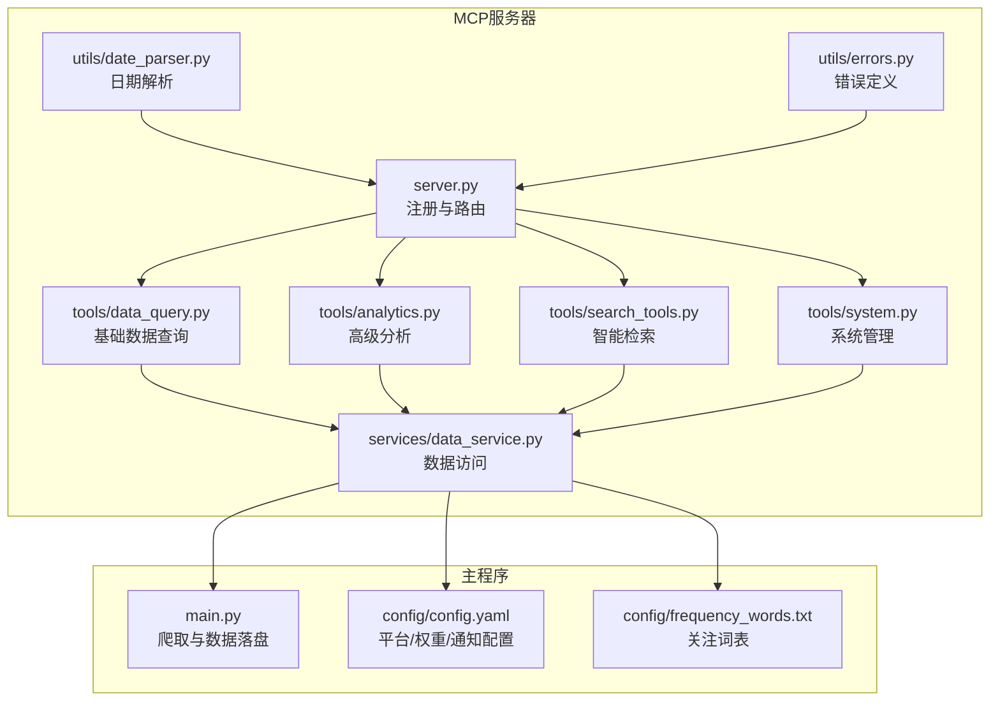
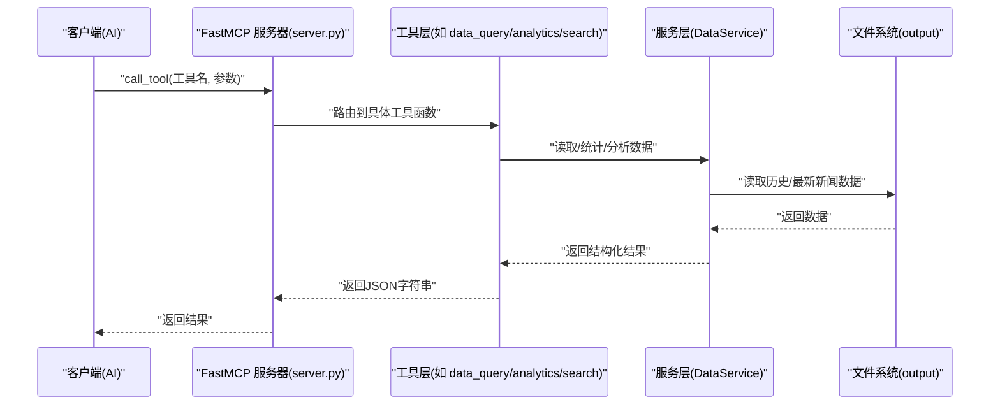
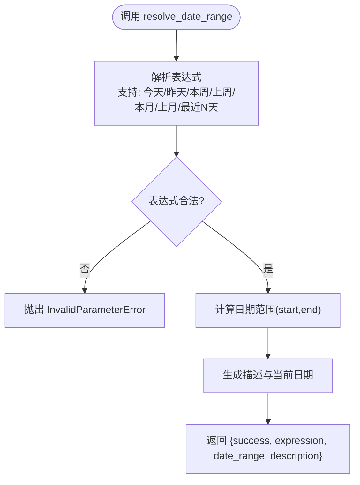
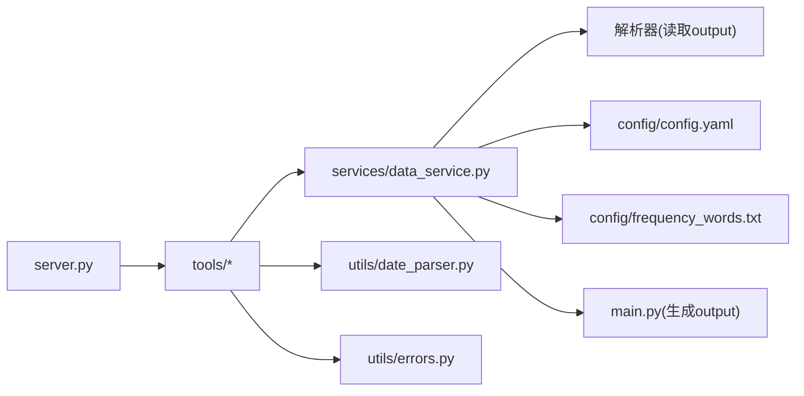

# MCP服务器功能

<cite>
**本文引用的文件**
- [mcp_server/server.py](file://mcp_server/server.py)
- [docs/MCP-API-Reference.md](file://docs/MCP-API-Reference.md)
- [mcp_server/tools/data_query.py](file://mcp_server/tools/data_query.py)
- [mcp_server/tools/analytics.py](file://mcp_server/tools/analytics.py)
- [mcp_server/tools/search_tools.py](file://mcp_server/tools/search_tools.py)
- [mcp_server/tools/system.py](file://mcp_server/tools/system.py)
- [mcp_server/utils/date_parser.py](file://mcp_server/utils/date_parser.py)
- [mcp_server/utils/errors.py](file://mcp_server/utils/errors.py)
- [mcp_server/services/data_service.py](file://mcp_server/services/data_service.py)
- [config/config.yaml](file://config/config.yaml)
- [config/frequency_words.txt](file://config/frequency_words.txt)
- [main.py](file://main.py)
</cite>

## 目录
1. [简介](#简介)
2. [项目结构](#项目结构)
3. [核心组件](#核心组件)
4. [架构总览](#架构总览)
5. [详细组件分析](#详细组件分析)
6. [依赖关系分析](#依赖关系分析)
7. [性能考量](#性能考量)
8. [故障排查指南](#故障排查指南)
9. [结论](#结论)
10. [附录](#附录)

## 简介
本文件面向使用者与开发者，系统化阐述 TrendRadar 的 MCP 服务器（FastMCP 2.0 实现）如何作为 AI 智能分析接口，提供基于 MCP 协议的工具集，支撑新闻热点数据的查询、分析与可视化。文档重点覆盖：
- server.py 如何暴露工具集（如 get_latest_news、get_trending_topics 等），以及每个工具的功能语义与调用方式
- 结合 MCP-API-Reference.md 的 API 定义，给出请求/响应示例、参数说明与错误处理机制
- 与主程序的数据依赖关系：MCP 服务器如何访问由 main.py 生成的热点数据进行自然语言查询分析
- 客户端连接方式、WebSocket 通信机制与安全性考虑

## 项目结构
- MCP 服务器位于 mcp_server 目录，采用“工具层（tools）-服务层（services）-工具包（FastMCP）”分层设计
- 工具层负责对外暴露 MCP 工具函数，内部委托服务层完成数据访问与业务逻辑
- 服务层封装数据访问、缓存与解析逻辑，统一从 output 目录读取 main.py 生成的新闻数据
- 配置与词表位于 config 目录，供 MCP 服务器与主程序共享

图表来源
- [mcp_server/server.py](file://mcp_server/server.py#L1-L120)
- [mcp_server/tools/data_query.py](file://mcp_server/tools/data_query.py#L1-L120)
- [mcp_server/tools/analytics.py](file://mcp_server/tools/analytics.py#L1-L120)
- [mcp_server/tools/search_tools.py](file://mcp_server/tools/search_tools.py#L1-L120)
- [mcp_server/tools/system.py](file://mcp_server/tools/system.py#L1-L120)
- [mcp_server/utils/date_parser.py](file://mcp_server/utils/date_parser.py#L1-L120)
- [mcp_server/utils/errors.py](file://mcp_server/utils/errors.py#L1-L60)
- [mcp_server/services/data_service.py](file://mcp_server/services/data_service.py#L1-L120)
- [config/config.yaml](file://config/config.yaml#L1-L140)
- [config/frequency_words.txt](file://config/frequency_words.txt#L1-L114)
- [main.py](file://main.py#L1-L200)

章节来源
- [mcp_server/server.py](file://mcp_server/server.py#L1-L120)
- [config/config.yaml](file://config/config.yaml#L1-L140)

## 核心组件
- 工具注册与路由：server.py 使用 FastMCP 注解注册工具函数，并在 run_server 中根据传输模式启动（stdio/http）
- 工具层：
  - 基础数据查询：get_latest_news、get_news_by_date、get_trending_topics
  - 高级分析：analyze_topic_trend、analyze_data_insights、analyze_sentiment、find_similar_news、generate_summary_report
  - 智能检索：search_news、search_related_news_history
  - 系统管理：resolve_date_range、get_current_config、get_system_status、trigger_crawl
- 服务层：DataService 统一封装数据读取、缓存、解析与统计
- 工具辅助：DateParser 提供日期解析；Errors 提供统一错误类型

章节来源
- [mcp_server/server.py](file://mcp_server/server.py#L1-L120)
- [mcp_server/tools/data_query.py](file://mcp_server/tools/data_query.py#L1-L120)
- [mcp_server/tools/analytics.py](file://mcp_server/tools/analytics.py#L1-L120)
- [mcp_server/tools/search_tools.py](file://mcp_server/tools/search_tools.py#L1-L120)
- [mcp_server/tools/system.py](file://mcp_server/tools/system.py#L1-L120)
- [mcp_server/utils/date_parser.py](file://mcp_server/utils/date_parser.py#L1-L120)
- [mcp_server/utils/errors.py](file://mcp_server/utils/errors.py#L1-L60)
- [mcp_server/services/data_service.py](file://mcp_server/services/data_service.py#L1-L120)

## 架构总览
MCP 服务器通过 FastMCP 2.0 提供工具函数，客户端（AI）通过 MCP 协议调用这些工具。工具函数内部委托服务层访问 output 目录中的数据，这些数据由主程序 main.py 爬取并落盘生成。

图表来源
- [mcp_server/server.py](file://mcp_server/server.py#L110-L220)
- [mcp_server/tools/data_query.py](file://mcp_server/tools/data_query.py#L1-L120)
- [mcp_server/tools/analytics.py](file://mcp_server/tools/analytics.py#L1-L120)
- [mcp_server/tools/search_tools.py](file://mcp_server/tools/search_tools.py#L1-L120)
- [mcp_server/services/data_service.py](file://mcp_server/services/data_service.py#L1-L120)

## 详细组件分析

### 日期解析工具：resolve_date_range
- 功能语义：将自然语言日期表达式（如“本周”、“最近7天”）解析为标准日期范围，确保 AI 与服务器端日期计算一致
- 调用方式：优先调用 resolve_date_range，再将返回的 date_range 传入需要日期范围的工具
- 参数与返回：参见 API 参考与工具注释；返回包含 start/end 的日期范围与描述
- 错误处理：InvalidParameterError，提供支持的表达式列表

图表来源
- [mcp_server/server.py](file://mcp_server/server.py#L40-L110)
- [mcp_server/utils/date_parser.py](file://mcp_server/utils/date_parser.py#L330-L424)

章节来源
- [mcp_server/server.py](file://mcp_server/server.py#L40-L110)
- [mcp_server/utils/date_parser.py](file://mcp_server/utils/date_parser.py#L330-L424)

### 基础数据查询工具
- get_latest_news
  - 功能：获取最新一批爬取的新闻数据，支持平台过滤、limit 限制、是否包含 URL
  - 数据来源：DataService 读取 output 中最新时间戳的数据
  - 返回：包含 news 列表、total、platforms 等字段
- get_news_by_date
  - 功能：按日期查询新闻，支持自然语言日期（如“昨天”、“3天前”）
  - 数据来源：DataService 读取指定日期的数据
  - 返回：包含 news 列表、total、date_query、date 等字段
- get_trending_topics
  - 功能：基于 config/frequency_words.txt 的个人关注词列表，统计词在新闻中的出现频率
  - 模式：daily/current/incremental（当前实现支持 current/daily）
  - 返回：包含 topics、mode、total_keywords 等字段

章节来源
- [mcp_server/server.py](file://mcp_server/server.py#L110-L222)
- [mcp_server/tools/data_query.py](file://mcp_server/tools/data_query.py#L1-L285)
- [mcp_server/services/data_service.py](file://mcp_server/services/data_service.py#L1-L200)
- [config/frequency_words.txt](file://config/frequency_words.txt#L1-L114)

### 高级分析工具
- analyze_topic_trend
  - 功能：统一话题趋势分析，支持 trend/lifecycle/viral/predict
  - 日期范围：建议先 resolve_date_range 获取标准范围
  - 返回：包含趋势数据、统计指标、方向判断等
- analyze_data_insights
  - 功能：统一数据洞察分析，支持 platform_compare/platform_activity/keyword_cooccur
  - 返回：按洞察类型返回平台对比、活跃度统计或关键词共现结果
- analyze_sentiment
  - 功能：情感倾向分析，生成用于 AI 的提示词；支持去重、权重排序
  - 返回：包含 ai_prompt、news_sample、summary 等
- find_similar_news
  - 功能：查找与指定新闻标题相似的其他新闻
  - 返回：包含相似度分数与样本
- generate_summary_report
  - 功能：每日/每周摘要报告生成
  - 返回：包含 Markdown 报告与统计数据

章节来源
- [mcp_server/server.py](file://mcp_server/server.py#L224-L458)
- [mcp_server/tools/analytics.py](file://mcp_server/tools/analytics.py#L1-L200)
- [mcp_server/tools/analytics.py](file://mcp_server/tools/analytics.py#L200-L620)
- [mcp_server/tools/analytics.py](file://mcp_server/tools/analytics.py#L620-L800)

### 智能检索工具
- search_news
  - 功能：统一新闻搜索，支持 keyword/fuzzy/entity 模式
  - 日期范围：建议先 resolve_date_range 获取标准范围
  - 排序：relevance/weight/date
  - 返回：包含 results、summary、statistics 等
- search_related_news_history
  - 功能：基于种子新闻，在历史数据中搜索相关新闻
  - 时间范围预设：yesterday/last_week/last_month/custom
  - 返回：包含相似度分数、关键词重合度、平台/日期分布统计

章节来源
- [mcp_server/server.py](file://mcp_server/server.py#L460-L583)
- [mcp_server/tools/search_tools.py](file://mcp_server/tools/search_tools.py#L1-L240)
- [mcp_server/tools/search_tools.py](file://mcp_server/tools/search_tools.py#L240-L702)

### 系统管理工具
- get_current_config
  - 功能：获取当前系统配置（crawler/push/keywords/weights/all）
  - 返回：按 section 组织的配置字典
- get_system_status
  - 功能：获取系统运行状态、数据统计、缓存状态
  - 返回：包含系统版本、数据范围、缓存统计等
- trigger_crawl
  - 功能：手动触发一次临时爬取任务（可选持久化到 output）
  - 返回：包含任务状态、平台列表、失败平台、数据与保存路径

章节来源
- [mcp_server/server.py](file://mcp_server/server.py#L585-L741)
- [mcp_server/tools/system.py](file://mcp_server/tools/system.py#L1-L200)
- [mcp_server/tools/system.py](file://mcp_server/tools/system.py#L200-L466)
- [mcp_server/services/data_service.py](file://mcp_server/services/data_service.py#L498-L605)

### 与主程序的数据依赖关系
- 数据来源：output 目录下的历史数据（按日期文件夹组织），由 main.py 爬取并落盘
- 数据结构：各平台的标题、排名、URL 等信息，按日期聚合
- 依赖链路：
  - tools 层调用 services 层
  - services 层通过解析器读取 output 目录数据
  - 配置与词表来自 config 目录
- 影响要点：
  - 若 output 无数据，某些工具会返回“无可用数据”的错误
  - 词表 frequency_words.txt 决定 get_trending_topics 的统计范围

章节来源
- [mcp_server/services/data_service.py](file://mcp_server/services/data_service.py#L1-L120)
- [config/config.yaml](file://config/config.yaml#L110-L140)
- [config/frequency_words.txt](file://config/frequency_words.txt#L1-L114)
- [main.py](file://main.py#L616-L800)

## 依赖关系分析
- 工具层依赖服务层：所有工具最终委托 DataService 完成数据访问与缓存
- 服务层依赖解析器与配置：解析 output 数据、读取配置与词表
- 日期解析与错误类型：DateParser 与自定义错误类贯穿工具与服务层
- 主程序依赖：DataService 读取 output，output 由 main.py 生成

图表来源
- [mcp_server/server.py](file://mcp_server/server.py#L1-L120)
- [mcp_server/tools/data_query.py](file://mcp_server/tools/data_query.py#L1-L120)
- [mcp_server/tools/analytics.py](file://mcp_server/tools/analytics.py#L1-L120)
- [mcp_server/tools/search_tools.py](file://mcp_server/tools/search_tools.py#L1-L120)
- [mcp_server/tools/system.py](file://mcp_server/tools/system.py#L1-L120)
- [mcp_server/utils/date_parser.py](file://mcp_server/utils/date_parser.py#L1-L120)
- [mcp_server/utils/errors.py](file://mcp_server/utils/errors.py#L1-L60)
- [mcp_server/services/data_service.py](file://mcp_server/services/data_service.py#L1-L120)
- [config/config.yaml](file://config/config.yaml#L1-L140)
- [config/frequency_words.txt](file://config/frequency_words.txt#L1-L114)
- [main.py](file://main.py#L616-L800)

## 性能考量
- 缓存策略：DataService 对常用查询（最新新闻、按日期查询、趋势词、配置）进行缓存，减少 IO
- 排序与限制：工具层对结果进行排序与 limit 限制，避免一次性返回过多数据
- 模糊搜索阈值：fuzzy 模式通过阈值过滤低相似度结果，降低返回量
- 建议：
  - 合理使用 limit 参数
  - 启用缓存（系统已内置）
  - 分批处理大数据（date_range 分批）
  - 选择合适搜索模式（keyword/fuzzy/entity）

章节来源
- [mcp_server/services/data_service.py](file://mcp_server/services/data_service.py#L1-L120)
- [mcp_server/tools/search_tools.py](file://mcp_server/tools/search_tools.py#L1-L120)
- [docs/MCP-API-Reference.md](file://docs/MCP-API-Reference.md#L459-L475)

## 故障排查指南
- 常见错误码与含义：
  - INVALID_PARAMETER：参数无效（如日期格式、排序方式、平台ID）
  - DATA_NOT_FOUND：未找到数据（如关键词搜索无匹配、output 无数据）
  - CRAWL_TASK_ERROR：爬取任务错误（如配置缺失、平台不可用）
  - INTERNAL_ERROR：内部错误（异常堆栈）
- 定位思路：
  - 检查日期范围与表达式是否正确（优先 resolve_date_range）
  - 确认 output 目录是否存在数据（get_system_status 可查看数据范围）
  - 检查平台 ID 是否在 config.yaml 的 platforms 列表中
  - 检查频率词表是否正确配置（get_current_config/keywords）
- 建议：
  - 使用 get_system_status 获取系统状态与数据范围
  - 使用 trigger_crawl 触发临时爬取并检查失败平台
  - 在 fuzzy 模式下调低阈值以提高召回率

章节来源
- [mcp_server/utils/errors.py](file://mcp_server/utils/errors.py#L1-L94)
- [docs/MCP-API-Reference.md](file://docs/MCP-API-Reference.md#L384-L408)
- [mcp_server/tools/system.py](file://mcp_server/tools/system.py#L1-L120)
- [mcp_server/services/data_service.py](file://mcp_server/services/data_service.py#L498-L605)

## 结论
TrendRadar 的 MCP 服务器通过 FastMCP 2.0 将丰富的新闻数据查询与分析能力以工具形式暴露给 AI 客户端。其核心优势在于：
- 统一的工具注册与路由，清晰的分层设计
- 严谨的参数校验与错误处理，提升稳定性
- 与主程序的紧密耦合（output 数据），保证分析结果的时效性与准确性
- 丰富的分析工具链，覆盖基础查询、智能检索、高级分析与系统管理

## 附录

### 客户端连接与传输模式
- 传输模式：
  - stdio：推荐开发调试，通过标准输入输出与 MCP 客户端通信
  - http：生产环境推荐，监听 host:port，端点路径 /mcp
- 连接信息与示例：参见 MCP-API-Reference.md 的“连接信息”与“使用示例”

章节来源
- [mcp_server/server.py](file://mcp_server/server.py#L660-L741)
- [docs/MCP-API-Reference.md](file://docs/MCP-API-Reference.md#L1-L20)

### WebSocket 通信机制与安全性
- 说明：MCP 服务器默认提供 stdio 与 HTTP 两种传输模式；仓库未发现 WebSocket 相关实现
- 安全性建议：
  - 生产环境使用 HTTP 模式并配合反向代理与认证
  - 限制暴露端口与访问来源
  - 保护配置文件与敏感信息（通知渠道 webhook 等）

章节来源
- [mcp_server/server.py](file://mcp_server/server.py#L660-L741)
- [config/config.yaml](file://config/config.yaml#L60-L109)

### 请求/响应示例与参数说明（摘自 API 参考）
- get_latest_news
  - 参数：platforms、limit、include_url
  - 返回：包含 news 列表、total、platforms
- get_news_by_date
  - 参数：date_query、platforms、limit、include_url
  - 返回：包含 news 列表、total、date、date_query
- get_trending_topics
  - 参数：top_n、mode
  - 返回：包含 topics、mode、total_keywords
- search_news
  - 参数：query、search_mode、date_range、platforms、limit、sort_by、threshold、include_url
  - 返回：包含 results、summary、statistics
- analyze_sentiment
  - 参数：topic、platforms、date_range、limit、sort_by_weight、include_url
  - 返回：包含 ai_prompt、news_sample、summary
- trigger_crawl
  - 参数：platforms、save_to_local、include_url
  - 返回：包含任务状态、平台列表、失败平台、数据与保存路径

章节来源
- [docs/MCP-API-Reference.md](file://docs/MCP-API-Reference.md#L18-L275)