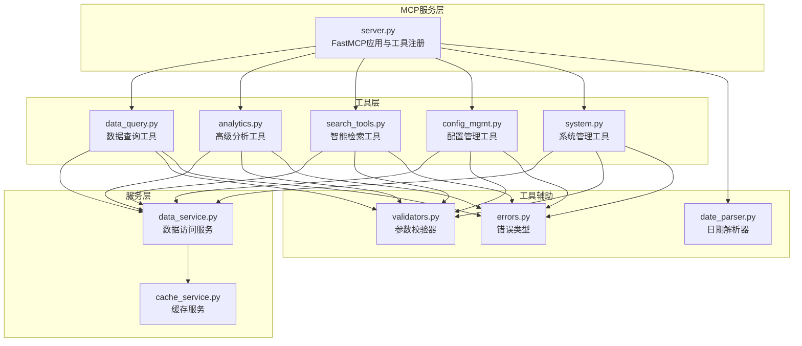
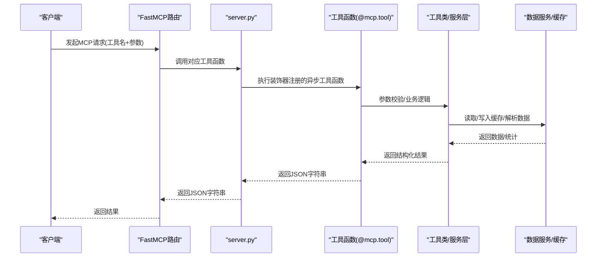
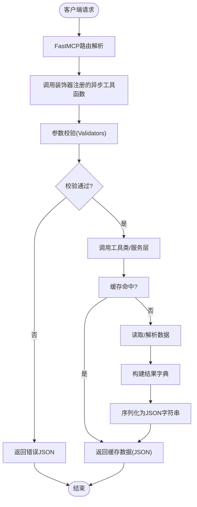
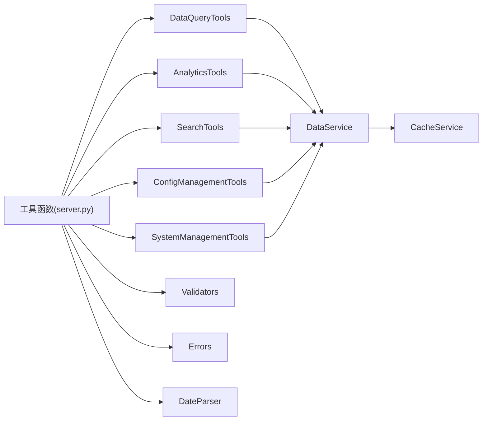

# MCP工具注册与管理机制

<cite>
**本文引用的文件**
- [mcp_server/server.py](file://mcp_server/server.py)
- [mcp_server/tools/data_query.py](file://mcp_server/tools/data_query.py)
- [mcp_server/tools/analytics.py](file://mcp_server/tools/analytics.py)
- [mcp_server/tools/search_tools.py](file://mcp_server/tools/search_tools.py)
- [mcp_server/tools/config_mgmt.py](file://mcp_server/tools/config_mgmt.py)
- [mcp_server/tools/system.py](file://mcp_server/tools/system.py)
- [mcp_server/utils/date_parser.py](file://mcp_server/utils/date_parser.py)
- [mcp_server/utils/errors.py](file://mcp_server/utils/errors.py)
- [mcp_server/utils/validators.py](file://mcp_server/utils/validators.py)
- [mcp_server/services/data_service.py](file://mcp_server/services/data_service.py)
- [mcp_server/services/cache_service.py](file://mcp_server/services/cache_service.py)
</cite>

## 目录
1. [简介](#简介)
2. [项目结构](#项目结构)
3. [核心组件](#核心组件)
4. [架构总览](#架构总览)
5. [详细组件分析](#详细组件分析)
6. [依赖关系分析](#依赖关系分析)
7. [性能考量](#性能考量)
8. [故障排查指南](#故障排查指南)
9. [结论](#结论)

## 简介
本文件围绕 TrendRadar 的 MCP 工具注册与管理机制展开，重点说明 server.py 中通过 @mcp.tool 装饰器注册的 13 个核心工具的注册流程、打印格式与内容、工具分类与使用优先级、异步特性、参数定义与返回值格式，并给出从客户端请求到 FastMCP 路由再到具体工具函数执行的完整调用链路，以及错误处理与日志记录机制。

## 项目结构
- 服务入口位于 mcp_server/server.py，使用 FastMCP 2.0 创建应用实例，并通过装饰器注册工具。
- 工具按功能拆分为多个模块：数据查询、高级分析、智能检索、配置管理、系统管理。
- 工具内部通过工具类调用数据服务层，数据服务层封装缓存与解析逻辑。
- 工具与服务层之间通过统一的参数校验器与错误类型保证健壮性。

图表来源
- [mcp_server/server.py](file://mcp_server/server.py#L1-L120)
- [mcp_server/tools/data_query.py](file://mcp_server/tools/data_query.py#L1-L60)
- [mcp_server/tools/analytics.py](file://mcp_server/tools/analytics.py#L1-L120)
- [mcp_server/tools/search_tools.py](file://mcp_server/tools/search_tools.py#L1-L120)
- [mcp_server/tools/config_mgmt.py](file://mcp_server/tools/config_mgmt.py#L1-L40)
- [mcp_server/tools/system.py](file://mcp_server/tools/system.py#L1-L60)
- [mcp_server/services/data_service.py](file://mcp_server/services/data_service.py#L1-L60)
- [mcp_server/services/cache_service.py](file://mcp_server/services/cache_service.py#L1-L60)
- [mcp_server/utils/validators.py](file://mcp_server/utils/validators.py#L1-L60)
- [mcp_server/utils/errors.py](file://mcp_server/utils/errors.py#L1-L40)
- [mcp_server/utils/date_parser.py](file://mcp_server/utils/date_parser.py#L1-L60)

章节来源
- [mcp_server/server.py](file://mcp_server/server.py#L1-L120)

## 核心组件
- FastMCP 应用与工具注册
  - 在 server.py 中创建 FastMCP 应用实例，并通过装饰器 @mcp.tool 注册 13 个工具函数。
  - 工具函数均声明为异步，返回 JSON 字符串，便于 MCP 客户端消费。
- 工具分类与优先级
  - 日期解析工具（推荐优先调用）：resolve_date_range
  - 基础数据查询（P0核心）：get_latest_news、get_news_by_date、get_trending_topics
  - 智能检索工具：search_news、search_related_news_history
  - 高级数据分析：analyze_topic_trend、analyze_data_insights、analyze_sentiment、find_similar_news、generate_summary_report
  - 配置与系统管理：get_current_config、get_system_status、trigger_crawl
- 工具实例化与单例
  - 通过 _get_tools() 在首次请求时初始化工具实例，避免重复创建。

章节来源
- [mcp_server/server.py](file://mcp_server/server.py#L20-L40)
- [mcp_server/server.py](file://mcp_server/server.py#L660-L740)

## 架构总览
下面的序列图展示了从客户端请求到工具执行的完整链路，以及 FastMCP 路由与工具函数的关系。

图表来源
- [mcp_server/server.py](file://mcp_server/server.py#L110-L160)
- [mcp_server/tools/data_query.py](file://mcp_server/tools/data_query.py#L34-L88)
- [mcp_server/tools/analytics.py](file://mcp_server/tools/analytics.py#L77-L120)
- [mcp_server/tools/search_tools.py](file://mcp_server/tools/search_tools.py#L38-L120)
- [mcp_server/tools/config_mgmt.py](file://mcp_server/tools/config_mgmt.py#L26-L66)
- [mcp_server/tools/system.py](file://mcp_server/tools/system.py#L33-L86)
- [mcp_server/services/data_service.py](file://mcp_server/services/data_service.py#L1-L60)
- [mcp_server/services/cache_service.py](file://mcp_server/services/cache_service.py#L1-L60)

## 详细组件分析

### 工具注册与打印清单
- 装饰器注册
  - server.py 中使用 @mcp.tool 装饰器注册 13 个工具函数，分别对应数据查询、智能检索、高级分析、配置与系统管理等类别。
- 启动时打印工具清单
  - run_server() 在启动时打印“已注册的工具”列表，包含编号、名称与功能描述，便于客户端与使用者快速了解工具能力。
  - 工具编号与分类如下：
    - 0. resolve_date_range - 解析自然语言日期为标准格式（推荐优先调用）
    - 基础数据查询（P0核心）
      - 1. get_latest_news - 获取最新新闻
      - 2. get_news_by_date - 按日期查询新闻（支持自然语言）
      - 3. get_trending_topics - 获取趋势话题
    - 智能检索工具
      - 4. search_news - 统一新闻搜索（关键词/模糊/实体）
      - 5. search_related_news_history - 历史相关新闻检索
    - 高级数据分析
      - 6. analyze_topic_trend - 统一话题趋势分析（热度/生命周期/爆火/预测）
      - 7. analyze_data_insights - 统一数据洞察分析（平台对比/活跃度/关键词共现）
      - 8. analyze_sentiment - 情感倾向分析
      - 9. find_similar_news - 相似新闻查找
      - 10. generate_summary_report - 每日/每周摘要生成
    - 配置与系统管理
      - 11. get_current_config - 获取当前系统配置
      - 12. get_system_status - 获取系统运行状态
      - 13. trigger_crawl - 手动触发爬取任务

章节来源
- [mcp_server/server.py](file://mcp_server/server.py#L660-L740)

### 工具分类与使用优先级
- 分类设计逻辑
  - 以“先日期解析，再数据查询，再检索，再分析，最后配置与系统管理”的顺序组织，符合典型工作流：先确定时间范围，再获取数据，再检索/分析，最后查看系统状态或调整配置。
- 使用优先级
  - 日期解析工具 resolve_date_range 作为“推荐优先调用”，确保所有分析工具使用一致的时间范围，避免 AI 自行计算导致的不一致。
  - P0 核心工具（get_latest_news、get_news_by_date、get_trending_topics）优先用于快速了解热点与趋势。
  - 智能检索工具用于复杂查询与历史相关性挖掘。
  - 高级分析工具用于深入趋势、情感、相似度与摘要生成。
  - 配置与系统管理工具用于运维与调试。

章节来源
- [mcp_server/server.py](file://mcp_server/server.py#L40-L110)
- [mcp_server/server.py](file://mcp_server/server.py#L110-L224)
- [mcp_server/server.py](file://mcp_server/server.py#L224-L458)
- [mcp_server/server.py](file://mcp_server/server.py#L460-L583)
- [mcp_server/server.py](file://mcp_server/server.py#L585-L740)

### 异步特性、参数与返回值
- 异步特性
  - 所有工具函数均声明为异步，返回 JSON 字符串，便于 FastMCP 路由异步调度与客户端消费。
- 参数定义
  - 参数校验由 validators.py 提供统一校验器，涵盖平台列表、数量限制、日期范围、关键词、模式、配置节等。
  - 日期解析由 utils/date_parser.py 提供，支持中文/英文相对/绝对日期、周/月/最近N天等表达式。
- 返回值格式
  - 工具函数内部将业务结果转为字典后 JSON 序列化为字符串返回；错误时返回包含 success 与 error 字段的 JSON。
  - 服务层工具类统一返回 success/error 字典，便于上层工具函数包装为 JSON 字符串。

章节来源
- [mcp_server/server.py](file://mcp_server/server.py#L110-L160)
- [mcp_server/utils/validators.py](file://mcp_server/utils/validators.py#L90-L121)
- [mcp_server/utils/validators.py](file://mcp_server/utils/validators.py#L145-L210)
- [mcp_server/utils/validators.py](file://mcp_server/utils/validators.py#L212-L243)
- [mcp_server/utils/validators.py](file://mcp_server/utils/validators.py#L245-L260)
- [mcp_server/utils/validators.py](file://mcp_server/utils/validators.py#L292-L307)
- [mcp_server/utils/date_parser.py](file://mcp_server/utils/date_parser.py#L330-L424)
- [mcp_server/tools/data_query.py](file://mcp_server/tools/data_query.py#L34-L88)
- [mcp_server/tools/analytics.py](file://mcp_server/tools/analytics.py#L77-L120)
- [mcp_server/tools/search_tools.py](file://mcp_server/tools/search_tools.py#L38-L120)
- [mcp_server/tools/config_mgmt.py](file://mcp_server/tools/config_mgmt.py#L26-L66)
- [mcp_server/tools/system.py](file://mcp_server/tools/system.py#L33-L86)

### 工具调用链路
- 客户端请求
  - 客户端通过 FastMCP 协议发起请求，携带工具名与参数。
- FastMCP 路由
  - FastMCP 根据工具名定位到 server.py 中对应的 @mcp.tool 装饰器注册的异步函数。
- 工具函数执行
  - 工具函数内部调用对应工具类（DataQueryTools、AnalyticsTools、SearchTools、ConfigManagementTools、SystemManagementTools），进行参数校验与业务处理。
- 服务层与缓存
  - 工具类通过 DataService 访问数据，DataService 使用 CacheService 提供缓存能力，减少重复 IO。
- 错误与返回
  - 工具函数捕获 MCPError 与通用异常，统一转换为 JSON 字符串返回。

图表来源
- [mcp_server/server.py](file://mcp_server/server.py#L110-L160)
- [mcp_server/tools/data_query.py](file://mcp_server/tools/data_query.py#L34-L88)
- [mcp_server/tools/analytics.py](file://mcp_server/tools/analytics.py#L77-L120)
- [mcp_server/tools/search_tools.py](file://mcp_server/tools/search_tools.py#L38-L120)
- [mcp_server/tools/config_mgmt.py](file://mcp_server/tools/config_mgmt.py#L26-L66)
- [mcp_server/tools/system.py](file://mcp_server/tools/system.py#L33-L86)
- [mcp_server/services/data_service.py](file://mcp_server/services/data_service.py#L1-L60)
- [mcp_server/services/cache_service.py](file://mcp_server/services/cache_service.py#L1-L60)

章节来源
- [mcp_server/server.py](file://mcp_server/server.py#L110-L160)
- [mcp_server/tools/data_query.py](file://mcp_server/tools/data_query.py#L34-L88)
- [mcp_server/tools/analytics.py](file://mcp_server/tools/analytics.py#L77-L120)
- [mcp_server/tools/search_tools.py](file://mcp_server/tools/search_tools.py#L38-L120)
- [mcp_server/tools/config_mgmt.py](file://mcp_server/tools/config_mgmt.py#L26-L66)
- [mcp_server/tools/system.py](file://mcp_server/tools/system.py#L33-L86)
- [mcp_server/services/data_service.py](file://mcp_server/services/data_service.py#L1-L60)
- [mcp_server/services/cache_service.py](file://mcp_server/services/cache_service.py#L1-L60)

### 工具函数一览与职责
- 日期解析工具
  - resolve_date_range：将自然语言日期表达式解析为标准日期范围，返回 JSON 字符串，包含 success、date_range、current_date、description 等字段。
- 基础数据查询
  - get_latest_news：获取最新新闻列表，支持平台过滤、数量限制、是否包含 URL。
  - get_news_by_date：按日期查询新闻，支持自然语言日期解析。
  - get_trending_topics：基于关注词列表统计趋势话题，支持 daily/current 模式。
- 智能检索
  - search_news：统一搜索接口，支持 keyword/fuzzy/entity 模式，支持日期范围、平台过滤、排序与阈值。
  - search_related_news_history：基于种子新闻在历史数据中检索相关新闻，支持 yesterday/last_week/last_month/custom。
- 高级分析
  - analyze_topic_trend：统一话题趋势分析，支持 trend/lifecycle/viral/predict 模式。
  - analyze_data_insights：统一数据洞察分析，支持 platform_compare/platform_activity/keyword_cooccur。
  - analyze_sentiment：情感倾向分析，支持去重、权重排序、URL 可选。
  - find_similar_news：查找与指定新闻标题相似的其他新闻。
  - generate_summary_report：每日/每周摘要生成。
- 配置与系统管理
  - get_current_config：获取当前系统配置，支持 all/crawler/push/keywords/weights。
  - get_system_status：获取系统运行状态与健康检查信息。
  - trigger_crawl：手动触发临时爬取任务，支持平台过滤、保存到本地与 URL 输出。

章节来源
- [mcp_server/server.py](file://mcp_server/server.py#L40-L110)
- [mcp_server/server.py](file://mcp_server/server.py#L110-L224)
- [mcp_server/server.py](file://mcp_server/server.py#L224-L458)
- [mcp_server/server.py](file://mcp_server/server.py#L460-L583)
- [mcp_server/server.py](file://mcp_server/server.py#L585-L740)

## 依赖关系分析
- 工具到服务层
  - 工具类通过 DataService 访问数据，DataService 使用 CacheService 提供缓存能力。
- 工具到校验器与错误类型
  - 所有工具函数依赖 validators.py 的参数校验器，异常统一转换为 MCPError 或通用错误字典。
- 工具到日期解析
  - resolve_date_range 直接使用 DateParser 解析日期表达式，其他工具通过 validators 的日期解析器间接使用。

图表来源
- [mcp_server/server.py](file://mcp_server/server.py#L1-L120)
- [mcp_server/tools/data_query.py](file://mcp_server/tools/data_query.py#L1-L60)
- [mcp_server/tools/analytics.py](file://mcp_server/tools/analytics.py#L1-L120)
- [mcp_server/tools/search_tools.py](file://mcp_server/tools/search_tools.py#L1-L120)
- [mcp_server/tools/config_mgmt.py](file://mcp_server/tools/config_mgmt.py#L1-L40)
- [mcp_server/tools/system.py](file://mcp_server/tools/system.py#L1-L60)
- [mcp_server/services/data_service.py](file://mcp_server/services/data_service.py#L1-L60)
- [mcp_server/services/cache_service.py](file://mcp_server/services/cache_service.py#L1-L60)
- [mcp_server/utils/validators.py](file://mcp_server/utils/validators.py#L1-L60)
- [mcp_server/utils/errors.py](file://mcp_server/utils/errors.py#L1-L40)
- [mcp_server/utils/date_parser.py](file://mcp_server/utils/date_parser.py#L1-L60)

章节来源
- [mcp_server/server.py](file://mcp_server/server.py#L1-L120)
- [mcp_server/tools/data_query.py](file://mcp_server/tools/data_query.py#L1-L60)
- [mcp_server/tools/analytics.py](file://mcp_server/tools/analytics.py#L1-L120)
- [mcp_server/tools/search_tools.py](file://mcp_server/tools/search_tools.py#L1-L120)
- [mcp_server/tools/config_mgmt.py](file://mcp_server/tools/config_mgmt.py#L1-L40)
- [mcp_server/tools/system.py](file://mcp_server/tools/system.py#L1-L60)
- [mcp_server/services/data_service.py](file://mcp_server/services/data_service.py#L1-L60)
- [mcp_server/services/cache_service.py](file://mcp_server/services/cache_service.py#L1-L60)
- [mcp_server/utils/validators.py](file://mcp_server/utils/validators.py#L1-L60)
- [mcp_server/utils/errors.py](file://mcp_server/utils/errors.py#L1-L40)
- [mcp_server/utils/date_parser.py](file://mcp_server/utils/date_parser.py#L1-L60)

## 性能考量
- 缓存策略
  - DataService 在多项查询中使用 CacheService，提供 TTL 缓存，减少重复 IO 与解析开销。
  - 不同查询设置不同 TTL，如最新新闻 15 分钟、历史新闻 30 分钟、趋势话题 30 分钟、配置 1 小时等。
- 异步执行
  - 工具函数均为异步，配合 FastMCP 路由可并发处理多个请求，提高吞吐。
- 数据去重与排序
  - 情感分析工具对同一标题在不同平台去重，避免重复计算与冗余展示。
- 限流与重试
  - 系统管理工具在触发爬取时具备重试与请求间隔控制，避免对上游接口造成压力。

章节来源
- [mcp_server/services/cache_service.py](file://mcp_server/services/cache_service.py#L1-L120)
- [mcp_server/services/data_service.py](file://mcp_server/services/data_service.py#L1-L120)
- [mcp_server/tools/system.py](file://mcp_server/tools/system.py#L68-L160)

## 故障排查指南
- 常见错误类型
  - MCPError：MCP 工具错误基类，提供 to_dict() 转换为 JSON 字典，包含 code/message/suggestion。
  - DataNotFoundError：数据不存在。
  - InvalidParameterError：参数无效。
  - ConfigurationError：配置错误。
  - PlatformNotSupportedError：平台不支持。
  - CrawlTaskError：爬取任务错误。
  - FileParseError：文件解析错误。
- 错误处理与日志
  - 工具函数捕获 MCPError 与通用异常，统一返回包含 success 与 error 字段的 JSON。
  - resolve_date_range 在解析日期表达式失败时返回包含 error 的 JSON。
  - trigger_crawl 在保存文件失败时返回包含 save_error 的 JSON，并提示未持久化。
- 日志与提示
  - resolve_date_range 在解析失败时返回包含建议的错误信息。
  - search_news 在无可用数据时返回包含可用日期范围的提示。
  - system 工具在保存失败时输出详细错误信息。

章节来源
- [mcp_server/utils/errors.py](file://mcp_server/utils/errors.py#L1-L94)
- [mcp_server/server.py](file://mcp_server/server.py#L90-L110)
- [mcp_server/server.py](file://mcp_server/server.py#L140-L160)
- [mcp_server/tools/search_tools.py](file://mcp_server/tools/search_tools.py#L100-L140)
- [mcp_server/tools/system.py](file://mcp_server/tools/system.py#L360-L376)

## 结论
- 通过 @mcp.tool 装饰器，server.py 将 13 个工具函数注册为 FastMCP 工具，形成清晰的功能分层与优先级。
- 工具函数采用异步设计，参数通过统一校验器与日期解析器保障一致性与健壮性，返回 JSON 字符串便于客户端消费。
- 工具调用链路从 FastMCP 路由到工具函数，再到服务层与缓存，最终返回结构化结果；错误处理与日志提示完善，便于运维与调试。
- 建议在实际使用中遵循“先日期解析，再数据查询，再检索/分析，最后配置与系统管理”的优先级，以获得最佳体验与一致性。