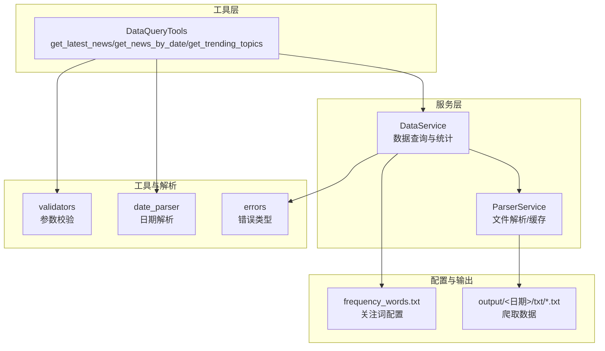
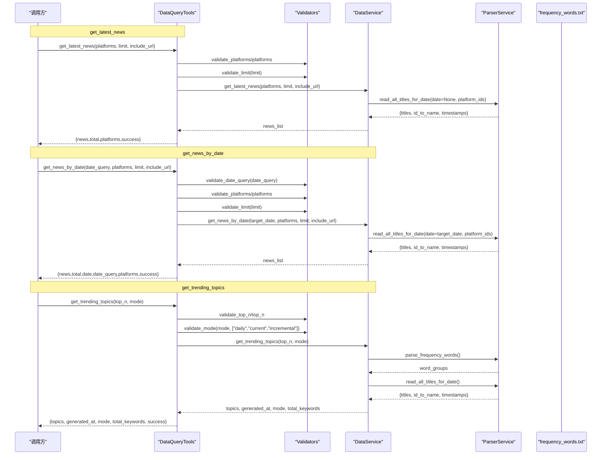
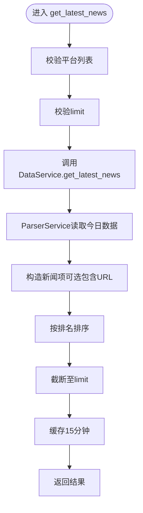
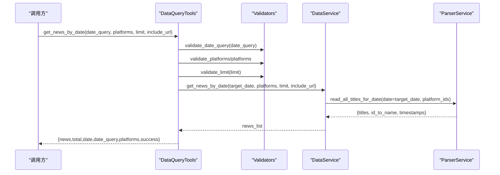
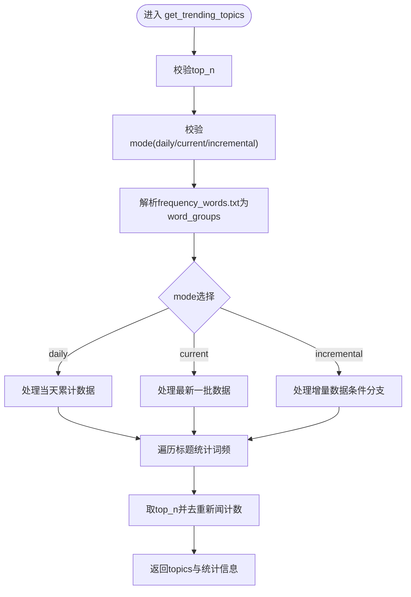
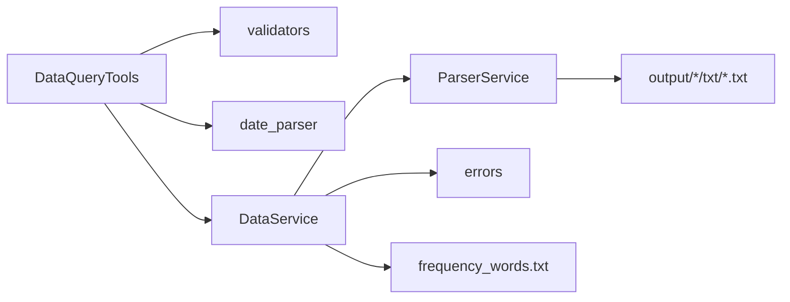

# 基础数据查询工具

<cite>
**本文引用的文件**
- [mcp_server/tools/data_query.py](file://mcp_server/tools/data_query.py)
- [mcp_server/services/data_service.py](file://mcp_server/services/data_service.py)
- [mcp_server/services/parser_service.py](file://mcp_server/services/parser_service.py)
- [mcp_server/utils/validators.py](file://mcp_server/utils/validators.py)
- [mcp_server/utils/date_parser.py](file://mcp_server/utils/date_parser.py)
- [mcp_server/utils/errors.py](file://mcp_server/utils/errors.py)
- [config/frequency_words.txt](file://config/frequency_words.txt)
- [mcp_server/server.py](file://mcp_server/server.py)
- [docs/MCP-API-Reference.md](file://docs/MCP-API-Reference.md)
- [README-MCP-FAQ.md](file://README-MCP-FAQ.md)
</cite>

## 目录
1. [简介](#简介)
2. [项目结构](#项目结构)
3. [核心组件](#核心组件)
4. [架构总览](#架构总览)
5. [详细组件分析](#详细组件分析)
6. [依赖关系分析](#依赖关系分析)
7. [性能考量](#性能考量)
8. [故障排查指南](#故障排查指南)
9. [结论](#结论)
10. [附录](#附录)

## 简介
本文件面向“基础数据查询工具组”，聚焦三个P0核心工具：get_latest_news、get_news_by_date、get_trending_topics。文档将从系统架构、数据来源、参数校验、返回格式、使用场景与最佳实践等维度，帮助用户高效、准确地使用这些工具，尤其强调“向用户展示完整数据而非默认总结”的最佳实践。

## 项目结构
基础数据查询工具位于 mcp_server/tools/data_query.py，其业务逻辑由 mcp_server/services/data_service.py 实现，数据解析与缓存由 mcp_server/services/parser_service.py 提供；参数校验与日期解析分别由 mcp_server/utils/validators.py 和 mcp_server/utils/date_parser.py 完成；错误类型由 mcp_server/utils/errors.py 定义；关键词统计依赖 config/frequency_words.txt。

图表来源
- [mcp_server/tools/data_query.py](file://mcp_server/tools/data_query.py#L1-L285)
- [mcp_server/services/data_service.py](file://mcp_server/services/data_service.py#L1-L605)
- [mcp_server/services/parser_service.py](file://mcp_server/services/parser_service.py#L1-L356)
- [mcp_server/utils/validators.py](file://mcp_server/utils/validators.py#L1-L352)
- [mcp_server/utils/date_parser.py](file://mcp_server/utils/date_parser.py#L1-L508)
- [mcp_server/utils/errors.py](file://mcp_server/utils/errors.py#L1-L94)
- [config/frequency_words.txt](file://config/frequency_words.txt#L1-L114)

章节来源
- [mcp_server/tools/data_query.py](file://mcp_server/tools/data_query.py#L1-L285)
- [mcp_server/services/data_service.py](file://mcp_server/services/data_service.py#L1-L605)
- [mcp_server/services/parser_service.py](file://mcp_server/services/parser_service.py#L1-L356)
- [mcp_server/utils/validators.py](file://mcp_server/utils/validators.py#L1-L352)
- [mcp_server/utils/date_parser.py](file://mcp_server/utils/date_parser.py#L1-L508)
- [mcp_server/utils/errors.py](file://mcp_server/utils/errors.py#L1-L94)
- [config/frequency_words.txt](file://config/frequency_words.txt#L1-L114)

## 核心组件
- DataQueryTools：封装三个P0工具，负责参数校验、调用DataService并组装统一返回格式。
- DataService：统一的数据访问层，负责从文件系统读取数据、统计词频、缓存控制与错误抛出。
- ParserService：解析txt标题文件、构建平台名映射、聚合多文件数据、缓存读写。
- Validators：平台过滤、limit、日期范围、关键词、top_n、模式等参数校验。
- DateParser：支持中文/英文相对日期、星期、绝对日期等多种格式解析。
- 错误体系：MCPError及其子类，保证统一的错误返回结构。
- 关注词配置：frequency_words.txt，支持必选词、普通词、过滤词等分组语法。

章节来源
- [mcp_server/tools/data_query.py](file://mcp_server/tools/data_query.py#L22-L285)
- [mcp_server/services/data_service.py](file://mcp_server/services/data_service.py#L1-L605)
- [mcp_server/services/parser_service.py](file://mcp_server/services/parser_service.py#L1-L356)
- [mcp_server/utils/validators.py](file://mcp_server/utils/validators.py#L1-L352)
- [mcp_server/utils/date_parser.py](file://mcp_server/utils/date_parser.py#L1-L508)
- [mcp_server/utils/errors.py](file://mcp_server/utils/errors.py#L1-L94)
- [config/frequency_words.txt](file://config/frequency_words.txt#L1-L114)

## 架构总览
下面以序列图展示三个工具的典型调用链路与数据流。

图表来源
- [mcp_server/tools/data_query.py](file://mcp_server/tools/data_query.py#L34-L283)
- [mcp_server/services/data_service.py](file://mcp_server/services/data_service.py#L30-L401)
- [mcp_server/services/parser_service.py](file://mcp_server/services/parser_service.py#L160-L260)
- [mcp_server/utils/validators.py](file://mcp_server/utils/validators.py#L90-L352)
- [mcp_server/utils/date_parser.py](file://mcp_server/utils/date_parser.py#L92-L248)
- [config/frequency_words.txt](file://config/frequency_words.txt#L1-L114)

## 详细组件分析

### get_latest_news：获取最新一批爬取的新闻
- 功能概述
  - 从今日最新一批爬取数据中返回新闻列表，支持平台过滤、条数限制、是否包含URL。
- 数据来源
  - 通过 ParserService.read_all_titles_for_date(date=None, platform_ids) 读取今日所有txt文件，聚合标题、排名、URL等信息。
- 参数与校验
  - platforms：通过 validate_platforms 校验，支持从配置文件动态加载平台列表；若配置不可用则允许所有平台通过（降级策略）。
  - limit：通过 validate_limit 校验，默认50，最大限制见实现。
  - include_url：布尔开关，控制是否附加 url/mobileUrl 字段。
- 返回格式
  - 成功：包含 news 列表、total 数量、platforms 列表、success 标记。
  - 失败：success=false，error 字段包含 code/message/suggestion。
- 性能与缓存
  - 15分钟缓存，避免重复读取今日数据。
- 使用建议
  - 若需查看完整列表，请在调用时显式要求“展示全部，不要总结”（参考FAQ）。

图表来源
- [mcp_server/tools/data_query.py](file://mcp_server/tools/data_query.py#L34-L89)
- [mcp_server/services/data_service.py](file://mcp_server/services/data_service.py#L30-L102)
- [mcp_server/services/parser_service.py](file://mcp_server/services/parser_service.py#L160-L260)
- [mcp_server/utils/validators.py](file://mcp_server/utils/validators.py#L43-L121)

章节来源
- [mcp_server/tools/data_query.py](file://mcp_server/tools/data_query.py#L34-L89)
- [mcp_server/services/data_service.py](file://mcp_server/services/data_service.py#L30-L102)
- [mcp_server/services/parser_service.py](file://mcp_server/services/parser_service.py#L160-L260)
- [mcp_server/utils/validators.py](file://mcp_server/utils/validators.py#L43-L121)

### get_news_by_date：按指定日期查询历史新闻
- 功能概述
  - 支持自然语言日期输入（相对日期、星期、绝对日期），返回指定日期的新闻列表。
- 参数与校验
  - date_query：默认“今天”，通过 validate_date_query 解析并校验（不允许未来日期、限制最大天数）。
  - platforms/limit/include_url：同上。
- 数据来源
  - 通过 ParserService.read_all_titles_for_date(date=target_date, platform_ids) 读取目标日期的txt文件集合。
- 返回格式
  - 成功：包含 news、total、date、date_query、platforms、success。
- 使用建议
  - 若需查看完整列表，请在调用时显式要求“展示全部，不要总结”。

图表来源
- [mcp_server/tools/data_query.py](file://mcp_server/tools/data_query.py#L211-L283)
- [mcp_server/utils/validators.py](file://mcp_server/utils/validators.py#L309-L352)
- [mcp_server/utils/date_parser.py](file://mcp_server/utils/date_parser.py#L92-L248)
- [mcp_server/services/data_service.py](file://mcp_server/services/data_service.py#L104-L182)
- [mcp_server/services/parser_service.py](file://mcp_server/services/parser_service.py#L160-L260)

章节来源
- [mcp_server/tools/data_query.py](file://mcp_server/tools/data_query.py#L211-L283)
- [mcp_server/utils/validators.py](file://mcp_server/utils/validators.py#L309-L352)
- [mcp_server/utils/date_parser.py](file://mcp_server/utils/date_parser.py#L92-L248)
- [mcp_server/services/data_service.py](file://mcp_server/services/data_service.py#L104-L182)
- [mcp_server/services/parser_service.py](file://mcp_server/services/parser_service.py#L160-L260)

### get_trending_topics：基于关注词统计出现频率
- 功能概述
  - 基于 config/frequency_words.txt 中的个人关注词列表，统计新闻标题中关键词出现频率，支持 daily/current/incremental 三种模式。
- 数据来源与流程
  - 读取今日数据：ParserService.read_all_titles_for_date()。
  - 解析关注词：ParserService.parse_frequency_words()，支持 required/normal/filter_words 分组。
  - 模式处理：
    - daily：对当天所有累计数据进行统计。
    - current：对最新一批数据进行统计（实现中采用当前所有数据作为最新批次）。
    - incremental：基于首次爬取或当前榜单首次生成的上下文进行增量统计（实现中存在条件分支与提示）。
- 返回格式
  - 成功：topics（关键词、频率、去重新闻数等）、generated_at、mode、total_keywords、description、success。
- 使用建议
  - 在 config/frequency_words.txt 中维护你的关注词列表，工具不会自动提取热点，而是统计你设定的词。

图表来源
- [mcp_server/tools/data_query.py](file://mcp_server/tools/data_query.py#L154-L209)
- [mcp_server/services/data_service.py](file://mcp_server/services/data_service.py#L285-L401)
- [mcp_server/services/parser_service.py](file://mcp_server/services/parser_service.py#L290-L355)
- [config/frequency_words.txt](file://config/frequency_words.txt#L1-L114)

章节来源
- [mcp_server/tools/data_query.py](file://mcp_server/tools/data_query.py#L154-L209)
- [mcp_server/services/data_service.py](file://mcp_server/services/data_service.py#L285-L401)
- [mcp_server/services/parser_service.py](file://mcp_server/services/parser_service.py#L290-L355)
- [config/frequency_words.txt](file://config/frequency_words.txt#L1-L114)

## 依赖关系分析
- 组件耦合
  - DataQueryTools 仅依赖 validators、date_parser、data_service，职责清晰。
  - DataService 依赖 ParserService 与缓存，承担数据聚合与统计。
  - ParserService 依赖文件系统与缓存，负责txt解析与平台映射。
- 外部依赖
  - 配置文件 config/config.yaml（平台列表）、config/frequency_words.txt（关注词）。
  - 输出目录 output/<日期>/txt/*.txt（爬取数据源）。
- 错误传播
  - 所有异常最终被包装为统一的错误结构，便于前端展示与调试。

图表来源
- [mcp_server/tools/data_query.py](file://mcp_server/tools/data_query.py#L1-L285)
- [mcp_server/services/data_service.py](file://mcp_server/services/data_service.py#L1-L605)
- [mcp_server/services/parser_service.py](file://mcp_server/services/parser_service.py#L1-L356)
- [mcp_server/utils/validators.py](file://mcp_server/utils/validators.py#L1-L352)
- [mcp_server/utils/date_parser.py](file://mcp_server/utils/date_parser.py#L1-L508)
- [mcp_server/utils/errors.py](file://mcp_server/utils/errors.py#L1-L94)
- [config/frequency_words.txt](file://config/frequency_words.txt#L1-L114)

章节来源
- [mcp_server/tools/data_query.py](file://mcp_server/tools/data_query.py#L1-L285)
- [mcp_server/services/data_service.py](file://mcp_server/services/data_service.py#L1-L605)
- [mcp_server/services/parser_service.py](file://mcp_server/services/parser_service.py#L1-L356)
- [mcp_server/utils/validators.py](file://mcp_server/utils/validators.py#L1-L352)
- [mcp_server/utils/date_parser.py](file://mcp_server/utils/date_parser.py#L1-L508)
- [mcp_server/utils/errors.py](file://mcp_server/utils/errors.py#L1-L94)
- [config/frequency_words.txt](file://config/frequency_words.txt#L1-L114)

## 性能考量
- 缓存策略
  - 今日数据：15分钟缓存；历史数据：1小时缓存；趋势统计：30分钟缓存；配置读取：1小时缓存。
- 排序与截断
  - 按排名排序后截断，减少返回体积。
- I/O优化
  - 通过 ParserService 聚合多文件数据并缓存，避免重复解析。
- 参数限制
  - limit上限与最大天数限制，防止过度请求造成资源压力。

章节来源
- [mcp_server/services/data_service.py](file://mcp_server/services/data_service.py#L30-L102)
- [mcp_server/services/data_service.py](file://mcp_server/services/data_service.py#L104-L182)
- [mcp_server/services/data_service.py](file://mcp_server/services/data_service.py#L285-L401)
- [mcp_server/services/parser_service.py](file://mcp_server/services/parser_service.py#L160-L260)
- [mcp_server/utils/validators.py](file://mcp_server/utils/validators.py#L90-L121)

## 故障排查指南
- 常见错误与定位
  - 平台不支持：检查 config/config.yaml 中的 platforms 配置，或确认平台ID是否正确。
  - 日期在未来/太久远：使用 validate_date_query 的校验提示，调整日期或检查系统时间。
  - 数据不存在：确认 output 目录下是否存在对应日期的txt文件，或等待爬虫任务完成。
  - 关键词非法：检查 keyword 长度与类型，避免空值或超长。
- 统一错误结构
  - 所有工具均返回 success/error 字段，error包含 code/message/suggestion，便于前端展示与二次处理。
- 建议排查步骤
  - 先用 get_latest_news 验证数据是否可用。
  - 再用 get_news_by_date 指定具体日期验证。
  - 最后用 get_trending_topics 校验关注词配置是否正确。

章节来源
- [mcp_server/utils/validators.py](file://mcp_server/utils/validators.py#L123-L209)
- [mcp_server/utils/validators.py](file://mcp_server/utils/validators.py#L309-L352)
- [mcp_server/utils/errors.py](file://mcp_server/utils/errors.py#L1-L94)
- [mcp_server/services/data_service.py](file://mcp_server/services/data_service.py#L498-L605)

## 结论
- get_latest_news 适合快速浏览最新热点，注意默认不包含URL，如需链接请开启 include_url。
- get_news_by_date 支持自然语言日期，便于历史对比与回溯分析。
- get_trending_topics 基于个人关注词统计，适合定制化主题追踪，注意工具不会自动提取热点，需自行维护关注词列表。
- 为获得完整数据展示，请在调用时明确要求“展示全部，不要总结”。

## 附录

### 使用场景与最佳实践
- 获取最新新闻
  - 场景：每日早高峰快速浏览。
  - 最佳实践：设置 limit 适中（如20-50），必要时开启 include_url。
- 历史对比
  - 场景：对比昨日/上周/上月的新闻变化。
  - 最佳实践：固定 limit，使用 date_query 指定日期，必要时限定 platforms。
- 主题追踪
  - 场景：持续关注特定领域或人物。
  - 最佳实践：在 frequency_words.txt 中维护关注词组，定期查看 get_trending_topics 的趋势变化。

章节来源
- [docs/MCP-API-Reference.md](file://docs/MCP-API-Reference.md#L1-L71)
- [README-MCP-FAQ.md](file://README-MCP-FAQ.md#L97-L128)
- [mcp_server/server.py](file://mcp_server/server.py#L151-L174)
- [mcp_server/server.py](file://mcp_server/server.py#L176-L206)