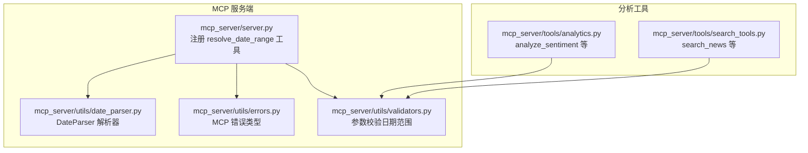
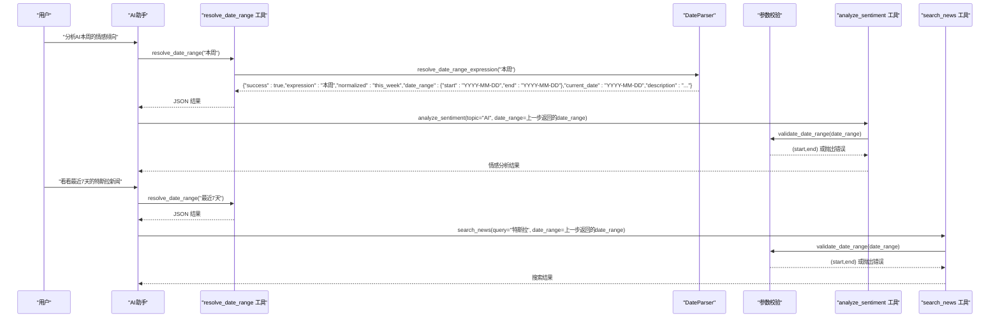
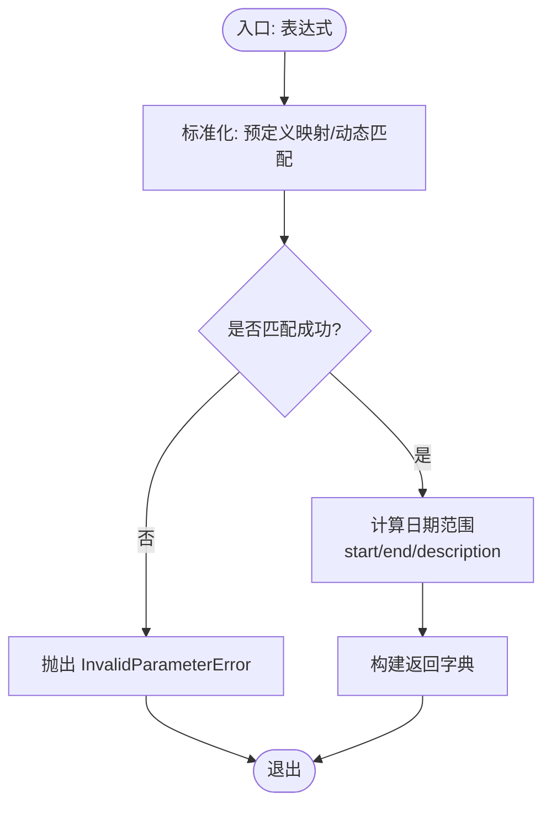
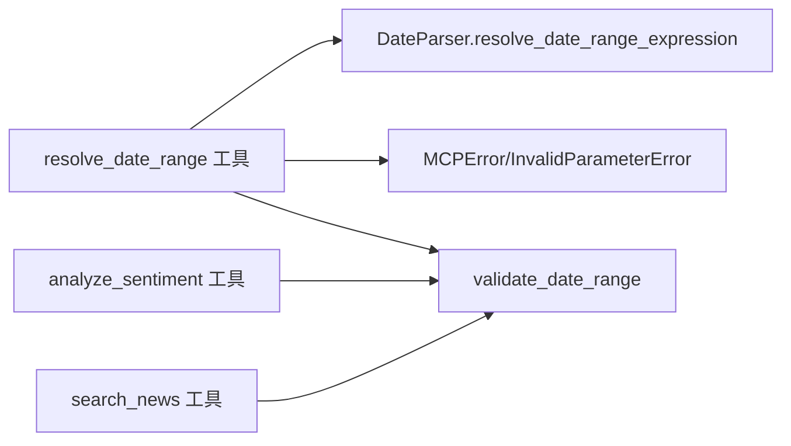

# 日期解析工具

<cite>
**本文引用的文件**
- [mcp_server/server.py](file://mcp_server/server.py)
- [mcp_server/utils/date_parser.py](file://mcp_server/utils/date_parser.py)
- [mcp_server/utils/errors.py](file://mcp_server/utils/errors.py)
- [mcp_server/utils/validators.py](file://mcp_server/utils/validators.py)
- [mcp_server/tools/analytics.py](file://mcp_server/tools/analytics.py)
- [mcp_server/tools/search_tools.py](file://mcp_server/tools/search_tools.py)
</cite>

## 目录
1. [简介](#简介)
2. [项目结构](#项目结构)
3. [核心组件](#核心组件)
4. [架构总览](#架构总览)
5. [详细组件分析](#详细组件分析)
6. [依赖关系分析](#依赖关系分析)
7. [性能考量](#性能考量)
8. [故障排查指南](#故障排查指南)
9. [结论](#结论)
10. [附录](#附录)

## 简介
本文件系统性介绍 resolve_date_range 工具，它是一个面向自然语言日期表达式的解析器，负责将“本周”、“最近7天”等模糊表达转换为精确的日期范围对象，确保 AI 分析流程的一致性和可复现性。该工具在 MCP 服务端以工具形式暴露，返回标准 JSON 结构，包含：
- 成功标志与原始表达式
- 标准化后的表达式
- 日期范围对象（start/end）
- 当前日期
- 描述信息

此外，文档详细说明其参数支持的语法格式、返回结构、在分析流程中的优先级地位、与其他时间敏感型工具（如 analyze_sentiment、search_news）的协作关系、错误处理与日志记录方式，并给出从用户提问到调用本工具再到后续分析的完整链路示例。

## 项目结构
resolve_date_range 工具位于 MCP 服务端，核心实现集中在工具注册与日期解析模块中，配合参数校验与错误类型，形成完整的调用链路。

图表来源
- [mcp_server/server.py](file://mcp_server/server.py#L41-L108)
- [mcp_server/utils/date_parser.py](file://mcp_server/utils/date_parser.py#L329-L422)
- [mcp_server/utils/errors.py](file://mcp_server/utils/errors.py#L1-L94)
- [mcp_server/utils/validators.py](file://mcp_server/utils/validators.py#L145-L209)
- [mcp_server/tools/analytics.py](file://mcp_server/tools/analytics.py#L631-L800)
- [mcp_server/tools/search_tools.py](file://mcp_server/tools/search_tools.py#L52-L98)

章节来源
- [mcp_server/server.py](file://mcp_server/server.py#L41-L108)
- [mcp_server/utils/date_parser.py](file://mcp_server/utils/date_parser.py#L329-L422)

## 核心组件
- resolve_date_range 工具（服务端注册）
  - 作用：接收自然语言日期表达式，返回标准化日期范围 JSON
  - 位置：mcp_server/server.py
  - 特点：优先调用，保证 AI 分析一致性
- DateParser（日期解析器）
  - 作用：将表达式标准化并计算具体日期范围
  - 位置：mcp_server/utils/date_parser.py
  - 方法：resolve_date_range_expression
- 参数校验与错误类型
  - 位置：mcp_server/utils/validators.py、mcp_server/utils/errors.py
  - 作用：统一错误封装与参数约束

章节来源
- [mcp_server/server.py](file://mcp_server/server.py#L41-L108)
- [mcp_server/utils/date_parser.py](file://mcp_server/utils/date_parser.py#L329-L422)
- [mcp_server/utils/errors.py](file://mcp_server/utils/errors.py#L1-L94)
- [mcp_server/utils/validators.py](file://mcp_server/utils/validators.py#L145-L209)

## 架构总览
resolve_date_range 的调用链路如下：

图表来源
- [mcp_server/server.py](file://mcp_server/server.py#L41-L108)
- [mcp_server/utils/date_parser.py](file://mcp_server/utils/date_parser.py#L329-L422)
- [mcp_server/utils/validators.py](file://mcp_server/utils/validators.py#L145-L209)
- [mcp_server/tools/analytics.py](file://mcp_server/tools/analytics.py#L631-L800)
- [mcp_server/tools/search_tools.py](file://mcp_server/tools/search_tools.py#L52-L98)

## 详细组件分析

### resolve_date_range 工具（服务端）
- 注册与职责
  - 以 @mcp.tool 形式注册，接收 expression 字符串参数
  - 优先调用，确保 AI 在分析前获得一致的日期范围
- 返回结构
  - JSON 字段：success、expression、normalized、date_range、current_date、description
  - date_range 内含 start、end（YYYY-MM-DD）
- 错误处理
  - 捕获 MCPError 并转换为统一错误字典
  - 捕获其他异常并返回 INTERNAL_ERROR

章节来源
- [mcp_server/server.py](file://mcp_server/server.py#L41-L108)

### DateParser.resolve_date_range_expression（解析器）
- 支持的表达式类别
  - 单日：今天、昨天、today、yesterday
  - 周：本周、上周、this week、last week
  - 月：本月、上月、this month、last month
  - 最近N天：最近7天、最近30天、last 7 days、last 30 days
  - 动态N天：最近N天、last N days（任意天数）
- 标准化流程
  - 优先匹配预定义映射表
  - 动态匹配“最近N天”/“last N days”
  - 计算 start/end 与描述文本
- 返回结构
  - success、expression、normalized、date_range、current_date、description
  - date_range.start/end 为字符串（YYYY-MM-DD）

图表来源
- [mcp_server/utils/date_parser.py](file://mcp_server/utils/date_parser.py#L329-L422)

章节来源
- [mcp_server/utils/date_parser.py](file://mcp_server/utils/date_parser.py#L329-L422)

### 参数校验与错误类型
- validate_date_range
  - 校验 date_range 字典格式、start/end 顺序、日期不得在未来
  - 返回 (start_date, end_date) 元组或抛出 InvalidParameterError
- 错误类型
  - MCPError 基类，提供 to_dict() 统一错误结构
  - InvalidParameterError 用于参数非法场景

章节来源
- [mcp_server/utils/validators.py](file://mcp_server/utils/validators.py#L145-L209)
- [mcp_server/utils/errors.py](file://mcp_server/utils/errors.py#L1-L94)

### 与时间敏感型工具的协作
- analyze_sentiment
  - 接收 date_range 参数（{"start": "YYYY-MM-DD", "end": "YYYY-MM-DD"}）
  - 若未提供，则默认今天；若提供，则通过 validate_date_range 校验
- search_news
  - 接收 date_range 参数，若未提供则使用最新可用日期范围
  - 通过 validate_date_range 校验日期范围

章节来源
- [mcp_server/tools/analytics.py](file://mcp_server/tools/analytics.py#L631-L800)
- [mcp_server/tools/search_tools.py](file://mcp_server/tools/search_tools.py#L52-L98)

## 依赖关系分析
resolve_date_range 的关键依赖与耦合关系如下：

图表来源
- [mcp_server/server.py](file://mcp_server/server.py#L41-L108)
- [mcp_server/utils/date_parser.py](file://mcp_server/utils/date_parser.py#L329-L422)
- [mcp_server/utils/errors.py](file://mcp_server/utils/errors.py#L1-L94)
- [mcp_server/utils/validators.py](file://mcp_server/utils/validators.py#L145-L209)
- [mcp_server/tools/analytics.py](file://mcp_server/tools/analytics.py#L631-L800)
- [mcp_server/tools/search_tools.py](file://mcp_server/tools/search_tools.py#L52-L98)

章节来源
- [mcp_server/server.py](file://mcp_server/server.py#L41-L108)
- [mcp_server/utils/date_parser.py](file://mcp_server/utils/date_parser.py#L329-L422)
- [mcp_server/utils/validators.py](file://mcp_server/utils/validators.py#L145-L209)
- [mcp_server/tools/analytics.py](file://mcp_server/tools/analytics.py#L631-L800)
- [mcp_server/tools/search_tools.py](file://mcp_server/tools/search_tools.py#L52-L98)

## 性能考量
- 解析复杂度
  - resolve_date_range_expression 主要为字符串匹配与少量数学运算，时间复杂度近似 O(1)
  - 依赖正则匹配与字典查找，开销极低
- I/O 与外部依赖
  - 本工具纯内存计算，不涉及网络或磁盘 I/O
- 一致性与可复现性
  - 使用服务端当前时间计算，避免模型本地计算差异
  - 通过标准化表达式与固定返回结构，确保下游工具输入一致

## 故障排查指南
- 常见错误与定位
  - 无法识别的日期表达式：检查表达式是否在支持列表内（单日、周、月、最近N天、动态N天）
  - 参数为空或类型不符：确认传入 expression 为非空字符串
  - 日期在未来：validate_date_range 会拒绝未来日期
- 日志与错误输出
  - resolve_date_range 工具捕获 MCPError 并返回统一错误字典
  - 其他异常返回 INTERNAL_ERROR，便于前端或调用方识别
- 建议排查步骤
  - 先调用 resolve_date_range 确认返回的 date_range 正确
  - 将返回的 date_range 直接传递给 analyze_sentiment 或 search_news
  - 若仍报错，检查 validate_date_range 的约束（start<=end、不得在未来）

章节来源
- [mcp_server/server.py](file://mcp_server/server.py#L41-L108)
- [mcp_server/utils/errors.py](file://mcp_server/utils/errors.py#L1-L94)
- [mcp_server/utils/validators.py](file://mcp_server/utils/validators.py#L145-L209)

## 结论
resolve_date_range 工具通过标准化自然语言日期表达式，为 AI 分析流程提供一致、可靠的日期范围输入。其返回的 JSON 结构简单明确，与下游 analyze_sentiment、search_news 等工具无缝衔接。配合参数校验与错误封装，能够有效提升分析链路的稳定性与可维护性。

## 附录

### 参数支持的语法格式
- 单日
  - 中文：今天、昨天
  - 英文：today、yesterday
- 周
  - 中文：本周、上周
  - 英文：this week、last week
- 月
  - 中文：本月、上月
  - 英文：this month、last month
- 最近N天
  - 中文：最近7天、最近30天
  - 英文：last 7 days、last 30 days
- 动态N天
  - 中文：最近N天
  - 英文：last N days（任意天数）

章节来源
- [mcp_server/utils/date_parser.py](file://mcp_server/utils/date_parser.py#L329-L422)

### 返回 JSON 结构说明
- 字段
  - success: 布尔，解析是否成功
  - expression: 原始表达式
  - normalized: 标准化后的表达式
  - date_range: 对象，包含 start、end（YYYY-MM-DD）
  - current_date: 当前日期（YYYY-MM-DD）
  - description: 描述文本（如“本周（周一到周日）”）

章节来源
- [mcp_server/utils/date_parser.py](file://mcp_server/utils/date_parser.py#L329-L422)

### 完整调用示例（用户提问到后续分析）
- 示例1：分析 AI 本周情感倾向
  1) resolve_date_range("本周") → 返回 date_range
  2) analyze_sentiment(topic="AI", date_range=上一步返回的date_range)
- 示例2：查看最近7天特斯拉新闻
  1) resolve_date_range("最近7天") → 返回 date_range
  2) search_news(query="特斯拉", date_range=上一步返回的date_range)

章节来源
- [mcp_server/server.py](file://mcp_server/server.py#L41-L108)
- [mcp_server/tools/analytics.py](file://mcp_server/tools/analytics.py#L631-L800)
- [mcp_server/tools/search_tools.py](file://mcp_server/tools/search_tools.py#L52-L98)