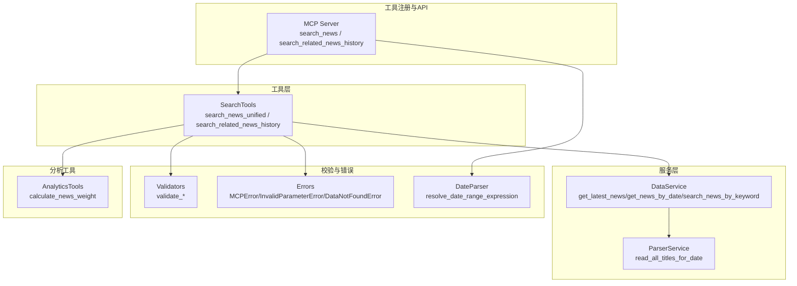
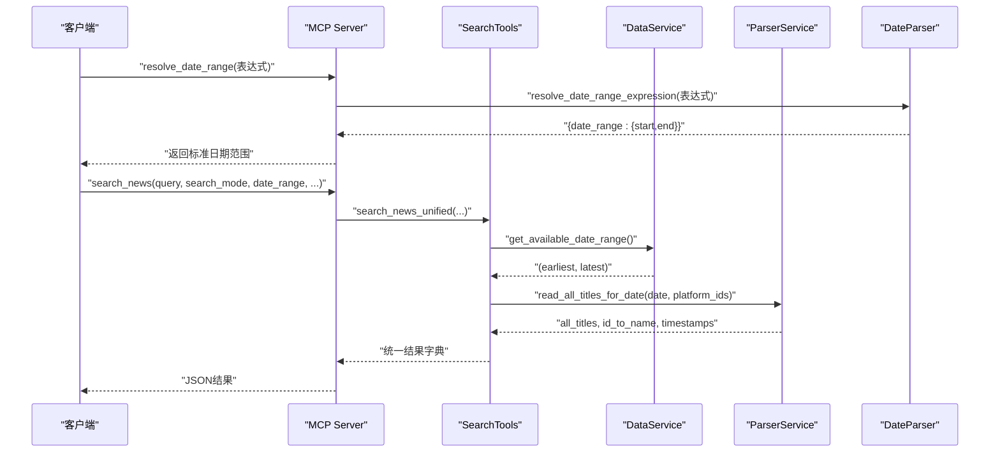
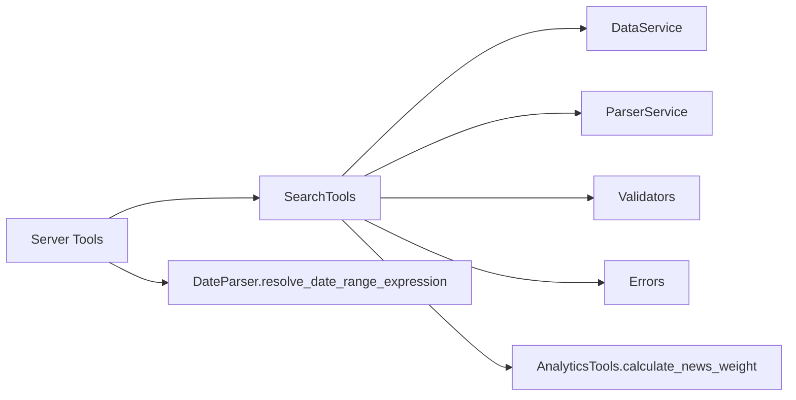

# 智能检索工具

<cite>
**本文引用的文件**
- [mcp_server/tools/search_tools.py](file://mcp_server/tools/search_tools.py)
- [mcp_server/server.py](file://mcp_server/server.py)
- [mcp_server/services/data_service.py](file://mcp_server/services/data_service.py)
- [mcp_server/services/parser_service.py](file://mcp_server/services/parser_service.py)
- [mcp_server/utils/validators.py](file://mcp_server/utils/validators.py)
- [mcp_server/utils/date_parser.py](file://mcp_server/utils/date_parser.py)
- [mcp_server/utils/errors.py](file://mcp_server/utils/errors.py)
- [mcp_server/tools/analytics.py](file://mcp_server/tools/analytics.py)
</cite>

## 目录
1. [简介](#简介)
2. [项目结构](#项目结构)
3. [核心组件](#核心组件)
4. [架构总览](#架构总览)
5. [详细组件分析](#详细组件分析)
6. [依赖关系分析](#依赖关系分析)
7. [性能考量](#性能考量)
8. [故障排查指南](#故障排查指南)
9. [结论](#结论)
10. [附录](#附录)

## 简介
本文件面向“智能检索工具”模块，聚焦两个核心工具：search_news（统一搜索接口）与search_related_news_history（基于种子新闻的历史相关性检索）。文档将系统说明：
- search_news支持keyword、fuzzy、entity三种搜索模式，参数与返回格式、排序与阈值策略；
- 与resolve_date_range工具协同处理日期范围的机制；
- search_mode对结果的影响、sort_by排序选项、threshold相似度阈值的作用；
- search_related_news_history如何基于种子新闻在历史数据中查找相关内容，支持yesterday、last_week、last_month等时间预设；
- 结合代码说明参数定义、返回格式与最佳实践，特别是模糊搜索中的阈值调整策略。

## 项目结构
智能检索工具位于mcp_server/tools/search_tools.py，围绕该工具构建的调用链如下：
- 服务器端API入口：mcp_server/server.py中声明search_news与search_related_news_history两个工具接口；
- 数据访问层：mcp_server/services/data_service.py与mcp_server/services/parser_service.py负责从output目录读取txt格式的新闻标题数据；
- 参数校验与错误模型：mcp_server/utils/validators.py与mcp_server/utils/errors.py提供统一的参数校验与错误类型；
- 日期解析辅助：mcp_server/utils/date_parser.py提供resolve_date_range_expression等日期范围解析能力，便于与search_news配合使用。

图表来源
- [mcp_server/tools/search_tools.py](file://mcp_server/tools/search_tools.py#L38-L702)
- [mcp_server/server.py](file://mcp_server/server.py#L500-L582)
- [mcp_server/services/data_service.py](file://mcp_server/services/data_service.py#L1-L605)
- [mcp_server/services/parser_service.py](file://mcp_server/services/parser_service.py#L1-L356)
- [mcp_server/utils/validators.py](file://mcp_server/utils/validators.py#L1-L352)
- [mcp_server/utils/date_parser.py](file://mcp_server/utils/date_parser.py#L1-L508)
- [mcp_server/utils/errors.py](file://mcp_server/utils/errors.py#L1-L94)
- [mcp_server/tools/analytics.py](file://mcp_server/tools/analytics.py#L1-L120)

章节来源
- [mcp_server/tools/search_tools.py](file://mcp_server/tools/search_tools.py#L38-L702)
- [mcp_server/server.py](file://mcp_server/server.py#L500-L582)

## 核心组件
- SearchTools.search_news_unified：统一搜索入口，支持keyword/fuzzy/entity三种模式；支持按日期范围、平台过滤、limit限制、sort_by排序、threshold阈值控制；返回统一结构，包含summary与results。
- SearchTools.search_related_news_history：基于种子新闻标题/内容，在历史数据中检索相关新闻；支持yesterday/last_week/last_month/custom四种时间预设；综合相似度（关键词重合度×0.7 + 文本相似度×0.3）进行匹配与排序。
- 服务器端工具注册：mcp_server/server.py中注册search_news与search_related_news_history两个工具，作为MCP协议对外暴露的API。
- 数据访问：DataService与ParserService负责从output目录按日期读取txt标题数据，并合并平台维度信息。
- 参数校验与错误：Validators提供validate_keyword、validate_limit、validate_date_range等；Errors提供MCPError及其子类，保证统一错误响应格式。
- 日期解析：DateParser.resolve_date_range_expression可将自然语言日期表达式解析为标准日期范围，便于search_news的date_range参数使用。

章节来源
- [mcp_server/tools/search_tools.py](file://mcp_server/tools/search_tools.py#L38-L702)
- [mcp_server/server.py](file://mcp_server/server.py#L500-L582)
- [mcp_server/services/data_service.py](file://mcp_server/services/data_service.py#L1-L605)
- [mcp_server/services/parser_service.py](file://mcp_server/services/parser_service.py#L160-L260)
- [mcp_server/utils/validators.py](file://mcp_server/utils/validators.py#L90-L210)
- [mcp_server/utils/errors.py](file://mcp_server/utils/errors.py#L1-L94)
- [mcp_server/utils/date_parser.py](file://mcp_server/utils/date_parser.py#L330-L491)

## 架构总览
下面的序列图展示了search_news与resolve_date_range的典型协作流程：客户端先调用resolve_date_range解析自然语言日期表达式，得到标准日期范围，再调用search_news传入date_range参数进行统一搜索。

图表来源
- [mcp_server/server.py](file://mcp_server/server.py#L500-L538)
- [mcp_server/utils/date_parser.py](file://mcp_server/utils/date_parser.py#L330-L423)
- [mcp_server/tools/search_tools.py](file://mcp_server/tools/search_tools.py#L100-L170)
- [mcp_server/services/data_service.py](file://mcp_server/services/data_service.py#L498-L537)
- [mcp_server/services/parser_service.py](file://mcp_server/services/parser_service.py#L160-L260)

## 详细组件分析

### search_news（统一搜索接口）
- 搜索模式
  - keyword：精确包含匹配，相似度固定为1.0，适合强关键词检索。
  - fuzzy：综合相似度（直接包含优先、整体相似度、关键词重合度），阈值控制匹配严格程度。
  - entity：实体名称包含匹配，适合命名实体检索。
- 日期范围处理
  - 若未提供date_range，则使用DataService.get_available_date_range()获取可用日期范围，若无数据则返回错误提示；否则默认使用最新可用日期（today）。
  - 若提供date_range，使用validators.validate_date_range进行校验，禁止未来日期与非法区间。
- 排序选项
  - relevance：按相似度分数排序（fuzzy模式）。
  - weight：使用analytics.calculate_news_weight对结果进行加权排序。
  - date：按日期倒序排序。
- 返回格式
  - success：布尔值，指示调用是否成功。
  - summary：包含total_found、returned_count、requested_limit、search_mode、query、platforms、time_range、sort_by等摘要信息；fuzzy模式额外包含threshold与note提示。
  - results：匹配的新闻列表，每条包含title、platform、platform_name、date、similarity_score、ranks、count、rank等字段；可选包含url与mobileUrl。
- 参数要点
  - query：关键词/内容片段/实体名称，长度限制与空白处理由validators.validate_keyword约束。
  - platforms：平台过滤列表，支持动态从config.yaml读取平台ID。
  - limit：返回条数限制，最大1000。
  - sort_by：排序方式，支持relevance/weight/date。
  - threshold：fuzzy模式下的相似度阈值，范围0-1，内部会裁剪至[0,1]。
  - include_url：是否包含URL字段，节省token。
- 错误处理
  - InvalidParameterError：参数无效或不支持的模式/排序方式。
  - DataNotFoundError：日期范围无数据或无可用数据。
  - MCPError派生类：统一错误字典格式，包含code、message与建议。

章节来源
- [mcp_server/tools/search_tools.py](file://mcp_server/tools/search_tools.py#L38-L241)
- [mcp_server/tools/search_tools.py](file://mcp_server/tools/search_tools.py#L242-L390)
- [mcp_server/tools/search_tools.py](file://mcp_server/tools/search_tools.py#L391-L493)
- [mcp_server/tools/search_tools.py](file://mcp_server/tools/search_tools.py#L494-L702)
- [mcp_server/utils/validators.py](file://mcp_server/utils/validators.py#L90-L210)
- [mcp_server/utils/errors.py](file://mcp_server/utils/errors.py#L1-L94)
- [mcp_server/tools/analytics.py](file://mcp_server/tools/analytics.py#L24-L75)

### search_related_news_history（历史相关性检索）
- 功能概述
  - 基于参考新闻标题/内容，在历史数据中检索相关新闻；支持yesterday、last_week、last_month、custom四种时间预设；综合相似度（关键词重合度×0.7 + 文本相似度×0.3）进行匹配与排序。
- 时间预设
  - yesterday：单日（昨天）。
  - last_week：7天（上周）。
  - last_month：30天（上个月）。
  - custom：需提供start_date与end_date。
- 相似度计算
  - 标题整体相似度：基于difflib.SequenceMatcher计算。
  - 关键词重合度：对参考文本与标题分别提取关键词，计算Jaccard相似度。
  - 综合相似度：0.7×关键词重合度 + 0.3×整体相似度。
- 返回格式
  - success：布尔值。
  - summary：包含total_found、returned_count、requested_limit、threshold、reference_text、reference_keywords、time_preset、date_range等。
  - results：匹配新闻列表，每条包含title、platform、platform_name、date、similarity_score、keyword_overlap、text_similarity、common_keywords、rank等字段；可选包含url与mobileUrl。
  - statistics：包含platform_distribution、date_distribution、avg_similarity等统计信息。
- 参数要点
  - reference_text：参考新闻标题或内容，长度限制与空白处理由validators.validate_keyword约束。
  - time_preset：时间预设，支持yesterday/last_week/last_month/custom。
  - threshold：相关性阈值，范围0-1，内部裁剪至[0,1]。
  - limit：返回条数限制，最大100。
  - include_url：是否包含URL字段，节省token。
- 错误处理
  - InvalidParameterError：参数无效（如custom缺少起止日期、无法提取关键词等）。
  - DataNotFoundError：历史日期无数据。
  - MCPError派生类：统一错误字典格式。

章节来源
- [mcp_server/tools/search_tools.py](file://mcp_server/tools/search_tools.py#L494-L702)
- [mcp_server/utils/validators.py](file://mcp_server/utils/validators.py#L212-L243)
- [mcp_server/utils/errors.py](file://mcp_server/utils/errors.py#L1-L94)

### 服务器端API与调用流程
- search_news工具
  - 服务器端通过@mcp.tool装饰器注册，接收query、search_mode、date_range、platforms、limit、sort_by、threshold、include_url等参数，内部委托SearchTools.search_news_unified执行。
  - 返回JSON字符串，包含统一结果结构。
- search_related_news_history工具
  - 服务器端通过@mcp.tool装饰器注册，接收reference_text、time_preset、threshold、limit、include_url等参数，内部委托SearchTools.search_related_news_history执行。
  - 返回JSON字符串，包含统一结果结构。

章节来源
- [mcp_server/server.py](file://mcp_server/server.py#L500-L582)

### 数据读取与缓存
- ParserService.read_all_titles_for_date
  - 从output/{YYYY年MM月DD日}/txt目录读取txt文件，解析平台ID、标题、排名、URL等信息；支持按平台过滤；对历史数据使用1小时缓存，今日数据使用15分钟缓存。
- DataService.get_available_date_range
  - 扫描output目录，返回最早与最新可用日期，用于search_news默认日期范围推断。

章节来源
- [mcp_server/services/parser_service.py](file://mcp_server/services/parser_service.py#L160-L260)
- [mcp_server/services/data_service.py](file://mcp_server/services/data_service.py#L498-L537)

### 参数定义与返回格式对照
- search_news_unified
  - 输入参数：query、search_mode、date_range、platforms、limit、sort_by、threshold、include_url
  - 输出结构：success、summary（包含total_found、returned_count、requested_limit、search_mode、query、platforms、time_range、sort_by、threshold等）、results（每条含title、platform、platform_name、date、similarity_score、ranks、count、rank、可选url/mobileUrl）
- search_related_news_history
  - 输入参数：reference_text、time_preset、start_date/end_date（custom时）、threshold、limit、include_url
  - 输出结构：success、summary（包含total_found、returned_count、requested_limit、threshold、reference_text、reference_keywords、time_preset、date_range）、results（每条含title、platform、platform_name、date、similarity_score、keyword_overlap、text_similarity、common_keywords、rank、可选url/mobileUrl）、statistics（platform_distribution、date_distribution、avg_similarity）

章节来源
- [mcp_server/tools/search_tools.py](file://mcp_server/tools/search_tools.py#L38-L241)
- [mcp_server/tools/search_tools.py](file://mcp_server/tools/search_tools.py#L494-L702)

### 模糊搜索阈值调整策略（best practices）
- 模糊匹配流程
  - 直接包含判断优先，命中即返回相似度1.0；
  - 否则计算整体相似度（SequenceMatcher ratio）；
  - 分词提取关键词，计算关键词重合度（Jaccard系数）；
  - 综合相似度=0.3×整体相似度+0.7×关键词重合度；
  - 与threshold比较决定是否纳入结果。
- 阈值建议
  - 较宽松场景（召回优先）：threshold=0.3~0.4；
  - 较严格场景（精度优先）：threshold=0.6~0.7；
  - 若fuzzy模式返回数量不足limit，工具会补充note提示“相似度阈值X仅匹配到Y条结果”，便于用户微调阈值。
- 平台与URL
  - include_url=false可减少token消耗；如需展示链接，可按需开启。

章节来源
- [mcp_server/tools/search_tools.py](file://mcp_server/tools/search_tools.py#L291-L441)
- [mcp_server/tools/search_tools.py](file://mcp_server/tools/search_tools.py#L494-L702)

## 依赖关系分析
- 组件耦合
  - SearchTools依赖DataService与ParserService进行数据读取；依赖validators进行参数校验；依赖errors进行统一错误处理；依赖analytics.calculate_news_weight进行权重排序。
  - 服务器端工具注册依赖DateParser.resolve_date_range_expression，便于将自然语言日期表达式标准化为date_range。
- 外部依赖
  - Python内置库（datetime、difflib、collections等）与第三方库（yaml、pathlib等）。
- 潜在循环依赖
  - 当前模块间为单向依赖，未发现循环导入。

图表来源
- [mcp_server/tools/search_tools.py](file://mcp_server/tools/search_tools.py#L38-L702)
- [mcp_server/server.py](file://mcp_server/server.py#L500-L582)
- [mcp_server/utils/date_parser.py](file://mcp_server/utils/date_parser.py#L330-L423)
- [mcp_server/tools/analytics.py](file://mcp_server/tools/analytics.py#L24-L75)

章节来源
- [mcp_server/tools/search_tools.py](file://mcp_server/tools/search_tools.py#L38-L702)
- [mcp_server/server.py](file://mcp_server/server.py#L500-L582)
- [mcp_server/utils/date_parser.py](file://mcp_server/utils/date_parser.py#L330-L423)
- [mcp_server/tools/analytics.py](file://mcp_server/tools/analytics.py#L24-L75)

## 性能考量
- 数据读取与缓存
  - ParserService对历史数据采用1小时缓存，今日数据采用15分钟缓存，减少IO开销。
  - DataService对最新新闻、按日期查询等操作设置缓存，提升高频查询性能。
- 模糊匹配复杂度
  - 关键词提取与Jaccard相似度计算为线性复杂度；整体相似度计算为O(n)遍历标题集合。
- 排序与限制
  - relevance与date排序为O(n log n)；weight排序依赖calculate_news_weight，整体仍受结果规模影响。
- 建议
  - 合理设置limit，避免一次性返回过多结果；
  - 在fuzzy模式下根据业务需求调整threshold，平衡召回与精度；
  - 使用platforms过滤缩小搜索范围；
  - 使用date_range限定时间范围，避免跨长期历史扫描。

[本节为通用指导，不直接分析具体文件]

## 故障排查指南
- 常见错误与定位
  - 日期范围错误：validate_date_range抛出InvalidParameterError，检查start/end格式与先后顺序，确认当前可用数据范围。
  - 未来日期查询：DateParser.validate_date_not_future触发，确保查询日期不超过当前日期。
  - 无数据：DataNotFoundError，检查output目录是否存在对应日期文件夹与txt文件。
  - 参数非法：InvalidParameterError，核对search_mode、sort_by、time_preset等枚举值。
- 建议排查步骤
  - 使用resolve_date_range解析自然语言日期表达式，确认date_range标准化结果；
  - 检查平台ID是否在config.yaml中配置；
  - 逐步缩小query范围，观察fuzzy模式下threshold对结果数量的影响；
  - 开启include_url仅在需要时使用，避免token浪费。

章节来源
- [mcp_server/utils/validators.py](file://mcp_server/utils/validators.py#L145-L210)
- [mcp_server/utils/date_parser.py](file://mcp_server/utils/date_parser.py#L295-L329)
- [mcp_server/utils/errors.py](file://mcp_server/utils/errors.py#L1-L94)
- [mcp_server/services/parser_service.py](file://mcp_server/services/parser_service.py#L196-L260)

## 结论
search_news与search_related_news_history共同构成了智能检索的核心能力：
- search_news提供统一入口，支持多种搜索模式与灵活的排序、阈值控制；
- search_related_news_history基于综合相似度在历史数据中发现相关内容，适合追踪话题演化与竞品监测；
- 通过resolve_date_range与date_range的配合，用户可便捷地将自然语言日期表达式转化为标准日期范围；
- 工具层、服务层、校验层与错误层职责清晰，具备良好的扩展性与稳定性。

[本节为总结性内容，不直接分析具体文件]

## 附录
- API调用示例（概念性说明）
  - 使用resolve_date_range解析“最近7天”，得到date_range后调用search_news；
  - 以“人工智能”为主题，调用search_news并设置search_mode为fuzzy，threshold=0.4；
  - 以某篇新闻标题为seed，调用search_related_news_history，time_preset为last_week，threshold=0.4。

[本节为概念性内容，不直接分析具体文件]