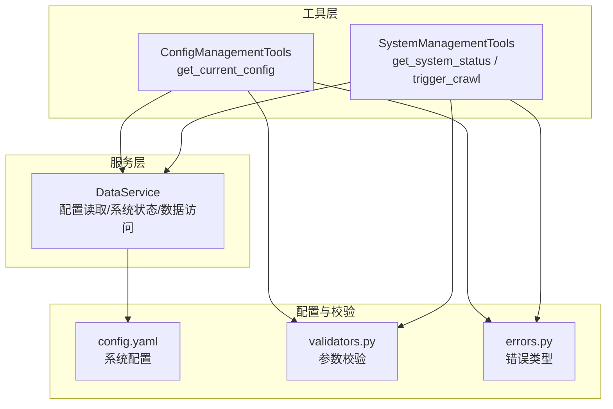
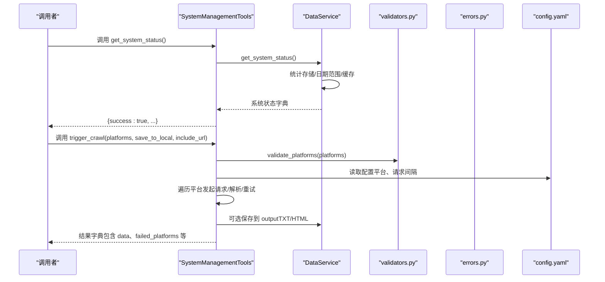
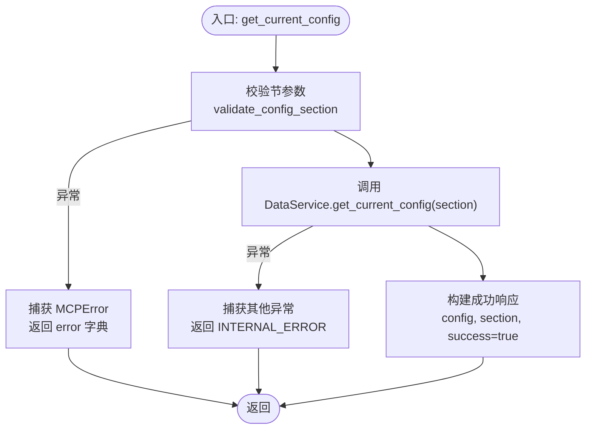
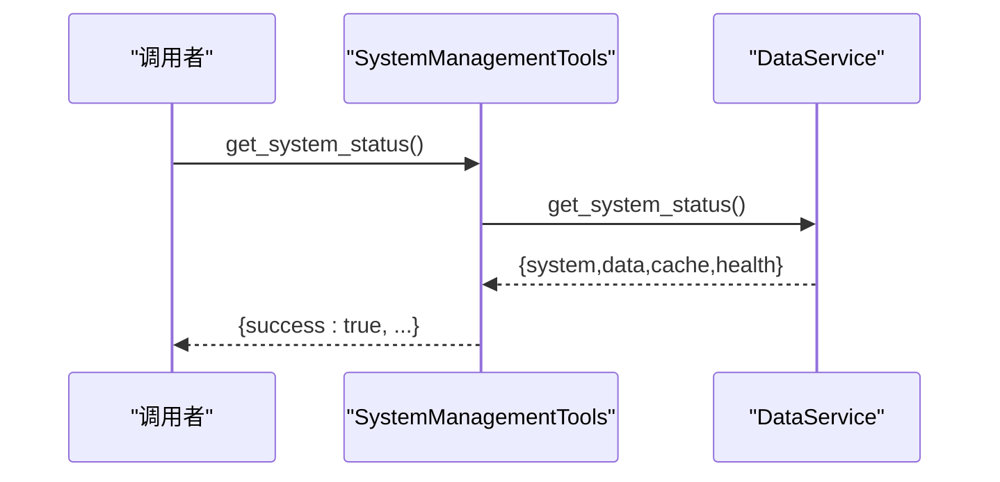
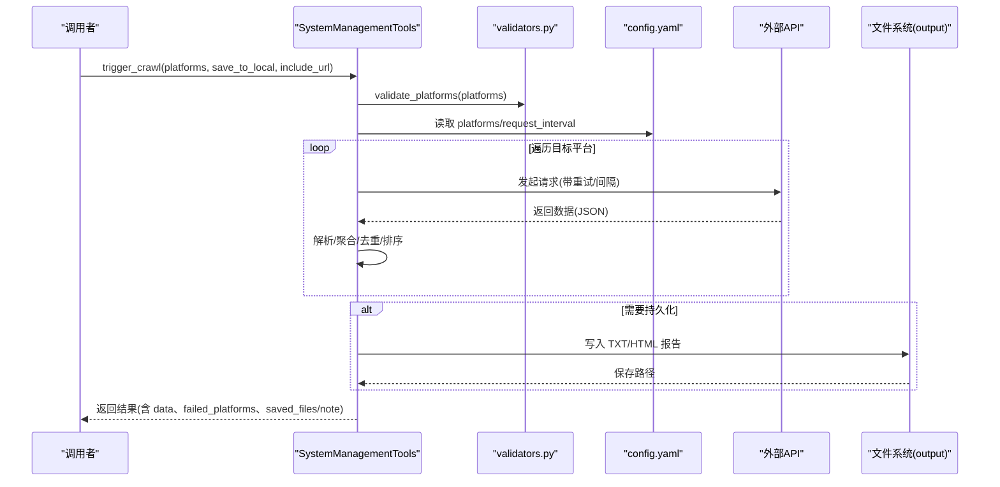
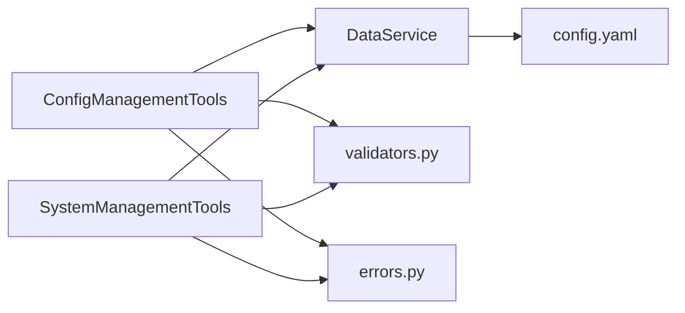

# 配置与系统管理工具

<cite>
**本文引用的文件**
- [mcp_server/tools/config_mgmt.py](file://mcp_server/tools/config_mgmt.py)
- [mcp_server/tools/system.py](file://mcp_server/tools/system.py)
- [mcp_server/services/data_service.py](file://mcp_server/services/data_service.py)
- [mcp_server/utils/validators.py](file://mcp_server/utils/validators.py)
- [mcp_server/utils/errors.py](file://mcp_server/utils/errors.py)
- [config/config.yaml](file://config/config.yaml)
</cite>

## 目录
1. [简介](#简介)
2. [项目结构](#项目结构)
3. [核心组件](#核心组件)
4. [架构总览](#架构总览)
5. [详细组件分析](#详细组件分析)
6. [依赖关系分析](#依赖关系分析)
7. [性能考量](#性能考量)
8. [故障排查指南](#故障排查指南)
9. [结论](#结论)

## 简介
本文件聚焦于配置与系统管理工具组，围绕三个核心工具展开：get_current_config（获取当前系统配置）、get_system_status（获取系统运行状态与健康检查信息）、trigger_crawl（手动触发爬取任务）。文档将详细说明各工具的功能边界、输入输出、错误处理与典型使用场景，并结合代码路径帮助读者快速定位实现细节。

## 项目结构
- 工具层位于 mcp_server/tools，分别提供配置管理、系统管理、数据查询、搜索与分析等能力。
- 服务层位于 mcp_server/services，封装数据访问与解析逻辑。
- 配置文件位于 config/config.yaml，定义爬虫、推送、权重、平台等系统配置。
- 参数校验与错误类型位于 mcp_server/utils，保证工具调用的健壮性。

图表来源
- [mcp_server/tools/config_mgmt.py](file://mcp_server/tools/config_mgmt.py#L1-L66)
- [mcp_server/tools/system.py](file://mcp_server/tools/system.py#L1-L120)
- [mcp_server/services/data_service.py](file://mcp_server/services/data_service.py#L411-L496)
- [config/config.yaml](file://config/config.yaml#L1-L140)
- [mcp_server/utils/validators.py](file://mcp_server/utils/validators.py#L292-L307)
- [mcp_server/utils/errors.py](file://mcp_server/utils/errors.py#L1-L94)

章节来源
- [mcp_server/tools/config_mgmt.py](file://mcp_server/tools/config_mgmt.py#L1-L66)
- [mcp_server/tools/system.py](file://mcp_server/tools/system.py#L1-L120)
- [mcp_server/services/data_service.py](file://mcp_server/services/data_service.py#L411-L496)
- [config/config.yaml](file://config/config.yaml#L1-L140)
- [mcp_server/utils/validators.py](file://mcp_server/utils/validators.py#L292-L307)
- [mcp_server/utils/errors.py](file://mcp_server/utils/errors.py#L1-L94)

## 核心组件
- 配置管理工具（ConfigManagementTools）
  - 提供 get_current_config，支持按节查询系统配置，节可选 all、crawler、push、keywords、weights。
  - 返回统一结构，包含 success 标记与错误时的 error 字段。
- 系统管理工具（SystemManagementTools）
  - 提供 get_system_status，返回系统版本、数据范围、缓存统计与健康状态。
  - 提供 trigger_crawl，支持临时爬取与持久化保存，包含平台选择、保存开关与链接包含控制。
- 数据服务（DataService）
  - 封装配置读取、系统状态统计、数据访问等能力，为工具层提供统一接口。
- 参数校验与错误类型
  - validators 提供 validate_config_section、validate_platforms 等校验函数。
  - errors 定义 MCPError 及其子类，统一错误返回格式。

章节来源
- [mcp_server/tools/config_mgmt.py](file://mcp_server/tools/config_mgmt.py#L26-L66)
- [mcp_server/tools/system.py](file://mcp_server/tools/system.py#L33-L120)
- [mcp_server/services/data_service.py](file://mcp_server/services/data_service.py#L411-L496)
- [mcp_server/utils/validators.py](file://mcp_server/utils/validators.py#L292-L307)
- [mcp_server/utils/errors.py](file://mcp_server/utils/errors.py#L1-L94)

## 架构总览
工具层通过服务层访问配置与数据；服务层解析 config.yaml 并组织返回结构；校验与错误模块贯穿工具与服务层，确保输入合法与错误可追踪。

图表来源
- [mcp_server/tools/system.py](file://mcp_server/tools/system.py#L33-L120)
- [mcp_server/tools/system.py](file://mcp_server/tools/system.py#L121-L376)
- [mcp_server/services/data_service.py](file://mcp_server/services/data_service.py#L538-L604)
- [config/config.yaml](file://config/config.yaml#L1-L140)
- [mcp_server/utils/validators.py](file://mcp_server/utils/validators.py#L43-L88)

## 详细组件分析

### 配置管理工具：get_current_config
- 功能概述
  - 支持按节查询系统配置，节参数可选 all、crawler、push、keywords、weights。
  - 返回统一结构：包含 config、section、success；失败时返回 error 字段。
- 关键流程
  - 参数校验：validate_config_section(section)。
  - 读取配置：DataService.get_current_config(section)。
  - 错误处理：捕获 MCPError 并转为标准 error 字典；其他异常返回 INTERNAL_ERROR。
- 典型使用场景
  - 查看爬虫开关、代理、请求间隔与平台列表（crawler）。
  - 查看通知开关、可用通道与推送窗口（push）。
  - 查看关键词分组与总数（keywords）。
  - 查看权重配置（rank_weight、frequency_weight、hotness_weight）（weights）。
  - 一次性获取全部配置（all）。

图表来源
- [mcp_server/tools/config_mgmt.py](file://mcp_server/tools/config_mgmt.py#L26-L66)
- [mcp_server/services/data_service.py](file://mcp_server/services/data_service.py#L411-L496)
- [mcp_server/utils/validators.py](file://mcp_server/utils/validators.py#L292-L307)
- [mcp_server/utils/errors.py](file://mcp_server/utils/errors.py#L1-L94)

章节来源
- [mcp_server/tools/config_mgmt.py](file://mcp_server/tools/config_mgmt.py#L26-L66)
- [mcp_server/services/data_service.py](file://mcp_server/services/data_service.py#L411-L496)
- [mcp_server/utils/validators.py](file://mcp_server/utils/validators.py#L292-L307)
- [mcp_server/utils/errors.py](file://mcp_server/utils/errors.py#L1-L94)

### 系统管理工具：get_system_status
- 功能概述
  - 返回系统版本、项目根路径、数据存储统计（总大小、最早/最新记录）、缓存统计与健康状态。
- 关键流程
  - 调用 DataService.get_system_status() 组织返回结构。
  - 包装 success 标记，统一错误处理。
- 典型使用场景
  - 运维巡检：确认系统版本、数据覆盖范围、缓存命中情况与健康状态。
  - 故障定位：查看存储占用、数据日期范围，辅助判断数据缺失或异常。

图表来源
- [mcp_server/tools/system.py](file://mcp_server/tools/system.py#L33-L66)
- [mcp_server/services/data_service.py](file://mcp_server/services/data_service.py#L538-L604)

章节来源
- [mcp_server/tools/system.py](file://mcp_server/tools/system.py#L33-L66)
- [mcp_server/services/data_service.py](file://mcp_server/services/data_service.py#L538-L604)

### 系统管理工具：trigger_crawl（手动触发爬取）
- 功能概述
  - 支持临时爬取（不保存）与持久化爬取（保存到 output 目录）。
  - 支持平台选择（platforms）、是否保存（save_to_local）、是否包含链接（include_url）。
  - 返回结果包含任务标识、状态、时间、平台列表、总新闻数、失败平台列表、数据明细与保存文件路径等。
- 关键流程
  - 参数校验：validate_platforms(platforms)。
  - 读取配置：从 config/config.yaml 读取 platforms 与 crawler.request_interval。
  - 平台过滤：若未指定平台则使用配置中的全部平台。
  - 请求与重试：逐平台请求，最多重试若干次，间隔随机抖动。
  - 数据解析与聚合：按平台与标题聚合，计算排名与链接信息。
  - 可选持久化：生成 TXT/HTML 报告，写入 output/年月日/txt 与 output/年月日/html。
  - 错误处理：统一捕获 MCPError 与内部异常，返回标准化 error 字典或带 save_error 的 note。
- failed_platforms 字段
  - 记录请求失败的平台ID列表，便于快速定位问题平台或网络异常。
- 使用场景
  - 调试：临时快速拉取最新数据，不落地，便于快速验证。
  - 数据更新：持久化保存，便于归档与后续分析。
  - 问题排查：结合 failed_platforms 与 note/save_error 字段定位失败原因。

图表来源
- [mcp_server/tools/system.py](file://mcp_server/tools/system.py#L68-L376)
- [config/config.yaml](file://config/config.yaml#L1-L140)
- [mcp_server/utils/validators.py](file://mcp_server/utils/validators.py#L43-L88)
- [mcp_server/utils/errors.py](file://mcp_server/utils/errors.py#L74-L83)

章节来源
- [mcp_server/tools/system.py](file://mcp_server/tools/system.py#L68-L376)
- [config/config.yaml](file://config/config.yaml#L1-L140)
- [mcp_server/utils/validators.py](file://mcp_server/utils/validators.py#L43-L88)
- [mcp_server/utils/errors.py](file://mcp_server/utils/errors.py#L74-L83)

## 依赖关系分析
- 工具层依赖服务层：ConfigManagementTools 与 SystemManagementTools 均依赖 DataService 提供的统一接口。
- 服务层依赖配置文件：DataService.get_current_config 与 get_system_status 读取 config.yaml 并组织返回。
- 校验与错误：validators 提供参数合法性校验；errors 提供统一错误类型与字典化输出。
- 依赖耦合
  - 工具层与服务层：松耦合，通过接口抽象隔离。
  - 服务层与配置文件：强耦合，读取配置决定行为。
  - 服务层与外部API：SystemManagementTools 在 trigger_crawl 中直接发起网络请求，属于工具层职责范围。

图表来源
- [mcp_server/tools/config_mgmt.py](file://mcp_server/tools/config_mgmt.py#L1-L66)
- [mcp_server/tools/system.py](file://mcp_server/tools/system.py#L1-L120)
- [mcp_server/services/data_service.py](file://mcp_server/services/data_service.py#L411-L496)
- [config/config.yaml](file://config/config.yaml#L1-L140)
- [mcp_server/utils/validators.py](file://mcp_server/utils/validators.py#L292-L307)
- [mcp_server/utils/errors.py](file://mcp_server/utils/errors.py#L1-L94)

章节来源
- [mcp_server/tools/config_mgmt.py](file://mcp_server/tools/config_mgmt.py#L1-L66)
- [mcp_server/tools/system.py](file://mcp_server/tools/system.py#L1-L120)
- [mcp_server/services/data_service.py](file://mcp_server/services/data_service.py#L411-L496)
- [config/config.yaml](file://config/config.yaml#L1-L140)
- [mcp_server/utils/validators.py](file://mcp_server/utils/validators.py#L292-L307)
- [mcp_server/utils/errors.py](file://mcp_server/utils/errors.py#L1-L94)

## 性能考量
- 触发爬取时的请求间隔与重试
  - 使用 request_interval 与随机抖动控制请求节奏，避免过于频繁导致限流或失败率升高。
  - 最多重试若干次，失败平台记录在 failed_platforms，便于后续重试或人工干预。
- 配置与系统状态缓存
  - get_current_config 与 get_system_status 在服务层具备缓存逻辑，减少重复读取配置与扫描磁盘的开销。
- 数据持久化
  - 持久化 TXT/HTML 报告涉及文件写入，建议在批量保存时注意磁盘 IO 与并发写入风险。

[本节为通用指导，无需列出具体文件来源]

## 故障排查指南
- get_current_config 返回错误
  - 检查节参数是否为 all、crawler、push、keywords、weights 之一。
  - 若返回 INTERNAL_ERROR，查看 traceback（在 trigger_crawl 的错误返回中可见）。
- trigger_crawl 返回失败
  - 检查 platforms 是否在 config.yaml 的 platforms 列表中。
  - 检查 failed_platforms 字段，定位失败平台；查看 note/save_error 字段了解保存失败原因。
  - 确认 config.yaml 中 crawler.enable_crawler、use_proxy、request_interval 设置合理。
- get_system_status 返回异常
  - 确认 output 目录存在且可读；检查版本文件是否存在。
  - 若缓存统计异常，可清理缓存后重试。

章节来源
- [mcp_server/tools/config_mgmt.py](file://mcp_server/tools/config_mgmt.py#L26-L66)
- [mcp_server/tools/system.py](file://mcp_server/tools/system.py#L68-L376)
- [mcp_server/services/data_service.py](file://mcp_server/services/data_service.py#L538-L604)
- [mcp_server/utils/validators.py](file://mcp_server/utils/validators.py#L43-L88)
- [mcp_server/utils/errors.py](file://mcp_server/utils/errors.py#L1-L94)

## 结论
- get_current_config 提供灵活的配置查询能力，支持按节细分，便于运维与开发快速定位配置项。
- get_system_status 提供系统健康与数据范围概览，是日常巡检与故障定位的重要入口。
- trigger_crawl 在调试与数据更新场景中价值显著，其返回的 failed_platforms 与 note/save_error 有助于快速定位问题并采取补救措施。
- 工具层与服务层职责清晰，配合 validators 与 errors 形成统一的参数校验与错误处理体系，提升系统的稳定性与可观测性。