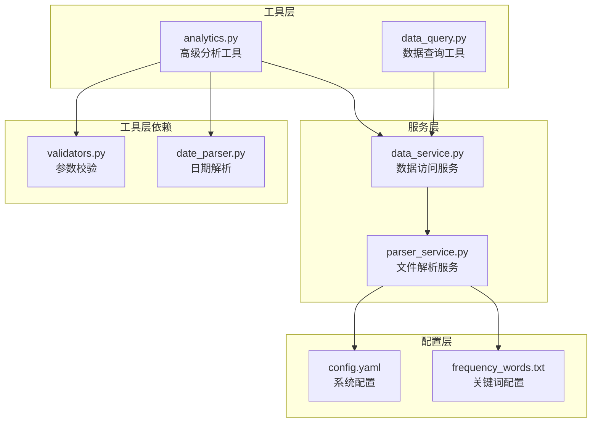
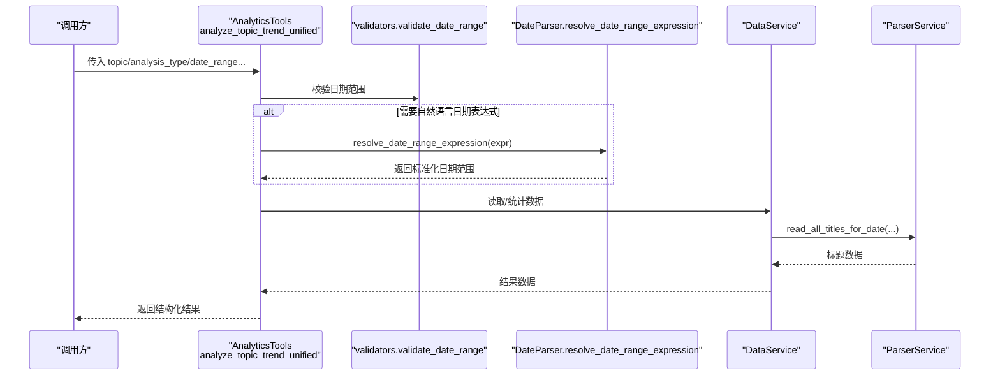
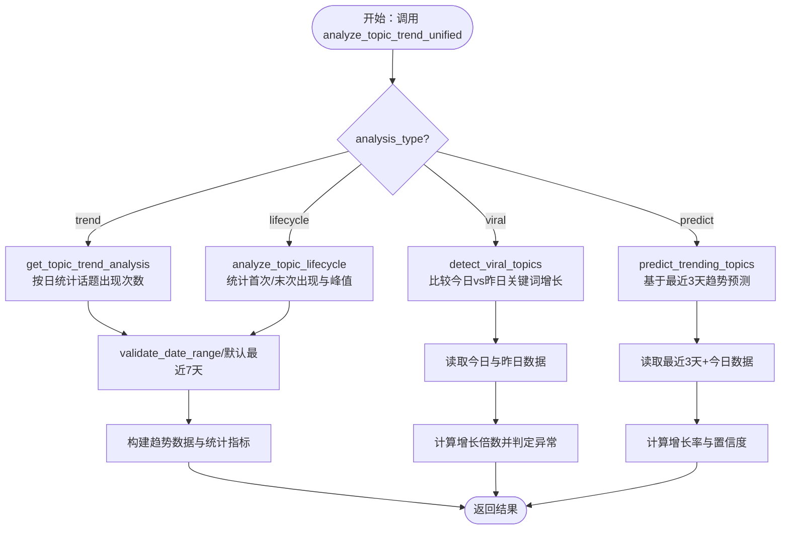
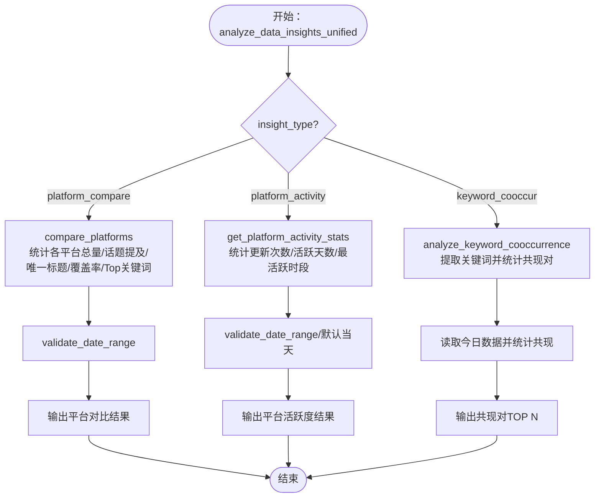
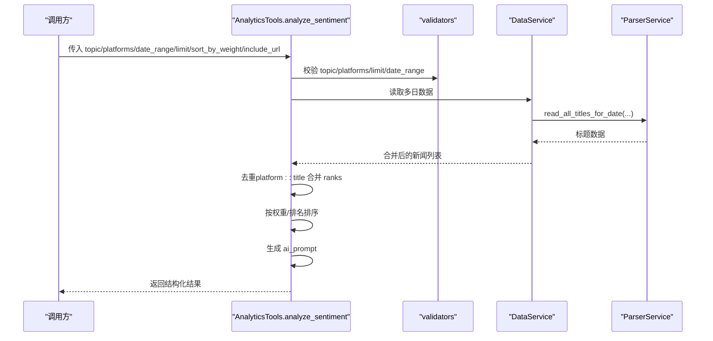
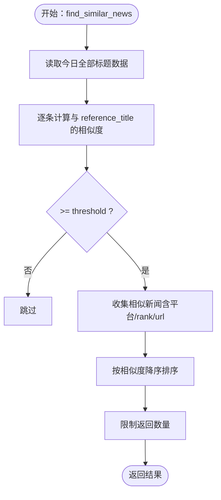
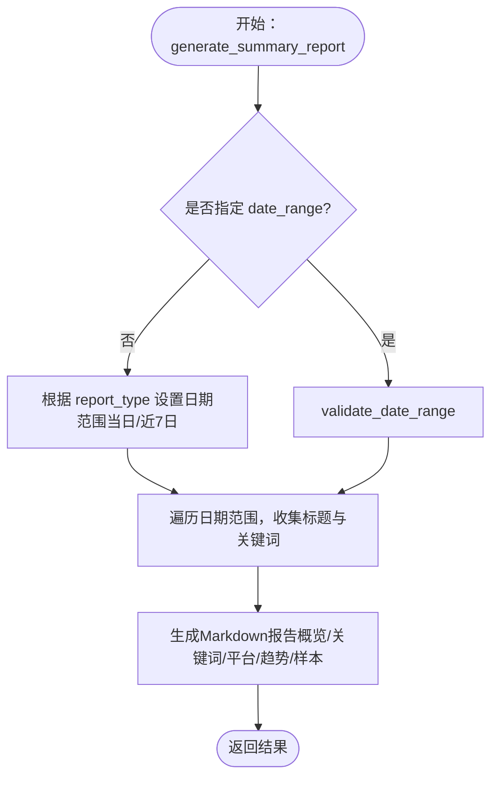
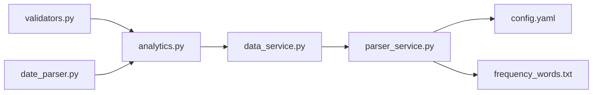

# 高级数据分析工具

<cite>
**本文引用的文件**
- [analytics.py](file://mcp_server/tools/analytics.py)
- [data_service.py](file://mcp_server/services/data_service.py)
- [parser_service.py](file://mcp_server/services/parser_service.py)
- [validators.py](file://mcp_server/utils/validators.py)
- [date_parser.py](file://mcp_server/utils/date_parser.py)
- [data_query.py](file://mcp_server/tools/data_query.py)
- [config.yaml](file://config/config.yaml)
- [frequency_words.txt](file://config/frequency_words.txt)
</cite>

## 目录
1. [简介](#简介)
2. [项目结构](#项目结构)
3. [核心组件](#核心组件)
4. [架构总览](#架构总览)
5. [详细组件分析](#详细组件分析)
6. [依赖关系分析](#依赖关系分析)
7. [性能考量](#性能考量)
8. [故障排查指南](#故障排查指南)
9. [结论](#结论)
10. [附录](#附录)

## 简介
本文件面向高级数据分析工具组，围绕五个核心工具展开：analyze_topic_trend（统一话题趋势分析）、analyze_data_insights（统一数据洞察）、analyze_sentiment（情感倾向分析）、find_similar_news（相似新闻匹配）与generate_summary_report（自动摘要报告）。文档将系统说明各工具的功能边界、参数配置、返回结构、典型应用场景，并重点阐释analyze_topic_trend与resolve_date_range工具的协同使用方式，以及analyze_sentiment的去重与排序机制。

## 项目结构
- 工具层：位于 mcp_server/tools，提供面向用户的分析工具入口（analytics.py、data_query.py）。
- 服务层：位于 mcp_server/services，封装数据访问与解析（data_service.py、parser_service.py）。
- 工具层依赖：参数校验（validators.py）、日期解析（date_parser.py）。
- 配置层：config 目录下的 YAML 与关键词配置文件，支撑权重、平台、关键词等配置。

图表来源
- [analytics.py](file://mcp_server/tools/analytics.py#L1-L120)
- [data_query.py](file://mcp_server/tools/data_query.py#L1-L120)
- [data_service.py](file://mcp_server/services/data_service.py#L1-L120)
- [parser_service.py](file://mcp_server/services/parser_service.py#L1-L120)
- [validators.py](file://mcp_server/utils/validators.py#L1-L120)
- [date_parser.py](file://mcp_server/utils/date_parser.py#L1-L120)
- [config.yaml](file://config/config.yaml#L1-L140)
- [frequency_words.txt](file://config/frequency_words.txt#L1-L114)

章节来源
- [analytics.py](file://mcp_server/tools/analytics.py#L1-L120)
- [data_service.py](file://mcp_server/services/data_service.py#L1-L120)
- [parser_service.py](file://mcp_server/services/parser_service.py#L1-L120)
- [validators.py](file://mcp_server/utils/validators.py#L1-L120)
- [date_parser.py](file://mcp_server/utils/date_parser.py#L1-L120)
- [config.yaml](file://config/config.yaml#L1-L140)
- [frequency_words.txt](file://config/frequency_words.txt#L1-L114)

## 核心组件
- analyze_topic_trend（统一话题趋势分析）
  - 支持四种分析类型：trend（热度趋势）、lifecycle（生命周期）、viral（异常热度检测）、predict（话题预测）。
  - 与 resolve_date_range（日期范围解析）协同：通过 validate_date_range 与 DateParser.resolve_date_range_expression，确保日期范围合法且可复现。
- analyze_data_insights（统一数据洞察）
  - 支持三种洞察模式：platform_compare（平台对比）、platform_activity（平台活跃度统计）、keyword_cooccur（关键词共现）。
- analyze_sentiment（情感倾向分析）
  - 生成结构化 AI 提示词，支持按权重排序与去重；可按平台、日期范围筛选。
- find_similar_news（相似新闻匹配）
  - 基于标题相似度（SequenceMatcher）进行匹配，支持阈值与上限控制。
- generate_summary_report（自动摘要报告）
  - 自动生成每日/周报，包含数据概览、热门关键词、平台活跃度、趋势与精选样本。

章节来源
- [analytics.py](file://mcp_server/tools/analytics.py#L156-L243)
- [analytics.py](file://mcp_server/tools/analytics.py#L244-L387)
- [analytics.py](file://mcp_server/tools/analytics.py#L402-L511)
- [analytics.py](file://mcp_server/tools/analytics.py#L526-L616)
- [analytics.py](file://mcp_server/tools/analytics.py#L631-L803)
- [analytics.py](file://mcp_server/tools/analytics.py#L910-L1015)
- [analytics.py](file://mcp_server/tools/analytics.py#L1158-L1336)
- [validators.py](file://mcp_server/utils/validators.py#L145-L210)
- [date_parser.py](file://mcp_server/utils/date_parser.py#L330-L424)

## 架构总览
工具层通过统一的参数校验与日期解析，调用服务层的数据访问与解析，最终产出结构化的分析结果。权重与配置来源于配置文件，影响情感分析与摘要报告的排序与统计。

图表来源
- [analytics.py](file://mcp_server/tools/analytics.py#L156-L243)
- [validators.py](file://mcp_server/utils/validators.py#L145-L210)
- [date_parser.py](file://mcp_server/utils/date_parser.py#L330-L424)
- [data_service.py](file://mcp_server/services/data_service.py#L160-L220)
- [parser_service.py](file://mcp_server/services/parser_service.py#L160-L260)

## 详细组件分析

### analyze_topic_trend（统一话题趋势分析）
- 功能概述
  - 统一入口 analyze_topic_trend_unified 支持四种分析类型：trend、lifecycle、viral、predict。
  - trend/lifecycle 支持指定日期范围与粒度；viral/predict 无需 topic 参数，使用通用检测/预测。
- 参数与返回
  - 关键参数：topic、analysis_type、date_range、granularity、threshold、time_window、lookahead_hours、confidence_threshold。
  - 返回字段：success、topic、date_range、granularity/trend_data/statistics、trend_direction 等。
- 与 resolve_date_range 的协同
  - 若传入自然语言日期表达式，工具内部调用 resolve_date_range_expression，将表达式标准化为 start/end。
  - validate_date_range 负责校验 start/end 的合法性与范围约束。
- 典型场景
  - 分析“人工智能”最近7天趋势、追踪“比特币”生命周期、检测异常热度、预测未来热点。

图表来源
- [analytics.py](file://mcp_server/tools/analytics.py#L156-L243)
- [analytics.py](file://mcp_server/tools/analytics.py#L244-L387)
- [analytics.py](file://mcp_server/tools/analytics.py#L1465-L1621)
- [analytics.py](file://mcp_server/tools/analytics.py#L1623-L1757)
- [analytics.py](file://mcp_server/tools/analytics.py#L1759-L1906)
- [validators.py](file://mcp_server/utils/validators.py#L145-L210)
- [date_parser.py](file://mcp_server/utils/date_parser.py#L330-L424)

章节来源
- [analytics.py](file://mcp_server/tools/analytics.py#L156-L243)
- [analytics.py](file://mcp_server/tools/analytics.py#L244-L387)
- [analytics.py](file://mcp_server/tools/analytics.py#L1465-L1621)
- [analytics.py](file://mcp_server/tools/analytics.py#L1623-L1757)
- [analytics.py](file://mcp_server/tools/analytics.py#L1759-L1906)
- [validators.py](file://mcp_server/utils/validators.py#L145-L210)
- [date_parser.py](file://mcp_server/utils/date_parser.py#L330-L424)

### analyze_data_insights（统一数据洞察）
- 功能概述
  - platform_compare：对比不同平台对同一话题的关注度，输出覆盖率、唯一标题数、Top关键词等。
  - platform_activity：统计各平台更新次数、活跃天数、日均新闻数、最活跃时段。
  - keyword_cooccur：分析关键词共现，过滤最小频次，取TOP N。
- 参数与返回
  - platform_compare：topic、date_range、min_frequency/top_n（后者用于 keyword_cooccur）。
  - 返回字段：success、topic/date_range、platform_stats/unique_topics、total_platforms 等。
- 典型场景
  - 对比“人工智能”在知乎/微博的关注度；分析平台活跃度与发布时间规律；挖掘关键词关联。

图表来源
- [analytics.py](file://mcp_server/tools/analytics.py#L89-L155)
- [analytics.py](file://mcp_server/tools/analytics.py#L402-L511)
- [analytics.py](file://mcp_server/tools/analytics.py#L1338-L1464)
- [analytics.py](file://mcp_server/tools/analytics.py#L526-L616)

章节来源
- [analytics.py](file://mcp_server/tools/analytics.py#L89-L155)
- [analytics.py](file://mcp_server/tools/analytics.py#L402-L511)
- [analytics.py](file://mcp_server/tools/analytics.py#L1338-L1464)
- [analytics.py](file://mcp_server/tools/analytics.py#L526-L616)

### analyze_sentiment（情感倾向分析）
- 功能概述
  - 生成结构化 AI 提示词，指导对新闻标题进行情感分析（正面/负面/中性）。
  - 支持按平台、日期范围过滤；支持去重（同一标题仅保留一次，合并 ranks）；支持按权重排序。
- 参数与返回
  - 关键参数：topic、platforms、date_range、limit、sort_by_weight、include_url。
  - 返回字段：success、method、summary（总数/去重数/平台集合/排序方式）、ai_prompt、news_sample、usage_note/note。
- 去重与排序机制
  - 去重键：platform::title，若同一标题在多天出现，合并 ranks 并重新计算 count。
  - 排序：若启用 sort_by_weight，按 calculate_news_weight 降序；否则按 rank 升序。
- 典型场景
  - 分析“特斯拉”相关新闻情感倾向；限定日期范围与平台；返回结构化提示词给 AI。

图表来源
- [analytics.py](file://mcp_server/tools/analytics.py#L631-L803)
- [analytics.py](file://mcp_server/tools/analytics.py#L24-L75)
- [data_service.py](file://mcp_server/services/data_service.py#L160-L220)
- [parser_service.py](file://mcp_server/services/parser_service.py#L160-L260)
- [validators.py](file://mcp_server/utils/validators.py#L145-L210)

章节来源
- [analytics.py](file://mcp_server/tools/analytics.py#L631-L803)
- [analytics.py](file://mcp_server/tools/analytics.py#L24-L75)
- [data_service.py](file://mcp_server/services/data_service.py#L160-L220)
- [parser_service.py](file://mcp_server/services/parser_service.py#L160-L260)
- [validators.py](file://mcp_server/utils/validators.py#L145-L210)

### find_similar_news（相似新闻匹配）
- 功能概述
  - 基于标题相似度（SequenceMatcher）查找与参考标题相似的新闻，支持阈值与上限控制。
- 参数与返回
  - 关键参数：reference_title、threshold、limit、include_url。
  - 返回字段：success、summary（总数/返回数/阈值/参考标题）、similar_news（按相似度降序）。
- 典型场景
  - 查找与“特斯拉降价”相似的新闻；调整阈值以平衡召回与精度。

图表来源
- [analytics.py](file://mcp_server/tools/analytics.py#L910-L1015)
- [parser_service.py](file://mcp_server/services/parser_service.py#L160-L260)

章节来源
- [analytics.py](file://mcp_server/tools/analytics.py#L910-L1015)
- [parser_service.py](file://mcp_server/services/parser_service.py#L160-L260)

### generate_summary_report（自动摘要报告）
- 功能概述
  - 自动生成每日/周报，包含数据概览、热门关键词、平台活跃度、趋势分析与精选样本。
- 参数与返回
  - 关键参数：report_type（daily/weekly）、date_range（可选）。
  - 返回字段：success、report_type/date_range、markdown_report、statistics。
- 典型场景
  - 生成今日/本周热点摘要；用于团队汇报或值班总结。

图表来源
- [analytics.py](file://mcp_server/tools/analytics.py#L1158-L1336)
- [validators.py](file://mcp_server/utils/validators.py#L145-L210)

章节来源
- [analytics.py](file://mcp_server/tools/analytics.py#L1158-L1336)
- [validators.py](file://mcp_server/utils/validators.py#L145-L210)

## 依赖关系分析
- 工具层依赖
  - 参数校验：validators 提供 validate_date_range、validate_keyword、validate_platforms、validate_limit 等。
  - 日期解析：date_parser 提供 resolve_date_range_expression 与 parse_date_query。
- 服务层依赖
  - data_service 依赖 parser_service 读取 txt 数据并缓存；解析频率词配置与系统配置。
- 配置依赖
  - config.yaml 提供平台列表、权重配置（rank_weight、frequency_weight、hotness_weight）。
  - frequency_words.txt 定义个人关注词组，用于 get_trending_topics 等统计。

图表来源
- [analytics.py](file://mcp_server/tools/analytics.py#L1-L120)
- [validators.py](file://mcp_server/utils/validators.py#L1-L120)
- [date_parser.py](file://mcp_server/utils/date_parser.py#L1-L120)
- [data_service.py](file://mcp_server/services/data_service.py#L1-L120)
- [parser_service.py](file://mcp_server/services/parser_service.py#L1-L120)
- [config.yaml](file://config/config.yaml#L110-L140)
- [frequency_words.txt](file://config/frequency_words.txt#L1-L114)

章节来源
- [analytics.py](file://mcp_server/tools/analytics.py#L1-L120)
- [validators.py](file://mcp_server/utils/validators.py#L1-L120)
- [date_parser.py](file://mcp_server/utils/date_parser.py#L1-L120)
- [data_service.py](file://mcp_server/services/data_service.py#L1-L120)
- [parser_service.py](file://mcp_server/services/parser_service.py#L1-L120)
- [config.yaml](file://config/config.yaml#L110-L140)
- [frequency_words.txt](file://config/frequency_words.txt#L1-L114)

## 性能考量
- 缓存策略
  - ParserService.read_all_titles_for_date 对历史数据使用较长 TTL，今日数据使用较短 TTL，减少 IO 压力。
  - DataService 对常用查询（最新新闻、按日期查询、趋势话题）设置缓存，降低重复计算成本。
- 时间复杂度
  - analyze_topic_trend：按日遍历，时间复杂度 O(D×N)，D 为天数，N 为当日标题数。
  - keyword_cooccur：两两共现统计，时间复杂度 O(N×K^2)，K 为标题中关键词数。
  - find_similar_news：逐条计算相似度，时间复杂度 O(N^2)（未做索引优化）。
- 排序与限制
  - analyze_sentiment 在去重后按权重排序，再截断 limit，避免输出过大。
  - generate_summary_report 采用确定性排序（权重+标题字母序），保证可复现性。

章节来源
- [parser_service.py](file://mcp_server/services/parser_service.py#L160-L260)
- [data_service.py](file://mcp_server/services/data_service.py#L30-L120)
- [analytics.py](file://mcp_server/tools/analytics.py#L526-L616)
- [analytics.py](file://mcp_server/tools/analytics.py#L910-L1015)
- [analytics.py](file://mcp_server/tools/analytics.py#L1158-L1336)

## 故障排查指南
- 日期相关错误
  - validate_date_range 会在 start/end 校验失败、日期在未来或超出可用范围时报错；建议使用 resolve_date_range_expression 或 validate_date_query。
- 数据缺失
  - ParserService.read_all_titles_for_date 在找不到数据目录或空文件时抛出 DataNotFoundError；确认 output 目录与日期是否正确。
- 参数非法
  - validators 对 limit、keyword、platforms 等参数进行严格校验；注意阈值范围与模式枚举。
- 建议
  - 使用 resolve_date_range_expression 统一解析自然语言日期，避免 AI 自行计算导致不一致。
  - 在高频查询场景开启缓存，减少重复 IO。

章节来源
- [validators.py](file://mcp_server/utils/validators.py#L145-L210)
- [date_parser.py](file://mcp_server/utils/date_parser.py#L330-L424)
- [parser_service.py](file://mcp_server/services/parser_service.py#L160-L260)

## 结论
本工具组通过统一的参数校验与日期解析，结合服务层的数据访问与解析，实现了从趋势分析、平台对比、情感分析到相似新闻匹配与自动摘要的全链路能力。analyze_topic_trend 与 resolve_date_range 的协同确保了日期范围的准确与可复现；analyze_sentiment 的去重与排序提升了结果质量与可解释性；generate_summary_report 提供了结构化的自动化报告模板。建议在生产环境中充分利用缓存与参数校验，以获得更稳健的性能与体验。

## 附录
- 配置要点
  - 平台列表与权重：config.yaml 的 platforms 与 weight 部分影响平台排序与权重计算。
  - 关注词：frequency_words.txt 定义个人关注词组，get_trending_topics 基于此统计。
- 常用调用路径
  - analyze_topic_trend_unified：mcp_server/tools/analytics.py
  - analyze_data_insights_unified：mcp_server/tools/analytics.py
  - analyze_sentiment：mcp_server/tools/analytics.py
  - find_similar_news：mcp_server/tools/analytics.py
  - generate_summary_report：mcp_server/tools/analytics.py
  - 数据访问：mcp_server/services/data_service.py
  - 文件解析：mcp_server/services/parser_service.py
  - 参数校验：mcp_server/utils/validators.py
  - 日期解析：mcp_server/utils/date_parser.py