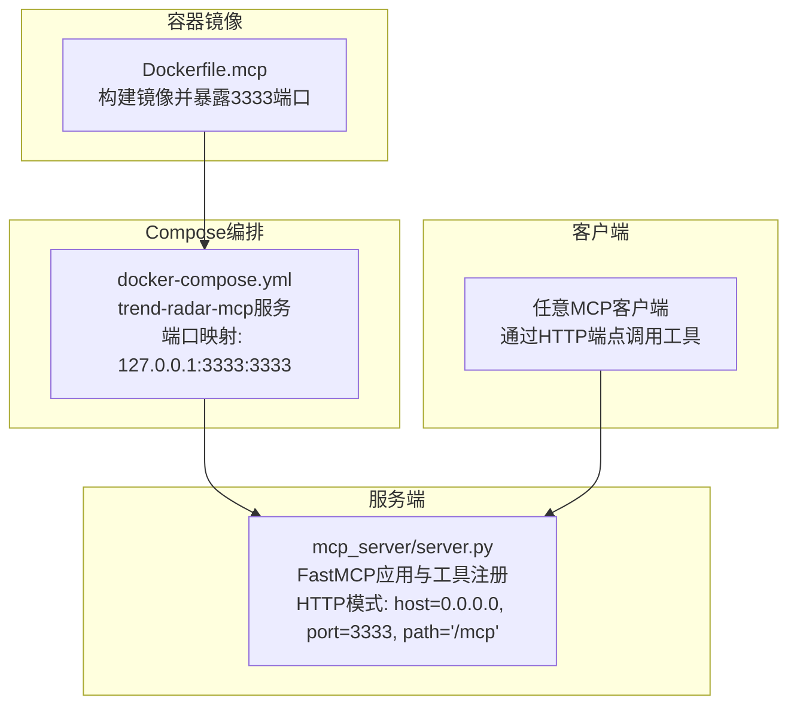
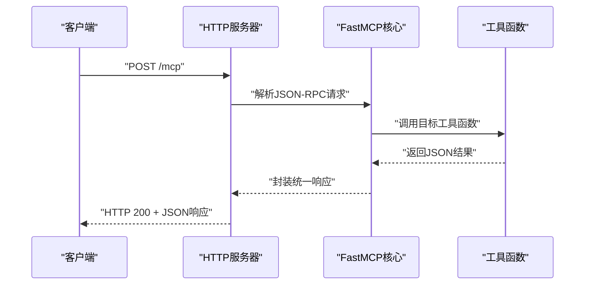
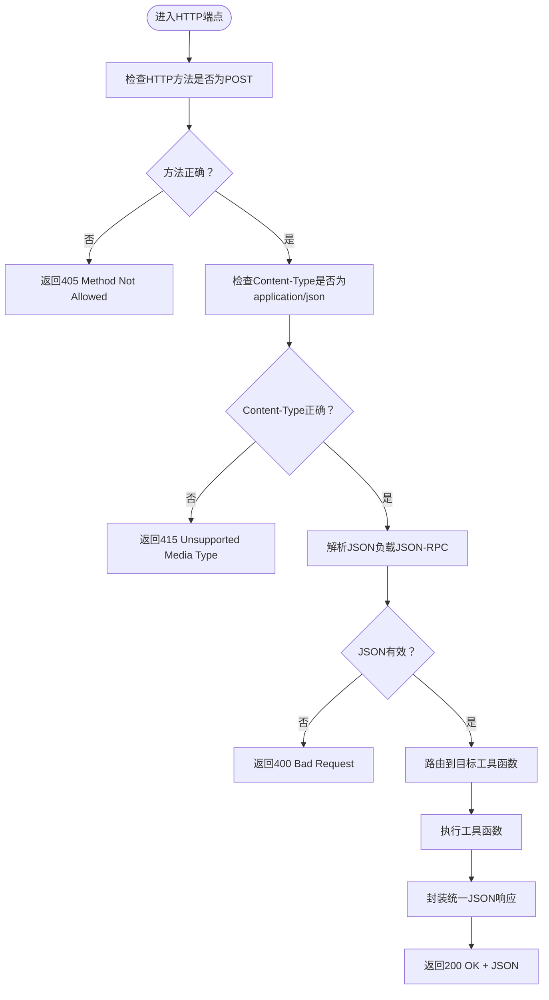
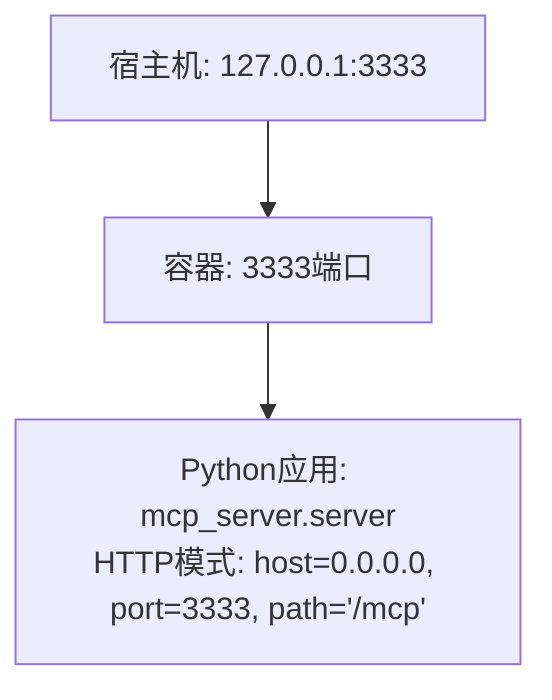
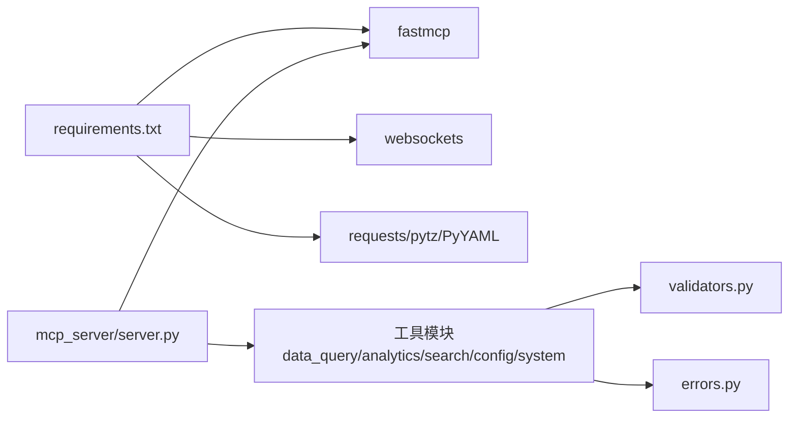

# HTTP传输模式

<cite>
**本文引用的文件**
- [mcp_server/server.py](file://mcp_server/server.py)
- [docker/Dockerfile.mcp](file://docker/Dockerfile.mcp)
- [docker/docker-compose.yml](file://docker/docker-compose.yml)
- [start-http.sh](file://start-http.sh)
- [start-http.bat](file://start-http.bat)
- [docs/MCP-API-Reference.md](file://docs/MCP-API-Reference.md)
- [requirements.txt](file://requirements.txt)
- [mcp_server/utils/errors.py](file://mcp_server/utils/errors.py)
- [mcp_server/utils/validators.py](file://mcp_server/utils/validators.py)
</cite>

## 目录
1. [简介](#简介)
2. [项目结构](#项目结构)
3. [核心组件](#核心组件)
4. [架构总览](#架构总览)
5. [详细组件分析](#详细组件分析)
6. [依赖关系分析](#依赖关系分析)
7. [性能考量](#性能考量)
8. [故障排查指南](#故障排查指南)
9. [结论](#结论)
10. [附录](#附录)

## 简介
本章节聚焦于MCP服务器的HTTP传输模式，面向生产级部署场景，说明如何通过mcp.run(transport='http', host, port, path='/mcp')对外暴露REST风格的MCP接口，支持跨网络、跨平台的客户端访问。文档涵盖：
- host配置为0.0.0.0时的网络监听行为与安全覆盖方式
- /mcp端点的请求处理机制（POST方法、Content-Type要求、JSON-RPC格式解析与响应封装）
- Docker部署文件中的端口映射、网络配置与反向代理集成方案
- HTTPS配置建议、CORS策略、速率限制等生产环境安全最佳实践

## 项目结构
与HTTP传输模式直接相关的文件与职责如下：
- mcp_server/server.py：定义FastMCP应用、注册工具函数，并提供run_server入口，支持stdio与http两种传输模式；HTTP模式下默认监听host=0.0.0.0、port=3333、path='/mcp'
- docker/Dockerfile.mcp：构建MCP专用镜像，暴露3333端口，容器内以HTTP模式启动
- docker/docker-compose.yml：提供独立的trend-radar-mcp服务，映射宿主机127.0.0.1:3333:3333，便于本地测试与反向代理接入
- start-http.sh/start-http.bat：脚本化启动HTTP模式，便于开发与演示
- docs/MCP-API-Reference.md：提供API参考与错误格式约定，便于客户端对接
- requirements.txt：声明FastMCP等依赖
- mcp_server/utils/errors.py：统一错误格式，便于HTTP层包装
- mcp_server/utils/validators.py：参数校验逻辑，保障HTTP请求参数合法性

图表来源
- [docker/Dockerfile.mcp](file://docker/Dockerfile.mcp#L1-L24)
- [docker/docker-compose.yml](file://docker/docker-compose.yml#L61-L74)
- [mcp_server/server.py](file://mcp_server/server.py#L662-L781)

章节来源
- [docker/Dockerfile.mcp](file://docker/Dockerfile.mcp#L1-L24)
- [docker/docker-compose.yml](file://docker/docker-compose.yml#L61-L74)
- [mcp_server/server.py](file://mcp_server/server.py#L662-L781)

## 核心组件
- FastMCP应用与工具注册：在mcp_server/server.py中创建FastMCP应用实例，并注册各类工具函数，这些工具函数最终通过HTTP端点暴露给客户端调用
- HTTP传输入口：run_server函数根据transport参数选择运行模式；当transport='http'时，调用mcp.run(transport='http', host, port, path='/mcp')
- 参数与环境覆盖：命令行参数支持--transport/--host/--port/--project-root；容器镜像通过ENV设置配置路径，便于在生产环境中覆盖
- 错误与参数校验：统一的错误格式与参数校验逻辑，保证HTTP层的健壮性

章节来源
- [mcp_server/server.py](file://mcp_server/server.py#L22-L38)
- [mcp_server/server.py](file://mcp_server/server.py#L662-L781)
- [mcp_server/utils/errors.py](file://mcp_server/utils/errors.py#L1-L94)
- [mcp_server/utils/validators.py](file://mcp_server/utils/validators.py#L1-L352)

## 架构总览
HTTP传输模式的端到端交互流程如下：
- 客户端通过HTTP POST访问/mcp端点
- 服务器接收请求，解析JSON-RPC负载
- 服务器根据工具名路由到对应工具函数
- 工具函数执行业务逻辑，返回JSON结果
- 服务器封装为统一的JSON响应格式

图表来源
- [mcp_server/server.py](file://mcp_server/server.py#L662-L781)
- [docs/MCP-API-Reference.md](file://docs/MCP-API-Reference.md#L1-L40)

## 详细组件分析

### HTTP端点与监听行为
- 端点路径：/mcp（由path='/mcp'指定）
- 监听地址：默认host='0.0.0.0'，表示监听所有网络接口，允许来自任意IP的连接
- 监听端口：默认port=3333
- 传输模式：transport='http'

安全覆盖方式（环境变量/命令行）：
- 命令行参数：--host/--port/--transport/--project-root
- 容器环境变量：Dockerfile.mcp中设置了CONFIG_PATH与FREQUENCY_WORDS_PATH，便于在容器内覆盖配置文件路径

章节来源
- [mcp_server/server.py](file://mcp_server/server.py#L662-L781)
- [docker/Dockerfile.mcp](file://docker/Dockerfile.mcp#L15-L21)

### 请求处理机制（POST、Content-Type、JSON-RPC）
- 方法：POST
- Content-Type：application/json
- 负载格式：遵循JSON-RPC（具体字段与结构以FastMCP实现为准）
- 响应封装：工具函数返回字符串化的JSON，统一错误格式由utils/errors.py提供

图表来源
- [mcp_server/server.py](file://mcp_server/server.py#L662-L781)
- [docs/MCP-API-Reference.md](file://docs/MCP-API-Reference.md#L384-L407)
- [mcp_server/utils/errors.py](file://mcp_server/utils/errors.py#L1-L94)

### 参数校验与错误处理
- 参数校验：validators模块提供平台、limit、日期、日期范围、关键词等校验逻辑，确保HTTP请求参数合法
- 错误格式：统一返回包含success与error的对象，便于客户端识别与处理

章节来源
- [mcp_server/utils/validators.py](file://mcp_server/utils/validators.py#L1-L352)
- [mcp_server/utils/errors.py](file://mcp_server/utils/errors.py#L1-L94)
- [docs/MCP-API-Reference.md](file://docs/MCP-API-Reference.md#L384-L407)

### Docker部署与端口映射
- 镜像构建：Dockerfile.mcp复制mcp_server源码、安装依赖、暴露3333端口、以HTTP模式启动
- Compose编排：trend-radar-mcp服务将宿主机127.0.0.1:3333映射到容器内3333端口，便于本地测试与反向代理接入
- 网络隔离：通过127.0.0.1绑定，仅允许本机访问，避免外部直连

图表来源
- [docker/docker-compose.yml](file://docker/docker-compose.yml#L61-L74)
- [docker/Dockerfile.mcp](file://docker/Dockerfile.mcp#L1-L24)
- [mcp_server/server.py](file://mcp_server/server.py#L662-L781)

章节来源
- [docker/docker-compose.yml](file://docker/docker-compose.yml#L61-L74)
- [docker/Dockerfile.mcp](file://docker/Dockerfile.mcp#L1-L24)

### 反向代理与HTTPS集成
- 反向代理：建议在Nginx/Apache等反向代理后端指向本地3333端口，统一做TLS终止、CORS与限流
- HTTPS：在反向代理层启用TLS证书，将HTTP流量升级为HTTPS，避免明文传输
- CORS：在反向代理层设置Access-Control-Allow-Origin、Allowed-Headers、Allowed-Methods等，满足跨域需求
- 速率限制：在反向代理层配置限速规则，防止恶意扫描与DDoS

[本节为通用实践说明，不直接分析具体文件，故无章节来源]

### 生产环境安全最佳实践
- TLS与证书：在反向代理层启用HTTPS，使用Let’s Encrypt等自动化证书管理
- CORS策略：仅允许可信域名访问，避免通配符
- 速率限制：按IP维度限流，区分工具调用频率，防止滥用
- 认证与授权：在反向代理层增加认证（如OAuth/JWT），或在上游网关统一鉴权
- 日志与审计：开启访问日志与错误日志，定期审计异常请求
- 防护措施：启用WAF、IP黑名单、DDoS防护等

[本节为通用实践说明，不直接分析具体文件，故无章节来源]

## 依赖关系分析
- 运行时依赖：FastMCP（用于MCP协议实现）、websockets（用于传输）、requests/pytz/PyYAML等
- 服务端依赖：mcp_server/server.py依赖工具模块与工具函数；工具函数依赖validators与errors模块
- 容器依赖：Dockerfile.mcp依赖requirements.txt

图表来源
- [requirements.txt](file://requirements.txt#L1-L6)
- [mcp_server/server.py](file://mcp_server/server.py#L1-L21)
- [mcp_server/utils/validators.py](file://mcp_server/utils/validators.py#L1-L352)
- [mcp_server/utils/errors.py](file://mcp_server/utils/errors.py#L1-L94)

章节来源
- [requirements.txt](file://requirements.txt#L1-L6)
- [mcp_server/server.py](file://mcp_server/server.py#L1-L21)

## 性能考量
- 合理使用limit参数，避免一次性获取过多数据
- 启用缓存机制，减少重复查询开销
- 分批处理大数据，使用date_range分批查询历史数据
- 选择合适的搜索模式（keyword/fuzzy/entity），平衡准确率与性能
- 定期清理缓存，避免内存膨胀

[本节为通用指导，不直接分析具体文件，故无章节来源]

## 故障排查指南
常见问题与定位思路：
- HTTP服务无法启动：检查端口占用（3333）、依赖安装、Python环境与uv路径
- 客户端无法连接：确认服务已启动、防火墙放行、使用127.0.0.1或正确的host
- 工具调用失败或返回错误：检查参数格式、日期范围是否在未来、平台ID是否在配置中
- 端口冲突：更换端口或释放占用端口

章节来源
- [start-http.sh](file://start-http.sh#L1-L22)
- [start-http.bat](file://start-http.bat#L1-L26)
- [mcp_server/utils/validators.py](file://mcp_server/utils/validators.py#L145-L209)
- [docs/MCP-API-Reference.md](file://docs/MCP-API-Reference.md#L384-L407)

## 结论
HTTP传输模式为MCP服务器提供了生产级的跨网络、跨平台访问能力。通过host='0.0.0.0'、port=3333与path='/mcp'的标准化配置，配合Docker容器化与反向代理，可在企业网络中安全、稳定地提供MCP工具服务。结合统一的错误格式与参数校验，能够有效提升系统的可靠性与可观测性。建议在生产环境中配合反向代理实施TLS、CORS、速率限制与认证授权等安全措施，确保服务的安全与合规。

[本节为总结性内容，不直接分析具体文件，故无章节来源]

## 附录
- 启动脚本：start-http.sh与start-http.bat分别用于Mac/Linux与Windows环境，均以HTTP模式启动
- API参考：docs/MCP-API-Reference.md提供工具清单、参数与错误格式说明
- 依赖声明：requirements.txt列出了FastMCP等关键依赖

章节来源
- [start-http.sh](file://start-http.sh#L1-L22)
- [start-http.bat](file://start-http.bat#L1-L26)
- [docs/MCP-API-Reference.md](file://docs/MCP-API-Reference.md#L1-L40)
- [requirements.txt](file://requirements.txt#L1-L6)