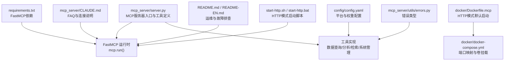
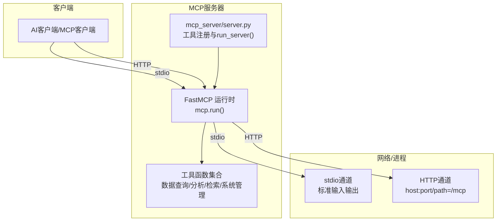
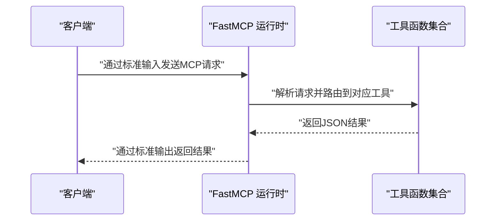
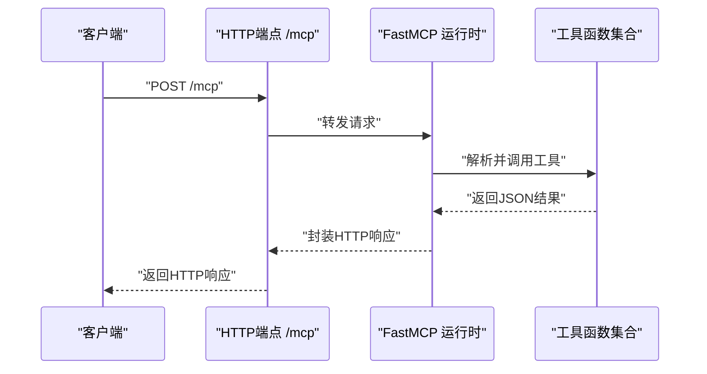
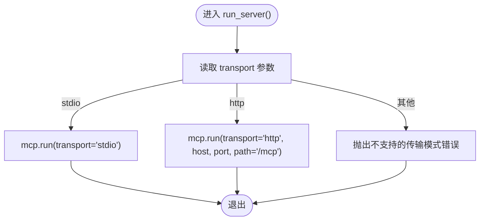
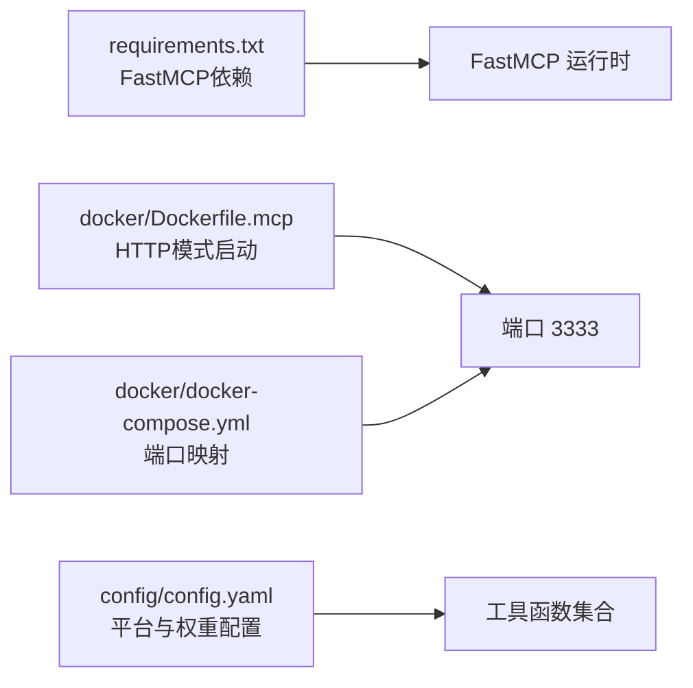

# MCP服务器传输模式

<cite>
**本文引用的文件**
- [mcp_server/server.py](file://mcp_server/server.py)
- [requirements.txt](file://requirements.txt)
- [docker/Dockerfile.mcp](file://docker/Dockerfile.mcp)
- [docker/docker-compose.yml](file://docker/docker-compose.yml)
- [config/config.yaml](file://config/config.yaml)
- [mcp_server/utils/errors.py](file://mcp_server/utils/errors.py)
- [mcp_server/CLAUDE.md](file://mcp_server/CLAUDE.md)
- [README.md](file://README.md)
- [README-EN.md](file://README-EN.md)
- [start-http.sh](file://start-http.sh)
- [start-http.bat](file://start-http.bat)
</cite>

## 目录
1. [简介](#简介)
2. [项目结构](#项目结构)
3. [核心组件](#核心组件)
4. [架构总览](#架构总览)
5. [详细组件分析](#详细组件分析)
6. [依赖关系分析](#依赖关系分析)
7. [性能考量](#性能考量)
8. [故障排查指南](#故障排查指南)
9. [结论](#结论)
10. [附录](#附录)

## 简介
本文件聚焦于MCP服务器的两种传输模式：stdio与HTTP。目标是帮助读者理解这两种模式的技术实现、使用场景、配置要点与安全注意事项，并结合代码说明mcp.run()函数如何依据transport参数选择运行模式，以及HTTP端点的请求处理机制。同时给出性能对比与最佳实践建议，便于在本地开发调试与生产部署之间做出合理选择。

## 项目结构
围绕MCP服务器传输模式的关键文件与职责如下：
- mcp_server/server.py：MCP服务器主入口，定义工具函数与run_server()，负责根据transport参数选择stdio或HTTP模式，并调用FastMCP运行。
- requirements.txt：声明FastMCP依赖，确保运行时具备相应协议栈。
- docker/Dockerfile.mcp：容器镜像构建脚本，内置HTTP模式启动命令，暴露3333端口。
- docker/docker-compose.yml：编排MCP服务容器，映射本地端口至容器3333，便于本地联调与生产部署。
- config/config.yaml：系统配置文件，提供平台列表、权重、通知等配置，间接影响工具行为。
- mcp_server/utils/errors.py：自定义错误类型，统一工具层错误返回格式。
- mcp_server/CLAUDE.md：包含FAQ与常见问题，其中明确说明HTTP模式连接地址与客户端支持情况。
- README.md / README-EN.md：提供端口占用检查、连接失败排查等运维指导。
- start-http.sh / start-http.bat：便捷启动脚本，演示HTTP模式启动方式。

图表来源
- [mcp_server/server.py](file://mcp_server/server.py#L660-L781)
- [requirements.txt](file://requirements.txt#L1-L6)
- [docker/Dockerfile.mcp](file://docker/Dockerfile.mcp#L1-L24)
- [docker/docker-compose.yml](file://docker/docker-compose.yml#L60-L74)
- [config/config.yaml](file://config/config.yaml#L116-L140)
- [mcp_server/utils/errors.py](file://mcp_server/utils/errors.py#L1-L94)
- [mcp_server/CLAUDE.md](file://mcp_server/CLAUDE.md#L313-L327)
- [README.md](file://README.md#L3175-L3224)
- [README-EN.md](file://README-EN.md#L3251-L3305)
- [start-http.sh](file://start-http.sh#L1-L21)
- [start-http.bat](file://start-http.bat#L1-L25)

章节来源
- [mcp_server/server.py](file://mcp_server/server.py#L660-L781)
- [requirements.txt](file://requirements.txt#L1-L6)
- [docker/Dockerfile.mcp](file://docker/Dockerfile.mcp#L1-L24)
- [docker/docker-compose.yml](file://docker/docker-compose.yml#L60-L74)
- [config/config.yaml](file://config/config.yaml#L116-L140)
- [mcp_server/utils/errors.py](file://mcp_server/utils/errors.py#L1-L94)
- [mcp_server/CLAUDE.md](file://mcp_server/CLAUDE.md#L313-L327)
- [README.md](file://README.md#L3175-L3224)
- [README-EN.md](file://README-EN.md#L3251-L3305)
- [start-http.sh](file://start-http.sh#L1-L21)
- [start-http.bat](file://start-http.bat#L1-L25)

## 核心组件
- FastMCP应用与工具注册：在mcp_server/server.py中创建FastMCP应用实例，并通过装饰器注册各类工具函数（日期解析、基础数据查询、高级分析、智能检索、配置与系统管理等）。这些工具在两种传输模式下均可用。
- 运行入口与参数解析：run_server()根据transport参数选择stdio或http模式；当transport=http时，mcp.run()接收host、port与path参数，其中path固定为"/mcp"。
- 依赖与容器化：requirements.txt声明FastMCP依赖；Dockerfile.mcp默认以HTTP模式启动，暴露3333端口；docker-compose.yml将宿主机端口映射到容器3333，便于本地与生产部署。

章节来源
- [mcp_server/server.py](file://mcp_server/server.py#L22-L40)
- [mcp_server/server.py](file://mcp_server/server.py#L660-L781)
- [requirements.txt](file://requirements.txt#L1-L6)
- [docker/Dockerfile.mcp](file://docker/Dockerfile.mcp#L1-L24)
- [docker/docker-compose.yml](file://docker/docker-compose.yml#L60-L74)

## 架构总览
下图展示了两种传输模式的总体交互：客户端通过stdio或HTTP与FastMCP运行时通信，FastMCP再调度已注册的工具函数执行业务逻辑。

图表来源
- [mcp_server/server.py](file://mcp_server/server.py#L660-L781)
- [requirements.txt](file://requirements.txt#L1-L6)
- [docker/Dockerfile.mcp](file://docker/Dockerfile.mcp#L1-L24)

## 详细组件分析

### stdio传输模式
- 技术实现
  - 通过mcp.run(transport='stdio')启动，客户端通过标准输入输出与服务器交互。
  - 适合本地开发与调试，便于在终端或IDE中直接观察工具调用与返回。
- 使用场景
  - 本地快速验证工具可用性与返回格式。
  - 与桌面端MCP客户端（如Cherry Studio、Claude Desktop等）配合使用。
- 启动方式
  - 命令行参数：--transport stdio（默认）。
  - 也可通过直接调用mcp.run('stdio')实现。

图表来源
- [mcp_server/server.py](file://mcp_server/server.py#L727-L730)

章节来源
- [mcp_server/server.py](file://mcp_server/server.py#L727-L730)
- [mcp_server/CLAUDE.md](file://mcp_server/CLAUDE.md#L313-L327)

### HTTP传输模式
- 技术实现
  - 通过mcp.run(transport='http', host, port, path='/mcp')启动，FastMCP在指定host:port上提供HTTP端点。
  - path固定为"/mcp"，客户端通过HTTP访问该端点进行工具调用。
- 配置方式
  - 命令行参数：--transport http、--host、--port。
  - Docker镜像默认以HTTP模式启动，暴露3333端口；docker-compose.yml将宿主机端口映射到容器3333。
- 使用场景
  - 生产环境部署，便于跨网络访问与反向代理接入。
  - 与支持HTTP MCP的客户端或网关集成。

图表来源
- [mcp_server/server.py](file://mcp_server/server.py#L731-L737)
- [docker/Dockerfile.mcp](file://docker/Dockerfile.mcp#L19-L24)
- [docker/docker-compose.yml](file://docker/docker-compose.yml#L60-L74)

章节来源
- [mcp_server/server.py](file://mcp_server/server.py#L731-L737)
- [docker/Dockerfile.mcp](file://docker/Dockerfile.mcp#L19-L24)
- [docker/docker-compose.yml](file://docker/docker-compose.yml#L60-L74)
- [start-http.sh](file://start-http.sh#L1-L21)
- [start-http.bat](file://start-http.bat#L1-L25)

### mcp.run()函数与传输模式选择
- 参数与行为
  - transport='stdio'：启动stdio模式，客户端通过标准输入输出通信。
  - transport='http'：启动HTTP模式，接收host、port与path参数，path固定为'/mcp'。
- 错误处理
  - 不支持的transport参数会抛出异常，提示错误信息。

图表来源
- [mcp_server/server.py](file://mcp_server/server.py#L727-L739)

章节来源
- [mcp_server/server.py](file://mcp_server/server.py#L727-L739)

### HTTP端点请求处理机制
- 端点路径
  - path固定为"/mcp"，客户端通过该路径提交请求。
- 客户端连接
  - FAQ中明确说明HTTP模式连接地址为http://localhost:3333/mcp。
- 运维与故障排查
  - README与README-EN提供了端口占用检查、依赖安装确认、查看日志与尝试自定义端口等步骤，有助于定位连接失败问题。

章节来源
- [mcp_server/server.py](file://mcp_server/server.py#L731-L737)
- [mcp_server/CLAUDE.md](file://mcp_server/CLAUDE.md#L313-L327)
- [README.md](file://README.md#L3175-L3224)
- [README-EN.md](file://README-EN.md#L3251-L3305)

### 错误处理与工具返回
- 工具层错误类型
  - MCPError及其子类（如DataNotFoundError、InvalidParameterError、PlatformNotSupportedError、CrawlTaskError、FileParseError）统一错误格式，便于客户端识别与处理。
- 工具函数返回
  - 工具函数内部捕获异常并以JSON格式返回，包含success字段与错误信息，确保客户端可稳定解析。

章节来源
- [mcp_server/utils/errors.py](file://mcp_server/utils/errors.py#L1-L94)
- [mcp_server/server.py](file://mcp_server/server.py#L93-L109)
- [mcp_server/server.py](file://mcp_server/server.py#L146-L149)

## 依赖关系分析
- 外部依赖
  - FastMCP：提供MCP协议运行时能力，支持stdio与HTTP两种传输模式。
- 容器化与部署
  - Dockerfile.mcp默认以HTTP模式启动，暴露3333端口；docker-compose.yml将宿主机端口映射到容器3333，便于本地联调与生产部署。
- 配置文件
  - config/config.yaml提供平台列表与权重等配置，工具函数在执行时会读取这些配置，影响数据查询与分析结果。

图表来源
- [requirements.txt](file://requirements.txt#L1-L6)
- [docker/Dockerfile.mcp](file://docker/Dockerfile.mcp#L1-L24)
- [docker/docker-compose.yml](file://docker/docker-compose.yml#L60-L74)
- [config/config.yaml](file://config/config.yaml#L116-L140)

章节来源
- [requirements.txt](file://requirements.txt#L1-L6)
- [docker/Dockerfile.mcp](file://docker/Dockerfile.mcp#L1-L24)
- [docker/docker-compose.yml](file://docker/docker-compose.yml#L60-L74)
- [config/config.yaml](file://config/config.yaml#L116-L140)

## 性能考量
- stdio模式
  - 优点：启动简单、无需网络栈开销，适合本地开发与快速验证。
  - 缺点：不适合远程访问与大规模并发，扩展性有限。
- HTTP模式
  - 优点：可部署在生产环境，便于反向代理、负载均衡与远程访问。
  - 缺点：引入网络I/O与HTTP协议开销，需关注连接数、超时与重试策略。
- 最佳实践
  - 开发阶段优先使用stdio模式，快速迭代与调试。
  - 生产部署建议使用HTTP模式，并结合反向代理与容器编排（如docker-compose）。
  - 合理设置端口与路径，遵循最小暴露原则，避免不必要的端口开放。

[本节为通用性能讨论，不直接分析具体文件]

## 故障排查指南
- 端口占用
  - 检查3333端口是否被占用，必要时更换端口或释放占用进程。
- 依赖安装
  - 确认FastMCP等依赖已正确安装。
- 连接失败
  - 确认服务已启动并可通过http://localhost:3333/mcp访问。
  - 检查防火墙与网络策略，尝试使用127.0.0.1替代localhost。
- 日志与诊断
  - 查看服务日志，使用MCP Inspector等官方工具进行连接测试。

章节来源
- [README.md](file://README.md#L3175-L3224)
- [README-EN.md](file://README-EN.md#L3251-L3305)
- [mcp_server/CLAUDE.md](file://mcp_server/CLAUDE.md#L313-L327)

## 结论
- stdio与HTTP两种传输模式分别适用于本地开发调试与生产部署。
- mcp.run()依据transport参数选择运行模式，HTTP模式下host、port与path（固定为"/mcp"）共同决定服务暴露方式。
- 生产部署建议采用HTTP模式并结合容器化与反向代理，同时做好端口与网络安全配置。
- 工具层通过统一的错误类型与JSON返回格式，提升客户端兼容性与稳定性。

[本节为总结性内容，不直接分析具体文件]

## 附录
- 启动脚本
  - start-http.sh / start-http.bat演示了HTTP模式的启动方式，便于本地快速启动服务。
- FAQ与客户端支持
  - mcp_server/CLAUDE.md明确说明HTTP模式连接地址与支持的客户端类型，便于快速接入。

章节来源
- [start-http.sh](file://start-http.sh#L1-L21)
- [start-http.bat](file://start-http.bat#L1-L25)
- [mcp_server/CLAUDE.md](file://mcp_server/CLAUDE.md#L313-L327)