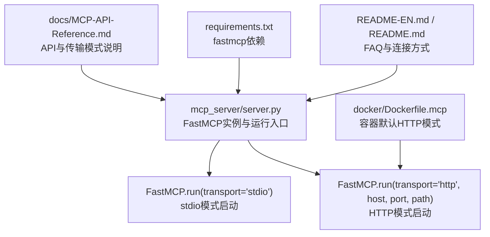
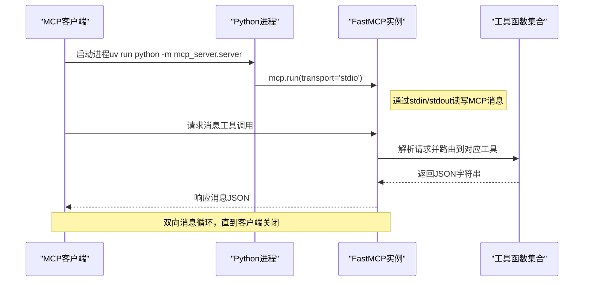
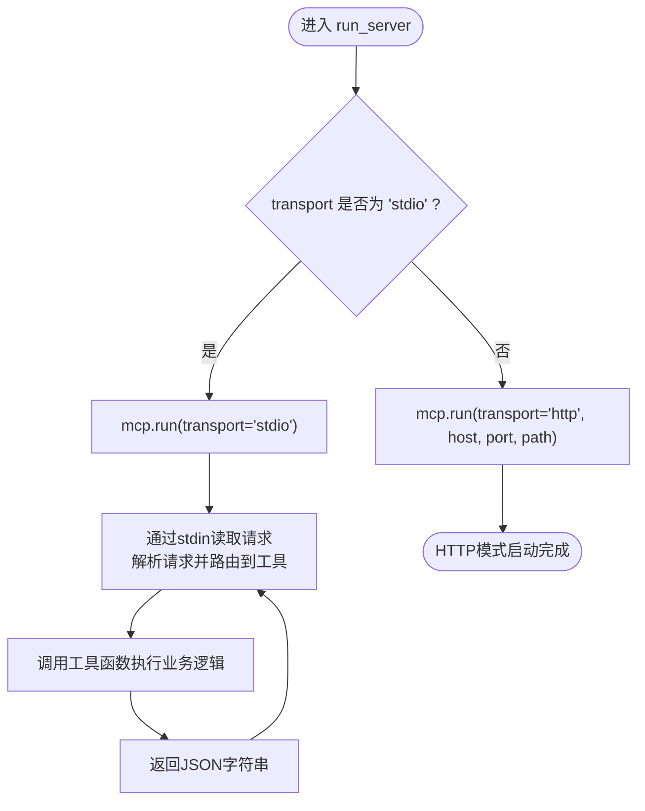
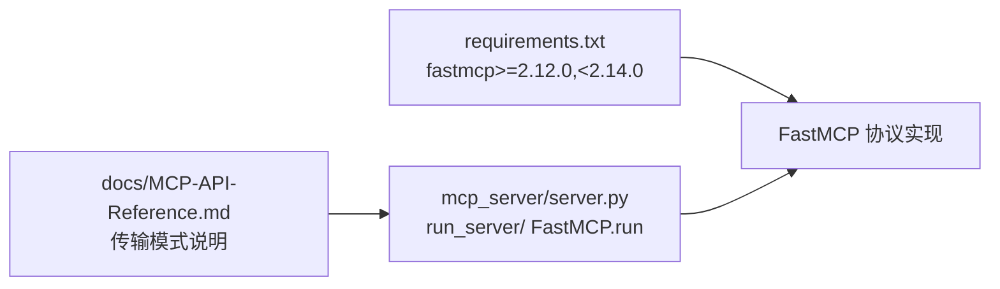

# stdio传输模式

<cite>
**本文引用的文件**
- [mcp_server/server.py](file://mcp_server/server.py)
- [requirements.txt](file://requirements.txt)
- [docs/MCP-API-Reference.md](file://docs/MCP-API-Reference.md)
- [README-MCP-FAQ.md](file://README-MCP-FAQ.md)
- [README.md](file://README.md)
- [README-EN.md](file://README-EN.md)
- [docker/Dockerfile.mcp](file://docker/Dockerfile.mcp)
</cite>

## 目录
1. [简介](#简介)
2. [项目结构](#项目结构)
3. [核心组件](#核心组件)
4. [架构总览](#架构总览)
5. [详细组件分析](#详细组件分析)
6. [依赖关系分析](#依赖关系分析)
7. [性能考量](#性能考量)
8. [故障排查指南](#故障排查指南)
9. [结论](#结论)
10. [附录](#附录)

## 简介
本篇文档聚焦于MCP服务器的stdio传输模式，系统性阐述其技术实现、使用场景、消息生命周期与调试要点，并结合仓库现有代码说明为何stdio模式适合本地开发与CLI集成，以及它在安全与生产适配方面的权衡。文中所有技术细节均以仓库源码为依据，避免臆测。

## 项目结构
- 服务器入口与运行逻辑集中在 mcp_server/server.py，其中提供 run_server 函数与 FastMCP 实例，支持通过 transport 参数切换到 stdio 或 http。
- 文档 docs/MCP-API-Reference.md 明确了服务器名称、协议版本、传输模式与HTTP端点，同时给出API参考与示例。
- README系列文档包含FAQ与故障排查，其中多次提及STDIO模式与HTTP模式的差异及连接方式。
- requirements.txt 指明依赖 fastmcp，为stdio模式提供协议栈支撑。
- docker/Dockerfile.mcp 展示了容器内HTTP模式的默认启动方式，侧面说明stdio模式更适合本地开发而非容器生产。

图示来源
- [mcp_server/server.py](file://mcp_server/server.py#L662-L781)
- [docs/MCP-API-Reference.md](file://docs/MCP-API-Reference.md#L1-L20)
- [requirements.txt](file://requirements.txt#L1-L6)
- [docker/Dockerfile.mcp](file://docker/Dockerfile.mcp#L1-L23)

章节来源
- [mcp_server/server.py](file://mcp_server/server.py#L662-L781)
- [docs/MCP-API-Reference.md](file://docs/MCP-API-Reference.md#L1-L20)
- [requirements.txt](file://requirements.txt#L1-L6)
- [docker/Dockerfile.mcp](file://docker/Dockerfile.mcp#L1-L23)

## 核心组件
- FastMCP实例与工具注册：mcp_server/server.py 中创建 FastMCP 应用实例，并注册各类工具函数，这些工具最终由 FastMCP 协议承载。
- 运行入口 run_server：负责解析参数、打印启动信息、根据 transport 选择 stdio 或 http 模式并调用 FastMCP.run。
- 依赖 fastmcp：通过 requirements.txt 可知，stdio模式由 fastmcp 提供协议实现。

章节来源
- [mcp_server/server.py](file://mcp_server/server.py#L22-L40)
- [mcp_server/server.py](file://mcp_server/server.py#L662-L740)
- [requirements.txt](file://requirements.txt#L1-L6)

## 架构总览
下图展示stdio模式下的典型交互：客户端通过进程启动服务器，双方通过标准输入输出进行MCP协议消息交换；服务器内部将请求路由到对应工具函数，工具函数返回JSON字符串，客户端再解析为结构化结果。

图示来源
- [mcp_server/server.py](file://mcp_server/server.py#L662-L740)
- [docs/MCP-API-Reference.md](file://docs/MCP-API-Reference.md#L409-L437)

## 详细组件分析

### stdio模式的执行机制与生命周期
- 启动入口：run_server 根据 transport 参数决定调用 FastMCP.run('stdio') 或 FastMCP.run('http', ...)。
- 消息循环：stdio模式下，FastMCP通过标准输入输出与客户端进行消息读写，形成请求-解析-响应的完整生命周期。
- 工具调用：客户端发起工具调用后，FastMCP内部解析请求，定位到对应工具函数，工具函数执行业务逻辑并返回JSON字符串。
- 错误处理：工具函数内部对异常进行捕获并以统一的JSON错误格式返回，便于客户端识别与展示。

图示来源
- [mcp_server/server.py](file://mcp_server/server.py#L662-L740)

章节来源
- [mcp_server/server.py](file://mcp_server/server.py#L662-L740)

### 工具函数与消息返回
- 工具函数统一返回JSON字符串，便于FastMCP在stdio模式下直接写入stdout。
- 工具函数内部对异常进行捕获，返回统一的错误结构，确保客户端可感知错误并进行相应处理。

章节来源
- [mcp_server/server.py](file://mcp_server/server.py#L93-L109)
- [mcp_server/server.py](file://mcp_server/server.py#L146-L149)
- [mcp_server/server.py](file://mcp_server/server.py#L171-L173)

### 客户端连接与使用
- 文档明确指出：STDIO模式下，客户端通过进程方式连接，例如使用 uv 命令启动服务器并建立stdio通道。
- FAQ与README文档多次强调STDIO模式适合本地开发与CLI集成，HTTP模式适合生产部署。

章节来源
- [docs/MCP-API-Reference.md](file://docs/MCP-API-Reference.md#L409-L437)
- [README-MCP-FAQ.md](file://README-MCP-FAQ.md#L313-L327)
- [README.md](file://README.md#L3204-L3223)
- [README-EN.md](file://README-EN.md#L3280-L3300)

### 安全优势与生产适配
- 无网络配置：stdio模式无需监听端口、无需防火墙放行，天然隔离于外部网络，降低暴露面。
- 生产不推荐：HTTP模式具备更好的可观测性、可扩展性与跨网络通信能力，适合生产环境部署。

章节来源
- [docs/MCP-API-Reference.md](file://docs/MCP-API-Reference.md#L1-L14)
- [docker/Dockerfile.mcp](file://docker/Dockerfile.mcp#L1-L23)

## 依赖关系分析
- FastMCP依赖：stdio模式由 fastmcp 提供协议实现，因此需要在环境中安装该依赖。
- 传输模式耦合：run_server 将 transport 与 FastMCP.run 的调用绑定，stdio与http分支清晰分离。

图示来源
- [requirements.txt](file://requirements.txt#L1-L6)
- [mcp_server/server.py](file://mcp_server/server.py#L662-L740)
- [docs/MCP-API-Reference.md](file://docs/MCP-API-Reference.md#L1-L20)

章节来源
- [requirements.txt](file://requirements.txt#L1-L6)
- [mcp_server/server.py](file://mcp_server/server.py#L662-L740)
- [docs/MCP-API-Reference.md](file://docs/MCP-API-Reference.md#L1-L20)

## 性能考量
- IO特性：stdio模式完全依赖标准输入输出，吞吐受限于进程间IO与终端缓冲区，适合轻量交互与本地开发。
- JSON序列化：工具函数统一返回JSON字符串，避免额外编解码开销；但需确保字符串编码正确，避免客户端解析失败。
- 缓存与重试：仓库中存在缓存与重试机制（用于爬取流程），但stdio模式下的工具调用本身由FastMCP驱动，性能瓶颈主要在IO与工具执行时间。

章节来源
- [mcp_server/server.py](file://mcp_server/server.py#L93-L109)
- [mcp_server/server.py](file://mcp_server/server.py#L146-L149)
- [mcp_server/server.py](file://mcp_server/server.py#L171-L173)

## 故障排查指南

### 常见问题与定位
- 客户端无法连接到MCP服务（STDIO模式）：
  - 确认 uv 路径正确（which uv 或 where uv）。
  - 确认项目路径正确且无中文字符。
  - 查看客户端错误日志，确认stdio通道是否成功建立。
- HTTP模式连接问题：
  - 确认服务已启动（访问 http://localhost:3333/mcp）。
  - 检查防火墙设置，尝试使用 127.0.0.1 替代 localhost。
- 工具调用失败或返回错误：
  - 查看服务端日志，确认工具函数是否抛出异常。
  - 检查客户端是否正确传递参数与JSON格式。

章节来源
- [README.md](file://README.md#L3175-L3229)
- [README-EN.md](file://README-EN.md#L3251-L3305)
- [README-MCP-FAQ.md](file://README-MCP-FAQ.md#L313-L327)

### 输入输出流阻塞与JSON格式错误
- 阻塞排查：
  - 确认客户端与服务器之间的stdio通道未被阻塞（例如终端缓冲区满）。
  - 在容器或CI环境中，建议使用非缓冲输出（如PYTHONUNBUFFERED=1）。
- JSON格式错误：
  - 工具函数内部对异常进行捕获并返回统一错误结构，客户端应据此进行容错处理。
  - 确保工具返回的JSON字符串编码正确，避免客户端解析失败。

章节来源
- [mcp_server/server.py](file://mcp_server/server.py#L93-L109)
- [docker/Dockerfile.mcp](file://docker/Dockerfile.mcp#L1-L23)

## 结论
- stdio传输模式通过标准输入输出与MCP客户端进行双向通信，适合本地开发、调试与CLI工具集成。
- 其核心执行链路为：run_server -> FastMCP.run('stdio') -> 请求解析 -> 工具调用 -> JSON响应 -> 客户端解析。
- 安全方面，stdio模式无需网络配置，天然隔离；但在生产环境中，HTTP模式具备更好的可观测性与扩展性，更适合部署。

## 附录

### 使用示例与最佳实践
- 使用uv启动服务器并通过stdio连接客户端，适合本地联调与自动化脚本。
- 若需在容器或远程环境部署，建议使用HTTP模式并配置合适的host/port/path。

章节来源
- [docs/MCP-API-Reference.md](file://docs/MCP-API-Reference.md#L409-L437)
- [docker/Dockerfile.mcp](file://docker/Dockerfile.mcp#L1-L23)