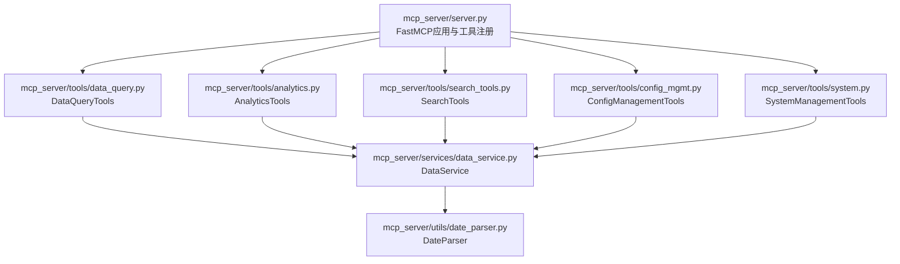
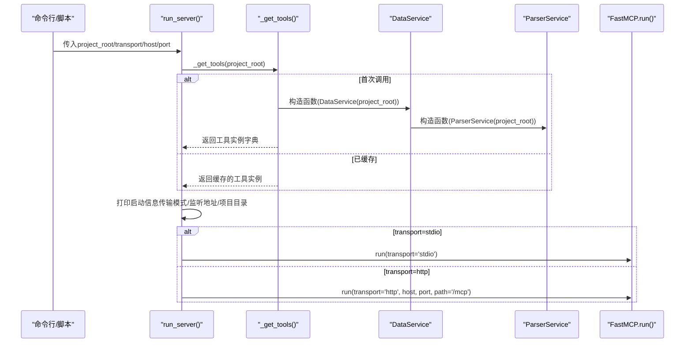
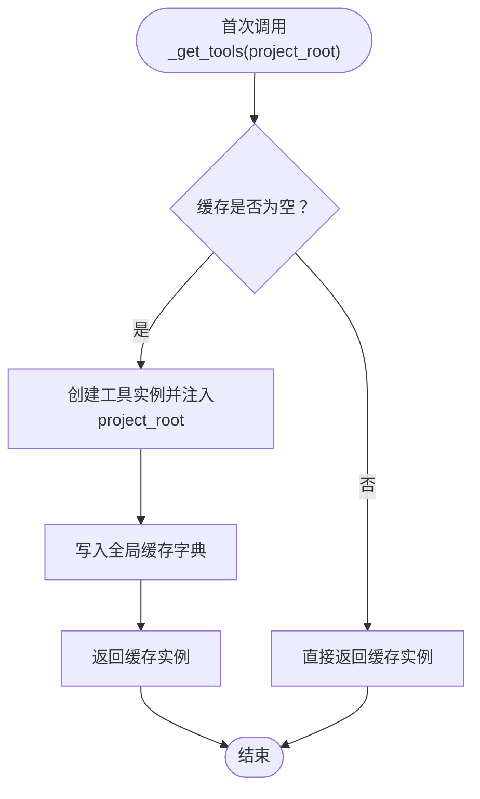
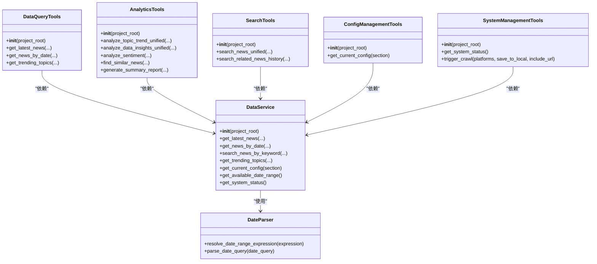

# MCP服务器初始化流程

<cite>
**本文引用的文件**
- [mcp_server/server.py](file://mcp_server/server.py)
- [mcp_server/tools/data_query.py](file://mcp_server/tools/data_query.py)
- [mcp_server/tools/analytics.py](file://mcp_server/tools/analytics.py)
- [mcp_server/tools/search_tools.py](file://mcp_server/tools/search_tools.py)
- [mcp_server/tools/config_mgmt.py](file://mcp_server/tools/config_mgmt.py)
- [mcp_server/tools/system.py](file://mcp_server/tools/system.py)
- [mcp_server/services/data_service.py](file://mcp_server/services/data_service.py)
- [mcp_server/utils/date_parser.py](file://mcp_server/utils/date_parser.py)
- [start-http.sh](file://start-http.sh)
- [start-http.bat](file://start-http.bat)
- [README.md](file://README.md)
- [README-EN.md](file://README-EN.md)
</cite>

## 目录
1. [简介](#简介)
2. [项目结构](#项目结构)
3. [核心组件](#核心组件)
4. [架构总览](#架构总览)
5. [详细组件分析](#详细组件分析)
6. [依赖关系分析](#依赖关系分析)
7. [性能考量](#性能考量)
8. [故障排查指南](#故障排查指南)
9. [结论](#结论)
10. [附录](#附录)

## 简介
本文件聚焦于MCP服务器的初始化流程，围绕run_server函数在启动时如何完成系统初始化展开，重点解释以下要点：
- project_root参数如何影响工具实例的初始化路径（通过工具类构造函数注入，最终传递至数据服务层，用于定位配置与数据目录）。
- transport参数如何决定通信模式（stdio/HTTP），以及host和port在HTTP模式下的作用。
- 启动过程中打印的服务器信息（传输模式、监听地址、项目目录）的生成逻辑。
- _mget_tools函数（即_get_tools）如何在首次调用时创建并缓存工具实例，确保单例模式的正确实现。
- 提供实际启动日志示例及其含义解读。

## 项目结构
MCP服务器位于mcp_server目录，采用“工具层-服务层-工具类”的分层设计：
- 工具层：mcp_server/server.py中定义FastMCP应用与工具注册；各工具类位于mcp_server/tools/下。
- 服务层：mcp_server/services/data_service.py封装数据访问与缓存。
- 工具类：DataQueryTools、AnalyticsTools、SearchTools、ConfigManagementTools、SystemManagementTools分别实现具体业务能力。
- 工具类均接收project_root参数，用于定位配置与数据目录。

图表来源
- [mcp_server/server.py](file://mcp_server/server.py#L1-L120)
- [mcp_server/tools/data_query.py](file://mcp_server/tools/data_query.py#L1-L40)
- [mcp_server/tools/analytics.py](file://mcp_server/tools/analytics.py#L1-L40)
- [mcp_server/tools/search_tools.py](file://mcp_server/tools/search_tools.py#L1-L40)
- [mcp_server/tools/config_mgmt.py](file://mcp_server/tools/config_mgmt.py#L1-L30)
- [mcp_server/tools/system.py](file://mcp_server/tools/system.py#L1-L40)
- [mcp_server/services/data_service.py](file://mcp_server/services/data_service.py#L1-L40)
- [mcp_server/utils/date_parser.py](file://mcp_server/utils/date_parser.py#L1-L40)

章节来源
- [mcp_server/server.py](file://mcp_server/server.py#L1-L120)

## 核心组件
- run_server函数：负责初始化工具实例、打印启动信息、根据transport参数选择运行模式（stdio或http），并在HTTP模式下设置host、port与端点路径。
- _get_tools函数：首次调用时创建工具实例并缓存，后续调用直接返回缓存实例，实现单例模式。
- 工具类（DataQueryTools、AnalyticsTools、SearchTools、ConfigManagementTools、SystemManagementTools）：均在构造函数中接收project_root，用于定位配置与数据目录。
- DataService：封装数据访问与缓存，内部持有ParserService，解析配置与频率词等。
- DateParser：提供日期解析与日期范围计算能力，供工具层调用。

章节来源
- [mcp_server/server.py](file://mcp_server/server.py#L660-L781)
- [mcp_server/tools/data_query.py](file://mcp_server/tools/data_query.py#L1-L40)
- [mcp_server/tools/analytics.py](file://mcp_server/tools/analytics.py#L1-L40)
- [mcp_server/tools/search_tools.py](file://mcp_server/tools/search_tools.py#L1-L40)
- [mcp_server/tools/config_mgmt.py](file://mcp_server/tools/config_mgmt.py#L1-L30)
- [mcp_server/tools/system.py](file://mcp_server/tools/system.py#L1-L40)
- [mcp_server/services/data_service.py](file://mcp_server/services/data_service.py#L1-L40)
- [mcp_server/utils/date_parser.py](file://mcp_server/utils/date_parser.py#L1-L40)

## 架构总览
下面的序列图展示了run_server启动时的关键调用链路，以及工具实例的创建与缓存过程。

图表来源
- [mcp_server/server.py](file://mcp_server/server.py#L660-L781)
- [mcp_server/services/data_service.py](file://mcp_server/services/data_service.py#L1-L40)

## 详细组件分析

### run_server函数初始化流程
- 初始化阶段
  - 调用_get_tools(project_root)：首次调用时创建工具实例并缓存；后续调用直接返回缓存实例。
  - 打印启动信息：根据transport打印协议说明；HTTP模式下打印host与port；若提供project_root则打印项目目录，否则打印“当前目录”。
- 运行阶段
  - 若transport为'stdio'，调用mcp.run(transport='stdio')。
  - 若transport为'http'，调用mcp.run(transport='http', host, port, path='/mcp')。
- 命令行参数
  - 支持--transport、--host、--port、--project-root参数，便于外部脚本或容器启动。

章节来源
- [mcp_server/server.py](file://mcp_server/server.py#L660-L781)
- [start-http.sh](file://start-http.sh#L1-L21)
- [start-http.bat](file://start-http.bat#L1-L25)

### _get_tools函数与单例模式
- 设计要点
  - 使用全局字典缓存工具实例，键为工具类别（如'data'、'analytics'、'search'、'config'、'system'），值为对应工具类实例。
  - 首次调用时，将project_root传入各工具类构造函数，从而确保工具类内部的数据服务层能够正确解析配置与数据目录。
  - 后续调用直接返回缓存实例，保证单例语义。
- 影响范围
  - 所有工具函数在首次使用时都会通过_get_tools获取工具实例，因此project_root参数在首次调用时生效。

图表来源
- [mcp_server/server.py](file://mcp_server/server.py#L29-L38)

章节来源
- [mcp_server/server.py](file://mcp_server/server.py#L29-L38)

### project_root参数的作用与传播路径
- 传入位置
  - run_server接收project_root参数。
- 传播路径
  - run_server调用_get_tools(project_root)。
  - _get_tools在首次创建工具实例时，将project_root传入各工具类构造函数。
  - 工具类构造函数将project_root传入DataService。
  - DataService构造函数将project_root传入ParserService。
  - ParserService据此定位配置文件与数据目录（例如读取config/config.yaml、扫描output目录等）。
- 影响范围
  - 配置解析：读取config/config.yaml与config/frequency_words.txt。
  - 数据目录：扫描output目录下的日期子目录，构建可用日期范围。
  - 系统状态：记录project_root与版本信息。

章节来源
- [mcp_server/server.py](file://mcp_server/server.py#L660-L781)
- [mcp_server/tools/data_query.py](file://mcp_server/tools/data_query.py#L1-L40)
- [mcp_server/tools/analytics.py](file://mcp_server/tools/analytics.py#L1-L40)
- [mcp_server/tools/search_tools.py](file://mcp_server/tools/search_tools.py#L1-L40)
- [mcp_server/tools/config_mgmt.py](file://mcp_server/tools/config_mgmt.py#L1-L30)
- [mcp_server/tools/system.py](file://mcp_server/tools/system.py#L1-L40)
- [mcp_server/services/data_service.py](file://mcp_server/services/data_service.py#L1-L40)

### transport参数与HTTP模式的host/port
- transport参数
  - 'stdio'：通过标准输入输出与客户端通信，适合开发调试与本地集成。
  - 'http'：通过HTTP协议提供服务，适合远程访问与容器部署。
- HTTP模式参数
  - host：监听地址，默认'0.0.0.0'，允许外部访问。
  - port：监听端口，默认3333。
  - path：HTTP端点路径固定为'/mcp'。
- 客户端配置
  - README中提供了Cursor与VSCode（Cline/Continue）的HTTP模式配置示例，指向http://localhost:3333/mcp。

章节来源
- [mcp_server/server.py](file://mcp_server/server.py#L727-L740)
- [README.md](file://README.md#L2923-L2957)
- [README-EN.md](file://README-EN.md#L2910-L2965)

### 启动日志打印逻辑
- 打印内容
  - 传输模式：'STDIO'或'HTTP'。
  - 协议说明：stdio模式说明通过标准输入输出通信；http模式说明生产环境使用。
  - 监听地址：HTTP模式下打印host与port。
  - 项目目录：打印project_root或“当前目录”。
  - 已注册工具清单：按类别列出工具名称与简要说明。
- 生成逻辑
  - run_server在初始化完成后，按条件分支打印相应信息，最后进入运行阶段。

章节来源
- [mcp_server/server.py](file://mcp_server/server.py#L680-L726)

### 实际启动日志示例与含义
- 示例1：HTTP模式（容器/远程）
  - 日志片段
    - “传输模式: HTTP”
    - “协议: MCP over HTTP (生产环境)”
    - “服务器监听: 0.0.0.0:3333”
    - “项目目录: /app”
  - 含义
    - 服务器以HTTP模式运行，监听0.0.0.0:3333，项目根目录为/app。
- 示例2：HTTP模式（本地）
  - 日志片段
    - “传输模式: HTTP”
    - “协议: MCP over HTTP (生产环境)”
    - “服务器监听: 0.0.0.0:3333”
    - “项目目录: 当前目录”
  - 含义
    - 服务器以HTTP模式运行，监听0.0.0.0:3333，项目根目录为当前工作目录。
- 示例3：STDIO模式（本地调试）
  - 日志片段
    - “传输模式: STDIO”
    - “协议: MCP over stdio (标准输入输出)”
    - “说明: 通过标准输入输出与 MCP 客户端通信”
    - “项目目录: 当前目录”
  - 含义
    - 服务器以STDIO模式运行，通过标准输入输出与客户端通信，项目根目录为当前工作目录。

章节来源
- [mcp_server/server.py](file://mcp_server/server.py#L680-L726)
- [start-http.sh](file://start-http.sh#L1-L21)
- [start-http.bat](file://start-http.bat#L1-L25)

## 依赖关系分析
- 工具类与服务层
  - 所有工具类均依赖DataService，后者依赖ParserService与缓存服务。
- 工具类与配置/数据目录
  - project_root贯穿工具类构造函数→DataService→ParserService，用于定位配置文件与数据目录。
- 工具类与日期解析
  - resolve_date_range工具依赖DateParser进行日期范围解析，确保AI侧日期计算的一致性。

图表来源
- [mcp_server/tools/data_query.py](file://mcp_server/tools/data_query.py#L1-L40)
- [mcp_server/tools/analytics.py](file://mcp_server/tools/analytics.py#L1-L40)
- [mcp_server/tools/search_tools.py](file://mcp_server/tools/search_tools.py#L1-L40)
- [mcp_server/tools/config_mgmt.py](file://mcp_server/tools/config_mgmt.py#L1-L30)
- [mcp_server/tools/system.py](file://mcp_server/tools/system.py#L1-L40)
- [mcp_server/services/data_service.py](file://mcp_server/services/data_service.py#L1-L40)
- [mcp_server/utils/date_parser.py](file://mcp_server/utils/date_parser.py#L1-L40)

## 性能考量
- 单例模式与缓存
  - _get_tools使用全局字典缓存工具实例，避免重复创建，降低初始化开销。
  - DataService内部使用缓存服务对热门查询（如最新新闻、趋势话题、配置）进行缓存，减少磁盘I/O与解析成本。
- I/O与网络
  - SystemManagementTools.trigger_crawl涉及网络请求与文件写入，建议合理设置请求间隔与重试策略，避免频繁I/O与网络抖动。
- 日志与可观测性
  - 启动日志包含传输模式、监听地址与项目目录，有助于快速定位部署问题。

[本节为通用指导，不直接分析具体文件]

## 故障排查指南
- 无法连接HTTP服务
  - 确认端口未被占用，检查防火墙设置，尝试使用127.0.0.1替代localhost。
  - 参考README中的排查步骤与示例命令。
- STDIO模式无法通信
  - 确认客户端已正确配置命令行参数，指向正确的项目路径与Python解释器。
- 工具调用报错
  - 检查配置文件是否存在与格式正确（config/config.yaml）。
  - 检查output目录是否存在且包含有效数据，以便工具类读取。
- 爬取失败
  - 检查网络连通性与目标API状态，确认请求头与超时设置合理。

章节来源
- [README-EN.md](file://README-EN.md#L3251-L3301)

## 结论
- run_server通过_get_tools实现了工具实例的首次创建与缓存，确保单例模式与高效初始化。
- project_root贯穿工具层→服务层→解析层，决定了配置与数据目录的定位，影响工具的可用性与数据准确性。
- transport参数控制通信模式，HTTP模式下host与port决定服务暴露方式；启动日志清晰呈现这些信息，便于运维与调试。
- 通过合理的缓存与I/O策略，系统在启动与运行阶段均具备良好的性能与稳定性。

[本节为总结性内容，不直接分析具体文件]

## 附录
- 启动脚本与容器
  - start-http.sh与start-http.bat演示了HTTP模式的启动方式，包含端口与主机地址的默认值。
- 客户端配置
  - README提供了Cursor与VSCode的HTTP模式配置示例，指向http://localhost:3333/mcp。

章节来源
- [start-http.sh](file://start-http.sh#L1-L21)
- [start-http.bat](file://start-http.bat#L1-L25)
- [README.md](file://README.md#L2923-L2957)
- [README-EN.md](file://README-EN.md#L2910-L2965)