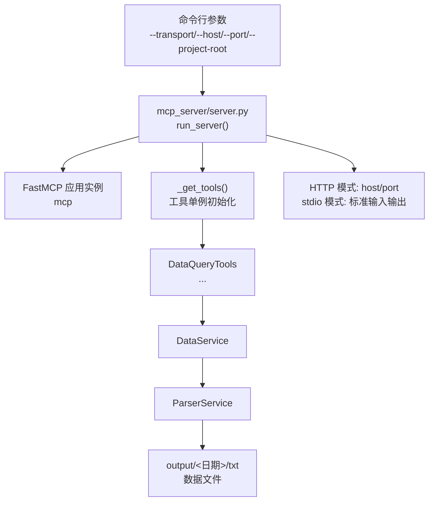
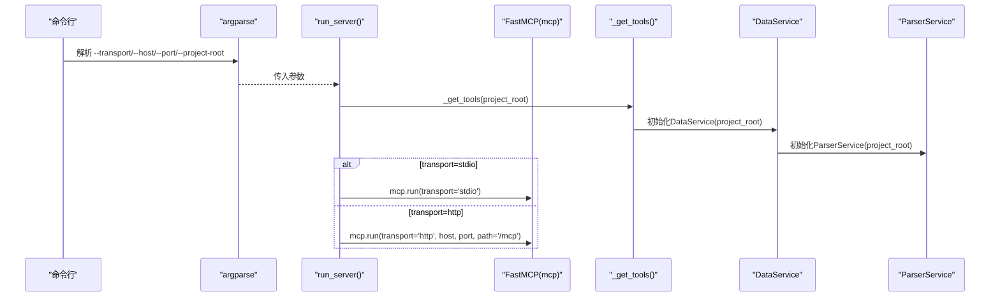
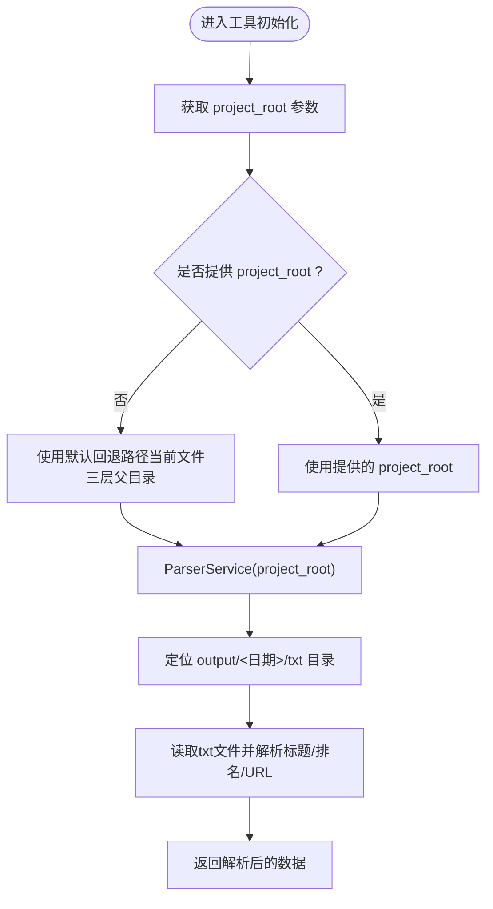
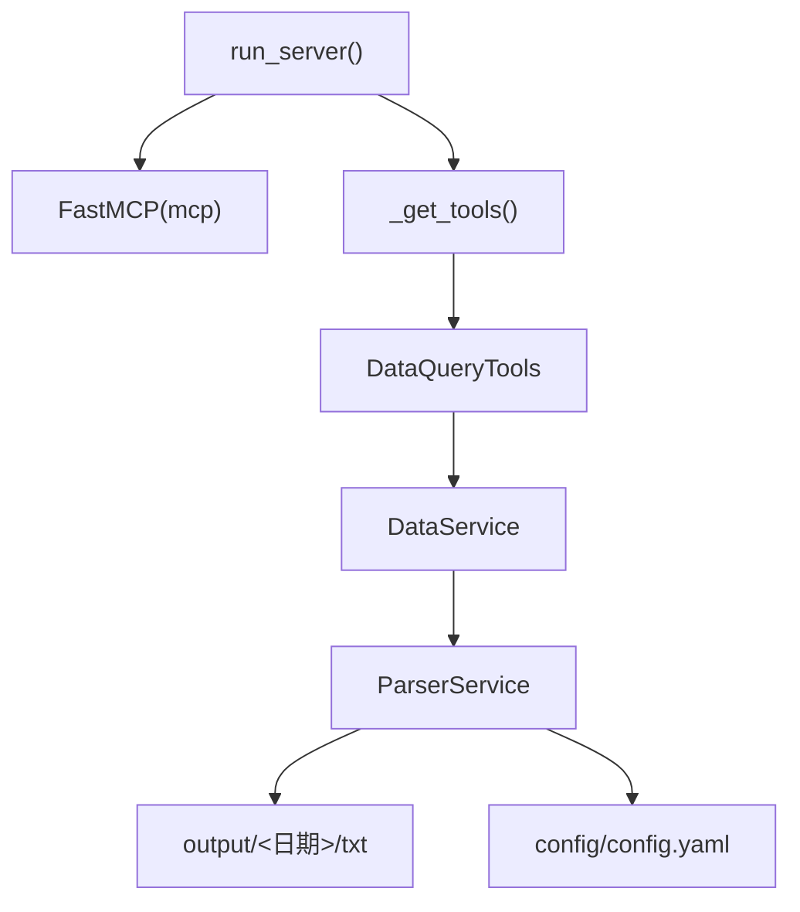

# MCP服务器启动参数详解

<cite>
**本文引用的文件**
- [mcp_server/server.py](file://mcp_server/server.py)
- [start-http.sh](file://start-http.sh)
- [start-http.bat](file://start-http.bat)
- [docker/Dockerfile.mcp](file://docker/Dockerfile.mcp)
- [docker/docker-compose.yml](file://docker/docker-compose.yml)
- [mcp_server/services/parser_service.py](file://mcp_server/services/parser_service.py)
- [mcp_server/services/data_service.py](file://mcp_server/services/data_service.py)
- [mcp_server/tools/data_query.py](file://mcp_server/tools/data_query.py)
- [config/config.yaml](file://config/config.yaml)
</cite>

## 目录
1. [简介](#简介)
2. [项目结构](#项目结构)
3. [核心组件](#核心组件)
4. [架构总览](#架构总览)
5. [详细组件分析](#详细组件分析)
6. [依赖分析](#依赖分析)
7. [性能考虑](#性能考虑)
8. [故障排查指南](#故障排查指南)
9. [结论](#结论)
10. [附录：常用启动命令示例](#附录常用启动命令示例)

## 简介
本文围绕MCP服务器的启动参数展开，重点解释run_server函数中的project_root、transport、host和port四个参数的作用，并结合代码中的argparse配置，说明命令行参数与函数参数的映射关系。同时，阐述project_root如何影响工具实例的初始化路径，transport参数如何决定服务器使用stdio还是HTTP通信模式，host和port在HTTP模式下的网络监听配置作用。最后给出不同参数组合的启动命令示例及适用场景（开发调试使用stdio，生产环境使用HTTP）。

## 项目结构
- MCP服务器位于mcp_server目录，核心入口为mcp_server/server.py
- 启动脚本与容器编排文件位于根目录与docker目录
- 工具与服务层位于mcp_server/tools与mcp_server/services
- 配置文件位于config/config.yaml

图表来源
- [mcp_server/server.py](file://mcp_server/server.py#L662-L782)
- [mcp_server/services/parser_service.py](file://mcp_server/services/parser_service.py#L1-L200)
- [mcp_server/services/data_service.py](file://mcp_server/services/data_service.py#L1-L200)
- [mcp_server/tools/data_query.py](file://mcp_server/tools/data_query.py#L1-L200)

章节来源
- [mcp_server/server.py](file://mcp_server/server.py#L662-L782)

## 核心组件
- run_server函数：负责根据参数初始化工具实例、打印启动信息，并选择传输模式运行服务器
- argparse配置：定义--transport、--host、--port、--project-root四个命令行参数
- 工具与服务链路：run_server调用_get_tools，进而实例化DataQueryTools等工具；工具内部通过DataService访问ParserService；ParserService基于project_root定位output目录读取数据

章节来源
- [mcp_server/server.py](file://mcp_server/server.py#L662-L782)
- [mcp_server/tools/data_query.py](file://mcp_server/tools/data_query.py#L1-L200)
- [mcp_server/services/data_service.py](file://mcp_server/services/data_service.py#L1-L200)
- [mcp_server/services/parser_service.py](file://mcp_server/services/parser_service.py#L1-L200)

## 架构总览
MCP服务器启动流程分为两大部分：
- 参数解析与映射：命令行参数通过argparse映射到run_server函数的四个形参
- 服务器运行：根据transport选择stdio或HTTP模式；HTTP模式下host与port决定监听地址与端口；project_root影响工具初始化与数据读取路径

图表来源
- [mcp_server/server.py](file://mcp_server/server.py#L742-L782)
- [mcp_server/server.py](file://mcp_server/server.py#L662-L741)
- [mcp_server/tools/data_query.py](file://mcp_server/tools/data_query.py#L1-L200)
- [mcp_server/services/data_service.py](file://mcp_server/services/data_service.py#L1-L200)
- [mcp_server/services/parser_service.py](file://mcp_server/services/parser_service.py#L1-L200)

## 详细组件分析

### 参数作用与行为说明
- project_root
  - 作用：作为项目根目录路径，影响工具实例初始化以及数据读取路径
  - 影响范围：DataQueryTools构造函数接收project_root，传递给DataService；DataService再传递给ParserService；ParserService据此定位output目录读取txt数据
  - 默认行为：若未显式传入，ParserService内部回退到当前文件所在目录的三层父目录作为project_root
- transport
  - 作用：选择传输模式
  - 取值：'stdio'或'http'
  - 行为差异：stdio模式通过标准输入输出与客户端通信；http模式启动HTTP服务器，监听host:port
- host
  - 作用：HTTP模式下的监听地址
  - 默认：'0.0.0.0'
- port
  - 作用：HTTP模式下的监听端口
  - 默认：3333

章节来源
- [mcp_server/server.py](file://mcp_server/server.py#L662-L741)
- [mcp_server/server.py](file://mcp_server/server.py#L742-L782)
- [mcp_server/services/parser_service.py](file://mcp_server/services/parser_service.py#L1-L200)
- [mcp_server/services/data_service.py](file://mcp_server/services/data_service.py#L1-L200)
- [mcp_server/tools/data_query.py](file://mcp_server/tools/data_query.py#L1-L200)

### 命令行参数与函数参数映射
- --transport → transport
- --host → host
- --port → port
- --project-root → project_root
- 默认值与取值约束均在argparse中定义

章节来源
- [mcp_server/server.py](file://mcp_server/server.py#L742-L782)

### 参数组合与适用场景
- 开发调试（stdio）
  - 优点：便于在终端直接交互，适合本地联调
  - 适用：本地开发、快速验证工具可用性
- 生产环境（HTTP）
  - 优点：可被远端客户端访问，便于集成到其他系统
  - 适用：容器化部署、跨进程/跨主机通信

章节来源
- [mcp_server/server.py](file://mcp_server/server.py#L687-L741)
- [start-http.sh](file://start-http.sh#L1-L22)
- [start-http.bat](file://start-http.bat#L1-L26)
- [docker/Dockerfile.mcp](file://docker/Dockerfile.mcp#L1-L24)
- [docker/docker-compose.yml](file://docker/docker-compose.yml#L60-L74)

### project_root对工具初始化路径的影响
- DataQueryTools构造函数接收project_root并传给DataService
- DataService构造函数接收project_root并传给ParserService
- ParserService根据project_root定位output目录，读取对应日期的txt文件，解析标题、排名、URL等信息

图表来源
- [mcp_server/services/parser_service.py](file://mcp_server/services/parser_service.py#L1-L200)
- [mcp_server/services/data_service.py](file://mcp_server/services/data_service.py#L1-L200)
- [mcp_server/tools/data_query.py](file://mcp_server/tools/data_query.py#L1-L200)

章节来源
- [mcp_server/services/parser_service.py](file://mcp_server/services/parser_service.py#L1-L200)
- [mcp_server/services/data_service.py](file://mcp_server/services/data_service.py#L1-L200)
- [mcp_server/tools/data_query.py](file://mcp_server/tools/data_query.py#L1-L200)

### transport参数对通信模式的影响
- stdio模式
  - 通过标准输入输出与客户端通信，适合本地调试
- http模式
  - 启动HTTP服务器，监听host与port，端点路径为'/mcp'

章节来源
- [mcp_server/server.py](file://mcp_server/server.py#L687-L741)
- [mcp_server/server.py](file://mcp_server/server.py#L727-L741)

### host与port在网络监听中的作用
- HTTP模式下，host与port共同决定服务器监听地址
- 容器编排文件暴露3333端口，便于外部访问
- 启动脚本默认使用0.0.0.0监听所有网卡

章节来源
- [mcp_server/server.py](file://mcp_server/server.py#L727-L741)
- [docker/docker-compose.yml](file://docker/docker-compose.yml#L60-L74)
- [docker/Dockerfile.mcp](file://docker/Dockerfile.mcp#L1-L24)
- [start-http.sh](file://start-http.sh#L1-L22)
- [start-http.bat](file://start-http.bat#L1-L26)

## 依赖分析
- run_server依赖FastMCP框架进行服务器运行
- 工具层依赖服务层，服务层依赖解析层
- ParserService依赖project_root定位output目录
- 配置文件config.yaml影响平台列表等参数校验

图表来源
- [mcp_server/server.py](file://mcp_server/server.py#L662-L741)
- [mcp_server/tools/data_query.py](file://mcp_server/tools/data_query.py#L1-L200)
- [mcp_server/services/data_service.py](file://mcp_server/services/data_service.py#L1-L200)
- [mcp_server/services/parser_service.py](file://mcp_server/services/parser_service.py#L1-L200)
- [config/config.yaml](file://config/config.yaml#L1-L140)

章节来源
- [mcp_server/server.py](file://mcp_server/server.py#L662-L741)
- [mcp_server/tools/data_query.py](file://mcp_server/tools/data_query.py#L1-L200)
- [mcp_server/services/data_service.py](file://mcp_server/services/data_service.py#L1-L200)
- [mcp_server/services/parser_service.py](file://mcp_server/services/parser_service.py#L1-L200)
- [config/config.yaml](file://config/config.yaml#L1-L140)

## 性能考虑
- HTTP模式下，服务器监听host与port，便于横向扩展与负载均衡
- 数据读取采用缓存机制（ParserService与DataService均有缓存键），减少重复I/O
- stdio模式适合轻量调试，HTTP模式适合生产环境

章节来源
- [mcp_server/server.py](file://mcp_server/server.py#L727-L741)
- [mcp_server/services/data_service.py](file://mcp_server/services/data_service.py#L1-L200)
- [mcp_server/services/parser_service.py](file://mcp_server/services/parser_service.py#L1-L200)

## 故障排查指南
- 传输模式错误
  - 现象：传入不支持的transport值
  - 处理：确认transport取值为'stdio'或'http'
- HTTP监听问题
  - 现象：端口占用或权限不足
  - 处理：更换port或使用root权限；确认host绑定地址正确
- project_root路径问题
  - 现象：找不到output目录或数据文件
  - 处理：确认project_root指向正确的项目根目录；检查output/<日期>/txt是否存在
- 平台配置不一致
  - 现象：工具参数校验失败
  - 处理：核对config/config.yaml中的platforms配置，确保平台ID一致

章节来源
- [mcp_server/server.py](file://mcp_server/server.py#L738-L741)
- [mcp_server/services/parser_service.py](file://mcp_server/services/parser_service.py#L1-L200)
- [mcp_server/services/data_service.py](file://mcp_server/services/data_service.py#L1-L200)
- [config/config.yaml](file://config/config.yaml#L116-L140)

## 结论
- project_root决定工具初始化与数据读取路径，未提供时使用默认回退策略
- transport控制通信模式，stdio适合本地调试，http适合生产部署
- host与port在http模式下共同决定监听地址与端口
- 命令行参数与函数参数一一映射，遵循argparse定义的默认值与取值范围
- 结合启动脚本与容器编排，可快速在本地或容器环境中启动MCP服务器

## 附录：常用启动命令示例
- 本地开发（stdio）
  - 说明：通过标准输入输出与客户端通信，适合本地调试
  - 示例：python -m mcp_server.server --transport stdio
- 生产环境（HTTP）
  - 说明：监听0.0.0.0:3333，端点路径为/mcp
  - 示例：python -m mcp_server.server --transport http --host 0.0.0.0 --port 3333
- 指定项目根目录（HTTP）
  - 说明：通过--project-root指定项目根目录，影响工具初始化与数据读取
  - 示例：python -m mcp_server.server --transport http --host 0.0.0.0 --port 3333 --project-root /path/to/project
- 使用启动脚本（HTTP）
  - 说明：脚本内置默认参数，便于一键启动
  - 示例：./start-http.sh 或 ./start-http.bat
- 容器化部署（HTTP）
  - 说明：容器镜像默认以HTTP模式启动，暴露3333端口
  - 示例：docker run ... -p 3333:3333 trendradar-mcp

章节来源
- [mcp_server/server.py](file://mcp_server/server.py#L742-L782)
- [start-http.sh](file://start-http.sh#L1-L22)
- [start-http.bat](file://start-http.bat#L1-L26)
- [docker/Dockerfile.mcp](file://docker/Dockerfile.mcp#L1-L24)
- [docker/docker-compose.yml](file://docker/docker-compose.yml#L60-L74)