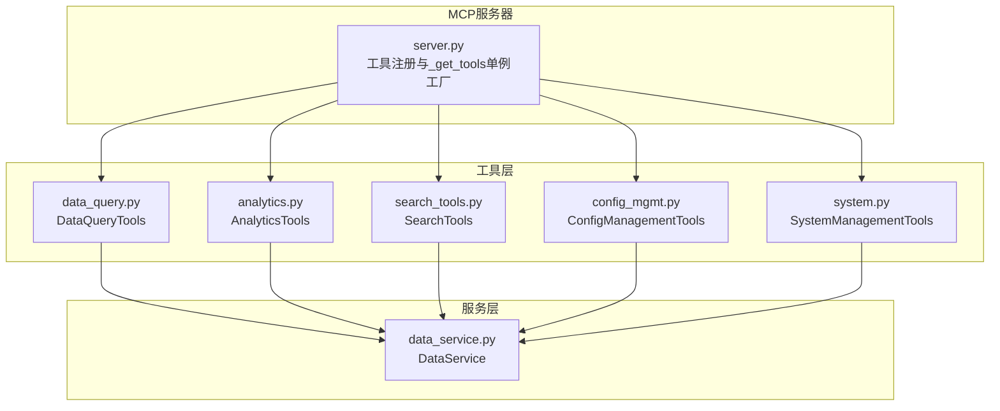
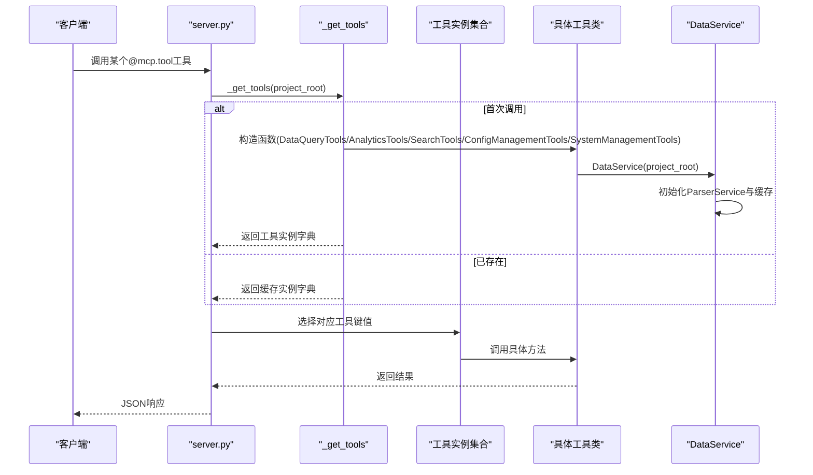
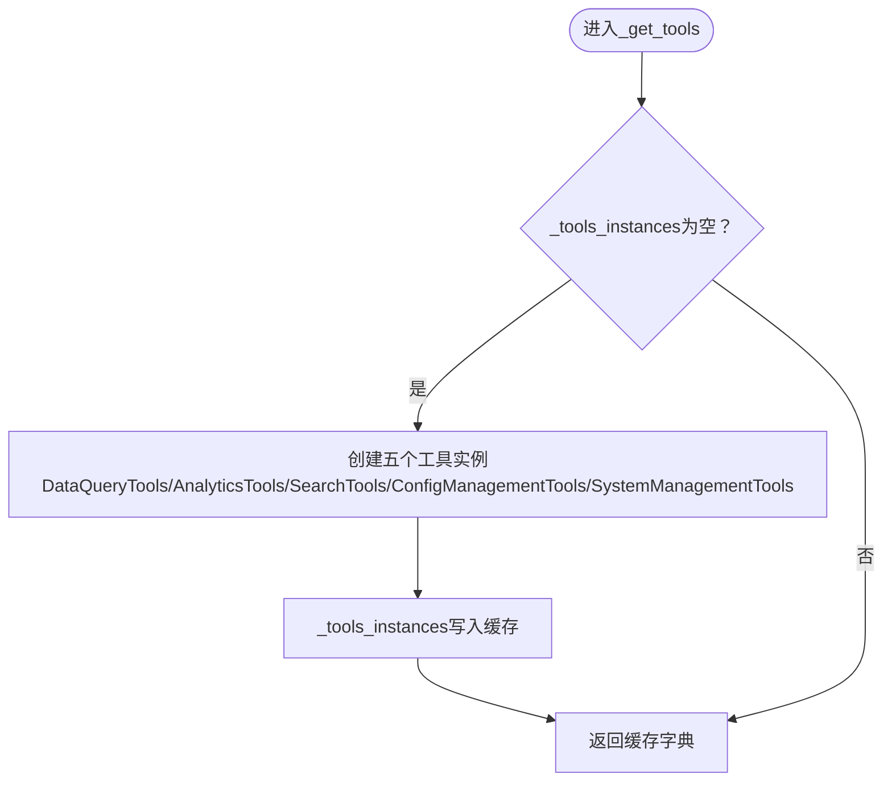
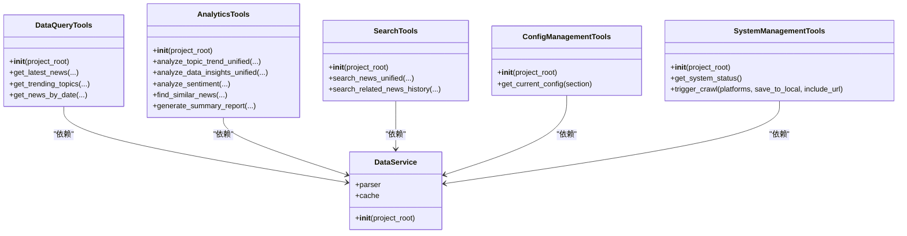
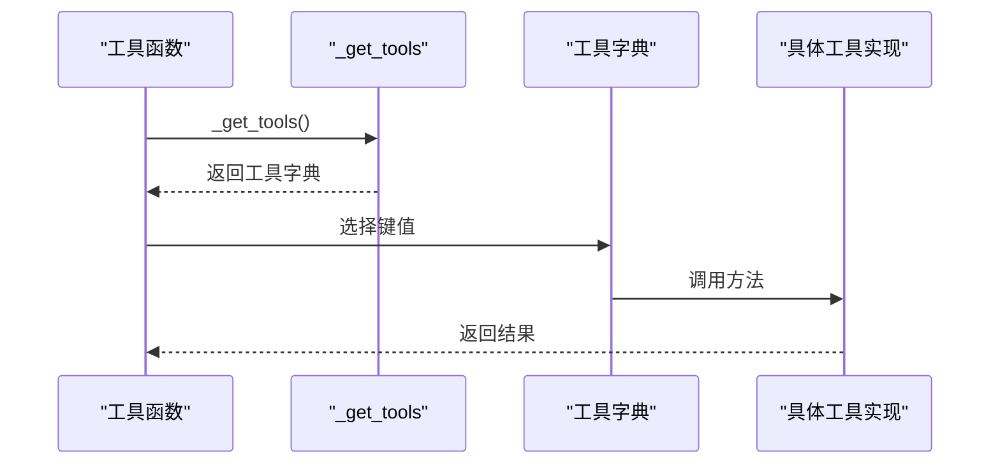
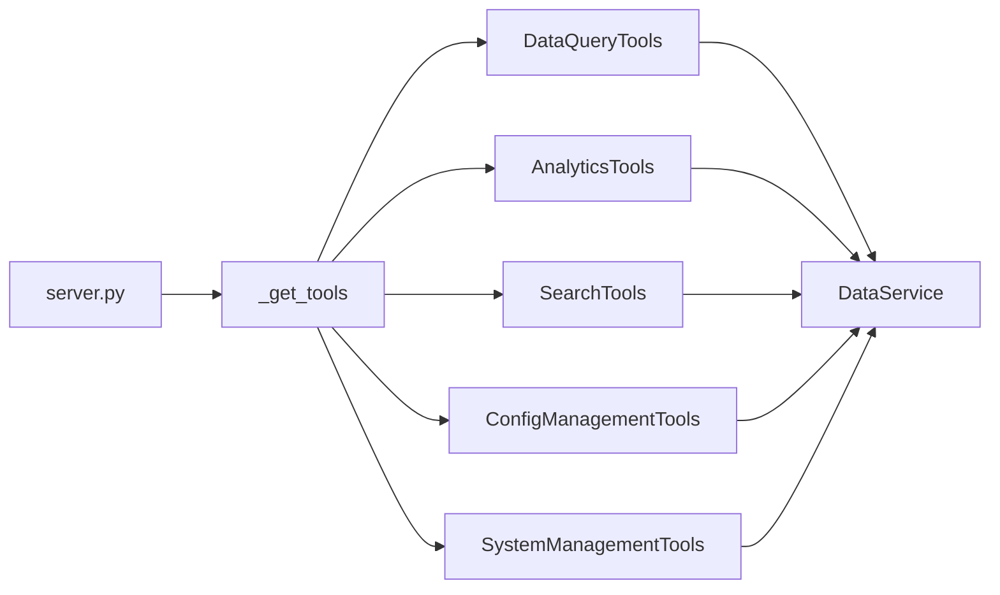

# 工具实例初始化机制

<cite>
**本文引用的文件**
- [mcp_server/server.py](file://mcp_server/server.py)
- [mcp_server/tools/data_query.py](file://mcp_server/tools/data_query.py)
- [mcp_server/tools/analytics.py](file://mcp_server/tools/analytics.py)
- [mcp_server/tools/search_tools.py](file://mcp_server/tools/search_tools.py)
- [mcp_server/tools/config_mgmt.py](file://mcp_server/tools/config_mgmt.py)
- [mcp_server/tools/system.py](file://mcp_server/tools/system.py)
- [mcp_server/services/data_service.py](file://mcp_server/services/data_service.py)
</cite>

## 目录
1. [简介](#简介)
2. [项目结构](#项目结构)
3. [核心组件](#核心组件)
4. [架构总览](#架构总览)
5. [详细组件分析](#详细组件分析)
6. [依赖关系分析](#依赖关系分析)
7. [性能考量](#性能考量)
8. [故障排查指南](#故障排查指南)
9. [结论](#结论)

## 简介
本文聚焦于MCP服务器工具实例初始化机制，重点解析_get_tools函数的实现逻辑与单例模式设计。文档说明该函数如何通过全局变量_tools_instances实现延迟初始化，首次调用时创建DataQueryTools、AnalyticsTools、SearchTools、ConfigManagementTools和SystemManagementTools五个工具实例，并将project_root参数传递给各工具类构造函数；同时阐述这些工具实例如何被不同MCP工具函数调用，以及延迟初始化在服务器启动阶段带来的资源节约优势。

## 项目结构
- mcp_server/server.py：MCP服务器入口与工具注册，包含_get_tools单例工厂、工具函数装饰器与run_server启动逻辑。
- mcp_server/tools/*：各类工具实现，分别对应数据查询、高级分析、智能检索、配置管理、系统管理。
- mcp_server/services/data_service.py：数据访问层，封装解析与缓存逻辑，作为各工具类的依赖注入对象。

图表来源
- [mcp_server/server.py](file://mcp_server/server.py#L1-L120)
- [mcp_server/tools/data_query.py](file://mcp_server/tools/data_query.py#L1-L40)
- [mcp_server/tools/analytics.py](file://mcp_server/tools/analytics.py#L1-L40)
- [mcp_server/tools/search_tools.py](file://mcp_server/tools/search_tools.py#L1-L40)
- [mcp_server/tools/config_mgmt.py](file://mcp_server/tools/config_mgmt.py#L1-L30)
- [mcp_server/tools/system.py](file://mcp_server/tools/system.py#L1-L40)
- [mcp_server/services/data_service.py](file://mcp_server/services/data_service.py#L1-L40)

章节来源
- [mcp_server/server.py](file://mcp_server/server.py#L1-L120)

## 核心组件
- 单例工厂_get_tools：在首次调用时创建五个工具实例并缓存于全局字典，后续调用直接返回缓存实例。
- 工具类构造函数：各工具类均接收project_root参数，用于初始化DataService，从而加载解析器与缓存。
- 工具函数装饰器：@mcp.tool装饰器将函数注册为MCP工具，内部通过_get_tools获取实例并调用对应方法。

章节来源
- [mcp_server/server.py](file://mcp_server/server.py#L25-L40)
- [mcp_server/tools/data_query.py](file://mcp_server/tools/data_query.py#L22-L35)
- [mcp_server/tools/analytics.py](file://mcp_server/tools/analytics.py#L77-L90)
- [mcp_server/tools/search_tools.py](file://mcp_server/tools/search_tools.py#L18-L30)
- [mcp_server/tools/config_mgmt.py](file://mcp_server/tools/config_mgmt.py#L14-L26)
- [mcp_server/tools/system.py](file://mcp_server/tools/system.py#L15-L33)
- [mcp_server/services/data_service.py](file://mcp_server/services/data_service.py#L17-L30)

## 架构总览
_get_tools单例工厂贯穿工具函数调用链路，形成“工具函数 -> 单例工厂 -> 工具实例 -> 数据服务”的清晰依赖关系。

图表来源
- [mcp_server/server.py](file://mcp_server/server.py#L25-L40)
- [mcp_server/tools/data_query.py](file://mcp_server/tools/data_query.py#L22-L35)
- [mcp_server/tools/analytics.py](file://mcp_server/tools/analytics.py#L77-L90)
- [mcp_server/tools/search_tools.py](file://mcp_server/tools/search_tools.py#L18-L30)
- [mcp_server/tools/config_mgmt.py](file://mcp_server/tools/config_mgmt.py#L14-L26)
- [mcp_server/tools/system.py](file://mcp_server/tools/system.py#L15-L33)
- [mcp_server/services/data_service.py](file://mcp_server/services/data_service.py#L17-L30)

## 详细组件分析

### _get_tools单例工厂
- 设计要点
  - 全局字典缓存：_tools_instances用于存储五个工具实例，键分别为"data"、"analytics"、"search"、"config"、"system"。
  - 延迟初始化：仅在字典为空时创建实例，避免服务器启动时不必要的资源占用。
  - 参数透传：project_root作为可选参数传入各工具类构造函数，确保工具链路具备统一的项目根目录上下文。
- 调用时机
  - 工具函数内部通过tools = _get_tools()获取实例字典。
  - run_server在启动时显式调用_get_tools(project_root)以提前建立实例，便于后续工具调用。
- 返回形态
  - 返回包含五个工具实例的字典，便于按键选择对应工具。

图表来源
- [mcp_server/server.py](file://mcp_server/server.py#L25-L40)

章节来源
- [mcp_server/server.py](file://mcp_server/server.py#L25-L40)
- [mcp_server/server.py](file://mcp_server/server.py#L662-L740)

### 工具类构造与project_root传递
- DataQueryTools
  - 构造函数接收project_root并创建DataService(project_root)。
  - 作用：为数据查询类提供统一的数据访问与缓存能力。
- AnalyticsTools
  - 构造函数接收project_root并创建DataService(project_root)。
  - 作用：为高级分析类提供数据访问与权重计算等能力。
- SearchTools
  - 构造函数接收project_root并创建DataService(project_root)。
  - 作用：为智能检索类提供数据访问与相似度计算等能力。
- ConfigManagementTools
  - 构造函数接收project_root并创建DataService(project_root)。
  - 作用：为配置管理类提供配置读取能力。
- SystemManagementTools
  - 构造函数接收project_root并创建DataService(project_root)。
  - 作用：为系统管理类提供系统状态与爬取触发能力，同时根据project_root定位配置文件与输出目录。

图表来源
- [mcp_server/tools/data_query.py](file://mcp_server/tools/data_query.py#L22-L35)
- [mcp_server/tools/analytics.py](file://mcp_server/tools/analytics.py#L77-L90)
- [mcp_server/tools/search_tools.py](file://mcp_server/tools/search_tools.py#L18-L30)
- [mcp_server/tools/config_mgmt.py](file://mcp_server/tools/config_mgmt.py#L14-L26)
- [mcp_server/tools/system.py](file://mcp_server/tools/system.py#L15-L33)
- [mcp_server/services/data_service.py](file://mcp_server/services/data_service.py#L17-L30)

章节来源
- [mcp_server/tools/data_query.py](file://mcp_server/tools/data_query.py#L22-L35)
- [mcp_server/tools/analytics.py](file://mcp_server/tools/analytics.py#L77-L90)
- [mcp_server/tools/search_tools.py](file://mcp_server/tools/search_tools.py#L18-L30)
- [mcp_server/tools/config_mgmt.py](file://mcp_server/tools/config_mgmt.py#L14-L26)
- [mcp_server/tools/system.py](file://mcp_server/tools/system.py#L15-L33)
- [mcp_server/services/data_service.py](file://mcp_server/services/data_service.py#L17-L30)

### 工具函数调用链路
- 工具函数内部通过tools = _get_tools()获取实例字典，然后按键访问对应工具实例的方法。
- 例如：
  - get_latest_news -> tools['data'].get_latest_news(...)
  - analyze_topic_trend_unified -> tools['analytics'].analyze_topic_trend_unified(...)
  - search_news_unified -> tools['search'].search_news_unified(...)
  - get_current_config -> tools['config'].get_current_config(...)
  - get_system_status -> tools['system'].get_system_status(...)

图表来源
- [mcp_server/server.py](file://mcp_server/server.py#L140-L200)
- [mcp_server/server.py](file://mcp_server/server.py#L270-L300)
- [mcp_server/server.py](file://mcp_server/server.py#L520-L540)
- [mcp_server/server.py](file://mcp_server/server.py#L600-L620)
- [mcp_server/server.py](file://mcp_server/server.py#L610-L660)

章节来源
- [mcp_server/server.py](file://mcp_server/server.py#L140-L200)
- [mcp_server/server.py](file://mcp_server/server.py#L270-L300)
- [mcp_server/server.py](file://mcp_server/server.py#L520-L540)
- [mcp_server/server.py](file://mcp_server/server.py#L600-L620)
- [mcp_server/server.py](file://mcp_server/server.py#L610-L660)

### 延迟初始化的优势
- 资源节约：服务器启动时不创建工具实例，避免加载解析器、缓存与外部依赖，降低启动时间与内存占用。
- 按需加载：只有在首次调用工具函数时才初始化，确保仅在真正需要时分配资源。
- 可扩展性：新增工具类只需在_get_tools中注册，无需修改启动流程。

章节来源
- [mcp_server/server.py](file://mcp_server/server.py#L25-L40)
- [mcp_server/server.py](file://mcp_server/server.py#L662-L740)

## 依赖关系分析
- 工具函数依赖_get_tools单例工厂，后者依赖各工具类构造函数。
- 各工具类依赖DataService，后者依赖ParserService与缓存服务。
- SystemManagementTools额外依赖项目根目录以定位配置文件与输出目录。

图表来源
- [mcp_server/server.py](file://mcp_server/server.py#L25-L40)
- [mcp_server/tools/data_query.py](file://mcp_server/tools/data_query.py#L22-L35)
- [mcp_server/tools/analytics.py](file://mcp_server/tools/analytics.py#L77-L90)
- [mcp_server/tools/search_tools.py](file://mcp_server/tools/search_tools.py#L18-L30)
- [mcp_server/tools/config_mgmt.py](file://mcp_server/tools/config_mgmt.py#L14-L26)
- [mcp_server/tools/system.py](file://mcp_server/tools/system.py#L15-L33)
- [mcp_server/services/data_service.py](file://mcp_server/services/data_service.py#L17-L30)

章节来源
- [mcp_server/server.py](file://mcp_server/server.py#L25-L40)
- [mcp_server/tools/system.py](file://mcp_server/tools/system.py#L15-L33)
- [mcp_server/services/data_service.py](file://mcp_server/services/data_service.py#L17-L30)

## 性能考量
- 延迟初始化减少启动开销，适合生产环境的快速启动与按需使用。
- 工具类内部普遍采用缓存策略（如DataService的缓存键与TTL），提升重复查询性能。
- SystemManagementTools在触发爬取时进行网络请求与文件写入，属于高开销操作，应避免频繁调用。

章节来源
- [mcp_server/server.py](file://mcp_server/server.py#L25-L40)
- [mcp_server/services/data_service.py](file://mcp_server/services/data_service.py#L30-L120)
- [mcp_server/tools/system.py](file://mcp_server/tools/system.py#L68-L120)

## 故障排查指南
- 工具函数返回错误结构：各工具类在捕获MCPError或通用异常时，会返回包含success与error字段的字典，便于客户端识别与处理。
- SystemManagementTools在缺少配置文件或平台配置时抛出错误，需检查config/config.yaml是否存在且包含platforms配置。
- 若_get_tools未生效，确认工具函数内部确实调用了tools = _get_tools()并按键访问对应工具方法。

章节来源
- [mcp_server/tools/data_query.py](file://mcp_server/tools/data_query.py#L70-L90)
- [mcp_server/tools/analytics.py](file://mcp_server/tools/analytics.py#L118-L155)
- [mcp_server/tools/search_tools.py](file://mcp_server/tools/search_tools.py#L100-L125)
- [mcp_server/tools/config_mgmt.py](file://mcp_server/tools/config_mgmt.py#L40-L67)
- [mcp_server/tools/system.py](file://mcp_server/tools/system.py#L100-L140)

## 结论
_get_tools单例工厂通过全局字典实现延迟初始化，将project_root参数透传至各工具类构造函数，确保工具链路具备统一的项目根目录上下文。该设计在服务器启动阶段避免不必要的资源消耗，同时保证工具函数按需加载、高效运行。配合各工具类内部的缓存与参数校验机制，整体架构具备良好的性能与可维护性。