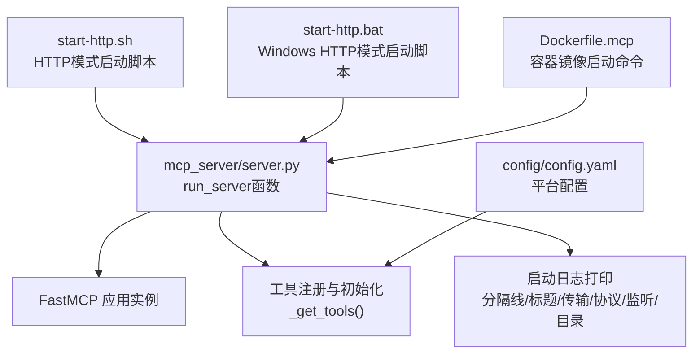
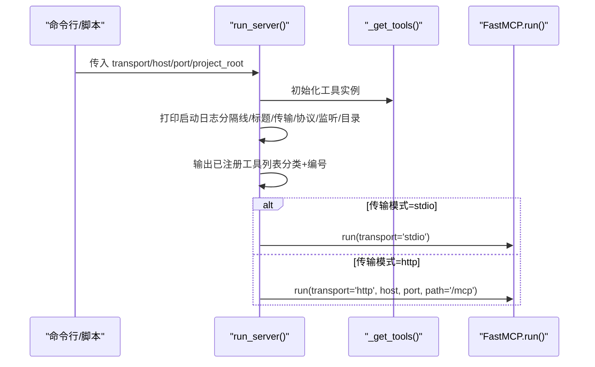
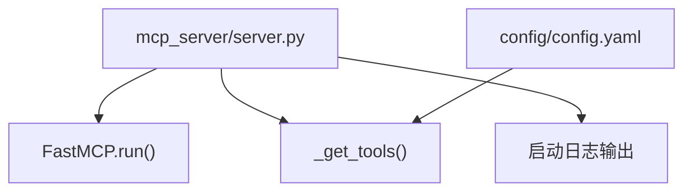

# 服务器启动日志输出

<cite>
**本文引用的文件**
- [mcp_server/server.py](file://mcp_server/server.py)
- [config/config.yaml](file://config/config.yaml)
- [start-http.sh](file://start-http.sh)
- [start-http.bat](file://start-http.bat)
- [docker/Dockerfile.mcp](file://docker/Dockerfile.mcp)
</cite>

## 目录
1. [简介](#简介)
2. [项目结构](#项目结构)
3. [核心组件](#核心组件)
4. [架构总览](#架构总览)
5. [详细组件分析](#详细组件分析)
6. [依赖关系分析](#依赖关系分析)
7. [性能考量](#性能考量)
8. [故障排查指南](#故障排查指南)
9. [结论](#结论)

## 简介
本文聚焦于MCP服务器启动时的日志输出，系统性解析run_server函数中打印的启动信息格式与内容，涵盖分隔线、服务器标题、传输模式、协议类型、监听地址、项目目录等关键字段；重点阐述“已注册工具列表”的输出机制，包括工具分类（日期解析、数据查询、智能检索、高级分析、系统管理）与编号列表的生成方式，并提供实际启动日志示例，逐段解释每部分含义，帮助用户确认服务器正确加载了所有MCP工具。

## 项目结构
- MCP服务器位于mcp_server目录，核心入口为mcp_server/server.py，其中run_server负责启动并打印启动日志。
- 启动脚本与容器镜像分别提供HTTP模式的便捷启动方式，便于在生产环境快速部署。
- 配置文件config/config.yaml定义了平台列表等关键配置，影响工具行为与日志输出的上下文信息。

图表来源
- [mcp_server/server.py](file://mcp_server/server.py#L662-L781)
- [config/config.yaml](file://config/config.yaml#L116-L140)
- [start-http.sh](file://start-http.sh#L1-L21)
- [start-http.bat](file://start-http.bat#L1-L25)
- [docker/Dockerfile.mcp](file://docker/Dockerfile.mcp#L1-L23)

章节来源
- [mcp_server/server.py](file://mcp_server/server.py#L662-L781)
- [config/config.yaml](file://config/config.yaml#L116-L140)
- [start-http.sh](file://start-http.sh#L1-L21)
- [start-http.bat](file://start-http.bat#L1-L25)
- [docker/Dockerfile.mcp](file://docker/Dockerfile.mcp#L1-L23)

## 核心组件
- run_server函数：负责初始化工具实例、打印启动日志、根据传输模式启动FastMCP服务。
- 工具注册与初始化：通过_get_tools()一次性创建工具实例，供后续工具函数使用。
- 启动日志打印：集中输出分隔线、服务器标题、传输模式、协议类型、监听地址、项目目录等信息。
- 已注册工具列表：按类别分组输出工具名称与编号，便于核验工具加载完整性。

章节来源
- [mcp_server/server.py](file://mcp_server/server.py#L662-L781)

## 架构总览
启动流程概览如下：

图表来源
- [mcp_server/server.py](file://mcp_server/server.py#L662-L781)

## 详细组件分析

### 启动日志格式与内容解析
- 分隔线与标题
  - 使用固定宽度的等号分隔线包围服务器标题，形成清晰的视觉分隔。
  - 标题体现项目名称与版本标识，便于识别。
- 传输模式
  - 输出当前使用的传输模式（stdio或http），用于确认客户端连接方式。
- 协议类型
  - stdio模式：说明通过标准输入输出与MCP客户端通信。
  - http模式：说明通过HTTP协议提供生产环境服务。
- 监听地址与端口
  - http模式下输出host与port，便于客户端访问。
- 项目目录
  - 输出project_root或“当前目录”，用于定位资源路径。

章节来源
- [mcp_server/server.py](file://mcp_server/server.py#L680-L726)

### 已注册工具列表的输出机制
- 工具分类
  - 日期解析工具：推荐优先调用，用于将自然语言日期表达式解析为标准日期范围。
  - 基础数据查询（P0核心）：提供最新新闻、按日期查询新闻、趋势话题等基础能力。
  - 智能检索工具：统一新闻搜索、历史相关新闻检索等。
  - 高级数据分析：统一话题趋势分析、统一数据洞察分析、情感分析、相似新闻查找、摘要生成等。
  - 配置与系统管理：获取当前系统配置、获取系统运行状态、手动触发爬取任务等。
- 编号列表生成方式
  - 工具列表按上述分类顺序输出，编号从0开始递增，依次为0、1、2、…，便于用户快速定位工具名称与编号对应关系。
  - 编号与工具名称一一对应，用户可通过编号直接调用相应工具。

章节来源
- [mcp_server/server.py](file://mcp_server/server.py#L700-L724)

### 传输模式与监听地址的启动逻辑
- 传输模式选择
  - stdio：适用于开发调试或嵌入式场景。
  - http：适用于生产环境，便于远程访问与集成。
- 监听地址与端口
  - http模式下，host与port由参数传入，path固定为/mcp。
- 启动入口
  - run_server根据transport参数调用FastMCP.run()，进入对应传输模式的服务循环。

章节来源
- [mcp_server/server.py](file://mcp_server/server.py#L727-L739)

### 实际启动日志示例与逐段解释
以下为常见启动日志示例（纯文本示意，不含具体代码）：
- 分隔线与标题
  - 顶部与底部均为等号分隔线，标题为“TrendRadar MCP Server - FastMCP 2.0”。
- 传输模式
  - 输出“传输模式: HTTP”或“传输模式: STDIO”。
- 协议类型
  - http模式：输出“协议: MCP over HTTP (生产环境)”与“服务器监听: host:port”。
  - stdio模式：输出“协议: MCP over stdio (标准输入输出)”与“说明: 通过标准输入输出与 MCP 客户端通信”。
- 项目目录
  - 输出“项目目录: /path/to/project_root”或“项目目录: 当前目录”。
- 已注册工具列表
  - 分类标题后跟随工具编号与名称，例如：
    - “0. resolve_date_range - 解析自然语言日期为标准格式”
    - “1. get_latest_news - 获取最新新闻”
    - “2. get_news_by_date - 按日期查询新闻（支持自然语言）”
    - “3. get_trending_topics - 获取趋势话题”
    - “4. search_news - 统一新闻搜索（关键词/模糊/实体）”
    - “5. search_related_news_history - 历史相关新闻检索”
    - “6. analyze_topic_trend - 统一话题趋势分析（热度/生命周期/爆火/预测）”
    - “7. analyze_data_insights - 统一数据洞察分析（平台对比/活跃度/关键词共现）”
    - “8. analyze_sentiment - 情感倾向分析”
    - “9. find_similar_news - 相似新闻查找”
    - “10. generate_summary_report - 每日/每周摘要生成”
    - “11. get_current_config - 获取当前系统配置”
    - “12. get_system_status - 获取系统运行状态”
    - “13. trigger_crawl - 手动触发爬取任务”
- 结束分隔线
  - 底部再次输出等号分隔线，形成完整的日志块。

逐段解释要点
- 分隔线与标题：用于突出显示启动信息，便于在日志中快速定位。
- 传输模式与协议：帮助确认客户端连接方式与服务暴露方式。
- 监听地址与端口：http模式下用于客户端访问路径与端口。
- 项目目录：用于定位配置与数据文件所在路径。
- 已注册工具列表：核验工具是否正确加载，编号与名称一一对应，便于调用。

章节来源
- [mcp_server/server.py](file://mcp_server/server.py#L680-L726)

### 启动入口与外部入口
- 命令行入口
  - 通过Python模块方式运行mcp_server/server.py，支持--transport/--host/--port/--project-root参数。
- Shell脚本入口（HTTP模式）
  - start-http.sh与start-http.bat提供一键启动HTTP模式的便捷方式，便于本地或Windows环境快速启动。
- 容器镜像入口
  - Dockerfile.mcp在容器中以HTTP模式启动，暴露3333端口，便于在容器环境中部署。

章节来源
- [mcp_server/server.py](file://mcp_server/server.py#L742-L781)
- [start-http.sh](file://start-http.sh#L1-L21)
- [start-http.bat](file://start-http.bat#L1-L25)
- [docker/Dockerfile.mcp](file://docker/Dockerfile.mcp#L1-L23)

## 依赖关系分析
- run_server依赖FastMCP框架提供的运行时能力，按传输模式启动服务。
- 工具注册依赖_get_tools()，后者一次性创建工具实例，供后续工具函数使用。
- 工具分类与编号输出依赖工具函数的注册顺序，确保日志与实际工具清单一致。
- 配置文件config/config.yaml中的平台列表等配置会影响工具行为，但不影响启动日志的输出格式。

图表来源
- [mcp_server/server.py](file://mcp_server/server.py#L662-L781)
- [config/config.yaml](file://config/config.yaml#L116-L140)

章节来源
- [mcp_server/server.py](file://mcp_server/server.py#L662-L781)
- [config/config.yaml](file://config/config.yaml#L116-L140)

## 性能考量
- 启动日志输出为同步I/O操作，开销极低，不会影响服务器启动性能。
- 工具实例初始化采用单例模式，避免重复创建带来的额外开销。
- 传输模式选择对性能影响主要体现在网络栈与并发模型，与启动日志无关。

## 故障排查指南
- 传输模式不支持
  - 若传入不支持的传输模式，run_server会抛出异常并提示“不支持的传输模式”。请检查参数或脚本传参。
- HTTP监听失败
  - 若端口被占用或权限不足，HTTP模式启动会失败。请检查端口占用情况与权限设置。
- 项目目录不可用
  - 若project_root无效或不可访问，工具初始化可能失败。请确认路径存在且具备读取权限。
- 工具未加载
  - 如发现工具列表缺失，请检查工具注册逻辑与依赖库安装情况，确保所有工具均已正确导入与装饰。

章节来源
- [mcp_server/server.py](file://mcp_server/server.py#L727-L739)

## 结论
通过run_server函数的启动日志输出，用户可以快速确认服务器的传输模式、协议类型、监听地址、项目目录以及已注册工具列表的完整性。工具按分类与编号有序排列，便于核验与调用。结合命令行、Shell脚本与容器镜像等多种启动方式，用户可在不同环境下高效部署与验证MCP服务器。