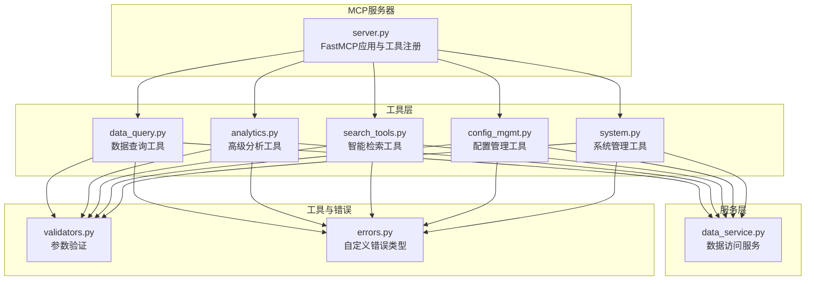
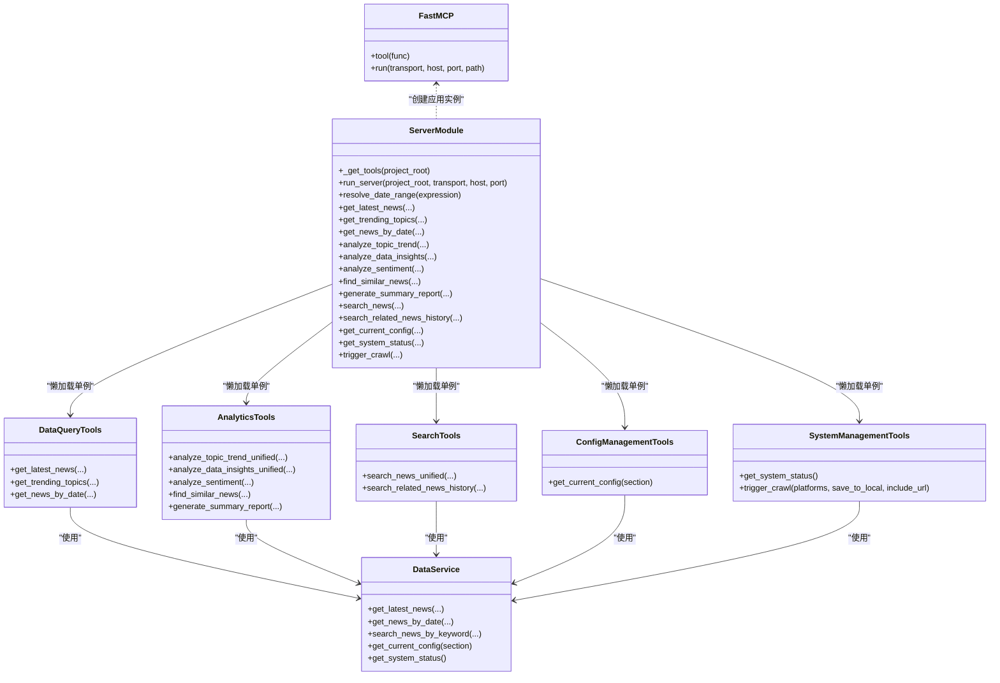
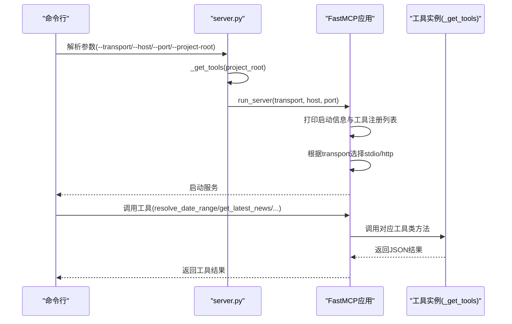
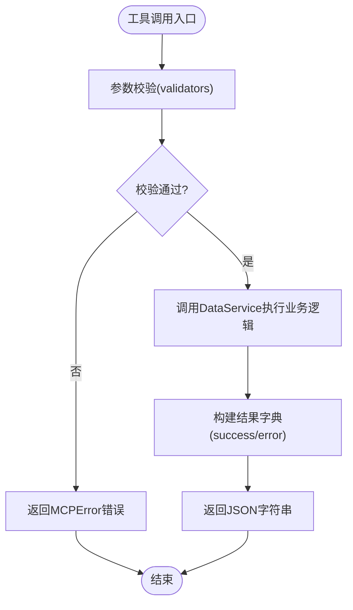
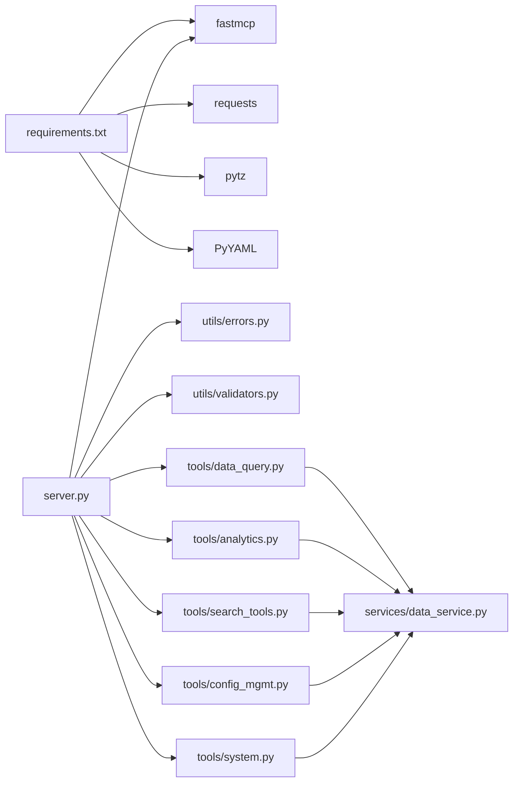

# MCP服务器核心服务

<cite>
**本文引用的文件**
- [mcp_server/server.py](file://mcp_server/server.py)
- [mcp_server/tools/data_query.py](file://mcp_server/tools/data_query.py)
- [mcp_server/tools/analytics.py](file://mcp_server/tools/analytics.py)
- [mcp_server/tools/search_tools.py](file://mcp_server/tools/search_tools.py)
- [mcp_server/tools/config_mgmt.py](file://mcp_server/tools/config_mgmt.py)
- [mcp_server/tools/system.py](file://mcp_server/tools/system.py)
- [mcp_server/services/data_service.py](file://mcp_server/services/data_service.py)
- [mcp_server/utils/errors.py](file://mcp_server/utils/errors.py)
- [mcp_server/utils/validators.py](file://mcp_server/utils/validators.py)
- [requirements.txt](file://requirements.txt)
</cite>

## 目录
1. [简介](#简介)
2. [项目结构](#项目结构)
3. [核心组件](#核心组件)
4. [架构总览](#架构总览)
5. [详细组件分析](#详细组件分析)
6. [依赖关系分析](#依赖关系分析)
7. [性能考量](#性能考量)
8. [故障排查指南](#故障排查指南)
9. [结论](#结论)
10. [附录](#附录)

## 简介
本文件面向MCP服务器核心服务，聚焦于mcp_server/server.py作为FastMCP 2.0实现的中心角色，系统性说明其如何通过FastMCP框架暴露16个工具接口，涵盖服务初始化、工具注册、传输模式（stdio/HTTP）配置与启动流程；深入阐释run_server函数的参数（project_root、transport、host、port）及其在生产环境中的配置方式；阐明_get_tools单例模式的设计与作用；结合命令行参数说明服务器启动流程与工具注册列表打印；并覆盖错误处理机制与系统资源管理要点。

## 项目结构
MCP服务器位于mcp_server目录，采用“工具层-服务层-工具类”分层设计：
- 工具层：mcp_server/server.py集中声明16个@mcp.tool装饰的工具函数，统一注册到FastMCP应用实例。
- 工具实现：mcp_server/tools/* 提供具体业务能力，如数据查询、分析、检索、配置与系统管理。
- 服务层：mcp_server/services/* 封装数据访问与解析逻辑，如DataService、ParserService等。
- 工具与错误：mcp_server/utils/* 提供参数校验与统一错误类型。

图表来源
- [mcp_server/server.py](file://mcp_server/server.py#L1-L120)
- [mcp_server/tools/data_query.py](file://mcp_server/tools/data_query.py#L1-L60)
- [mcp_server/tools/analytics.py](file://mcp_server/tools/analytics.py#L1-L60)
- [mcp_server/tools/search_tools.py](file://mcp_server/tools/search_tools.py#L1-L60)
- [mcp_server/tools/config_mgmt.py](file://mcp_server/tools/config_mgmt.py#L1-L40)
- [mcp_server/tools/system.py](file://mcp_server/tools/system.py#L1-L40)
- [mcp_server/services/data_service.py](file://mcp_server/services/data_service.py#L1-L40)
- [mcp_server/utils/validators.py](file://mcp_server/utils/validators.py#L1-L40)
- [mcp_server/utils/errors.py](file://mcp_server/utils/errors.py#L1-L40)

章节来源
- [mcp_server/server.py](file://mcp_server/server.py#L1-L120)
- [requirements.txt](file://requirements.txt#L1-L6)

## 核心组件
- FastMCP应用与工具注册
  - 在server.py中创建FastMCP应用实例，并通过@mcp.tool装饰器注册16个工具函数，形成统一的MCP工具集合。
- 工具单例模式
  - _get_tools采用全局字典缓存，首次请求时初始化各工具类实例，后续请求复用，保证工具实例的全局唯一性与资源复用。
- 传输模式与启动流程
  - run_server根据transport参数选择stdio或http模式，打印启动信息与工具注册列表，随后调用mcp.run启动服务。
- 错误处理与参数校验
  - 统一使用MCPError及其子类，配合validators进行参数校验，确保工具调用的健壮性与一致性。

章节来源
- [mcp_server/server.py](file://mcp_server/server.py#L22-L40)
- [mcp_server/server.py](file://mcp_server/server.py#L662-L782)
- [mcp_server/utils/errors.py](file://mcp_server/utils/errors.py#L1-L94)
- [mcp_server/utils/validators.py](file://mcp_server/utils/validators.py#L1-L120)

## 架构总览
下面的类图展示了server.py中工具注册与工具类的关系，以及工具与服务层的依赖。

图表来源
- [mcp_server/server.py](file://mcp_server/server.py#L22-L120)
- [mcp_server/server.py](file://mcp_server/server.py#L120-L782)
- [mcp_server/tools/data_query.py](file://mcp_server/tools/data_query.py#L1-L60)
- [mcp_server/tools/analytics.py](file://mcp_server/tools/analytics.py#L1-L60)
- [mcp_server/tools/search_tools.py](file://mcp_server/tools/search_tools.py#L1-L60)
- [mcp_server/tools/config_mgmt.py](file://mcp_server/tools/config_mgmt.py#L1-L40)
- [mcp_server/tools/system.py](file://mcp_server/tools/system.py#L1-L60)
- [mcp_server/services/data_service.py](file://mcp_server/services/data_service.py#L1-L40)

## 详细组件分析

### 服务初始化与工具注册
- FastMCP应用创建
  - 在server.py第22行创建FastMCP应用实例，作为所有工具的宿主。
- 工具注册
  - 通过@mcp.tool装饰器将16个工具函数注册到FastMCP应用，形成统一的工具集合。
- 工具单例模式
  - _get_tools采用全局字典缓存，首次请求时初始化各工具类实例，后续请求复用，避免重复创建与资源浪费。

图表来源
- [mcp_server/server.py](file://mcp_server/server.py#L662-L782)
- [mcp_server/server.py](file://mcp_server/server.py#L29-L40)

章节来源
- [mcp_server/server.py](file://mcp_server/server.py#L22-L40)
- [mcp_server/server.py](file://mcp_server/server.py#L662-L782)

### 传输模式与启动流程
- 传输模式
  - stdio：通过标准输入输出与客户端通信，适合开发调试。
  - http：生产推荐，监听host:port，路径为/mcp。
- 启动流程
  - run_server首先初始化工具实例，打印启动信息与工具注册列表，然后根据transport参数调用mcp.run启动服务。
- 生产环境配置
  - host与port通过命令行参数传入，transport默认stdio，生产环境建议使用http并设置合适的host与port。

章节来源
- [mcp_server/server.py](file://mcp_server/server.py#L662-L782)

### 工具清单与职责划分
- 日期解析工具（推荐优先调用）
  - resolve_date_range：将自然语言日期表达式解析为标准日期范围，供其他工具使用。
- 基础数据查询（P0核心）
  - get_latest_news：获取最新新闻。
  - get_news_by_date：按日期查询新闻（支持自然语言）。
  - get_trending_topics：获取个人关注词的频率统计。
- 智能检索工具
  - search_news：统一新闻搜索（关键词/模糊/实体）。
  - search_related_news_history：基于种子新闻在历史数据中检索相关新闻。
- 高级数据分析
  - analyze_topic_trend：统一话题趋势分析（热度/生命周期/爆火/预测）。
  - analyze_data_insights：统一数据洞察分析（平台对比/活跃度/关键词共现）。
  - analyze_sentiment：情感倾向分析。
  - find_similar_news：相似新闻查找。
  - generate_summary_report：每日/每周摘要生成。
- 配置与系统管理
  - get_current_config：获取当前系统配置。
  - get_system_status：获取系统运行状态。
  - trigger_crawl：手动触发爬取任务（可选持久化）。

章节来源
- [mcp_server/server.py](file://mcp_server/server.py#L111-L759)

### 工具实现与数据流
- 数据查询工具(DataQueryTools)
  - 通过DataService访问数据，进行参数校验与结果封装。
- 高级分析工具(AnalyticsTools)
  - 聚合趋势分析、平台对比、关键词共现、情感分析等，内部使用权重计算与去重逻辑。
- 智能检索工具(SearchTools)
  - 支持关键词、模糊、实体三种模式，内置相似度计算与排序。
- 配置管理工具(ConfigManagementTools)
  - 读取并返回配置节内容。
- 系统管理工具(SystemManagementTools)
  - 获取系统状态与触发爬取任务，支持本地持久化。

图表来源
- [mcp_server/utils/validators.py](file://mcp_server/utils/validators.py#L90-L120)
- [mcp_server/services/data_service.py](file://mcp_server/services/data_service.py#L30-L120)
- [mcp_server/tools/data_query.py](file://mcp_server/tools/data_query.py#L34-L120)
- [mcp_server/tools/analytics.py](file://mcp_server/tools/analytics.py#L156-L242)
- [mcp_server/tools/search_tools.py](file://mcp_server/tools/search_tools.py#L187-L240)
- [mcp_server/tools/config_mgmt.py](file://mcp_server/tools/config_mgmt.py#L26-L67)
- [mcp_server/tools/system.py](file://mcp_server/tools/system.py#L33-L120)

章节来源
- [mcp_server/tools/data_query.py](file://mcp_server/tools/data_query.py#L1-L285)
- [mcp_server/tools/analytics.py](file://mcp_server/tools/analytics.py#L1-L400)
- [mcp_server/tools/search_tools.py](file://mcp_server/tools/search_tools.py#L1-L240)
- [mcp_server/tools/config_mgmt.py](file://mcp_server/tools/config_mgmt.py#L1-L67)
- [mcp_server/tools/system.py](file://mcp_server/tools/system.py#L1-L120)
- [mcp_server/services/data_service.py](file://mcp_server/services/data_service.py#L1-L200)

### 错误处理机制
- 自定义错误类型
  - MCPError及其子类（DataNotFoundError、InvalidParameterError、ConfigurationError、PlatformNotSupportedError、CrawlTaskError、FileParseError）统一错误格式，便于客户端处理。
- 工具内错误捕获
  - 工具函数与工具类方法内部捕获MCPError与通用异常，返回标准化的错误字典，确保接口稳定性。
- 参数校验
  - validators提供平台、数量、日期、日期范围等参数校验，提前发现并拒绝非法输入。

章节来源
- [mcp_server/utils/errors.py](file://mcp_server/utils/errors.py#L1-L94)
- [mcp_server/utils/validators.py](file://mcp_server/utils/validators.py#L1-L200)
- [mcp_server/tools/data_query.py](file://mcp_server/tools/data_query.py#L76-L88)
- [mcp_server/tools/analytics.py](file://mcp_server/tools/analytics.py#L142-L154)
- [mcp_server/tools/search_tools.py](file://mcp_server/tools/search_tools.py#L228-L240)
- [mcp_server/tools/system.py](file://mcp_server/tools/system.py#L361-L375)

### 系统资源管理
- 工具实例复用
  - _get_tools单例模式避免重复创建工具实例，减少内存与初始化开销。
- 缓存策略
  - DataService对常用查询结果进行缓存，降低IO与解析成本。
- 爬取任务
  - SystemManagementTools在触发爬取时进行重试与间隔控制，避免对上游接口造成过大压力。

章节来源
- [mcp_server/server.py](file://mcp_server/server.py#L29-L40)
- [mcp_server/services/data_service.py](file://mcp_server/services/data_service.py#L50-L102)
- [mcp_server/tools/system.py](file://mcp_server/tools/system.py#L143-L223)

## 依赖关系分析
- 外部依赖
  - fastmcp：提供FastMCP 2.0框架能力。
  - requests、pytz、PyYAML：网络请求、时区处理、配置解析。
- 内部依赖
  - server.py依赖各工具模块与utils模块；工具模块依赖services模块与utils模块；services模块依赖utils与第三方库。

图表来源
- [requirements.txt](file://requirements.txt#L1-L6)
- [mcp_server/server.py](file://mcp_server/server.py#L1-L40)
- [mcp_server/tools/data_query.py](file://mcp_server/tools/data_query.py#L1-L20)
- [mcp_server/tools/analytics.py](file://mcp_server/tools/analytics.py#L1-L20)
- [mcp_server/tools/search_tools.py](file://mcp_server/tools/search_tools.py#L1-L20)
- [mcp_server/tools/config_mgmt.py](file://mcp_server/tools/config_mgmt.py#L1-L10)
- [mcp_server/tools/system.py](file://mcp_server/tools/system.py#L1-L10)
- [mcp_server/services/data_service.py](file://mcp_server/services/data_service.py#L1-L20)
- [mcp_server/utils/errors.py](file://mcp_server/utils/errors.py#L1-L20)
- [mcp_server/utils/validators.py](file://mcp_server/utils/validators.py#L1-L20)

章节来源
- [requirements.txt](file://requirements.txt#L1-L6)

## 性能考量
- 工具实例单例
  - 通过全局字典缓存避免重复初始化，降低CPU与内存开销。
- 查询缓存
  - DataService对最新新闻与按日查询结果进行缓存，提升响应速度。
- 爬取间隔与重试
  - SystemManagementTools在请求间加入随机间隔与有限重试，平衡吞吐与稳定性。
- 参数限制
  - validators对limit等参数进行上限控制，防止超大查询导致资源耗尽。

章节来源
- [mcp_server/server.py](file://mcp_server/server.py#L29-L40)
- [mcp_server/services/data_service.py](file://mcp_server/services/data_service.py#L50-L102)
- [mcp_server/tools/system.py](file://mcp_server/tools/system.py#L143-L223)
- [mcp_server/utils/validators.py](file://mcp_server/utils/validators.py#L90-L120)

## 故障排查指南
- 常见错误类型
  - 参数错误：InvalidParameterError（如日期格式、平台ID、limit越界）。
  - 数据不存在：DataNotFoundError（如目标日期无数据）。
  - 平台不支持：PlatformNotSupportedError（不在config.yaml配置中）。
  - 爬取任务错误：CrawlTaskError（配置缺失、请求异常）。
- 定位方法
  - 检查工具返回的error字段，包含code与message；必要时包含suggestion。
  - 校验命令行参数与配置文件路径，确认transport/host/port/project_root设置正确。
  - 查看SystemManagementTools的failed_platforms字段，定位失败平台。
- 建议
  - 在生产环境使用http模式并固定host与port。
  - 对外部依赖（网络、上游API）做好重试与降级策略。

章节来源
- [mcp_server/utils/errors.py](file://mcp_server/utils/errors.py#L1-L94)
- [mcp_server/server.py](file://mcp_server/server.py#L662-L782)
- [mcp_server/tools/system.py](file://mcp_server/tools/system.py#L248-L359)

## 结论
mcp_server/server.py以FastMCP 2.0为核心，通过装饰器注册16个工具，结合单例模式与参数校验、错误处理、缓存与资源管理策略，构建了稳定、可扩展的MCP服务器。生产环境推荐使用HTTP模式并合理配置host与port；通过工具注册列表与错误信息可快速定位问题；工具类与服务层分离清晰，便于维护与扩展。

## 附录

### 命令行参数与启动示例
- 参数说明
  - --transport：传输模式，stdio或http（默认stdio）。
  - --host：HTTP模式监听地址（默认0.0.0.0）。
  - --port：HTTP模式监听端口（默认3333）。
  - --project-root：项目根目录路径（可选）。
- 启动流程
  - 解析参数后调用run_server，初始化工具实例，打印启动信息与工具注册列表，随后启动FastMCP服务。

章节来源
- [mcp_server/server.py](file://mcp_server/server.py#L742-L782)
- [mcp_server/server.py](file://mcp_server/server.py#L662-L741)

### 工具注册列表（启动时打印）
- 日期解析工具（推荐优先调用）
  - resolve_date_range
- 基础数据查询（P0核心）
  - get_latest_news
  - get_news_by_date
  - get_trending_topics
- 智能检索工具
  - search_news
  - search_related_news_history
- 高级数据分析
  - analyze_topic_trend
  - analyze_data_insights
  - analyze_sentiment
  - find_similar_news
  - generate_summary_report
- 配置与系统管理
  - get_current_config
  - get_system_status
  - trigger_crawl

章节来源
- [mcp_server/server.py](file://mcp_server/server.py#L700-L741)