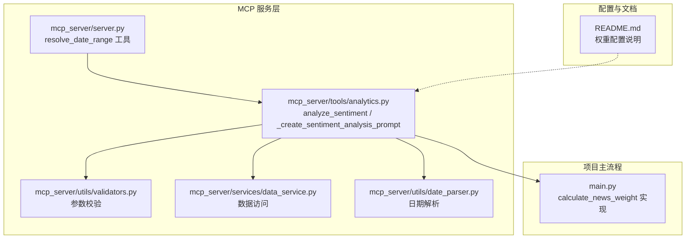
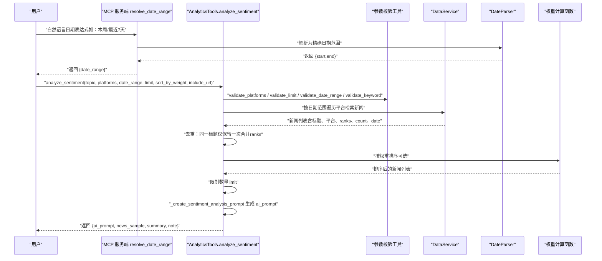
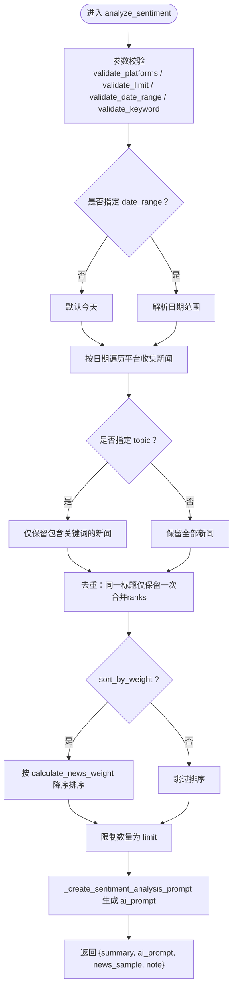
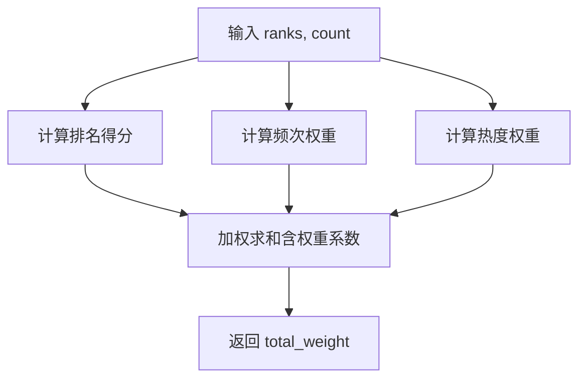
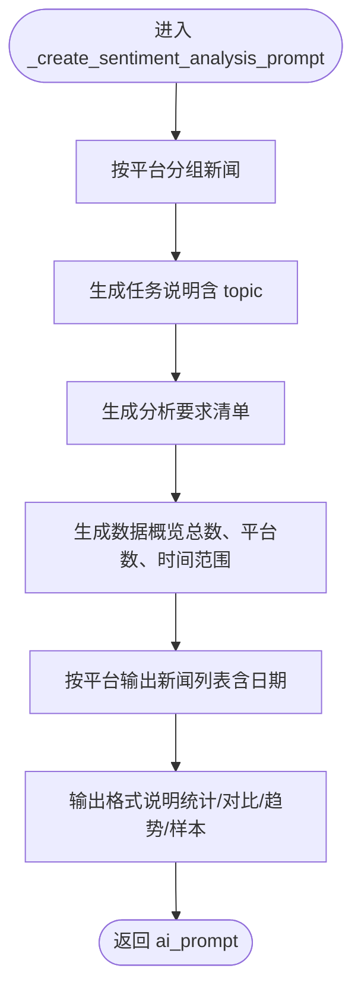
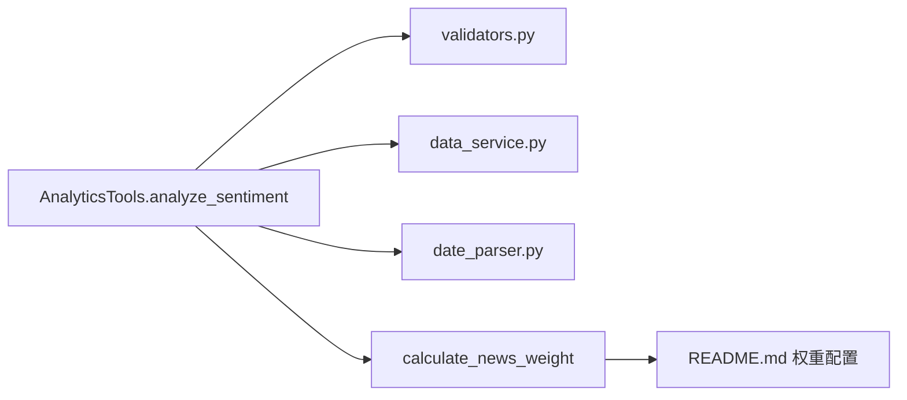

# 情感分析与AI提示生成

<cite>
**本文引用的文件**
- [mcp_server/tools/analytics.py](file://mcp_server/tools/analytics.py)
- [mcp_server/utils/validators.py](file://mcp_server/utils/validators.py)
- [mcp_server/services/data_service.py](file://mcp_server/services/data_service.py)
- [mcp_server/utils/date_parser.py](file://mcp_server/utils/date_parser.py)
- [mcp_server/server.py](file://mcp_server/server.py)
- [main.py](file://main.py)
- [README.md](file://README.md)
</cite>

## 目录
1. [简介](#简介)
2. [项目结构](#项目结构)
3. [核心组件](#核心组件)
4. [架构总览](#架构总览)
5. [详细组件分析](#详细组件分析)
6. [依赖关系分析](#依赖关系分析)
7. [性能考量](#性能考量)
8. [故障排查指南](#故障排查指南)
9. [结论](#结论)
10. [附录](#附录)

## 简介
本文件围绕情感分析功能，系统性说明 analyze_sentiment 方法如何为 AI 情感分析准备结构化输入。文档重点覆盖以下方面：
- 如何根据话题、平台、日期范围等条件筛选新闻条目；
- 如何通过 calculate_news_weight 函数按权重排序，确保高价值内容优先；
- 去重机制如何避免同一标题在多平台或多天重复计入；
- _create_sentiment_analysis_prompt 内部如何构造优化的自然语言提示词，包含新闻标题、来源、时间等上下文信息；
- 参数使用建议（limit、sort_by_weight、include_url）；
- 返回结果中 ai_prompt 字段的实际用途及调用 AI 服务的最佳实践。

## 项目结构
情感分析能力位于 MCP 服务侧的高级分析工具模块中，核心文件如下：
- mcp_server/tools/analytics.py：高级分析工具集合，包含 analyze_sentiment 与 _create_sentiment_analysis_prompt 等；
- mcp_server/utils/validators.py：参数校验工具，负责平台、日期范围、关键词、数量限制等；
- mcp_server/services/data_service.py：数据访问层，提供按日期、平台、关键词检索新闻的能力；
- mcp_server/utils/date_parser.py：日期解析与范围计算工具，支持“本周”、“最近7天”等自然语言表达；
- mcp_server/server.py：MCP 服务入口，提供 resolve_date_range 工具，用于将自然语言日期转换为精确日期范围；
- main.py：项目主流程与权重计算实现（与前端展示相关），其中包含 calculate_news_weight 的实现；
- README.md：配置与权重调整说明，帮助理解权重配置对排序的影响。

图表来源
- [mcp_server/server.py](file://mcp_server/server.py#L49-L108)
- [mcp_server/tools/analytics.py](file://mcp_server/tools/analytics.py#L631-L802)
- [mcp_server/utils/validators.py](file://mcp_server/utils/validators.py#L145-L209)
- [mcp_server/services/data_service.py](file://mcp_server/services/data_service.py#L184-L283)
- [mcp_server/utils/date_parser.py](file://mcp_server/utils/date_parser.py#L330-L423)
- [main.py](file://main.py#L1137-L1170)
- [README.md](file://README.md#L1910-L1952)

章节来源
- [mcp_server/tools/analytics.py](file://mcp_server/tools/analytics.py#L631-L802)
- [mcp_server/utils/validators.py](file://mcp_server/utils/validators.py#L145-L209)
- [mcp_server/services/data_service.py](file://mcp_server/services/data_service.py#L184-L283)
- [mcp_server/utils/date_parser.py](file://mcp_server/utils/date_parser.py#L330-L423)
- [mcp_server/server.py](file://mcp_server/server.py#L49-L108)
- [main.py](file://main.py#L1137-L1170)
- [README.md](file://README.md#L1910-L1952)

## 核心组件
- analyze_sentiment：面向情感分析的主入口，负责参数校验、数据筛选、去重、权重排序、限制数量与提示词生成。
- calculate_news_weight：权重计算函数，综合排名、频次与热度，用于排序与筛选高价值内容。
- _create_sentiment_analysis_prompt：构建用于 AI 情感分析的自然语言提示词，包含任务说明、分析要求、数据概览、平台分类列表与输出格式说明。
- 参数校验工具：validate_platforms、validate_limit、validate_date_range、validate_keyword 等，保证输入合法与边界安全。
- 数据服务：DataService.search_news_by_keyword、get_news_by_date 等，提供按关键词、日期、平台的新闻检索。
- 日期解析与范围：DateParser.resolve_date_range_expression，将自然语言日期转换为精确日期范围；MCP 服务端 resolve_date_range 工具提供统一入口。

章节来源
- [mcp_server/tools/analytics.py](file://mcp_server/tools/analytics.py#L631-L802)
- [mcp_server/tools/analytics.py](file://mcp_server/tools/analytics.py#L818-L908)
- [mcp_server/utils/validators.py](file://mcp_server/utils/validators.py#L43-L87)
- [mcp_server/utils/validators.py](file://mcp_server/utils/validators.py#L90-L121)
- [mcp_server/utils/validators.py](file://mcp_server/utils/validators.py#L145-L209)
- [mcp_server/utils/validators.py](file://mcp_server/utils/validators.py#L212-L242)
- [mcp_server/services/data_service.py](file://mcp_server/services/data_service.py#L184-L283)
- [mcp_server/utils/date_parser.py](file://mcp_server/utils/date_parser.py#L330-L423)
- [mcp_server/server.py](file://mcp_server/server.py#L49-L108)

## 架构总览
情感分析工作流从用户输入开始，经过参数校验、日期范围解析、数据检索、去重与排序，最终生成结构化的 AI 提示词。

图表来源
- [mcp_server/server.py](file://mcp_server/server.py#L49-L108)
- [mcp_server/tools/analytics.py](file://mcp_server/tools/analytics.py#L631-L802)
- [mcp_server/utils/validators.py](file://mcp_server/utils/validators.py#L43-L87)
- [mcp_server/utils/validators.py](file://mcp_server/utils/validators.py#L90-L121)
- [mcp_server/utils/validators.py](file://mcp_server/utils/validators.py#L145-L209)
- [mcp_server/utils/validators.py](file://mcp_server/utils/validators.py#L212-L242)
- [mcp_server/services/data_service.py](file://mcp_server/services/data_service.py#L184-L283)
- [mcp_server/utils/date_parser.py](file://mcp_server/utils/date_parser.py#L330-L423)
- [mcp_server/tools/analytics.py](file://mcp_server/tools/analytics.py#L818-L908)

## 详细组件分析

### analyze_sentiment 方法
- 输入参数
  - topic：可选话题关键词，用于筛选包含该关键词的新闻；
  - platforms：可选平台过滤列表；
  - date_range：可选日期范围 {"start":"YYYY-MM-DD","end":"YYYY-MM-DD"}；
  - limit：返回新闻数量上限（默认50，最大100）；
  - sort_by_weight：是否按权重排序（默认True，推荐开启）；
  - include_url：是否包含URL链接（默认False，节省token）。
- 参数校验
  - 使用 validate_platforms、validate_limit、validate_date_range、validate_keyword 进行严格校验。
- 数据检索
  - 若未指定 date_range，默认查询今天；
  - 支持多天遍历，按平台过滤，按 topic 关键词筛选；
  - 收集标题、平台、ranks、count、date 等字段，条件性添加 URL。
- 去重与合并
  - 以 "平台::标题" 为键去重，若同一标题在多天出现，合并 ranks 并更新 count。
- 排序与限制
  - 若 sort_by_weight 为真，按 calculate_news_weight 降序排序；
  - 限制返回数量为 limit。
- 提示词生成
  - 调用 _create_sentiment_analysis_prompt 生成 ai_prompt；
  - 返回结构化结果，包含 summary（总数、返回数、去重数、主题、时间范围、平台、排序方式）、ai_prompt、news_sample、note（提示信息）。

图表来源
- [mcp_server/tools/analytics.py](file://mcp_server/tools/analytics.py#L631-L802)
- [mcp_server/utils/validators.py](file://mcp_server/utils/validators.py#L43-L87)
- [mcp_server/utils/validators.py](file://mcp_server/utils/validators.py#L90-L121)
- [mcp_server/utils/validators.py](file://mcp_server/utils/validators.py#L145-L209)
- [mcp_server/utils/validators.py](file://mcp_server/utils/validators.py#L212-L242)

章节来源
- [mcp_server/tools/analytics.py](file://mcp_server/tools/analytics.py#L631-L802)

### calculate_news_weight 权重计算
- 计算依据
  - 排名权重：Σ(11 - min(rank, 10)) / 出现次数；
  - 频次权重：min(出现次数, 10) × 10；
  - 热度权重：高排名次数 / 总出现次数 × 100；
  - 综合权重 = 排名权重×权重系数 + 频次权重×权重系数 + 热度权重×权重系数。
- 权重系数
  - 默认权重系数来自配置（rank_weight=0.6、frequency_weight=0.3、hotness_weight=0.1）；
  - README 提供了两种典型场景的权重调整建议，可根据业务目标微调。

图表来源
- [mcp_server/tools/analytics.py](file://mcp_server/tools/analytics.py#L24-L74)
- [main.py](file://main.py#L1137-L1170)
- [README.md](file://README.md#L1910-L1952)

章节来源
- [mcp_server/tools/analytics.py](file://mcp_server/tools/analytics.py#L24-L74)
- [main.py](file://main.py#L1137-L1170)
- [README.md](file://README.md#L1910-L1952)

### 去重机制
- 去重键：平台::标题；
- 合并策略：若同一标题在多天出现，合并 ranks 并更新 count；
- 结果：去重后按权重排序，再限制数量，确保高价值内容优先且避免重复。

章节来源
- [mcp_server/tools/analytics.py](file://mcp_server/tools/analytics.py#L742-L754)

### _create_sentiment_analysis_prompt 提示词构造
- 任务说明：根据是否指定 topic，生成关于该话题或通用新闻标题的情感倾向分析任务说明；
- 分析要求：识别每条新闻的情感倾向（正面/负面/中性），统计分布与百分比，分析平台差异，总结整体趋势，列举典型样本；
- 数据概览：总新闻数、覆盖平台数、时间范围；
- 平台分类：按平台分组展示新闻，标注日期（若存在）；
- 输出格式：明确要求输出情感分布统计、平台对比、整体趋势与典型样本。

图表来源
- [mcp_server/tools/analytics.py](file://mcp_server/tools/analytics.py#L818-L908)

章节来源
- [mcp_server/tools/analytics.py](file://mcp_server/tools/analytics.py#L818-L908)

### 参数使用建议
- limit：默认50，最大100；若需更少样本，可适当降低；若返回数量少于请求，可能由去重或数据不足导致。
- sort_by_weight：强烈建议开启，以确保高价值内容优先。
- include_url：默认关闭以节省 token；若需要 AI 结合链接进行深入分析，可开启，但会增加 token 消耗。

章节来源
- [mcp_server/tools/analytics.py](file://mcp_server/tools/analytics.py#L631-L653)

### ai_prompt 字段用途与最佳实践
- ai_prompt 字段包含结构化提示词，直接发送给 AI 模型进行情感分析；
- 建议：
  - 将 ai_prompt 作为系统提示词（system prompt）或用户消息（user message）的一部分；
  - 若模型支持，可在提示词中加入“请严格遵循输出格式”等约束；
  - 对于长文本，可考虑分批发送或截断高价值新闻列表；
  - 结合 include_url 与平台维度，提升情感分析的上下文质量。

章节来源
- [mcp_server/tools/analytics.py](file://mcp_server/tools/analytics.py#L766-L771)
- [mcp_server/tools/analytics.py](file://mcp_server/tools/analytics.py#L818-L908)

## 依赖关系分析
- analyze_sentiment 依赖：
  - 参数校验工具（validators）；
  - 数据服务（DataService）按日期与平台检索新闻；
  - 日期解析（DateParser）与 MCP 服务端 resolve_date_range 工具；
  - 权重计算函数（calculate_news_weight）。
- 权重计算函数：
  - 与 README 中权重配置保持一致，支持场景化调整。

图表来源
- [mcp_server/tools/analytics.py](file://mcp_server/tools/analytics.py#L631-L802)
- [mcp_server/utils/validators.py](file://mcp_server/utils/validators.py#L145-L209)
- [mcp_server/services/data_service.py](file://mcp_server/services/data_service.py#L184-L283)
- [mcp_server/utils/date_parser.py](file://mcp_server/utils/date_parser.py#L330-L423)
- [README.md](file://README.md#L1910-L1952)

章节来源
- [mcp_server/tools/analytics.py](file://mcp_server/tools/analytics.py#L631-L802)
- [mcp_server/utils/validators.py](file://mcp_server/utils/validators.py#L145-L209)
- [mcp_server/services/data_service.py](file://mcp_server/services/data_service.py#L184-L283)
- [mcp_server/utils/date_parser.py](file://mcp_server/utils/date_parser.py#L330-L423)
- [README.md](file://README.md#L1910-L1952)

## 性能考量
- 去重与合并 ranks：在多天数据中合并相同标题，减少重复计算与重复展示；
- 权重排序：通过 calculate_news_weight 将高价值内容前置，降低后续处理成本；
- 限制数量：通过 limit 控制输出规模，避免超长提示词导致 token 消耗过高；
- URL 选项：默认关闭 include_url，减少 token 消耗，必要时再开启；
- 日期范围：使用 resolve_date_range 将自然语言日期转换为精确范围，避免 AI 自行计算带来的不确定性与误差。

章节来源
- [mcp_server/tools/analytics.py](file://mcp_server/tools/analytics.py#L742-L765)
- [mcp_server/tools/analytics.py](file://mcp_server/tools/analytics.py#L766-L771)
- [mcp_server/server.py](file://mcp_server/server.py#L49-L108)

## 故障排查指南
- 日期范围错误
  - 现象：提示“开始日期不能晚于结束日期”或“不允许查询未来日期”；
  - 处理：使用 resolve_date_range 工具获取精确日期范围，或检查 validate_date_range 的输入格式。
- 平台不支持
  - 现象：提示“不支持的平台”；
  - 处理：确认平台 ID 是否在 config.yaml 的 platforms 配置中。
- 关键词非法
  - 现象：提示“keyword 不能为空/长度超限”；
  - 处理：确保关键词非空且长度不超过 100。
- 无匹配新闻
  - 现象：抛出 DataNotFoundError；
  - 处理：调整 topic、date_range 或 platforms，或确认数据可用范围。

章节来源
- [mcp_server/utils/validators.py](file://mcp_server/utils/validators.py#L145-L209)
- [mcp_server/utils/validators.py](file://mcp_server/utils/validators.py#L43-L87)
- [mcp_server/utils/validators.py](file://mcp_server/utils/validators.py#L212-L242)
- [mcp_server/tools/analytics.py](file://mcp_server/tools/analytics.py#L735-L740)

## 结论
analyze_sentiment 方法通过严格的参数校验、灵活的日期范围解析、高效的去重与权重排序，最终生成高质量的 AI 提示词，为情感分析提供结构化输入。结合 README 的权重配置建议与 resolve_date_range 的统一日期处理，能够显著提升情感分析的一致性与准确性。建议在生产环境中默认开启 sort_by_weight、关闭 include_url，按需调整 limit，并在需要时开启 include_url 以增强上下文。

## 附录
- 自然语言日期解析与范围
  - 使用 resolve_date_range 工具将“本周”“最近7天”等表达转换为精确日期范围；
  - DateParser.resolve_date_range_expression 支持中文与英文表达式，涵盖单日、周、月、最近N天等。
- 权重配置与场景
  - README 提供了“实时热点型”和“深度话题型”的权重调整建议，可根据业务目标进行微调。

章节来源
- [mcp_server/server.py](file://mcp_server/server.py#L49-L108)
- [mcp_server/utils/date_parser.py](file://mcp_server/utils/date_parser.py#L330-L423)
- [README.md](file://README.md#L1910-L1952)