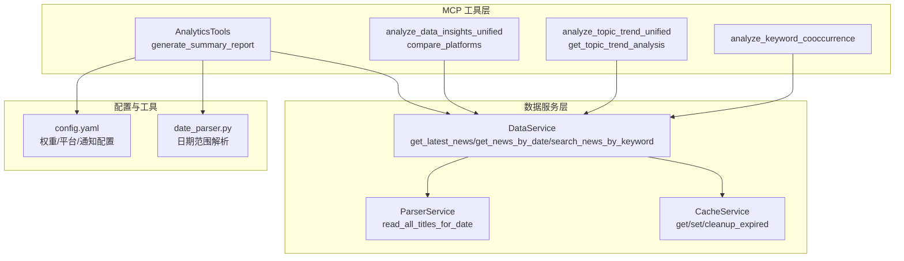
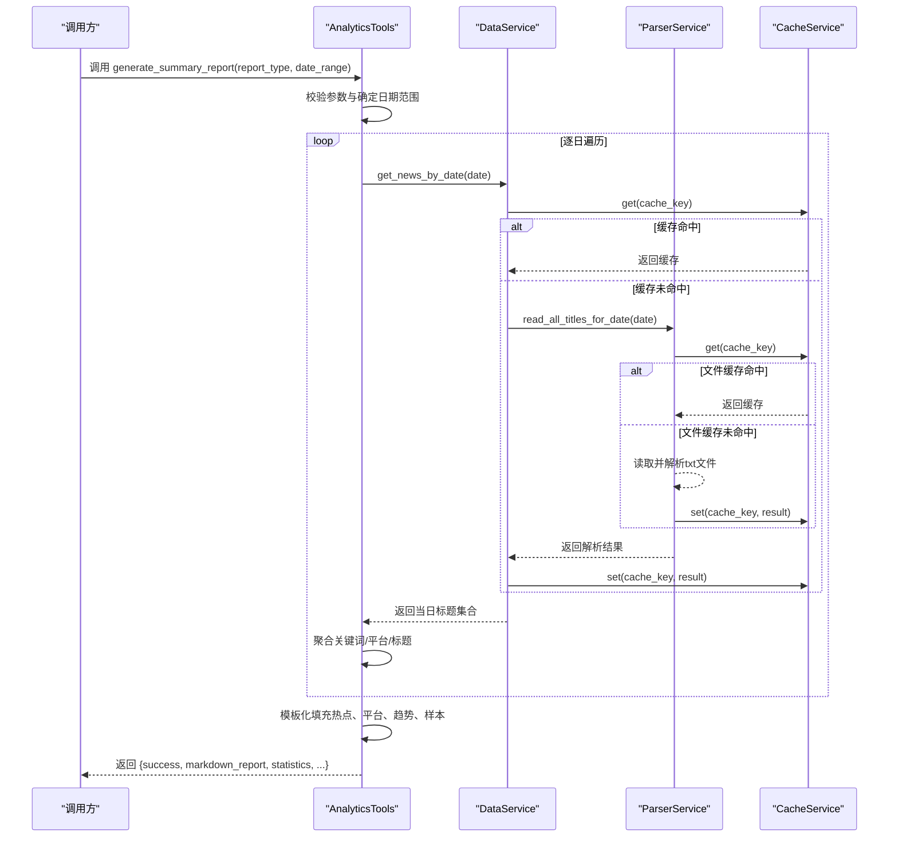
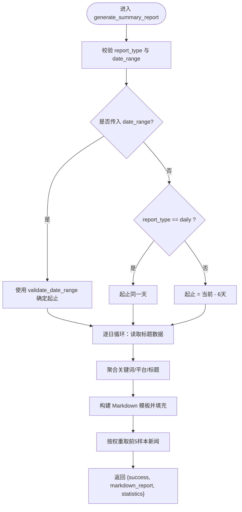
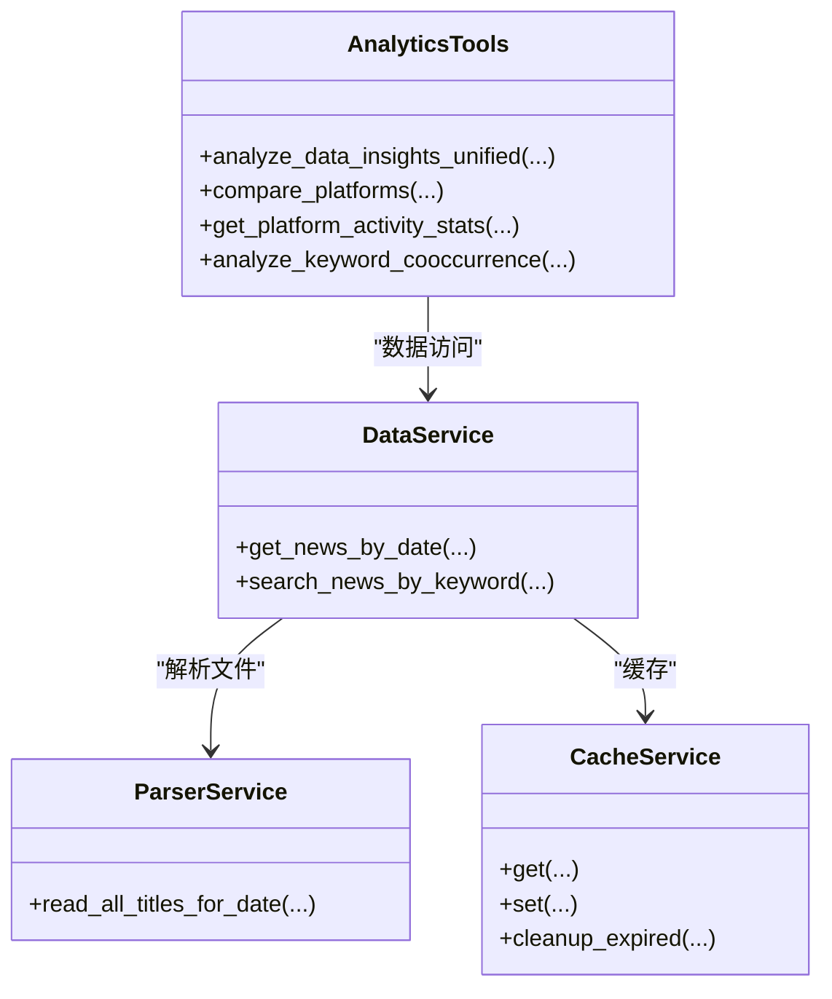
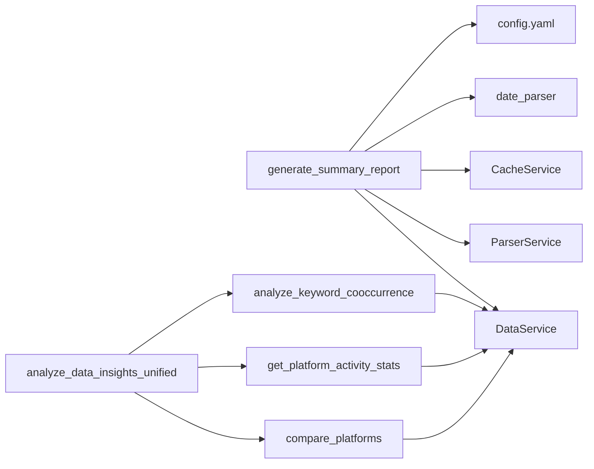

# 摘要报告生成

<cite>
**本文引用的文件**
- [main.py](file://main.py)
- [analytics.py](file://mcp_server/tools/analytics.py)
- [data_service.py](file://mcp_server/services/data_service.py)
- [parser_service.py](file://mcp_server/services/parser_service.py)
- [cache_service.py](file://mcp_server/services/cache_service.py)
- [date_parser.py](file://mcp_server/utils/date_parser.py)
- [config.yaml](file://config/config.yaml)
</cite>

## 目录
1. [简介](#简介)
2. [项目结构](#项目结构)
3. [核心组件](#核心组件)
4. [架构总览](#架构总览)
5. [详细组件分析](#详细组件分析)
6. [依赖关系分析](#依赖关系分析)
7. [性能考量](#性能考量)
8. [故障排查指南](#故障排查指南)
9. [结论](#结论)
10. [附录](#附录)

## 简介
本文件围绕“摘要报告生成”能力展开，聚焦于 generate_summary_report 方法如何整合多维度分析结果，生成可读性强的自然语言摘要。文档将详细说明该方法如何聚合热点话题、趋势变化、平台表现与关键词共现等信息，利用模板化语言与数据填充技术生成结构化报告；解释报告的时间范围适配逻辑、关键指标选取原则以及多平台对比的表述策略；并给出报告输出格式（Markdown）、自定义模板扩展机制与性能考量（缓存策略），最后结合实际应用场景，展示如何将此功能集成到自动化推送流程中。

## 项目结构
- 报告生成位于 MCP 工具层，核心入口为 mcp_server/tools/analytics.py 中的 generate_summary_report 方法。
- 数据访问与缓存由 mcp_server/services/data_service.py 与 mcp_server/services/cache_service.py 提供。
- 文件解析与日期范围解析分别由 mcp_server/services/parser_service.py 与 mcp_server/utils/date_parser.py 实现。
- 配置项（如权重、平台列表、通知渠道等）来自 config/config.yaml。

图表来源
- [analytics.py](file://mcp_server/tools/analytics.py#L1158-L1336)
- [data_service.py](file://mcp_server/services/data_service.py#L1-L200)
- [parser_service.py](file://mcp_server/services/parser_service.py#L160-L260)
- [cache_service.py](file://mcp_server/services/cache_service.py#L1-L137)
- [date_parser.py](file://mcp_server/utils/date_parser.py#L330-L491)
- [config.yaml](file://config/config.yaml#L110-L140)

章节来源
- [analytics.py](file://mcp_server/tools/analytics.py#L1158-L1336)
- [data_service.py](file://mcp_server/services/data_service.py#L1-L200)
- [parser_service.py](file://mcp_server/services/parser_service.py#L160-L260)
- [cache_service.py](file://mcp_server/services/cache_service.py#L1-L137)
- [date_parser.py](file://mcp_server/utils/date_parser.py#L330-L491)
- [config.yaml](file://config/config.yaml#L110-L140)

## 核心组件
- generate_summary_report：生成每日/每周摘要报告，聚合热点、平台、趋势与共现信息，输出 Markdown 报告。
- analyze_data_insights_unified：统一数据洞察入口，支持平台对比、平台活跃度、关键词共现三种模式。
- analyze_topic_trend_unified：统一话题趋势分析入口，支持趋势、生命周期、异常检测、预测四种模式。
- DataService：统一数据访问接口，封装缓存与解析逻辑。
- ParserService：读取指定日期的标题数据，支持缓存与平台过滤。
- CacheService：TTL 缓存，提升数据访问性能。
- date_parser：日期范围解析，支持自然语言表达式与校验。

章节来源
- [analytics.py](file://mcp_server/tools/analytics.py#L1158-L1336)
- [analytics.py](file://mcp_server/tools/analytics.py#L90-L155)
- [analytics.py](file://mcp_server/tools/analytics.py#L156-L243)
- [data_service.py](file://mcp_server/services/data_service.py#L1-L200)
- [parser_service.py](file://mcp_server/services/parser_service.py#L160-L260)
- [cache_service.py](file://mcp_server/services/cache_service.py#L1-L137)
- [date_parser.py](file://mcp_server/utils/date_parser.py#L330-L491)

## 架构总览
generate_summary_report 的执行路径如下：
- 输入：report_type（daily/weekly）、date_range（可选）
- 参数校验与日期范围确定
- 逐日读取标题数据，聚合关键词、平台、标题集合
- 生成 Markdown 模板化内容，填充统计与样本
- 返回结构化结果（包含 markdown_report、statistics 等）

图表来源
- [analytics.py](file://mcp_server/tools/analytics.py#L1158-L1336)
- [data_service.py](file://mcp_server/services/data_service.py#L104-L182)
- [parser_service.py](file://mcp_server/services/parser_service.py#L160-L260)
- [cache_service.py](file://mcp_server/services/cache_service.py#L1-L137)

## 详细组件分析

### generate_summary_report 方法详解
- 功能定位：生成每日/每周摘要报告，聚合关键词、平台、趋势与样本新闻，输出 Markdown。
- 时间范围适配：
  - 若传入 date_range，使用 validate_date_range 校验并确定起止日期；
  - 若未传入且 report_type 为 daily，则起止同一天；
  - 若 report_type 为 weekly，则起止为当前日期前推6天。
- 数据采集：
  - 逐日调用 read_all_titles_for_date，聚合 all_keywords、all_platforms_news、all_titles_list。
  - 通过 Counter 与 defaultdict 统计词频、平台新闻数。
- 模板化填充：
  - 生成头部统计（总新闻数、覆盖平台、热门关键词数）；
  - TOP 10 热门话题；
  - 平台活跃度（按平台新闻数排序）；
  - 周报趋势分析（对前5关键词做“持续热门”描述）；
  - 精选新闻样本（按标题权重排序取前5条，确保确定性）。
- 输出：
  - 返回结构化字典，包含 success、markdown_report、statistics 等字段。

图表来源
- [analytics.py](file://mcp_server/tools/analytics.py#L1158-L1336)

章节来源
- [analytics.py](file://mcp_server/tools/analytics.py#L1158-L1336)

### analyze_data_insights_unified：多维度对比与共现
- 平台对比 compare_platforms：按日期范围统计各平台总新闻、话题提及数、唯一标题数、覆盖率、Top 关键词，并识别各平台独有热点。
- 平台活跃度 get_platform_activity_stats：统计各平台总更新次数、新闻数、活跃天数、日均新闻数、最活跃时段。
- 关键词共现 analyze_keyword_cooccurrence：提取标题关键词，统计两两共现频次，过滤低频，返回 Top N 共现对及样本标题。

图表来源
- [analytics.py](file://mcp_server/tools/analytics.py#L90-L155)
- [analytics.py](file://mcp_server/tools/analytics.py#L402-L524)
- [analytics.py](file://mcp_server/tools/analytics.py#L1338-L1450)
- [analytics.py](file://mcp_server/tools/analytics.py#L526-L630)
- [data_service.py](file://mcp_server/services/data_service.py#L104-L182)
- [parser_service.py](file://mcp_server/services/parser_service.py#L160-L260)
- [cache_service.py](file://mcp_server/services/cache_service.py#L1-L137)

章节来源
- [analytics.py](file://mcp_server/tools/analytics.py#L90-L155)
- [analytics.py](file://mcp_server/tools/analytics.py#L402-L524)
- [analytics.py](file://mcp_server/tools/analytics.py#L1338-L1450)
- [analytics.py](file://mcp_server/tools/analytics.py#L526-L630)
- [data_service.py](file://mcp_server/services/data_service.py#L104-L182)
- [parser_service.py](file://mcp_server/services/parser_service.py#L160-L260)
- [cache_service.py](file://mcp_server/services/cache_service.py#L1-L137)

### analyze_topic_trend_unified：趋势与生命周期
- 趋势分析 get_topic_trend_analysis：按日统计关键词出现次数，计算总提及、均值、峰值、峰值时间、涨跌率，输出趋势方向。
- 生命周期 analyze_topic_lifecycle：计算首次/最后出现、峰值、活跃天数、平均日提及、生命周期阶段与话题类型。
- 异常检测 detect_viral_topics：比较今日与昨日关键词频率，计算增长倍数，识别爆火话题。
- 趋势预测 predict_trending_topics：基于最近3天关键词趋势，计算增长率与置信度，筛选上升趋势话题。

章节来源
- [analytics.py](file://mcp_server/tools/analytics.py#L244-L401)
- [analytics.py](file://mcp_server/tools/analytics.py#L1465-L1621)
- [analytics.py](file://mcp_server/tools/analytics.py#L1623-L1757)
- [analytics.py](file://mcp_server/tools/analytics.py#L1759-L1906)

### 数据访问与缓存策略
- DataService：
  - get_latest_news：获取最新新闻，按排名排序，支持 include_url，15分钟缓存。
  - get_news_by_date：按日期获取新闻，支持平台过滤与 include_url，30分钟缓存。
  - search_news_by_keyword：按关键词搜索，支持日期范围与平台过滤。
  - get_trending_topics：基于关注词列表统计词频，30分钟缓存。
  - get_current_config：读取配置并缓存，1小时缓存。
- ParserService：
  - read_all_titles_for_date：读取指定日期的 txt 文件，合并标题并缓存；今日缓存15分钟，历史缓存1小时。
- CacheService：
  - TTL 缓存，支持清理过期条目与统计信息。

章节来源
- [data_service.py](file://mcp_server/services/data_service.py#L1-L200)
- [data_service.py](file://mcp_server/services/data_service.py#L285-L401)
- [parser_service.py](file://mcp_server/services/parser_service.py#L160-L260)
- [cache_service.py](file://mcp_server/services/cache_service.py#L1-L137)

### 时间范围适配与日期解析
- generate_summary_report：
  - 若传入 date_range，使用 validate_date_range 校验；
  - 若未传入：daily 为当天；weekly 为当前日期前推6天。
- date_parser：
  - 支持“今天/昨天/最近N天/本周/上周/本月/上月”等自然语言表达式；
  - 提供 resolve_date_range_expression 将表达式标准化为起止日期。

章节来源
- [analytics.py](file://mcp_server/tools/analytics.py#L1158-L1215)
- [date_parser.py](file://mcp_server/utils/date_parser.py#L330-L491)

## 依赖关系分析
- generate_summary_report 依赖：
  - DataService：按日期读取标题数据；
  - ParserService：解析 txt 文件；
  - CacheService：缓存文件与查询结果；
  - date_parser：日期范围解析；
  - config.yaml：权重与平台配置（用于权重计算与平台名称映射）。
- analyze_data_insights_unified 依赖：
  - compare_platforms：平台对比；
  - get_platform_activity_stats：平台活跃度；
  - analyze_keyword_cooccurrence：关键词共现；
  - DataService：统一数据访问。

图表来源
- [analytics.py](file://mcp_server/tools/analytics.py#L1158-L1336)
- [analytics.py](file://mcp_server/tools/analytics.py#L90-L155)
- [data_service.py](file://mcp_server/services/data_service.py#L1-L200)
- [parser_service.py](file://mcp_server/services/parser_service.py#L160-L260)
- [cache_service.py](file://mcp_server/services/cache_service.py#L1-L137)
- [date_parser.py](file://mcp_server/utils/date_parser.py#L330-L491)
- [config.yaml](file://config/config.yaml#L110-L140)

## 性能考量
- 缓存策略：
  - ParserService.read_all_titles_for_date：今日缓存15分钟，历史缓存1小时，减少磁盘IO与解析开销。
  - DataService.get_latest_news/get_news_by_date：15/30分钟缓存，降低重复查询成本。
  - CacheService.cleanup_expired：定期清理过期缓存，维持内存占用可控。
- 数据聚合复杂度：
  - generate_summary_report 逐日遍历，使用 Counter 与 defaultdict，时间复杂度 O(N)（N 为标题总数）。
- 输出格式：
  - Markdown 报告体积可控，适合通过通知渠道分批发送；若需 HTML，可参考主程序中的 HTML 报告生成逻辑。

章节来源
- [parser_service.py](file://mcp_server/services/parser_service.py#L160-L260)
- [data_service.py](file://mcp_server/services/data_service.py#L1-L200)
- [cache_service.py](file://mcp_server/services/cache_service.py#L1-L137)
- [main.py](file://main.py#L1897-L1941)

## 故障排查指南
- 日期范围错误：
  - 使用 date_parser.resolve_date_range_expression 校验表达式，确保“最近N天/本周/上周/本月/上月”等表达式合法。
- 数据缺失：
  - ParserService.read_all_titles_for_date 在目录或文件不存在时抛出 DataNotFoundError，检查 output 目录与日期文件夹是否存在。
- 缓存命中异常：
  - CacheService.get_stats 可查看缓存条目数量与最老/ newest 条目年龄，辅助定位缓存失效问题。
- 配置不生效：
  - config.yaml 中的权重与平台配置会影响权重计算与平台名称映射，确认权重与平台列表配置正确。

章节来源
- [date_parser.py](file://mcp_server/utils/date_parser.py#L330-L491)
- [parser_service.py](file://mcp_server/services/parser_service.py#L160-L260)
- [cache_service.py](file://mcp_server/services/cache_service.py#L101-L137)
- [config.yaml](file://config/config.yaml#L110-L140)

## 结论
generate_summary_report 通过“逐日聚合 + 模板化填充”的方式，将热点话题、平台表现、趋势变化与关键词共现等多维信息整合为可读性强的 Markdown 报告。其时间范围适配灵活，关键指标选取合理，且内置缓存与解析优化，具备良好的性能与可维护性。结合通知渠道与自动化流程，可稳定地输出高质量摘要报告，满足日常监控与决策需求。

## 附录

### 报告输出格式与扩展
- 输出格式：Markdown（结构化字典包含 markdown_report 字段），便于在各类通知渠道渲染。
- 扩展机制：可在 generate_summary_report 中增加新的统计模块或模板片段，例如新增“情感倾向摘要”、“事件关联图谱”等，只需在聚合阶段补充数据并在模板中填充即可。

章节来源
- [analytics.py](file://mcp_server/tools/analytics.py#L1158-L1336)

### 关键指标选取原则
- 热点话题：基于关键词出现频次（Counter），取 TOP 10。
- 平台表现：基于平台新闻数排序，辅以覆盖率与唯一标题数。
- 趋势变化：基于日频统计，计算峰值、均值与涨跌率，标注趋势方向。
- 关键词共现：基于两两共现计数，过滤低频，取 Top N。

章节来源
- [analytics.py](file://mcp_server/tools/analytics.py#L1158-L1336)
- [analytics.py](file://mcp_server/tools/analytics.py#L402-L524)
- [analytics.py](file://mcp_server/tools/analytics.py#L526-L630)

### 多平台对比表述策略
- 使用“覆盖率”“Top 关键词”“最活跃时段”等客观指标进行对比；
- 识别“独有热点”，突出平台特色；
- 对比结果按关键指标排序，确保结论清晰可读。

章节来源
- [analytics.py](file://mcp_server/tools/analytics.py#L402-L524)
- [analytics.py](file://mcp_server/tools/analytics.py#L1338-L1450)

### 自动化推送集成建议
- 触发条件：定时任务（如每小时/每日）或事件触发（如检测到爆火话题）。
- 流程要点：
  - 调用 generate_summary_report 获取 markdown_report；
  - 通过通知渠道（飞书/钉钉/企业微信/Telegram/Slack/Email/ntfy/Bark）发送；
  - 若为每日汇总，可同时生成 HTML 报告并写入根目录以便静态页面访问。
- 主程序中的 HTML 报告生成与通知发送逻辑可作为参考，便于统一风格与格式。

章节来源
- [main.py](file://main.py#L1897-L1941)
- [main.py](file://main.py#L4111-L4126)
- [main.py](file://main.py#L4423-L4450)