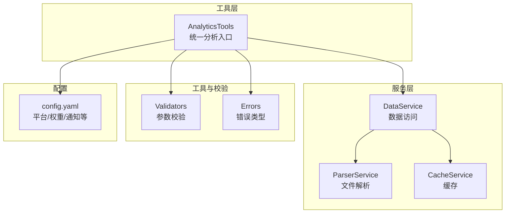
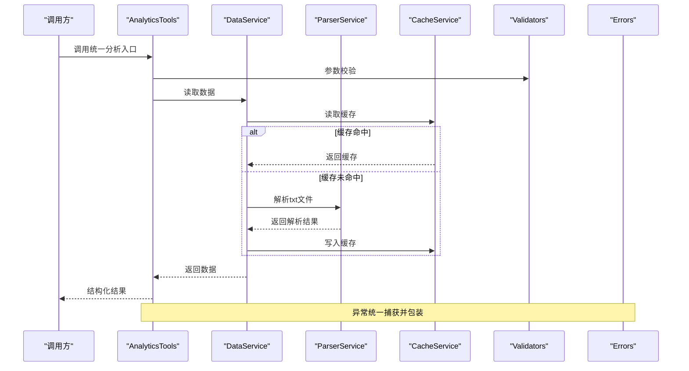
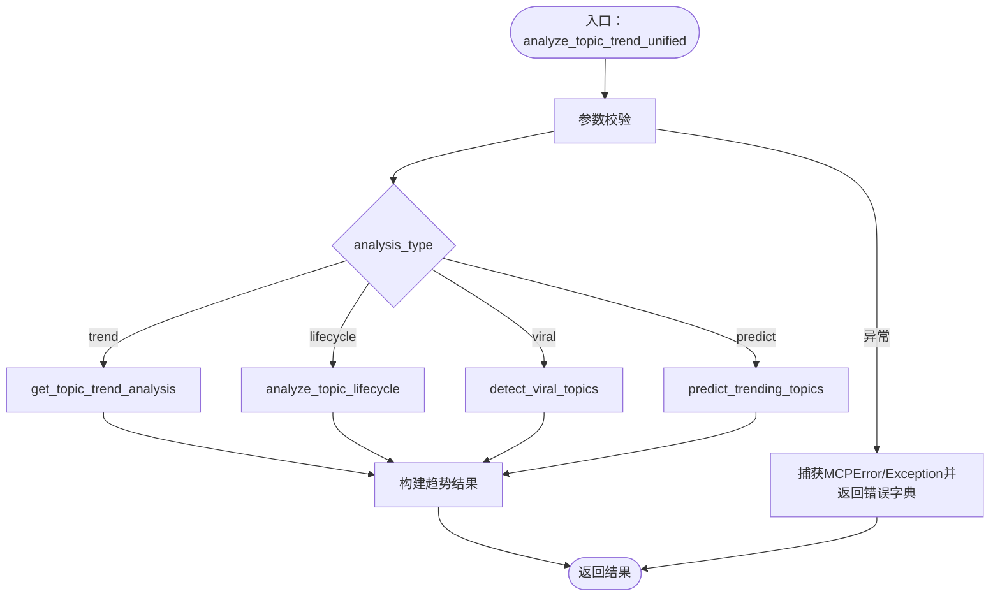
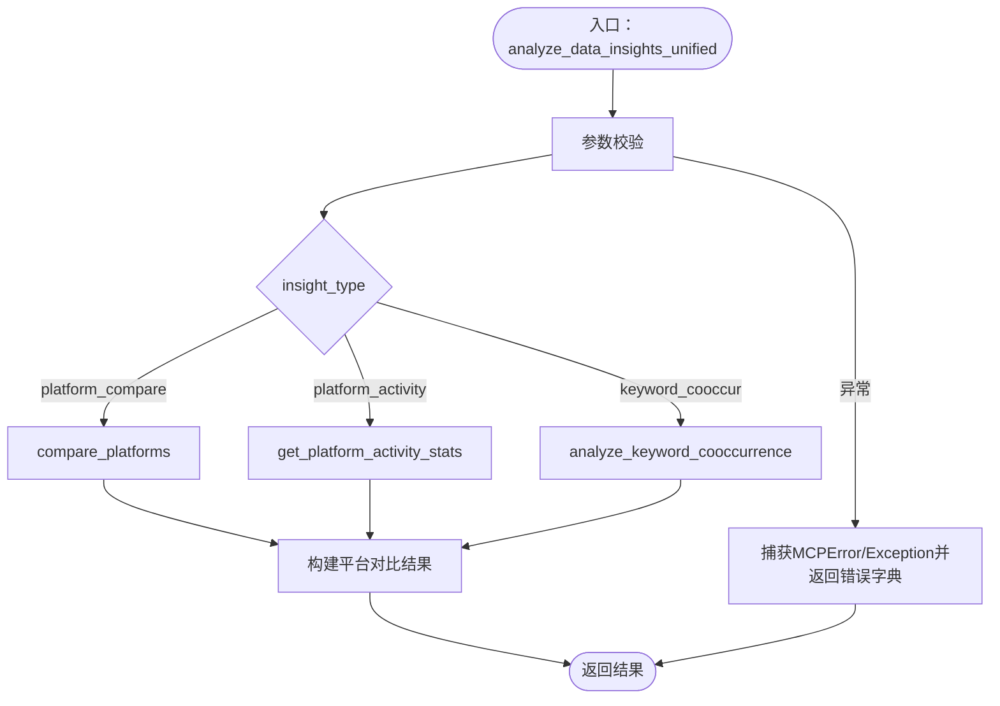
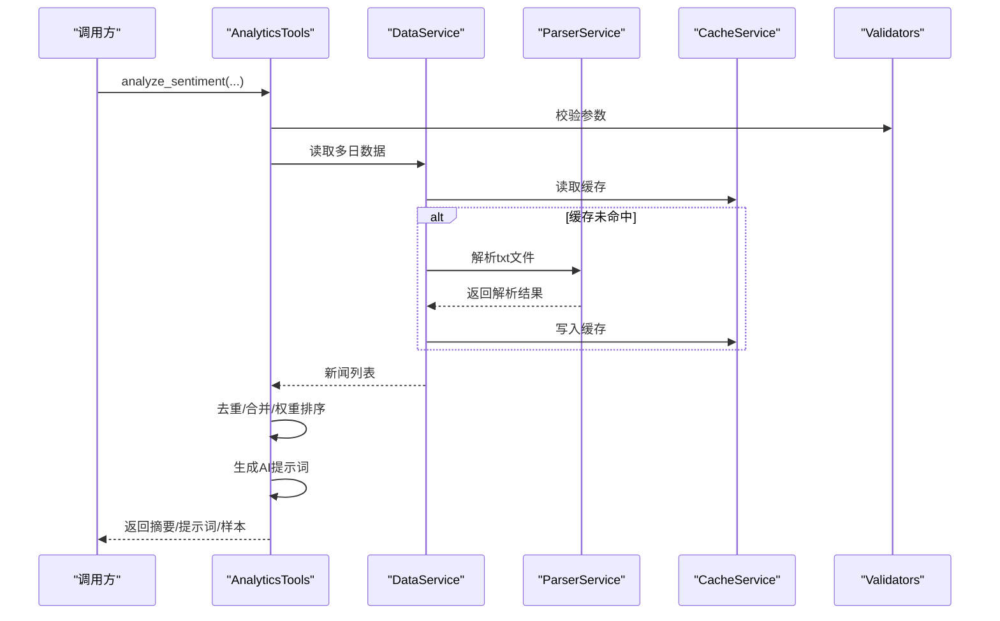
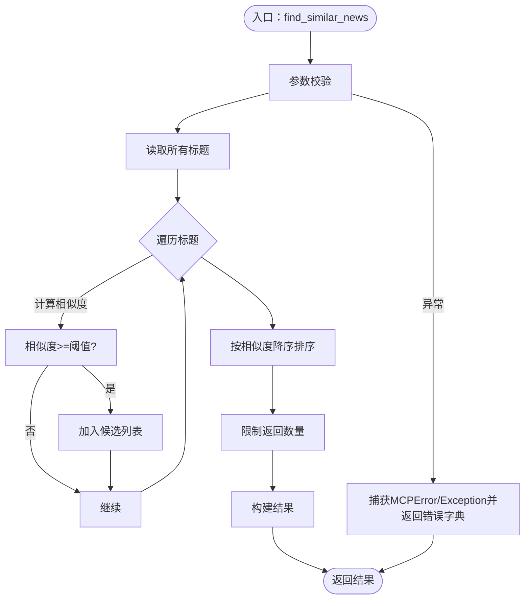
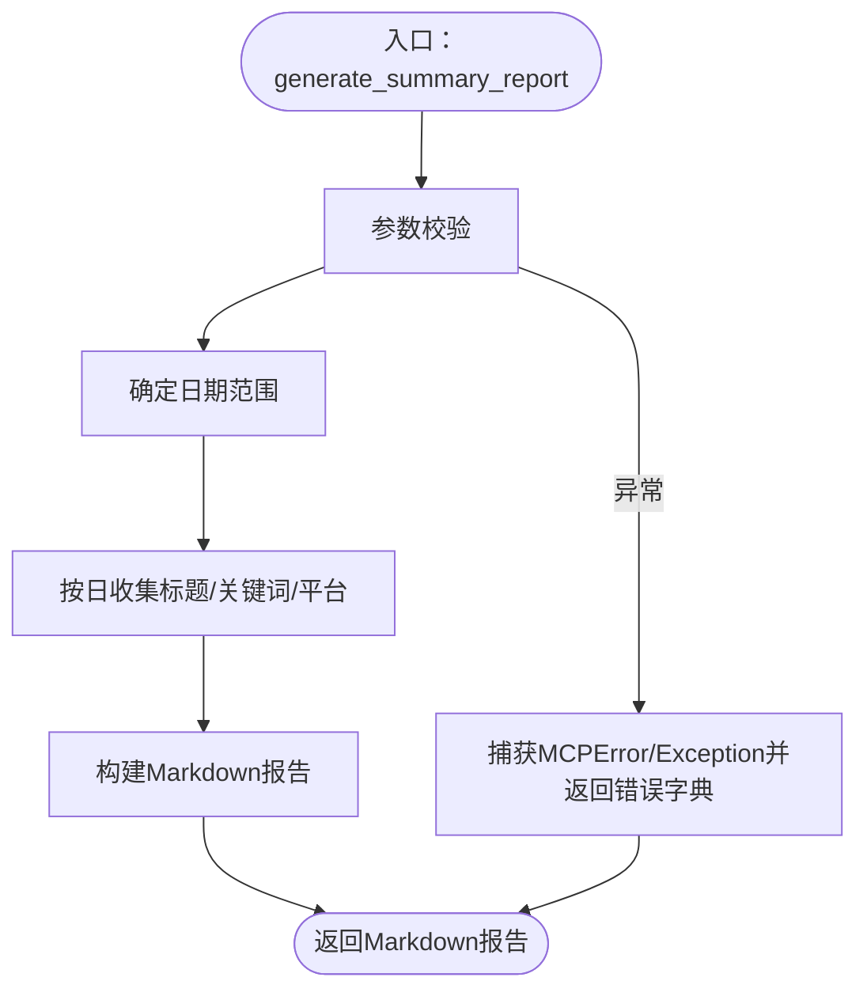
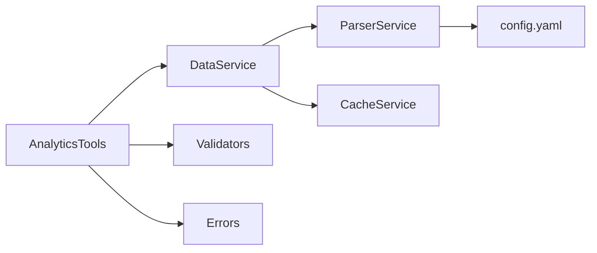

# 数据分析工具集

<cite>
**本文引用的文件**
- [analytics.py](file://mcp_server/tools/analytics.py)
- [data_service.py](file://mcp_server/services/data_service.py)
- [parser_service.py](file://mcp_server/services/parser_service.py)
- [validators.py](file://mcp_server/utils/validators.py)
- [errors.py](file://mcp_server/utils/errors.py)
- [cache_service.py](file://mcp_server/services/cache_service.py)
- [config.yaml](file://config/config.yaml)
- [server.py](file://mcp_server/server.py)
- [README-MCP-FAQ.md](file://README-MCP-FAQ.md)
</cite>

## 目录
1. [简介](#简介)
2. [项目结构](#项目结构)
3. [核心组件](#核心组件)
4. [架构总览](#架构总览)
5. [详细组件分析](#详细组件分析)
6. [依赖关系分析](#依赖关系分析)
7. [性能考量](#性能考量)
8. [故障排查指南](#故障排查指南)
9. [结论](#结论)
10. [附录](#附录)

## 简介
本文件面向数据分析工具集，聚焦 AnalyticsTools 类提供的13种高级分析能力，围绕统一趋势分析与统一数据洞察两大入口，系统阐述：
- analyze_topic_trend_unified 统一话题趋势分析：涵盖 trend、lifecycle、viral、predict 四种模式的实现逻辑与调用场景
- analyze_data_insights_unified 统一数据洞察分析：涵盖 platform_compare、platform_activity、keyword_cooccur 三种模式的业务逻辑
- analyze_sentiment 情感分析：生成结构化提示词并返回新闻样本
- find_similar_news 相似新闻查找与 generate_summary_report 摘要报告生成的实现细节
- 参数验证、错误处理与性能优化策略

## 项目结构
数据分析工具位于 mcp_server/tools/analytics.py，其数据访问由 mcp_server/services/data_service.py 统一封装，底层解析由 mcp_server/services/parser_service.py 完成；参数校验与错误类型分别由 mcp_server/utils/validators.py 与 mcp_server/utils/errors.py 提供；缓存由 mcp_server/services/cache_service.py 提供；配置文件 config/config.yaml 提供平台与权重等基础配置。

图表来源
- [analytics.py](file://mcp_server/tools/analytics.py#L77-L120)
- [data_service.py](file://mcp_server/services/data_service.py#L17-L40)
- [parser_service.py](file://mcp_server/services/parser_service.py#L18-L40)
- [validators.py](file://mcp_server/utils/validators.py#L16-L41)
- [errors.py](file://mcp_server/utils/errors.py#L10-L30)
- [cache_service.py](file://mcp_server/services/cache_service.py#L12-L40)
- [config.yaml](file://config/config.yaml#L110-L140)

章节来源
- [analytics.py](file://mcp_server/tools/analytics.py#L77-L120)
- [data_service.py](file://mcp_server/services/data_service.py#L17-L40)
- [parser_service.py](file://mcp_server/services/parser_service.py#L18-L40)
- [validators.py](file://mcp_server/utils/validators.py#L16-L41)
- [errors.py](file://mcp_server/utils/errors.py#L10-L30)
- [cache_service.py](file://mcp_server/services/cache_service.py#L12-L40)
- [config.yaml](file://config/config.yaml#L110-L140)

## 核心组件
- AnalyticsTools：统一分析入口，提供13种分析能力，包括统一趋势分析、统一数据洞察、情感分析、相似新闻查找、摘要报告生成、平台对比、生命周期分析、异常热度检测、话题预测、实体搜索、关键词共现、平台活跃度统计等。
- DataService：统一数据访问服务，封装 ParserService 与 CacheService，提供最新/按日新闻、关键词搜索、趋势词统计、系统状态等能力，并内置缓存策略。
- ParserService：解析 output 目录下的 txt 标题文件，支持按日期与平台过滤，合并同标题多日排名，缓存解析结果。
- Validators：提供平台、日期范围、关键词、limit、topN、模式等参数校验。
- Errors：统一错误类型，便于上层捕获与标准化返回。
- CacheService：轻量 TTL 缓存，支持并发锁、清理过期、统计信息。
- config.yaml：平台列表、权重配置、通知配置等。

章节来源
- [analytics.py](file://mcp_server/tools/analytics.py#L77-L120)
- [data_service.py](file://mcp_server/services/data_service.py#L17-L40)
- [parser_service.py](file://mcp_server/services/parser_service.py#L160-L260)
- [validators.py](file://mcp_server/utils/validators.py#L90-L121)
- [errors.py](file://mcp_server/utils/errors.py#L10-L30)
- [cache_service.py](file://mcp_server/services/cache_service.py#L12-L40)
- [config.yaml](file://config/config.yaml#L110-L140)

## 架构总览
统一分析流程：客户端/调用方通过 AnalyticsTools 的统一入口发起请求，工具内部根据分析类型路由到具体方法；方法通过 DataService 读取数据，ParserService 解析文件，CacheService 缓存结果；参数校验由 Validators 执行，错误由 Errors 统一包装；最终返回结构化结果。

图表来源
- [analytics.py](file://mcp_server/tools/analytics.py#L156-L242)
- [data_service.py](file://mcp_server/services/data_service.py#L104-L182)
- [parser_service.py](file://mcp_server/services/parser_service.py#L160-L260)
- [cache_service.py](file://mcp_server/services/cache_service.py#L21-L41)
- [validators.py](file://mcp_server/utils/validators.py#L145-L210)
- [errors.py](file://mcp_server/utils/errors.py#L10-L30)

## 详细组件分析

### 统一话题趋势分析 analyze_topic_trend_unified
- 功能概述：统一入口，支持 trend、lifecycle、viral、predict 四种模式，分别用于热度趋势追踪、生命周期分析、异常热度检测与话题预测。
- 参数与校验：
  - topic：必填，关键词校验
  - analysis_type：枚举校验，仅允许 trend/lifecycle/viral/predict
  - date_range/granularity/threshold/time_window/lookahead_hours/confidence_threshold：按模式传入并校验
- 路由逻辑：
  - trend：调用 get_topic_trend_analysis，按天粒度统计话题出现次数，计算峰值、涨跌幅、趋势方向
  - lifecycle：调用 analyze_topic_lifecycle，追踪话题从出现到消失的完整周期，判断阶段与类型
  - viral：调用 detect_viral_topics，基于当前与昨日关键词频率计算增长倍数，识别异常热度
  - predict：调用 predict_trending_topics，基于最近3天趋势计算增长率与置信度，预测潜在热点
- 错误处理：捕获 MCPError 并返回标准化错误字典；捕获其他异常返回 INTERNAL_ERROR
- 性能优化：按天遍历数据，使用缓存；viral/predict 仅读取必要日期范围；权重计算与相似度计算采用高效算法

图表来源
- [analytics.py](file://mcp_server/tools/analytics.py#L156-L242)
- [analytics.py](file://mcp_server/tools/analytics.py#L244-L401)
- [analytics.py](file://mcp_server/tools/analytics.py#L1465-L1621)
- [analytics.py](file://mcp_server/tools/analytics.py#L1623-L1757)
- [analytics.py](file://mcp_server/tools/analytics.py#L1759-L1919)

章节来源
- [analytics.py](file://mcp_server/tools/analytics.py#L156-L242)
- [analytics.py](file://mcp_server/tools/analytics.py#L244-L401)
- [analytics.py](file://mcp_server/tools/analytics.py#L1465-L1621)
- [analytics.py](file://mcp_server/tools/analytics.py#L1623-L1757)
- [analytics.py](file://mcp_server/tools/analytics.py#L1759-L1919)

### 统一数据洞察分析 analyze_data_insights_unified
- 功能概述：统一入口，支持 platform_compare、platform_activity、keyword_cooccur 三种模式，分别用于平台对比、平台活跃度统计与关键词共现分析。
- 参数与校验：
  - insight_type：枚举校验，仅允许 platform_compare/platform_activity/keyword_cooccur
  - topic/date_range/min_frequency/top_n：按模式传入并校验
- 路由逻辑：
  - platform_compare：调用 compare_platforms，统计各平台新闻总量、话题提及数、唯一标题数、覆盖率、Top关键词，并识别各平台独有热点
  - platform_activity：调用 get_platform_activity_stats，统计各平台更新次数、活跃天数、日均新闻数、最活跃时段与活跃度评分
  - keyword_cooccur：调用 analyze_keyword_cooccurrence，提取关键词并统计两两共现频次，过滤阈值并取TOP N
- 错误处理：捕获 MCPError 并返回标准化错误字典；捕获其他异常返回 INTERNAL_ERROR
- 性能优化：按天遍历，使用 Counter 与 defaultdict；共现统计采用两两组合并去重；平台独有热点通过集合差运算快速求解

图表来源
- [analytics.py](file://mcp_server/tools/analytics.py#L89-L155)
- [analytics.py](file://mcp_server/tools/analytics.py#L402-L524)
- [analytics.py](file://mcp_server/tools/analytics.py#L1338-L1463)
- [analytics.py](file://mcp_server/tools/analytics.py#L526-L630)

章节来源
- [analytics.py](file://mcp_server/tools/analytics.py#L89-L155)
- [analytics.py](file://mcp_server/tools/analytics.py#L402-L524)
- [analytics.py](file://mcp_server/tools/analytics.py#L1338-L1463)
- [analytics.py](file://mcp_server/tools/analytics.py#L526-L630)

### 情感分析 analyze_sentiment
- 功能概述：生成用于 AI 情感分析的结构化提示词，返回新闻样本与统计摘要；支持按权重排序、平台过滤、日期范围与URL包含开关。
- 关键流程：
  - 参数校验：topic、platforms、limit、date_range
  - 日期范围处理：默认今天，支持多天累加
  - 数据收集：按日期遍历，读取标题与排名，去重合并同标题跨日出现
  - 权重排序：按 calculate_news_weight 计算权重并降序
  - 生成提示词：_create_sentiment_analysis_prompt，按平台分组输出结构化提示
  - 返回：摘要统计、AI提示词、新闻样本与使用说明
- 错误处理：DataNotFoundError 与 MCPError 统一返回；不足请求数量时补充提示
- 性能优化：缓存解析结果；权重计算复用；去重与合并减少重复处理

图表来源
- [analytics.py](file://mcp_server/tools/analytics.py#L631-L803)
- [analytics.py](file://mcp_server/tools/analytics.py#L818-L909)
- [data_service.py](file://mcp_server/services/data_service.py#L104-L182)
- [parser_service.py](file://mcp_server/services/parser_service.py#L160-L260)
- [cache_service.py](file://mcp_server/services/cache_service.py#L21-L41)

章节来源
- [analytics.py](file://mcp_server/tools/analytics.py#L631-L803)
- [analytics.py](file://mcp_server/tools/analytics.py#L818-L909)
- [data_service.py](file://mcp_server/services/data_service.py#L104-L182)
- [parser_service.py](file://mcp_server/services/parser_service.py#L160-L260)
- [cache_service.py](file://mcp_server/services/cache_service.py#L21-L41)

### 相似新闻查找 find_similar_news
- 功能概述：基于标题相似度查找相似新闻，支持阈值与返回数量控制，可选择是否包含URL。
- 关键流程：
  - 参数校验：reference_title、threshold、limit
  - 读取数据：解析所有标题
  - 相似度计算：_calculate_similarity（SequenceMatcher）
  - 排序与截断：按相似度降序，限制返回数量
  - 错误处理：未找到相似新闻时抛出 DataNotFoundError
- 性能优化：仅遍历一次；相似度阈值过滤；返回数量限制

图表来源
- [analytics.py](file://mcp_server/tools/analytics.py#L910-L1028)
- [analytics.py](file://mcp_server/tools/analytics.py#L1951-L1964)

章节来源
- [analytics.py](file://mcp_server/tools/analytics.py#L910-L1028)
- [analytics.py](file://mcp_server/tools/analytics.py#L1951-L1964)

### 摘要报告生成 generate_summary_report
- 功能概述：自动生成每日/每周摘要报告，包含数据概览、热门关键词、平台活跃度、趋势分析与精选样本。
- 关键流程：
  - 参数校验：report_type（daily/weekly）、date_range
  - 日期范围：默认今日或近7天
  - 数据收集：按日遍历，统计关键词与平台分布
  - 报告生成：构建Markdown，包含TOP关键词、平台活跃度、趋势简述与样本新闻
  - 锚点：样本新闻按标题权重确定性排序，确保相同输入返回一致结果
- 性能优化：按日遍历；Counter与defaultdict高效统计；权重计算与排序保证确定性

图表来源
- [analytics.py](file://mcp_server/tools/analytics.py#L1158-L1336)

章节来源
- [analytics.py](file://mcp_server/tools/analytics.py#L1158-L1336)

### 补充能力（与目标相关的其他方法）
- compare_platforms：平台对比分析，统计各平台新闻总量、话题提及数、覆盖率、Top关键词，并识别独有热点
- get_platform_activity_stats：平台活跃度统计，统计更新次数、活跃天数、日均新闻数、最活跃时段与活跃度评分
- analyze_keyword_cooccurrence：关键词共现分析，统计两两共现频次并过滤阈值
- analyze_topic_lifecycle：生命周期分析，追踪话题从出现到消失的完整周期，判断阶段与类型
- detect_viral_topics：异常热度检测，基于当前与昨日关键词频率计算增长倍数
- predict_trending_topics：话题预测，基于最近3天趋势计算增长率与置信度
- search_by_entity：实体搜索，按人物/地点/机构搜索相关新闻并统计周边关键词
- find_similar_news：相似新闻查找（已在上述流程中详述）

章节来源
- [analytics.py](file://mcp_server/tools/analytics.py#L402-L524)
- [analytics.py](file://mcp_server/tools/analytics.py#L1338-L1463)
- [analytics.py](file://mcp_server/tools/analytics.py#L526-L630)
- [analytics.py](file://mcp_server/tools/analytics.py#L1465-L1621)
- [analytics.py](file://mcp_server/tools/analytics.py#L1623-L1757)
- [analytics.py](file://mcp_server/tools/analytics.py#L1759-L1919)
- [analytics.py](file://mcp_server/tools/analytics.py#L1030-L1157)

## 依赖关系分析
- AnalyticsTools 依赖 DataService 与 Validators/Errors；DataService 依赖 ParserService 与 CacheService；ParserService 依赖 config.yaml 提供的平台配置；CacheService 为全局单例缓存。
- 统一入口方法通过 Validators 校验参数，异常由 Errors 统一包装；DataService 在读取数据时优先命中缓存，未命中再解析文件并写回缓存。

图表来源
- [analytics.py](file://mcp_server/tools/analytics.py#L77-L120)
- [data_service.py](file://mcp_server/services/data_service.py#L17-L40)
- [parser_service.py](file://mcp_server/services/parser_service.py#L18-L40)
- [validators.py](file://mcp_server/utils/validators.py#L16-L41)
- [errors.py](file://mcp_server/utils/errors.py#L10-L30)
- [cache_service.py](file://mcp_server/services/cache_service.py#L122-L137)
- [config.yaml](file://config/config.yaml#L110-L140)

章节来源
- [analytics.py](file://mcp_server/tools/analytics.py#L77-L120)
- [data_service.py](file://mcp_server/services/data_service.py#L17-L40)
- [parser_service.py](file://mcp_server/services/parser_service.py#L18-L40)
- [validators.py](file://mcp_server/utils/validators.py#L16-L41)
- [errors.py](file://mcp_server/utils/errors.py#L10-L30)
- [cache_service.py](file://mcp_server/services/cache_service.py#L122-L137)
- [config.yaml](file://config/config.yaml#L110-L140)

## 性能考量
- 缓存策略：DataService 与 ParserService 对今日与历史数据分别设置不同TTL，提高读取效率；CacheService 提供并发安全与统计信息。
- 数据遍历：按天遍历，避免一次性加载全量数据；Counter/defaultdict 提升统计效率。
- 排序与截断：权重排序与limit限制减少后续处理成本；相似度阈值过滤降低候选规模。
- 确定性排序：摘要报告样本新闻按标题权重与字母序排序，确保相同输入返回一致结果。
- I/O 优化：解析txt文件时合并同标题多日排名，减少重复处理。

章节来源
- [data_service.py](file://mcp_server/services/data_service.py#L50-L103)
- [data_service.py](file://mcp_server/services/data_service.py#L134-L182)
- [parser_service.py](file://mcp_server/services/parser_service.py#L160-L260)
- [cache_service.py](file://mcp_server/services/cache_service.py#L21-L41)
- [analytics.py](file://mcp_server/tools/analytics.py#L1280-L1307)

## 故障排查指南
- 参数错误：InvalidParameterError，检查参数类型、范围与枚举值；参考 validators.py 的校验规则
- 数据不存在：DataNotFoundError，检查日期范围是否在未来或无数据；参考 data_service.py 的可用日期范围
- 平台不支持：PlatformNotSupportedError，确认 config.yaml 中 platforms 配置
- 内部错误：INTERNAL_ERROR，检查日志与异常堆栈
- 常见问题定位：
  - 日期范围未来：validate_date_range 会提示可用范围
  - 未找到相似新闻：find_similar_news 会在阈值过严时提示
  - 未找到包含实体的新闻：search_by_entity 会提示尝试其他实体
  - 未找到今天数据：predict_trending_topics 会提示等待爬虫任务完成

章节来源
- [validators.py](file://mcp_server/utils/validators.py#L145-L210)
- [errors.py](file://mcp_server/utils/errors.py#L30-L94)
- [data_service.py](file://mcp_server/services/data_service.py#L498-L605)
- [analytics.py](file://mcp_server/tools/analytics.py#L910-L1028)
- [analytics.py](file://mcp_server/tools/analytics.py#L1030-L1157)
- [analytics.py](file://mcp_server/tools/analytics.py#L1759-L1919)

## 结论
AnalyticsTools 通过统一入口整合了13种高级分析能力，结合 DataService 的缓存与 ParserService 的解析，实现了高效、可扩展的数据分析体系。统一趋势分析与统一数据洞察两大入口覆盖了从话题热度到平台活跃度、从关键词共现到情感分析的典型需求；配套的参数校验与错误处理保障了鲁棒性；缓存与遍历策略兼顾性能与准确性。建议在生产环境中合理设置阈值与limit，充分利用缓存与权重排序，以获得更佳的用户体验与性能表现。

## 附录
- 统一入口方法一览（与目标相关）：
  - analyze_topic_trend_unified：trend/lifecycle/viral/predict
  - analyze_data_insights_unified：platform_compare/platform_activity/keyword_cooccur
  - analyze_sentiment：情感分析提示词与样本
  - find_similar_news：相似新闻查找
  - generate_summary_report：每日/每周摘要报告
- 与工具调用相关的服务端接口参考：
  - find_similar_news 与 generate_summary_report 的服务端实现与参数说明

章节来源
- [analytics.py](file://mcp_server/tools/analytics.py#L156-L242)
- [analytics.py](file://mcp_server/tools/analytics.py#L89-L155)
- [analytics.py](file://mcp_server/tools/analytics.py#L631-L803)
- [analytics.py](file://mcp_server/tools/analytics.py#L910-L1028)
- [analytics.py](file://mcp_server/tools/analytics.py#L1158-L1336)
- [server.py](file://mcp_server/server.py#L408-L440)
- [README-MCP-FAQ.md](file://README-MCP-FAQ.md#L325-L364)