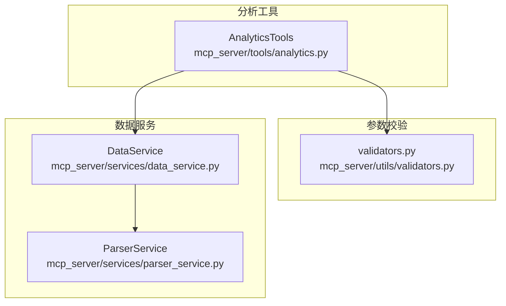
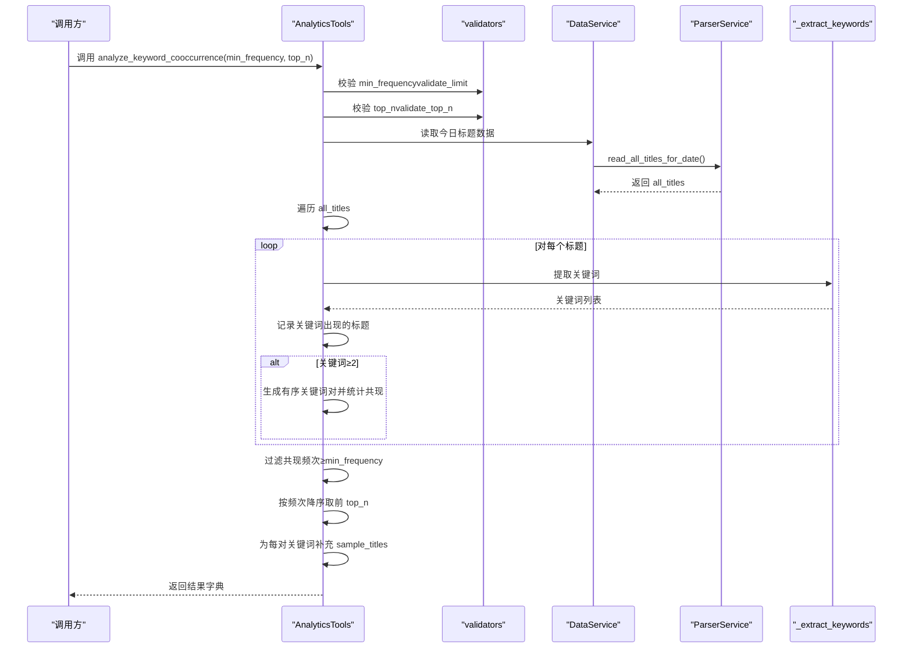
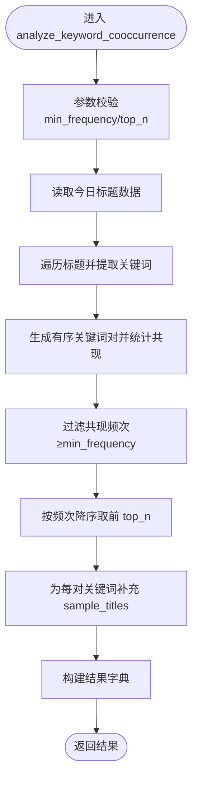
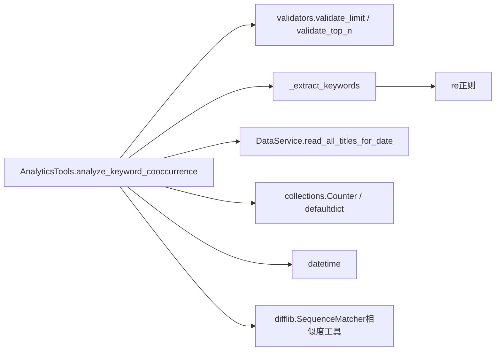

# 关键词共现分析

<cite>
**本文引用的文件**
- [mcp_server/tools/analytics.py](file://mcp_server/tools/analytics.py)
- [mcp_server/utils/validators.py](file://mcp_server/utils/validators.py)
- [docs/MCP-API-Reference.md](file://docs/MCP-API-Reference.md)
</cite>

## 目录
1. [简介](#简介)
2. [项目结构](#项目结构)
3. [核心组件](#核心组件)
4. [架构总览](#架构总览)
5. [详细组件分析](#详细组件分析)
6. [依赖分析](#依赖分析)
7. [性能考量](#性能考量)
8. [故障排查指南](#故障排查指南)
9. [结论](#结论)
10. [附录](#附录)

## 简介
本文件围绕关键词共现分析能力进行系统化说明，重点解释 analyze_keyword_cooccurrence 方法如何通过“n-gram”思想（此处以二元组有序关键词对为核心）从标题中提取关键词、生成有序关键词对并统计共现频次，以及 min_frequency 与 top_n 参数对结果的过滤与截断机制。同时说明 sample_titles 的上下文增强作用，并给出在发现潜在话题组合、构建知识图谱与推荐系统中的典型应用场景、参数约束、返回结构与调用示例路径。

## 项目结构
关键词共现分析位于分析工具模块中，依赖参数校验工具与数据服务层提供的标题数据读取接口。

图表来源
- [mcp_server/tools/analytics.py](file://mcp_server/tools/analytics.py#L76-L120)
- [mcp_server/utils/validators.py](file://mcp_server/utils/validators.py#L90-L121)
- [mcp_server/utils/validators.py](file://mcp_server/utils/validators.py#L245-L260)

章节来源
- [mcp_server/tools/analytics.py](file://mcp_server/tools/analytics.py#L76-L120)

## 核心组件
- AnalyticsTools.analyze_keyword_cooccurrence：执行关键词共现分析的核心方法，负责参数校验、数据读取、关键词提取、共现统计、过滤与排序、结果组装。
- _extract_keywords：从标题中提取关键词的辅助方法，采用简单分词与停用词过滤策略。
- 参数校验器 validate_limit、validate_top_n：对 min_frequency 与 top_n 进行边界与类型校验。

章节来源
- [mcp_server/tools/analytics.py](file://mcp_server/tools/analytics.py#L526-L629)
- [mcp_server/tools/analytics.py](file://mcp_server/tools/analytics.py#L1923-L1949)
- [mcp_server/utils/validators.py](file://mcp_server/utils/validators.py#L90-L121)
- [mcp_server/utils/validators.py](file://mcp_server/utils/validators.py#L245-L260)

## 架构总览
关键词共现分析的端到端流程如下：

图表来源
- [mcp_server/tools/analytics.py](file://mcp_server/tools/analytics.py#L526-L629)
- [mcp_server/tools/analytics.py](file://mcp_server/tools/analytics.py#L1923-L1949)
- [mcp_server/utils/validators.py](file://mcp_server/utils/validators.py#L90-L121)
- [mcp_server/utils/validators.py](file://mcp_server/utils/validators.py#L245-L260)

## 详细组件分析

### analyze_keyword_cooccurrence 方法详解
- 输入参数
  - min_frequency：最小共现频次（默认3，最大100）
  - top_n：返回TOP N关键词对（默认20，最大100）
- 数据来源
  - 通过数据服务读取当天全部平台的标题集合
- 关键词提取
  - 使用 _extract_keywords 从标题中提取关键词，过滤掉停用词与长度小于阈值的词
- 共现统计
  - 对每个标题提取的关键词，若数量≥2，则两两组合并生成“有序关键词对”（通过排序保证对称性，避免重复）
  - 使用计数器统计每对关键词的共现频次
- 结果过滤与排序
  - 过滤掉频次低于 min_frequency 的对
  - 按频次降序排序，取前 top_n
- 结果组装
  - 为每对关键词补充 sample_titles：从记录该关键词出现过的标题中筛选同时包含另一个关键词的标题，最多取3条作为示例
  - 返回字段包括：success、cooccurrence_pairs（含 keyword1、keyword2、cooccurrence_count、sample_titles）、total_pairs、min_frequency、generated_at

图表来源
- [mcp_server/tools/analytics.py](file://mcp_server/tools/analytics.py#L526-L629)
- [mcp_server/tools/analytics.py](file://mcp_server/tools/analytics.py#L1923-L1949)

章节来源
- [mcp_server/tools/analytics.py](file://mcp_server/tools/analytics.py#L526-L629)

### 关键词提取 _extract_keywords
- 清洗与分词
  - 移除URL与标点符号后，按空白与常见中文分隔符进行拆分
- 过滤规则
  - 去除空白与停用词
  - 仅保留长度≥阈值的词（默认≥2）
- 输出
  - 返回关键词列表，作为后续共现分析的基础

章节来源
- [mcp_server/tools/analytics.py](file://mcp_server/tools/analytics.py#L1923-L1949)

### 参数约束与校验
- min_frequency
  - 类型：整数；范围：(0, 100]；默认：3；最大：100
  - 作用：过滤低频共现，仅保留频次不低于该值的关键词对
- top_n
  - 类型：整数；范围：(0, 100]；默认：20；最大：100
  - 作用：限制输出结果数量，按频次降序取前 N
- 校验函数
  - validate_limit：通用上限校验（max_limit=1000，但共现场景使用默认100）
  - validate_top_n：复用 validate_limit，限定最大100

章节来源
- [mcp_server/utils/validators.py](file://mcp_server/utils/validators.py#L90-L121)
- [mcp_server/utils/validators.py](file://mcp_server/utils/validators.py#L245-L260)
- [mcp_server/tools/analytics.py](file://mcp_server/tools/analytics.py#L556-L558)

### 返回结构说明
- 成功时返回字典包含：
  - success: 布尔值
  - cooccurrence_pairs: 列表，元素为字典，包含
    - keyword1: 关键词1
    - keyword2: 关键词2
    - cooccurrence_count: 共现频次
    - sample_titles: 上下文示例标题列表（最多3条）
  - total_pairs: 实际返回的关键词对数量
  - min_frequency: 当前使用的最小共现频次
  - generated_at: 生成时间
- 失败时返回字典包含：
  - success: False
  - error: 错误对象（包含错误码与消息）

章节来源
- [mcp_server/tools/analytics.py](file://mcp_server/tools/analytics.py#L609-L629)

### 实际调用示例（路径指引）
- 直接调用
  - 示例路径：[analyze_keyword_cooccurrence 调用示例](file://mcp_server/tools/analytics.py#L547-L553)
- 通过统一洞察接口
  - insight_type="keyword_cooccur" 时，内部转发到 analyze_keyword_cooccurrence
  - 示例路径：[统一洞察接口调用示例](file://docs/MCP-API-Reference.md#L187-L196)

章节来源
- [mcp_server/tools/analytics.py](file://mcp_server/tools/analytics.py#L547-L553)
- [docs/MCP-API-Reference.md](file://docs/MCP-API-Reference.md#L187-L196)

### 在知识图谱与推荐系统中的应用
- 发现潜在话题组合
  - 通过高频共现对识别强关联主题，辅助构建主题网络节点与边
- 构建知识图谱
  - 将关键词对作为三元组（实体1-实体2-共现强度）入图，结合外部实体消歧与关系抽取进一步扩展
- 推荐系统
  - 基于用户历史点击/收藏的关键词，推荐与其共现度高的其他关键词对应的文章或话题
- 上下文增强
  - sample_titles 提供真实标题示例，便于人工审核与模型微调

[本节为概念性说明，不直接分析具体源码文件]

## 依赖分析
- 内部依赖
  - AnalyticsTools 依赖 validators 中的参数校验函数
  - AnalyticsTools 依赖 DataService 读取标题数据
  - 关键词提取依赖正则与内置停用词集合
- 外部依赖
  - Python 标准库 collections.Counter、defaultdict、datetime
  - difflib.SequenceMatcher（用于相似度计算，与共现分析同属分析工具族）

图表来源
- [mcp_server/tools/analytics.py](file://mcp_server/tools/analytics.py#L76-L120)
- [mcp_server/tools/analytics.py](file://mcp_server/tools/analytics.py#L1923-L1949)
- [mcp_server/utils/validators.py](file://mcp_server/utils/validators.py#L90-L121)
- [mcp_server/utils/validators.py](file://mcp_server/utils/validators.py#L245-L260)

章节来源
- [mcp_server/tools/analytics.py](file://mcp_server/tools/analytics.py#L76-L120)
- [mcp_server/tools/analytics.py](file://mcp_server/tools/analytics.py#L1923-L1949)
- [mcp_server/utils/validators.py](file://mcp_server/utils/validators.py#L90-L121)
- [mcp_server/utils/validators.py](file://mcp_server/utils/validators.py#L245-L260)

## 性能考量
- 时间复杂度
  - 对每个标题提取关键词 O(L)（L为标题长度）
  - 若关键词数为 k，则两两组合生成对数约为 O(k^2)
  - 全部标题的组合统计近似 O(N·k^2)
  - 过滤与排序 O(P log P)，P 为候选对数（通常 P << N·k^2）
- 空间复杂度
  - 共现计数字典与关键词-标题映射：O(P + U)，U 为唯一关键词数
- 优化建议
  - 控制 top_n 与 min_frequency，减少候选对数量
  - 限制标题来源（如按日期范围）以缩小数据规模
  - 对关键词提取策略进行缓存或预处理（如停用词表与正则编译）

[本节为一般性指导，不直接分析具体源码文件]

## 故障排查指南
- 常见错误类型
  - 参数非法：min_frequency 或 top_n 类型不符、越界、非正值
  - 数据缺失：当日无可用标题数据
- 定位方法
  - 查看返回字典中的 error 字段，确认错误码与建议
  - 检查参数范围与类型是否满足 validators 的约束
- 处理建议
  - 调整 min_frequency 与 top_n 至合理区间
  - 确认数据服务层已正确加载当日数据
  - 如需跨日期分析，可改用统一洞察接口的日期范围参数

章节来源
- [mcp_server/tools/analytics.py](file://mcp_server/tools/analytics.py#L617-L629)
- [mcp_server/utils/validators.py](file://mcp_server/utils/validators.py#L90-L121)
- [mcp_server/utils/validators.py](file://mcp_server/utils/validators.py#L245-L260)

## 结论
关键词共现分析通过“n-gram”思想（以二元组有序关键词对为核心）实现了从标题中发现主题关联的有效手段。配合合理的参数约束与上下文示例，该能力既可用于话题组合发现，也可作为知识图谱与推荐系统的输入基础。实践中应根据业务目标调整 min_frequency 与 top_n，并关注数据规模对性能的影响。

[本节为总结性内容，不直接分析具体源码文件]

## 附录

### 参数与返回字段一览
- 参数
  - min_frequency：最小共现频次（默认3，最大100）
  - top_n：返回TOP N结果（默认20，最大100）
- 返回字段
  - success、cooccurrence_pairs、total_pairs、min_frequency、generated_at
  - 失败时包含 error

章节来源
- [mcp_server/tools/analytics.py](file://mcp_server/tools/analytics.py#L526-L629)
- [mcp_server/utils/validators.py](file://mcp_server/utils/validators.py#L90-L121)
- [mcp_server/utils/validators.py](file://mcp_server/utils/validators.py#L245-L260)