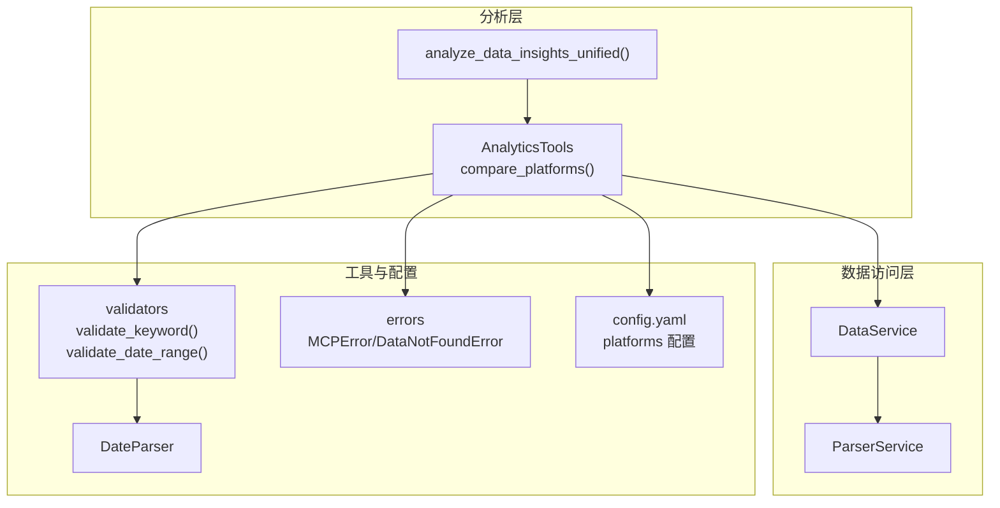
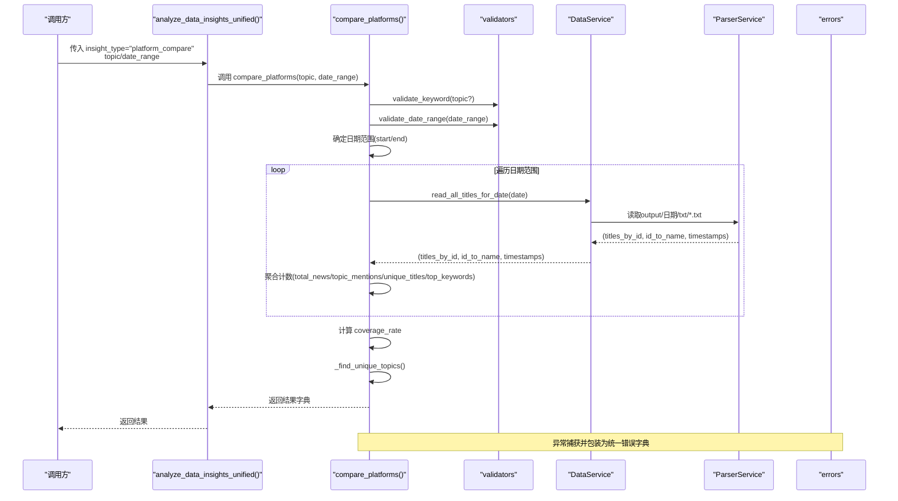
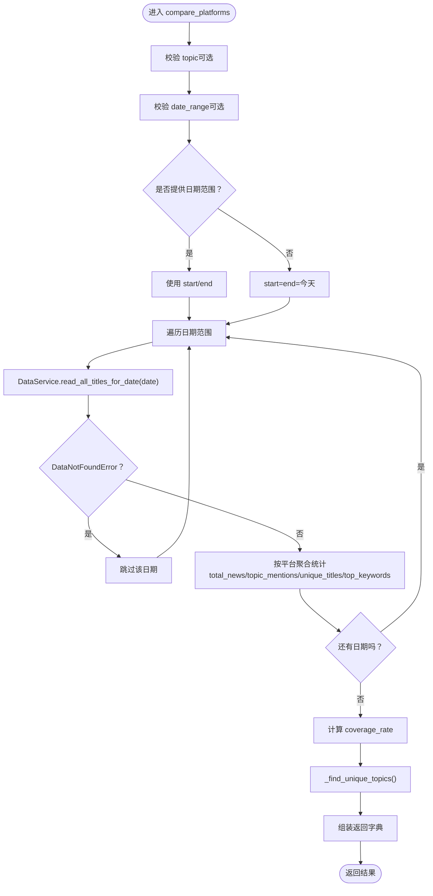
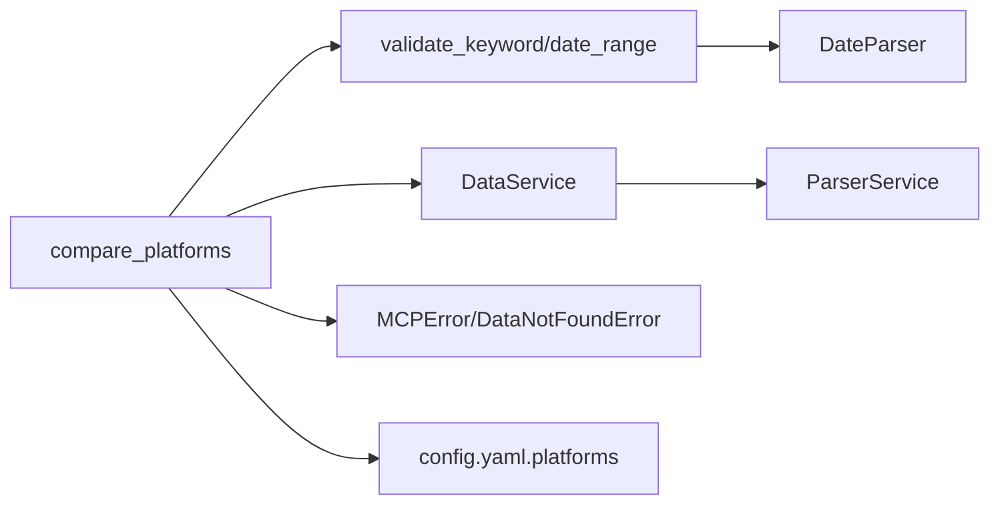

# 平台对比分析

<cite>
**本文引用的文件**
- [analytics.py](file://mcp_server/tools/analytics.py)
- [validators.py](file://mcp_server/utils/validators.py)
- [date_parser.py](file://mcp_server/utils/date_parser.py)
- [data_service.py](file://mcp_server/services/data_service.py)
- [parser_service.py](file://mcp_server/services/parser_service.py)
- [errors.py](file://mcp_server/utils/errors.py)
- [config.yaml](file://config/config.yaml)
</cite>

## 目录
1. [简介](#简介)
2. [项目结构](#项目结构)
3. [核心组件](#核心组件)
4. [架构总览](#架构总览)
5. [详细组件分析](#详细组件分析)
6. [依赖关系分析](#依赖关系分析)
7. [性能考量](#性能考量)
8. [故障排查指南](#故障排查指南)
9. [结论](#结论)
10. [附录](#附录)

## 简介
本文件围绕平台对比分析能力展开，聚焦 compare_platforms 方法如何统计不同平台对指定话题的关注度。文档将系统阐述：
- 参数验证机制（topic、date_range、平台过滤）
- 日期范围处理逻辑（默认今日、范围校验、未来日期限制）
- 平台统计数据的聚合过程（total_news、topic_mentions、coverage_rate、unique_titles、top_keywords）
- _unique_topics 如何识别各平台独有热点
- 输入参数约束与返回结果的 JSON 结构定义
- 异常处理流程（如 DataNotFoundError 的静默处理与错误包装）
- 典型使用案例（对比特定话题在多平台的覆盖情况、分析整体平台活跃度）

## 项目结构
平台对比分析位于高级分析工具模块中，通过统一入口 analyze_data_insights_unified 调用 compare_platforms。数据来源由 DataService 封装，底层由 ParserService 读取 output 目录下的 txt 文件并解析标题、排名、URL 等字段；参数校验由 validators 模块提供，日期解析由 date_parser 提供，错误类型由 errors 模块统一定义。

图表来源
- [analytics.py](file://mcp_server/tools/analytics.py#L110-L1438)
- [validators.py](file://mcp_server/utils/validators.py#L145-L210)
- [date_parser.py](file://mcp_server/utils/date_parser.py#L1-L120)
- [data_service.py](file://mcp_server/services/data_service.py#L160-L260)
- [parser_service.py](file://mcp_server/services/parser_service.py#L160-L260)
- [errors.py](file://mcp_server/utils/errors.py#L1-L94)
- [config.yaml](file://config/config.yaml#L116-L140)

章节来源
- [analytics.py](file://mcp_server/tools/analytics.py#L110-L1438)
- [validators.py](file://mcp_server/utils/validators.py#L145-L210)
- [data_service.py](file://mcp_server/services/data_service.py#L160-L260)
- [parser_service.py](file://mcp_server/services/parser_service.py#L160-L260)
- [errors.py](file://mcp_server/utils/errors.py#L1-L94)
- [config.yaml](file://config/config.yaml#L116-L140)

## 核心组件
- AnalyticsTools.compare_platforms：平台对比分析主入口，负责参数校验、日期范围确定、遍历日期范围读取数据、聚合统计与结果组装。
- validators.validate_keyword / validate_date_range：关键词与日期范围的参数校验。
- data_service.DataService：统一数据访问入口，封装 ParserService 读取逻辑与缓存。
- parser_service.ParserService：读取 output 目录下按日期组织的 txt 文件，解析标题、排名、URL 等字段。
- errors.MCPError / DataNotFoundError：统一错误类型与包装。
- config.yaml.platforms：平台 ID 列表，用于平台过滤与名称映射。

章节来源
- [analytics.py](file://mcp_server/tools/analytics.py#L402-L524)
- [validators.py](file://mcp_server/utils/validators.py#L212-L243)
- [validators.py](file://mcp_server/utils/validators.py#L145-L210)
- [data_service.py](file://mcp_server/services/data_service.py#L160-L260)
- [parser_service.py](file://mcp_server/services/parser_service.py#L160-L260)
- [errors.py](file://mcp_server/utils/errors.py#L1-L94)
- [config.yaml](file://config/config.yaml#L116-L140)

## 架构总览
平台对比分析的调用链如下：外部调用 analyze_data_insights_unified，内部根据 insight_type 分派至 compare_platforms；compare_platforms 调用 validators 校验参数，再通过 data_service 读取 ParserService 的解析结果；在日期范围内迭代，逐条统计各平台的新闻总量、话题提及数、唯一标题数、关键词 Top-N，并计算覆盖率；最后调用 _unique_topics 识别各平台独有热点。

图表来源
- [analytics.py](file://mcp_server/tools/analytics.py#L110-L1438)
- [analytics.py](file://mcp_server/tools/analytics.py#L402-L524)
- [validators.py](file://mcp_server/utils/validators.py#L145-L210)
- [data_service.py](file://mcp_server/services/data_service.py#L160-L260)
- [parser_service.py](file://mcp_server/services/parser_service.py#L160-L260)
- [errors.py](file://mcp_server/utils/errors.py#L1-L94)

## 详细组件分析

### compare_platforms 方法详解
- 参数验证
  - topic：若提供则调用 validate_keyword，去除空白、长度限制、类型校验。
  - date_range：调用 validate_date_range，要求包含 start/end，格式为 YYYY-MM-DD，起止日期合法且不可在未来；若未提供，则默认使用当天日期。
- 日期范围处理
  - 若传入 date_range，则按 start/end 确定范围；否则 start=end=当前日期。
  - 遍历日期范围时，遇到 DataNotFoundError 将被静默忽略（continue），保证跨日期的鲁棒性。
- 数据读取与聚合
  - 通过 data_service.parser.read_all_titles_for_date(date) 获取 all_titles、id_to_name、timestamps。
  - 遍历 all_titles，按 platform_id 聚合计数：
    - total_news：平台新闻总数
    - topic_mentions：包含 topic 的新闻数
    - unique_titles：集合去重后的唯一标题数
    - top_keywords：Counter 统计标题关键词 Top-N（内部分词与停用词过滤）
- 覆盖率计算
  - coverage_rate = topic_mentions / total_news * 100，当 total_news=0 时 coverage_rate=0。
- 结果组装
  - platform_stats：按平台名输出 total_news、topic_mentions、unique_titles、coverage_rate、top_keywords（Top 5）。
  - unique_topics：调用 _find_unique_topics，识别各平台独有的关键词集合（Top 10 关键词中排除其他平台关键词）。
  - 返回字段：success、topic、date_range、platform_stats、unique_topics、total_platforms。

图表来源
- [analytics.py](file://mcp_server/tools/analytics.py#L402-L524)
- [validators.py](file://mcp_server/utils/validators.py#L145-L210)
- [data_service.py](file://mcp_server/services/data_service.py#L160-L260)
- [parser_service.py](file://mcp_server/services/parser_service.py#L160-L260)

章节来源
- [analytics.py](file://mcp_server/tools/analytics.py#L402-L524)

### 参数验证机制
- validate_keyword
  - 非空、字符串类型、去除空白、长度上限 100。
- validate_date_range
  - 必须为字典，包含 start/end；格式 YYYY-MM-DD；start<=end；不得在未来日期；若超出可用范围，会提示可用日期范围。
- validate_platforms（虽然 compare_platforms 未直接使用，但与平台过滤相关）
  - 从 config.yaml 动态读取支持平台列表；若配置加载失败，允许所有平台通过（降级策略）。

章节来源
- [validators.py](file://mcp_server/utils/validators.py#L212-L243)
- [validators.py](file://mcp_server/utils/validators.py#L145-L210)
- [validators.py](file://mcp_server/utils/validators.py#L16-L41)
- [config.yaml](file://config/config.yaml#L116-L140)

### 日期范围处理逻辑
- analyze_data_insights_unified 中的 compare_platforms 调用 validate_date_range(date_range)，并在未提供时回退到当天。
- validate_date_range 会检查：
  - 字典结构与字段完整性
  - 日期格式合法性
  - 起止先后顺序
  - 未来日期限制（抛出 InvalidParameterError）
  - 可用日期范围提示（通过 data_service.get_available_date_range）

章节来源
- [analytics.py](file://mcp_server/tools/analytics.py#L110-L1438)
- [validators.py](file://mcp_server/utils/validators.py#L145-L210)
- [data_service.py](file://mcp_server/services/data_service.py#L498-L537)

### 平台统计数据的聚合过程
- total_news：按平台累加新闻条目数。
- topic_mentions：当标题包含 topic（不区分大小写）时计数。
- unique_titles：使用集合去重，避免同标题重复计入。
- top_keywords：对标题进行简单分词（按空格与常见分隔符拆分），过滤停用词与短词，统计词频并取 Top 5。
- coverage_rate：topic_mentions / total_news * 100，total_news=0 时为 0。

章节来源
- [analytics.py](file://mcp_server/tools/analytics.py#L444-L499)
- [analytics.py](file://mcp_server/tools/analytics.py#L1938-L1950)

### _unique_topics 识别独有热点
- 步骤：
  - 从每个平台的 top_keywords 中取 Top 10，转为集合。
  - 对每个平台，计算“其他平台关键词集合”的并集。
  - 用该平台关键词集合减去其他平台关键词集合，得到独有关键词。
  - 每个平台最多保留 5 个独有关键词。
- 作用：帮助识别某平台独有的热点方向，便于差异化洞察。

章节来源
- [analytics.py](file://mcp_server/tools/analytics.py#L1965-L1997)

### 输入参数约束
- topic
  - 类型：字符串（可选）
  - 校验：validate_keyword，长度≤100，非空且非空白
- date_range
  - 类型：字典（可选）
  - 结构：{"start": "YYYY-MM-DD", "end": "YYYY-MM-DD"}
  - 校验：validate_date_range，start≤end，不可在未来，且在可用日期范围内
- 平台过滤
  - compare_platforms 未直接使用 validate_platforms，但平台 ID 来源于 ParserService 读取的 txt 文件头；若需限制平台，可在调用侧自行过滤或扩展参数。

章节来源
- [validators.py](file://mcp_server/utils/validators.py#L212-L243)
- [validators.py](file://mcp_server/utils/validators.py#L145-L210)
- [parser_service.py](file://mcp_server/services/parser_service.py#L160-L260)

### 返回结果的 JSON 结构定义
- 成功响应（success=true）
  - success: 布尔
  - topic: 字符串（可选）
  - date_range: 对象
    - start: "YYYY-MM-DD"
    - end: "YYYY-MM-DD"
    - total_days: 整数
  - platform_stats: 对象（键为平台名）
    - total_news: 整数
    - topic_mentions: 整数
    - unique_titles: 整数（去重后的标题数）
    - coverage_rate: 浮点数（百分比，保留两位小数）
    - top_keywords: 数组（最多5项）
      - keyword: 字符串
      - count: 整数
  - unique_topics: 对象（键为平台名，值为独有关键词数组，最多5个）
  - total_platforms: 整数
- 错误响应（success=false）
  - success: 布尔
  - error: 对象
    - code: 字符串（如 INVALID_PARAMETER、DATA_NOT_FOUND、INTERNAL_ERROR）
    - message: 字符串
    - suggestion: 字符串（可选）

章节来源
- [analytics.py](file://mcp_server/tools/analytics.py#L480-L524)
- [errors.py](file://mcp_server/utils/errors.py#L1-L94)

### 异常处理流程
- compare_platforms 内部捕获 MCPError（如 InvalidParameterError、DataNotFoundError）并转换为统一错误字典；捕获其他异常返回 INTERNAL_ERROR。
- DataNotFoundError 在遍历日期时会被静默处理（pass），继续下一天，避免因某日缺数据中断整个分析。
- validate_date_range 在日期在未来或超出可用范围时抛出 InvalidParameterError，并给出可用日期范围提示。

章节来源
- [analytics.py](file://mcp_server/tools/analytics.py#L474-L476)
- [analytics.py](file://mcp_server/tools/analytics.py#L512-L524)
- [validators.py](file://mcp_server/utils/validators.py#L145-L210)
- [data_service.py](file://mcp_server/services/data_service.py#L498-L537)

### 典型使用案例
- 对比特定话题在多平台的覆盖情况
  - 场景：对比“人工智能”在各平台的关注度，计算覆盖率与独有关键词。
  - 调用：analyze_data_insights_unified(insight_type="platform_compare", topic="人工智能", date_range={"start":"YYYY-MM-DD","end":"YYYY-MM-DD"})
- 分析整体平台活跃度
  - 场景：不指定 topic，仅统计各平台新闻总量、唯一标题数、关键词分布，用于评估平台活跃度。
  - 调用：compare_platforms(topic=None, date_range=...)
- 识别平台独有热点
  - 场景：通过 unique_topics 识别某平台独有的关键词，辅助差异化内容策略。

章节来源
- [analytics.py](file://mcp_server/tools/analytics.py#L110-L1438)
- [analytics.py](file://mcp_server/tools/analytics.py#L402-L524)

## 依赖关系分析
- compare_platforms 依赖 validators（参数校验）、data_service（数据访问）、parser_service（文件解析）、errors（错误类型）。
- config.yaml.platforms 为平台 ID 列表来源，影响平台名称映射与平台过滤能力。
- DateParser 用于日期表达式解析（非 compare_platforms 直接使用，但与 validate_date_range 协作）。

图表来源
- [analytics.py](file://mcp_server/tools/analytics.py#L402-L524)
- [validators.py](file://mcp_server/utils/validators.py#L145-L210)
- [date_parser.py](file://mcp_server/utils/date_parser.py#L1-L120)
- [data_service.py](file://mcp_server/services/data_service.py#L160-L260)
- [parser_service.py](file://mcp_server/services/parser_service.py#L160-L260)
- [errors.py](file://mcp_server/utils/errors.py#L1-L94)
- [config.yaml](file://config/config.yaml#L116-L140)

章节来源
- [analytics.py](file://mcp_server/tools/analytics.py#L402-L524)
- [validators.py](file://mcp_server/utils/validators.py#L145-L210)
- [data_service.py](file://mcp_server/services/data_service.py#L160-L260)
- [parser_service.py](file://mcp_server/services/parser_service.py#L160-L260)
- [errors.py](file://mcp_server/utils/errors.py#L1-L94)
- [config.yaml](file://config/config.yaml#L116-L140)

## 性能考量
- 缓存策略
  - ParserService.read_all_titles_for_date 对今天与历史日期分别设置不同 TTL，减少 IO 压力。
  - DataService 对最新新闻、按日期查询等操作设置缓存，降低重复读取成本。
- 时间复杂度
  - 遍历日期范围 O(D)，对每日遍历平台与标题 O(P*T)，其中 P 为平台数，T 为标题数。整体约 O(D*P*T)。
- 内存占用
  - platform_stats 使用 defaultdict 与 Counter，unique_titles 使用集合，内存随平台与标题增长而增长；可通过限制 top_keywords 与 unique_titles 的规模控制峰值。
- I/O 与错误容忍
  - DataNotFoundError 被静默处理，避免单日缺数据导致整体失败，提升鲁棒性。

章节来源
- [parser_service.py](file://mcp_server/services/parser_service.py#L160-L260)
- [data_service.py](file://mcp_server/services/data_service.py#L160-L260)
- [analytics.py](file://mcp_server/tools/analytics.py#L474-L476)

## 故障排查指南
- 日期在未来或超出可用范围
  - 现象：抛出 InvalidParameterError，提示未来日期或可用日期范围。
  - 处理：调整 date_range 或使用系统可用日期范围。
- 未找到数据
  - 现象：DataNotFoundError，提示未找到数据目录、无数据文件或无有效数据。
  - 处理：确认爬虫已运行、日期正确、output 目录存在且包含 txt 文件。
- 参数格式错误
  - 现象：InvalidParameterError，提示参数类型或格式不正确。
  - 处理：检查 topic 长度与类型、date_range 字段与格式。
- 返回结果为空
  - 现象：platform_stats 为空或 coverage_rate 为 0。
  - 处理：扩大日期范围、放宽 topic 条件、确认平台 ID 与名称映射。

章节来源
- [validators.py](file://mcp_server/utils/validators.py#L145-L210)
- [data_service.py](file://mcp_server/services/data_service.py#L160-L260)
- [parser_service.py](file://mcp_server/services/parser_service.py#L160-L260)
- [errors.py](file://mcp_server/utils/errors.py#L1-L94)

## 结论
compare_platforms 提供了面向话题的平台对比分析能力，通过严格的参数校验、稳健的日期范围处理、跨日期的容错读取与完善的统计聚合，能够输出 total_news、topic_mentions、coverage_rate、unique_titles、top_keywords 与 unique_topics 等关键指标。结合 _unique_topics 的独有热点识别，可为内容策略与平台运营提供直观的数据支撑。

## 附录
- 关键指标说明
  - total_news：平台新闻总量
  - topic_mentions：包含目标话题的新闻数
  - coverage_rate：覆盖率 = topic_mentions / total_news * 100
  - unique_titles：去重后的唯一标题数
  - top_keywords：标题关键词 Top-N（分词与停用词过滤）
  - unique_topics：各平台独有关键词集合（Top 10 关键词中排除其他平台关键词）