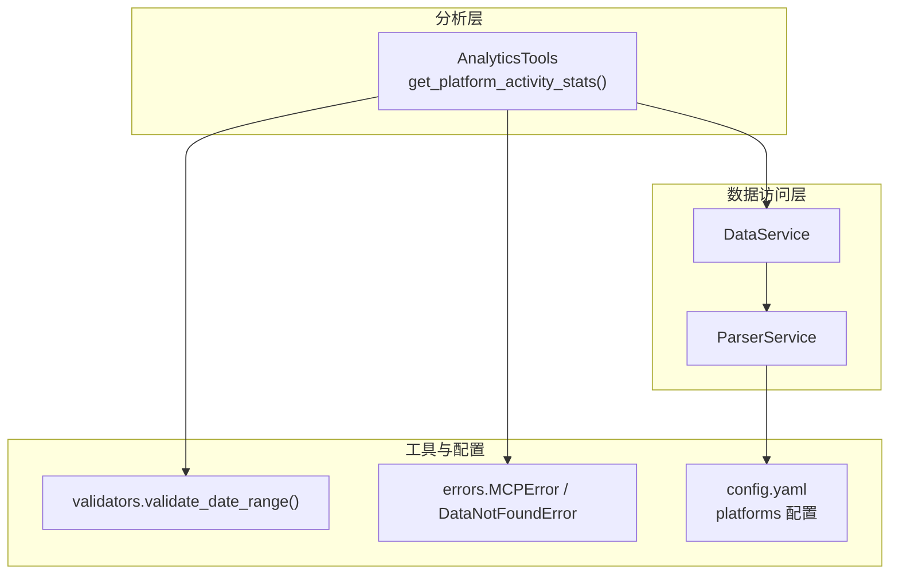
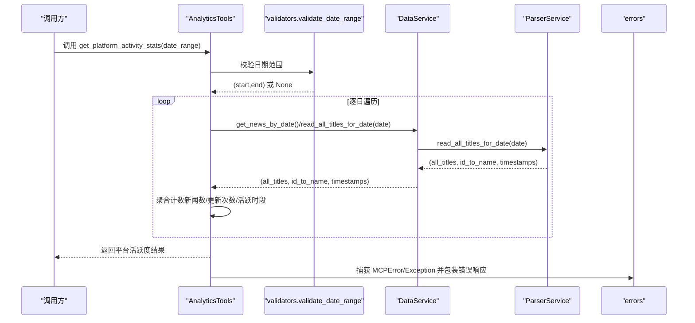
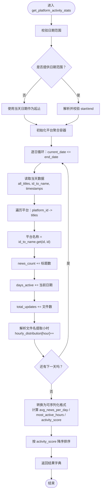
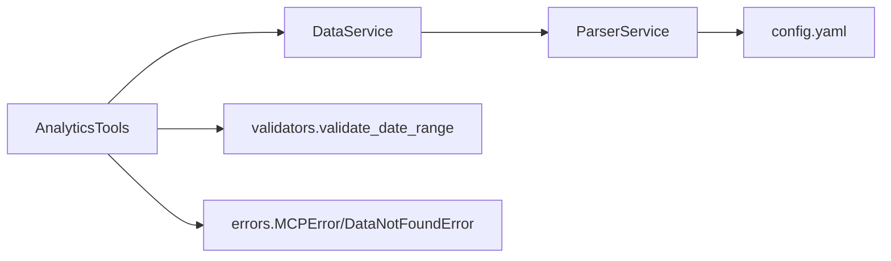

# 平台活跃度分析

<cite>
**本文引用的文件**
- [analytics.py](file://mcp_server/tools/analytics.py)
- [data_service.py](file://mcp_server/services/data_service.py)
- [parser_service.py](file://mcp_server/services/parser_service.py)
- [validators.py](file://mcp_server/utils/validators.py)
- [errors.py](file://mcp_server/utils/errors.py)
- [config.yaml](file://config/config.yaml)
</cite>

## 目录
1. [简介](#简介)
2. [项目结构](#项目结构)
3. [核心组件](#核心组件)
4. [架构总览](#架构总览)
5. [详细组件分析](#详细组件分析)
6. [依赖关系分析](#依赖关系分析)
7. [性能考量](#性能考量)
8. [故障排查指南](#故障排查指南)
9. [结论](#结论)
10. [附录](#附录)

## 简介
本文件围绕平台活跃度分析功能，聚焦于 get_platform_activity_stats 方法的实现逻辑与使用实践。该方法通过遍历指定日期范围内的数据，统计各平台的发布频率、活跃时段分布及内容更新规律，输出可用于识别平台运营节奏与用户活跃周期的关键指标。文档将详细解释：
- 日期范围遍历与数据聚合流程
- 平台ID到名称映射的处理机制
- 每日新闻数量与更新次数的累加逻辑
- 活跃时段（小时级）分布统计
- 返回结果字段定义与业务应用价值
- 调用示例与性能优化建议

## 项目结构
平台活跃度分析位于 mcp_server/tools/analytics.py 中，其数据来源由 mcp_server/services/data_service.py 与 mcp_server/services/parser_service.py 提供；参数校验由 mcp_server/utils/validators.py 完成；错误类型由 mcp_server/utils/errors.py 定义；平台配置来源于 config/config.yaml。

图表来源
- [analytics.py](file://mcp_server/tools/analytics.py#L1337-L1463)
- [data_service.py](file://mcp_server/services/data_service.py#L17-L37)
- [parser_service.py](file://mcp_server/services/parser_service.py#L160-L260)
- [validators.py](file://mcp_server/utils/validators.py#L145-L209)
- [errors.py](file://mcp_server/utils/errors.py#L10-L94)
- [config.yaml](file://config/config.yaml#L116-L140)

章节来源
- [analytics.py](file://mcp_server/tools/analytics.py#L1337-L1463)
- [data_service.py](file://mcp_server/services/data_service.py#L17-L37)
- [parser_service.py](file://mcp_server/services/parser_service.py#L160-L260)
- [validators.py](file://mcp_server/utils/validators.py#L145-L209)
- [errors.py](file://mcp_server/utils/errors.py#L10-L94)
- [config.yaml](file://config/config.yaml#L116-L140)

## 核心组件
- AnalyticsTools.get_platform_activity_stats：平台活跃度统计主入口，负责日期范围遍历、平台维度聚合、活跃时段统计与结果排序。
- DataService：封装数据访问，协调 ParserService 读取指定日期的数据。
- ParserService.read_all_titles_for_date：按日期读取 txt 数据文件，返回平台标题、平台ID到名称映射、文件时间戳字典。
- validators.validate_date_range：校验日期范围参数，确保合法且不指向未来。
- errors：统一错误类型，便于上层捕获与反馈。

章节来源
- [analytics.py](file://mcp_server/tools/analytics.py#L1337-L1463)
- [data_service.py](file://mcp_server/services/data_service.py#L17-L37)
- [parser_service.py](file://mcp_server/services/parser_service.py#L160-L260)
- [validators.py](file://mcp_server/utils/validators.py#L145-L209)
- [errors.py](file://mcp_server/utils/errors.py#L10-L94)

## 架构总览
平台活跃度分析的调用链路如下：
- 调用方传入可选日期范围
- 参数校验通过后，按日循环调用数据服务
- 数据服务委托解析服务读取指定日期的 txt 文件集合
- 解析服务返回平台标题、ID到名称映射、文件时间戳字典
- 分析工具对各平台进行聚合统计（新闻数、更新次数、活跃时段）
- 输出标准化结果并按活跃度排序

图表来源
- [analytics.py](file://mcp_server/tools/analytics.py#L1337-L1463)
- [data_service.py](file://mcp_server/services/data_service.py#L104-L182)
- [parser_service.py](file://mcp_server/services/parser_service.py#L160-L260)
- [validators.py](file://mcp_server/utils/validators.py#L145-L209)
- [errors.py](file://mcp_server/utils/errors.py#L10-L94)

## 详细组件分析

### get_platform_activity_stats 方法实现要点
- 日期范围处理
  - 若未提供日期范围，则默认使用当天日期作为起止。
  - 若提供日期范围，将通过 validate_date_range 校验并确保不指向未来。
- 平台维度聚合
  - 使用默认字典初始化各平台统计项：总更新次数、活跃天数集合、新闻总数、每小时分布计数器。
  - 遍历每一天，读取该日数据并按平台维度累加。
- 平台ID到名称映射
  - 从解析服务返回的 id_to_name 字典中获取平台显示名称；若缺失则回退使用平台ID。
- 每日新闻数量与更新次数
  - 新闻总数：按平台统计标题数量（一个标题一行）。
  - 更新次数：按平台统计文件数量（每个文件代表一次抓取批次）。
- 活跃时段（小时级）分布
  - 从文件名中解析小时（文件名格式约定为 HHMM.txt），统计各小时的更新次数。
- 结果转换与排序
  - 计算平均每日新闻数、最活跃的若干小时、活跃度评分（新闻总数/活跃天数）。
  - 按活跃度评分降序排列，返回标准化结果字典。

图表来源
- [analytics.py](file://mcp_server/tools/analytics.py#L1337-L1463)

章节来源
- [analytics.py](file://mcp_server/tools/analytics.py#L1337-L1463)

### 数据聚合与映射处理
- 平台ID到名称映射
  - 通过解析服务返回的 id_to_name 字典进行映射，保证展示名称与配置一致。
- 每日新闻数量累加
  - 以标题数量作为“新闻数”，体现平台每日产出规模。
- 更新次数累加
  - 以文件数量作为“更新次数”，反映平台抓取批次频率。
- 活跃时段分布
  - 依据文件名中的小时信息统计每小时更新次数，用于识别高峰时段。

章节来源
- [parser_service.py](file://mcp_server/services/parser_service.py#L160-L260)
- [analytics.py](file://mcp_server/tools/analytics.py#L1337-L1463)

### 返回结果字段定义与应用价值
- 成功标志
  - success: 布尔值，指示本次分析是否成功。
- 日期范围
  - date_range.start / end: 字符串，分析覆盖的起止日期。
- 平台活跃度明细
  - platform_activity: 字典，键为平台名称，值为该平台的统计指标：
    - total_updates: 整数，该平台在分析期内的更新次数（文件数之和）。
    - news_count: 整数，该平台在分析期内的新闻总数（标题数之和）。
    - days_active: 整数，该平台在分析期内的活跃天数。
    - avg_news_per_day: 浮点数，平均每日新闻数（保留两位小数）。
    - most_active_hours: 列表，包含最活跃的若干小时（通常取前三），每项为 {hour, count}。
    - activity_score: 浮点数，活跃度评分（新闻总数/活跃天数，保留两位小数）。
- 统计摘要
  - most_active_platform: 字符串，活跃度最高的平台名称。
  - total_platforms: 整数，参与统计的平台总数。

这些指标在识别平台运营节奏与用户活跃周期中的应用价值：
- 活跃度评分与平均每日新闻数：用于衡量平台内容产出强度与稳定性。
- most_active_hours：用于识别平台内容发布的高峰时段，辅助排班与推送策略制定。
- days_active：用于评估平台持续活跃程度，剔除“仅某日活跃”的平台噪声。

章节来源
- [analytics.py](file://mcp_server/tools/analytics.py#L1337-L1463)

### 调用示例
- 无参调用（默认分析当天）
  - 调用路径参考：[analytics.py](file://mcp_server/tools/analytics.py#L1337-L1463)
- 指定日期范围调用
  - 日期范围格式：{"start": "YYYY-MM-DD", "end": "YYYY-MM-DD"}
  - 调用路径参考：[analytics.py](file://mcp_server/tools/analytics.py#L1337-L1463)
- 通过统一入口调用
  - 可使用统一分析入口 analyze_data_insights_unified，设置 insight_type="platform_activity"，再传入 date_range 即可触发平台活跃度分析。
  - 调用路径参考：[analytics.py](file://mcp_server/tools/analytics.py#L89-L154)

章节来源
- [analytics.py](file://mcp_server/tools/analytics.py#L89-L154)
- [analytics.py](file://mcp_server/tools/analytics.py#L1337-L1463)

## 依赖关系分析
- 组件耦合
  - AnalyticsTools 依赖 DataService 与 validators，DataService 再依赖 ParserService。
  - ParserService 依赖配置文件 config.yaml 中的 platforms 配置，用于平台ID到名称的映射。
- 错误处理
  - 当解析或读取数据失败时，抛出 DataNotFoundError；当参数非法时，抛出 InvalidParameterError；统一由 MCPError 捕获并包装为标准错误响应。
- 外部依赖
  - 文件系统：output/YYYY年MM月DD日/txt 目录下的 txt 文件。
  - 配置文件：config/config.yaml。

图表来源
- [analytics.py](file://mcp_server/tools/analytics.py#L1337-L1463)
- [data_service.py](file://mcp_server/services/data_service.py#L17-L37)
- [parser_service.py](file://mcp_server/services/parser_service.py#L160-L260)
- [validators.py](file://mcp_server/utils/validators.py#L145-L209)
- [errors.py](file://mcp_server/utils/errors.py#L10-L94)
- [config.yaml](file://config/config.yaml#L116-L140)

章节来源
- [analytics.py](file://mcp_server/tools/analytics.py#L1337-L1463)
- [data_service.py](file://mcp_server/services/data_service.py#L17-L37)
- [parser_service.py](file://mcp_server/services/parser_service.py#L160-L260)
- [validators.py](file://mcp_server/utils/validators.py#L145-L209)
- [errors.py](file://mcp_server/utils/errors.py#L10-L94)
- [config.yaml](file://config/config.yaml#L116-L140)

## 性能考量
- 日期范围遍历
  - 每天都会触发一次文件读取与解析，时间复杂度近似 O(D·(P+N))，其中 D 为天数，P 为平台数，N 为该日文件数。
- 缓存策略
  - ParserService 对读取结果进行缓存，今日数据缓存时间为 15 分钟，历史数据为 1 小时；DataService 也对部分查询结果进行缓存。
  - 建议在高频调用场景下复用工具实例，减少重复初始化成本。
- 文件命名规范
  - 活跃时段统计依赖文件名中的小时信息（HHMM.txt）。若文件命名不符合约定，将导致时段统计缺失或错误。
- 平台过滤
  - 若仅需分析部分平台，可在调用入口处传入平台过滤参数（如 compare_platforms），减少不必要的聚合开销。
- I/O 与解析
  - 大量 txt 文件的读取与解析可能成为瓶颈，建议：
    - 合理设置日期范围，避免跨度过大；
    - 在数据生成端确保文件命名规范与完整性；
    - 使用缓存与批量读取策略（如已有缓存）。

章节来源
- [parser_service.py](file://mcp_server/services/parser_service.py#L160-L260)
- [data_service.py](file://mcp_server/services/data_service.py#L17-L37)
- [analytics.py](file://mcp_server/tools/analytics.py#L1337-L1463)

## 故障排查指南
- 日期范围错误
  - 现象：抛出 InvalidParameterError，提示日期格式或范围非法。
  - 排查：确认日期字符串格式为 "YYYY-MM-DD"，start 不晚于 end，且不指向未来。
  - 参考路径：[validators.py](file://mcp_server/utils/validators.py#L145-L209)
- 数据不存在
  - 现象：抛出 DataNotFoundError，提示未找到数据目录或数据文件。
  - 排查：确认 output/YYYY年MM月DD日/txt 目录存在且包含 txt 文件；检查日期是否正确。
  - 参考路径：[parser_service.py](file://mcp_server/services/parser_service.py#L196-L260)
- 文件解析错误
  - 现象：解析单个 txt 文件失败但不影响整体流程（忽略该文件）。
  - 排查：检查 txt 文件格式与编码；确认标题、URL、移动端 URL 等字段格式正确。
  - 参考路径：[parser_service.py](file://mcp_server/services/parser_service.py#L55-L145)
- 统一错误包装
  - 现象：返回字典包含 success=False 与 error 字段。
  - 排查：根据 error.code 与 message 定位问题；必要时查看 suggestion 获取修复建议。
  - 参考路径：[errors.py](file://mcp_server/utils/errors.py#L10-L94)

章节来源
- [validators.py](file://mcp_server/utils/validators.py#L145-L209)
- [parser_service.py](file://mcp_server/services/parser_service.py#L55-L145)
- [parser_service.py](file://mcp_server/services/parser_service.py#L196-L260)
- [errors.py](file://mcp_server/utils/errors.py#L10-L94)

## 结论
get_platform_activity_stats 方法通过“按日遍历 + 平台维度聚合 + 小时级分布统计”的方式，提供了平台活跃度的多维观测指标。结合平台ID到名称映射、每日新闻数量与更新次数的累加逻辑，以及活跃时段的统计，能够有效识别平台运营节奏与用户活跃周期。建议在生产环境中合理设置日期范围、遵循文件命名规范，并利用缓存与平台过滤提升性能与稳定性。

## 附录
- 平台配置参考
  - 平台ID与显示名称来源于 config/config.yaml 的 platforms 配置。
  - 参考路径：[config.yaml](file://config/config.yaml#L116-L140)

章节来源
- [config.yaml](file://config/config.yaml#L116-L140)