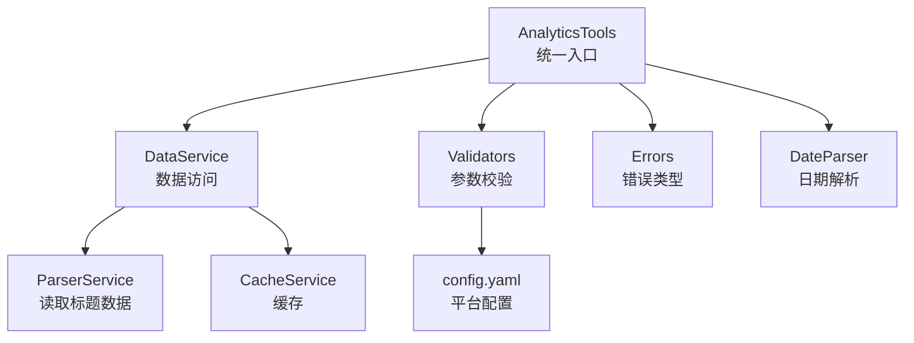
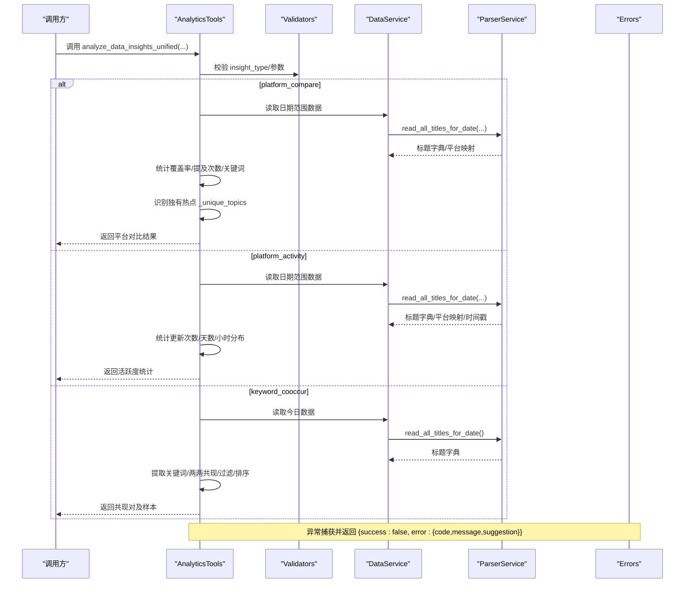
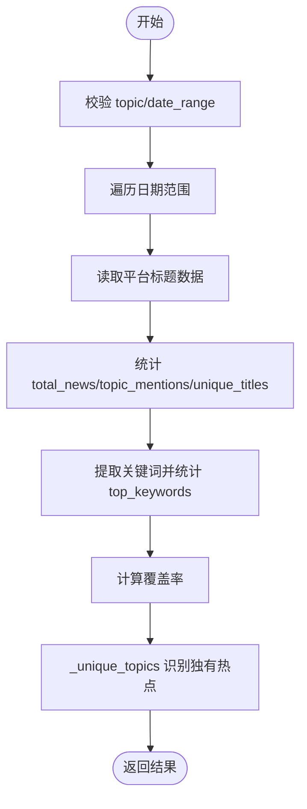
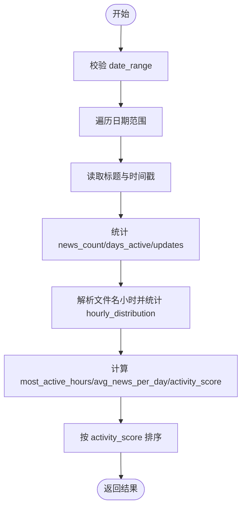
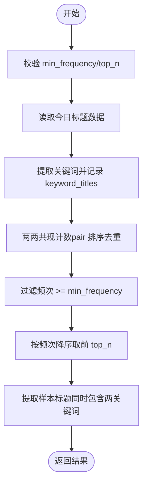
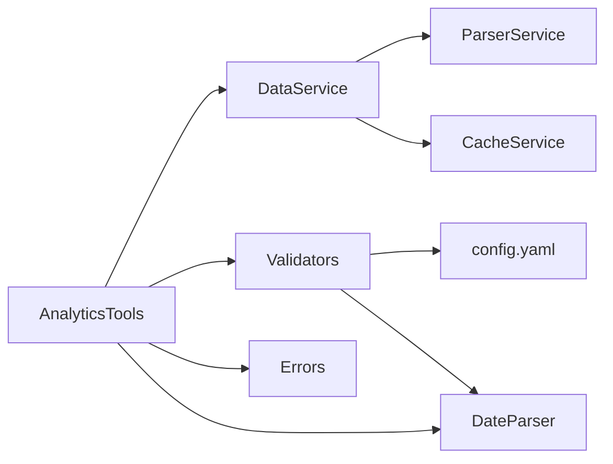

# 数据洞察分析

<cite>
**本文引用的文件**
- [analytics.py](file://mcp_server/tools/analytics.py)
- [data_service.py](file://mcp_server/services/data_service.py)
- [validators.py](file://mcp_server/utils/validators.py)
- [errors.py](file://mcp_server/utils/errors.py)
- [date_parser.py](file://mcp_server/utils/date_parser.py)
- [config.yaml](file://config/config.yaml)
</cite>

## 目录
1. [简介](#简介)
2. [项目结构](#项目结构)
3. [核心组件](#核心组件)
4. [架构总览](#架构总览)
5. [详细组件分析](#详细组件分析)
6. [依赖关系分析](#依赖关系分析)
7. [性能考量](#性能考量)
8. [故障排查指南](#故障排查指南)
9. [结论](#结论)

## 简介
本文围绕“数据洞察分析”能力，聚焦于统一入口方法 analyze_data_insights_unified 及其三种分析模式：
- platform_compare（平台对比）
- platform_activity（平台活跃度）
- keyword_cooccur（关键词共现）

文档将深入解释 compare_platforms 如何统计不同平台对指定话题的关注度（覆盖率、提及次数、关键词提取逻辑），以及 _unique_topics 如何识别各平台独有热点；get_platform_activity_stats 如何统计平台发布频率与活跃时段；analyze_keyword_cooccurrence 如何通过 n-gram 共现统计发现关键词关联关系（共现对生成、频次过滤、样本标题提取）。同时给出输入参数约束、返回结构定义、异常处理流程与典型使用案例。

## 项目结构
- 统一入口位于 mcp_server/tools/analytics.py 的 AnalyticsTools 类，提供 analyze_data_insights_unified 统一调度。
- 数据访问层位于 mcp_server/services/data_service.py，负责从本地 output 目录读取标题数据并提供缓存。
- 参数校验位于 mcp_server/utils/validators.py，涵盖平台、日期范围、关键词、TOP N 等。
- 错误类型位于 mcp_server/utils/errors.py，统一返回结构包含 code、message、suggestion。
- 日期解析位于 mcp_server/utils/date_parser.py，支持自然语言日期表达式。
- 平台配置位于 config/config.yaml，定义支持的平台 id 与名称。

图表来源
- [analytics.py](file://mcp_server/tools/analytics.py#L1-L120)
- [data_service.py](file://mcp_server/services/data_service.py#L1-L120)
- [validators.py](file://mcp_server/utils/validators.py#L1-L120)
- [errors.py](file://mcp_server/utils/errors.py#L1-L60)
- [date_parser.py](file://mcp_server/utils/date_parser.py#L1-L120)
- [config.yaml](file://config/config.yaml#L110-L140)

章节来源
- [analytics.py](file://mcp_server/tools/analytics.py#L1-L120)
- [data_service.py](file://mcp_server/services/data_service.py#L1-L120)
- [validators.py](file://mcp_server/utils/validators.py#L1-L120)
- [errors.py](file://mcp_server/utils/errors.py#L1-L60)
- [date_parser.py](file://mcp_server/utils/date_parser.py#L1-L120)
- [config.yaml](file://config/config.yaml#L110-L140)

## 核心组件
- AnalyticsTools：提供 analyze_data_insights_unified 统一入口与三大分析模式方法。
- DataService：封装数据读取、缓存、统计与系统状态查询。
- Validators：集中参数校验（平台、日期范围、关键词、TOP N、limit 等）。
- Errors：统一错误类型与返回结构。
- DateParser：日期表达式解析与范围计算。
- config.yaml：平台 id 列表与权重配置。

章节来源
- [analytics.py](file://mcp_server/tools/analytics.py#L77-L160)
- [data_service.py](file://mcp_server/services/data_service.py#L1-L120)
- [validators.py](file://mcp_server/utils/validators.py#L1-L120)
- [errors.py](file://mcp_server/utils/errors.py#L1-L60)
- [date_parser.py](file://mcp_server/utils/date_parser.py#L1-L120)
- [config.yaml](file://config/config.yaml#L110-L140)

## 架构总览
统一入口 analyze_data_insights_unified 根据 insight_type 分派到具体分析方法，内部通过 DataService 读取标题数据，借助 Validators 进行参数校验，遇到异常统一捕获并返回带错误码的结构化结果。

图表来源
- [analytics.py](file://mcp_server/tools/analytics.py#L89-L155)
- [data_service.py](file://mcp_server/services/data_service.py#L1-L120)
- [validators.py](file://mcp_server/utils/validators.py#L120-L220)
- [errors.py](file://mcp_server/utils/errors.py#L1-L60)

章节来源
- [analytics.py](file://mcp_server/tools/analytics.py#L89-L155)
- [data_service.py](file://mcp_server/services/data_service.py#L1-L120)
- [validators.py](file://mcp_server/utils/validators.py#L120-L220)
- [errors.py](file://mcp_server/utils/errors.py#L1-L60)

## 详细组件分析

### 统一入口 analyze_data_insights_unified
- 功能：根据 insight_type 调用对应分析方法，统一参数校验与异常处理。
- 输入参数：
  - insight_type: "platform_compare" | "platform_activity" | "keyword_cooccur"
  - topic: 话题关键词（platform_compare 模式适用）
  - date_range: {"start":"YYYY-MM-DD","end":"YYYY-MM-DD"}（可选）
  - min_frequency: 最小共现频次（keyword_cooccur 模式）
  - top_n: 返回 TOP N 结果（keyword_cooccur 模式）
- 返回结构：
  - 成功：包含各模式专属字段的字典
  - 失败：{"success":False,"error":{"code","message"[,"suggestion"]}}
- 异常处理：捕获 MCPError 与通用异常，统一转为错误字典。

章节来源
- [analytics.py](file://mcp_server/tools/analytics.py#L89-L155)
- [validators.py](file://mcp_server/utils/validators.py#L145-L210)
- [errors.py](file://mcp_server/utils/errors.py#L1-L60)

### 模式一：platform_compare（平台对比）
- 功能：对比不同平台对同一话题的关注度，统计覆盖率、提及次数、关键词分布，并识别各平台独有热点。
- 输入参数：
  - topic: 话题关键词（可选）
  - date_range: {"start":"YYYY-MM-DD","end":"YYYY-MM-DD"}（可选）
- 处理流程：
  - 校验参数（topic、date_range）
  - 遍历日期范围，读取各平台标题
  - 统计 total_news、topic_mentions、unique_titles、top_keywords
  - 计算覆盖率 = topic_mentions / total_news（若 total_news>0）
  - 调用 _unique_topics 识别各平台独有关键词
- 关键实现点：
  - 标题遍历与统计：[compare_platforms](file://mcp_server/tools/analytics.py#L402-L511)
  - 关键词提取：_extract_keywords（简单分词+停用词过滤）[参考](file://mcp_server/tools/analytics.py#L1923-L1949)
  - 独有热点识别：_find_unique_topics（基于各平台 TOP 关键词集合差集）[参考](file://mcp_server/tools/analytics.py#L1965-L1996)
- 返回结构要点：
  - platform_stats: 平台维度指标（total_news、topic_mentions、unique_titles、coverage_rate、top_keywords）
  - unique_topics: 各平台独有关键词列表
  - date_range、total_platforms

图表来源
- [analytics.py](file://mcp_server/tools/analytics.py#L402-L511)
- [analytics.py](file://mcp_server/tools/analytics.py#L1923-L1996)

章节来源
- [analytics.py](file://mcp_server/tools/analytics.py#L402-L511)
- [analytics.py](file://mcp_server/tools/analytics.py#L1923-L1996)

### 模式二：platform_activity（平台活跃度）
- 功能：统计各平台发布频率与活跃时段，包括总更新次数、活跃天数、日均新闻数、最活跃时段、活跃度评分。
- 输入参数：
  - date_range: {"start":"YYYY-MM-DD","end":"YYYY-MM-DD"}（可选）
- 处理流程：
  - 校验 date_range
  - 遍历日期范围，读取各平台标题与时间戳
  - 统计 news_count、days_active、total_updates
  - 解析文件名中的小时，统计 hourly_distribution
  - 计算 avg_news_per_day、most_active_hours、activity_score
  - 按 activity_score 排序
- 返回结构要点：
  - platform_activity: 平台维度指标（total_updates、news_count、days_active、avg_news_per_day、most_active_hours、activity_score）
  - most_active_platform、date_range、total_platforms

图表来源
- [analytics.py](file://mcp_server/tools/analytics.py#L1338-L1463)

章节来源
- [analytics.py](file://mcp_server/tools/analytics.py#L1338-L1463)

### 模式三：keyword_cooccur（关键词共现）
- 功能：分析关键词同时出现的模式，生成共现对、过滤低频、排序并返回样本标题。
- 输入参数：
  - min_frequency: 最小共现频次（默认3，上限100）
  - top_n: 返回 TOP N 关键词对（默认20，上限100）
- 处理流程：
  - 校验 min_frequency、top_n
  - 读取今日标题数据
  - 提取关键词，记录每个关键词出现的标题
  - 计算两两共现（统一排序 pair 避免重复）
  - 过滤频次 >= min_frequency
  - 按频次降序取前 top_n
  - 为每对共现提取样本标题（同时包含两个关键词的标题）
- 返回结构要点：
  - cooccurrence_pairs: [{"keyword1","keyword2","cooccurrence_count","sample_titles"}...]
  - total_pairs、min_frequency、generated_at

图表来源
- [analytics.py](file://mcp_server/tools/analytics.py#L526-L616)

章节来源
- [analytics.py](file://mcp_server/tools/analytics.py#L526-L616)

### 关键词提取与相似度辅助方法
- _extract_keywords：移除非字母数字字符，按空格与常见分隔符切分，过滤停用词与短词，返回关键词列表。
- _calculate_similarity：基于 SequenceMatcher 计算文本相似度（0-1）。
- _find_unique_topics：基于各平台 TOP 关键词集合差集，识别独有关键词。

章节来源
- [analytics.py](file://mcp_server/tools/analytics.py#L1923-L1996)

## 依赖关系分析
- AnalyticsTools 依赖：
  - DataService：读取标题数据、平台映射、时间戳
  - Validators：参数校验（平台、日期范围、关键词、TOP N、limit）
  - Errors：统一错误返回
  - DateParser：日期表达式解析（间接用于 date_range 校验）
- DataService 依赖：
  - ParserService：读取 output 目录下的标题数据
  - CacheService：缓存热点结果与系统状态
- Validators 依赖：
  - config.yaml：平台 id 列表
  - DateParser：日期范围校验

图表来源
- [analytics.py](file://mcp_server/tools/analytics.py#L77-L160)
- [data_service.py](file://mcp_server/services/data_service.py#L1-L120)
- [validators.py](file://mcp_server/utils/validators.py#L1-L120)
- [config.yaml](file://config/config.yaml#L110-L140)

章节来源
- [analytics.py](file://mcp_server/tools/analytics.py#L77-L160)
- [data_service.py](file://mcp_server/services/data_service.py#L1-L120)
- [validators.py](file://mcp_server/utils/validators.py#L1-L120)
- [config.yaml](file://config/config.yaml#L110-L140)

## 性能考量
- 缓存策略：DataService 在读取最新/历史数据时使用缓存，减少重复 IO。
- 时间复杂度：
  - platform_compare：对日期范围内的标题进行遍历与统计，时间复杂度约 O(D×P×T)，D 为天数，P 为平台数，T 为日均标题数。
  - platform_activity：同上，额外统计 hourly_distribution，开销略增。
  - keyword_cooccur：两两共现计数，最坏 O(T×K^2)，K 为每条标题关键词数，受限于 min_frequency 与 top_n 的过滤。
- 建议：
  - 合理设置 date_range，避免跨度过大。
  - 使用 top_n 与 min_frequency 控制输出规模。
  - 利用缓存提升重复查询性能。

[本节为通用指导，无需列出具体文件来源]

## 故障排查指南
- 常见错误类型与含义：
  - INVALID_PARAMETER：参数格式或取值不合法（如日期范围、关键词长度、平台不支持等）
  - DATA_NOT_FOUND：未找到匹配数据（如指定日期无数据、关键词未命中）
  - INTERNAL_ERROR：未捕获异常，返回通用错误码
- 定位步骤：
  - 检查 insight_type 是否为受支持值
  - 检查 date_range 是否在未来或超出可用范围
  - 检查 topic 是否为空或超长
  - 检查平台列表是否在 config.yaml 中配置
- 建议：
  - 使用 validate_date_range 与 validate_keyword 等校验函数前置校验
  - 若提示“未找到数据”，尝试扩大日期范围或更换关键词

章节来源
- [errors.py](file://mcp_server/utils/errors.py#L1-L94)
- [validators.py](file://mcp_server/utils/validators.py#L145-L210)
- [data_service.py](file://mcp_server/services/data_service.py#L498-L537)

## 结论
analyze_data_insights_unified 将平台对比、活跃度统计与关键词共现三大分析模式整合在同一入口，配合 Validators 的严格参数校验与 Errors 的统一错误返回，提供了稳定可靠的分析能力。通过 _extract_keywords、_find_unique_topics、_calculate_similarity 等辅助方法，进一步增强了关键词处理与结果解读能力。建议在生产环境中合理设置 date_range、min_frequency、top_n，并结合缓存策略以获得最佳性能与体验。