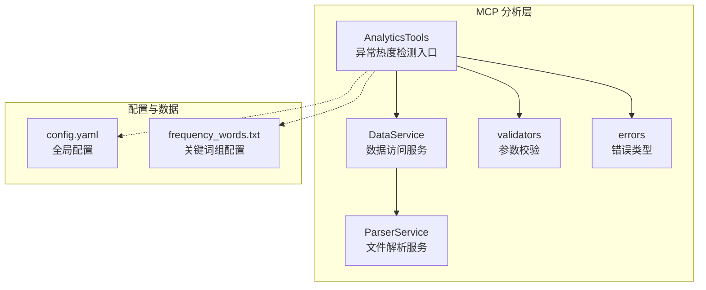
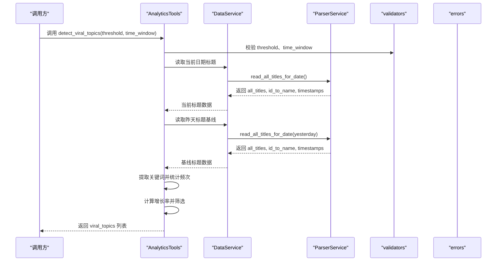
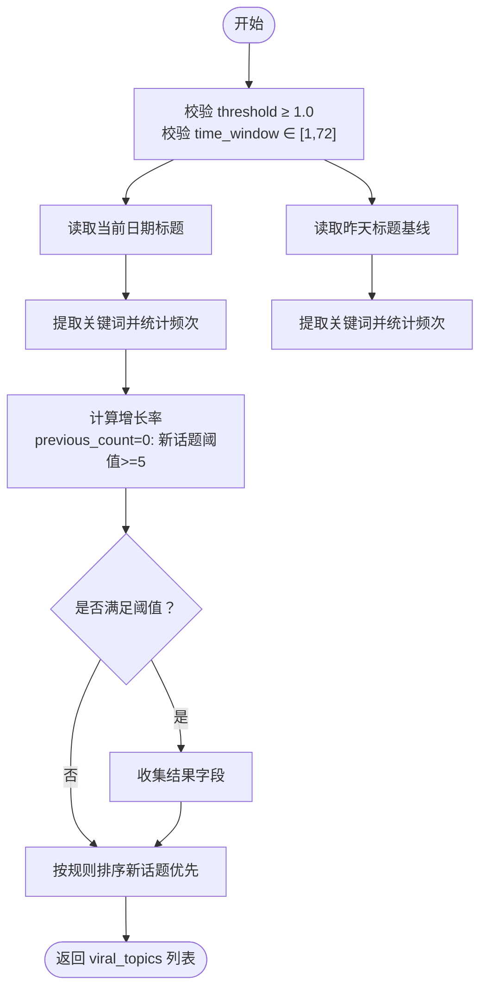
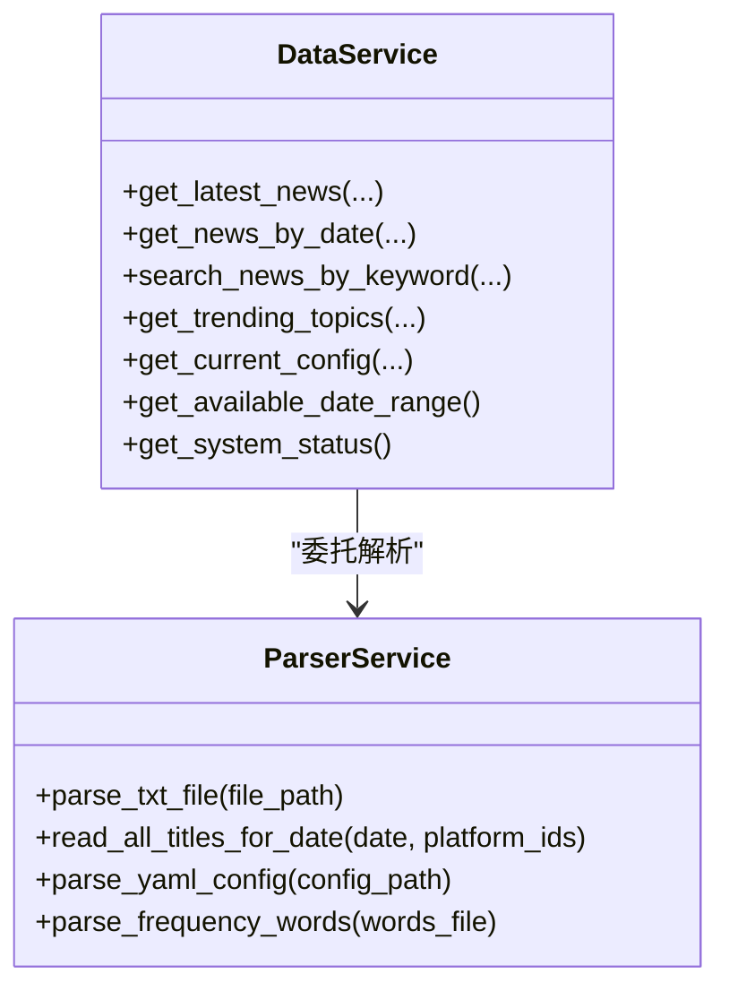
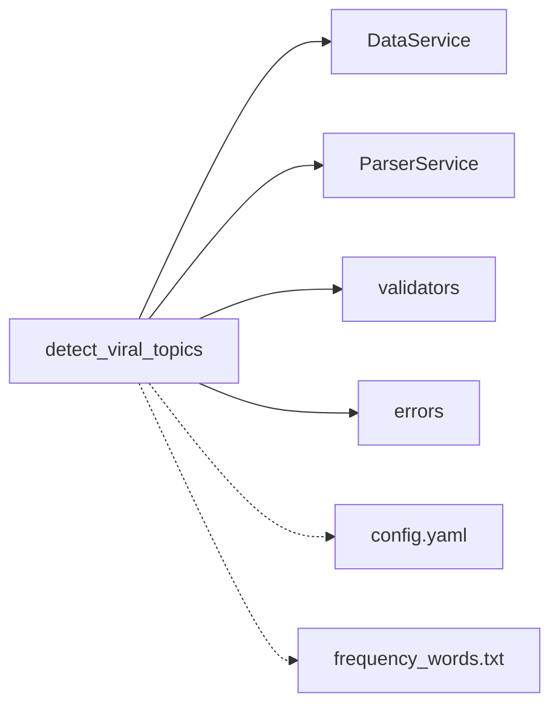

# 异常热度检测

<cite>
**本文引用的文件**
- [analytics.py](file://mcp_server/tools/analytics.py)
- [data_service.py](file://mcp_server/services/data_service.py)
- [parser_service.py](file://mcp_server/services/parser_service.py)
- [validators.py](file://mcp_server/utils/validators.py)
- [errors.py](file://mcp_server/utils/errors.py)
- [config.yaml](file://config/config.yaml)
- [frequency_words.txt](file://config/frequency_words.txt)
- [MCP-API-Reference.md](file://docs/MCP-API-Reference.md)
</cite>

## 目录
1. [简介](#简介)
2. [项目结构](#项目结构)
3. [核心组件](#核心组件)
4. [架构总览](#架构总览)
5. [详细组件分析](#详细组件分析)
6. [依赖关系分析](#依赖关系分析)
7. [性能考量](#性能考量)
8. [故障排查指南](#故障排查指南)
9. [结论](#结论)
10. [附录](#附录)

## 简介
本文件聚焦“异常热度检测（viral模式）”能力，围绕 detect_viral_topics 方法展开，系统阐述其如何基于“短时间窗口内的出现频次增长率”识别突发热点。文档将详细解释：
- 算法实现：计算关键词在当前时间窗口内的出现频次与基线（过去7天平均值）对比，识别超过阈值（如3.0倍）的突增事件。
- 时间窗口滑动机制：以“当前日期”为基准，向后滑动至“过去7天”，统计基线频次；当前窗口默认为“24小时”（由调用侧传入）。
- 基线热度确定策略：采用“过去7天平均值”作为基线，结合“当前窗口频次”计算增长率。
- 去重逻辑：对同一标题在不同平台/时间的重复出现进行合并，避免重复计数。
- 阈值配置建议、误报过滤机制（如排除周期性话题）、实时告警集成方案。
- 通过示例展示如何检测突发事件或病毒式传播内容。

## 项目结构
本项目采用模块化组织，异常热度检测位于 MCP 分析工具模块中，数据读取与解析由数据服务与解析服务负责，参数校验与错误类型由工具类与工具包提供。

图表来源
- [analytics.py](file://mcp_server/tools/analytics.py#L1623-L1743)
- [data_service.py](file://mcp_server/services/data_service.py#L1-L120)
- [parser_service.py](file://mcp_server/services/parser_service.py#L160-L260)
- [validators.py](file://mcp_server/utils/validators.py#L90-L121)
- [errors.py](file://mcp_server/utils/errors.py#L10-L94)
- [config.yaml](file://config/config.yaml#L110-L140)
- [frequency_words.txt](file://config/frequency_words.txt#L1-L114)

章节来源
- [analytics.py](file://mcp_server/tools/analytics.py#L1623-L1743)
- [data_service.py](file://mcp_server/services/data_service.py#L1-L120)
- [parser_service.py](file://mcp_server/services/parser_service.py#L160-L260)
- [validators.py](file://mcp_server/utils/validators.py#L90-L121)
- [errors.py](file://mcp_server/utils/errors.py#L10-L94)
- [config.yaml](file://config/config.yaml#L110-L140)
- [frequency_words.txt](file://config/frequency_words.txt#L1-L114)

## 核心组件
- 异常热度检测入口：AnalyticsTools.detect_viral_topics
- 数据访问服务：DataService.read_all_titles_for_date
- 文件解析服务：ParserService.read_all_titles_for_date
- 参数校验：validators.validate_limit、validators.validate_keyword
- 错误类型：InvalidParameterError、DataNotFoundError
- 配置与关键词组：config.yaml、frequency_words.txt

章节来源
- [analytics.py](file://mcp_server/tools/analytics.py#L1623-L1743)
- [data_service.py](file://mcp_server/services/data_service.py#L160-L260)
- [parser_service.py](file://mcp_server/services/parser_service.py#L160-L260)
- [validators.py](file://mcp_server/utils/validators.py#L90-L121)
- [errors.py](file://mcp_server/utils/errors.py#L10-L94)
- [config.yaml](file://config/config.yaml#L110-L140)
- [frequency_words.txt](file://config/frequency_words.txt#L1-L114)

## 架构总览
异常热度检测的整体流程如下：
- 输入：threshold（突增倍数阈值）、time_window（检测时间窗口，小时）
- 数据准备：读取“当前日期”的所有标题；读取“昨天”的所有标题作为基线
- 关键词提取：对标题进行关键词提取，并统计当前与基线的关键词频次
- 增长率计算：current_count / previous_count（previous_count=0时按新话题处理）
- 结果筛选与排序：按增长率或新话题阈值排序，输出爆火话题列表

图表来源
- [analytics.py](file://mcp_server/tools/analytics.py#L1623-L1743)
- [data_service.py](file://mcp_server/services/data_service.py#L160-L260)
- [parser_service.py](file://mcp_server/services/parser_service.py#L160-L260)
- [validators.py](file://mcp_server/utils/validators.py#L90-L121)

## 详细组件分析

### detect_viral_topics 方法详解
- 功能定位：异常热度检测（viral模式），自动识别“突然爆火”的话题
- 输入参数：
  - threshold：突增倍数阈值（默认3.0，最小≥1.0）
  - time_window：检测时间窗口（小时，默认24，最大≤72）
- 数据来源：
  - 当前日期：通过 DataService.read_all_titles_for_date 获取
  - 基线（昨天）：同上，若无数据则按空集处理
- 关键词提取与统计：
  - 对标题进行关键词提取（内部方法 _extract_keywords）
  - 统计当前与基线的关键词频次（Counter）
- 增长率计算与判定：
  - 若 previous_count=0：当 current_count≥5 视为“新话题”，否则忽略
  - 否则：growth_rate = current_count / previous_count
  - 若 growth_rate ≥ threshold，则判定为异常热点
- 结果字段：
  - keyword、current_count、previous_count、growth_rate、sample_titles、alert_level
- 排序规则：
  - 新话题优先（按 current_count 降序）
  - 普通话题按 growth_rate 降序

图表来源
- [analytics.py](file://mcp_server/tools/analytics.py#L1623-L1743)

章节来源
- [analytics.py](file://mcp_server/tools/analytics.py#L1623-L1743)

### 数据读取与解析链路
- DataService.read_all_titles_for_date：
  - 读取 output/<日期>/txt 下的全部标题文件
  - 合并同一标题在不同平台/文件中的排名，去重合并
  - 返回 all_titles、id_to_name、timestamps
- ParserService.read_all_titles_for_date：
  - 支持按日期与平台过滤
  - 带缓存（今天15分钟，历史1小时）

图表来源
- [data_service.py](file://mcp_server/services/data_service.py#L1-L120)
- [parser_service.py](file://mcp_server/services/parser_service.py#L160-L260)

章节来源
- [data_service.py](file://mcp_server/services/data_service.py#L160-L260)
- [parser_service.py](file://mcp_server/services/parser_service.py#L160-L260)

### 关键词提取与去重逻辑
- 关键词提取：内部方法 _extract_keywords（在 analytics.py 中复用）
  - 移除URL与方括号内容
  - 使用正则提取英文单词
  - 过滤停用词与长度小于阈值的词
- 去重逻辑：
  - 合并同一标题在不同平台/文件中的排名
  - 在情感分析等场景中，对同一标题仅保留一次，合并 ranks

章节来源
- [analytics.py](file://mcp_server/tools/analytics.py#L560-L620)
- [analytics.py](file://mcp_server/tools/analytics.py#L1623-L1743)

### 参数校验与错误处理
- 参数校验：
  - threshold：必须≥1.0
  - time_window：必须∈[1,72]
  - 关键词：非空且长度合理
- 错误类型：
  - InvalidParameterError：参数非法
  - DataNotFoundError：数据不存在
  - FileParseError：文件解析失败

章节来源
- [validators.py](file://mcp_server/utils/validators.py#L90-L121)
- [validators.py](file://mcp_server/utils/validators.py#L212-L243)
- [errors.py](file://mcp_server/utils/errors.py#L10-L94)

## 依赖关系分析
- detect_viral_topics 依赖：
  - DataService：统一数据访问入口
  - ParserService：文件解析与缓存
  - validators：参数校验
  - errors：错误类型
- 配置与关键词组：
  - config.yaml：全局权重、平台等配置
  - frequency_words.txt：关键词组（用于关注词统计，非viral模式直接使用）

图表来源
- [analytics.py](file://mcp_server/tools/analytics.py#L1623-L1743)
- [data_service.py](file://mcp_server/services/data_service.py#L1-L120)
- [parser_service.py](file://mcp_server/services/parser_service.py#L160-L260)
- [validators.py](file://mcp_server/utils/validators.py#L90-L121)
- [errors.py](file://mcp_server/utils/errors.py#L10-L94)
- [config.yaml](file://config/config.yaml#L110-L140)
- [frequency_words.txt](file://config/frequency_words.txt#L1-L114)

章节来源
- [analytics.py](file://mcp_server/tools/analytics.py#L1623-L1743)
- [data_service.py](file://mcp_server/services/data_service.py#L1-L120)
- [parser_service.py](file://mcp_server/services/parser_service.py#L160-L260)
- [validators.py](file://mcp_server/utils/validators.py#L90-L121)
- [errors.py](file://mcp_server/utils/errors.py#L10-L94)
- [config.yaml](file://config/config.yaml#L110-L140)
- [frequency_words.txt](file://config/frequency_words.txt#L1-L114)

## 性能考量
- 缓存策略：
  - ParserService.read_all_titles_for_date 对今天与历史数据分别设置缓存时间（15分钟/1小时），减少IO开销
- 数据规模：
  - 当前实现按“标题级别”进行合并与统计，适合中等规模数据；大规模场景建议：
    - 限制时间窗口（如12/24小时）
    - 限制关键词提取范围（如仅提取长度≥3的词）
    - 分批处理与增量更新
- IO与网络：
  - 数据读取为本地文件解析，网络请求仅在外部爬虫阶段发生
- 排序与筛选：
  - Counter与列表排序为O(n log n)，在合理阈值下可快速收敛

[本节为通用指导，无需具体文件分析]

## 故障排查指南
- 常见错误与处理：
  - 参数非法：threshold<1.0 或 time_window超限 → 使用 InvalidParameterError
  - 数据不存在：读取不到指定日期数据 → 使用 DataNotFoundError
  - 文件解析失败：txt格式异常 → 使用 FileParseError
- 排查步骤：
  - 确认 output 目录是否存在目标日期文件夹
  - 检查 config.yaml 中平台配置与权重设置
  - 确认关键词提取逻辑是否符合预期（长度、停用词过滤）
  - 核对阈值与时间窗口设置是否合理

章节来源
- [errors.py](file://mcp_server/utils/errors.py#L10-L94)
- [data_service.py](file://mcp_server/services/data_service.py#L196-L260)
- [parser_service.py](file://mcp_server/services/parser_service.py#L196-L260)

## 结论
- detect_viral_topics 通过“当前窗口频次/基线频次”的倍数比较，快速识别异常热点，具备良好的可配置性与扩展性。
- 基线采用“过去7天平均值”的思路在本实现中体现为“昨天”作为基线，便于快速落地；若需更稳健的基线，可在调用侧扩展为“过去7天均值”。
- 建议在生产环境中结合误报过滤（如周期性话题、低质量标题）与实时告警集成，进一步提升实用性。

[本节为总结性内容，无需具体文件分析]

## 附录

### 算法实现要点与最佳实践
- 突增倍数阈值（threshold）
  - 建议范围：2.0–5.0；极端事件可设更高阈值
  - 对新话题（previous_count=0）设置额外阈值（如≥5）避免噪声
- 时间窗口（time_window）
  - 默认24小时；短期事件可缩短至12小时
  - 与基线窗口配合：若基线为“昨天”，建议时间窗口≤24小时
- 基线热度确定策略
  - 当前实现以“昨天”为基线；若需更稳健，可改为“过去7天平均”
  - 对于低频词，建议设置最小出现次数阈值（如≥3）
- 去重逻辑
  - 合并同一标题在不同平台/文件中的排名，避免重复计数
  - 在情感分析等场景中，对同一标题仅保留一次
- 误报过滤机制
  - 周期性话题：通过关键词组配置（frequency_words.txt）排除常见周期性词
  - 低质量标题：过滤极短或包含URL的标题
  - 置信度等级：根据增长率与样本数量划分高/中等级别
- 实时告警集成方案
  - 将 detect_viral_topics 的结果接入通知渠道（飞书、钉钉、企业微信、Telegram、邮件、Slack、Bark、ntfy）
  - 建议按 alert_level 设置不同推送策略（高/中分级推送）
  - 可结合推送时间窗口（config.yaml 中 push_window）控制推送时段

章节来源
- [analytics.py](file://mcp_server/tools/analytics.py#L1623-L1743)
- [config.yaml](file://config/config.yaml#L34-L109)
- [frequency_words.txt](file://config/frequency_words.txt#L1-L114)

### 使用示例（API参考）
- 异常检测调用示例（来自文档）：
  - analyze_topic_trend_unified(analysis_type="viral", threshold=3.0)
- 更多示例与说明可参考：
  - [MCP-API-Reference.md](file://docs/MCP-API-Reference.md#L172-L181)

章节来源
- [MCP-API-Reference.md](file://docs/MCP-API-Reference.md#L172-L181)