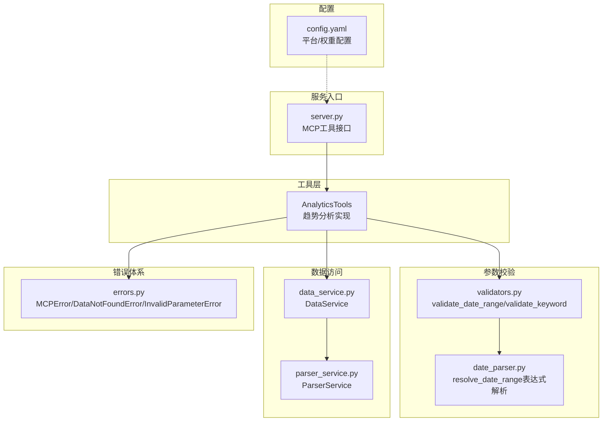
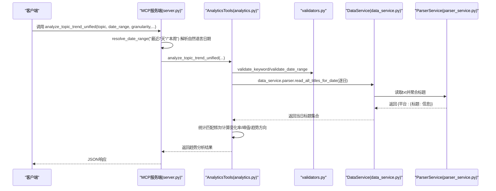
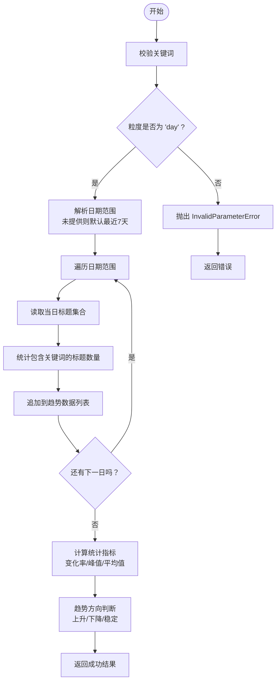
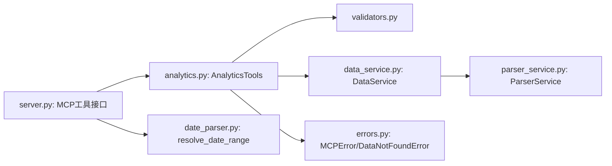

# 热度趋势分析

<cite>
**本文引用的文件**
- [analytics.py](file://mcp_server/tools/analytics.py)
- [validators.py](file://mcp_server/utils/validators.py)
- [errors.py](file://mcp_server/utils/errors.py)
- [parser_service.py](file://mcp_server/services/parser_service.py)
- [data_service.py](file://mcp_server/services/data_service.py)
- [date_parser.py](file://mcp_server/utils/date_parser.py)
- [server.py](file://mcp_server/server.py)
- [config.yaml](file://config/config.yaml)
- [MCP-API-Reference.md](file://docs/MCP-API-Reference.md)
</cite>

## 目录
1. [简介](#简介)
2. [项目结构](#项目结构)
3. [核心组件](#核心组件)
4. [架构总览](#架构总览)
5. [详细组件分析](#详细组件分析)
6. [依赖关系分析](#依赖关系分析)
7. [性能考量](#性能考量)
8. [故障排查指南](#故障排查指南)
9. [结论](#结论)
10. [附录](#附录)

## 简介
本文件聚焦“热度趋势分析（trend模式）”的实现与使用，围绕 get_topic_trend_analysis 方法，系统阐述其按天粒度统计指定话题在日期范围内的出现频次、计算变化率与峰值时间、日期范围处理逻辑、数据聚合过程、趋势方向判断标准、参数验证规则、错误处理策略以及性能优化建议。并通过真实调用示例，展示如何分析“人工智能”“比特币”等话题的短期与长期趋势。

## 项目结构
围绕趋势分析的关键模块与文件如下：
- 工具层：mcp_server/tools/analytics.py 提供统一分析入口与趋势分析实现
- 参数校验：mcp_server/utils/validators.py 提供日期范围、关键词等参数校验
- 错误体系：mcp_server/utils/errors.py 定义统一错误类型
- 数据访问：mcp_server/services/data_service.py 提供数据查询与缓存
- 文件解析：mcp_server/services/parser_service.py 提供txt数据解析与缓存
- 日期解析：mcp_server/utils/date_parser.py 提供自然语言日期解析
- 服务入口：mcp_server/server.py 提供MCP工具接口与调用示例
- 配置：config/config.yaml 提供平台与权重等配置

图表来源
- [analytics.py](file://mcp_server/tools/analytics.py#L156-L399)
- [validators.py](file://mcp_server/utils/validators.py#L145-L209)
- [date_parser.py](file://mcp_server/utils/date_parser.py#L330-L423)
- [data_service.py](file://mcp_server/services/data_service.py#L1-L120)
- [parser_service.py](file://mcp_server/services/parser_service.py#L160-L260)
- [errors.py](file://mcp_server/utils/errors.py#L1-L94)
- [server.py](file://mcp_server/server.py#L240-L289)
- [config.yaml](file://config/config.yaml#L110-L140)

章节来源
- [analytics.py](file://mcp_server/tools/analytics.py#L156-L399)
- [server.py](file://mcp_server/server.py#L240-L289)

## 核心组件
- AnalyticsTools.get_topic_trend_analysis：实现按天粒度统计、变化率与峰值时间计算、趋势方向判断、错误处理与返回结构
- validators.validate_date_range/validate_keyword：参数合法性校验
- data_service.DataService + parser_service.ParserService：按日期读取txt数据并聚合
- errors.MCPError/DataNotFoundError/InvalidParameterError：统一错误类型
- date_parser.DateParser：自然语言日期表达式解析（配合server侧resolve_date_range）

章节来源
- [analytics.py](file://mcp_server/tools/analytics.py#L244-L399)
- [validators.py](file://mcp_server/utils/validators.py#L145-L209)
- [data_service.py](file://mcp_server/services/data_service.py#L1-L120)
- [parser_service.py](file://mcp_server/services/parser_service.py#L160-L260)
- [errors.py](file://mcp_server/utils/errors.py#L1-L94)
- [date_parser.py](file://mcp_server/utils/date_parser.py#L330-L423)

## 架构总览
趋势分析的调用链路如下：
- 客户端通过MCP工具接口调用 analyze_topic_trend_unified
- 服务端解析自然语言日期（resolve_date_range），得到精确日期范围
- AnalyticsTools.validate参数并调用 get_topic_trend_analysis
- get_topic_trend_analysis遍历日期范围，逐日读取标题并统计匹配频次
- 计算变化率、峰值时间、趋势方向，返回结构化结果

图表来源
- [server.py](file://mcp_server/server.py#L240-L289)
- [analytics.py](file://mcp_server/tools/analytics.py#L156-L399)
- [validators.py](file://mcp_server/utils/validators.py#L145-L209)
- [data_service.py](file://mcp_server/services/data_service.py#L140-L182)
- [parser_service.py](file://mcp_server/services/parser_service.py#L160-L260)

## 详细组件分析

### get_topic_trend_analysis 方法详解
- 输入参数
  - topic：话题关键词（必填，经 validate_keyword 校验）
  - date_range：日期范围 {"start": "YYYY-MM-DD", "end": "YYYY-MM-DD"}（可选；未提供时默认最近7天）
  - granularity：时间粒度（trend模式仅支持 "day"；其他粒度将抛出 InvalidParameterError）
- 数据采集与聚合
  - 若提供 date_range：使用 validate_date_range 校验并解析起止日期
  - 若未提供：默认结束时间为当前日期，开始时间为结束时间减去6天（共7天）
  - 遍历日期范围，逐日调用 data_service.parser.read_all_titles_for_date 获取当日标题集合
  - 在所有平台标题中，统计包含关键词的出现次数，记录样本标题（最多3条）
  - 若某日无数据（DataNotFoundError），则该日计数为0，样本为空
- 统计指标与趋势方向
  - total_mentions：所有天数频次之和
  - average_mentions：平均每日频次
  - peak_count：最高频次
  - peak_time：峰值对应的日期
  - change_rate：从首个非零值到末日的百分比变化（若首日为0则按末日与首个非零值计算）
  - trend_direction：上升（>10%）、下降（<-10%）、稳定（-10%~10%）
- 返回结构
  - success、topic、date_range、granularity、trend_data（按日明细）、statistics（统计指标）、trend_direction

图表来源
- [analytics.py](file://mcp_server/tools/analytics.py#L244-L399)
- [validators.py](file://mcp_server/utils/validators.py#L145-L209)
- [data_service.py](file://mcp_server/services/data_service.py#L140-L182)
- [parser_service.py](file://mcp_server/services/parser_service.py#L160-L260)

章节来源
- [analytics.py](file://mcp_server/tools/analytics.py#L244-L399)

### 参数验证规则
- 关键词校验（validate_keyword）
  - 非空、字符串类型、去除空白后长度<=100
- 日期范围校验（validate_date_range）
  - 必须包含 start/end 字段
  - start/end 格式为 "YYYY-MM-DD"
  - start <= end
  - 不允许查询未来日期；若存在可用数据范围，会给出提示
- 粒度校验（get_topic_trend_analysis）
  - 仅支持 "day"；其他值抛出 InvalidParameterError

章节来源
- [validators.py](file://mcp_server/utils/validators.py#L145-L209)
- [validators.py](file://mcp_server/utils/validators.py#L212-L243)
- [analytics.py](file://mcp_server/tools/analytics.py#L288-L308)

### 日期范围处理逻辑
- 未提供 date_range：默认最近7天（结束时间为当前日期，开始时间为结束时间减6天）
- 提供 date_range：使用 validate_date_range 校验，支持 "YYYY-MM-DD" 格式
- 服务端还提供 resolve_date_range 工具，用于将自然语言日期（如“最近7天”“本周”）解析为精确日期范围，再传入趋势分析工具

章节来源
- [analytics.py](file://mcp_server/tools/analytics.py#L288-L308)
- [server.py](file://mcp_server/server.py#L240-L289)
- [date_parser.py](file://mcp_server/utils/date_parser.py#L330-L423)

### 数据聚合过程
- 逐日读取：调用 data_service.parser.read_all_titles_for_date(date=current_date)
- 聚合维度：按平台维度聚合标题，统计包含关键词的标题数量
- 样本保留：仅保留匹配标题的前3条作为示例
- 缺失处理：当某日无数据时捕获 DataNotFoundError，该日计数为0，样本为空

章节来源
- [analytics.py](file://mcp_server/tools/analytics.py#L313-L344)
- [data_service.py](file://mcp_server/services/data_service.py#L140-L182)
- [parser_service.py](file://mcp_server/services/parser_service.py#L160-L260)

### 趋势方向判断标准
- change_rate 计算：以首个非零值为基准，计算末日与首非零值的百分比变化
- 判断规则：
  - 上升：change_rate > 10%
  - 下降：change_rate < -10%
  - 稳定：-10% <= change_rate <= 10%

章节来源
- [analytics.py](file://mcp_server/tools/analytics.py#L349-L386)

### 错误处理策略
- 参数错误：InvalidParameterError（如粒度不支持、日期范围非法、关键词非法）
- 数据不存在：DataNotFoundError（如某日无数据、日期在未来、配置文件缺失等）
- 统一错误包装：MCPError.to_dict 输出标准错误结构，便于前端或客户端展示

章节来源
- [errors.py](file://mcp_server/utils/errors.py#L1-L94)
- [validators.py](file://mcp_server/utils/validators.py#L145-L209)
- [analytics.py](file://mcp_server/tools/analytics.py#L335-L344)

### 性能优化建议
- 避免高频调用：trend分析按天遍历，频繁调用会产生大量IO与解析开销
- 合理使用缓存：ParserService/read_all_titles_for_date 已内置缓存（今天15分钟，历史1小时），尽量复用已有结果
- 限制日期范围：尽量缩小分析区间，减少遍历天数
- 降低粒度：trend模式仅支持 "day"，避免不必要的参数切换
- 平台过滤：若只需特定平台，可在上游调用时传入平台过滤（虽趋势分析内部未直接使用平台过滤，但可减少标题总量）

章节来源
- [parser_service.py](file://mcp_server/services/parser_service.py#L160-L260)
- [data_service.py](file://mcp_server/services/data_service.py#L140-L182)

### 实际调用示例
- 短期趋势（最近7天）
  - 先调用 resolve_date_range("最近7天") 获取精确日期范围
  - 再调用 analyze_topic_trend_unified(topic="人工智能", analysis_type="trend", date_range=...)
- 长期趋势（历史月份）
  - 直接构造 date_range={"start": "2024-12-01", "end": "2024-12-31"}
  - 调用 analyze_topic_trend_unified(topic="特斯拉", analysis_type="trend", date_range=...)
- 异常检测/生命周期/预测
  - 可通过 analysis_type 切换至 "viral"/"lifecycle"/"predict"，并按需传入 threshold、time_window、lookahead_hours、confidence_threshold 等参数

章节来源
- [server.py](file://mcp_server/server.py#L240-L289)
- [MCP-API-Reference.md](file://docs/MCP-API-Reference.md#L135-L181)

## 依赖关系分析
- AnalyticsTools 依赖 validators（参数校验）、data_service（数据访问）、errors（错误类型）
- data_service 依赖 parser_service（文件解析）与缓存
- 服务端 server.py 提供MCP工具接口，负责将自然语言日期解析为精确日期范围后再调用工具

图表来源
- [analytics.py](file://mcp_server/tools/analytics.py#L156-L399)
- [validators.py](file://mcp_server/utils/validators.py#L145-L209)
- [data_service.py](file://mcp_server/services/data_service.py#L1-L120)
- [parser_service.py](file://mcp_server/services/parser_service.py#L160-L260)
- [errors.py](file://mcp_server/utils/errors.py#L1-L94)
- [server.py](file://mcp_server/server.py#L240-L289)
- [date_parser.py](file://mcp_server/utils/date_parser.py#L330-L423)

## 性能考量
- IO与解析成本：逐日读取txt并解析标题，建议避免频繁调用
- 缓存策略：ParserService对今天与历史数据分别设置不同TTL，充分利用缓存
- 数据规模：标题越多，匹配成本越高；可通过平台过滤减少标题总量
- 粒度与范围：粒度仅支持 "day"，范围越长，遍历越多；建议按需缩短范围

章节来源
- [parser_service.py](file://mcp_server/services/parser_service.py#L160-L260)
- [data_service.py](file://mcp_server/services/data_service.py#L140-L182)

## 故障排查指南
- “不支持的粒度参数”
  - 症状：传入 "hour" 等不支持粒度
  - 处理：仅使用 "day"
- “日期范围无效/未来日期”
  - 症状：start/end格式错误或未来日期
  - 处理：使用 validate_date_range 或先调用 resolve_date_range
- “未找到相关新闻”
  - 症状：某日无数据或关键词匹配不到
  - 处理：检查日期范围、平台配置、关键词拼写；确认数据目录存在
- “参数为空/类型错误”
  - 症状：topic为空、limit非整数、date_range非字典
  - 处理：遵循API规范，确保参数类型与长度符合要求

章节来源
- [validators.py](file://mcp_server/utils/validators.py#L145-L209)
- [errors.py](file://mcp_server/utils/errors.py#L1-L94)
- [analytics.py](file://mcp_server/tools/analytics.py#L335-L344)

## 结论
get_topic_trend_analysis 以“按天粒度”的方式，对指定话题在给定日期范围内的出现频次进行统计，并计算变化率、峰值时间与趋势方向。其实现依托于严格的参数校验、稳健的错误处理与高效的缓存机制。通过合理使用 resolve_date_range、控制日期范围与调用频率，可获得稳定且高性能的趋势分析结果。

## 附录
- 配置参考
  - 平台配置：config/config.yaml 中 platforms 定义支持的平台ID与名称
  - 权重配置：weight.rank_weight/frequency_weight/hotness_weight 用于热点排序权重（与趋势分析无直接耦合，但影响整体排序）

章节来源
- [config.yaml](file://config/config.yaml#L110-L140)