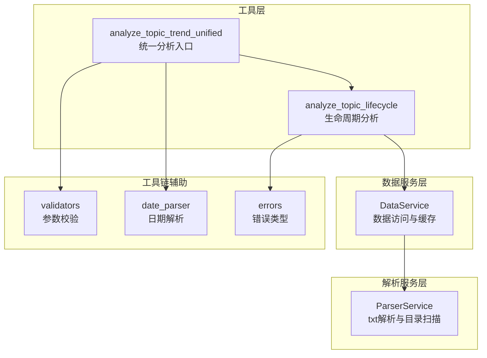
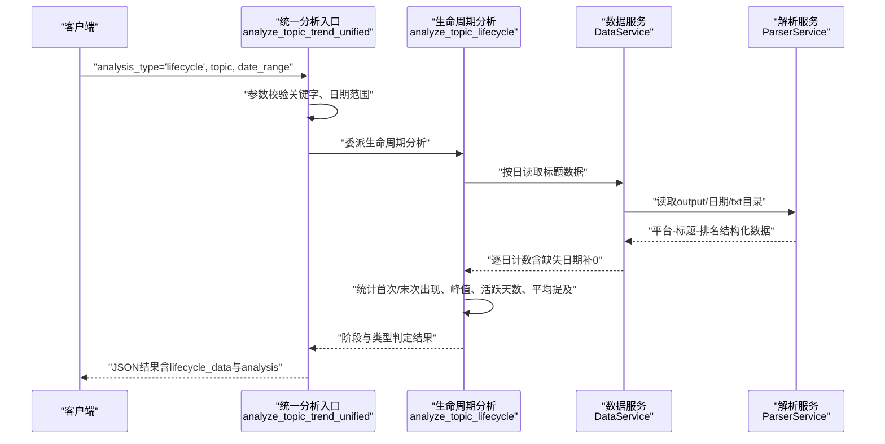
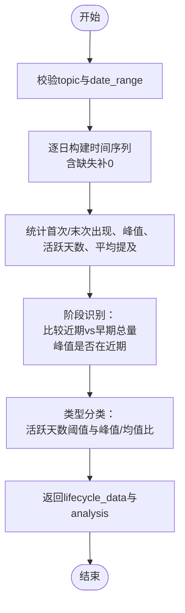
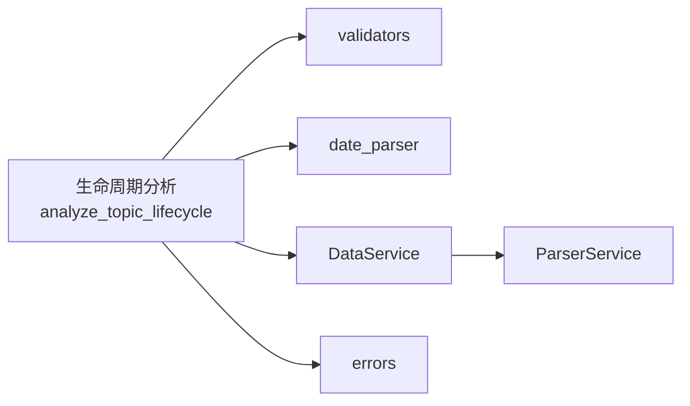

# 生命周期分析

<cite>
**本文引用的文件**
- [mcp_server/tools/analytics.py](file://mcp_server/tools/analytics.py)
- [mcp_server/services/data_service.py](file://mcp_server/services/data_service.py)
- [mcp_server/services/parser_service.py](file://mcp_server/services/parser_service.py)
- [mcp_server/utils/validators.py](file://mcp_server/utils/validators.py)
- [mcp_server/utils/date_parser.py](file://mcp_server/utils/date_parser.py)
- [mcp_server/utils/errors.py](file://mcp_server/utils/errors.py)
- [docs/MCP-API-Reference.md](file://docs/MCP-API-Reference.md)
- [config/config.yaml](file://config/config.yaml)
- [config/frequency_words.txt](file://config/frequency_words.txt)
</cite>

## 目录
1. [简介](#简介)
2. [项目结构](#项目结构)
3. [核心组件](#核心组件)
4. [架构总览](#架构总览)
5. [详细组件分析](#详细组件分析)
6. [依赖关系分析](#依赖关系分析)
7. [性能考量](#性能考量)
8. [故障排查指南](#故障排查指南)
9. [结论](#结论)
10. [附录](#附录)

## 简介
本文件围绕“话题生命周期分析（lifecycle模式）”展开，系统性阐述 analyze_topic_lifecycle 方法如何建模话题从“首次显著出现（萌芽）”、“爆发”到“持续下降（衰退）”的完整周期；解释基于时间序列的阶段识别算法（通过比较近期与早期的总量趋势、峰值位置与活跃天数、平均提及次数等指标）；说明如何结合历史数据进行周期完整性判断及跨时间段的不连续数据处理；给出阶段划分的量化标准、异常情况处理机制（如热度反复波动）与结果可视化建议，并提供一个从兴起至消退的完整案例分析流程。

## 项目结构
生命周期分析位于高级分析工具模块中，围绕以下层次组织：
- 工具层：对外暴露统一分析入口 analyze_topic_trend_unified，内部根据 analysis_type 分派到具体分析方法（含生命周期分析）。
- 数据服务层：封装数据访问与缓存，提供按日期读取标题数据的能力。
- 解析服务层：负责解析输出目录下的txt数据文件，构建平台-标题-排名等结构化数据。
- 工具链辅助：参数校验、日期解析、错误类型等。

图表来源
- [mcp_server/tools/analytics.py](file://mcp_server/tools/analytics.py#L156-L242)
- [mcp_server/tools/analytics.py](file://mcp_server/tools/analytics.py#L1465-L1621)
- [mcp_server/services/data_service.py](file://mcp_server/services/data_service.py#L1-L120)
- [mcp_server/services/parser_service.py](file://mcp_server/services/parser_service.py#L160-L260)
- [mcp_server/utils/validators.py](file://mcp_server/utils/validators.py#L145-L209)
- [mcp_server/utils/date_parser.py](file://mcp_server/utils/date_parser.py#L330-L423)
- [mcp_server/utils/errors.py](file://mcp_server/utils/errors.py#L1-L94)

章节来源
- [mcp_server/tools/analytics.py](file://mcp_server/tools/analytics.py#L156-L242)
- [mcp_server/tools/analytics.py](file://mcp_server/tools/analytics.py#L1465-L1621)
- [mcp_server/services/data_service.py](file://mcp_server/services/data_service.py#L1-L120)
- [mcp_server/services/parser_service.py](file://mcp_server/services/parser_service.py#L160-L260)
- [mcp_server/utils/validators.py](file://mcp_server/utils/validators.py#L145-L209)
- [mcp_server/utils/date_parser.py](file://mcp_server/utils/date_parser.py#L330-L423)
- [mcp_server/utils/errors.py](file://mcp_server/utils/errors.py#L1-L94)

## 核心组件
- 生命周期分析入口：analyze_topic_trend_unified 在 analysis_type="lifecycle" 时委派到 analyze_topic_lifecycle。
- 生命周期分析实现：analyze_topic_lifecycle 通过 DataService.ParserService 逐日采集话题出现次数，构建时间序列，计算首次/末次出现、峰值、活跃天数、平均每日提及等指标，并据此判定阶段与类型。
- 参数与日期处理：validate_date_range、validate_keyword 等保证输入合法；DateParser 支持自然语言日期表达式解析。
- 错误与异常：统一抛出 MCPError 子类，便于上层捕获与提示。

章节来源
- [mcp_server/tools/analytics.py](file://mcp_server/tools/analytics.py#L156-L242)
- [mcp_server/tools/analytics.py](file://mcp_server/tools/analytics.py#L1465-L1621)
- [mcp_server/utils/validators.py](file://mcp_server/utils/validators.py#L145-L209)
- [mcp_server/utils/date_parser.py](file://mcp_server/utils/date_parser.py#L330-L423)
- [mcp_server/utils/errors.py](file://mcp_server/utils/errors.py#L1-L94)

## 架构总览
生命周期分析的调用链如下所示：

图表来源
- [mcp_server/tools/analytics.py](file://mcp_server/tools/analytics.py#L156-L242)
- [mcp_server/tools/analytics.py](file://mcp_server/tools/analytics.py#L1465-L1621)
- [mcp_server/services/data_service.py](file://mcp_server/services/data_service.py#L104-L182)
- [mcp_server/services/parser_service.py](file://mcp_server/services/parser_service.py#L160-L260)

## 详细组件分析

### 生命周期分析方法：analyze_topic_lifecycle
- 输入：topic（关键词）、date_range（可选，默认最近7天）。
- 输出：包含原始时间序列 lifecycle_data 与分析摘要 analysis 的结果对象。
- 关键步骤：
  - 日期范围校验与默认值处理。
  - 逐日遍历，调用 ParserService.read_all_titles_for_date 获取平台-标题-排名数据，统计当日包含关键词的新闻数量，若某日无数据则计数为0。
  - 计算首次出现与最后出现日期、峰值及其日期、活跃天数（非零天数）、平均每日提及（非零天的均值）。
  - 阶段识别：
    - 比较最近3天总量与前3天总量：若近期更高则为“上升期”，若近期低于早期总量的一半则为“衰退期”。
    - 若峰值出现在近期，则为“爆发期”。
    - 否则为“稳定期”。
  - 类型分类：
    - 若活跃天数≤2且峰值显著高于平均提及，则归类为“昙花一现”。
    - 若活跃天数≥总天数的60%，则为“持续热点”。
    - 否则为“周期性热点”。

图表来源
- [mcp_server/tools/analytics.py](file://mcp_server/tools/analytics.py#L1465-L1621)

章节来源
- [mcp_server/tools/analytics.py](file://mcp_server/tools/analytics.py#L1465-L1621)

### 生命周期阶段识别算法
- 阶段划分依据：
  - 上升期：近期3天总量 > 前3天总量。
  - 爆发期：峰值出现在近期3天内。
  - 衰退期：近期3天总量 < 前3天总量的一半。
  - 稳定期：以上条件均不满足。
- 类型划分依据：
  - 昙花一现：活跃天数≤2 且 峰值 > 平均提及×2。
  - 持续热点：活跃天数 ≥ 总天数×60%。
  - 周期性热点：其他情况。
- 周期完整性判断：
  - 通过首次出现与最后出现日期确定话题的起止区间，结合活跃天数与峰值位置评估周期是否完整。
  - 若某日无数据，按0计数，不影响整体趋势判断，但会影响平均提及与活跃天数统计。

章节来源
- [mcp_server/tools/analytics.py](file://mcp_server/tools/analytics.py#L1542-L1607)

### 跨时间段不连续数据处理
- 逐日遍历策略：无论某日是否存在数据，都会生成一条记录（缺失时计数为0），从而保证时间序列的连续性，便于阶段识别与趋势分析。
- 数据缺失场景：
  - 当某日无数据文件或解析失败时，抛出 DataNotFoundError，生命周期分析捕获并返回错误；在趋势分析中，会将该日计数置0。
- 历史数据可用范围：
  - DataService 提供 get_available_date_range，可用于提示用户可用的历史范围，避免查询未来或过远日期。

章节来源
- [mcp_server/tools/analytics.py](file://mcp_server/tools/analytics.py#L1510-L1541)
- [mcp_server/services/data_service.py](file://mcp_server/services/data_service.py#L498-L537)
- [mcp_server/utils/validators.py](file://mcp_server/utils/validators.py#L145-L209)

### 量化标准与异常处理机制
- 量化标准（来自实现细节）：
  - 阶段阈值：近期3天总量与前3天总量的比较；近期总量与早期总量一半的比较；峰值是否在近期。
  - 类型阈值：活跃天数≤2；峰值/平均提及>2；活跃天数≥总天数×60%。
- 异常与边界情况：
  - 无匹配话题：当时间窗内无任何提及，抛出 DataNotFoundError 并提示扩大范围。
  - 日期范围非法：validate_date_range 校验 start/end、未来日期与可用范围。
  - 关键词非法：validate_keyword 校验非空、长度限制。
  - 统一错误包装：MCPError 及子类（InvalidParameterError、DataNotFoundError）便于上层处理。

章节来源
- [mcp_server/tools/analytics.py](file://mcp_server/tools/analytics.py#L1542-L1607)
- [mcp_server/utils/validators.py](file://mcp_server/utils/validators.py#L145-L209)
- [mcp_server/utils/errors.py](file://mcp_server/utils/errors.py#L1-L94)

### 结果可视化建议
- 建议图表类型：
  - 折线图：展示每日提及次数随时间的变化，标注首次出现、峰值、最后出现日期。
  - 柱状图：展示活跃天数、平均每日提及、峰值。
  - 阶段标签：在折线图上叠加阶段标签（上升期/爆发期/稳定期/衰退期）。
- 交互建议：
  - 支持缩放与平移查看长周期。
  - 高亮显示“昙花一现”“持续热点”“周期性热点”的类型标识。
- 输出字段参考：
  - lifecycle_data：按日的计数序列。
  - analysis：首次/末次出现、峰值、活跃天数、平均每日提及、阶段、类型。

章节来源
- [mcp_server/tools/analytics.py](file://mcp_server/tools/analytics.py#L1588-L1607)

### 实际案例：从兴起至消退的全过程
- 场景设定：以“某科技产品”为例，假设其热度在某周内逐步上升，随后在周末达到峰值，之后连续数日回落。
- 分析步骤：
  1) 选择日期范围（如最近7天或更长），调用 analyze_topic_trend_unified，analysis_type="lifecycle"。
  2) 查看 lifecycle_data 的每日计数曲线，定位首次出现、峰值与最后出现日期。
  3) 根据阶段识别规则判断：若近期总量明显高于早期为“上升期”，若峰值出现在近期为“爆发期”，若近期总量显著低于早期一半为“衰退期”，否则为“稳定期”。
  4) 根据类型阈值判断：若活跃天数短且峰值高为“昙花一现”，若活跃天数长为“持续热点”，否则为“周期性热点”。
  5) 可视化：绘制折线图并标注阶段与类型，辅助决策后续运营或监测策略。
- 注意事项：
  - 若某日无数据，按0计数，不会改变整体趋势形态，但会影响平均提及与活跃天数。
  - 如遇未来日期或超出可用范围，需调整日期范围或等待数据生成。

章节来源
- [mcp_server/tools/analytics.py](file://mcp_server/tools/analytics.py#L1465-L1621)
- [docs/MCP-API-Reference.md](file://docs/MCP-API-Reference.md#L150-L181)

## 依赖关系分析
生命周期分析依赖于以下模块与服务：
- 参数与日期：validators（validate_keyword、validate_date_range）、date_parser（resolve_date_range_expression）。
- 数据访问：DataService（按日读取标题数据、缓存、可用日期范围）。
- 数据解析：ParserService（读取output/日期/txt目录，解析txt为平台-标题-排名结构）。
- 错误处理：errors（MCPError、InvalidParameterError、DataNotFoundError）。

图表来源
- [mcp_server/tools/analytics.py](file://mcp_server/tools/analytics.py#L1465-L1621)
- [mcp_server/utils/validators.py](file://mcp_server/utils/validators.py#L145-L209)
- [mcp_server/utils/date_parser.py](file://mcp_server/utils/date_parser.py#L330-L423)
- [mcp_server/services/data_service.py](file://mcp_server/services/data_service.py#L1-L120)
- [mcp_server/services/parser_service.py](file://mcp_server/services/parser_service.py#L160-L260)
- [mcp_server/utils/errors.py](file://mcp_server/utils/errors.py#L1-L94)

章节来源
- [mcp_server/tools/analytics.py](file://mcp_server/tools/analytics.py#L1465-L1621)
- [mcp_server/utils/validators.py](file://mcp_server/utils/validators.py#L145-L209)
- [mcp_server/utils/date_parser.py](file://mcp_server/utils/date_parser.py#L330-L423)
- [mcp_server/services/data_service.py](file://mcp_server/services/data_service.py#L1-L120)
- [mcp_server/services/parser_service.py](file://mcp_server/services/parser_service.py#L160-L260)
- [mcp_server/utils/errors.py](file://mcp_server/utils/errors.py#L1-L94)

## 性能考量
- 数据读取与缓存：
  - ParserService 对今日与历史数据分别采用不同的缓存时长，减少IO压力。
  - DataService 对最新新闻、按日新闻、可用日期范围等进行缓存，提升重复查询效率。
- 时间复杂度：
  - 生命周期分析按日遍历，时间复杂度 O(D)，D为日期跨度；对每日常规计数 O(N)，N为当日平台-标题数量，总体 O(D×N)。
- I/O与并发：
  - 逐日顺序读取，未做并发；若数据量增大，可考虑按日期分片并行读取（需评估文件系统与缓存一致性）。
- 内存占用：
  - 生命周期数据序列保存在内存中，建议在长周期分析时注意内存上限，必要时分段处理或落盘。

章节来源
- [mcp_server/services/parser_service.py](file://mcp_server/services/parser_service.py#L160-L260)
- [mcp_server/services/data_service.py](file://mcp_server/services/data_service.py#L1-L120)

## 故障排查指南
- 常见错误与处理：
  - DATA_NOT_FOUND：当日期范围内无匹配话题或无数据文件时触发。建议扩大日期范围或确认关键词拼写。
  - INVALID_PARAMETER：当日期范围非法、未来日期或关键词超长时触发。建议使用 validate_date_range 与 validate_keyword 校验。
  - FILE_PARSE_ERROR：当txt文件格式异常时触发。建议检查数据文件格式或重新运行爬虫。
- 日期范围提示：
  - 使用 DataService.get_available_date_range 获取可用范围，避免查询未来或过远日期。
- API调用建议：
  - 先用 resolve_date_range 解析自然语言日期表达式，再调用 analyze_topic_trend_unified。

章节来源
- [mcp_server/utils/errors.py](file://mcp_server/utils/errors.py#L1-L94)
- [mcp_server/utils/validators.py](file://mcp_server/utils/validators.py#L145-L209)
- [mcp_server/services/data_service.py](file://mcp_server/services/data_service.py#L498-L537)
- [docs/MCP-API-Reference.md](file://docs/MCP-API-Reference.md#L150-L181)

## 结论
生命周期分析通过“首次出现—爆发—衰退”的阶段识别与“昙花一现—持续热点—周期性热点”的类型划分，为话题全周期监测提供了清晰的量化框架。其核心在于以逐日计数构建连续时间序列，并结合近期与早期总量、峰值位置与活跃天数等指标进行综合判断。配合历史数据可用范围提示与错误处理机制，可在真实业务场景中稳定落地。建议在可视化层面强化阶段与类型的标注，并针对长周期分析优化缓存与I/O策略，以获得更好的性能与用户体验。

## 附录
- 配置与关键词：
  - 权重配置（rank_weight、frequency_weight、hotness_weight）影响综合权重计算，但与生命周期分析无直接关系。
  - 关注词列表（frequency_words.txt）用于“关注度更高新闻排序”等场景，生命周期分析使用关键词匹配标题实现。
- API参考：
  - analyze_topic_trend_unified 支持 lifecycle 模式，参数包括 topic、date_range、analysis_type 等。

章节来源
- [config/config.yaml](file://config/config.yaml#L110-L140)
- [config/frequency_words.txt](file://config/frequency_words.txt#L1-L114)
- [docs/MCP-API-Reference.md](file://docs/MCP-API-Reference.md#L150-L181)