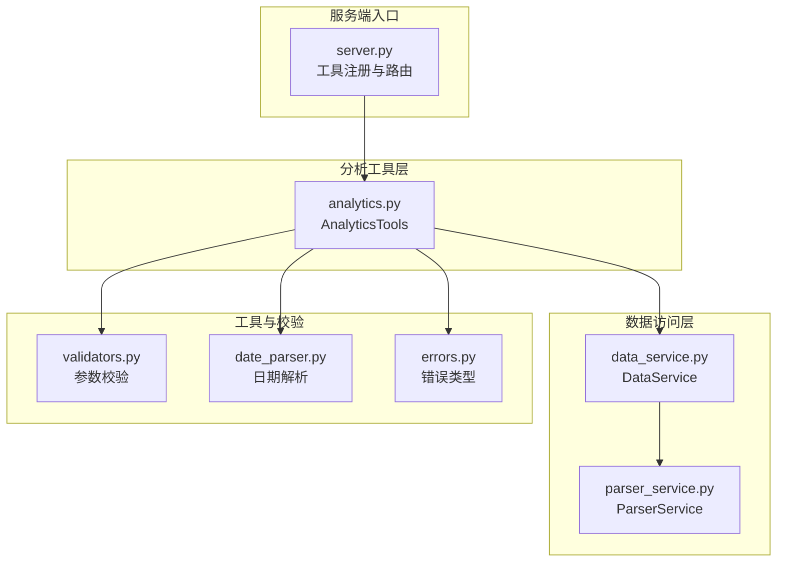
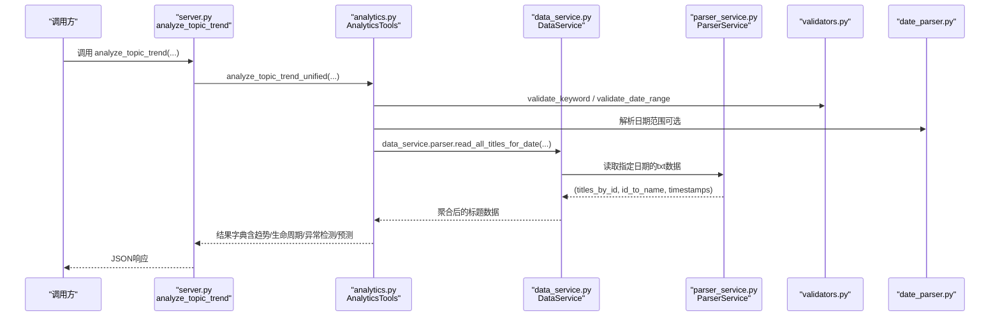
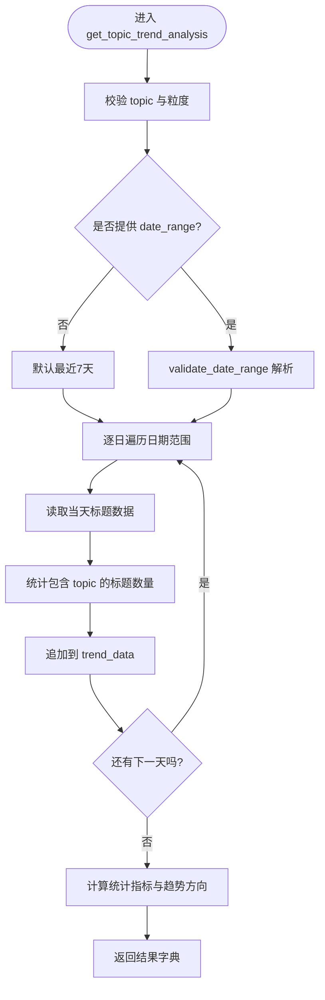
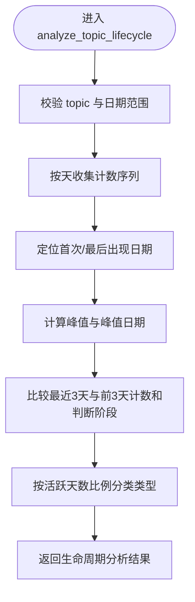
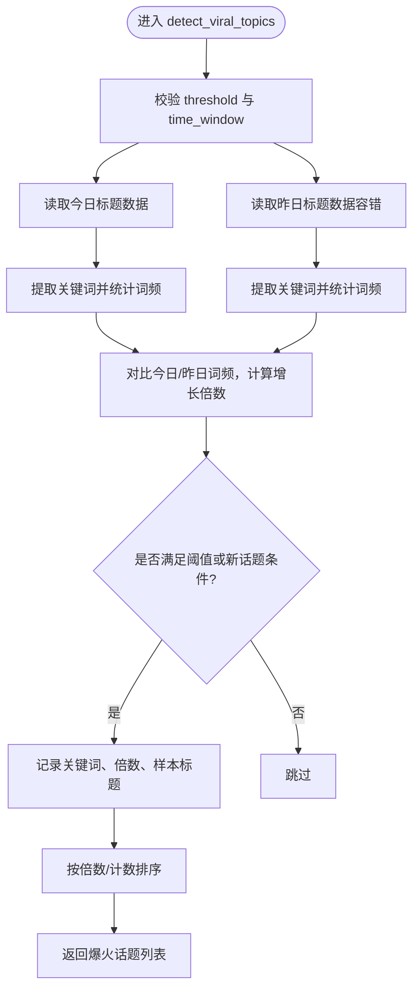
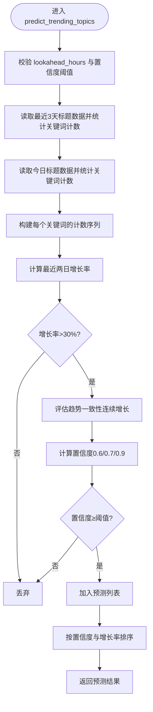
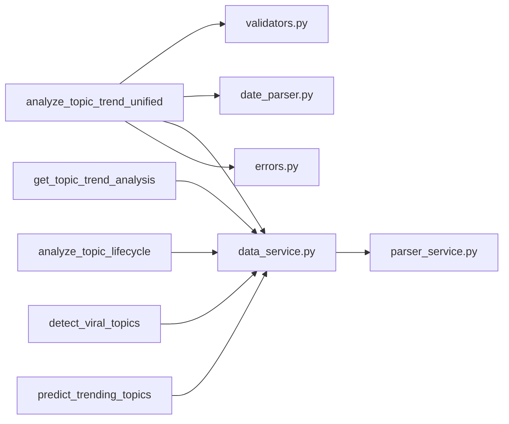

# 话题趋势分析

<cite>
**本文引用的文件**
- [mcp_server/tools/analytics.py](file://mcp_server/tools/analytics.py)
- [mcp_server/server.py](file://mcp_server/server.py)
- [mcp_server/services/data_service.py](file://mcp_server/services/data_service.py)
- [mcp_server/services/parser_service.py](file://mcp_server/services/parser_service.py)
- [mcp_server/utils/validators.py](file://mcp_server/utils/validators.py)
- [mcp_server/utils/date_parser.py](file://mcp_server/utils/date_parser.py)
- [mcp_server/utils/errors.py](file://mcp_server/utils/errors.py)
</cite>

## 目录
1. [简介](#简介)
2. [项目结构](#项目结构)
3. [核心组件](#核心组件)
4. [架构总览](#架构总览)
5. [详细组件分析](#详细组件分析)
6. [依赖关系分析](#依赖关系分析)
7. [性能考量](#性能考量)
8. [故障排查指南](#故障排查指南)
9. [结论](#结论)
10. [附录](#附录)

## 简介
本文件围绕“话题趋势分析”能力，系统梳理并深入解读统一入口方法 analyze_topic_trend_unified 及其四种分析模式：trend（热度趋势）、lifecycle（生命周期）、viral（异常热度检测）、predict（话题预测）。文档重点覆盖：
- get_topic_trend_analysis 如何按天粒度统计话题出现频次并计算变化率与峰值时间，包括日期范围处理、数据聚合逻辑与趋势方向判断；
- analyze_topic_lifecycle 如何对完整生命周期进行建模，识别萌芽、爆发、衰退等阶段；
- detect_viral_topics 如何基于突增倍数阈值与时间窗口检测突发热点；
- predict_trending_topics 如何基于历史模式进行未来预测；
- 参数验证规则、错误处理策略与性能优化建议；
- 结合实际调用示例展示使用场景。

## 项目结构
该能力位于 MCP 服务端模块中，核心入口为 server.py 的 analyze_topic_trend 工具，内部委托 mcp_server/tools/analytics.py 的 AnalyticsTools 类完成具体分析逻辑；数据读取由 mcp_server/services/data_service.py 与 mcp_server/services/parser_service.py 提供；参数校验与日期解析分别由 mcp_server/utils/validators.py 与 mcp_server/utils/date_parser.py 提供；错误类型由 mcp_server/utils/errors.py 定义。

图表来源
- [mcp_server/server.py](file://mcp_server/server.py#L227-L289)
- [mcp_server/tools/analytics.py](file://mcp_server/tools/analytics.py#L156-L243)
- [mcp_server/services/data_service.py](file://mcp_server/services/data_service.py#L17-L40)
- [mcp_server/services/parser_service.py](file://mcp_server/services/parser_service.py#L160-L261)
- [mcp_server/utils/validators.py](file://mcp_server/utils/validators.py#L145-L210)
- [mcp_server/utils/date_parser.py](file://mcp_server/utils/date_parser.py#L330-L424)
- [mcp_server/utils/errors.py](file://mcp_server/utils/errors.py#L10-L94)

章节来源
- [mcp_server/server.py](file://mcp_server/server.py#L227-L289)
- [mcp_server/tools/analytics.py](file://mcp_server/tools/analytics.py#L156-L243)

## 核心组件
- 统一入口方法 analyze_topic_trend_unified：根据 analysis_type 分派到具体分析函数，负责参数校验与错误捕获。
- get_topic_trend_analysis：按天统计话题出现频次，计算变化率、峰值时间与趋势方向。
- analyze_topic_lifecycle：追踪话题从出现到消失的完整周期，识别阶段与类型。
- detect_viral_topics：基于当前与昨日关键词频次对比，检测异常热度话题。
- predict_trending_topics：基于最近3天关键词趋势，预测未来上升潜力话题。

章节来源
- [mcp_server/tools/analytics.py](file://mcp_server/tools/analytics.py#L156-L243)
- [mcp_server/tools/analytics.py](file://mcp_server/tools/analytics.py#L244-L399)
- [mcp_server/tools/analytics.py](file://mcp_server/tools/analytics.py#L1465-L1621)
- [mcp_server/tools/analytics.py](file://mcp_server/tools/analytics.py#L1623-L1757)
- [mcp_server/tools/analytics.py](file://mcp_server/tools/analytics.py#L1759-L1919)

## 架构总览
统一入口 analyze_topic_trend_unified 在 server.py 注册为工具，接收用户请求后调用 AnalyticsTools.analyze_topic_trend_unified。该方法依据 analysis_type 调用对应分析函数，并通过 validators/date_parser 进行参数校验与日期范围解析，最终通过 data_service/parser_service 读取历史数据并返回结构化结果。

图表来源
- [mcp_server/server.py](file://mcp_server/server.py#L227-L289)
- [mcp_server/tools/analytics.py](file://mcp_server/tools/analytics.py#L156-L243)
- [mcp_server/services/data_service.py](file://mcp_server/services/data_service.py#L160-L261)
- [mcp_server/services/parser_service.py](file://mcp_server/services/parser_service.py#L160-L261)
- [mcp_server/utils/validators.py](file://mcp_server/utils/validators.py#L145-L210)
- [mcp_server/utils/date_parser.py](file://mcp_server/utils/date_parser.py#L330-L424)

## 详细组件分析

### 统一入口：analyze_topic_trend_unified
- 职责：根据 analysis_type 分派到 trend/lifecycle/viral/predict；对 topic、analysis_type、阈值等参数进行校验；捕获并返回统一错误格式。
- 关键点：
  - analysis_type 限定为 trend/lifecycle/viral/predict；
  - viral/predict 模式不强制要求 topic；
  - 其余模式均需 topic；
  - 错误通过 MCPError 子类统一包装。

章节来源
- [mcp_server/tools/analytics.py](file://mcp_server/tools/analytics.py#L156-L243)
- [mcp_server/utils/errors.py](file://mcp_server/utils/errors.py#L10-L94)

### 模式一：trend（热度趋势）
- 输入：topic、date_range（可选，默认最近7天）、granularity（仅支持 day）。
- 数据采集：按天遍历日期范围，读取当天所有平台标题，统计包含 topic 的标题数量，形成按天的计数序列。
- 指标计算：
  - total_mentions、average_mentions、peak_count、peak_time；
  - change_rate：以首非零日与末日的相对变化百分比；
  - trend_direction：基于 change_rate 的阈值判断（上升/下降/稳定）。
- 日期范围处理：若未提供 date_range，则默认最近7天；validate_date_range 会校验起止合法性与未来日期限制。
- 错误处理：DataNotFoundError 时以 0 计数填充该日。

图表来源
- [mcp_server/tools/analytics.py](file://mcp_server/tools/analytics.py#L244-L399)
- [mcp_server/utils/validators.py](file://mcp_server/utils/validators.py#L145-L210)

章节来源
- [mcp_server/tools/analytics.py](file://mcp_server/tools/analytics.py#L244-L399)

### 模式二：lifecycle（生命周期）
- 输入：topic、date_range（可选，默认最近7天）。
- 数据采集：与 trend 类似，按天统计包含 topic 的标题数量。
- 生命周期建模：
  - 首次出现/最后出现：首次/最后一次出现非零计数的日期；
  - 峰值：max_count 及其日期；
  - 平均活跃度：非零计数的平均值；
  - 阶段判断：基于最近3天与前3天的计数和，以及近期峰值是否出现在最近3天，判定“上升期/爆发期/衰退期/稳定期”；
  - 类型分类：基于活跃天数占总天数的比例，区分“昙花一现/持续热点/周期性热点”。

图表来源
- [mcp_server/tools/analytics.py](file://mcp_server/tools/analytics.py#L1465-L1621)

章节来源
- [mcp_server/tools/analytics.py](file://mcp_server/tools/analytics.py#L1465-L1621)

### 模式三：viral（异常热度检测）
- 输入：threshold（突增倍数阈值，≥1.0）、time_window（检测时间窗口小时，上限72）。
- 方法：读取今日与昨日的标题数据，提取关键词并统计词频；对每个关键词计算当前/昨日的计数，计算增长倍数；当 previous_count=0 且 current_count≥5 视为“新话题”，否则按倍数阈值判定是否异常；按当前计数或增长率排序返回爆火话题列表。

图表来源
- [mcp_server/tools/analytics.py](file://mcp_server/tools/analytics.py#L1623-L1757)
- [mcp_server/utils/validators.py](file://mcp_server/utils/validators.py#L90-L121)

章节来源
- [mcp_server/tools/analytics.py](file://mcp_server/tools/analytics.py#L1623-L1757)

### 模式四：predict（话题预测）
- 输入：lookahead_hours（预测未来小时，上限48）、confidence_threshold（置信度阈值，0~1）。
- 方法：收集最近3天的关键词计数序列，计算最近两日的增长率；若增长率>30%，进一步评估趋势一致性（连续增长）以确定置信度；置信度≥阈值则纳入预测列表，按置信度与增长率排序返回 TOP 20。

图表来源
- [mcp_server/tools/analytics.py](file://mcp_server/tools/analytics.py#L1759-L1919)
- [mcp_server/utils/validators.py](file://mcp_server/utils/validators.py#L90-L121)

章节来源
- [mcp_server/tools/analytics.py](file://mcp_server/tools/analytics.py#L1759-L1919)

### 数据读取与缓存
- DataService.parser.read_all_titles_for_date(date, platform_ids)：
  - 读取 output/YYYY年MM月DD日/txt 下的 *.txt 文件；
  - 合并同标题的多个排名，记录平台名称映射与文件时间戳；
  - 今日数据缓存15分钟，历史数据缓存1小时；
  - 未找到数据时抛出 DataNotFoundError。

章节来源
- [mcp_server/services/data_service.py](file://mcp_server/services/data_service.py#L160-L261)
- [mcp_server/services/parser_service.py](file://mcp_server/services/parser_service.py#L160-L261)

### 参数验证与日期解析
- validate_date_range(date_range)：校验 start/end 格式、先后顺序、不可在未来日期，并提供可用日期范围提示；
- validate_keyword(keyword)：长度限制、类型与空白校验；
- validate_limit(limit, default, max_limit)：限制数值范围；
- DateParser.resolve_date_range_expression(expression)：将“本周/最近7天”等自然语言解析为标准日期范围。

章节来源
- [mcp_server/utils/validators.py](file://mcp_server/utils/validators.py#L145-L210)
- [mcp_server/utils/validators.py](file://mcp_server/utils/validators.py#L212-L243)
- [mcp_server/utils/validators.py](file://mcp_server/utils/validators.py#L90-L121)
- [mcp_server/utils/date_parser.py](file://mcp_server/utils/date_parser.py#L330-L424)

## 依赖关系分析
- analyze_topic_trend_unified 依赖：
  - 参数校验：validators.validate_keyword、validators.validate_date_range、validators.validate_limit；
  - 日期解析：date_parser.resolve_date_range_expression；
  - 数据访问：data_service.parser.read_all_titles_for_date；
  - 错误类型：errors.MCPError、errors.DataNotFoundError、errors.InvalidParameterError。
- 各模式内部依赖：
  - trend/lifecycle：依赖 get_topic_trend_analysis 的数据采集与统计；
  - viral：依赖关键词提取与计数对比；
  - predict：依赖最近3天趋势计算与置信度评估。

图表来源
- [mcp_server/tools/analytics.py](file://mcp_server/tools/analytics.py#L156-L243)
- [mcp_server/utils/validators.py](file://mcp_server/utils/validators.py#L145-L210)
- [mcp_server/utils/date_parser.py](file://mcp_server/utils/date_parser.py#L330-L424)
- [mcp_server/services/data_service.py](file://mcp_server/services/data_service.py#L160-L261)
- [mcp_server/services/parser_service.py](file://mcp_server/services/parser_service.py#L160-L261)
- [mcp_server/utils/errors.py](file://mcp_server/utils/errors.py#L10-L94)

章节来源
- [mcp_server/tools/analytics.py](file://mcp_server/tools/analytics.py#L156-L243)

## 性能考量
- 数据缓存：
  - ParserService.read_all_titles_for_date 对今日与历史数据采用不同 TTL，减少重复IO；
  - DataService.get_latest_news/get_news_by_date 等也使用缓存提升响应速度。
- 时间复杂度：
  - trend/lifecycle：O(D×P)，D为天数，P为平台数（标题数）；
  - viral/predict：O(T×K)，T为天数（最多3），K为关键词数；
- I/O 优化：
  - 合并同标题多排名，避免重复写入；
  - 仅在必要时读取历史数据，避免全量扫描。
- 建议：
  - 合理设置 lookahead_hours 与 time_window，避免过大导致计算开销；
  - 使用 resolve_date_range 先解析日期，减少无效请求；
  - 对高频查询开启缓存，避免重复解析与读取。

[本节为通用指导，不直接分析具体文件]

## 故障排查指南
- 常见错误类型：
  - INVALID_PARAMETER：参数格式或范围不合法（如日期在未来、关键词为空、阈值越界）；
  - DATA_NOT_FOUND：未找到数据（日期无数据、关键词未出现、平台不支持）；
  - INTERNAL_ERROR：未捕获异常，返回通用错误。
- 排查步骤：
  - 确认 date_range 是否在未来或格式错误；
  - 确认 topic 是否为空或超长；
  - 确认平台列表是否在配置中；
  - 检查 output 目录是否存在目标日期数据；
  - 若 viral/predict 无结果，适当降低阈值或扩大窗口。
- 建议：
  - 使用 server.py 的 resolve_date_range 工具先解析自然语言日期；
  - 对 predict/viral 的阈值进行合理设置，避免过于严格导致无结果。

章节来源
- [mcp_server/utils/errors.py](file://mcp_server/utils/errors.py#L10-L94)
- [mcp_server/utils/validators.py](file://mcp_server/utils/validators.py#L145-L210)
- [mcp_server/server.py](file://mcp_server/server.py#L40-L109)

## 结论
本套“话题趋势分析”体系以 analyze_topic_trend_unified 为核心入口，结合 validators/date_parser 的参数与日期处理、parser_service/data_service 的高效数据读取，实现了从趋势统计、生命周期建模、异常检测到未来预测的全链路分析能力。通过严格的参数校验与错误封装，保证了易用性与稳定性；通过缓存与聚合策略，兼顾了性能与准确性。建议在实际使用中配合 resolve_date_range 进行日期解析，并根据业务需求合理设置阈值与窗口，以获得更佳的分析效果。

[本节为总结性内容，不直接分析具体文件]

## 附录

### 使用示例与最佳实践
- “分析AI本周的趋势”
  - 步骤：resolve_date_range("本周") → analyze_topic_trend(..., analysis_type="trend", date_range=上一步返回的date_range)
- “看看特斯拉最近30天的热度”
  - 步骤：resolve_date_range("最近30天") → analyze_topic_trend(..., analysis_type="lifecycle", date_range=...)
- “检测今天是否有异常热度话题”
  - 步骤：analyze_topic_trend(..., analysis_type="viral", threshold=3.0, time_window=24)
- “预测接下来6小时可能的热点”
  - 步骤：analyze_topic_trend(..., analysis_type="predict", lookahead_hours=6, confidence_threshold=0.7)

[本节为使用说明，不直接分析具体文件]