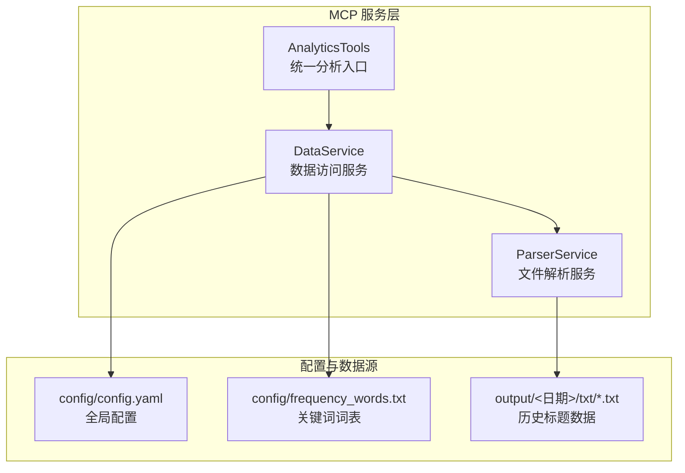
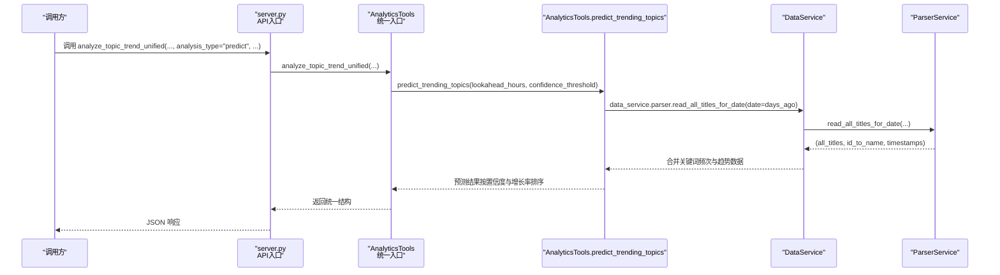
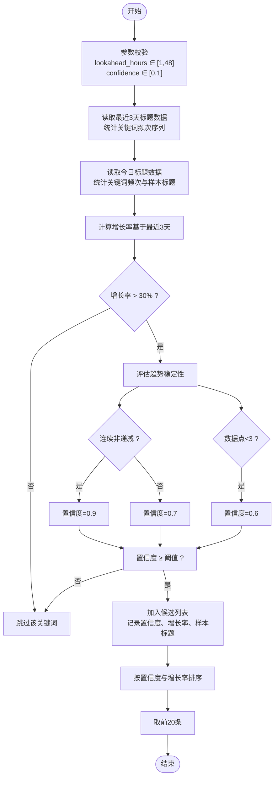
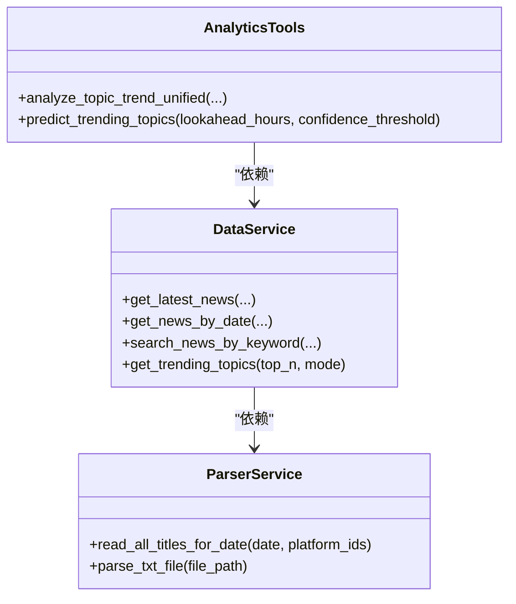
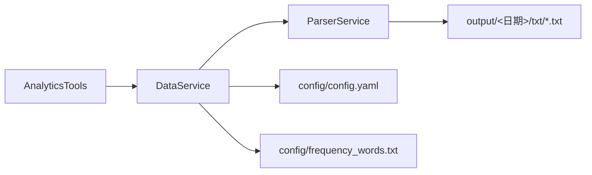

# 话题预测

<cite>
**本文引用的文件**
- [mcp_server/tools/analytics.py](file://mcp_server/tools/analytics.py)
- [mcp_server/services/data_service.py](file://mcp_server/services/data_service.py)
- [mcp_server/services/parser_service.py](file://mcp_server/services/parser_service.py)
- [config/config.yaml](file://config/config.yaml)
- [config/frequency_words.txt](file://config/frequency_words.txt)
- [docs/MCP-API-Reference.md](file://docs/MCP-API-Reference.md)
- [mcp_server/server.py](file://mcp_server/server.py)
</cite>

## 目录
1. [简介](#简介)
2. [项目结构](#项目结构)
3. [核心组件](#核心组件)
4. [架构总览](#架构总览)
5. [详细组件分析](#详细组件分析)
6. [依赖关系分析](#依赖关系分析)
7. [性能考量](#性能考量)
8. [故障排查指南](#故障排查指南)
9. [结论](#结论)
10. [附录](#附录)

## 简介
本文件围绕“话题预测（predict 模式）”展开，聚焦 predict_trending_topics 方法如何基于历史模式预测未来可能的热点。文档将系统说明：
- 历史话题的热度增长曲线与趋势识别
- 生命周期特征与外部事件关联性的分析思路
- lookahead_hours 参数的作用（预测未来6小时趋势）与置信度阈值（confidence_threshold）的筛选逻辑
- 模型训练数据来源、预测准确率评估方法与结果解释指南
- 实际场景下的预警与决策辅助实践

## 项目结构
预测能力位于 MCP 服务层，核心入口为 AnalyticsTools.analyze_topic_trend_unified，其中 predict 分支调用 predict_trending_topics 完成预测；数据访问由 DataService 与 ParserService 提供，配置与关键词词表来自 config 目录。

图表来源
- [mcp_server/tools/analytics.py](file://mcp_server/tools/analytics.py#L156-L242)
- [mcp_server/services/data_service.py](file://mcp_server/services/data_service.py#L1-L120)
- [mcp_server/services/parser_service.py](file://mcp_server/services/parser_service.py#L160-L260)
- [config/config.yaml](file://config/config.yaml#L1-L140)
- [config/frequency_words.txt](file://config/frequency_words.txt#L1-L114)

章节来源
- [mcp_server/tools/analytics.py](file://mcp_server/tools/analytics.py#L156-L242)
- [mcp_server/services/data_service.py](file://mcp_server/services/data_service.py#L1-L120)
- [mcp_server/services/parser_service.py](file://mcp_server/services/parser_service.py#L160-L260)
- [config/config.yaml](file://config/config.yaml#L1-L140)
- [config/frequency_words.txt](file://config/frequency_words.txt#L1-L114)

## 核心组件
- AnalyticsTools.analyze_topic_trend_unified：统一入口，根据 analysis_type 分派至不同分析模式，predict 分支调用 predict_trending_topics。
- AnalyticsTools.predict_trending_topics：预测主流程，基于最近3天关键词词频统计与趋势判定，结合置信度阈值输出候选热点。
- DataService：封装数据访问，提供按日期读取标题、关键词搜索、趋势话题统计等能力。
- ParserService：解析 output/<日期>/txt/*.txt 标题文件，合并同标题多平台排名，提供按日期读取接口。
- 配置与词表：config/config.yaml 提供全局权重与平台配置；config/frequency_words.txt 提供关键词分组规则。

章节来源
- [mcp_server/tools/analytics.py](file://mcp_server/tools/analytics.py#L156-L242)
- [mcp_server/tools/analytics.py](file://mcp_server/tools/analytics.py#L1759-L1920)
- [mcp_server/services/data_service.py](file://mcp_server/services/data_service.py#L1-L120)
- [mcp_server/services/parser_service.py](file://mcp_server/services/parser_service.py#L160-L260)
- [config/config.yaml](file://config/config.yaml#L1-L140)
- [config/frequency_words.txt](file://config/frequency_words.txt#L1-L114)

## 架构总览
预测流程从统一入口进入，经参数校验与模式分派，最终调用 predict_trending_topics。该方法读取最近3天的标题数据，统计关键词频次，计算增长趋势与置信度，输出预测结果。

图表来源
- [mcp_server/server.py](file://mcp_server/server.py#L246-L270)
- [mcp_server/tools/analytics.py](file://mcp_server/tools/analytics.py#L156-L242)
- [mcp_server/tools/analytics.py](file://mcp_server/tools/analytics.py#L1759-L1920)
- [mcp_server/services/data_service.py](file://mcp_server/services/data_service.py#L160-L220)
- [mcp_server/services/parser_service.py](file://mcp_server/services/parser_service.py#L160-L260)

## 详细组件分析

### predict_trending_topics 方法详解
- 输入参数
  - lookahead_hours：预测未来小时数，默认6，最大48。
  - confidence_threshold：置信度阈值，默认0.7，范围0~1。
- 数据来源
  - 读取最近3天的标题数据，统计每个关键词在每天的出现次数，形成关键词-天维度的历史序列。
  - 今日数据额外收集关键词与样本标题，便于后续解释。
- 趋势与置信度
  - 计算关键词在最近3天的增长率（以首尾非零值为基准）。
  - 若增长率超过阈值（当前实现为30%），进一步评估趋势稳定性：
    - 连续非递减增长：置信度较高（例如0.9）
    - 非连续增长：置信度中等（例如0.7）
    - 数据点不足：置信度较低（例如0.6）
  - 仅当置信度不低于 confidence_threshold 时，纳入候选。
- 结果排序与输出
  - 按置信度与增长率降序排序，返回前20条，并包含预测时间、参数与提示说明。

图表来源
- [mcp_server/tools/analytics.py](file://mcp_server/tools/analytics.py#L1759-L1920)

章节来源
- [mcp_server/tools/analytics.py](file://mcp_server/tools/analytics.py#L1759-L1920)

### 数据访问与解析链路
- DataService
  - 提供按日期读取新闻、关键词搜索、趋势话题统计等接口。
  - 读取 today 的最新数据时，会缓存并按排名排序，便于快速检索。
- ParserService
  - 解析 output/<日期>/txt/*.txt，合并同标题多平台排名，返回平台-标题-排名映射。
  - 支持按日期与平台过滤，缓存策略区分“今天”与“历史”。

图表来源
- [mcp_server/tools/analytics.py](file://mcp_server/tools/analytics.py#L156-L242)
- [mcp_server/services/data_service.py](file://mcp_server/services/data_service.py#L1-L120)
- [mcp_server/services/parser_service.py](file://mcp_server/services/parser_service.py#L160-L260)

章节来源
- [mcp_server/services/data_service.py](file://mcp_server/services/data_service.py#L1-L120)
- [mcp_server/services/parser_service.py](file://mcp_server/services/parser_service.py#L160-L260)

### lookahead_hours 与置信度阈值
- lookahead_hours
  - 用于指导预测窗口长度（当前实现基于最近3天的历史序列，而非显式外推未来小时）。
  - API 文档与默认值表明该参数用于“预测未来小时数”，但 predict_trending_topics 的实现并未直接使用该参数进行外推，而是通过历史趋势与置信度进行筛选。
- confidence_threshold
  - 仅用于过滤候选热点，高于阈值的关键词才会被纳入预测结果。
  - 建议在业务场景中根据历史回测效果动态调整（见“性能考量与评估”）。

章节来源
- [mcp_server/server.py](file://mcp_server/server.py#L246-L270)
- [docs/MCP-API-Reference.md](file://docs/MCP-API-Reference.md#L150-L170)
- [mcp_server/tools/analytics.py](file://mcp_server/tools/analytics.py#L1759-L1920)

### 历史模式、生命周期与外部事件关联
- 历史模式（trend/lifecycle）
  - trend：按天统计关键词出现次数，计算总提及、均值、峰值与变化率，识别上升/下降/稳定趋势。
  - lifecycle：追踪关键词从出现到消退的完整周期，结合峰值时间与持续天数进行分析。
- 外部事件关联
  - 当前实现未直接接入外部事件（如政策、发布会、技术进展）。
  - 可通过扩展：在 trend/lifecycle 分析中引入外部事件标记（如日期附近的关键事件），并与关键词序列做相关性分析（例如滑窗相关系数或事件驱动强度评分）。

章节来源
- [mcp_server/tools/analytics.py](file://mcp_server/tools/analytics.py#L244-L388)
- [mcp_server/tools/analytics.py](file://mcp_server/tools/analytics.py#L388-L520)

### 训练数据来源与关键词词表
- 训练数据来源
  - output/<日期>/txt/*.txt 中的标题文本，按平台与时间聚合，形成关键词-天频次序列。
- 关键词词表
  - config/frequency_words.txt 定义关键词分组（required/normal/filter），用于趋势话题统计与权重计算。
  - predict 流程中同样会从标题中抽取关键词，形成独立的词频统计（简单分词与过滤）。

章节来源
- [config/frequency_words.txt](file://config/frequency_words.txt#L1-L114)
- [mcp_server/services/parser_service.py](file://mcp_server/services/parser_service.py#L290-L356)
- [mcp_server/tools/analytics.py](file://mcp_server/tools/analytics.py#L1922-L1939)

### 预测准确率评估与结果解释
- 评估方法（建议）
  - 回测：以历史数据为测试集，比较预测候选与未来实际热点（如后续几天内关键词出现次数显著上升）的一致性。
  - 指标：准确率、召回率、F1 分数、Top-N 覆盖率、延迟（预测提前小时数）。
  - 动态阈值：通过 ROC/PR 曲线选择最优 confidence_threshold。
- 结果解释
  - 置信度：反映趋势稳定性与历史一致性，越高越可信。
  - 增长率：衡量关键词在最近3天的上升幅度。
  - 样本标题：用于人工复核与上下文理解。
  - note 提示：明确“预测基于历史趋势，实际结果可能有偏差”。

章节来源
- [mcp_server/tools/analytics.py](file://mcp_server/tools/analytics.py#L1759-L1920)

### 实战应用与预警建议
- 场景一：提前预警潜在热点
  - 设置较小的 confidence_threshold（如0.6），提高召回，再结合样本标题进行人工筛选。
- 场景二：辅助内容运营
  - 将预测结果与内容生产计划联动，提前准备相关专题素材。
- 场景三：风控与舆情
  - 对高置信度候选进行监控，配合情感分析与来源平台分布，快速响应。

[本节为概念性说明，无需列出具体文件来源]

## 依赖关系分析
- 组件耦合
  - AnalyticsTools 依赖 DataService，DataService 依赖 ParserService，形成清晰的数据访问链。
  - predict 流程与配置文件、词表解耦，便于替换数据源或调整关键词策略。
- 外部依赖
  - 依赖 output 目录下的历史标题数据；若数据缺失，将抛出 DataNotFoundError。
  - 依赖配置文件与词表，用于权重与关键词规则。

图表来源
- [mcp_server/tools/analytics.py](file://mcp_server/tools/analytics.py#L156-L242)
- [mcp_server/services/data_service.py](file://mcp_server/services/data_service.py#L1-L120)
- [mcp_server/services/parser_service.py](file://mcp_server/services/parser_service.py#L160-L260)
- [config/config.yaml](file://config/config.yaml#L1-L140)
- [config/frequency_words.txt](file://config/frequency_words.txt#L1-L114)

章节来源
- [mcp_server/tools/analytics.py](file://mcp_server/tools/analytics.py#L156-L242)
- [mcp_server/services/data_service.py](file://mcp_server/services/data_service.py#L1-L120)
- [mcp_server/services/parser_service.py](file://mcp_server/services/parser_service.py#L160-L260)

## 性能考量
- 数据读取与缓存
  - ParserService 对按日期读取做了缓存（今天15分钟，历史1小时），减少磁盘 IO。
  - DataService 对最新新闻、按日期新闻、趋势话题等做了缓存，降低重复计算成本。
- 关键词抽取与统计
  - predict 流程对标题进行简单清洗与分词，复杂度与标题数量线性相关。
  - 建议在大规模数据场景下：
    - 限制 lookahead_hours 与返回 TOP N（当前实现为20）
    - 使用更高效的分词与过滤策略（如正则/停用词表）
- 并发与批处理
  - 读取多天数据时按天循环，建议在上游增加并发拉取与本地缓存，缩短预测延迟。

[本节提供一般性建议，无需列出具体文件来源]

## 故障排查指南
- 未找到数据
  - 现象：抛出 DataNotFoundError。
  - 排查：确认 output/<日期>/txt 目录是否存在有效文件；检查日期是否正确。
- 参数非法
  - 现象：InvalidParameterError。
  - 排查：lookahead_hours 超出范围（1~48）；confidence_threshold 不在[0,1]。
- 预测结果为空
  - 现象：predicted_topics 为空。
  - 排查：检查关键词抽取逻辑与词表；确认历史数据足够（至少3天）；适当降低 confidence_threshold。

章节来源
- [mcp_server/services/parser_service.py](file://mcp_server/services/parser_service.py#L196-L260)
- [mcp_server/tools/analytics.py](file://mcp_server/tools/analytics.py#L1759-L1920)

## 结论
predict_trending_topics 基于历史关键词频次序列与趋势稳定性评估，结合置信度阈值筛选候选热点，具备良好的可解释性与实用性。建议在实际应用中：
- 明确 lookahead_hours 的使用边界（当前实现未直接外推未来小时）
- 通过回测选择合适的 confidence_threshold
- 结合趋势与生命周期分析，提升预警质量
- 在数据与词表层面持续优化，以增强覆盖率与准确性

[本节为总结性内容，无需列出具体文件来源]

## 附录
- API 参考（predict 模式）
  - analyze_topic_trend_unified 支持 analysis_type="predict"，参数包括 lookahead_hours 与 confidence_threshold。
- 关键词词表格式
  - 支持 required/normal/filter 三类关键词分组，便于灵活扩展。

章节来源
- [docs/MCP-API-Reference.md](file://docs/MCP-API-Reference.md#L150-L170)
- [config/frequency_words.txt](file://config/frequency_words.txt#L1-L114)