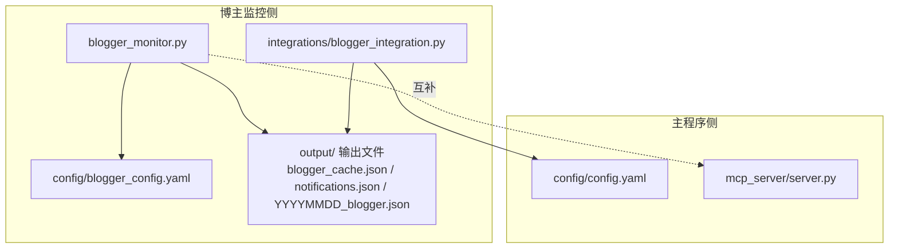
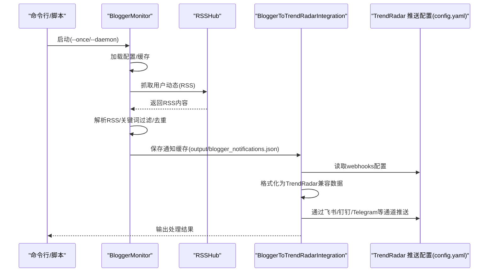
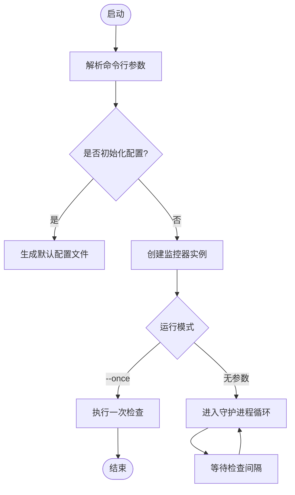
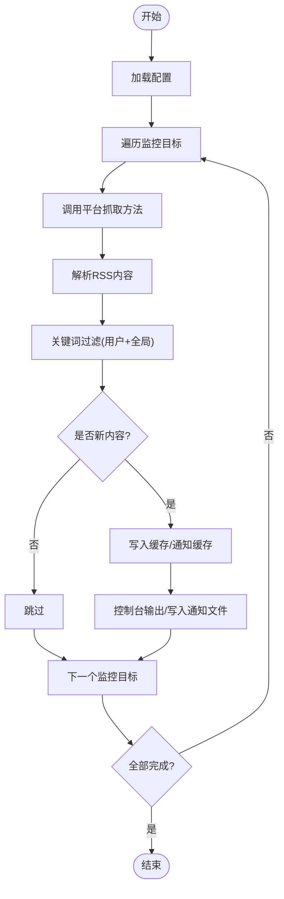
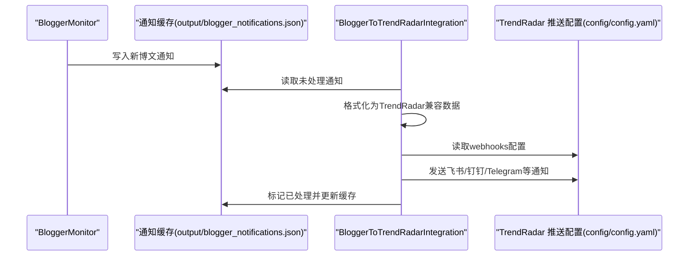
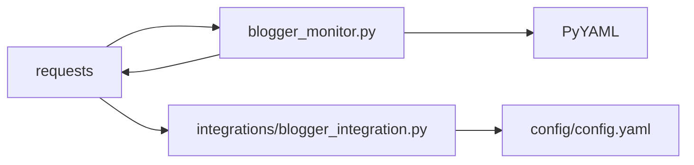

# 博主监控工具

<cite>
**本文引用的文件**
- [blogger_monitor.py](file://blogger_monitor.py)
- [config/blogger_config.yaml](file://config/blogger_config.yaml)
- [integrations/blogger_integration.py](file://integrations/blogger_integration.py)
- [config/config.yaml](file://config/config.yaml)
- [README-BloggerMonitor.md](file://README-BloggerMonitor.md)
- [BlogMonitor-Architecture.md](file://BlogMonitor-Architecture.md)
- [start_blogger_monitor.sh](file://start_blogger_monitor.sh)
- [requirements.txt](file://requirements.txt)
- [mcp_server/server.py](file://mcp_server/server.py)
</cite>

## 目录
1. [简介](#简介)
2. [项目结构](#项目结构)
3. [核心组件](#核心组件)
4. [架构总览](#架构总览)
5. [组件详解](#组件详解)
6. [依赖关系分析](#依赖关系分析)
7. [性能与可靠性](#性能与可靠性)
8. [故障排查指南](#故障排查指南)
9. [结论](#结论)
10. [附录](#附录)

## 简介
本专项文档聚焦“博主监控工具”，解释其独立于主程序运行的设计目的：专门用于跟踪特定KOL或账号的发言动态，与主程序“平台级热点”形成互补。主程序面向全网热点聚合与趋势分析，而博主监控工具专注于个体行为追踪与关键词触发通知，二者协同实现“宏观热点 + 个体动态”的双轨监控体系。

## 项目结构
- 独立运行的监控脚本：blogger_monitor.py
- 配置文件：config/blogger_config.yaml
- 与主程序集成的推送模块：integrations/blogger_integration.py
- 主程序推送配置：config/config.yaml
- 使用说明与配置示例：README-BloggerMonitor.md
- 架构设计文档（含扩展能力）：BlogMonitor-Architecture.md
- 启动脚本：start_blogger_monitor.sh
- 依赖清单：requirements.txt
- 主程序MCP服务（用于对比与互补）：mcp_server/server.py

图表来源
- [blogger_monitor.py](file://blogger_monitor.py#L1-L408)
- [config/blogger_config.yaml](file://config/blogger_config.yaml#L1-L60)
- [integrations/blogger_integration.py](file://integrations/blogger_integration.py#L1-L293)
- [config/config.yaml](file://config/config.yaml#L1-L140)
- [mcp_server/server.py](file://mcp_server/server.py#L1-L782)

章节来源
- [blogger_monitor.py](file://blogger_monitor.py#L1-L408)
- [config/blogger_config.yaml](file://config/blogger_config.yaml#L1-L60)
- [integrations/blogger_integration.py](file://integrations/blogger_integration.py#L1-L293)
- [config/config.yaml](file://config/config.yaml#L1-L140)
- [README-BloggerMonitor.md](file://README-BloggerMonitor.md#L1-L242)
- [BlogMonitor-Architecture.md](file://BlogMonitor-Architecture.md#L1-L800)
- [start_blogger_monitor.sh](file://start_blogger_monitor.sh#L1-L146)
- [requirements.txt](file://requirements.txt#L1-L6)
- [mcp_server/server.py](file://mcp_server/server.py#L1-L782)

## 核心组件
- 博主监控主类：负责配置加载、缓存管理、平台抓取、关键词匹配、通知发送与守护进程循环。
- 集成模块：将博主监控产生的通知转换为主程序推送格式，并通过主程序配置的webhook通道进行统一推送。
- 配置系统：两套配置文件分别服务于博主监控与主程序推送，互不干扰且可并行使用。
- 启动与运维：提供命令行与交互式启动脚本，便于单次测试与长期守护运行。

章节来源
- [blogger_monitor.py](file://blogger_monitor.py#L31-L408)
- [integrations/blogger_integration.py](file://integrations/blogger_integration.py#L1-L293)
- [config/blogger_config.yaml](file://config/blogger_config.yaml#L1-L60)
- [config/config.yaml](file://config/config.yaml#L1-L140)
- [start_blogger_monitor.sh](file://start_blogger_monitor.sh#L1-L146)

## 架构总览
博主监控工具采用“独立采集 + 统一推送”的架构：
- 采集层：基于RSSHub抓取微博、知乎等平台用户动态，解析RSS并做关键词过滤。
- 缓存层：本地JSON缓存去重，避免重复通知。
- 通知层：本地控制台输出；可扩展至文件、邮件、微信、Telegram等（通过主程序推送配置）。
- 集成层：将新发现的博文转换为主程序兼容格式，统一走主程序的webhook通道推送。

图表来源
- [blogger_monitor.py](file://blogger_monitor.py#L293-L408)
- [integrations/blogger_integration.py](file://integrations/blogger_integration.py#L101-L293)
- [config/config.yaml](file://config/config.yaml#L92-L109)

## 组件详解

### 1) 启动流程与运行模式
- 单次运行：适用于测试与手动巡检，执行一次抓取与通知处理后退出。
- 守护进程：按配置的检查间隔循环执行，支持键盘中断优雅退出。
- 初始化配置：自动生成默认配置文件，便于快速上手。

图表来源
- [blogger_monitor.py](file://blogger_monitor.py#L352-L408)
- [start_blogger_monitor.sh](file://start_blogger_monitor.sh#L42-L53)

章节来源
- [blogger_monitor.py](file://blogger_monitor.py#L352-L408)
- [start_blogger_monitor.sh](file://start_blogger_monitor.sh#L1-L146)

### 2) 配置加载机制（基于blogger_config.yaml）
- monitors：监控目标列表，支持平台、用户ID、关键词与备注。
- keywords：全局关键词，对所有监控目标生效。
- notification：通知开关与渠道（当前为控制台输出，其他渠道可扩展）。
- check_interval/max_posts_per_check：轮询间隔与单次抓取上限。
- rsshub/cache：可选的RSSHub公共实例与缓存过期/容量配置。

章节来源
- [config/blogger_config.yaml](file://config/blogger_config.yaml#L1-L60)
- [blogger_monitor.py](file://blogger_monitor.py#L54-L98)

### 3) 监控逻辑实现
- 平台支持：微博、知乎（通过RSSHub）。
- 抓取与解析：构造RSSHub URL，拉取RSS内容，使用正则解析item，提取标题、链接、描述、发布时间等。
- 关键词匹配：支持用户特定关键词与全局关键词，不区分大小写，部分匹配。
- 去重与缓存：生成内容哈希，记录已见过的post，避免重复通知。
- 通知发送：本地控制台输出；同时将通知写入output/blogger_notifications.json，供集成模块处理。

图表来源
- [blogger_monitor.py](file://blogger_monitor.py#L115-L244)
- [blogger_monitor.py](file://blogger_monitor.py#L245-L331)

章节来源
- [blogger_monitor.py](file://blogger_monitor.py#L115-L244)
- [blogger_monitor.py](file://blogger_monitor.py#L245-L331)

### 4) 通知与集成（与主程序互补）
- 通知缓存：output/blogger_notifications.json记录新发现的博文，最多保留最近100条。
- 集成模块：读取该缓存，将博文格式化为主程序兼容格式，保存为output/YYYYMMDD_blogger.json，并通过config/config.yaml中的webhooks通道进行统一推送。
- 支持渠道：飞书、钉钉、Telegram等（具体以config/config.yaml为准）。

图表来源
- [blogger_monitor.py](file://blogger_monitor.py#L245-L331)
- [integrations/blogger_integration.py](file://integrations/blogger_integration.py#L101-L293)
- [config/config.yaml](file://config/config.yaml#L92-L109)

章节来源
- [blogger_monitor.py](file://blogger_monitor.py#L245-L331)
- [integrations/blogger_integration.py](file://integrations/blogger_integration.py#L1-L293)
- [config/config.yaml](file://config/config.yaml#L92-L109)

### 5) 与主程序的功能互补
- 主程序（mcp_server/server.py）：提供平台级热点聚合、趋势分析、情感分析、检索等工具，面向宏观热点与全局洞察。
- 博主监控工具：面向个体KOL/账号的微观动态，通过关键词过滤与统一推送，实现“个体行为追踪 + 平台热点聚合”的双轨互补。

章节来源
- [mcp_server/server.py](file://mcp_server/server.py#L1-L782)
- [README-BloggerMonitor.md](file://README-BloggerMonitor.md#L1-L242)

## 依赖关系分析
- 运行时依赖：requests、PyYAML、fastmcp、websockets等。
- 博主监控脚本依赖：yaml解析、requests会话、正则解析RSS、JSON缓存。
- 集成模块依赖：主程序推送配置（config/config.yaml），用于读取webhooks并推送。

图表来源
- [requirements.txt](file://requirements.txt#L1-L6)
- [blogger_monitor.py](file://blogger_monitor.py#L1-L408)
- [integrations/blogger_integration.py](file://integrations/blogger_integration.py#L1-L293)
- [config/config.yaml](file://config/config.yaml#L1-L140)

章节来源
- [requirements.txt](file://requirements.txt#L1-L6)
- [blogger_monitor.py](file://blogger_monitor.py#L1-L408)
- [integrations/blogger_integration.py](file://integrations/blogger_integration.py#L1-L293)
- [config/config.yaml](file://config/config.yaml#L1-L140)

## 性能与可靠性
- 抓取频率与上限：check_interval建议不低于5分钟；max_posts_per_check建议5-20，避免过度抓取。
- 去重策略：基于内容哈希，减少重复通知与IO开销。
- 错误处理：网络异常、解析失败、缓存读写失败均有日志记录与降级处理。
- 缓存管理：本地JSON缓存，支持重启后继续去重；通知缓存最多保留100条，避免无限增长。

章节来源
- [config/blogger_config.yaml](file://config/blogger_config.yaml#L46-L49)
- [blogger_monitor.py](file://blogger_monitor.py#L91-L103)
- [blogger_monitor.py](file://blogger_monitor.py#L140-L191)
- [blogger_monitor.py](file://blogger_monitor.py#L293-L331)

## 故障排查指南
- RSSHub访问失败：可尝试更换公共实例、使用代理或自建RSSHub；检查网络连通性。
- 用户ID错误：微博需使用数字ID，知乎可使用用户名或ID；确认用户主页可正常访问。
- 关键词匹配失败：检查关键词是否包含特殊字符，尝试更通用关键词；查看日志了解匹配过程。
- 推送通知失败：检查config/config.yaml中的webhooks配置，确认URL或Token正确；查看日志获取详细错误信息。
- 日志定位：控制台输出与blogger_monitor.log文件；必要时调整logging级别。

章节来源
- [README-BloggerMonitor.md](file://README-BloggerMonitor.md#L182-L216)
- [blogger_monitor.py](file://blogger_monitor.py#L19-L29)

## 结论
博主监控工具以“独立采集 + 统一推送”为核心，通过简洁的配置与稳健的去重机制，实现对特定KOL/账号的高效追踪。其与主程序在功能上形成互补：主程序聚焦平台级热点聚合与趋势分析，博主监控工具聚焦个体动态与关键词触发，二者协同可覆盖“宏观热点 + 微观行为”的全场景需求。

## 附录

### A. 配置示例与最佳实践
- 初始化配置：使用命令行参数初始化默认配置文件，随后编辑config/blogger_config.yaml添加监控目标与关键词。
- 监控目标：支持微博与知乎，每个目标可设置平台、用户ID、关键词与备注。
- 全局关键词：对所有监控目标生效，建议与用户特定关键词配合使用。
- 通知渠道：当前控制台输出；可通过主程序推送配置扩展至飞书、钉钉、Telegram等。

章节来源
- [README-BloggerMonitor.md](file://README-BloggerMonitor.md#L16-L64)
- [config/blogger_config.yaml](file://config/blogger_config.yaml#L1-L60)
- [config/config.yaml](file://config/config.yaml#L92-L109)

### B. 与主程序的集成要点
- 数据格式兼容：集成模块将博文格式化为主程序兼容格式，保存为output/YYYYMMDD_blogger.json。
- 统一推送：通过config/config.yaml中的webhooks配置，实现与主程序一致的通知通道。
- 互补关系：主程序提供宏观分析工具，博主监控工具提供微观追踪能力，二者可并行运行。

章节来源
- [README-BloggerMonitor.md](file://README-BloggerMonitor.md#L90-L111)
- [integrations/blogger_integration.py](file://integrations/blogger_integration.py#L68-L102)
- [config/config.yaml](file://config/config.yaml#L92-L109)