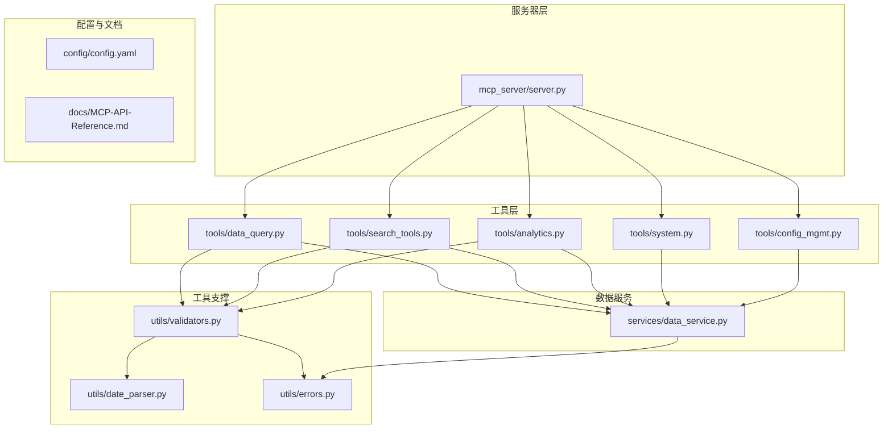
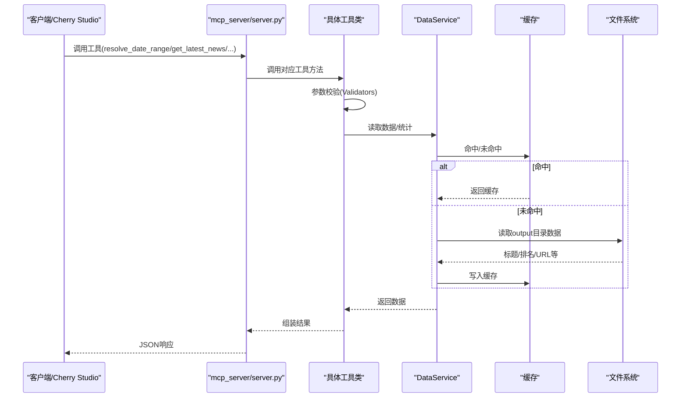
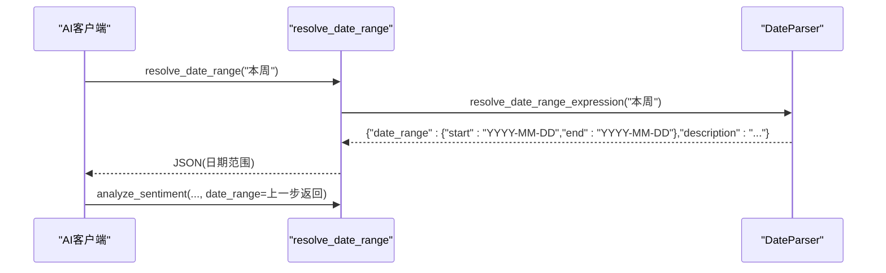
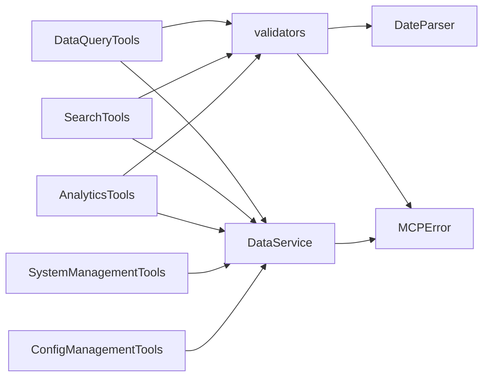

# MCP专用问题

<cite>
**本文引用的文件**
- [mcp_server/server.py](file://mcp_server/server.py)
- [mcp_server/tools/data_query.py](file://mcp_server/tools/data_query.py)
- [mcp_server/tools/search_tools.py](file://mcp_server/tools/search_tools.py)
- [mcp_server/tools/analytics.py](file://mcp_server/tools/analytics.py)
- [mcp_server/tools/system.py](file://mcp_server/tools/system.py)
- [mcp_server/tools/config_mgmt.py](file://mcp_server/tools/config_mgmt.py)
- [mcp_server/utils/date_parser.py](file://mcp_server/utils/date_parser.py)
- [mcp_server/utils/validators.py](file://mcp_server/utils/validators.py)
- [mcp_server/utils/errors.py](file://mcp_server/utils/errors.py)
- [mcp_server/services/data_service.py](file://mcp_server/services/data_service.py)
- [docs/MCP-API-Reference.md](file://docs/MCP-API-Reference.md)
- [README-Cherry-Studio.md](file://README-Cherry-Studio.md)
- [config/config.yaml](file://config/config.yaml)
</cite>

## 目录
1. [引言](#引言)
2. [项目结构](#项目结构)
3. [核心组件](#核心组件)
4. [架构总览](#架构总览)
5. [详细组件分析](#详细组件分析)
6. [依赖关系分析](#依赖关系分析)
7. [性能考量](#性能考量)
8. [故障排查指南](#故障排查指南)
9. [结论](#结论)
10. [附录](#附录)

## 引言
本文件聚焦于MCP服务器在实际使用中常见的问题与解决方案，包括工具调用失败、AI模型响应异常、自然语言解析错误、日期范围不一致等。重点阐述resolve_date_range工具的必要性，并给出get_latest_news等13个MCP工具的正确调用方式；同时分析token消耗过高的原因与优化策略，并指导用户在Cherry Studio中正确配置AI模型与API密钥。

## 项目结构
- 服务器入口与工具注册集中在mcp_server/server.py，通过FastMCP 2.0框架暴露16个工具。
- 工具层分为数据查询、智能检索、高级分析、系统管理、配置管理五大类，分别位于mcp_server/tools目录下。
- 工具内部通过validators与date_parser进行参数校验与日期解析，通过data_service访问数据源并缓存结果。
- 文档与配置文件位于docs与config目录，提供API参考与平台配置。

图表来源
- [mcp_server/server.py](file://mcp_server/server.py#L1-L120)
- [mcp_server/tools/data_query.py](file://mcp_server/tools/data_query.py#L1-L60)
- [mcp_server/tools/search_tools.py](file://mcp_server/tools/search_tools.py#L1-L60)
- [mcp_server/tools/analytics.py](file://mcp_server/tools/analytics.py#L1-L40)
- [mcp_server/tools/system.py](file://mcp_server/tools/system.py#L1-L40)
- [mcp_server/tools/config_mgmt.py](file://mcp_server/tools/config_mgmt.py#L1-L30)
- [mcp_server/utils/validators.py](file://mcp_server/utils/validators.py#L1-L40)
- [mcp_server/utils/date_parser.py](file://mcp_server/utils/date_parser.py#L1-L40)
- [mcp_server/utils/errors.py](file://mcp_server/utils/errors.py#L1-L40)
- [mcp_server/services/data_service.py](file://mcp_server/services/data_service.py#L1-L40)
- [config/config.yaml](file://config/config.yaml#L116-L140)
- [docs/MCP-API-Reference.md](file://docs/MCP-API-Reference.md#L1-L40)

章节来源
- [mcp_server/server.py](file://mcp_server/server.py#L660-L782)
- [docs/MCP-API-Reference.md](file://docs/MCP-API-Reference.md#L1-L60)

## 核心组件
- 服务器入口与工具注册：mcp_server/server.py通过装饰器注册resolve_date_range与15个业务工具，统一返回JSON字符串，便于客户端消费。
- 工具类与数据服务：各工具类（DataQueryTools、SearchTools、AnalyticsTools、SystemManagementTools、ConfigManagementTools）通过DataService访问数据，内置缓存与错误处理。
- 参数校验与日期解析：validators提供平台、limit、date_range、keyword、mode等校验；date_parser提供parse_date_query与resolve_date_range_expression，确保日期解析一致性。
- 错误体系：自定义MCPError及其子类，统一错误返回格式，便于前端与AI客户端处理。

章节来源
- [mcp_server/server.py](file://mcp_server/server.py#L1-L120)
- [mcp_server/tools/data_query.py](file://mcp_server/tools/data_query.py#L1-L60)
- [mcp_server/tools/search_tools.py](file://mcp_server/tools/search_tools.py#L1-L60)
- [mcp_server/tools/analytics.py](file://mcp_server/tools/analytics.py#L1-L40)
- [mcp_server/tools/system.py](file://mcp_server/tools/system.py#L1-L40)
- [mcp_server/tools/config_mgmt.py](file://mcp_server/tools/config_mgmt.py#L1-L30)
- [mcp_server/utils/validators.py](file://mcp_server/utils/validators.py#L1-L60)
- [mcp_server/utils/date_parser.py](file://mcp_server/utils/date_parser.py#L1-L60)
- [mcp_server/utils/errors.py](file://mcp_server/utils/errors.py#L1-L40)
- [mcp_server/services/data_service.py](file://mcp_server/services/data_service.py#L1-L40)

## 架构总览
MCP服务器采用“工具层-服务层-支撑层”三层架构：
- 工具层：面向客户端的16个工具接口，负责参数校验、调用服务层、组装结果。
- 服务层：DataService封装数据读取、缓存、统计与系统状态，屏蔽底层文件系统细节。
- 支撑层：validators与date_parser提供参数与日期解析能力；errors提供统一错误语义。

图表来源
- [mcp_server/server.py](file://mcp_server/server.py#L110-L220)
- [mcp_server/tools/data_query.py](file://mcp_server/tools/data_query.py#L30-L120)
- [mcp_server/services/data_service.py](file://mcp_server/services/data_service.py#L30-L120)

## 详细组件分析

### resolve_date_range工具的必要性
- 问题背景：用户常使用“本周”、“最近7天”等自然语言表达日期，若由AI模型自行计算，可能因时区、周起始日、边界处理差异导致不一致。
- 解决方案：服务器端使用DateParser.resolve_date_range_expression，基于当前服务器时间精确计算日期范围，保证所有AI调用得到一致结果。
- 推荐流程：AI先调用resolve_date_range解析自然语言，再将返回的date_range传入其他工具（如search_news、analyze_sentiment、analyze_topic_trend等）。

图表来源
- [mcp_server/server.py](file://mcp_server/server.py#L40-L110)
- [mcp_server/utils/date_parser.py](file://mcp_server/utils/date_parser.py#L330-L424)

章节来源
- [mcp_server/server.py](file://mcp_server/server.py#L40-L110)
- [mcp_server/utils/date_parser.py](file://mcp_server/utils/date_parser.py#L330-L424)

### P0核心工具：get_latest_news
- 功能：获取最新一批爬取的新闻，支持平台过滤、limit限制、是否包含URL。
- 关键点：
  - include_url默认False以节省token。
  - 返回total、platforms、success等字段，便于前端展示与二次处理。
  - 内置缓存（15分钟），提升高频查询性能。
- 调用建议：
  - 若用户需要完整数据，建议不开启include_url；若需要链接，再显式开启。
  - limit建议按需设置，避免一次性返回过多数据。

章节来源
- [mcp_server/server.py](file://mcp_server/server.py#L113-L149)
- [mcp_server/tools/data_query.py](file://mcp_server/tools/data_query.py#L34-L90)
- [mcp_server/services/data_service.py](file://mcp_server/services/data_service.py#L30-L103)

### P0核心工具：get_news_by_date
- 功能：按日期查询新闻，支持自然语言日期（如“今天”、“昨天”、“3天前”）。
- 关键点：
  - date_query默认“今天”，通过validators.validate_date_query与DateParser解析。
  - include_url默认False以节省token。
  - 返回date_query、date、platforms等上下文信息，便于前端呈现。
- 调用建议：
  - 若用户使用自然语言日期，先调用resolve_date_range获取标准范围，再调用本工具。
  - 对历史数据查询，建议配合include_url=false减少token。

章节来源
- [mcp_server/server.py](file://mcp_server/server.py#L176-L222)
- [mcp_server/tools/data_query.py](file://mcp_server/tools/data_query.py#L211-L285)
- [mcp_server/utils/validators.py](file://mcp_server/utils/validators.py#L309-L352)
- [mcp_server/utils/date_parser.py](file://mcp_server/utils/date_parser.py#L92-L140)

### P0核心工具：get_trending_topics
- 功能：基于config/frequency_words.txt中的个人关注词列表，统计其在新闻中出现频率。
- 关键点：
  - 支持daily/current/incremental三种模式。
  - 结果包含topics、mode、total_keywords等字段。
- 调用建议：
  - 在Cherry Studio中，可先调用get_current_config获取关键词配置，再调用本工具。

章节来源
- [mcp_server/server.py](file://mcp_server/server.py#L151-L174)
- [mcp_server/tools/data_query.py](file://mcp_server/tools/data_query.py#L154-L210)
- [mcp_server/services/data_service.py](file://mcp_server/services/data_service.py#L285-L402)

### 智能检索工具：search_news_unified
- 功能：统一新闻搜索，支持keyword/fuzzy/entity三种模式，支持按relevance/weight/date排序。
- 关键点：
  - date_range可选；未提供时默认使用最新可用日期（避免future date）。
  - fuzzy模式支持threshold阈值，注意阈值越高匹配越严格。
  - include_url默认False以节省token。
- 调用建议：
  - 用户使用“最近N天”等自然语言时，先resolve_date_range再传入date_range。
  - 模糊搜索建议结合threshold与limit，避免返回过多噪声。

章节来源
- [mcp_server/server.py](file://mcp_server/server.py#L462-L539)
- [mcp_server/tools/search_tools.py](file://mcp_server/tools/search_tools.py#L38-L120)
- [mcp_server/tools/search_tools.py](file://mcp_server/tools/search_tools.py#L120-L240)

### 高级分析工具：analyze_sentiment
- 功能：情感倾向分析，生成AI提示词；支持按权重排序、去重、日期范围、平台过滤。
- 关键点：
  - 默认按权重排序，返回ai_prompt与news_sample。
  - 去重逻辑：同一标题在不同平台只保留一次，可能导致返回数量少于limit。
  - include_url默认False以节省token。
- 调用建议：
  - 若需要完整数据，建议不开启include_url；若需要链接，再显式开启。
  - 对于长周期分析，建议先resolve_date_range再传入date_range。

章节来源
- [mcp_server/server.py](file://mcp_server/server.py#L334-L396)
- [mcp_server/tools/analytics.py](file://mcp_server/tools/analytics.py#L631-L800)

### 高级分析工具：analyze_topic_trend_unified
- 功能：统一话题趋势分析，支持trend/lifecycle/viral/predict四种模式。
- 关键点：
  - trend/lifecycle模式支持date_range；viral/predict模式可不传topic。
  - 默认粒度day（底层数据按天聚合）。
- 调用建议：
  - 用户使用“本周/最近7天”等自然语言时，先resolve_date_range再传入date_range。

章节来源
- [mcp_server/server.py](file://mcp_server/server.py#L226-L289)
- [mcp_server/tools/analytics.py](file://mcp_server/tools/analytics.py#L156-L243)

### 高级分析工具：analyze_data_insights_unified
- 功能：平台对比、平台活跃度、关键词共现分析。
- 关键点：
  - platform_compare支持topic过滤；keyword_cooccur支持min_frequency与top_n。
- 调用建议：
  - 共现分析建议结合min_frequency与top_n，避免噪声。

章节来源
- [mcp_server/server.py](file://mcp_server/server.py#L291-L333)
- [mcp_server/tools/analytics.py](file://mcp_server/tools/analytics.py#L89-L155)

### 高级分析工具：find_similar_news
- 功能：基于标题相似度查找相关新闻。
- 关键点：
  - threshold越高匹配越严格；limit限制返回数量。
- 调用建议：
  - 与search_news_unified互补，适合二次挖掘相似内容。

章节来源
- [mcp_server/server.py](file://mcp_server/server.py#L398-L433)
- [mcp_server/tools/analytics.py](file://mcp_server/tools/analytics.py#L1-L40)

### 高级分析工具：search_related_news_history
- 功能：基于种子新闻，在历史数据中搜索相关新闻。
- 关键点：
  - 支持yesterday/last_week/last_month/custom预设；threshold综合相似度计算。
- 调用建议：
  - 适合事件溯源与关联分析。

章节来源
- [mcp_server/server.py](file://mcp_server/server.py#L541-L583)
- [mcp_server/tools/search_tools.py](file://mcp_server/tools/search_tools.py#L494-L702)

### 系统管理工具：get_system_status
- 功能：获取系统版本、数据统计、缓存状态等健康信息。
- 调用建议：
  - 定期调用以监控系统健康状况。

章节来源
- [mcp_server/server.py](file://mcp_server/server.py#L610-L623)
- [mcp_server/tools/system.py](file://mcp_server/tools/system.py#L33-L67)
- [mcp_server/services/data_service.py](file://mcp_server/services/data_service.py#L538-L605)

### 系统管理工具：trigger_crawl
- 功能：手动触发临时爬取任务，可选保存至本地output目录。
- 关键点：
  - 依据config/config.yaml中的platforms配置过滤平台。
  - 失败平台会体现在failed_platforms字段。
- 调用建议：
  - 若需要最新数据，先trigger_crawl，再调用get_latest_news等工具。

章节来源
- [mcp_server/server.py](file://mcp_server/server.py#L625-L658)
- [mcp_server/tools/system.py](file://mcp_server/tools/system.py#L68-L170)
- [config/config.yaml](file://config/config.yaml#L116-L140)

### 系统管理工具：get_current_config
- 功能：获取当前系统配置（crawler/push/keywords/weights/all）。
- 调用建议：
  - 在调用get_trending_topics前，先get_current_config(section="keywords")确认关注词配置。

章节来源
- [mcp_server/server.py](file://mcp_server/server.py#L587-L608)
- [mcp_server/tools/config_mgmt.py](file://mcp_server/tools/config_mgmt.py#L26-L67)
- [mcp_server/services/data_service.py](file://mcp_server/services/data_service.py#L411-L497)

## 依赖关系分析
- 工具层依赖validators与date_parser进行参数与日期解析，依赖DataService访问数据与缓存。
- DataService依赖ParserService读取output目录数据，依赖缓存模块进行结果缓存。
- 错误体系统一由MCPError及其子类提供，保证错误返回格式一致。

图表来源
- [mcp_server/tools/data_query.py](file://mcp_server/tools/data_query.py#L1-L40)
- [mcp_server/tools/search_tools.py](file://mcp_server/tools/search_tools.py#L1-L20)
- [mcp_server/tools/analytics.py](file://mcp_server/tools/analytics.py#L1-L25)
- [mcp_server/tools/system.py](file://mcp_server/tools/system.py#L1-L20)
- [mcp_server/tools/config_mgmt.py](file://mcp_server/tools/config_mgmt.py#L1-L20)
- [mcp_server/utils/validators.py](file://mcp_server/utils/validators.py#L1-L20)
- [mcp_server/utils/date_parser.py](file://mcp_server/utils/date_parser.py#L1-L20)
- [mcp_server/utils/errors.py](file://mcp_server/utils/errors.py#L1-L20)
- [mcp_server/services/data_service.py](file://mcp_server/services/data_service.py#L1-L20)

章节来源
- [mcp_server/utils/validators.py](file://mcp_server/utils/validators.py#L1-L60)
- [mcp_server/utils/date_parser.py](file://mcp_server/utils/date_parser.py#L1-L60)
- [mcp_server/utils/errors.py](file://mcp_server/utils/errors.py#L1-L40)
- [mcp_server/services/data_service.py](file://mcp_server/services/data_service.py#L1-L40)

## 性能考量
- 缓存策略：
  - DataService对get_latest_news、get_news_by_date、get_trending_topics等常用查询进行缓存，显著降低重复查询成本。
  - 缓存键包含平台、limit、include_url等维度，避免误命中。
- limit与分页：
  - 建议合理设置limit，避免一次性返回过多数据；对历史数据查询建议按日期分批。
- include_url策略：
  - 默认不包含URL，可显著降低token消耗；仅在需要时开启。
- 搜索模式选择：
  - 精确匹配使用keyword模式；模糊搜索使用fuzzy模式并设置合适threshold；实体搜索使用entity模式。
- 平台过滤：
  - 通过validators.validate_platforms限制平台集合，减少无关数据扫描。

章节来源
- [mcp_server/services/data_service.py](file://mcp_server/services/data_service.py#L30-L182)
- [mcp_server/tools/data_query.py](file://mcp_server/tools/data_query.py#L34-L90)
- [mcp_server/tools/search_tools.py](file://mcp_server/tools/search_tools.py#L120-L240)
- [docs/MCP-API-Reference.md](file://docs/MCP-API-Reference.md#L459-L475)

## 故障排查指南
- 工具调用失败（INVALID_PARAMETER）：
  - 检查参数类型与范围（如limit、date_range、platforms）。
  - 使用validators.validate_*进行前置校验。
- 数据未找到（DATA_NOT_FOUND）：
  - 确认output目录是否存在数据；使用get_system_status查看可用日期范围。
  - 对历史查询，确保日期范围在可用范围内。
- 日期范围不一致（NATURAL_LANGUAGE_MISMATCH）：
  - 强制使用resolve_date_range解析自然语言日期，避免AI模型自行计算。
- 爬取任务错误（CRAWL_TASK_ERROR）：
  - 检查config/config.yaml中platforms配置；确认网络可达性；必要时使用trigger_crawl手动触发。
- 错误统一格式：
  - 所有工具返回success与error字段，error包含code、message与suggestion，便于定位问题。

章节来源
- [mcp_server/utils/errors.py](file://mcp_server/utils/errors.py#L1-L94)
- [mcp_server/utils/validators.py](file://mcp_server/utils/validators.py#L145-L210)
- [mcp_server/server.py](file://mcp_server/server.py#L610-L658)
- [mcp_server/services/data_service.py](file://mcp_server/services/data_service.py#L498-L605)

## 结论
- resolve_date_range是MCP服务器的关键工具，确保自然语言日期解析的一致性，避免AI模型与服务器端计算偏差。
- 13个核心工具覆盖数据查询、智能检索、高级分析、系统管理与配置管理，满足从热点发现到深度分析的全链路需求。
- 通过合理的limit、include_url策略与缓存机制，可有效降低token消耗并提升响应性能。
- Cherry Studio配置要点：在设置中添加MCP服务器，选择streamableStdio或streamableHttp，确保工具列表可见且开关开启；首次使用建议先调用get_system_status与trigger_crawl验证连通性与数据可用性。

## 附录

### Cherry Studio配置步骤（简要）
- 下载并安装Cherry Studio，打开设置，添加MCP服务器（本地stdio或HTTP）。
- 在对话框中输入测试命令，验证工具调用与数据返回。
- 如需HTTP模式，参考README-Cherry-Studio.md中的说明。

章节来源
- [README-Cherry-Studio.md](file://README-Cherry-Studio.md#L80-L155)

### API参考与调用示例
- 参考docs/MCP-API-Reference.md，了解各工具的参数、返回与示例。
- 建议在调用前先resolve_date_range，再传入date_range参数。

章节来源
- [docs/MCP-API-Reference.md](file://docs/MCP-API-Reference.md#L1-L120)