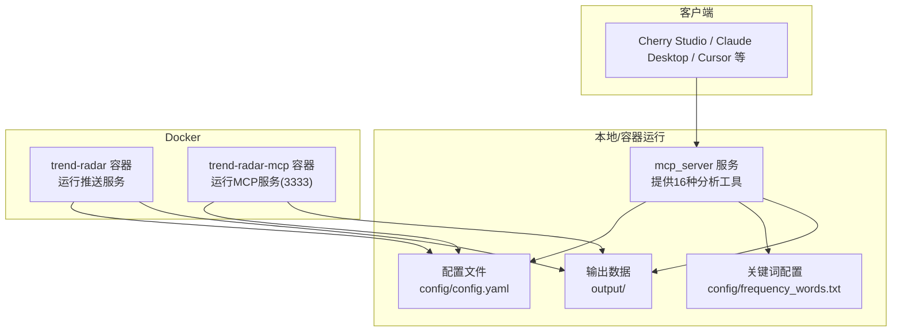
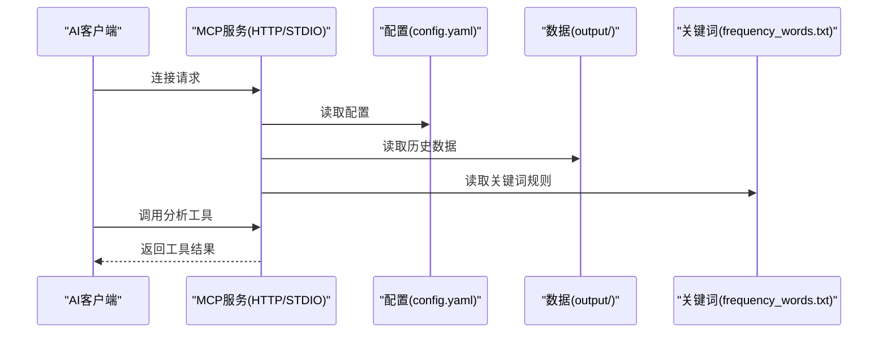
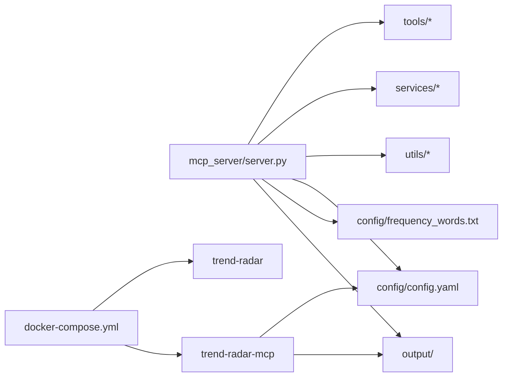
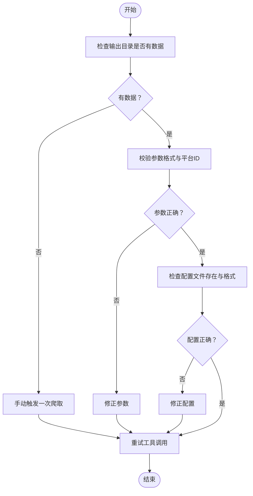
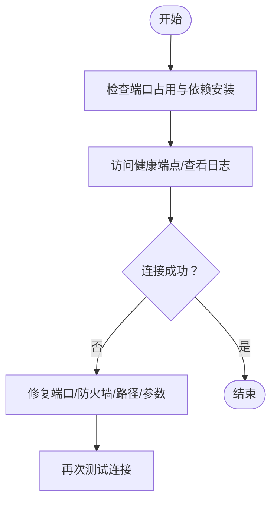

# 常见问题与故障排除

<cite>
**本文引用的文件**
- [README-MCP-FAQ.md](file://README-MCP-FAQ.md)
- [README-MCP-FAQ-EN.md](file://README-MCP-FAQ-EN.md)
- [README.md](file://README.md)
- [README-EN.md](file://README-EN.md)
- [docs/Deployment-Guide.md](file://docs/Deployment-Guide.md)
- [config/config.yaml](file://config/config.yaml)
- [config/frequency_words.txt](file://config/frequency_words.txt)
- [docker/docker-compose.yml](file://docker/docker-compose.yml)
- [docker/Dockerfile.mcp](file://docker/Dockerfile.mcp)
- [docker/manage.py](file://docker/manage.py)
- [mcp_server/CLAUDE.md](file://mcp_server/CLAUDE.md)
</cite>

## 目录
1. [简介](#简介)
2. [项目结构](#项目结构)
3. [核心组件](#核心组件)
4. [架构总览](#架构总览)
5. [详细组件分析](#详细组件分析)
6. [依赖关系分析](#依赖关系分析)
7. [性能考量](#性能考量)
8. [故障排除指南](#故障排除指南)
9. [结论](#结论)
10. [附录](#附录)

## 简介
本文件基于仓库内的 FAQ 文档与部署指南，系统整理了用户在配置、部署与使用过程中最常遇到的问题，包括“MCP 服务器无法连接”“关键词不触发通知”“Docker 容器启动失败”等，并提供可操作的诊断步骤、解决方案与最佳实践。同时补充日志分析技巧、网络连通性测试方法与配置校验建议，鼓励社区贡献问题案例，持续完善知识库。

## 项目结构
- MCP 服务位于 mcp_server 子模块，提供 16 种分析工具，支持 STDIO 与 HTTP 两种传输模式。
- 配置集中在 config 目录，包含平台、通知、权重、推送模式等核心配置。
- Docker 相关文件提供容器化部署与 MCP 专用镜像，便于远程访问与多客户端共享。
- 文档与 FAQ 分布在根目录与 docs 目录，覆盖部署、使用与故障排除。

图示来源
- [mcp_server/CLAUDE.md](file://mcp_server/CLAUDE.md#L1-L60)
- [docs/Deployment-Guide.md](file://docs/Deployment-Guide.md#L120-L170)
- [docker/docker-compose.yml](file://docker/docker-compose.yml#L1-L74)

章节来源
- [docs/Deployment-Guide.md](file://docs/Deployment-Guide.md#L1-L120)
- [docker/docker-compose.yml](file://docker/docker-compose.yml#L1-L74)

## 核心组件
- MCP 服务（STDIO/HTTP）：提供分析工具调用与健康检查端点，支持多客户端连接。
- 配置系统：集中管理平台、通知、权重、推送模式、时间窗口等。
- 关键词系统：支持基础语法与高级控制，决定推送内容与排序优先级。
- Docker 部署：提供独立 MCP 服务镜像与双容器架构，便于远程访问与扩展。

章节来源
- [mcp_server/CLAUDE.md](file://mcp_server/CLAUDE.md#L1-L120)
- [config/config.yaml](file://config/config.yaml#L1-L140)
- [config/frequency_words.txt](file://config/frequency_words.txt#L1-L114)
- [docker/Dockerfile.mcp](file://docker/Dockerfile.mcp#L1-L24)

## 架构总览
MCP 服务通过 STDIO 或 HTTP 暴露工具接口；客户端通过配置连接；配置与数据由 config 与 output 目录提供；Docker 提供容器化运行与远程访问能力。

图示来源
- [mcp_server/CLAUDE.md](file://mcp_server/CLAUDE.md#L1-L120)
- [config/config.yaml](file://config/config.yaml#L1-L140)
- [config/frequency_words.txt](file://config/frequency_words.txt#L1-L114)

## 详细组件分析

### MCP 服务器连接问题（“MCP 服务器无法连接”）
- 常见症状
  - 客户端无法连接到 MCP 服务
  - HTTP 模式访问 3333 端口失败
  - STDIO 模式提示找不到命令或路径错误
- 诊断步骤
  - 端口占用排查：确认 3333 端口未被占用，必要时更换端口
  - 依赖安装：重新运行一键安装脚本，确保依赖完整
  - 服务状态：查看 MCP 服务日志，确认启动成功
  - 连接方式：确认客户端使用正确的连接参数（STDIO 命令与参数、HTTP 地址）
- 解决方案
  - HTTP 模式：确保服务监听在 0.0.0.0:3333，检查防火墙与本地回环地址
  - STDIO 模式：确认 uv 命令路径正确，项目路径不含中文字符
  - 通用检查：重启客户端与服务，使用 MCP Inspector 测试连接

章节来源
- [README.md](file://README.md#L3175-L3224)
- [README-EN.md](file://README-EN.md#L3250-L3305)
- [docs/Deployment-Guide.md](file://docs/Deployment-Guide.md#L433-L477)

### 工具调用失败或返回错误（“工具调用失败或返回错误？”）
- 可能原因
  - 输出目录缺少数据或日期范围无数据
  - 参数格式错误（日期格式、平台ID）
  - 配置文件缺失或格式不正确
- 诊断步骤
  - 确认 output 目录存在数据，检查可用日期
  - 校验日期格式为 YYYY-MM-DD，平台ID正确
  - 检查 config/config.yaml 与 config/frequency_words.txt 是否存在且格式正确
- 解决方案
  - 先手动触发一次爬取，确保有数据
  - 使用 get_system_status 检查系统状态
  - 逐步缩小参数范围，定位问题

章节来源
- [README-EN.md](file://README-EN.md#L3302-L3323)
- [README.md](file://README.md#L3225-L3249)

### 关键词不触发通知（“关键词不触发通知”）
- 常见现象
  - 增量模式长时间无推送
  - daily/current 模式重复推送
- 诊断步骤
  - 检查推送模式：若使用 daily/current，会重复推送；如需“只推送新增”，请切换为 incremental
  - 校验关键词配置：是否过于严格或过于宽泛；是否包含过滤词导致命中率低
  - 校验监控平台数量：平台过少可能导致热点稀少
- 解决方案
  - 优化关键词配置：调整必选/过滤/数量限制，或分组管理
  - 切换推送模式：从 incremental 切换到 current/daily 获取定时推送
  - 增加监控平台：扩大信息来源

章节来源
- [README.md](file://README.md#L1879-L1905)
- [README-EN.md](file://README-EN.md#L1858-L1878)
- [config/frequency_words.txt](file://config/frequency_words.txt#L1-L114)
- [config/config.yaml](file://config/config.yaml#L26-L60)

### Docker 容器启动失败（“Docker 容器启动失败”）
- 常见症状
  - 容器启动后立即退出
  - 端口映射冲突或无法访问
  - 环境变量未生效
- 诊断步骤
  - 查看容器日志：docker logs trend-radar 或 trend-radar-mcp
  - 检查端口映射：确认 3333 与 8080 未被占用
  - 校验环境变量：确认必需环境变量已设置
  - 校验卷挂载：确认 config 与 output 目录权限与路径正确
- 解决方案
  - 使用 docker-compose 启动，确保服务间依赖与端口映射正确
  - 使用 manage.py 辅助检查容器运行状态与时间信息
  - 重新构建镜像并清理缓存后重试

章节来源
- [docs/Deployment-Guide.md](file://docs/Deployment-Guide.md#L164-L223)
- [docker/docker-compose.yml](file://docker/docker-compose.yml#L1-L74)
- [docker/manage.py](file://docker/manage.py#L195-L233)

### 网络连通性与数据源问题
- 常见症状
  - 爬虫数据为空，output 目录无数据
  - 访问 newsnow API 失败
- 诊断步骤
  - 手动运行爬虫：uv run python main.py
  - 检查网络连通性：curl 访问数据源 API
  - 校验代理设置：如需代理，确认代理地址与超时配置
- 解决方案
  - 临时关闭代理或更换代理
  - 调整请求间隔与超时，避免触发限流
  - 使用本地数据进行 AI 分析（MCP 工具依赖已有数据）

章节来源
- [docs/Deployment-Guide.md](file://docs/Deployment-Guide.md#L463-L477)
- [config/config.yaml](file://config/config.yaml#L5-L15)

### 日志分析与健康检查
- 日志分析
  - 应用日志：tail -f logs/trendradar.log，grep ERROR 统计错误类型
  - Docker 日志：docker logs -f trend-radar
  - 错误模式：定位慢查询、超时、连接失败等
- 健康检查
  - HTTP 健康端点：curl http://localhost:3333/health
  - 系统健康脚本：检查 MCP 服务与数据更新情况
  - 容器运行时间：使用 manage.py 辅助查看 PID 1 运行时长

章节来源
- [docs/Deployment-Guide.md](file://docs/Deployment-Guide.md#L335-L431)
- [docker/manage.py](file://docker/manage.py#L195-L233)

## 依赖关系分析
- MCP 服务依赖
  - fastmcp、websockets、requests、pytz、PyYAML 等核心依赖
  - 配置依赖：config/config.yaml、config/frequency_words.txt
  - 数据依赖：output 目录下的历史数据文件
- Docker 依赖
  - MCP 专用镜像暴露 3333 端口，容器间通过卷挂载共享配置与数据
  - docker-compose 定义双服务：推送服务与 MCP 服务

图示来源
- [mcp_server/CLAUDE.md](file://mcp_server/CLAUDE.md#L160-L200)
- [docker/docker-compose.yml](file://docker/docker-compose.yml#L1-L74)

章节来源
- [mcp_server/CLAUDE.md](file://mcp_server/CLAUDE.md#L160-L200)
- [docker/docker-compose.yml](file://docker/docker-compose.yml#L1-L74)

## 性能考量
- 缓存与分页：工具支持 TTL 缓存与大数据集分页，减少内存压力
- 网络优化：连接池、请求重试、超时控制
- 排序与权重：合理设置权重与排序优先级，降低无效数据传输
- Docker 资源：为容器设置合理的 CPU/内存限制，避免资源争用

章节来源
- [mcp_server/CLAUDE.md](file://mcp_server/CLAUDE.md#L270-L312)
- [docs/Deployment-Guide.md](file://docs/Deployment-Guide.md#L639-L683)

## 故障排除指南

### 一、MCP 服务器无法连接
- 检查端口占用与依赖安装
- 确认服务监听地址与端口
- 使用 MCP Inspector 测试连接
- 查看服务日志定位错误

章节来源
- [README.md](file://README.md#L3175-L3224)
- [README-EN.md](file://README-EN.md#L3250-L3305)
- [docs/Deployment-Guide.md](file://docs/Deployment-Guide.md#L433-L477)

### 二、工具调用失败或返回错误
- 确认输出目录有数据，检查日期范围
- 校验参数格式与平台ID
- 检查配置文件存在与格式正确

章节来源
- [README-EN.md](file://README-EN.md#L3302-L3323)
- [README.md](file://README.md#L3225-L3249)

### 三、关键词不触发通知
- 切换推送模式：从 daily/current 切换到 incremental
- 优化关键词配置：调整必选/过滤/数量限制
- 增加监控平台数量

章节来源
- [README.md](file://README.md#L1879-L1905)
- [README-EN.md](file://README-EN.md#L1858-L1878)
- [config/frequency_words.txt](file://config/frequency_words.txt#L1-L114)

### 四、Docker 容器启动失败
- 查看容器日志与端口映射
- 校验环境变量与卷挂载
- 使用 docker-compose 启动双服务
- 使用 manage.py 辅助检查运行状态

章节来源
- [docs/Deployment-Guide.md](file://docs/Deployment-Guide.md#L164-L223)
- [docker/docker-compose.yml](file://docker/docker-compose.yml#L1-L74)
- [docker/manage.py](file://docker/manage.py#L195-L233)

### 五、网络连通性与数据源问题
- 手动运行爬虫与 curl 测试数据源
- 校验代理与超时设置
- 调整请求间隔避免限流

章节来源
- [docs/Deployment-Guide.md](file://docs/Deployment-Guide.md#L463-L477)
- [config/config.yaml](file://config/config.yaml#L5-L15)

### 六、日志分析与健康检查
- 应用日志与 Docker 日志
- 错误模式统计与性能瓶颈定位
- HTTP 健康端点与系统健康脚本
- 容器运行时间辅助诊断

章节来源
- [docs/Deployment-Guide.md](file://docs/Deployment-Guide.md#L335-L431)
- [docker/manage.py](file://docker/manage.py#L195-L233)

## 结论
通过系统化的故障排除流程与配置校验，大多数问题可在短时间内定位并解决。建议用户在部署初期即建立日志与健康检查习惯，结合 Docker 与 MCP 专用镜像，实现稳定可靠的远程访问与多客户端共享。欢迎社区贡献更多问题案例，持续完善知识库。

## 附录

### A. 常用诊断流程图（工具调用失败）

图示来源
- [README-EN.md](file://README-EN.md#L3302-L3323)
- [README.md](file://README.md#L3225-L3249)

### B. 常用诊断流程图（MCP 连接失败）

图示来源
- [README.md](file://README.md#L3175-L3224)
- [README-EN.md](file://README-EN.md#L3250-L3305)
- [docs/Deployment-Guide.md](file://docs/Deployment-Guide.md#L433-L477)