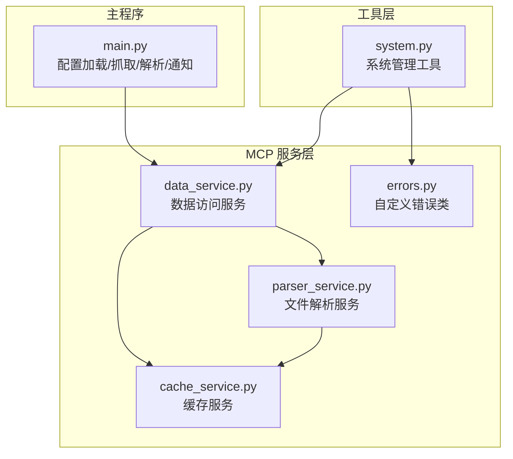
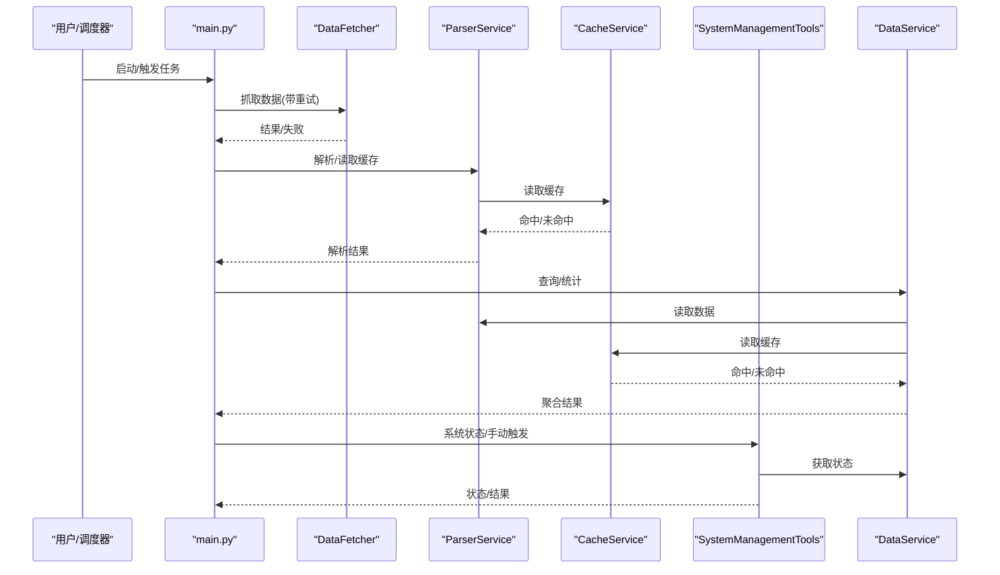
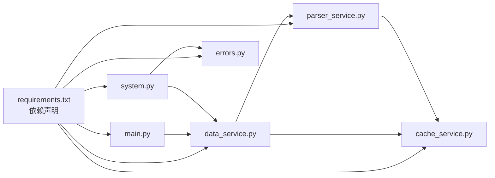

# 运行时异常

<cite>
**本文引用的文件**
- [main.py](file://main.py)
- [config.yaml](file://config/config.yaml)
- [errors.py](file://mcp_server/utils/errors.py)
- [data_service.py](file://mcp_server/services/data_service.py)
- [parser_service.py](file://mcp_server/services/parser_service.py)
- [cache_service.py](file://mcp_server/services/cache_service.py)
- [system.py](file://mcp_server/tools/system.py)
- [Deployment-Guide.md](file://docs/Deployment-Guide.md)
- [requirements.txt](file://requirements.txt)
</cite>

## 目录
1. [简介](#简介)
2. [项目结构](#项目结构)
3. [核心组件](#核心组件)
4. [架构总览](#架构总览)
5. [详细组件分析](#详细组件分析)
6. [依赖关系分析](#依赖关系分析)
7. [性能考虑](#性能考虑)
8. [故障排查指南](#故障排查指南)
9. [结论](#结论)
10. [附录](#附录)

## 简介
本章节聚焦于程序运行过程中的异常处理与恢复策略，涵盖爬虫中断、通知发送失败、数据解析错误、内存溢出等常见问题。文档提供日志定位方法、常见异常类型分析（网络超时、反爬机制、编码错误）、重试机制配置、错误告警设置与性能调优建议，并说明如何安全重启服务与恢复数据状态。

## 项目结构
- 主程序入口负责配置加载、数据抓取、解析与通知发送；同时提供通知渠道配置与批量发送策略。
- MCP 服务层包含数据服务、解析服务与缓存服务，提供统一的数据访问与缓存能力。
- 工具层提供系统状态查询与手动触发爬取的能力，并对异常进行统一包装与返回。

图表来源
- [main.py](file://main.py#L162-L395)
- [data_service.py](file://mcp_server/services/data_service.py#L1-L120)
- [parser_service.py](file://mcp_server/services/parser_service.py#L1-L120)
- [cache_service.py](file://mcp_server/services/cache_service.py#L1-L120)
- [errors.py](file://mcp_server/utils/errors.py#L1-L94)
- [system.py](file://mcp_server/tools/system.py#L1-L120)

章节来源
- [main.py](file://main.py#L162-L395)
- [data_service.py](file://mcp_server/services/data_service.py#L1-L120)
- [parser_service.py](file://mcp_server/services/parser_service.py#L1-L120)
- [cache_service.py](file://mcp_server/services/cache_service.py#L1-L120)
- [errors.py](file://mcp_server/utils/errors.py#L1-L94)
- [system.py](file://mcp_server/tools/system.py#L1-L120)

## 核心组件
- 配置加载与通知配置：集中于主程序的配置加载函数，支持环境变量覆盖与多渠道通知配置。
- 数据抓取与重试：DataFetcher 提供带指数退避的重试机制，降低网络波动与反爬影响。
- 数据解析与缓存：ParserService 负责 txt 文件解析与缓存；DataService 提供数据聚合与缓存策略。
- 自定义错误：errors.py 定义统一的错误类型，便于上层捕获与提示。
- 系统工具：SystemManagementTools 提供系统状态查询与手动触发爬取，内部封装异常处理。

章节来源
- [main.py](file://main.py#L162-L395)
- [main.py](file://main.py#L616-L740)
- [data_service.py](file://mcp_server/services/data_service.py#L1-L120)
- [parser_service.py](file://mcp_server/services/parser_service.py#L1-L120)
- [errors.py](file://mcp_server/utils/errors.py#L1-L94)
- [system.py](file://mcp_server/tools/system.py#L1-L120)

## 架构总览
下图展示异常处理在整体流程中的位置与交互：

图表来源
- [main.py](file://main.py#L616-L740)
- [parser_service.py](file://mcp_server/services/parser_service.py#L160-L260)
- [cache_service.py](file://mcp_server/services/cache_service.py#L1-L120)
- [system.py](file://mcp_server/tools/system.py#L1-L120)
- [data_service.py](file://mcp_server/services/data_service.py#L1-L120)

## 详细组件分析

### 异常类型与定位
- 网络超时与反爬机制
  - 抓取阶段对请求设置超时与重试，遇到状态码异常或响应状态非预期时进行退避重试。
  - 通知阶段对 ntfy 速率限制进行二次重试，避免因公共服务器限流导致丢失。
- 编码错误与解析失败
  - 解析 txt 文件时对单行异常进行忽略并继续处理其他行；解析 YAML/关键词文件时抛出自定义错误类型。
- 配置错误与参数校验
  - 自定义错误类统一承载错误码、消息与建议，便于前端或上层工具展示。

章节来源
- [main.py](file://main.py#L616-L740)
- [main.py](file://main.py#L4505-L4627)
- [parser_service.py](file://mcp_server/services/parser_service.py#L55-L145)
- [parser_service.py](file://mcp_server/services/parser_service.py#L262-L356)
- [errors.py](file://mcp_server/utils/errors.py#L1-L94)

### 重试机制配置
- 抓取重试
  - DataFetcher 在单个平台请求失败时进行最多 N 次重试，采用随机退避等待，避免并发冲击。
  - 爬取批次间加入随机间隔，降低被反爬识别概率。
- 通知重试
  - ntfy 在 429 速率限制时进行一次重试；公共服务器建议间隔更长，自托管可缩短。
- 配置项
  - 请求间隔、重试次数、批次大小、分批间隔等由配置文件与环境变量共同决定。

章节来源
- [main.py](file://main.py#L616-L740)
- [main.py](file://main.py#L4505-L4627)
- [config.yaml](file://config/config.yaml#L1-L140)

### 错误告警与日志
- 邮件发送异常分类处理：认证失败、收件人/发件人被拒、连接错误、数据错误等分别打印明确提示。
- 通知渠道失败时记录状态码与错误详情，便于定位问题。
- 日志分析建议：使用部署指南中的 grep 命令筛选错误类型，统计错误分布，定位性能瓶颈。

章节来源
- [main.py](file://main.py#L4480-L4503)
- [main.py](file://main.py#L4627-L4639)
- [Deployment-Guide.md](file://docs/Deployment-Guide.md#L491-L505)

### 数据解析与缓存
- ParserService
  - 解析 txt 文件时对单行异常进行忽略，保证整体解析稳定性。
  - 读取指定日期数据时，若目录或文件不存在，抛出“数据不存在”错误。
- DataService
  - 读取今日数据使用较短缓存（15 分钟），历史数据使用较长缓存（1 小时），减少 IO 压力。
  - 对搜索/统计等操作进行缓存，提高响应速度。
- CacheService
  - 提供 TTL 缓存、清理过期、统计信息等能力，避免内存无限增长。

章节来源
- [parser_service.py](file://mcp_server/services/parser_service.py#L55-L145)
- [parser_service.py](file://mcp_server/services/parser_service.py#L160-L260)
- [data_service.py](file://mcp_server/services/data_service.py#L1-L120)
- [data_service.py](file://mcp_server/services/data_service.py#L120-L220)
- [cache_service.py](file://mcp_server/services/cache_service.py#L1-L120)

### 系统管理与手动触发
- SystemManagementTools
  - get_system_status：封装 MCPError 与通用异常，返回统一错误结构。
  - trigger_crawl：手动触发临时爬取，包含参数校验、配置读取、平台过滤与重试逻辑，支持可选持久化。

章节来源
- [system.py](file://mcp_server/tools/system.py#L1-L120)
- [system.py](file://mcp_server/tools/system.py#L120-L260)

## 依赖关系分析
- 外部依赖
  - requests、pytz、PyYAML、fastmcp、websockets 等，版本范围在 requirements.txt 中定义。
- 内部模块耦合
  - main.py 依赖配置与通知发送逻辑；DataService 依赖 ParserService 与 CacheService；SystemManagementTools 依赖 DataService 与自定义错误类。

图表来源
- [requirements.txt](file://requirements.txt#L1-L6)
- [main.py](file://main.py#L162-L395)
- [data_service.py](file://mcp_server/services/data_service.py#L1-L120)
- [parser_service.py](file://mcp_server/services/parser_service.py#L1-L120)
- [cache_service.py](file://mcp_server/services/cache_service.py#L1-L120)
- [errors.py](file://mcp_server/utils/errors.py#L1-L94)
- [system.py](file://mcp_server/tools/system.py#L1-L120)

章节来源
- [requirements.txt](file://requirements.txt#L1-L6)
- [main.py](file://main.py#L162-L395)
- [data_service.py](file://mcp_server/services/data_service.py#L1-L120)
- [parser_service.py](file://mcp_server/services/parser_service.py#L1-L120)
- [cache_service.py](file://mcp_server/services/cache_service.py#L1-L120)
- [errors.py](file://mcp_server/utils/errors.py#L1-L94)
- [system.py](file://mcp_server/tools/system.py#L1-L120)

## 性能考虑
- 缓存策略
  - 今日数据缓存 15 分钟，历史数据缓存 1 小时；对频繁查询进行缓存，减少 IO。
- 批量与分批
  - 通知渠道对消息大小进行限制与分批发送，避免被服务端拒绝。
- 请求间隔与退避
  - 抓取与通知之间设置随机间隔与退避，降低被反爬识别与限流风险。
- 系统优化建议
  - 部署指南提供内核参数与 Python 环境变量优化建议，有助于缓解内存与网络压力。

章节来源
- [data_service.py](file://mcp_server/services/data_service.py#L1-L120)
- [main.py](file://main.py#L4505-L4627)
- [Deployment-Guide.md](file://docs/Deployment-Guide.md#L638-L682)

## 故障排查指南

### 常见异常类型与定位
- 爬虫中断
  - 现象：部分平台请求失败、响应状态异常、超时。
  - 定位：查看抓取日志与重试记录；确认代理、请求头与超时设置。
  - 处理：启用重试与退避；检查平台接口可用性与反爬策略。
- 通知发送失败
  - 现象：渠道返回 429、413、认证失败等。
  - 定位：根据状态码与错误详情判断；检查渠道配置与批次大小。
  - 处理：对 429 进行重试；对 413 调整批次大小；修正认证信息。
- 数据解析错误
  - 现象：txt 文件某行解析失败、配置文件解析异常。
  - 定位：查看解析异常日志；确认文件编码与格式。
  - 处理：忽略单行异常继续处理；修正配置文件格式。
- 内存溢出
  - 现象：长时间运行后内存占用升高。
  - 定位：查看缓存统计与过期清理情况；评估数据规模。
  - 处理：启用缓存清理；限制返回条数；优化数据结构。

章节来源
- [main.py](file://main.py#L616-L740)
- [main.py](file://main.py#L4505-L4627)
- [parser_service.py](file://mcp_server/services/parser_service.py#L55-L145)
- [parser_service.py](file://mcp_server/services/parser_service.py#L262-L356)
- [cache_service.py](file://mcp_server/services/cache_service.py#L1-L120)

### 日志定位与分析
- 使用部署指南中的 grep 命令筛选错误类型与统计错误分布。
- 关注通知发送阶段的状态码与错误详情，定位具体渠道问题。
- 结合系统状态查询接口，确认数据可用性与缓存命中率。

章节来源
- [Deployment-Guide.md](file://docs/Deployment-Guide.md#L491-L505)
- [system.py](file://mcp_server/tools/system.py#L1-L120)

### 安全重启与状态恢复
- 安全重启
  - 遵循部署指南的升级与重启步骤，确保服务平滑重启。
- 状态恢复
  - 数据层通过缓存与文件系统维持状态；重启后缓存可自动重建。
  - 若需强制刷新，可清理缓存或删除过期记录后重新生成。

章节来源
- [Deployment-Guide.md](file://docs/Deployment-Guide.md#L595-L630)
- [cache_service.py](file://mcp_server/services/cache_service.py#L1-L120)

## 结论
通过对抓取、解析、通知与缓存等环节的异常处理与重试机制设计，系统能够在网络波动、反爬策略与配置错误等情况下保持稳健运行。结合日志分析与性能调优建议，用户可有效定位问题、降低风险并提升稳定性。建议在生产环境中启用缓存、合理设置重试与分批策略，并定期清理过期缓存与记录。

## 附录

### 重试与配置要点
- 抓取重试：最大重试次数、最小/最大等待时间、随机退避。
- 通知重试：ntfy 429 速率限制重试；公共服务器建议更长间隔。
- 配置项：请求间隔、批次大小、分批间隔、推送时间窗口等。

章节来源
- [main.py](file://main.py#L616-L740)
- [main.py](file://main.py#L4505-L4627)
- [config.yaml](file://config/config.yaml#L1-L140)