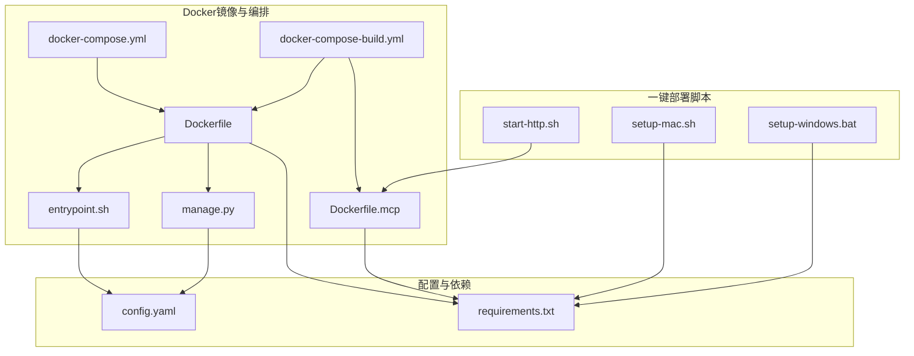
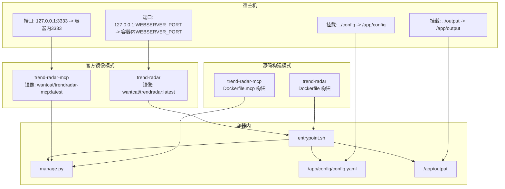
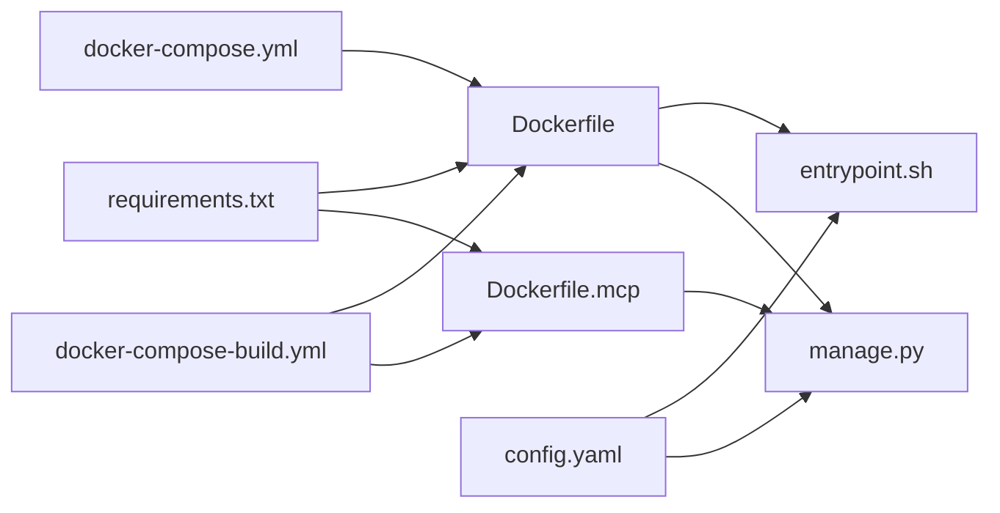
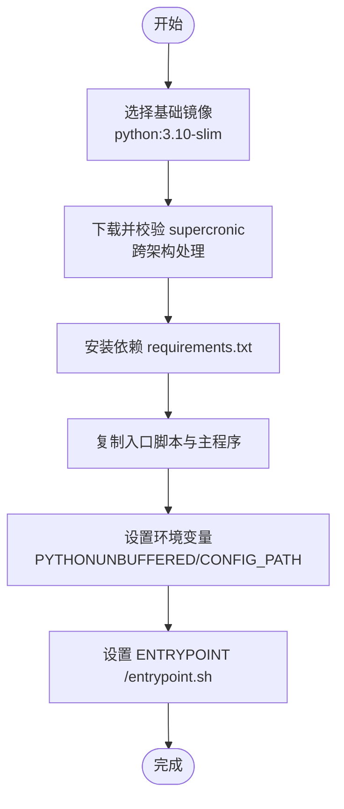
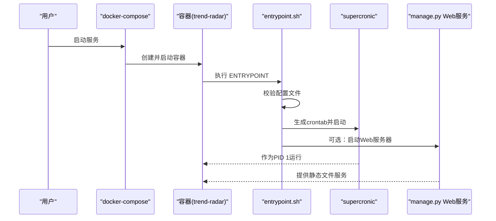

# 部署类问题

<cite>
**本文引用的文件**
- [docker/docker-compose.yml](file://docker/docker-compose.yml)
- [docker/docker-compose-build.yml](file://docker/docker-compose-build.yml)
- [docker/Dockerfile](file://docker/Dockerfile)
- [docker/Dockerfile.mcp](file://docker/Dockerfile.mcp)
- [docker/entrypoint.sh](file://docker/entrypoint.sh)
- [docker/manage.py](file://docker/manage.py)
- [docs/Deployment-Guide.md](file://docs/Deployment-Guide.md)
- [requirements.txt](file://requirements.txt)
- [config/config.yaml](file://config/config.yaml)
- [setup-mac.sh](file://setup-mac.sh)
- [setup-windows.bat](file://setup-windows.bat)
- [start-http.sh](file://start-http.sh)
</cite>

## 目录
1. [简介](#简介)
2. [项目结构](#项目结构)
3. [核心组件](#核心组件)
4. [架构总览](#架构总览)
5. [详细组件分析](#详细组件分析)
6. [依赖关系分析](#依赖关系分析)
7. [性能与资源考虑](#性能与资源考虑)
8. [故障排查指南](#故障排查指南)
9. [结论](#结论)
10. [附录](#附录)

## 简介
本文件聚焦于TrendRadar在Docker部署过程中的常见问题与解决方案，涵盖容器无法启动、端口冲突、依赖安装错误、docker-compose配置不当、Dockerfile构建失败、环境变量未设置等典型场景，并提供Linux、macOS、Windows三类系统的部署排查步骤，包括权限设置、网络配置、资源限制等。同时，指导用户如何查看构建日志与运行时日志以定位问题。

## 项目结构
围绕Docker部署的关键文件与目录如下：
- Docker镜像与编排
  - docker/Dockerfile：基础镜像构建流程、依赖安装、入口脚本与环境变量
  - docker/Dockerfile.mcp：MCP HTTP服务专用镜像
  - docker/docker-compose.yml：官方发布镜像的编排模板
  - docker/docker-compose-build.yml：基于源码构建的编排模板
  - docker/entrypoint.sh：容器启动入口逻辑（校验配置、生成crontab、启动Web服务等）
  - docker/manage.py：容器内管理工具（状态、日志、Web服务器启停等）
- 配置与依赖
  - config/config.yaml：应用配置（通知、平台、权重等）
  - requirements.txt：Python依赖清单
- 一键部署脚本
  - setup-mac.sh、setup-windows.bat：本地开发环境的一键部署
  - start-http.sh：本地HTTP模式启动脚本

图表来源
- [docker/Dockerfile](file://docker/Dockerfile#L1-L71)
- [docker/Dockerfile.mcp](file://docker/Dockerfile.mcp#L1-L24)
- [docker/docker-compose.yml](file://docker/docker-compose.yml#L1-L74)
- [docker/docker-compose-build.yml](file://docker/docker-compose-build.yml#L1-L78)
- [docker/entrypoint.sh](file://docker/entrypoint.sh#L1-L50)
- [docker/manage.py](file://docker/manage.py#L1-L625)
- [config/config.yaml](file://config/config.yaml#L1-L140)
- [requirements.txt](file://requirements.txt#L1-L6)
- [setup-mac.sh](file://setup-mac.sh#L1-L119)
- [setup-windows.bat](file://setup-windows.bat#L1-L181)
- [start-http.sh](file://start-http.sh#L1-L22)

章节来源
- [docker/Dockerfile](file://docker/Dockerfile#L1-L71)
- [docker/Dockerfile.mcp](file://docker/Dockerfile.mcp#L1-L24)
- [docker/docker-compose.yml](file://docker/docker-compose.yml#L1-L74)
- [docker/docker-compose-build.yml](file://docker/docker-compose-build.yml#L1-L78)
- [docker/entrypoint.sh](file://docker/entrypoint.sh#L1-L50)
- [docker/manage.py](file://docker/manage.py#L1-L625)
- [config/config.yaml](file://config/config.yaml#L1-L140)
- [requirements.txt](file://requirements.txt#L1-L6)
- [setup-mac.sh](file://setup-mac.sh#L1-L119)
- [setup-windows.bat](file://setup-windows.bat#L1-L181)
- [start-http.sh](file://start-http.sh#L1-L22)

## 核心组件
- Dockerfile构建流程
  - 基于python:3.10-slim，安装supercronic（跨架构下载与校验）、pip安装requirements.txt、复制入口脚本与主程序、设置环境变量、设置ENTRYPOINT
- Dockerfile.mcp构建流程
  - 基于python:3.10-slim，安装requirements.txt，复制mcp_server模块，暴露3333端口，CMD启动MCP HTTP服务
- docker-compose.yml（官方镜像）
  - 使用预构建镜像，映射端口、挂载配置与输出目录、注入环境变量（含通知、Web服务器、定时任务等）
- docker-compose-build.yml（源码构建）
  - 使用本地Dockerfile构建镜像，映射端口、挂载配置与输出目录、注入环境变量
- entrypoint.sh启动逻辑
  - 校验配置文件存在性、保存环境变量、根据RUN_MODE选择一次性执行或cron调度、可选启动Web服务器、通过supercronic作为PID 1运行
- manage.py容器管理工具
  - 提供run/status/config/files/logs/restart/start_webserver/stop_webserver/webserver_status/help等命令，便于诊断与运维
- 配置与依赖
  - config/config.yaml包含通知渠道、平台、权重等配置；requirements.txt列出依赖版本范围

章节来源
- [docker/Dockerfile](file://docker/Dockerfile#L1-L71)
- [docker/Dockerfile.mcp](file://docker/Dockerfile.mcp#L1-L24)
- [docker/docker-compose.yml](file://docker/docker-compose.yml#L1-L74)
- [docker/docker-compose-build.yml](file://docker/docker-compose-build.yml#L1-L78)
- [docker/entrypoint.sh](file://docker/entrypoint.sh#L1-L50)
- [docker/manage.py](file://docker/manage.py#L1-L625)
- [config/config.yaml](file://config/config.yaml#L1-L140)
- [requirements.txt](file://requirements.txt#L1-L6)

## 架构总览
Docker部署采用两种模式：
- 官方镜像模式：通过docker-compose.yml直接拉起镜像，适合快速体验与生产部署
- 源码构建模式：通过docker-compose-build.yml在本地构建镜像，适合定制化与离线环境

图表来源
- [docker/docker-compose.yml](file://docker/docker-compose.yml#L1-L74)
- [docker/docker-compose-build.yml](file://docker/docker-compose-build.yml#L1-L78)
- [docker/Dockerfile](file://docker/Dockerfile#L1-L71)
- [docker/Dockerfile.mcp](file://docker/Dockerfile.mcp#L1-L24)
- [docker/entrypoint.sh](file://docker/entrypoint.sh#L1-L50)
- [docker/manage.py](file://docker/manage.py#L1-L625)

## 详细组件分析

### Dockerfile构建失败排查
- 症状
  - 构建阶段下载supercronic失败、SHA1校验失败、pip安装依赖超时或失败
- 可能原因
  - 网络不稳定或代理限制
  - 架构不匹配（amd64/arm64）
  - requirements.txt版本范围导致冲突
- 排查步骤
  - 检查网络连通性与DNS解析
  - 验证TARGETARCH与supercronic对应版本
  - 使用--no-cache-dir与--retries参数优化pip安装
  - 在本地Dockerfile.mcp中单独验证MCP服务端口与依赖
- 修复建议
  - 使用国内镜像源或代理
  - 固定supercronic版本并校验SHA1
  - 降低依赖版本范围或锁定版本

章节来源
- [docker/Dockerfile](file://docker/Dockerfile#L1-L71)
- [requirements.txt](file://requirements.txt#L1-L6)
- [docker/Dockerfile.mcp](file://docker/Dockerfile.mcp#L1-L24)

### docker-compose.yml配置不当
- 症状
  - 容器启动后立即退出、端口映射冲突、配置文件未生效
- 可能原因
  - 环境变量未设置或拼写错误
  - 端口绑定到127.0.0.1且宿主机访问受限
  - 挂载路径权限不足或路径不存在
- 排查步骤
  - 使用docker compose config校验配置语法
  - 检查WEBSERVER_PORT与3333端口占用情况
  - 确认挂载路径存在且可读写
  - 使用docker compose logs -f查看实时日志
- 修复建议
  - 明确环境变量并在宿主机导出或通过.env文件注入
  - 将端口绑定策略调整为0.0.0.0或在防火墙放行
  - 修正挂载路径并确保权限（chmod/chown）

章节来源
- [docker/docker-compose.yml](file://docker/docker-compose.yml#L1-L74)
- [docker/entrypoint.sh](file://docker/entrypoint.sh#L1-L50)

### Dockerfile.mcp构建与端口暴露
- 症状
  - MCP服务无法被外部访问、容器内端口不可达
- 可能原因
  - EXPOSE声明与实际CMD端口不一致
  - 容器网络策略限制
- 排查步骤
  - 确认Dockerfile.mcp中CMD使用的端口与EXPOSE一致
  - 使用docker inspect查看端口映射与网络配置
  - 在宿主机使用curl或浏览器访问容器内3333端口
- 修复建议
  - 保持EXPOSE与CMD端口一致
  - 在compose中显式映射端口并绑定到0.0.0.0

章节来源
- [docker/Dockerfile.mcp](file://docker/Dockerfile.mcp#L1-L24)
- [docker/docker-compose.yml](file://docker/docker-compose.yml#L1-L74)

### 环境变量未设置
- 症状
  - 定时任务未执行、Web服务器未启动、通知渠道无效
- 可能原因
  - RUN_MODE、CRON_SCHEDULE、ENABLE_WEBSERVER、WEBSERVER_PORT等未设置
  - 通知渠道URL或Token未正确注入
- 排查步骤
  - 使用docker compose exec进入容器，打印环境变量进行核对
  - 使用manage.py config查看当前生效的环境变量
- 修复建议
  - 在compose文件中明确设置所有必需环境变量
  - 使用环境文件（env文件）集中管理敏感配置

章节来源
- [docker/docker-compose.yml](file://docker/docker-compose.yml#L1-L74)
- [docker/entrypoint.sh](file://docker/entrypoint.sh#L1-L50)
- [docker/manage.py](file://docker/manage.py#L273-L313)

### 容器无法启动与PID 1问题
- 症状
  - 容器启动即退出、supercronic未作为PID 1
- 可能原因
  - 入口脚本提前退出（配置文件缺失、crontab格式错误）
  - CMD/ENTRYPOINT配置不当
- 排查步骤
  - 使用docker logs查看启动日志
  - 使用docker compose exec进入容器，运行manage.py status检查PID 1状态
  - 检查/tmp/crontab内容与格式
- 修复建议
  - 确保/config目录存在config.yaml与frequency_words.txt
  - 使用supercronic -test验证crontab格式
  - 保持ENTRYPOINT为/entrypoint.sh

章节来源
- [docker/entrypoint.sh](file://docker/entrypoint.sh#L1-L50)
- [docker/manage.py](file://docker/manage.py#L127-L271)

### 端口冲突
- 症状
  - 容器启动报端口占用、宿主机无法访问服务
- 可能原因
  - 3333或WEBSERVER_PORT已被占用
  - 绑定地址为127.0.0.1导致外网不可达
- 排查步骤
  - 使用netstat/ss查看端口占用
  - 修改compose中的端口映射或宿主机端口
  - 将端口绑定策略调整为0.0.0.0
- 修复建议
  - 更改映射端口或释放宿主机占用端口
  - 在防火墙开放相应端口

章节来源
- [docker/docker-compose.yml](file://docker/docker-compose.yml#L1-L74)
- [docker/Dockerfile.mcp](file://docker/Dockerfile.mcp#L1-L24)

### 依赖安装错误
- 症状
  - pip安装失败、依赖版本冲突、构建超时
- 可能原因
  - 网络不稳定、镜像源不可用、requirements.txt版本范围过宽
- 排查步骤
  - 在本地Dockerfile中单独执行pip install验证
  - 使用--verbose输出详细日志
  - 替换为国内镜像源或离线安装
- 修复建议
  - 固定依赖版本或使用lock文件
  - 使用--no-cache-dir减少缓存干扰

章节来源
- [requirements.txt](file://requirements.txt#L1-L6)
- [docker/Dockerfile](file://docker/Dockerfile#L1-L71)

### Linux/macOS/Windows部署排查步骤
- Linux/macOS
  - 使用setup-mac.sh进行一键部署，检查UV安装与依赖同步
  - 若使用Docker，使用docker compose config与logs -f定位问题
  - 使用firewalld/ufw开放3333端口
- Windows
  - 使用setup-windows.bat进行一键部署，注意重新打开终端以加载UV
  - 使用docker compose config与docker logs -f定位问题
  - 使用Windows防火墙开放3333端口

章节来源
- [setup-mac.sh](file://setup-mac.sh#L1-L119)
- [setup-windows.bat](file://setup-windows.bat#L1-L181)
- [docs/Deployment-Guide.md](file://docs/Deployment-Guide.md#L1-L693)

### 权限设置、网络配置、资源限制
- 权限设置
  - 挂载目录需具备读写权限；entrypoint.sh会检查配置文件存在性
- 网络配置
  - 端口绑定策略与防火墙放行；MCP服务端口3333需可达
- 资源限制
  - 通过systemd或Docker资源限制（CPU/内存）避免资源耗尽

章节来源
- [docker/entrypoint.sh](file://docker/entrypoint.sh#L1-L50)
- [docker/docker-compose.yml](file://docker/docker-compose.yml#L1-L74)
- [docs/Deployment-Guide.md](file://docs/Deployment-Guide.md#L1-L693)

### 如何查看构建日志与运行时日志
- 构建日志
  - docker build -t trendradar:latest . 输出详细构建过程
- 运行时日志
  - docker logs trend-radar 查看容器日志
  - docker logs -f trend-radar 实时跟踪
  - 在容器内使用manage.py logs查看PID 1输出
  - 使用manage.py status查看运行状态与建议

章节来源
- [docs/Deployment-Guide.md](file://docs/Deployment-Guide.md#L335-L429)
- [docker/manage.py](file://docker/manage.py#L353-L377)

## 依赖关系分析
- Dockerfile依赖requirements.txt与entrypoint.sh
- Dockerfile.mcp依赖requirements.txt与mcp_server模块
- docker-compose.yml依赖Dockerfile（官方镜像模式）或Dockerfile.mcp（MCP模式）
- entrypoint.sh依赖/config下的配置文件
- manage.py依赖/config与/outputs目录

图表来源
- [requirements.txt](file://requirements.txt#L1-L6)
- [docker/Dockerfile](file://docker/Dockerfile#L1-L71)
- [docker/Dockerfile.mcp](file://docker/Dockerfile.mcp#L1-L24)
- [docker/entrypoint.sh](file://docker/entrypoint.sh#L1-L50)
- [docker/manage.py](file://docker/manage.py#L1-L625)
- [config/config.yaml](file://config/config.yaml#L1-L140)
- [docker/docker-compose.yml](file://docker/docker-compose.yml#L1-L74)
- [docker/docker-compose-build.yml](file://docker/docker-compose-build.yml#L1-L78)

## 性能与资源考虑
- 定时任务频率与资源消耗
  - CRON_SCHEDULE过于频繁可能导致CPU/IO压力增大
- 网络与代理
  - 启用代理或调整request_interval可缓解网络波动
- 存储与日志轮转
  - 使用logrotate或容器日志驱动的日志轮转策略
- 端口与并发
  - MCP服务端口3333建议限制并发连接数与超时时间

章节来源
- [config/config.yaml](file://config/config.yaml#L1-L140)
- [docs/Deployment-Guide.md](file://docs/Deployment-Guide.md#L335-L429)

## 故障排查指南
- 常见问题与解决
  - UV安装失败：检查PATH、使用pip/pipx安装或手动下载
  - MCP连接失败：检查systemd服务状态、端口占用、日志
  - 爬虫数据为空：检查config.yaml、手动运行main.py、验证网络连通
  - 内存不足：限制内存使用、优化Python内存分配
- 日志分析
  - 使用grep过滤错误日志、统计错误类型、定位性能瓶颈
- 健康检查
  - 使用curl http://localhost:3333/health或systemd健康检查脚本

章节来源
- [docs/Deployment-Guide.md](file://docs/Deployment-Guide.md#L431-L630)

## 结论
通过梳理Dockerfile、docker-compose配置、入口脚本与管理工具，可以系统性地定位与解决部署过程中的构建失败、容器无法启动、端口冲突、依赖安装错误等问题。建议在生产环境中统一使用源码构建模式，结合环境变量与日志工具进行持续监控与维护。

## 附录
- Dockerfile构建流程图

图表来源
- [docker/Dockerfile](file://docker/Dockerfile#L1-L71)

- 容器启动序列图

图表来源
- [docker/docker-compose.yml](file://docker/docker-compose.yml#L1-L74)
- [docker/entrypoint.sh](file://docker/entrypoint.sh#L1-L50)
- [docker/manage.py](file://docker/manage.py#L403-L464)