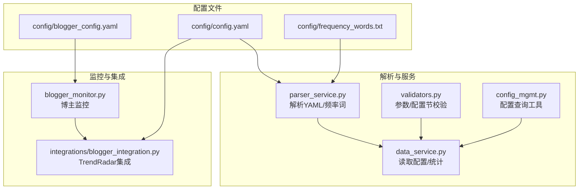
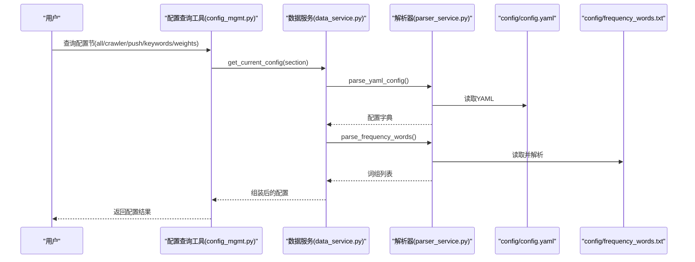
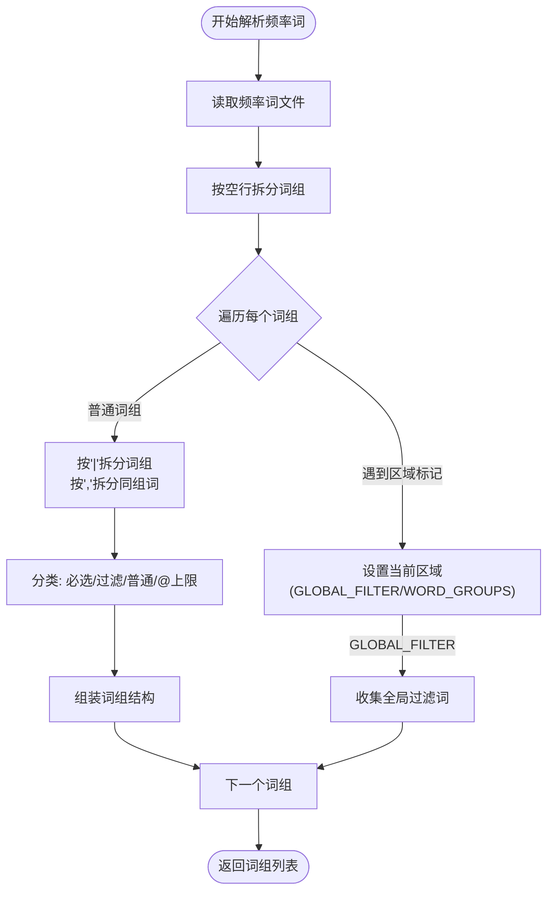
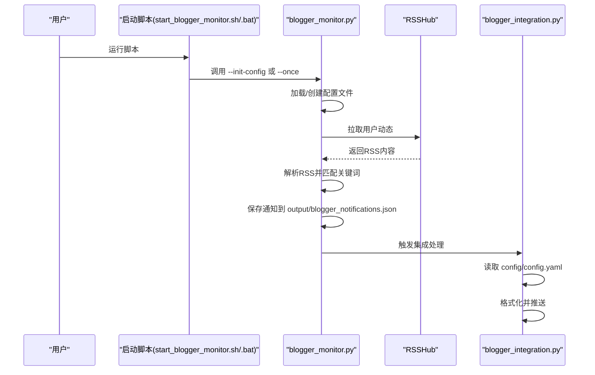
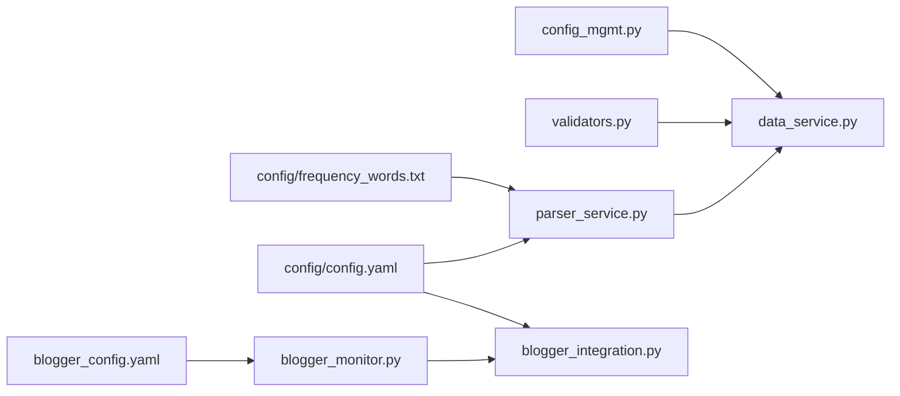

# 配置类问题

<cite>
**本文引用的文件**
- [config/config.yaml](file://config/config.yaml)
- [config/blogger_config.yaml](file://config/blogger_config.yaml)
- [config/frequency_words.txt](file://config/frequency_words.txt)
- [mcp_server/tools/config_mgmt.py](file://mcp_server/tools/config_mgmt.py)
- [mcp_server/utils/validators.py](file://mcp_server/utils/validators.py)
- [mcp_server/services/data_service.py](file://mcp_server/services/data_service.py)
- [mcp_server/services/parser_service.py](file://mcp_server/services/parser_service.py)
- [blogger_monitor.py](file://blogger_monitor.py)
- [integrations/blogger_integration.py](file://integrations/blogger_integration.py)
- [README-BloggerMonitor.md](file://README-BloggerMonitor.md)
- [README-EN.md](file://README-EN.md)
- [start_blogger_monitor.sh](file://start_blogger_monitor.sh)
- [start_blogger_monitor.bat](file://start_blogger_monitor.bat)
</cite>

## 目录
1. [简介](#简介)
2. [项目结构](#项目结构)
3. [核心组件](#核心组件)
4. [架构总览](#架构总览)
5. [详细组件分析](#详细组件分析)
6. [依赖关系分析](#依赖关系分析)
7. [性能考量](#性能考量)
8. [故障排查指南](#故障排查指南)
9. [结论](#结论)
10. [附录](#附录)

## 简介
本章节聚焦于用户在配置过程中常遇的问题，包括：
- config.yaml 配置错误（YAML 格式、字段命名、数值范围、多账号配对一致性）
- frequency_words.txt 关键词不生效（语法、分组、全局过滤、显示上限）
- blogger_config.yaml 博主监控配置失败（用户ID、平台、关键词、RSSHub 访问）

我们将给出正确的配置格式、常见错误示例与修复方法，并提供配置校验建议与语法检查工具推荐，解释各配置项的作用范围与优先级。

## 项目结构
与配置相关的关键文件与职责如下：
- config/config.yaml：系统总体配置（爬虫开关、通知渠道、推送窗口、权重、平台列表等）
- config/frequency_words.txt：个人关注词列表，用于“频率词”统计与筛选
- config/blogger_config.yaml：博主监控配置（监控目标、全局关键词、通知、检查间隔、RSSHub 等）
- mcp_server/services/parser_service.py：解析 YAML 配置与频率词文件
- mcp_server/services/data_service.py：读取与聚合配置，暴露给工具层
- mcp_server/utils/validators.py：参数与配置节校验
- mcp_server/tools/config_mgmt.py：对外提供配置查询工具
- blogger_monitor.py：博主监控主程序，负责加载配置、拉取 RSSHub、关键词匹配、通知落盘
- integrations/blogger_integration.py：将博主动态格式化并集成到 TrendRadar 推送通道
- README-BloggerMonitor.md：博主监控配置与故障排除说明
- README-EN.md：多账号推送配置与安全注意事项
- 启动脚本：start_blogger_monitor.sh / start_blogger_monitor.bat，辅助初始化与查看配置/日志

图表来源
- [config/config.yaml](file://config/config.yaml#L1-L140)
- [config/frequency_words.txt](file://config/frequency_words.txt#L1-L114)
- [config/blogger_config.yaml](file://config/blogger_config.yaml#L1-L60)
- [mcp_server/services/parser_service.py](file://mcp_server/services/parser_service.py#L290-L356)
- [mcp_server/services/data_service.py](file://mcp_server/services/data_service.py#L411-L496)
- [mcp_server/utils/validators.py](file://mcp_server/utils/validators.py#L292-L307)
- [mcp_server/tools/config_mgmt.py](file://mcp_server/tools/config_mgmt.py#L26-L67)
- [blogger_monitor.py](file://blogger_monitor.py#L54-L114)
- [integrations/blogger_integration.py](file://integrations/blogger_integration.py#L19-L37)

章节来源
- [config/config.yaml](file://config/config.yaml#L1-L140)
- [config/blogger_config.yaml](file://config/blogger_config.yaml#L1-L60)
- [config/frequency_words.txt](file://config/frequency_words.txt#L1-L114)
- [mcp_server/services/parser_service.py](file://mcp_server/services/parser_service.py#L290-L356)
- [mcp_server/services/data_service.py](file://mcp_server/services/data_service.py#L411-L496)
- [mcp_server/utils/validators.py](file://mcp_server/utils/validators.py#L292-L307)
- [mcp_server/tools/config_mgmt.py](file://mcp_server/tools/config_mgmt.py#L26-L67)
- [blogger_monitor.py](file://blogger_monitor.py#L54-L114)
- [integrations/blogger_integration.py](file://integrations/blogger_integration.py#L19-L37)

## 核心组件
- 配置解析与读取
  - YAML 配置解析：由解析器读取 config/config.yaml，抛出文件解析错误
  - 频率词解析：按分组与语法解析 frequency_words.txt，支持必选/过滤/计数限制/全局过滤
- 配置查询工具
  - 支持按节查询（all/crawler/push/keywords/weights），内部做参数校验
- 博主监控配置
  - 加载 blogger_config.yaml，支持多平台（微博/知乎），关键词匹配，RSSHub 拉取，通知落盘
- TrendRadar 集成
  - 读取 config/config.yaml 的 webhooks，将博主动态格式化并推送

章节来源
- [mcp_server/services/parser_service.py](file://mcp_server/services/parser_service.py#L290-L356)
- [mcp_server/tools/config_mgmt.py](file://mcp_server/tools/config_mgmt.py#L26-L67)
- [blogger_monitor.py](file://blogger_monitor.py#L54-L114)
- [integrations/blogger_integration.py](file://integrations/blogger_integration.py#L19-L37)

## 架构总览
配置相关流程概览如下：

图表来源
- [mcp_server/tools/config_mgmt.py](file://mcp_server/tools/config_mgmt.py#L26-L67)
- [mcp_server/services/data_service.py](file://mcp_server/services/data_service.py#L411-L496)
- [mcp_server/services/parser_service.py](file://mcp_server/services/parser_service.py#L290-L356)
- [config/config.yaml](file://config/config.yaml#L1-L140)
- [config/frequency_words.txt](file://config/frequency_words.txt#L1-L114)

## 详细组件分析

### config/config.yaml 常见问题与修复
- YAML 格式与缩进
  - 错误示例：层级缩进不一致、冒号后缺少空格、混合 tab 与空格
  - 正确做法：统一使用空格缩进，冒号后加空格；使用 YAML Lint 工具校验
- 字段命名与大小写
  - 错误示例：字段名拼写错误（如 webhooks.dingtalk_webhook_url）
  - 正确做法：严格遵循配置文件中的字段名（如 webhooks.dingtalk_url）
- 数值范围与类型
  - 错误示例：request_interval 非整数；max_accounts_per_channel 超过上限
  - 正确做法：request_interval 为整数毫秒；max_accounts_per_channel 不超过配置上限
- 多账号配置与配对一致性
  - 错误示例：telegram_bot_token 与 telegram_chat_id 数量不一致；ntfy_topic 与 ntfy_token 数量不一致
  - 正确做法：多账号使用分号分隔，且配对字段数量一致；必要时在对应位置留空占位
- 安全与隐私
  - 错误示例：直接将 webhook 或 token 写入公共仓库
  - 正确做法：使用环境变量或私有配置；仅本地开发可写入 config.yaml

章节来源
- [config/config.yaml](file://config/config.yaml#L1-L140)
- [README-EN.md](file://README-EN.md#L2569-L2787)

### frequency_words.txt 关键词不生效
- 语法与分组
  - 正常词：直接匹配任意一个
  - 必选词 +word：必须同时包含
  - 过滤词 !word：命中则排除
  - 显示上限 @number：限制该组最多显示数量
  - 全局过滤 [GLOBAL_FILTER]：全局排除（v3.5.0 新特性）
- 常见错误
  - 错误示例：使用错误分隔符（应为 | 分隔词组，逗号分隔同组词）
  - 错误示例：在 GLOBAL_FILTER 区域使用特殊语法前缀
  - 错误示例：@number 与全局配置冲突时未理解优先级
- 修复建议
  - 使用正确的分组与语法；将需要全局排除的内容放入 [GLOBAL_FILTER] 区域
  - 明确 @number > 全局配置 > 不限 的优先级
  - 若关键词未生效，检查是否被过滤词排除或被必选词限制

图表来源
- [mcp_server/services/parser_service.py](file://mcp_server/services/parser_service.py#L290-L356)
- [README-EN.md](file://README-EN.md#L1531-L1586)

章节来源
- [config/frequency_words.txt](file://config/frequency_words.txt#L1-L114)
- [mcp_server/services/parser_service.py](file://mcp_server/services/parser_service.py#L290-L356)
- [README-EN.md](file://README-EN.md#L1531-L1586)

### blogger_config.yaml 博主监控配置失败
- 用户ID与平台
  - 微博：必须为数字ID；知乎：可用用户名或ID
  - 错误示例：平台字段拼写错误；用户ID为空或格式不符
- 关键词匹配
  - 用户特定关键词仅对该用户生效；全局关键词对所有监控目标生效
  - 错误示例：关键词列表为空导致无匹配；大小写不敏感但需保证关键词本身正确
- RSSHub 访问
  - 错误示例：公共实例不稳定导致拉取失败
  - 修复：使用代理或自建 RSSHub 实例
- 配置文件缺失或未初始化
  - 错误示例：首次运行未生成配置文件
  - 修复：使用启动脚本初始化配置，或手动创建

图表来源
- [start_blogger_monitor.sh](file://start_blogger_monitor.sh#L20-L28)
- [start_blogger_monitor.bat](file://start_blogger_monitor.bat#L78-L95)
- [blogger_monitor.py](file://blogger_monitor.py#L54-L114)
- [integrations/blogger_integration.py](file://integrations/blogger_integration.py#L19-L37)

章节来源
- [config/blogger_config.yaml](file://config/blogger_config.yaml#L1-L60)
- [blogger_monitor.py](file://blogger_monitor.py#L54-L114)
- [README-BloggerMonitor.md](file://README-BloggerMonitor.md#L1-L242)
- [start_blogger_monitor.sh](file://start_blogger_monitor.sh#L20-L28)
- [start_blogger_monitor.bat](file://start_blogger_monitor.bat#L78-L95)

## 依赖关系分析
- 配置查询工具依赖数据服务，数据服务依赖解析器读取 YAML 与频率词
- 博主监控依赖配置文件与 RSSHub；集成模块依赖 TrendRadar 配置中的 webhooks
- 参数校验工具用于验证配置节名称与平台列表

图表来源
- [mcp_server/tools/config_mgmt.py](file://mcp_server/tools/config_mgmt.py#L26-L67)
- [mcp_server/services/data_service.py](file://mcp_server/services/data_service.py#L411-L496)
- [mcp_server/services/parser_service.py](file://mcp_server/services/parser_service.py#L290-L356)
- [mcp_server/utils/validators.py](file://mcp_server/utils/validators.py#L292-L307)
- [blogger_monitor.py](file://blogger_monitor.py#L54-L114)
- [integrations/blogger_integration.py](file://integrations/blogger_integration.py#L19-L37)

章节来源
- [mcp_server/tools/config_mgmt.py](file://mcp_server/tools/config_mgmt.py#L26-L67)
- [mcp_server/services/data_service.py](file://mcp_server/services/data_service.py#L411-L496)
- [mcp_server/services/parser_service.py](file://mcp_server/services/parser_service.py#L290-L356)
- [mcp_server/utils/validators.py](file://mcp_server/utils/validators.py#L292-L307)
- [blogger_monitor.py](file://blogger_monitor.py#L54-L114)
- [integrations/blogger_integration.py](file://integrations/blogger_integration.py#L19-L37)

## 性能考量
- 频率词解析与统计
  - 频率词文件较大时，解析与匹配开销增加；建议合理分组与控制词数
- RSSHub 拉取
  - 公共实例不稳定时建议使用代理或自建实例，减少失败重试带来的延迟
- 推送渠道
  - 多账号推送时注意配对一致性与数量限制，避免不必要的失败重试

[本节为通用指导，不涉及具体文件分析]

## 故障排查指南
- YAML 格式错误
  - 现象：解析器抛出文件解析错误
  - 排查：使用在线 YAML Lint 或 VSCode/YAML 插件检查缩进与键名
  - 参考：解析器在读取配置文件时捕获异常并抛出文件解析错误
- 多账号配置不一致
  - 现象：Telegram/ntfy 等渠道推送被跳过
  - 排查：确认配对字段数量一致；必要时在对应位置留空占位
  - 参考：README-EN 中明确配对要求与示例
- 关键词不生效
  - 现象：未匹配到预期内容
  - 排查：检查频率词语法与分组；确认是否被过滤词排除；核对 @number 与全局配置优先级
- RSSHub 访问失败
  - 现象：拉取用户动态失败
  - 排查：更换 RSSHub 实例或使用代理；确认用户ID正确
- 配置文件缺失
  - 现象：首次运行无配置文件
  - 排查：使用启动脚本初始化配置；或手动创建

章节来源
- [mcp_server/services/parser_service.py](file://mcp_server/services/parser_service.py#L290-L356)
- [README-EN.md](file://README-EN.md#L2569-L2787)
- [README-BloggerMonitor.md](file://README-BloggerMonitor.md#L182-L208)
- [start_blogger_monitor.sh](file://start_blogger_monitor.sh#L20-L28)
- [start_blogger_monitor.bat](file://start_blogger_monitor.bat#L78-L95)

## 结论
- 正确的配置格式与字段命名是系统稳定运行的基础
- 频率词语法与分组直接影响统计与展示效果
- 博主监控配置需关注用户ID、平台、关键词与 RSSHub 访问稳定性
- 多账号推送需严格遵循配对一致性与数量限制
- 建议使用 YAML Lint 等工具进行语法检查，结合启动脚本与日志进行快速定位

[本节为总结性内容，不涉及具体文件分析]

## 附录
- 配置校验建议与工具推荐
  - YAML Lint：在线或本地工具检查缩进与键名
  - VSCode/YAML 插件：实时语法高亮与错误提示
  - Python 脚本：读取 YAML 并打印结构，辅助人工核对
- 配置项作用范围与优先级
  - 频率词：@number > 全局配置 > 不限
  - 多账号：按配置文件或环境变量来源区分，数量与配对需一致
  - 平台：仅支持配置文件中 platforms 列表内的平台

[本节为补充说明，不涉及具体文件分析]