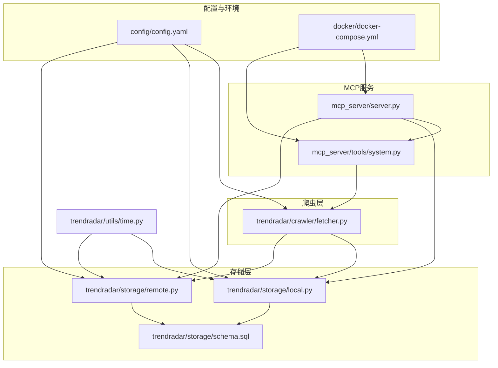
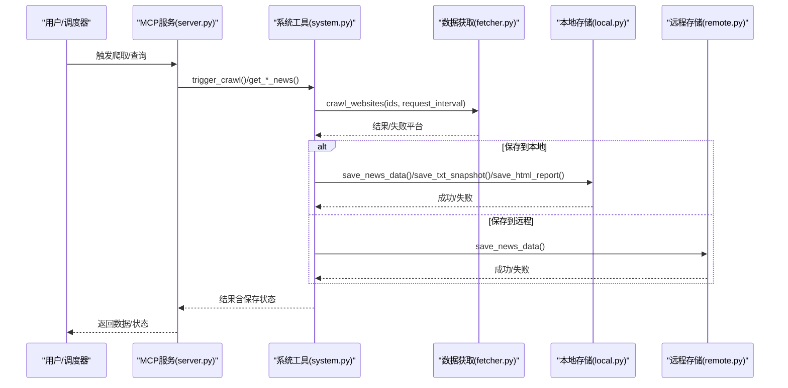
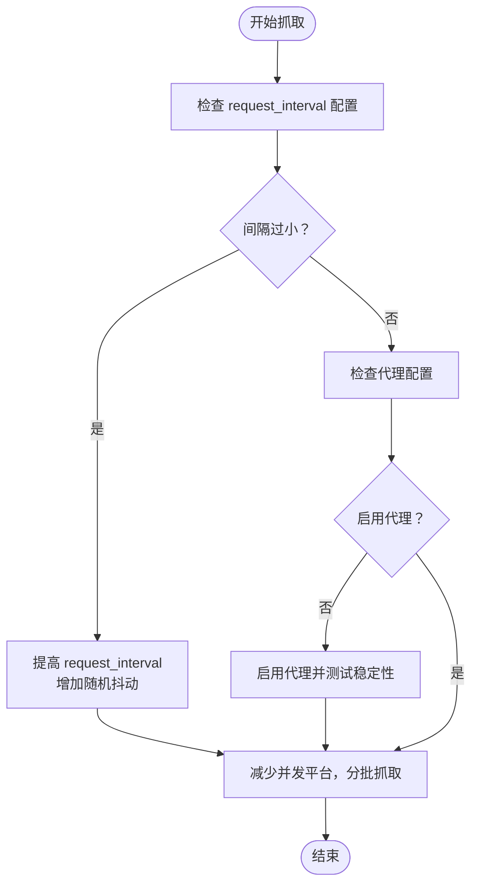
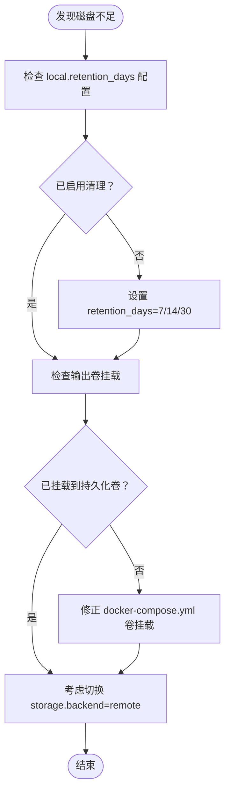
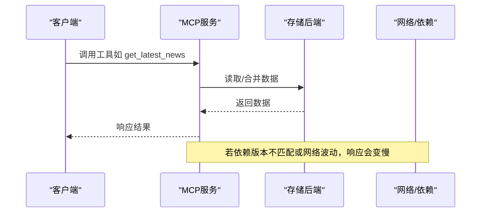
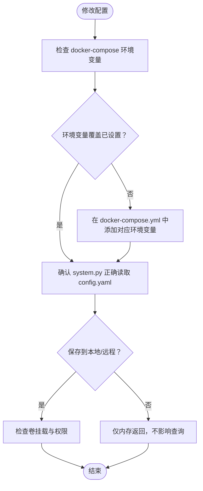
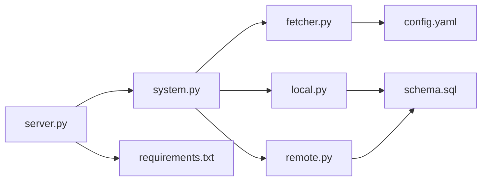

# 性能与配置问题

<cite>
**本文引用的文件**
- [config.yaml](file://config/config.yaml)
- [fetcher.py](file://trendradar/crawler/fetcher.py)
- [local.py](file://trendradar/storage/local.py)
- [remote.py](file://trendradar/storage/remote.py)
- [schema.sql](file://trendradar/storage/schema.sql)
- [system.py](file://mcp_server/tools/system.py)
- [server.py](file://mcp_server/server.py)
- [time.py](file://trendradar/utils/time.py)
- [requirements.txt](file://requirements.txt)
- [docker-compose.yml](file://docker/docker-compose.yml)
</cite>

## 目录
1. [简介](#简介)
2. [项目结构与关键组件](#项目结构与关键组件)
3. [核心性能参数与推荐范围](#核心性能参数与推荐范围)
4. [架构概览与数据流](#架构概览与数据流)
5. [详细问题排查与优化建议](#详细问题排查与优化建议)
6. [依赖关系与耦合分析](#依赖关系与耦合分析)
7. [性能考量与资源监控](#性能考量与资源监控)
8. [故障排查指南](#故障排查指南)
9. [结论](#结论)

## 简介
本指南聚焦于TrendRadar在实际运行中常见的性能与配置问题，围绕以下目标展开：降低高频率爬取导致的IP封禁风险、缓解本地存储空间压力、提升MCP服务响应稳定性、以及确保配置文件生效与环境变量覆盖规则清晰。文档提供可落地的参数调整建议、可视化流程图与排障步骤，帮助您稳定高效地运行系统。

## 项目结构与关键组件
- 配置中心：config/config.yaml集中管理爬虫、存储、推送、权重等关键参数；docker-compose.yml提供环境变量覆盖能力。
- 爬虫层：trendradar/crawler/fetcher.py负责批量平台数据抓取与请求间隔控制。
- 存储层：trendradar/storage/local.py与trendradar/storage/remote.py分别实现本地SQLite与S3兼容远程存储；schema.sql定义数据库表结构与索引。
- MCP服务：mcp_server/server.py提供FastMCP 2.0工具接口；mcp_server/tools/system.py支持手动触发爬取、系统状态查询与保存行为。
- 时间工具：trendradar/utils/time.py统一时区与时间格式化，保障跨组件一致性。
- 依赖与版本：requirements.txt声明fastmcp、websockets、boto3等关键依赖，影响MCP与S3功能稳定性。

图表来源
- [config.yaml](file://config/config.yaml#L53-L60)
- [fetcher.py](file://trendradar/crawler/fetcher.py#L117-L185)
- [local.py](file://trendradar/storage/local.py#L1-L120)
- [remote.py](file://trendradar/storage/remote.py#L1-L120)
- [schema.sql](file://trendradar/storage/schema.sql#L1-L118)
- [server.py](file://mcp_server/server.py#L784-L800)
- [system.py](file://mcp_server/tools/system.py#L68-L263)
- [time.py](file://trendradar/utils/time.py#L15-L64)
- [docker-compose.yml](file://docker/docker-compose.yml#L1-L88)

章节来源
- [config.yaml](file://config/config.yaml#L53-L60)
- [fetcher.py](file://trendradar/crawler/fetcher.py#L117-L185)
- [local.py](file://trendradar/storage/local.py#L1-L120)
- [remote.py](file://trendradar/storage/remote.py#L1-L120)
- [schema.sql](file://trendradar/storage/schema.sql#L1-L118)
- [server.py](file://mcp_server/server.py#L784-L800)
- [system.py](file://mcp_server/tools/system.py#L68-L263)
- [time.py](file://trendradar/utils/time.py#L15-L64)
- [docker-compose.yml](file://docker/docker-compose.yml#L1-L88)

## 核心性能参数与推荐范围
以下参数直接影响系统性能与稳定性，建议结合业务规模与资源状况进行调整：

- 爬取请求间隔 request_interval（单位毫秒）
  - 建议范围：1000~3000（默认1000）
  - 说明：增大间隔可显著降低被反爬封禁概率；若平台限流严格，建议逐步上调至2000~3000。
  - 参考路径：[config.yaml](file://config/config.yaml#L53-L60)、[fetcher.py](file://trendradar/crawler/fetcher.py#L117-L185)

- 本地数据保留天数 retention_days（单位天）
  - 建议范围：7~30（默认0表示不清理）
  - 说明：定期清理可释放磁盘空间；建议结合存储成本与查询需求设定。
  - 参考路径：[config.yaml](file://config/config.yaml#L27-L30)、[local.py](file://trendradar/storage/local.py#L746-L800)

- 远程数据保留天数 retention_days（单位天）
  - 建议范围：7~30（默认0表示不清理）
  - 说明：远程存储同样建议开启清理，避免对象过多影响拉取与查询性能。
  - 参考路径：[config.yaml](file://config/config.yaml#L35-L46)、[remote.py](file://trendradar/storage/remote.py#L1-L120)

- 远程存储S3配置（endpoint_url、bucket_name、access_key_id、secret_access_key、region）
  - 建议：优先使用环境变量覆盖，避免明文写入仓库；确保签名版本与服务商兼容。
  - 参考路径：[config.yaml](file://config/config.yaml#L35-L46)、[docker-compose.yml](file://docker/docker-compose.yml#L61-L66)、[remote.py](file://trendradar/storage/remote.py#L93-L116)

- MCP服务依赖版本 fastmcp、websockets、boto3
  - 建议：保持与requirements.txt一致，避免版本冲突导致连接异常或功能缺失。
  - 参考路径：[requirements.txt](file://requirements.txt#L1-L7)

- 推送时间窗口 push_window（enabled、start、end、once_per_day）
  - 建议：合理设置窗口，避免非工作时段打扰；一次性推送避免重复触发。
  - 参考路径：[config.yaml](file://config/config.yaml#L93-L106)

- 报告模式 report.mode 与排序优先级 sort_by_position_first
  - 建议：根据使用场景选择“daily”“current”“incremental”，必要时调整排序优先级。
  - 参考路径：[config.yaml](file://config/config.yaml#L75-L81)

章节来源
- [config.yaml](file://config/config.yaml#L27-L46)
- [config.yaml](file://config/config.yaml#L53-L60)
- [config.yaml](file://config/config.yaml#L75-L81)
- [config.yaml](file://config/config.yaml#L93-L106)
- [fetcher.py](file://trendradar/crawler/fetcher.py#L117-L185)
- [local.py](file://trendradar/storage/local.py#L746-L800)
- [remote.py](file://trendradar/storage/remote.py#L93-L116)
- [requirements.txt](file://requirements.txt#L1-L7)
- [docker-compose.yml](file://docker/docker-compose.yml#L61-L66)

## 架构概览与数据流
下图展示了从爬取到存储再到MCP查询的关键流程，以及远程存储与本地清理的协同关系。

图表来源
- [server.py](file://mcp_server/server.py#L627-L660)
- [system.py](file://mcp_server/tools/system.py#L68-L263)
- [fetcher.py](file://trendradar/crawler/fetcher.py#L117-L185)
- [local.py](file://trendradar/storage/local.py#L113-L288)
- [remote.py](file://trendradar/storage/remote.py#L312-L512)

## 详细问题排查与优化建议

### 1. 高频率爬取导致IP被封
- 现象：平台返回异常、失败平台增多、网络超时或限流。
- 根因：request_interval过小，请求过于密集。
- 优化策略：
  - 提升request_interval（建议1500~3000），并在平台间加入随机抖动。
  - 启用代理（use_proxy与default_proxy），并测试不同代理稳定性。
  - 降低并发平台数量，分批抓取。
- 参考路径：
  - [config.yaml](file://config/config.yaml#L53-L60)
  - [fetcher.py](file://trendradar/crawler/fetcher.py#L117-L185)

图表来源
- [config.yaml](file://config/config.yaml#L53-L60)
- [fetcher.py](file://trendradar/crawler/fetcher.py#L117-L185)

章节来源
- [config.yaml](file://config/config.yaml#L53-L60)
- [fetcher.py](file://trendradar/crawler/fetcher.py#L117-L185)

### 2. 本地存储空间不足
- 现象：磁盘空间耗尽、写入失败、容器只读卷报错。
- 根因：未启用retention_days清理，或输出目录未挂载到持久化卷。
- 优化策略：
  - 在config.yaml中设置local.retention_days（建议7~30）。
  - 在Docker环境中通过LOCAL_RETENTION_DAYS覆盖。
  - 确认docker-compose.yml中output卷挂载为可写。
  - 如需长期归档，切换storage.backend为remote并配置S3。
- 参考路径：
  - [config.yaml](file://config/config.yaml#L27-L30)
  - [docker-compose.yml](file://docker/docker-compose.yml#L10-L13)
  - [docker-compose.yml](file://docker/docker-compose.yml#L55-L59)
  - [local.py](file://trendradar/storage/local.py#L746-L800)

图表来源
- [config.yaml](file://config/config.yaml#L27-L30)
- [docker-compose.yml](file://docker/docker-compose.yml#L10-L13)
- [docker-compose.yml](file://docker/docker-compose.yml#L55-L59)
- [local.py](file://trendradar/storage/local.py#L746-L800)

章节来源
- [config.yaml](file://config/config.yaml#L27-L30)
- [docker-compose.yml](file://docker/docker-compose.yml#L10-L13)
- [docker-compose.yml](file://docker/docker-compose.yml#L55-L59)
- [local.py](file://trendradar/storage/local.py#L746-L800)

### 3. MCP服务响应延迟
- 现象：MCP工具调用慢、WebSocket连接不稳定、工具返回延迟。
- 根因：FastMCP版本不匹配、网络波动、远程存储拉取/上传开销大、查询未命中索引。
- 优化策略：
  - 确认requirements.txt中fastmcp、websockets、boto3版本，避免冲突。
  - 优先使用本地存储查询；必要时通过sync_from_remote拉取近期数据。
  - 优化查询：确保schema.sql索引生效（平台、时间、标题、URL+平台唯一索引）。
  - 检查MCP服务日志与容器资源（CPU/内存/网络）。
- 参考路径：
  - [requirements.txt](file://requirements.txt#L1-L7)
  - [server.py](file://mcp_server/server.py#L662-L703)
  - [remote.py](file://trendradar/storage/remote.py#L178-L274)
  - [schema.sql](file://trendradar/storage/schema.sql#L96-L118)

图表来源
- [server.py](file://mcp_server/server.py#L113-L151)
- [remote.py](file://trendradar/storage/remote.py#L178-L274)
- [schema.sql](file://trendradar/storage/schema.sql#L96-L118)
- [requirements.txt](file://requirements.txt#L1-L7)

章节来源
- [requirements.txt](file://requirements.txt#L1-L7)
- [server.py](file://mcp_server/server.py#L113-L151)
- [remote.py](file://trendradar/storage/remote.py#L178-L274)
- [schema.sql](file://trendradar/storage/schema.sql#L96-L118)

### 4. 配置文件生效与环境变量覆盖规则
- 现象：修改config.yaml后未生效、MCP返回默认值、容器内行为异常。
- 根因：配置加载顺序、环境变量覆盖优先级、Docker只读卷限制。
- 优化策略：
  - 优先使用环境变量覆盖（如STORAGE_BACKEND、LOCAL_RETENTION_DAYS、S3_*等）。
  - 在docker-compose.yml中显式设置环境变量，确保容器启动时生效。
  - 确认system.py在触发爬取时读取config.yaml并转换为NewsData，保存失败时会返回明确提示（如只读卷）。
  - YAML格式校验：确保缩进与键名正确，避免解析失败。
- 参考路径：
  - [docker-compose.yml](file://docker/docker-compose.yml#L14-L73)
  - [system.py](file://mcp_server/tools/system.py#L98-L171)
  - [config.yaml](file://config/config.yaml#L1-L187)

图表来源
- [docker-compose.yml](file://docker/docker-compose.yml#L14-L73)
- [system.py](file://mcp_server/tools/system.py#L98-L171)
- [config.yaml](file://config/config.yaml#L1-L187)

章节来源
- [docker-compose.yml](file://docker/docker-compose.yml#L14-L73)
- [system.py](file://mcp_server/tools/system.py#L98-L171)
- [config.yaml](file://config/config.yaml#L1-L187)

## 依赖关系与耦合分析
- 组件耦合
  - fetcher依赖requests与随机退避重试，与config.yaml的request_interval耦合。
  - storage.local与storage.remote共享相同的NewsData模型与schema.sql表结构，耦合度高。
  - MCP server通过tools.system触发爬取并调用storage，依赖requirements.txt中的fastmcp/websockets/boto3。
- 外部依赖
  - S3兼容存储依赖boto3；MCP依赖FastMCP与websockets；时间处理依赖pytz。
- 循环依赖
  - 未发现循环导入；各模块职责清晰。

图表来源
- [fetcher.py](file://trendradar/crawler/fetcher.py#L117-L185)
- [config.yaml](file://config/config.yaml#L53-L60)
- [system.py](file://mcp_server/tools/system.py#L68-L263)
- [local.py](file://trendradar/storage/local.py#L113-L288)
- [remote.py](file://trendradar/storage/remote.py#L312-L512)
- [server.py](file://mcp_server/server.py#L784-L800)
- [schema.sql](file://trendradar/storage/schema.sql#L1-L118)
- [requirements.txt](file://requirements.txt#L1-L7)

章节来源
- [fetcher.py](file://trendradar/crawler/fetcher.py#L117-L185)
- [system.py](file://mcp_server/tools/system.py#L68-L263)
- [local.py](file://trendradar/storage/local.py#L113-L288)
- [remote.py](file://trendradar/storage/remote.py#L312-L512)
- [server.py](file://mcp_server/server.py#L784-L800)
- [schema.sql](file://trendradar/storage/schema.sql#L1-L118)
- [requirements.txt](file://requirements.txt#L1-L7)

## 性能考量与资源监控
- CPU/内存/磁盘
  - 定期检查容器资源使用率，避免频繁GC或I/O阻塞。
  - 本地存储清理与远程上传均涉及I/O，建议在低峰期执行。
- 网络
  - S3上传采用明确Content-Length避免chunked encoding问题；若服务商为腾讯云COS，注意签名版本差异。
- 时间与索引
  - 使用schema.sql索引加速查询；统一时区由time.py提供，避免跨时区查询偏差。
- 参考路径：
  - [remote.py](file://trendradar/storage/remote.py#L225-L274)
  - [schema.sql](file://trendradar/storage/schema.sql#L96-L118)
  - [time.py](file://trendradar/utils/time.py#L15-L64)

章节来源
- [remote.py](file://trendradar/storage/remote.py#L225-L274)
- [schema.sql](file://trendradar/storage/schema.sql#L96-L118)
- [time.py](file://trendradar/utils/time.py#L15-L64)

## 故障排查指南
- IP被封/限流
  - 提升request_interval，启用代理，分批抓取。
  - 参考：[config.yaml](file://config/config.yaml#L53-L60)、[fetcher.py](file://trendradar/crawler/fetcher.py#L117-L185)
- 本地空间不足
  - 开启local.retention_days，检查卷挂载，必要时切换remote。
  - 参考：[config.yaml](file://config/config.yaml#L27-L30)、[docker-compose.yml](file://docker/docker-compose.yml#L10-L13)、[local.py](file://trendradar/storage/local.py#L746-L800)
- MCP响应慢
  - 校验fastmcp/websockets/boto3版本，优化查询索引，必要时拉取远程数据到本地。
  - 参考：[requirements.txt](file://requirements.txt#L1-L7)、[server.py](file://mcp_server/server.py#L662-L703)、[schema.sql](file://trendradar/storage/schema.sql#L96-L118)
- 配置不生效
  - 确认docker-compose环境变量覆盖，检查system.py读取与保存逻辑。
  - 参考：[docker-compose.yml](file://docker/docker-compose.yml#L14-L73)、[system.py](file://mcp_server/tools/system.py#L98-L171)

章节来源
- [config.yaml](file://config/config.yaml#L27-L60)
- [fetcher.py](file://trendradar/crawler/fetcher.py#L117-L185)
- [local.py](file://trendradar/storage/local.py#L746-L800)
- [docker-compose.yml](file://docker/docker-compose.yml#L10-L13)
- [requirements.txt](file://requirements.txt#L1-L7)
- [server.py](file://mcp_server/server.py#L662-L703)
- [schema.sql](file://trendradar/storage/schema.sql#L96-L118)
- [system.py](file://mcp_server/tools/system.py#L98-L171)

## 结论
通过合理设置request_interval、启用retention_days清理、切换remote后端与S3配置、校验MCP依赖版本与索引、以及规范环境变量覆盖，可显著提升TrendRadar的运行稳定性与性能。建议在生产环境中结合监控指标持续优化参数，并定期审查配置与依赖版本，确保系统长期可靠运行。