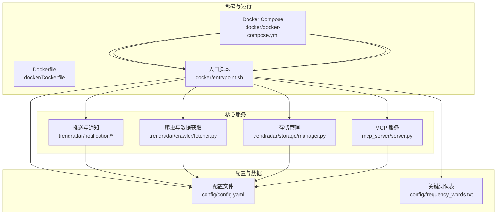
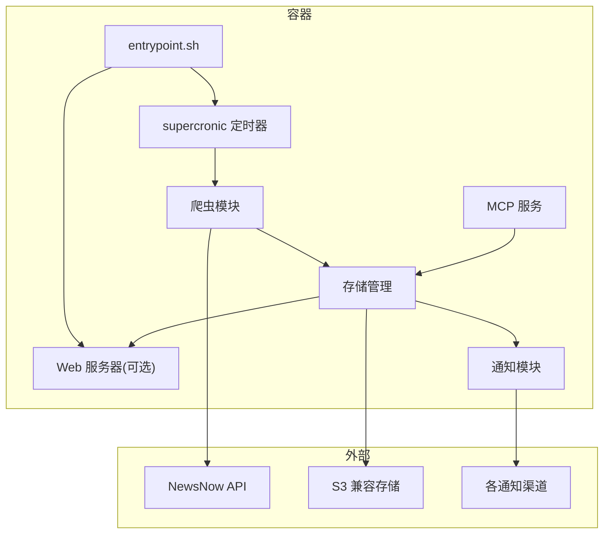
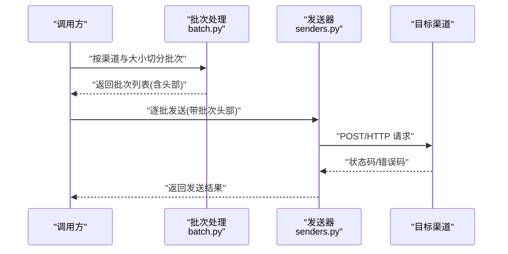
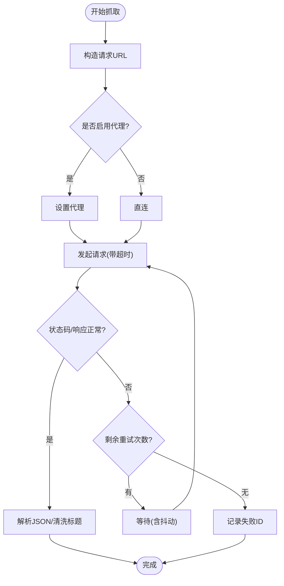
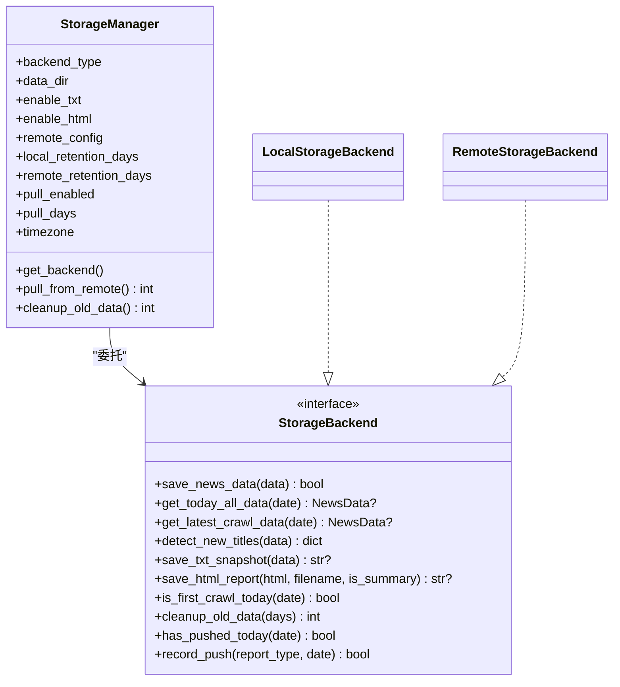
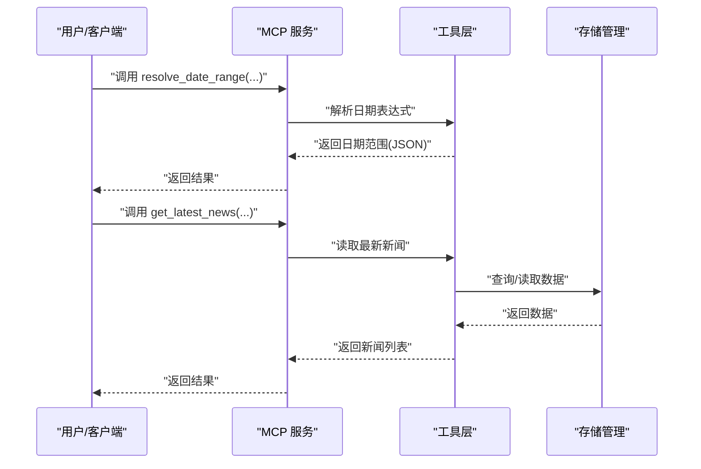
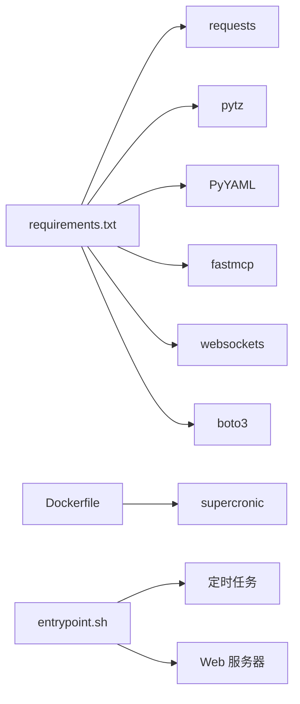

# 故障排除

<cite>
**本文引用的文件**
- [README-MCP-FAQ.md](file://README-MCP-FAQ.md)
- [README.md](file://README.md)
- [config/config.yaml](file://config/config.yaml)
- [config/frequency_words.txt](file://config/frequency_words.txt)
- [docker/docker-compose.yml](file://docker/docker-compose.yml)
- [docker/Dockerfile](file://docker/Dockerfile)
- [docker/entrypoint.sh](file://docker/entrypoint.sh)
- [trendradar/notification/senders.py](file://trendradar/notification/senders.py)
- [trendradar/notification/batch.py](file://trendradar/notification/batch.py)
- [trendradar/crawler/fetcher.py](file://trendradar/crawler/fetcher.py)
- [mcp_server/server.py](file://mcp_server/server.py)
- [trendradar/storage/manager.py](file://trendradar/storage/manager.py)
- [requirements.txt](file://requirements.txt)
</cite>

## 目录
1. [简介](#简介)
2. [项目结构](#项目结构)
3. [核心组件](#核心组件)
4. [架构总览](#架构总览)
5. [详细组件分析](#详细组件分析)
6. [依赖关系分析](#依赖关系分析)
7. [性能与配置注意事项](#性能与配置注意事项)
8. [故障排除指南](#故障排除指南)
9. [结论](#结论)

## 简介
本指南面向使用 TrendRadar 的用户，聚焦于常见问题的快速定位与解决。内容覆盖部署问题（Docker 容器启动失败、端口冲突、权限问题、GitHub Actions 工作流失败）、通知问题（webhook 失效、消息推送不完整、邮件发送失败）、数据问题（热点新闻未推送、AI 分析无结果）、性能与配置问题（高频率爬取导致 IP 被封、存储空间不足）。每个问题均给出症状、可能原因、解决步骤，并引用 FAQ 文档中的权威答案，同时指导如何查阅日志进行深入诊断。

## 项目结构
TrendRadar 由“推送与通知”“爬虫与数据”“存储与持久化”“MCP AI 分析服务”四大部分组成，配合 Docker 与 GitHub Actions 提供多端部署能力。

图示来源
- [docker/docker-compose.yml](file://docker/docker-compose.yml#L1-L88)
- [docker/Dockerfile](file://docker/Dockerfile#L1-L71)
- [docker/entrypoint.sh](file://docker/entrypoint.sh#L1-L50)
- [trendradar/notification/senders.py](file://trendradar/notification/senders.py#L1-L120)
- [trendradar/crawler/fetcher.py](file://trendradar/crawler/fetcher.py#L1-L120)
- [trendradar/storage/manager.py](file://trendradar/storage/manager.py#L1-L120)
- [mcp_server/server.py](file://mcp_server/server.py#L1-L120)
- [config/config.yaml](file://config/config.yaml#L1-L187)
- [config/frequency_words.txt](file://config/frequency_words.txt#L1-L114)

章节来源
- [docker/docker-compose.yml](file://docker/docker-compose.yml#L1-L88)
- [docker/Dockerfile](file://docker/Dockerfile#L1-L71)
- [docker/entrypoint.sh](file://docker/entrypoint.sh#L1-L50)
- [config/config.yaml](file://config/config.yaml#L1-L187)

## 核心组件
- 推送与通知：支持飞书、钉钉、企业微信、Telegram、邮件、ntfy、Bark、Slack 等渠道；具备分批发送与批次头部注入能力，避免超限。
- 爬虫与数据：封装 NewsNow API 的数据抓取，支持代理、重试、请求间隔控制与标题清洗。
- 存储管理：自动选择本地/远程后端（S3 兼容），支持保留策略与远程拉取。
- MCP 服务：提供 13+ AI 分析工具，支持日期解析、趋势分析、情感分析、检索与报告生成等。

章节来源
- [trendradar/notification/senders.py](file://trendradar/notification/senders.py#L1-L200)
- [trendradar/notification/batch.py](file://trendradar/notification/batch.py#L1-L116)
- [trendradar/crawler/fetcher.py](file://trendradar/crawler/fetcher.py#L1-L185)
- [trendradar/storage/manager.py](file://trendradar/storage/manager.py#L1-L200)
- [mcp_server/server.py](file://mcp_server/server.py#L1-L200)

## 架构总览
下图展示 Docker 部署下的典型运行拓扑：容器内通过入口脚本启动 cron 定时任务与可选 Web 服务器；推送与通知模块依据配置向各渠道发送消息；爬虫模块定期抓取数据并写入本地或远程存储；MCP 服务提供 AI 分析工具。

图示来源
- [docker/entrypoint.sh](file://docker/entrypoint.sh#L1-L50)
- [docker/docker-compose.yml](file://docker/docker-compose.yml#L1-L88)
- [trendradar/notification/senders.py](file://trendradar/notification/senders.py#L1-L120)
- [trendradar/crawler/fetcher.py](file://trendradar/crawler/fetcher.py#L1-L120)
- [trendradar/storage/manager.py](file://trendradar/storage/manager.py#L1-L120)
- [mcp_server/server.py](file://mcp_server/server.py#L780-L800)

## 详细组件分析

### 组件A：通知模块（分批与渠道）
- 分批策略：为每批内容添加批次头部，预留头部字节空间，动态截断内容以满足渠道上限。
- 渠道差异：不同渠道对消息大小、格式、分批策略有不同限制；模块针对飞书、钉钉、企业微信、Telegram、ntfy、Bark、Slack、邮件等分别实现。
- 邮件发送：自动识别 SMTP 服务商，支持自定义服务器与端口；对常见错误（认证、连接、数据）进行分类处理。

图示来源
- [trendradar/notification/batch.py](file://trendradar/notification/batch.py#L1-L116)
- [trendradar/notification/senders.py](file://trendradar/notification/senders.py#L1-L200)

章节来源
- [trendradar/notification/batch.py](file://trendradar/notification/batch.py#L1-L116)
- [trendradar/notification/senders.py](file://trendradar/notification/senders.py#L1-L200)

### 组件B：爬虫模块（数据抓取与重试）
- 请求间隔：支持毫秒级请求间隔，避免过于频繁导致 IP 被封。
- 代理支持：可配置代理地址，便于在受限网络环境下抓取。
- 重试机制：指数回退与随机抖动，降低瞬时失败概率。
- 标题清洗：过滤 None、浮点数、空字符串等无效标题，提升稳定性。

图示来源
- [trendradar/crawler/fetcher.py](file://trendradar/crawler/fetcher.py#L1-L185)

章节来源
- [trendradar/crawler/fetcher.py](file://trendradar/crawler/fetcher.py#L1-L185)

### 组件C：存储管理（本地/远程/自动）
- 自动后端选择：在 GitHub Actions 环境中若配置了远程存储则使用远程，否则回退本地。
- 远程后端：基于 S3 兼容协议，支持 Cloudflare R2、阿里云 OSS、腾讯云 COS 等。
- 保留策略：支持本地与远程数据的过期清理。
- 远程拉取：启动时可拉取最近 N 天数据到本地，便于 MCP 侧分析。

图示来源
- [trendradar/storage/manager.py](file://trendradar/storage/manager.py#L1-L200)

章节来源
- [trendradar/storage/manager.py](file://trendradar/storage/manager.py#L1-L200)

### 组件D：MCP 服务（AI 分析工具）
- 工具集合：提供日期解析、最新新闻、历史新闻、趋势分析、情感分析、相似新闻、检索、报告生成、存储同步、系统状态等工具。
- 与存储联动：工具调用存储层读取/写入数据，支持远程拉取与本地分析。
- 与配置联动：工具读取配置文件与环境变量，确保一致的日期范围与推送策略。

图示来源
- [mcp_server/server.py](file://mcp_server/server.py#L1-L200)
- [mcp_server/server.py](file://mcp_server/server.py#L660-L780)

章节来源
- [mcp_server/server.py](file://mcp_server/server.py#L1-L200)
- [mcp_server/server.py](file://mcp_server/server.py#L660-L780)

## 依赖关系分析
- 外部依赖：requests、pytz、PyYAML、fastmcp、websockets、boto3（S3 兼容存储）。
- Docker 构建：supercronic 作为定时器，entrypoint 负责环境变量注入与启动流程。
- 配置耦合：通知渠道、存储后端、爬虫间隔、推送模式等均来自 config.yaml 与环境变量。

图示来源
- [requirements.txt](file://requirements.txt#L1-L7)
- [docker/Dockerfile](file://docker/Dockerfile#L1-L71)
- [docker/entrypoint.sh](file://docker/entrypoint.sh#L1-L50)

章节来源
- [requirements.txt](file://requirements.txt#L1-L7)
- [docker/Dockerfile](file://docker/Dockerfile#L1-L71)
- [docker/entrypoint.sh](file://docker/entrypoint.sh#L1-L50)

## 性能与配置注意事项
- 请求间隔：适当增大 request_interval 可降低被封风险；在代理可用时启用代理。
- 存储保留：合理设置 retention_days，避免磁盘占用过高；远程存储需配置 endpoint、bucket、密钥。
- 推送分批：根据渠道上限调整 message_batch_size、batch_send_interval，避免超限。
- MCP 服务：确保本地已有足够历史数据，否则 AI 分析工具可能无结果。

章节来源
- [config/config.yaml](file://config/config.yaml#L53-L187)
- [trendradar/notification/batch.py](file://trendradar/notification/batch.py#L1-L116)
- [trendradar/crawler/fetcher.py](file://trendradar/crawler/fetcher.py#L1-L185)
- [trendradar/storage/manager.py](file://trendradar/storage/manager.py#L1-L200)

## 故障排除指南

### 一、部署问题

#### 1) Docker 容器无法启动（端口冲突、权限）
- 症状
  - 容器启动后立即退出或无法访问 Web 服务器。
- 可能原因
  - 端口映射冲突（WEBSERVER_PORT 与宿主机端口冲突）。
  - 配置文件缺失（entrypoint 检查 /app/config/config.yaml 与 frequency_words.txt）。
  - 权限不足（挂载目录权限或容器内写入权限）。
- 解决步骤
  - 检查 docker-compose.yml 中的端口映射，确保宿主机端口未被占用。
  - 确认容器内 /app/config 下存在 config.yaml 与 frequency_words.txt。
  - 检查宿主机输出目录 output 的挂载权限，确保容器可写。
  - 若使用 Web 服务器，确认 ENABLE_WEBSERVER=true 且端口配置正确。
- 参考 FAQ
  - “安全警告”强调 webhook 不要公开，部署在 GitHub 上请放入 Secrets，避免泄露。
- 日志定位
  - 查看容器日志：docker logs 容器名；关注 entrypoint 的环境变量注入与 crontab 验证输出。

章节来源
- [docker/docker-compose.yml](file://docker/docker-compose.yml#L1-L88)
- [docker/entrypoint.sh](file://docker/entrypoint.sh#L1-L50)
- [README-MCP-FAQ.md](file://README-MCP-FAQ.md#L107-L122)

#### 2) GitHub Actions 工作流失败（Secrets 配置、API 限流）
- 症状
  - 工作流执行中断、推送失败、远程存储上传失败。
- 可能原因
  - 缺少必要的 Secrets（如 S3_ENDPOINT_URL、S3_BUCKET_NAME、S3_ACCESS_KEY_ID、S3_SECRET_ACCESS_KEY）。
  - NewsNow API 限流或网络不稳定。
  - 时区/时间窗口配置不当导致推送时间窗口不生效。
- 解决步骤
  - 在仓库 Settings → Secrets and variables → Actions 中添加所需 Secrets。
  - 检查 config.yaml 的 storage.remote 与 notification.push_window 配置。
  - 适当提高 request_interval，启用 use_proxy（若可用）。
  - 若使用远程存储，确认 endpoint、bucket、密钥与 region 配置正确。
- 参考 FAQ
  - “系统管理”与“存储同步”工具说明了远程存储配置与拉取流程。
- 日志定位
  - 查看 Actions 日志中的网络错误、S3 认证错误、推送超时等信息。

章节来源
- [config/config.yaml](file://config/config.yaml#L31-L106)
- [trendradar/crawler/fetcher.py](file://trendradar/crawler/fetcher.py#L1-L120)
- [README-MCP-FAQ.md](file://README-MCP-FAQ.md#L453-L506)

### 二、通知问题

#### 1) webhook 失效（强调安全警告）
- 症状
  - 飞书/钉钉/企业微信/Slack 推送失败，返回状态码或错误码。
- 可能原因
  - webhook 地址错误或已被撤销。
  - webhook 泄露到公开仓库或配置文件中，被滥用。
  - 多账号配置数量不一致或分号分隔错误。
- 解决步骤
  - 将 webhook 放入 GitHub Secrets（或 Docker 环境变量），不要硬编码在配置文件中。
  - 检查多账号配置：确保各渠道 token/chat_id 数量一致，使用英文分号分隔。
  - 针对 Slack、Bark、ntfy 等渠道，确认 URL/Topic/Token 格式正确。
- 参考 FAQ
  - “重要安全警告”明确指出 webhook 不要公开，暴露将带来严重安全风险。
- 日志定位
  - 查看通知发送器的日志输出，关注状态码与错误信息。

章节来源
- [config/config.yaml](file://config/config.yaml#L139-L156)
- [trendradar/notification/senders.py](file://trendradar/notification/senders.py#L1-L200)
- [README-MCP-FAQ.md](file://README-MCP-FAQ.md#L107-L122)

#### 2) 消息推送不完整（检查 batch_size 与分批逻辑）
- 症状
  - 部分批次发送成功，部分被拒绝或截断。
- 可能原因
  - 消息大小超过渠道上限（如 ntfy 4KB 限制、企业微信 text/markdown 限制）。
  - 分批头部预留不足导致总大小超限。
- 解决步骤
  - 调整对应渠道的 batch_size（如 feishu、dingtalk、wework、telegram、ntfy、bark、slack）。
  - 确保分批头部预留空间充足，避免截断破坏内容完整性。
  - 适当降低每批字节数，必要时缩短内容长度。
- 参考 FAQ
  - “默认设置说明”与“使用技巧”强调了展示策略与工具返回行为的一致性。
- 日志定位
  - 查看批次头部与截断提示，确认是否触发了“超出限制”警告。

章节来源
- [config/config.yaml](file://config/config.yaml#L82-L110)
- [trendradar/notification/batch.py](file://trendradar/notification/batch.py#L1-L116)
- [trendradar/notification/senders.py](file://trendradar/notification/senders.py#L600-L800)
- [README-MCP-FAQ.md](file://README-MCP-FAQ.md#L1-L60)

#### 3) 邮件发送失败（验证 SMTP 配置）
- 症状
  - 邮件发送异常，提示认证失败、连接失败、数据错误等。
- 可能原因
  - 发件人邮箱或授权码错误。
  - SMTP 服务器/端口不正确，或加密方式不匹配。
  - HTML 报告文件不存在或路径错误。
- 解决步骤
  - 使用自定义 SMTP 时，明确设置 server 与 port；465 用 SSL，587 用 STARTTLS。
  - 确认 HTML 报告文件存在且路径正确。
  - 多收件人用逗号分隔；检查网络连通性与防火墙。
- 参考 FAQ
  - “系统管理”工具与“存储状态”工具可用于确认配置与可用日期。
- 日志定位
  - 查看 SMTP 异常堆栈与错误码，定位认证/连接/数据问题。

章节来源
- [config/config.yaml](file://config/config.yaml#L146-L151)
- [trendradar/notification/senders.py](file://trendradar/notification/senders.py#L474-L628)
- [README-MCP-FAQ.md](file://README-MCP-FAQ.md#L374-L414)

### 三、数据问题

#### 1) 热点新闻未推送（检查 frequency_words.txt 语法、爬虫是否启用）
- 症状
  - 未按关键词筛选推送，或推送为空。
- 可能原因
  - frequency_words.txt 语法错误（缺少空行分隔、过滤词格式不正确）。
  - 爬虫未启用（enable_crawler=false）。
  - 本地无历史数据，或远程未拉取到本地。
- 解决步骤
  - 按“基础语法”规范编写关键词，空行分隔不同主题；过滤词以“!”开头。
  - 确认 config.yaml 中 enable_crawler=true。
  - 若使用远程存储，确认已配置 S3 并启用 pull.enabled 与 pull.days。
- 参考 FAQ
  - “默认设置说明”与“系统管理”工具强调了关键词列表与系统状态查询。
- 日志定位
  - 查看爬虫日志与存储拉取日志，确认数据是否成功写入。

章节来源
- [config/frequency_words.txt](file://config/frequency_words.txt#L1-L114)
- [config/config.yaml](file://config/config.yaml#L53-L106)
- [trendradar/storage/manager.py](file://trendradar/storage/manager.py#L175-L199)
- [README-MCP-FAQ.md](file://README-MCP-FAQ.md#L1-L60)

#### 2) AI 分析无结果（确认本地有数据、MCP 服务已启动）
- 症状
  - 调用 MCP 工具返回空或报错，无法生成趋势/情感/检索结果。
- 可能原因
  - 本地无历史数据，或远程未拉取到本地。
  - MCP 服务未启动或端口未开放。
  - 日期范围解析失败或日期格式不正确。
- 解决步骤
  - 使用“存储状态”与“可用日期”工具确认本地/远程数据存在。
  - 启动 MCP 服务（docker-compose 中 trend-radar-mcp 容器），确保端口 3333 可访问。
  - 使用“日期解析”工具将自然语言转换为标准日期范围后再调用分析工具。
- 参考 FAQ
  - “系统管理”“存储同步”“日期解析”工具说明了远程拉取与日期范围解析流程。
- 日志定位
  - 查看 MCP 服务日志与工具调用链路，确认日期解析与数据读取成功。

章节来源
- [mcp_server/server.py](file://mcp_server/server.py#L43-L111)
- [mcp_server/server.py](file://mcp_server/server.py#L662-L781)
- [trendradar/storage/manager.py](file://trendradar/storage/manager.py#L175-L199)
- [README-MCP-FAQ.md](file://README-MCP-FAQ.md#L132-L187)

### 四、性能与配置问题

#### 1) 高频率爬取导致 IP 被封（调整 request_interval）
- 症状
  - 抓取失败、返回 429/403 或被临时屏蔽。
- 可能原因
  - request_interval 过小，请求过于频繁。
- 解决步骤
  - 在 config.yaml 中增大 request_interval（单位毫秒）。
  - 启用 use_proxy 并配置 default_proxy。
  - 适当增加随机抖动（已在重试中加入）。
- 参考 FAQ
  - “默认设置说明”强调了 token 消耗与查询范围的关系，间接提示控制频率的重要性。
- 日志定位
  - 查看爬虫重试日志与状态码，确认是否触发限流。

章节来源
- [config/config.yaml](file://config/config.yaml#L53-L58)
- [trendradar/crawler/fetcher.py](file://trendradar/crawler/fetcher.py#L1-L120)
- [README-MCP-FAQ.md](file://README-MCP-FAQ.md#L13-L23)

#### 2) 存储空间不足（配置 retention_days）
- 症状
  - 磁盘空间不足，容器无法写入或清理失败。
- 可能原因
  - retention_days 未设置或设置过小，历史数据过多。
- 解决步骤
  - 在 config.yaml 中设置 local.retention_days 与 remote.retention_days（0 表示不清理）。
  - 定期执行清理操作，或在 MCP 侧使用“存储状态”工具查看数据规模。
- 参考 FAQ
  - “系统管理”“存储同步”工具提供了存储状态与可用日期查询。
- 日志定位
  - 查看存储清理日志，确认删除的日期目录数量与保留策略生效。

章节来源
- [config/config.yaml](file://config/config.yaml#L27-L46)
- [trendradar/storage/manager.py](file://trendradar/storage/manager.py#L235-L256)
- [README-MCP-FAQ.md](file://README-MCP-FAQ.md#L453-L506)

## 结论
通过本指南，用户可系统性地排查 TrendRadar 在部署、通知、数据与性能方面的常见问题。建议优先核对配置文件与环境变量、确认数据可用性与渠道安全性、合理设置分批与请求间隔，并利用 MCP 工具进行状态与日期范围校验。若问题仍未解决，结合日志输出与 FAQ 文档进一步定位。