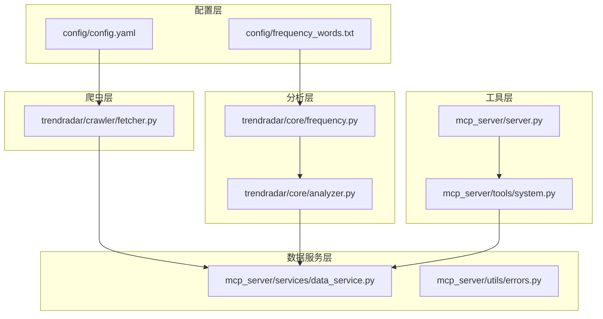
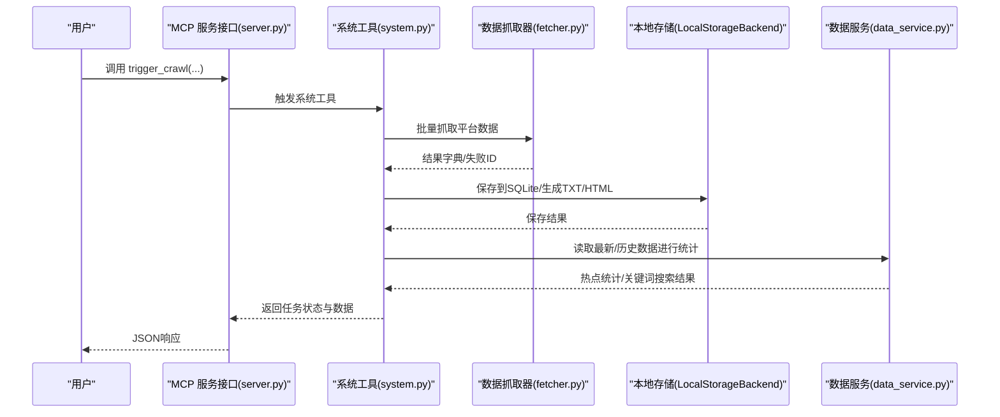
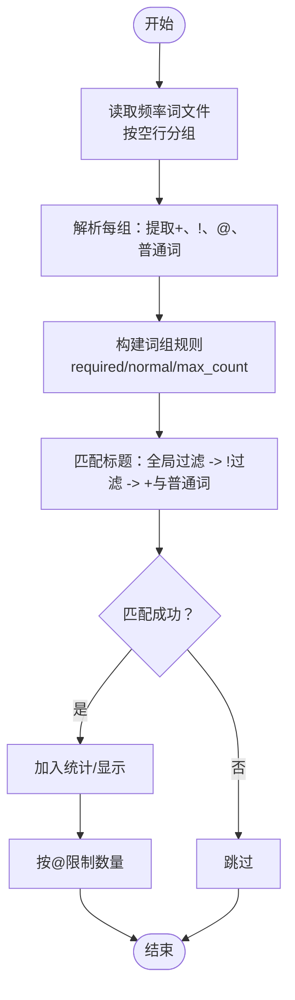
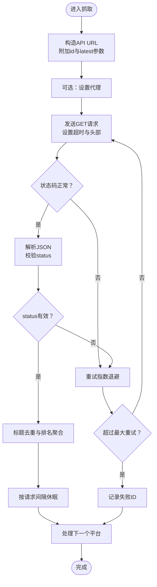
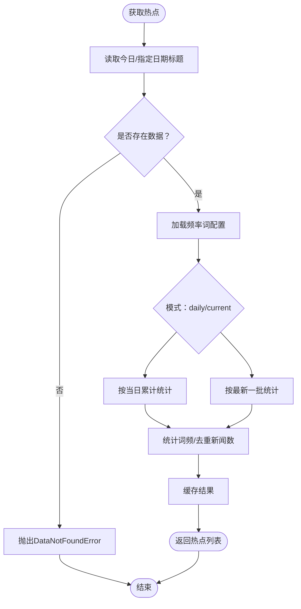
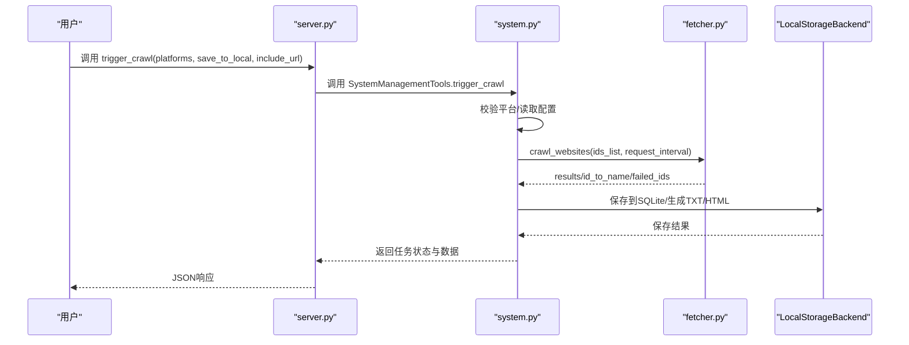
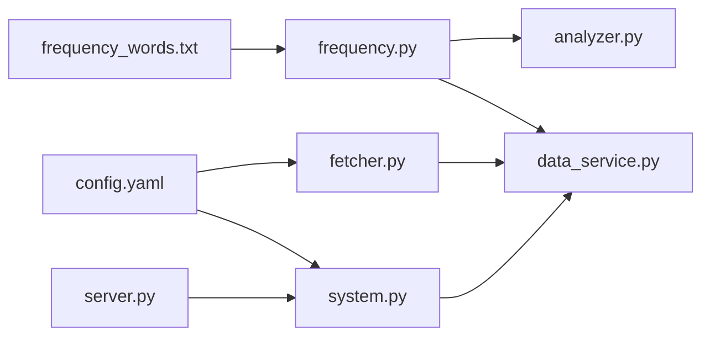

# 数据问题

<cite>
**本文引用的文件**
- [config/frequency_words.txt](file://config/frequency_words.txt)
- [trendradar/core/frequency.py](file://trendradar/core/frequency.py)
- [trendradar/core/analyzer.py](file://trendradar/core/analyzer.py)
- [mcp_server/services/data_service.py](file://mcp_server/services/data_service.py)
- [mcp_server/utils/errors.py](file://mcp_server/utils/errors.py)
- [trendradar/crawler/fetcher.py](file://trendradar/crawler/fetcher.py)
- [mcp_server/tools/system.py](file://mcp_server/tools/system.py)
- [mcp_server/server.py](file://mcp_server/server.py)
- [config/config.yaml](file://config/config.yaml)
- [README-MCP-FAQ.md](file://README-MCP-FAQ.md)
</cite>

## 目录
1. [简介](#简介)
2. [项目结构](#项目结构)
3. [核心组件](#核心组件)
4. [架构总览](#架构总览)
5. [详细组件分析](#详细组件分析)
6. [依赖关系分析](#依赖关系分析)
7. [性能考量](#性能考量)
8. [故障排除指南](#故障排除指南)
9. [结论](#结论)
10. [附录](#附录)

## 简介
本文件聚焦于“数据相关问题”的故障排除，围绕以下三大类问题展开：
- 热点未推送：排查频率词配置语法、关键词前缀使用、爬虫平台启用情况等。
- AI分析无结果：排查本地历史数据、MCP服务状态、数据查询失败等。
- 爬虫抓取失败：排查目标平台反爬机制、请求频率过高、网络连接异常等。

同时提供频率词配置的正确语法示例、日志关键字搜索方法（如“Failed to fetch”）、以及如何通过 trigger_crawl 工具手动测试爬虫功能。

## 项目结构
- 配置层：config 目录包含频率词与系统配置。
- 爬虫层：trendradar/crawler 提供数据抓取能力。
- 分析层：trendradar/core 提供词频统计与分析。
- 数据服务层：mcp_server/services 提供统一数据查询与热点统计。
- 工具层：mcp_server/tools/system 提供系统状态与手动触发爬取。
- 接口层：mcp_server/server 暴露 MCP 工具接口（如 trigger_crawl）。

图表来源
- [config/frequency_words.txt](file://config/frequency_words.txt#L1-L114)
- [config/config.yaml](file://config/config.yaml#L1-L187)
- [trendradar/crawler/fetcher.py](file://trendradar/crawler/fetcher.py#L1-L185)
- [trendradar/core/frequency.py](file://trendradar/core/frequency.py#L1-L195)
- [trendradar/core/analyzer.py](file://trendradar/core/analyzer.py#L1-L473)
- [mcp_server/services/data_service.py](file://mcp_server/services/data_service.py#L1-L624)
- [mcp_server/utils/errors.py](file://mcp_server/utils/errors.py#L1-L94)
- [mcp_server/tools/system.py](file://mcp_server/tools/system.py#L1-L200)
- [mcp_server/server.py](file://mcp_server/server.py#L617-L691)

章节来源
- [config/frequency_words.txt](file://config/frequency_words.txt#L1-L114)
- [config/config.yaml](file://config/config.yaml#L1-L187)
- [trendradar/crawler/fetcher.py](file://trendradar/crawler/fetcher.py#L1-L185)
- [trendradar/core/frequency.py](file://trendradar/core/frequency.py#L1-L195)
- [trendradar/core/analyzer.py](file://trendradar/core/analyzer.py#L1-L473)
- [mcp_server/services/data_service.py](file://mcp_server/services/data_service.py#L1-L624)
- [mcp_server/utils/errors.py](file://mcp_server/utils/errors.py#L1-L94)
- [mcp_server/tools/system.py](file://mcp_server/tools/system.py#L1-L200)
- [mcp_server/server.py](file://mcp_server/server.py#L617-L691)

## 核心组件
- 频率词配置与匹配：频率词文件解析、必须词/过滤词/最大显示数量等语法规则，以及标题匹配逻辑。
- 爬虫抓取器：统一请求、重试、代理、批量平台抓取与去重。
- 数据服务：读取输出目录、解析标题、统计热点、关键词搜索、系统状态。
- 系统工具：手动触发爬取、持久化保存、错误包装与返回。
- MCP 服务接口：对外暴露 trigger_crawl 等工具。

章节来源
- [trendradar/core/frequency.py](file://trendradar/core/frequency.py#L1-L195)
- [trendradar/crawler/fetcher.py](file://trendradar/crawler/fetcher.py#L1-L185)
- [mcp_server/services/data_service.py](file://mcp_server/services/data_service.py#L1-L624)
- [mcp_server/tools/system.py](file://mcp_server/tools/system.py#L1-L200)
- [mcp_server/server.py](file://mcp_server/server.py#L617-L691)

## 架构总览
从“手动触发爬取”到“热点统计与推送”的关键流程如下：

图表来源
- [mcp_server/server.py](file://mcp_server/server.py#L617-L691)
- [mcp_server/tools/system.py](file://mcp_server/tools/system.py#L68-L262)
- [trendradar/crawler/fetcher.py](file://trendradar/crawler/fetcher.py#L117-L185)
- [mcp_server/services/data_service.py](file://mcp_server/services/data_service.py#L1-L624)

## 详细组件分析

### 频率词配置与匹配
- 词组语法要点
  - 普通词：直接写入，标题包含即可。
  - 必须词：以“+”开头，所有必须词均需出现在标题中。
  - 过滤词：以“!”开头，匹配则排除。
  - 最大显示数量：以“@数字”开头，限定该词组最多显示条数。
  - 区域划分：支持 [GLOBAL_FILTER] 与 [WORD_GROUPS] 区域；全局过滤区不支持特殊语法前缀。
- 解析与匹配流程
  - 读取文件，按空行分隔词组。
  - 解析每组中的“+”、“!”、“@”等特殊前缀。
  - 匹配时优先全局过滤，再过滤“!”词，最后检查“+”与普通词组。
- 常见问题
  - 语法错误：未按空行分隔词组、特殊前缀使用不当、@后非正整数。
  - 前缀误用：将“!”写在词组首行而非行首，导致被当作普通词。
  - 未启用平台：频率词匹配通过，但平台未启用导致无数据。

图表来源
- [trendradar/core/frequency.py](file://trendradar/core/frequency.py#L1-L195)

章节来源
- [trendradar/core/frequency.py](file://trendradar/core/frequency.py#L1-L195)
- [config/frequency_words.txt](file://config/frequency_words.txt#L1-L114)

### 爬虫抓取器
- 功能特性
  - 单平台/批量平台抓取。
  - 自动重试、随机退避、代理支持。
  - 请求间隔控制、标题去重与排名聚合。
- 常见失败原因
  - 目标平台反爬机制（状态码异常、响应非 success/cache）。
  - 请求频率过高导致限流或封禁。
  - 网络连接异常（超时、DNS解析失败、代理不可用）。
- 诊断要点
  - 查看抓取器日志与异常堆栈。
  - 检查代理配置与网络连通性。
  - 降低请求间隔或增加随机抖动。

图表来源
- [trendradar/crawler/fetcher.py](file://trendradar/crawler/fetcher.py#L51-L185)

章节来源
- [trendradar/crawler/fetcher.py](file://trendradar/crawler/fetcher.py#L1-L185)
- [config/config.yaml](file://config/config.yaml#L53-L60)

### 数据服务与热点统计
- 数据读取
  - 从 output 目录按日期/时间解析标题数据。
  - 支持今日最新与历史日期查询。
- 热点统计
  - 基于频率词配置进行词频统计。
  - 支持 daily/current 两种模式。
- 关键异常
  - DataNotFoundError：未找到数据时抛出，提示检查日期范围或等待爬取完成。

图表来源
- [mcp_server/services/data_service.py](file://mcp_server/services/data_service.py#L285-L401)
- [mcp_server/utils/errors.py](file://mcp_server/utils/errors.py#L30-L40)

章节来源
- [mcp_server/services/data_service.py](file://mcp_server/services/data_service.py#L1-L624)
- [mcp_server/utils/errors.py](file://mcp_server/utils/errors.py#L1-L94)

### 系统工具与手动触发爬取
- trigger_crawl 工具
  - 支持临时爬取（不保存）与持久化爬取（保存到本地）。
  - 自动加载配置、校验平台、初始化抓取器、保存数据并返回结果。
- 常见返回信息
  - 成功：包含任务ID、爬取平台、失败平台、数据总量、保存文件等。
  - 失败：包含错误码与建议（如配置文件不存在、平台不支持、保存失败等）。

图表来源
- [mcp_server/server.py](file://mcp_server/server.py#L627-L691)
- [mcp_server/tools/system.py](file://mcp_server/tools/system.py#L68-L262)
- [trendradar/crawler/fetcher.py](file://trendradar/crawler/fetcher.py#L117-L185)

章节来源
- [mcp_server/server.py](file://mcp_server/server.py#L617-L691)
- [mcp_server/tools/system.py](file://mcp_server/tools/system.py#L1-L200)

## 依赖关系分析
- 频率词解析依赖文件系统与正则。
- 爬虫依赖网络库与配置文件。
- 数据服务依赖解析器与缓存。
- 系统工具依赖爬虫与存储后端。
- MCP 服务接口依赖系统工具。

图表来源
- [trendradar/core/frequency.py](file://trendradar/core/frequency.py#L1-L195)
- [trendradar/core/analyzer.py](file://trendradar/core/analyzer.py#L1-L473)
- [mcp_server/services/data_service.py](file://mcp_server/services/data_service.py#L1-L624)
- [trendradar/crawler/fetcher.py](file://trendradar/crawler/fetcher.py#L1-L185)
- [mcp_server/tools/system.py](file://mcp_server/tools/system.py#L1-L200)
- [mcp_server/server.py](file://mcp_server/server.py#L617-L691)
- [config/config.yaml](file://config/config.yaml#L1-L187)
- [config/frequency_words.txt](file://config/frequency_words.txt#L1-L114)

章节来源
- [trendradar/core/frequency.py](file://trendradar/core/frequency.py#L1-L195)
- [trendradar/core/analyzer.py](file://trendradar/core/analyzer.py#L1-L473)
- [mcp_server/services/data_service.py](file://mcp_server/services/data_service.py#L1-L624)
- [trendradar/crawler/fetcher.py](file://trendradar/crawler/fetcher.py#L1-L185)
- [mcp_server/tools/system.py](file://mcp_server/tools/system.py#L1-L200)
- [mcp_server/server.py](file://mcp_server/server.py#L617-L691)
- [config/config.yaml](file://config/config.yaml#L1-L187)
- [config/frequency_words.txt](file://config/frequency_words.txt#L1-L114)

## 性能考量
- 爬取间隔与并发：适当增大请求间隔与随机抖动，避免触发反爬。
- 缓存策略：数据服务对热点统计与配置等做了缓存，减少重复解析成本。
- 输出目录扫描：系统状态扫描 output 目录时注意磁盘 IO，避免频繁遍历。
- 代理与网络：代理不可用或网络不稳定会导致重试与延迟，建议就近部署或优化网络。

[本节为通用指导，无需具体文件引用]

## 故障排除指南

### 一、热点未推送（频率词配置与平台启用）

常见症状
- 频率词匹配不到新闻，热点列表为空或很少。
- 通知未触发或推送内容极少。

可能原因与排查步骤
- 频率词文件语法错误
  - 未按空行分隔词组，导致解析为单一大组。
  - “!”、“+”、“@”前缀位置错误，未写在行首。
  - “@数字”非正整数或格式不合法。
  - 建议：参考频率词文件示例，确保每组之间以空行分隔，特殊前缀位于行首。
- 关键词前缀使用不当
  - 将“!”写在词组首行而非行首，导致被当作普通词。
  - 必须词“+”未满足，导致整组不匹配。
  - 过滤词“!”命中，导致新闻被排除。
- 爬虫未启用特定平台
  - 平台未在 config.yaml 的 platforms 列表中配置或未启用。
  - 爬虫开关未开启或代理配置错误。
- 频率词配置正确性验证
  - 使用频率词解析函数进行单元测试，确认解析结果符合预期。
  - 在 analyzer 中打印匹配过程，观察哪些词组未命中。

日志与定位
- 查看系统状态与可用日期范围，确认是否有数据。
- 检查频率词解析是否抛出异常或返回空组。

章节来源
- [config/frequency_words.txt](file://config/frequency_words.txt#L1-L114)
- [trendradar/core/frequency.py](file://trendradar/core/frequency.py#L1-L195)
- [mcp_server/services/data_service.py](file://mcp_server/services/data_service.py#L285-L401)
- [config/config.yaml](file://config/config.yaml#L163-L187)

### 二、AI分析无结果（本地无历史数据、MCP服务未启动、数据查询失败）

常见症状
- AI返回“未找到包含关键词的新闻”或“未找到今天的新闻数据”。

可能原因与排查步骤
- 本地无历史数据
  - 确认 output 目录是否存在数据，或系统状态返回的最早/最新日期是否为空。
  - 若使用远程存储，需先从远程同步到本地。
- MCP 服务未启动
  - 确认 MCP 服务已启动，工具接口可被调用。
  - 检查服务端口、防火墙与容器日志。
- 数据查询失败
  - data_service 在读取标题或解析日期时可能抛出 DataNotFoundError。
  - 检查日期范围、平台过滤参数与缓存状态。

日志与定位
- 使用 get_system_status 工具查看系统状态与数据统计。
- 使用 trigger_crawl 手动触发一次爬取，观察返回的失败平台与保存状态。
- 在 MCP 服务侧捕获异常并返回错误码与建议。

章节来源
- [mcp_server/utils/errors.py](file://mcp_server/utils/errors.py#L30-L40)
- [mcp_server/services/data_service.py](file://mcp_server/services/data_service.py#L1-L624)
- [mcp_server/server.py](file://mcp_server/server.py#L617-L691)
- [mcp_server/tools/system.py](file://mcp_server/tools/system.py#L1-L200)

### 三、爬虫抓取失败（反爬机制、请求频率过高、网络异常）

常见症状
- 抓取器日志出现“请求失败”“状态异常”“解析响应失败”等。
- 多个平台失败，或偶发性失败。

可能原因与排查步骤
- 目标平台反爬机制
  - 响应状态非 success/cache，或返回风控页面。
  - 建议：降低请求频率、更换 UA、使用代理池。
- 请求频率过高
  - request_interval 设置过低，触发限流。
  - 建议：增大 request_interval，增加随机抖动。
- 网络连接异常
  - DNS 解析失败、超时、代理不可用。
  - 建议：检查代理配置、网络连通性与超时设置。

日志与定位
- 抓取器内部会打印重试等待时间与失败原因。
- 使用 trigger_crawl 工具查看 failed_platforms 字段。
- 在 MCP 服务侧捕获异常并返回错误码与建议。

章节来源
- [trendradar/crawler/fetcher.py](file://trendradar/crawler/fetcher.py#L51-L185)
- [config/config.yaml](file://config/config.yaml#L53-L60)
- [mcp_server/server.py](file://mcp_server/server.py#L627-L691)
- [mcp_server/tools/system.py](file://mcp_server/tools/system.py#L186-L262)

### 四、频率词配置正确语法示例
- 词组分隔：每组之间以空行分隔。
- 必须词：以“+”开头，如“+AI”。
- 过滤词：以“!”开头，如“!AI”。
- 最大显示数量：以“@数字”开头，如“@20”。
- 区域划分：支持 [GLOBAL_FILTER] 与 [WORD_GROUPS] 区域；全局过滤区不支持特殊语法前缀。

章节来源
- [trendradar/core/frequency.py](file://trendradar/core/frequency.py#L1-L195)
- [config/frequency_words.txt](file://config/frequency_words.txt#L1-L114)

### 五、日志关键字搜索方法
- 常见关键字
  - “Failed to fetch”：网络请求失败或连接异常。
  - “status异常”：目标平台返回非预期状态。
  - “解析响应失败”：JSON解析错误或返回非期望格式。
  - “DataNotFoundError”：未找到数据，检查日期范围或等待爬取。
- 建议
  - 在 MCP 服务与爬虫日志中搜索上述关键字。
  - 结合工具返回的错误码与建议进行定位。

章节来源
- [mcp_server/utils/errors.py](file://mcp_server/utils/errors.py#L1-L94)
- [trendradar/crawler/fetcher.py](file://trendradar/crawler/fetcher.py#L51-L185)
- [mcp_server/server.py](file://mcp_server/server.py#L617-L691)

### 六、通过 trigger_crawl 工具手动测试爬虫功能
- 使用场景
  - 临时查询：不保存数据，仅返回结果。
  - 持久化查询：保存到本地 output 目录，便于后续分析。
- 操作步骤
  - 在 MCP 服务中调用 trigger_crawl，可指定平台列表、是否保存、是否包含链接。
  - 查看返回的任务状态、失败平台、保存文件与数据总量。
- 常见提示
  - 若保存失败，检查存储权限与只读文件系统问题。
  - 若返回“未找到今天的新闻数据”，先确认爬虫是否已运行并生成数据。

章节来源
- [README-MCP-FAQ.md](file://README-MCP-FAQ.md#L416-L468)
- [mcp_server/server.py](file://mcp_server/server.py#L627-L691)
- [mcp_server/tools/system.py](file://mcp_server/tools/system.py#L68-L262)

## 结论
- 热点未推送主要源于频率词配置语法错误、关键词前缀误用与平台未启用。
- AI分析无结果多因本地无历史数据、MCP服务未启动或数据查询失败。
- 爬虫抓取失败多与反爬机制、请求频率过高、网络异常有关。
- 建议优先使用 trigger_crawl 工具快速验证爬取链路，结合日志关键字与系统状态工具进行定位。

[本节为总结，无需具体文件引用]

## 附录

### A. 频率词配置语法速查
- 普通词：直接写入。
- 必须词：“+词”
- 过滤词：“!词”
- 最大显示数量：“@数字”
- 区域：[GLOBAL_FILTER]、[WORD_GROUPS]

章节来源
- [trendradar/core/frequency.py](file://trendradar/core/frequency.py#L1-L195)
- [config/frequency_words.txt](file://config/frequency_words.txt#L1-L114)

### B. 关键工具与接口
- get_system_status：查看系统状态与数据统计。
- trigger_crawl：手动触发爬取（临时/持久化）。
- sync_from_remote：从远程同步数据到本地。

章节来源
- [mcp_server/server.py](file://mcp_server/server.py#L617-L691)
- [README-MCP-FAQ.md](file://README-MCP-FAQ.md#L407-L468)