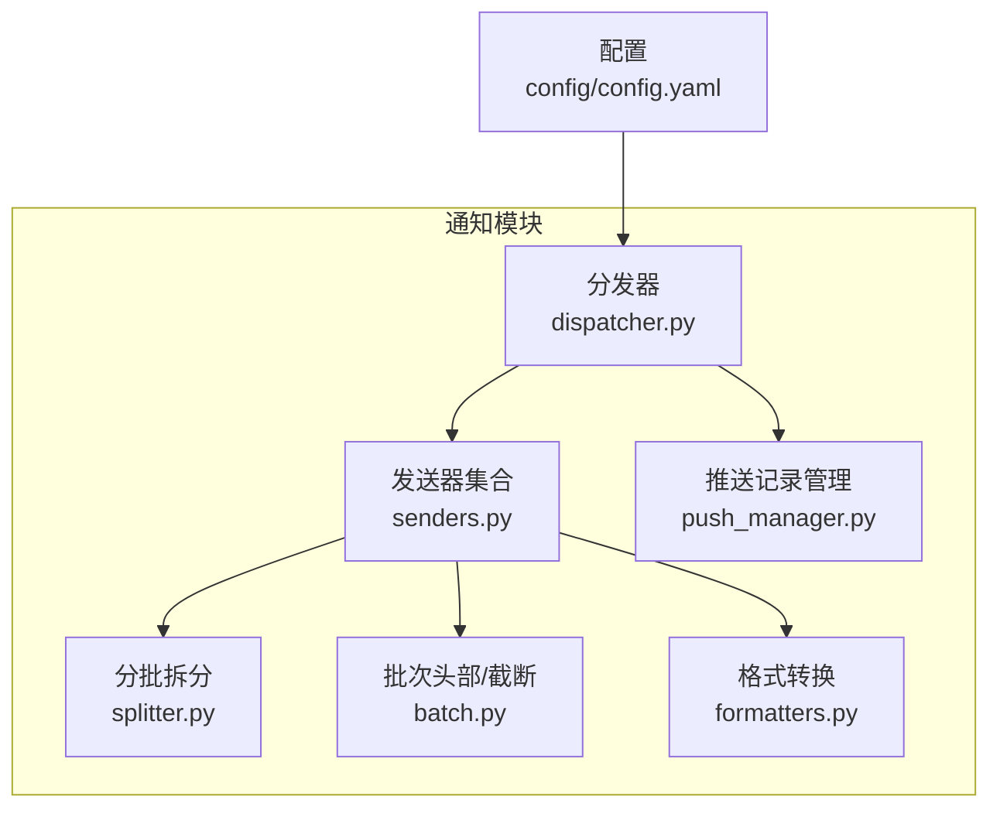
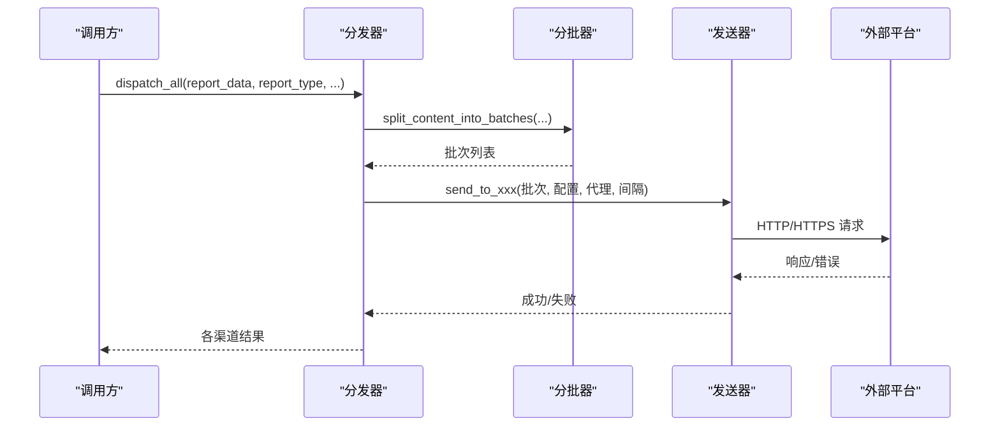
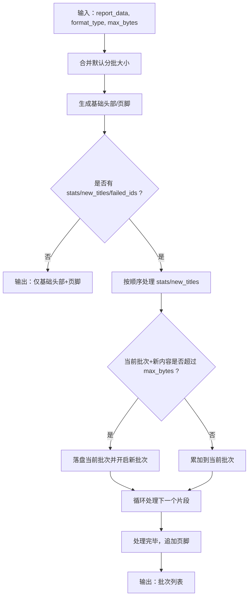
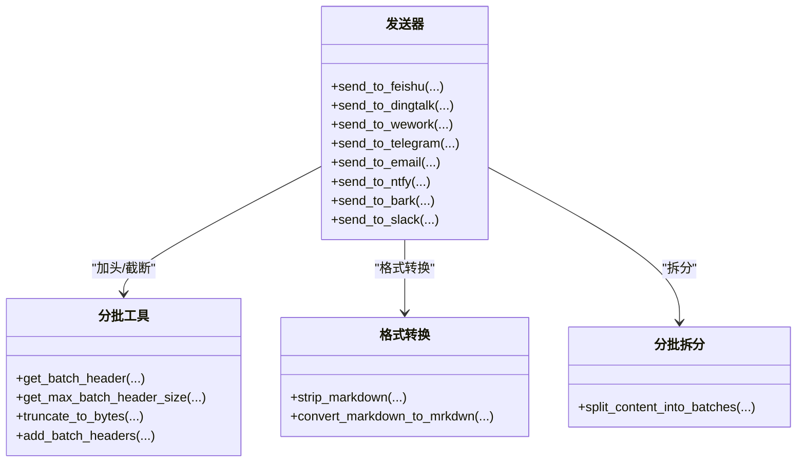
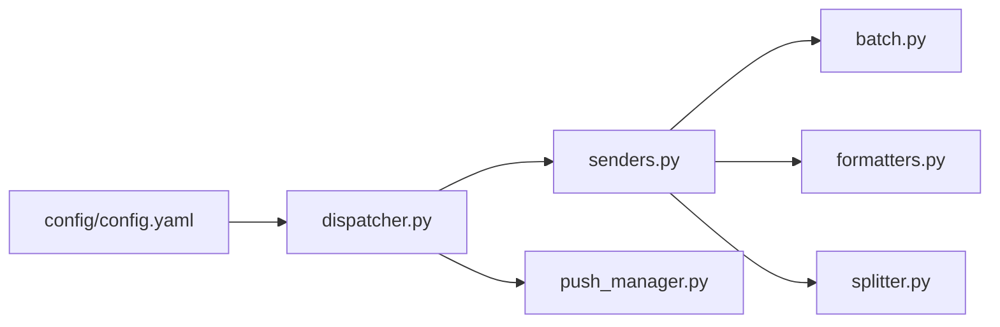

# 通知问题

<cite>
**本文引用的文件**
- [config/config.yaml](file://config/config.yaml)
- [trendradar/notification/__init__.py](file://trendradar/notification/__init__.py)
- [trendradar/notification/dispatcher.py](file://trendradar/notification/dispatcher.py)
- [trendradar/notification/senders.py](file://trendradar/notification/senders.py)
- [trendradar/notification/splitter.py](file://trendradar/notification/splitter.py)
- [trendradar/notification/batch.py](file://trendradar/notification/batch.py)
- [trendradar/notification/formatters.py](file://trendradar/notification/formatters.py)
- [trendradar/notification/push_manager.py](file://trendradar/notification/push_manager.py)
- [README.md](file://README.md)
- [README-EN.md](file://README-EN.md)
</cite>

## 目录
1. [简介](#简介)
2. [项目结构](#项目结构)
3. [核心组件](#核心组件)
4. [架构总览](#架构总览)
5. [详细组件分析](#详细组件分析)
6. [依赖关系分析](#依赖关系分析)
7. [性能与容量考虑](#性能与容量考虑)
8. [故障排查指南](#故障排查指南)
9. [结论](#结论)
10. [附录](#附录)

## 简介
本指南面向使用 TrendRadar 多渠道推送功能的用户，聚焦以下问题的定位与修复：
- webhook 失效（URL 格式、SSL 证书、网络拦截）
- 消息推送不完整或截断（batch_size 配置、分批逻辑、平台字符限制）
- 邮件发送失败（SMTP 服务器配置、端口连通性、认证凭据）
- 第三方通知渠道集成问题（Bark、ntfy、Slack 等）

我们将结合 config.yaml 中的通知配置项，给出典型错误码、调试方法与修复建议，并提供可视化流程图帮助快速定位问题。

## 项目结构
通知系统位于 trendradar/notification 目录，采用“分层+模块化”设计：
- 分发器：统一调度各渠道发送，支持多账号与配对校验
- 发送器：各平台发送实现（飞书、钉钉、企业微信、Telegram、邮件、ntfy、Bark、Slack）
- 分批与头部：按平台限制进行字节级分批与批次头部拼接
- 格式转换：Markdown 与平台格式互转（如 Slack mrkdwn）
- 推送记录：时间窗口与每日只推送一次控制

图表来源
- [trendradar/notification/dispatcher.py](file://trendradar/notification/dispatcher.py#L1-L137)
- [trendradar/notification/senders.py](file://trendradar/notification/senders.py#L1-L120)
- [trendradar/notification/splitter.py](file://trendradar/notification/splitter.py#L1-L60)
- [trendradar/notification/batch.py](file://trendradar/notification/batch.py#L1-L60)
- [trendradar/notification/formatters.py](file://trendradar/notification/formatters.py#L1-L40)
- [trendradar/notification/push_manager.py](file://trendradar/notification/push_manager.py#L1-L60)
- [config/config.yaml](file://config/config.yaml#L82-L160)

章节来源
- [trendradar/notification/__init__.py](file://trendradar/notification/__init__.py#L1-L82)
- [config/config.yaml](file://config/config.yaml#L82-L160)

## 核心组件
- 分发器（NotificationDispatcher）：负责解析配置、多账号拆分、配对校验、调用各渠道发送器并聚合结果
- 发送器（senders.py）：各平台发送实现，统一支持分批、代理、批次间隔、错误处理
- 分批器（splitter.py）：按平台默认字节上限拆分消息，保证词组/来源标题+首条新闻的原子性
- 批次工具（batch.py）：生成批次头部、估算头部字节、安全截断、动态加头
- 格式转换（formatters.py）：去除 Markdown、转换为 Slack mrkdwn
- 推送记录（push_manager.py）：时间窗口与每日只推送一次控制

章节来源
- [trendradar/notification/dispatcher.py](file://trendradar/notification/dispatcher.py#L1-L137)
- [trendradar/notification/senders.py](file://trendradar/notification/senders.py#L1-L120)
- [trendradar/notification/splitter.py](file://trendradar/notification/splitter.py#L1-L60)
- [trendradar/notification/batch.py](file://trendradar/notification/batch.py#L1-L60)
- [trendradar/notification/formatters.py](file://trendradar/notification/formatters.py#L1-L40)
- [trendradar/notification/push_manager.py](file://trendradar/notification/push_manager.py#L1-L60)

## 架构总览

图表来源
- [trendradar/notification/dispatcher.py](file://trendradar/notification/dispatcher.py#L61-L137)
- [trendradar/notification/senders.py](file://trendradar/notification/senders.py#L120-L220)
- [trendradar/notification/splitter.py](file://trendradar/notification/splitter.py#L23-L62)

## 详细组件分析

### 分发器（多账号与配对校验）
- 多账号：以分号分隔，受 max_accounts_per_channel 限制
- 配对校验：Telegram（token/chat_id）、ntfy（topic/token 数量一致）
- 通道开关：按配置是否存在 webhook/url/email 等字段决定是否发送

```mermaid
flowchart TD
Start(["开始 dispatch_all"]) --> Feishu{"配置存在 FEISHU_WEBHOOK_URL ?"}
Feishu --> |是| SendFeishu["调用 send_to_feishu(...)"]
Feishu --> |否| Dingtalk{"配置存在 DINGTALK_WEBHOOK_URL ?"}
SendFeishu --> Dingtalk
Dingtalk --> |是| SendDingtalk["调用 send_to_dingtalk(...)"]
Dingtalk --> |否| WeCom{"配置存在 WEWORK_WEBHOOK_URL ?"}
SendDingtalk --> WeCom
WeCom --> |是| SendWeCom["调用 send_to_wework(...)"]
WeCom --> |否| Telegram{"配置存在 TELEGRAM_BOT_TOKEN 且 TELEGRAM_CHAT_ID ?"}
SendWeCom --> Telegram
Telegram --> |是| PairTG["校验 token/chat_id 数量一致"]
PairTG --> |通过| SendTG["调用 send_to_telegram(...)"]
Telegram --> |否| Ntfy{"配置存在 NTFY_SERVER_URL 且 NTFY_TOPIC ?"}
SendTG --> Ntfy
Ntfy --> |是| PairNtfy["校验 topic/token 数量一致"]
PairNtfy --> |通过| SendNtfy["调用 send_to_ntfy(...)"]
Ntfy --> |否| Bark{"配置存在 BARK_URL ?"}
SendNtfy --> Bark
Bark --> |是| SendBark["调用 send_to_bark(...)"]
Bark --> |否| Slack{"配置存在 SLACK_WEBHOOK_URL ?"}
SendBark --> Slack
Slack --> |是| SendSlack["调用 send_to_slack(...)"]
Slack --> |否| Email{"配置存在 EMAIL_* ?"}
SendSlack --> Email
Email --> |是| SendEmail["调用 send_to_email(...)"]
Email --> |否| End(["结束"])
SendEmail --> End
```

图表来源
- [trendradar/notification/dispatcher.py](file://trendradar/notification/dispatcher.py#L61-L137)
- [trendradar/notification/dispatcher.py](file://trendradar/notification/dispatcher.py#L252-L301)
- [trendradar/notification/dispatcher.py](file://trendradar/notification/dispatcher.py#L303-L351)
- [trendradar/notification/dispatcher.py](file://trendradar/notification/dispatcher.py#L353-L403)
- [trendradar/notification/dispatcher.py](file://trendradar/notification/dispatcher.py#L405-L421)

章节来源
- [trendradar/notification/dispatcher.py](file://trendradar/notification/dispatcher.py#L138-L210)
- [trendradar/notification/dispatcher.py](file://trendradar/notification/dispatcher.py#L210-L280)
- [trendradar/notification/dispatcher.py](file://trendradar/notification/dispatcher.py#L280-L351)
- [trendradar/notification/dispatcher.py](file://trendradar/notification/dispatcher.py#L351-L421)

### 分批与头部（按平台字节限制）
- 默认分批大小：飞书 29KB、钉钉 20KB、ntfy 3.8KB、Bark 3.6KB、Slack 4KB、其他 4KB
- 头部预留：按“最大批次头部字节”预留，避免加头后超限
- 原子性：词组标题+第一条新闻、来源标题+第一条新闻不可拆分
- 反向推送：ntfy/Bark 为保证客户端显示顺序，按逆序推送并在每批标题中追加批次号

图表来源
- [trendradar/notification/splitter.py](file://trendradar/notification/splitter.py#L23-L62)
- [trendradar/notification/splitter.py](file://trendradar/notification/splitter.py#L147-L210)
- [trendradar/notification/splitter.py](file://trendradar/notification/splitter.py#L362-L420)
- [trendradar/notification/batch.py](file://trendradar/notification/batch.py#L78-L116)

章节来源
- [trendradar/notification/splitter.py](file://trendradar/notification/splitter.py#L1-L120)
- [trendradar/notification/splitter.py](file://trendradar/notification/splitter.py#L120-L240)
- [trendradar/notification/splitter.py](file://trendradar/notification/splitter.py#L240-L420)
- [trendradar/notification/batch.py](file://trendradar/notification/batch.py#L1-L60)
- [trendradar/notification/batch.py](file://trendradar/notification/batch.py#L78-L116)

### 发送器（平台差异与错误处理）
- 飞书：校验 StatusCode/code；分批发送；批次间隔
- 钉钉：校验 errcode；分批发送；批次间隔
- 企业微信：支持 markdown/text；text 模式自动去除 Markdown
- Telegram：校验 ok；分批发送；HTML parse_mode
- 邮件：自动识别 SMTP（域名映射）或自定义；TLS/SSL；异常分类
- ntfy：严格 4KB 限制；速率限制 429 自动重试；反向推送
- Bark：解析 device_key；反向推送；4KB 限制
- Slack：Incoming Webhooks 返回 "ok"；Markdown 转换为 mrkdwn

图表来源
- [trendradar/notification/senders.py](file://trendradar/notification/senders.py#L1-L120)
- [trendradar/notification/batch.py](file://trendradar/notification/batch.py#L1-L60)
- [trendradar/notification/formatters.py](file://trendradar/notification/formatters.py#L1-L40)
- [trendradar/notification/splitter.py](file://trendradar/notification/splitter.py#L1-L60)

章节来源
- [trendradar/notification/senders.py](file://trendradar/notification/senders.py#L120-L266)
- [trendradar/notification/senders.py](file://trendradar/notification/senders.py#L266-L375)
- [trendradar/notification/senders.py](file://trendradar/notification/senders.py#L375-L472)
- [trendradar/notification/senders.py](file://trendradar/notification/senders.py#L472-L628)
- [trendradar/notification/senders.py](file://trendradar/notification/senders.py#L628-L800)
- [trendradar/notification/senders.py](file://trendradar/notification/senders.py#L805-L999)
- [trendradar/notification/senders.py](file://trendradar/notification/senders.py#L1000-L1036)

## 依赖关系分析
- 分发器依赖发送器与分批工具
- 发送器依赖分批工具与格式转换
- 分批工具与分批拆分相互配合
- 配置通过环境变量或 config.yaml 注入

图表来源
- [trendradar/notification/dispatcher.py](file://trendradar/notification/dispatcher.py#L1-L60)
- [trendradar/notification/senders.py](file://trendradar/notification/senders.py#L1-L40)
- [trendradar/notification/batch.py](file://trendradar/notification/batch.py#L1-L40)
- [trendradar/notification/formatters.py](file://trendradar/notification/formatters.py#L1-L20)
- [trendradar/notification/splitter.py](file://trendradar/notification/splitter.py#L1-L20)
- [trendradar/notification/push_manager.py](file://trendradar/notification/push_manager.py#L1-L40)
- [config/config.yaml](file://config/config.yaml#L82-L160)

章节来源
- [trendradar/notification/__init__.py](file://trendradar/notification/__init__.py#L1-L82)

## 性能与容量考虑
- 分批大小与批次间隔：合理设置 batch_size 与 batch_send_interval，避免平台限流与超时
- 字节安全：分批前预留头部字节，避免加头后超限
- 平台限制：ntfy/Bark/Slack 严格 4KB 限制；钉钉/飞书/企业微信有各自上限
- 多账号：受 max_accounts_per_channel 限制，避免过度并发导致失败率上升

[本节为通用指导，不直接分析具体文件]

## 故障排查指南

### 一、webhook 失效（URL 格式、SSL 证书、网络拦截）
- 常见症状
  - 飞书/钉钉/企业微信：返回状态码非 200 或平台错误码
  - Slack：返回非 "ok"
  - ntfy：429 速率限制或 413 消息过大
- 排查步骤
  1) URL 格式核对
     - 飞书/钉钉/企业微信/Slack/Webhook：确认 URL 完整且未被截断
     - Telegram：确认 token 与 chat_id 配对数量一致
     - ntfy：确认 topic 与 token 数量一致（若配置 token）
  2) 证书与网络
     - 使用代理测试连通性（requests 会透传 proxy_url）
     - 若为自签名证书或企业内网，确认代理/CA 信任链
  3) 平台限流与配额
     - ntfy 免费版每日配额有限，必要时自托管或升级
     - Slack/钉钉/飞书/企业微信均有限流策略，适当增加批次间隔
- 修复建议
  - 使用官方文档提供的 URL 生成步骤核对
  - 在 GitHub Secrets 或 .env 中配置，避免明文暴露
  - 如需跨网段，配置代理并验证连通性

章节来源
- [trendradar/notification/dispatcher.py](file://trendradar/notification/dispatcher.py#L252-L301)
- [trendradar/notification/dispatcher.py](file://trendradar/notification/dispatcher.py#L303-L351)
- [trendradar/notification/senders.py](file://trendradar/notification/senders.py#L120-L220)
- [trendradar/notification/senders.py](file://trendradar/notification/senders.py#L266-L375)
- [trendradar/notification/senders.py](file://trendradar/notification/senders.py#L1000-L1036)
- [README.md](file://README.md#L1002-L1605)
- [README-EN.md](file://README-EN.md#L1466-L1543)

### 二、消息推送不完整或截断（batch_size、分批逻辑、平台字符限制）
- 常见症状
  - ntfy/Bark/Slack 出现 413（消息过大）
  - 飞书/钉钉/企业微信出现平台错误或内容被截断
- 根因分析
  - 分批大小不足或未预留头部字节
  - 平台字符限制（ntfy/Bark/Slack 4KB）
  - 原子性未满足：词组标题+首条新闻被强制拆分
- 排查步骤
  1) 检查 config.yaml 中各平台 batch_size 配置
  2) 确认分批拆分是否按平台默认上限执行
  3) 核对批次头部字节是否预留充足
  4) 检查是否启用了“新增热点在前”的顺序，避免影响展示
- 修复建议
  - 适当提高 batch_size（谨慎调整，避免平台限流）
  - 降低每批内容密度，减少长标题/链接
  - 保持词组/来源标题+首条新闻的原子性，避免强制截断

章节来源
- [config/config.yaml](file://config/config.yaml#L82-L110)
- [trendradar/notification/splitter.py](file://trendradar/notification/splitter.py#L1-L60)
- [trendradar/notification/batch.py](file://trendradar/notification/batch.py#L78-L116)
- [trendradar/notification/senders.py](file://trendradar/notification/senders.py#L628-L800)
- [trendradar/notification/senders.py](file://trendradar/notification/senders.py#L805-L999)

### 三、邮件发送失败（SMTP 服务器配置、端口连通性、认证凭据）
- 常见症状
  - SMTPServerDisconnected、SMTPAuthenticationError、SMTPConnectError、SMTPRecipientsRefused、SMTPSenderRefused、SMTPDataError
- 排查步骤
  1) HTML 报告文件存在性：确保 formats.html=true
  2) SMTP 自动识别或自定义：若域名在预设列表中可自动识别，否则需手动配置
  3) 端口与加密：465（SSL）或 587（TLS），其他端口优先尝试 TLS
  4) 认证：QQ/Gmail 等需使用授权码，而非账户密码
  5) 多收件人：使用英文逗号分隔
- 修复建议
  1) 按 README 提示开启相应邮箱的 SMTP 服务并生成授权码
  2) 如自动识别失败，手动填写 EMAIL_SMTP_SERVER 与 EMAIL_SMTP_PORT
  3) 确保 HTML 报告已生成后再发送

章节来源
- [config/config.yaml](file://config/config.yaml#L20-L30)
- [trendradar/notification/senders.py](file://trendradar/notification/senders.py#L474-L628)
- [README.md](file://README.md#L1234-L1329)
- [README-EN.md](file://README-EN.md#L1216-L1255)

### 四、第三方通知渠道集成问题（Bark、ntfy、Slack）
- Bark
  - 症状：URL 格式错误、device_key 为空、4KB 限制
  - 排查：确认 Bark URL 格式、解析 device_key 成功、批次大小不超过 4KB
  - 修复：使用官方或自建 Bark 服务器，确保 URL 正确
- ntfy
  - 症状：429 速率限制、413 消息过大、topic/token 数量不一致
  - 排查：确认 topic 与 token 数量一致；检查免费版配额
  - 修复：自托管或提升配额；适当降低批次大小或增加间隔
- Slack
  - 症状：返回非 "ok"、Markdown 格式不兼容
  - 排查：确认 Incoming Webhooks 已启用并授权；检查频道可见性
  - 修复：按官方文档重新生成 Webhook URL；使用 mrkdwn 转换

章节来源
- [trendradar/notification/senders.py](file://trendradar/notification/senders.py#L805-L999)
- [trendradar/notification/senders.py](file://trendradar/notification/senders.py#L628-L800)
- [trendradar/notification/senders.py](file://trendradar/notification/senders.py#L1000-L1036)
- [README.md](file://README.md#L1331-L1605)
- [README-EN.md](file://README-EN.md#L1404-L1543)

## 结论
- webhook 失效多由 URL 格式、网络与平台限流引起，应优先核对 URL 与代理连通性
- 消息截断主要源于平台 4KB 限制与分批未预留头部字节，应调整 batch_size 并确保原子性
- 邮件失败多为认证与 SMTP 配置问题，需按提供商要求开启服务并使用授权码
- 第三方渠道（Bark、ntfy、Slack）均有明确错误码与限制，按平台文档修正并优化分批策略

[本节为总结性内容，不直接分析具体文件]

## 附录

### A. 常用配置项与默认值（来自 config.yaml）
- 通知开关与分批
  - enable_notification：是否启用通知
  - message_batch_size、dingtalk_batch_size、feishu_batch_size、bark_batch_size、slack_batch_size：各平台分批大小
  - batch_send_interval：批次发送间隔
  - max_accounts_per_channel：每渠道最大账号数
- 时间窗口
  - push_window.enabled、time_range.start/end、once_per_day
- Webhook 配置
  - feishu_url、dingtalk_url、wework_url、wework_msg_type
  - telegram_bot_token、telegram_chat_id
  - email_*（from/password/to/smtp_server/port）
  - ntfy_server_url、ntfy_topic、ntfy_token
  - bark_url
  - slack_webhook_url

章节来源
- [config/config.yaml](file://config/config.yaml#L82-L160)

### B. 平台错误码与典型表现
- 飞书：StatusCode/code 非 0
- 钉钉：errcode 非 0
- 企业微信：errcode 非 0（text/markdown）
- Telegram：ok 非真
- Slack：返回非 "ok"
- ntfy：429（速率限制）、413（消息过大）
- 邮件：SMTPServerDisconnected、SMTPAuthenticationError、SMTPConnectError、SMTPRecipientsRefused、SMTPSenderRefused、SMTPDataError

章节来源
- [trendradar/notification/senders.py](file://trendradar/notification/senders.py#L120-L220)
- [trendradar/notification/senders.py](file://trendradar/notification/senders.py#L266-L375)
- [trendradar/notification/senders.py](file://trendradar/notification/senders.py#L375-L472)
- [trendradar/notification/senders.py](file://trendradar/notification/senders.py#L472-L628)
- [trendradar/notification/senders.py](file://trendradar/notification/senders.py#L628-L800)
- [trendradar/notification/senders.py](file://trendradar/notification/senders.py#L805-L999)
- [trendradar/notification/senders.py](file://trendradar/notification/senders.py#L1000-L1036)