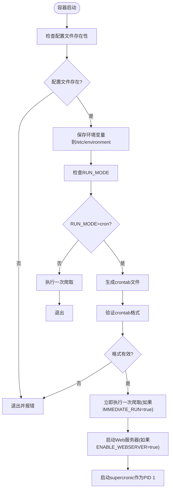
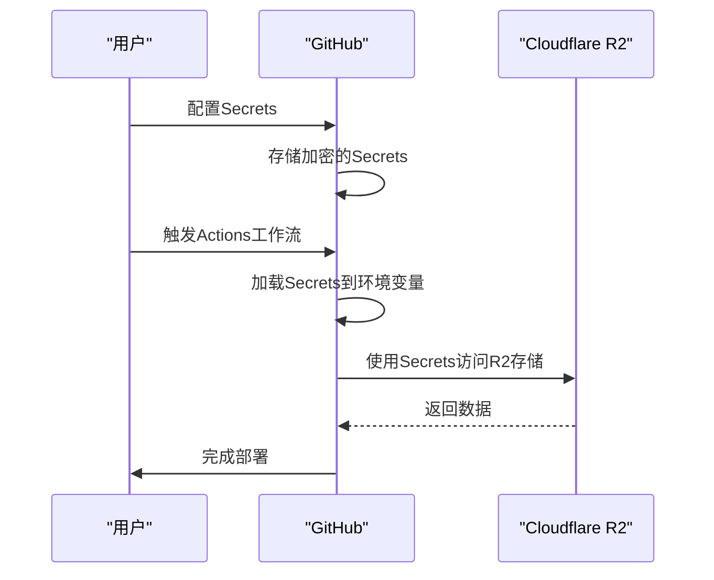

# 部署问题

<cite>
**本文档引用的文件**  
- [README-MCP-FAQ.md](file://README-MCP-FAQ.md)
- [docker-compose.yml](file://docker/docker-compose.yml)
- [.env](file://docker/.env)
- [Dockerfile](file://docker/Dockerfile)
- [entrypoint.sh](file://docker/entrypoint.sh)
- [manage.py](file://docker/manage.py)
- [config.yaml](file://config/config.yaml)
</cite>

## 目录
1. [简介](#简介)
2. [Docker部署问题排查](#docker部署问题排查)
3. [GitHub Actions自动化部署问题](#github-actions自动化部署问题)
4. [日志分析与诊断](#日志分析与诊断)

## 简介
TrendRadar是一个新闻热点聚合工具，支持通过Docker和GitHub Actions两种方式部署。本指南旨在帮助用户解决在部署过程中可能遇到的常见问题，特别是Docker容器管理、镜像构建、环境变量配置以及GitHub Actions工作流执行失败等问题。通过引用项目中的配置文件和文档，我们将提供详细的故障排查步骤和解决方案。

## Docker部署问题排查

### 容器无法启动
当使用`docker-compose up`启动TrendRadar时，容器可能因多种原因无法正常启动。常见原因包括端口占用、权限不足或Docker守护进程状态异常。

**端口占用问题**  
在`docker-compose.yml`文件中，TrendRadar的Web服务器默认映射到主机的8080端口。如果该端口已被其他服务占用，容器将无法启动。解决方案是修改`.env`文件中的`WEBSERVER_PORT`变量，例如设置为`WEBSERVER_PORT=8081`，然后重启容器。

**权限问题**  
确保Docker守护进程正在运行且当前用户有权限访问Docker。在Linux系统上，可以使用`sudo systemctl status docker`检查Docker服务状态。如果用户不在docker组中，需要添加用户到docker组：`sudo usermod -aG docker $USER`，然后重新登录。

**Docker守护进程状态**  
使用`docker info`命令检查Docker守护进程是否正常运行。如果出现连接错误，尝试重启Docker服务：`sudo systemctl restart docker`。

**配置文件缺失**  
`entrypoint.sh`脚本在启动时会检查`/app/config/config.yaml`和`/app/config/frequency_words.txt`是否存在。如果这些文件缺失，容器将退出。确保`config`目录已正确挂载到容器中。



**Diagram sources**  
- [entrypoint.sh](file://docker/entrypoint.sh#L4-L50)

**Section sources**  
- [docker-compose.yml](file://docker/docker-compose.yml#L1-L88)
- [.env](file://docker/.env#L1-L130)
- [entrypoint.sh](file://docker/entrypoint.sh#L1-L50)

### 镜像构建失败
镜像构建失败通常发生在使用`docker-compose-build.yml`构建自定义镜像时。主要问题包括依赖下载超时和网络问题。

**依赖下载超时**  
在`Dockerfile`中，构建过程会从GitHub下载`supercronic`二进制文件。由于网络问题，下载可能失败。Dockerfile中已包含重试机制（最多3次，每次超时30秒），但如果网络环境较差，仍可能失败。解决方案是使用国内镜像源或在构建时指定代理。

**网络问题**  
确保构建环境可以访问外部网络。如果在企业网络中，可能需要配置Docker的代理设置。可以在`~/.docker/config.json`中添加代理配置：
```json
{
 "proxies": {
   "default": {
     "httpProxy": "http://proxy.example.com:8080",
     "httpsProxy": "http://proxy.example.com:8080"
   }
 }
}
```

**Section sources**  
- [Dockerfile](file://docker/Dockerfile#L1-L71)
- [docker-compose-build.yml](file://docker/docker-compose-build.yml#L1-L92)

### 环境变量未生效
环境变量未生效是常见的配置问题。TrendRadar通过`.env`文件和`docker-compose.yml`中的环境变量配置来控制应用行为。

**检查.dockerenv和docker-compose.yml配置**  
在`.env`文件中定义的环境变量优先级高于`config.yaml`中的配置。例如，`ENABLE_CRAWLER`、`ENABLE_NOTIFICATION`等变量在`.env`中设置后会覆盖`config.yaml`中的相应设置。确保`.env`文件中的变量名与`docker-compose.yml`中引用的变量名一致。

**验证环境变量加载**  
使用`docker exec -it trend-radar env`命令查看容器内的环境变量，确认所需变量已正确加载。也可以使用`manage.py`脚本的`config`命令查看当前配置：`docker exec -it trend-radar python manage.py config`。

**Section sources**  
- [.env](file://docker/.env#L1-L130)
- [docker-compose.yml](file://docker/docker-compose.yml#L1-L88)
- [manage.py](file://docker/manage.py#L273-L325)

## GitHub Actions自动化部署问题

### Secrets配置错误
GitHub Actions工作流依赖于在仓库设置中配置的Secrets。如果Secrets配置错误，自动化部署将失败。

**必需的Secrets**  
根据`README.md`文档，必须配置以下四个Secrets：
- `S3_BUCKET_NAME`: 存储桶名称
- `S3_ACCESS_KEY_ID`: 访问密钥ID
- `S3_SECRET_ACCESS_KEY`: 访问密钥
- `S3_ENDPOINT_URL`: S3 API端点

**可选的Secrets**  
- `S3_REGION`: 区域（默认为`auto`）

**配置注意事项**  
- **名称必须严格匹配**：Secret的Name必须与文档中列出的完全一致，不能有拼写错误。
- **一个Name对应一个Secret**：每添加一个配置项，需要点击一次"New repository secret"按钮。
- **保存后看不到值是正常的**：出于安全考虑，保存后只能看到Name，看不到Secret的值。



**Diagram sources**  
- [README.md](file://README.md#L894-L918)
- [README-EN.md](file://README-EN.md#L934-L965)

**Section sources**  
- [README.md](file://README.md#L894-L918)
- [README-EN.md](file://README-EN.md#L934-L965)

### API调用频率限制
GitHub Actions对API调用有频率限制。如果工作流执行过于频繁，可能会触发限制。

**签到续期机制**  
TrendRadar的GitHub Actions部署包含一个签到续期机制：
- **运行周期**：有效期为7天，倒计时结束后服务将自动挂起。
- **续期方式**：在Actions页面手动触发"Check In" workflow，即可重置7天有效期。
- **设计理念**：避免算力的无效空转，确保资源能分配给真正活跃且需要的用户。

**执行频率配置**  
在`.github/workflows/crawler.yml`中，可以通过cron表达式配置执行频率。例如，`0 * * * *`表示每小时执行一次。建议根据实际需求调整频率，避免过于频繁的执行。

**Section sources**  
- [README.md](file://README.md#L894-L900)
- [README-EN.md](file://README-EN.md#L2656-L2680)

### 工作流权限不足
工作流权限不足可能导致部署失败。确保工作流文件有正确的权限设置。

**检查工作流文件**  
确认`.github/workflows/`目录下存在`crawler.yml`和`check-in.yml`等必要工作流文件。如果目录不存在或文件缺失，需要手动创建或从原项目复制。

**权限设置**  
在GitHub仓库的Settings → Actions → General中，确保"Allow all actions and reusable workflows"选项已启用，或者至少允许仓库所有者创建的动作。

**Section sources**  
- [README.md](file://README.md#L1554-L1568)
- [README-EN.md](file://README-EN.md#L1554-L1568)

## 日志分析与诊断

### 使用诊断命令
当遇到部署问题时，可以使用以下诊断命令来定位问题。

**查看容器状态**  
使用`docker ps`查看容器运行状态：
```bash
docker ps -a | grep trend-radar
```

**查看容器日志**  
使用`docker logs`查看容器输出日志：
```bash
docker logs trend-radar
```

**进入容器内部**  
使用`docker exec`进入容器进行调试：
```bash
docker exec -it trend-radar /bin/bash
```

### 引用README-MCP-FAQ.md中的相关答案
`README-MCP-FAQ.md`文件包含了大量关于如何使用和配置TrendRadar的信息。

**查看系统配置**  
可以使用`get_current_config`工具查看当前系统配置，包括可用平台、爬虫配置、权重配置和通知配置。

**检查系统运行状态**  
使用`get_system_status`工具可以检查系统状态，包括系统版本、最后爬取时间、历史数据天数和健康检查结果。

**手动触发爬取任务**  
使用`trigger_crawl`工具可以手动触发爬取任务，有两种模式：临时爬取（只返回数据不保存）和持久化爬取（保存到output文件夹）。

**Section sources**  
- [README-MCP-FAQ.md](file://README-MCP-FAQ.md#L1-L627)