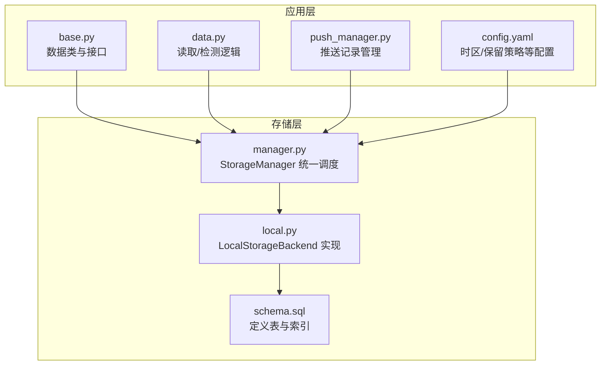
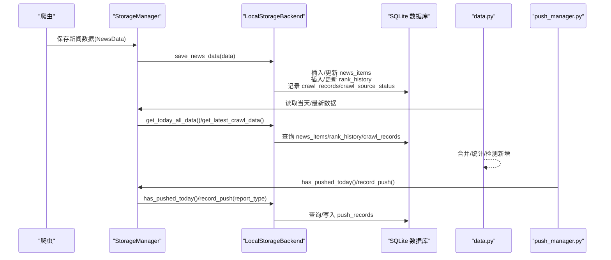
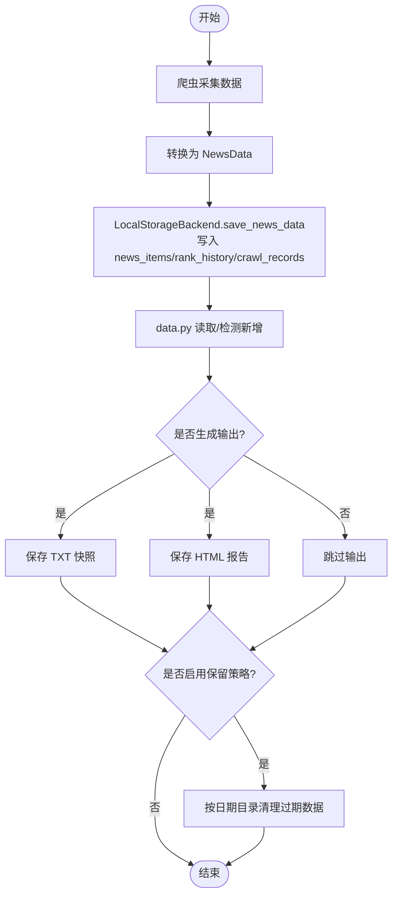
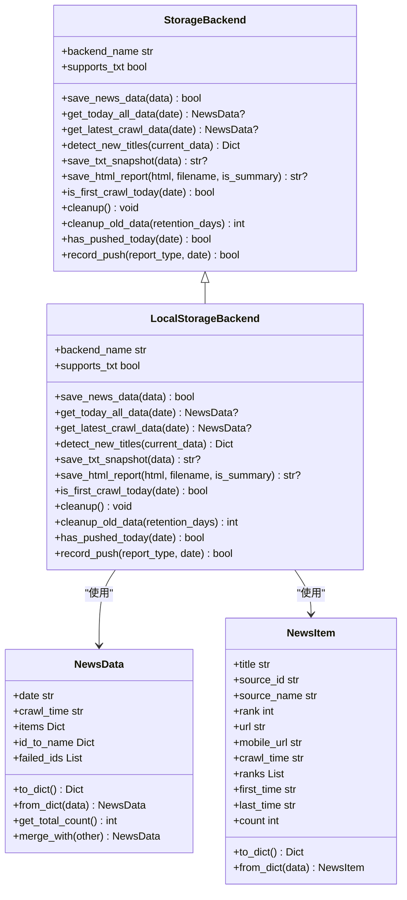
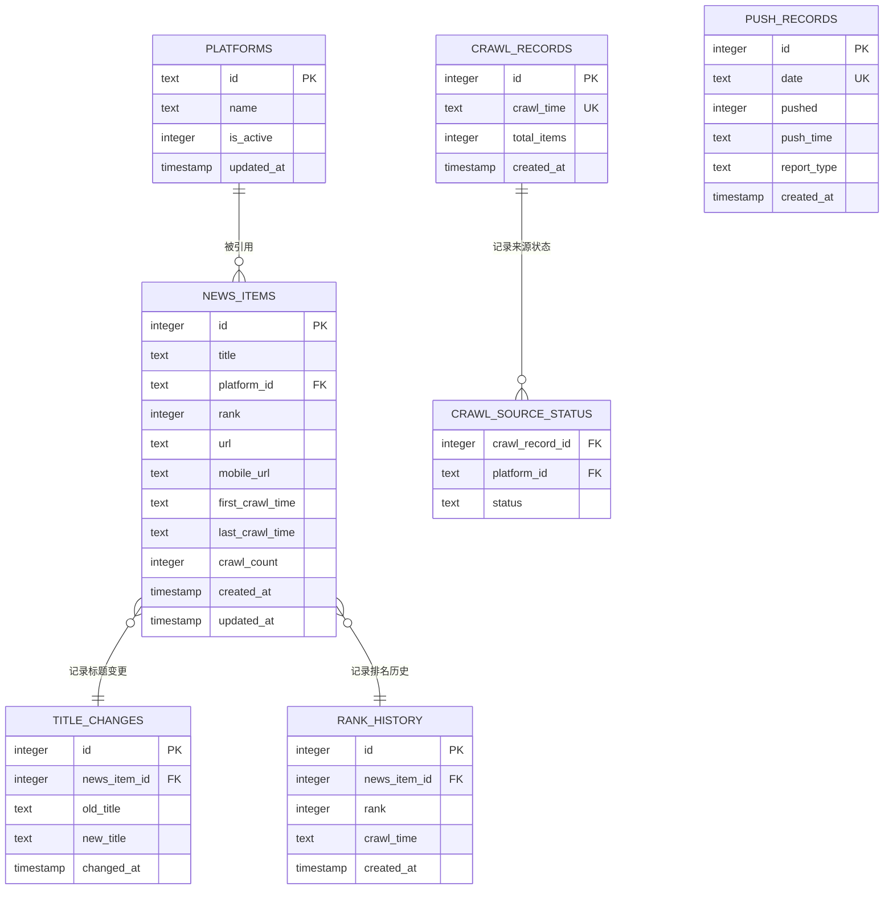

# 数据模型

<cite>
**本文引用的文件**
- [schema.sql](file://trendradar/storage/schema.sql)
- [base.py](file://trendradar/storage/base.py)
- [local.py](file://trendradar/storage/local.py)
- [manager.py](file://trendradar/storage/manager.py)
- [data.py](file://trendradar/core/data.py)
- [push_manager.py](file://trendradar/notification/push_manager.py)
- [config.yaml](file://config/config.yaml)
</cite>

## 目录
1. [简介](#简介)
2. [项目结构](#项目结构)
3. [核心组件](#核心组件)
4. [架构总览](#架构总览)
5. [详细组件分析](#详细组件分析)
6. [依赖关系分析](#依赖关系分析)
7. [性能考量](#性能考量)
8. [故障排查指南](#故障排查指南)
9. [结论](#结论)
10. [附录](#附录)

## 简介
本文件聚焦于 SQLite 数据库的 schema 设计与数据模型，系统性解析 news_items 与 push_records 表的字段语义、约束与业务含义；阐明 Python 数据类 News 与数据库表之间的映射关系；梳理从爬虫采集、入库、分析查询到过期清理的完整数据生命周期；说明 TXT/HTML 输出文件与数据库的关系；并提供 ER 图与 sqlite3 命令行查询示例，帮助开发者快速理解数据存储与访问模式。

## 项目结构
围绕数据模型的关键文件分布如下：
- schema.sql：定义 SQLite 表结构与索引
- base.py：定义数据类与存储后端抽象接口
- local.py：本地 SQLite 后端实现（含插入、查询、推送记录、清理）
- manager.py：存储管理器，统一调度后端
- data.py：数据分析与查询工具（从存储后端读取数据）
- push_manager.py：推送记录管理器（基于存储后端）
- config.yaml：全局配置（含时区、存储格式、保留策略等）

图表来源
- [schema.sql](file://trendradar/storage/schema.sql#L1-L118)
- [base.py](file://trendradar/storage/base.py#L1-L120)
- [local.py](file://trendradar/storage/local.py#L1-L120)
- [manager.py](file://trendradar/storage/manager.py#L1-L120)
- [data.py](file://trendradar/core/data.py#L1-L120)
- [push_manager.py](file://trendradar/notification/push_manager.py#L1-L60)
- [config.yaml](file://config/config.yaml#L1-L60)

章节来源
- [schema.sql](file://trendradar/storage/schema.sql#L1-L118)
- [base.py](file://trendradar/storage/base.py#L1-L120)
- [local.py](file://trendradar/storage/local.py#L1-L120)
- [manager.py](file://trendradar/storage/manager.py#L1-L120)
- [data.py](file://trendradar/core/data.py#L1-L120)
- [push_manager.py](file://trendradar/notification/push_manager.py#L1-L60)
- [config.yaml](file://config/config.yaml#L1-L60)

## 核心组件
- 数据类与接口
  - NewsData：封装日期、抓取时间、按来源分组的新闻列表、来源名称映射、失败来源列表
  - NewsItem：封装单条新闻的标题、来源ID、排名、URL、移动端URL、抓取时间、历史排名、首次/末次出现时间、出现次数等
  - StorageBackend：统一的存储后端接口，定义保存、读取、检测新增、生成快照/报告、推送记录、清理等方法
- 本地存储后端
  - LocalStorageBackend：基于 SQLite 的本地实现，按日期组织数据库文件，支持 TXT 快照与 HTML 报告
- 存储管理器
  - StorageManager：根据环境与配置选择后端，统一分发调用
- 数据分析与推送
  - data.py：从存储后端读取当天数据、检测最新新增标题
  - push_manager.py：基于存储后端进行推送记录查询与写入

章节来源
- [base.py](file://trendradar/storage/base.py#L1-L120)
- [local.py](file://trendradar/storage/local.py#L1-L120)
- [manager.py](file://trendradar/storage/manager.py#L1-L120)
- [data.py](file://trendradar/core/data.py#L1-L120)
- [push_manager.py](file://trendradar/notification/push_manager.py#L1-L60)

## 架构总览
下图展示数据模型与后端实现的交互关系，以及数据生命周期的关键节点。

图表来源
- [manager.py](file://trendradar/storage/manager.py#L200-L230)
- [local.py](file://trendradar/storage/local.py#L113-L288)
- [data.py](file://trendradar/core/data.py#L86-L180)
- [push_manager.py](file://trendradar/notification/push_manager.py#L47-L67)

## 详细组件分析

### news_items 表结构与字段语义
news_items 是核心新闻条目标，用于按 URL+平台去重存储，支持标题变更与排名历史追踪。

- 字段与约束
  - id：自增主键
  - title：文本，非空，存储新闻标题
  - platform_id：文本，非空，外键关联 platforms(id)
  - rank：整数，非空，当前排名
  - url：文本，默认空串，存储标准化后的 URL（用于去重）
  - mobile_url：文本，默认空串，移动端 URL
  - first_crawl_time：文本，非空，首次抓取时间
  - last_crawl_time：文本，非空，最后一次抓取时间
  - crawl_count：整数，默认1，抓取次数累计
  - created_at：时间戳，默认当前时间
  - updated_at：时间戳，默认当前时间
  - 外键：platform_id 引用 platforms(id)

- 去重与一致性
  - 通过唯一索引 idx_news_url_platform 在 URL 非空时保证“URL+平台”唯一
  - 标准化 URL（例如去除动态参数）后入库，提升去重准确性
  - 标题变更通过 title_changes 表记录历史

- 业务含义
  - 以 URL+平台为唯一标识，避免同平台同标题重复存储
  - 通过 first_crawl_time/last_crawl_time/crawl_count 记录生命周期与活跃度
  - rank 与 rank_history 协同，支持排名趋势分析

章节来源
- [schema.sql](file://trendradar/storage/schema.sql#L18-L31)
- [local.py](file://trendradar/storage/local.py#L146-L233)

### push_records 表结构与字段语义
push_records 用于 once_per_day 与时间窗口控制，记录每日推送状态。

- 字段与约束
  - id：自增主键
  - date：文本，非空且唯一，格式为 YYYY-MM-DD
  - pushed：整数，默认0，标记当天是否已推送
  - push_time：文本，记录推送时间
  - report_type：文本，记录推送报告类型
  - created_at：时间戳，默认当前时间

- 业务含义
  - once_per_day：通过 date 唯一约束与 pushed 字段实现
  - report_type 便于区分日报/增量/当前榜单等推送类型
  - push_time 便于审计与统计

章节来源
- [schema.sql](file://trendradar/storage/schema.sql#L87-L94)
- [local.py](file://trendradar/storage/local.py#L822-L886)

### 数据类与数据库表映射
- NewsItem 与 news_items 的映射
  - title ↔ title
  - source_id ↔ platform_id
  - rank ↔ rank
  - url ↔ url
  - mobile_url ↔ mobile_url
  - first_time ↔ first_crawl_time
  - last_time ↔ last_crawl_time
  - count ↔ crawl_count
  - ranks ↔ 通过 rank_history 聚合得到的历史排名序列

- NewsData 与多表协作
  - 保存时：写入 news_items、rank_history、crawl_records、crawl_source_status
  - 读取时：从 news_items 与 rank_history 聚合 ranks，结合 platforms 与 crawl_records 提供统计信息

章节来源
- [base.py](file://trendradar/storage/base.py#L13-L63)
- [base.py](file://trendradar/storage/base.py#L65-L113)
- [local.py](file://trendradar/storage/local.py#L113-L288)
- [local.py](file://trendradar/storage/local.py#L293-L408)
- [local.py](file://trendradar/storage/local.py#L410-L521)

### 数据生命周期
- 爬取阶段
  - 爬虫产出 results/id_to_name/failed_ids，经转换为 NewsData
- 入库阶段
  - LocalStorageBackend.save_news_data：
    - 同步 platforms
    - 去重插入/更新 news_items
    - 记录 title_changes（标题变更）
    - 记录 rank_history（历史排名）
    - 记录 crawl_records 与 crawl_source_status（抓取统计）
- 分析阶段
  - data.py 读取当天/最新数据，合并历史与当前，检测新增标题
- 输出阶段
  - 可选：保存 TXT 快照（按时间命名）
  - 可选：保存 HTML 报告
- 清理阶段
  - 根据 retention_days 配置，删除过期日期目录（按日期文件夹）

图表来源
- [local.py](file://trendradar/storage/local.py#L113-L288)
- [data.py](file://trendradar/core/data.py#L86-L180)
- [local.py](file://trendradar/storage/local.py#L585-L671)
- [local.py](file://trendradar/storage/local.py#L746-L820)

章节来源
- [local.py](file://trendradar/storage/local.py#L113-L288)
- [data.py](file://trendradar/core/data.py#L86-L180)
- [local.py](file://trendradar/storage/local.py#L585-L671)
- [local.py](file://trendradar/storage/local.py#L746-L820)

### TXT 与 HTML 输出文件
- TXT 快照
  - 保存路径：output/{YYYY-MM-DD}/txt/{HH-MM}.txt
  - 内容：按来源分组，按排名排序，包含 URL/MOBILE 标注
  - 触发：LocalStorageBackend.save_txt_snapshot
- HTML 报告
  - 保存路径：output/{YYYY-MM-DD}/html/{filename}
  - 触发：LocalStorageBackend.save_html_report
- 与数据库的关系
  - 输出内容来源于数据库读取（news_items/rank_history），确保与存储一致

章节来源
- [local.py](file://trendradar/storage/local.py#L585-L671)
- [data.py](file://trendradar/core/data.py#L1-L84)

### 推送记录与 retention_days 配置
- 推送记录
  - has_pushed_today：查询 push_records.date 是否存在且 pushed=1
  - record_push：写入 push_records，ON CONFLICT(date) DO UPDATE
  - 作用：once_per_day 与时间窗口控制
- retention_days
  - 配置来源：config.yaml 中 storage.local.retention_days
  - 清理逻辑：遍历 output 目录，删除早于 cutoff_date 的日期文件夹，并关闭对应数据库连接

章节来源
- [push_manager.py](file://trendradar/notification/push_manager.py#L47-L67)
- [local.py](file://trendradar/storage/local.py#L822-L886)
- [config.yaml](file://config/config.yaml#L27-L30)
- [local.py](file://trendradar/storage/local.py#L746-L820)

## 依赖关系分析
- 类关系
  - StorageBackend 为抽象接口，LocalStorageBackend 为其实现
  - NewsData/NewsItem 为数据载体，被 StorageBackend 的实现使用
  - StorageManager 统一调度后端，向上提供统一接口

图表来源
- [base.py](file://trendradar/storage/base.py#L187-L356)
- [local.py](file://trendradar/storage/local.py#L1-L120)
- [base.py](file://trendradar/storage/base.py#L13-L63)
- [base.py](file://trendradar/storage/base.py#L65-L113)

章节来源
- [base.py](file://trendradar/storage/base.py#L187-L356)
- [local.py](file://trendradar/storage/local.py#L1-L120)
- [base.py](file://trendradar/storage/base.py#L13-L113)

## 性能考量
- 索引优化
  - idx_news_platform：加速按平台过滤
  - idx_news_crawl_time：加速查询最新数据
  - idx_news_title：加速标题搜索
  - idx_news_url_platform：在 URL 非空时去重，避免重复存储
  - idx_crawl_status_record：加速按抓取记录查询来源状态
  - idx_rank_history_news：加速批量查询排名历史
- 批量查询
  - 读取时先获取 news_ids，再一次性批量查询 rank_history，减少往返
- 去重策略
  - 标准化 URL 后入库，提高去重准确率，降低重复写入成本

章节来源
- [schema.sql](file://trendradar/storage/schema.sql#L99-L118)
- [local.py](file://trendradar/storage/local.py#L328-L343)
- [local.py](file://trendradar/storage/local.py#L462-L473)

## 故障排查指南
- 保存失败
  - 检查数据库连接与 schema 初始化是否成功
  - 查看异常日志，定位具体插入/更新失败的条目
- 读取为空
  - 确认日期文件夹是否存在，数据库文件是否生成
  - 检查 crawl_records 是否存在，最新抓取时间是否正确
- 推送重复
  - 检查 push_records 中对应 date 的 pushed 字段是否为 1
  - 若需重置，可在数据库中更新或删除对应记录
- 清理无效
  - 确认 retention_days 配置是否大于 0
  - 检查输出目录权限与日期格式（支持 ISO 与中文格式）

章节来源
- [local.py](file://trendradar/storage/local.py#L289-L292)
- [local.py](file://trendradar/storage/local.py#L406-L409)
- [local.py](file://trendradar/storage/local.py#L822-L886)
- [local.py](file://trendradar/storage/local.py#L746-L820)

## 结论
本数据模型以 SQLite 为核心，通过 news_items 与 rank_history 实现去重、标题变更与排名历史追踪；通过 push_records 支持 once_per_day 与时间窗口控制；通过 StorageManager/LocalStorageBackend 提供统一的保存、读取、检测与清理能力；配合 TXT/HTML 输出，形成完整的数据生命周期闭环。合理的索引与批量查询策略提升了性能，retention_days 配置保障了数据治理。

## 附录

### 数据库 ER 图

图表来源
- [schema.sql](file://trendradar/storage/schema.sql#L7-L118)

### sqlite3 命令行查询示例
以下示例基于本地 SQLite 数据库文件（按日期组织）。假设当前日期为 YYYY-MM-DD，数据库文件位于 output/YYYY-MM-DD/news.db。

- 查看最新抓取时间
  - 查询最新一次抓取时间
  - SQL：SELECT crawl_time FROM crawl_records ORDER BY crawl_time DESC LIMIT 1

- 读取当天所有新闻（含历史排名）
  - 读取 news_items 并聚合 rank_history
  - SQL：参考本地实现中的查询逻辑（按平台与最后抓取时间排序）

- 检测当天新增标题
  - 与历史数据对比，筛选 first_crawl_time < 最新抓取时间的标题
  - SQL：参考本地实现中的检测逻辑

- 查看推送记录
  - 查询某日是否已推送
  - SQL：SELECT pushed FROM push_records WHERE date = 'YYYY-MM-DD'

- 清理过期数据
  - 通过 StorageManager/LocalStorageBackend 的清理逻辑删除过期日期目录
  - 配置项：storage.local.retention_days

章节来源
- [local.py](file://trendradar/storage/local.py#L293-L408)
- [local.py](file://trendradar/storage/local.py#L410-L521)
- [local.py](file://trendradar/storage/local.py#L822-L886)
- [config.yaml](file://config/config.yaml#L27-L30)