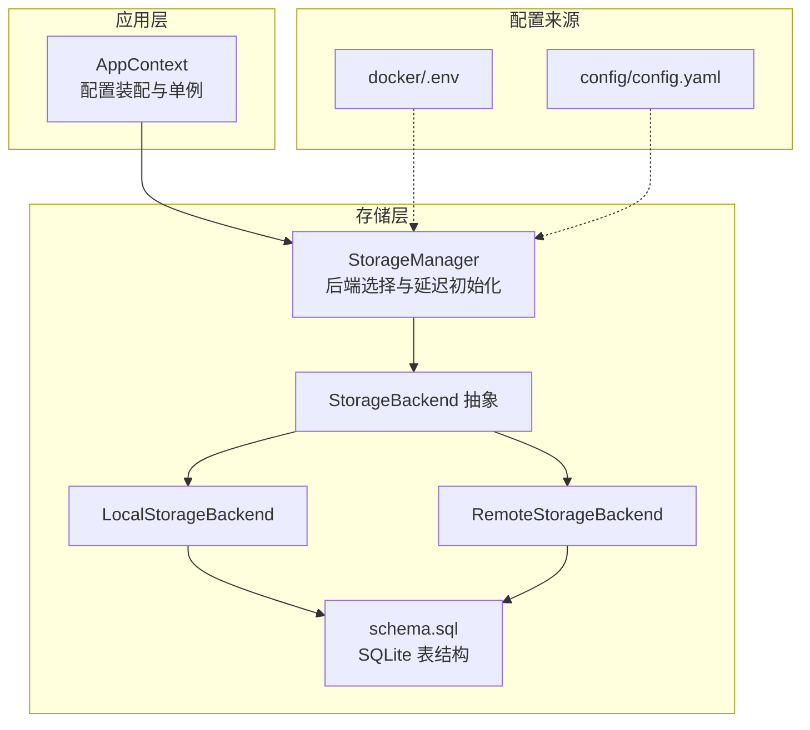
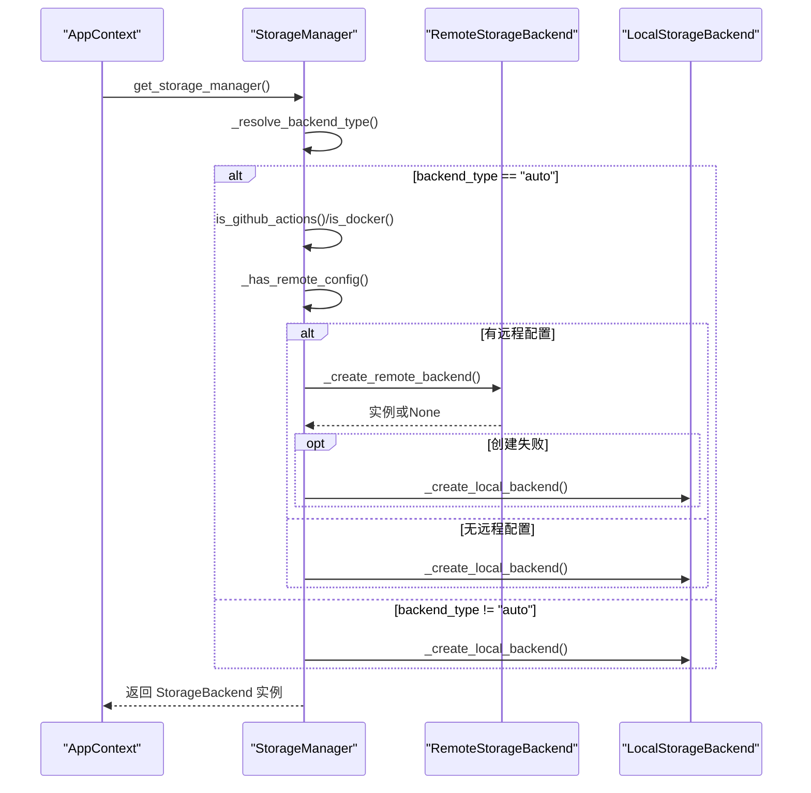
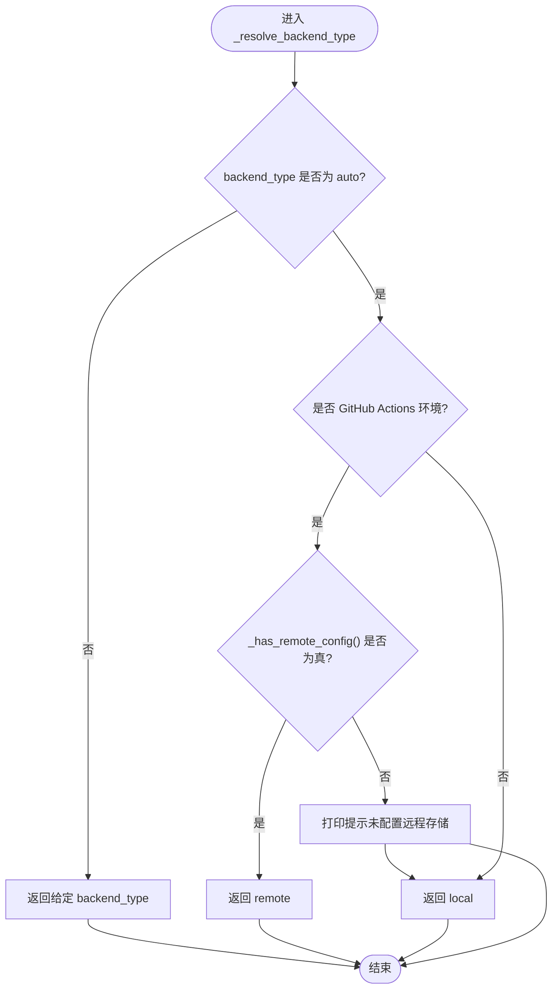
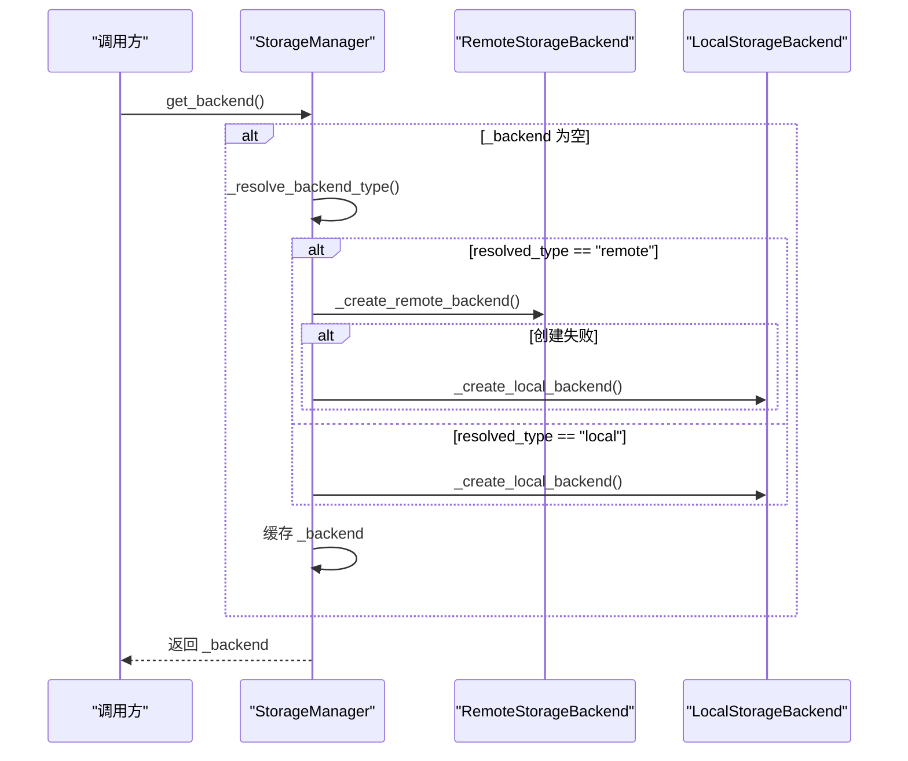
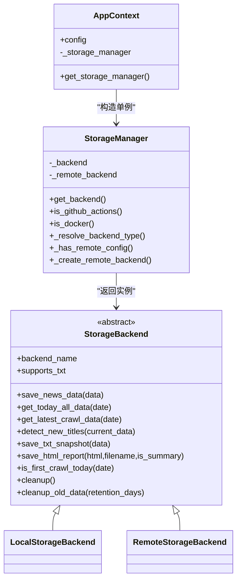
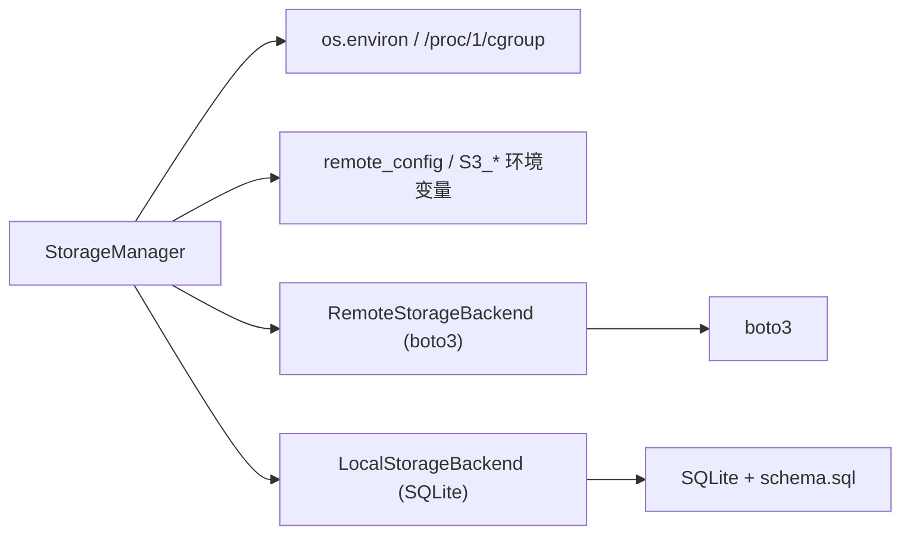

# 后端选择策略

<cite>
**本文引用的文件**
- [trendradar/storage/manager.py](file://trendradar/storage/manager.py)
- [trendradar/context.py](file://trendradar/context.py)
- [trendradar/storage/base.py](file://trendradar/storage/base.py)
- [trendradar/storage/local.py](file://trendradar/storage/local.py)
- [trendradar/storage/remote.py](file://trendradar/storage/remote.py)
- [trendradar/storage/schema.sql](file://trendradar/storage/schema.sql)
- [docker/.env](file://docker/.env)
- [config/config.yaml](file://config/config.yaml)
</cite>

## 目录
1. [简介](#简介)
2. [项目结构](#项目结构)
3. [核心组件](#核心组件)
4. [架构总览](#架构总览)
5. [详细组件分析](#详细组件分析)
6. [依赖关系分析](#依赖关系分析)
7. [性能考量](#性能考量)
8. [故障排查指南](#故障排查指南)
9. [结论](#结论)

## 简介
本文聚焦于 TrendRadar 的存储后端选择策略，系统性解析 StorageManager._resolve_backend_type() 的实现逻辑，阐明其如何依据 backend_type 配置（local/remote/auto）与运行环境（GitHub Actions/Docker/本地）自动决策后端类型；在 auto 模式下，如何结合 is_github_actions() 与 is_docker() 检测运行环境，并通过_has_remote_config() 对 S3 配置（bucket_name、access_key_id、secret_access_key、endpoint_url）进行检查，从而决定最终使用 local 还是 remote 后端。同时，本文还解释 get_backend() 的延迟初始化机制，以及当 remote 后端创建失败时如何优雅回退到 local 后端。最后，结合 AppContext 的初始化流程，说明该策略如何实现部署的灵活性与健壮性。

## 项目结构
围绕存储后端选择策略的相关文件主要分布在以下模块：
- 存储管理与后端抽象：trendradar/storage/manager.py、trendradar/storage/base.py
- 本地后端实现：trendradar/storage/local.py（含 schema.sql）
- 远程后端实现：trendradar/storage/remote.py
- 应用上下文集成：trendradar/context.py
- 配置来源：docker/.env、config/config.yaml

图表来源
- [trendradar/storage/manager.py](file://trendradar/storage/manager.py#L1-L120)
- [trendradar/storage/base.py](file://trendradar/storage/base.py#L187-L360)
- [trendradar/storage/local.py](file://trendradar/storage/local.py#L1-L120)
- [trendradar/storage/remote.py](file://trendradar/storage/remote.py#L1-L120)
- [trendradar/storage/schema.sql](file://trendradar/storage/schema.sql#L1-L118)
- [trendradar/context.py](file://trendradar/context.py#L120-L160)
- [docker/.env](file://docker/.env#L90-L120)
- [config/config.yaml](file://config/config.yaml#L31-L51)

章节来源
- [trendradar/storage/manager.py](file://trendradar/storage/manager.py#L1-L120)
- [trendradar/context.py](file://trendradar/context.py#L120-L160)

## 核心组件
- StorageManager：负责后端类型解析、运行环境检测、远程配置检查、延迟初始化与回退逻辑。
- StorageBackend 抽象：定义统一的存储接口，确保 local 与 remote 后端具备一致能力。
- LocalStorageBackend：基于 SQLite 的本地存储，支持 TXT 快照与 HTML 报告。
- RemoteStorageBackend：基于 S3 兼容协议的远程存储，支持下载/合并/上传流程。
- AppContext：负责从配置装配 StorageManager 单例，贯穿应用生命周期。

章节来源
- [trendradar/storage/manager.py](file://trendradar/storage/manager.py#L18-L120)
- [trendradar/storage/base.py](file://trendradar/storage/base.py#L187-L360)
- [trendradar/storage/local.py](file://trendradar/storage/local.py#L1-L120)
- [trendradar/storage/remote.py](file://trendradar/storage/remote.py#L1-L120)
- [trendradar/context.py](file://trendradar/context.py#L120-L160)

## 架构总览
后端选择策略在 StorageManager 中集中实现，结合 AppContext 的配置装配，形成“配置驱动 + 环境感知”的自动化后端决策链路。

图表来源
- [trendradar/storage/manager.py](file://trendradar/storage/manager.py#L93-L173)
- [trendradar/storage/manager.py](file://trendradar/storage/manager.py#L126-L173)
- [trendradar/context.py](file://trendradar/context.py#L128-L154)

## 详细组件分析

### StorageManager._resolve_backend_type() 与运行环境检测
- auto 模式下的决策流程：
  - 若 backend_type 为 auto：
    - 在 GitHub Actions 环境中，若_has_remote_config() 为真，则选择 remote；否则打印提示并选择 local。
    - 在非 GitHub Actions 环境中，直接选择 local。
  - 若 backend_type 非 auto，则直接返回该值。
- 运行环境检测：
  - is_github_actions()：通过环境变量 GITHUB_ACTIONS 判断。
  - is_docker()：通过 /.dockerenv 文件、/proc/1/cgroup 中包含 docker 字段、或环境变量 DOCKER_CONTAINER 判断。
- 远程配置检查：
  - _has_remote_config()：从 remote_config 或环境变量（S3_BUCKET_NAME、S3_ACCESS_KEY_ID、S3_SECRET_ACCESS_KEY、S3_ENDPOINT_URL）中读取并校验完整性。

图表来源
- [trendradar/storage/manager.py](file://trendradar/storage/manager.py#L93-L125)
- [trendradar/storage/manager.py](file://trendradar/storage/manager.py#L72-L105)

章节来源
- [trendradar/storage/manager.py](file://trendradar/storage/manager.py#L72-L125)

### StorageManager.get_backend() 的延迟初始化与回退机制
- 延迟初始化：
  - 首次调用 get_backend() 时，根据 _resolve_backend_type() 的结果创建对应后端实例，并缓存至 _backend。
- 回退逻辑：
  - 当 resolved_type 为 remote 且 _create_remote_backend() 返回 None（导入失败或初始化异常），则打印提示并回退为 local。
- 后端实例属性：
  - backend_name：用于标识当前后端类型（local/remote）。
  - supports_txt：指示是否支持 TXT 快照（remote 默认关闭，local 可由配置决定）。

图表来源
- [trendradar/storage/manager.py](file://trendradar/storage/manager.py#L149-L173)
- [trendradar/storage/manager.py](file://trendradar/storage/manager.py#L126-L173)

章节来源
- [trendradar/storage/manager.py](file://trendradar/storage/manager.py#L149-L173)

### 远程后端创建与错误处理
- _create_remote_backend()：
  - 从 remote_config 或环境变量读取 S3 参数，构造 RemoteStorageBackend。
  - 捕获 ImportError（缺少 boto3）与通用异常，分别打印提示并返回 None。
- RemoteStorageBackend 初始化：
  - 根据 endpoint_url 判断是否为腾讯云 COS，选择签名版本（SigV2 或 SigV4）。
  - 使用虚拟主机风格地址（addressing_style=virtual）提升兼容性。
  - 创建临时目录用于下载/合并/上传流程，跟踪下载文件以便清理。

章节来源
- [trendradar/storage/manager.py](file://trendradar/storage/manager.py#L126-L148)
- [trendradar/storage/remote.py](file://trendradar/storage/remote.py#L93-L129)

### 本地后端与数据库结构
- LocalStorageBackend：
  - 基于 SQLite，按日期组织数据库文件（news.db），支持平台信息、新闻条目、标题变更历史、排名历史、抓取记录与状态、推送记录等表。
  - 提供保存数据、读取当日/最新数据、检测新增标题、保存 TXT 快照、保存 HTML 报告、清理过期数据等能力。
- schema.sql：
  - 定义核心表结构与索引，确保 URL+platform_id 唯一性、时间索引、排名历史索引等，支撑高效查询与去重。

章节来源
- [trendradar/storage/local.py](file://trendradar/storage/local.py#L1-L120)
- [trendradar/storage/schema.sql](file://trendradar/storage/schema.sql#L1-L118)

### AppContext 初始化与部署灵活性
- AppContext.get_storage_manager()：
  - 从配置中提取 STORAGE 配置（BACKEND、FORMATS、LOCAL、REMOTE、PULL），并调用 get_storage_manager(...) 构造 StorageManager 单例。
  - 通过配置来源（环境变量优先于配置文件）实现灵活部署：Docker 环境变量、GitHub Actions Secrets、本地 config.yaml。
- 配置来源与优先级：
  - docker/.env：包含 STORAGE_BACKEND、S3_* 等关键变量，用于 Docker/本地部署。
  - config/config.yaml：包含 remote/pull 等配置项，适合本地开发与参考。
  - 环境变量优先级高于配置文件，便于 CI/CD 与容器化部署。

图表来源
- [trendradar/context.py](file://trendradar/context.py#L128-L154)
- [trendradar/storage/manager.py](file://trendradar/storage/manager.py#L18-L120)
- [trendradar/storage/base.py](file://trendradar/storage/base.py#L187-L360)

章节来源
- [trendradar/context.py](file://trendradar/context.py#L128-L154)
- [docker/.env](file://docker/.env#L90-L120)
- [config/config.yaml](file://config/config.yaml#L31-L51)

## 依赖关系分析
- StorageManager 依赖：
  - 运行环境检测：os.environ 与 /proc/1/cgroup 文件系统。
  - 远程配置：remote_config 与环境变量 S3_*。
  - 后端实现：延迟导入 remote/local 后端类。
- RemoteStorageBackend 依赖：
  - boto3（可选依赖），根据 endpoint_url 选择签名版本，使用虚拟主机风格地址。
- LocalStorageBackend 依赖：
  - SQLite 与 schema.sql，按日期组织数据库文件，提供完整数据读写与清理能力。

图表来源
- [trendradar/storage/manager.py](file://trendradar/storage/manager.py#L72-L148)
- [trendradar/storage/remote.py](file://trendradar/storage/remote.py#L93-L129)
- [trendradar/storage/local.py](file://trendradar/storage/local.py#L1-L120)
- [trendradar/storage/schema.sql](file://trendradar/storage/schema.sql#L1-L118)

章节来源
- [trendradar/storage/manager.py](file://trendradar/storage/manager.py#L72-L148)
- [trendradar/storage/remote.py](file://trendradar/storage/remote.py#L93-L129)
- [trendradar/storage/local.py](file://trendradar/storage/local.py#L1-L120)

## 性能考量
- 延迟初始化：仅在首次使用时创建后端实例，减少启动开销。
- 远程后端的下载/上传采用分块迭代与显式 Content-Length，避免 chunked transfer encoding 导致的兼容性问题，提升稳定性。
- 本地后端使用索引（时间、标题、URL+平台唯一索引）优化查询性能，支持大规模数据检索。
- 过期数据清理：支持按保留天数清理本地与远程数据，避免无限增长。

[本节为通用指导，不涉及具体文件分析]

## 故障排查指南
- 远程后端导入失败（缺少 boto3）：
  - 现象：_create_remote_backend() 捕获 ImportError 并返回 None，随后回退到 local。
  - 处理：安装 boto3 依赖或切换 backend_type 为 local。
- 远程后端初始化失败：
  - 现象：抛出异常被捕获并返回 None，随后回退到 local。
  - 处理：检查 S3_* 环境变量与 endpoint_url 正确性，确认网络可达与凭据有效。
- GitHub Actions 环境但未配置远程存储：
  - 现象：_resolve_backend_type() 返回 local 并打印提示。
  - 处理：在 GitHub Secrets 中配置 S3_* 变量，或在 docker/.env 中设置 STORAGE_BACKEND=local。
- Docker 环境识别：
  - 现象：is_docker() 通过 /.dockerenv、cgroup 或环境变量判断。
  - 处理：确保容器内环境变量 DOCKER_CONTAINER 设置正确（如需要），或保持默认行为。
- 配置优先级问题：
  - 现象：环境变量优先于配置文件。
  - 处理：在 docker/.env 或 GitHub Secrets 中统一配置 S3_* 与 STORAGE_BACKEND。

章节来源
- [trendradar/storage/manager.py](file://trendradar/storage/manager.py#L126-L148)
- [trendradar/storage/manager.py](file://trendradar/storage/manager.py#L93-L125)
- [docker/.env](file://docker/.env#L90-L120)

## 结论
TrendRadar 的存储后端选择策略通过“配置 + 环境 + 远程配置”的三元组合，实现了在不同部署场景下的自动适配与稳健回退。StorageManager._resolve_backend_type() 与运行环境检测、远程配置检查共同构成决策核心；get_backend() 的延迟初始化与回退机制确保了在异常情况下仍能稳定工作。配合 AppContext 的配置装配与环境变量优先策略，系统在本地、Docker 与 GitHub Actions 等多种环境中均具备良好的灵活性与健壮性。