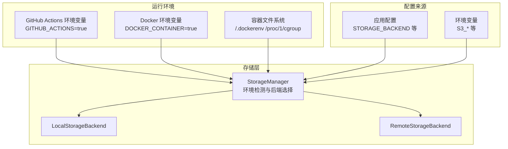
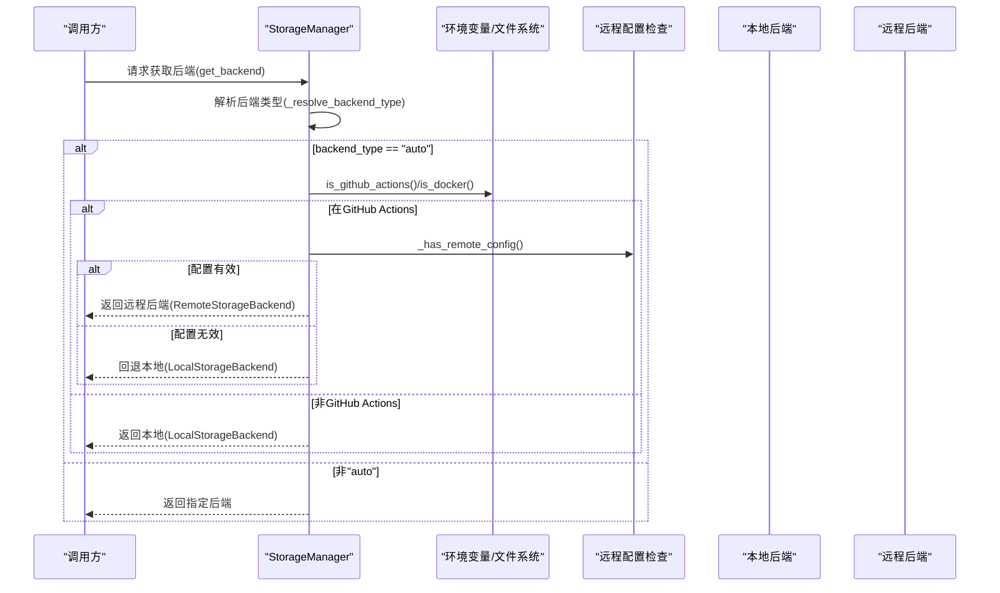
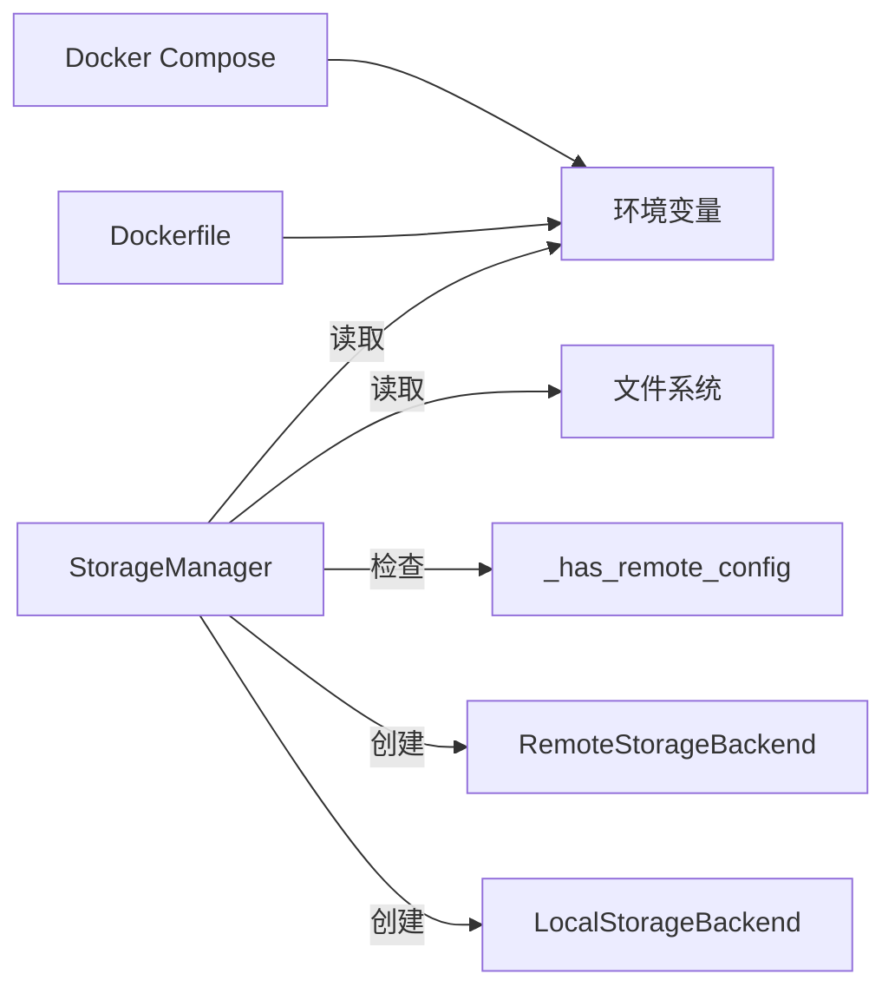

# 环境检测机制

<cite>
**本文引用的文件**
- [trendradar/storage/manager.py](file://trendradar/storage/manager.py)
- [README.md](file://README.md)
- [docker/docker-compose.yml](file://docker/docker-compose.yml)
- [docker/Dockerfile](file://docker/Dockerfile)
- [trendradar/context.py](file://trendradar/context.py)
</cite>

## 目录
1. [简介](#简介)
2. [项目结构](#项目结构)
3. [核心组件](#核心组件)
4. [架构总览](#架构总览)
5. [详细组件分析](#详细组件分析)
6. [依赖关系分析](#依赖关系分析)
7. [性能考量](#性能考量)
8. [故障排查指南](#故障排查指南)
9. [结论](#结论)

## 简介
本文件聚焦于TrendRadar存储后端选择策略中的“环境检测机制”，重点解释以下两个静态方法的实现与行为：
- StorageManager.is_github_actions()
- StorageManager.is_docker()

并结合_storage_backend_type()方法，说明这些环境检测结果如何影响“auto”模式下的后端选择决策，特别是在GitHub Actions环境下优先选择远程存储的逻辑。

## 项目结构
围绕环境检测与后端选择的关键文件如下：
- 存储管理器：trendradar/storage/manager.py
- 环境变量配置（Docker）：docker/docker-compose.yml、docker/Dockerfile
- 上下文与配置入口：trendradar/context.py
- 文档与策略说明：README.md

图表来源
- [trendradar/storage/manager.py](file://trendradar/storage/manager.py#L71-L91)
- [trendradar/storage/manager.py](file://trendradar/storage/manager.py#L93-L105)
- [docker/docker-compose.yml](file://docker/docker-compose.yml#L54-L69)
- [docker/Dockerfile](file://docker/Dockerfile#L67-L70)

章节来源
- [trendradar/storage/manager.py](file://trendradar/storage/manager.py#L71-L105)
- [docker/docker-compose.yml](file://docker/docker-compose.yml#L54-L69)
- [docker/Dockerfile](file://docker/Dockerfile#L67-L70)

## 核心组件
- StorageManager：负责统一管理存储后端，提供环境检测与后端选择能力。
- is_github_actions()：通过读取GITHUB_ACTIONS环境变量判断是否处于GitHub Actions运行环境。
- is_docker()：三重检测机制判断是否处于Docker容器内。
- _resolve_backend_type()：在backend_type为“auto”时，依据环境检测与远程配置决定使用local还是remote。

章节来源
- [trendradar/storage/manager.py](file://trendradar/storage/manager.py#L71-L105)

## 架构总览
下图展示了“环境检测→后端选择”的关键流程，以及与远程配置的关系。

图表来源
- [trendradar/storage/manager.py](file://trendradar/storage/manager.py#L93-L105)
- [trendradar/storage/manager.py](file://trendradar/storage/manager.py#L106-L124)
- [trendradar/storage/manager.py](file://trendradar/storage/manager.py#L148-L172)

## 详细组件分析

### GitHub Actions 环境检测：is_github_actions()
- 实现要点
  - 通过读取环境变量GITHUB_ACTIONS，并判断其值是否为“true”来判定当前是否处于GitHub Actions运行环境。
- 作用
  - 在auto模式下，若检测到GitHub Actions环境，则优先尝试使用远程存储后端（前提是已配置远程存储）。
- 影响
  - 若未配置远程存储，将回退到本地存储。

章节来源
- [trendradar/storage/manager.py](file://trendradar/storage/manager.py#L71-L75)
- [trendradar/storage/manager.py](file://trendradar/storage/manager.py#L93-L105)

### Docker 环境检测：is_docker()
- 实现要点（三重检测）
  - 第一重：检查/.dockerenv文件是否存在。该文件在容器中通常存在。
  - 第二重：读取/proc/1/cgroup文件内容，检查其中是否包含“docker”标识。这是Linux容器的常见特征。
  - 第三重：检查环境变量DOCKER_CONTAINER是否等于“true”。部分容器运行时会设置该变量。
- 作用
  - 用于区分Docker容器与宿主机环境，辅助后端选择策略（在auto模式下，非GitHub Actions时通常选择本地存储）。
- 注意
  - 该方法为通用检测，不直接参与GitHub Actions优先远程的分支逻辑，但会影响整体auto模式的默认行为。

章节来源
- [trendradar/storage/manager.py](file://trendradar/storage/manager.py#L76-L91)

### 自动后端选择：_resolve_backend_type()
- 实现要点
  - 当backend_type为“auto”时：
    - 若处于GitHub Actions环境：检查远程配置是否可用，可用则返回“remote”，否则返回“local”。
    - 若非GitHub Actions环境：直接返回“local”。
  - 当backend_type非“auto”时：直接返回传入的类型。
- 与远程配置的关系
  - 通过_has_remote_config()检查S3相关环境变量或配置项是否齐全，从而决定是否启用远程后端。

章节来源
- [trendradar/storage/manager.py](file://trendradar/storage/manager.py#L93-L105)
- [trendradar/storage/manager.py](file://trendradar/storage/manager.py#L106-L124)

### 远程配置检查：_has_remote_config()
- 实现要点
  - 从remote_config或环境变量中读取S3相关字段（桶名、访问密钥ID、密钥、端点URL等）。
  - 若任一关键字段缺失，打印调试信息并返回False；否则返回True。
- 与后端选择的关系
  - 作为_is_github_actions()分支的“兜底”条件，确保即使在GitHub Actions中也不会盲目选择远程后端。

章节来源
- [trendradar/storage/manager.py](file://trendradar/storage/manager.py#L106-L124)

### 获取后端：get_backend()
- 实现要点
  - 首次调用时根据_resolve_backend_type()的结果创建具体后端实例：
    - “remote”：尝试创建RemoteStorageBackend，失败则回退“local”。
    - “local”：创建LocalStorageBackend。
  - 后续调用直接复用已创建的实例。

章节来源
- [trendradar/storage/manager.py](file://trendradar/storage/manager.py#L148-L172)

### 环境变量与配置来源
- Docker Compose中预设了STORAGE_BACKEND、S3相关环境变量等，便于在容器中启用远程存储。
- Dockerfile设置了PYTHONUNBUFFERED、CONFIG_PATH等基础环境变量，有助于稳定运行。

章节来源
- [docker/docker-compose.yml](file://docker/docker-compose.yml#L54-L69)
- [docker/Dockerfile](file://docker/Dockerfile#L67-L70)

### 文档中的后端选择策略
- README对“auto”模式的策略有明确说明：在GitHub Actions环境下优先Remote；在Docker/本地环境下优先Local。
- 该策略与_storage_backend_type()的实现保持一致。

章节来源
- [README.md](file://README.md#L3009-L3016)

## 依赖关系分析
- StorageManager依赖环境变量与文件系统信息进行环境检测。
- StorageManager依赖_remote_config与环境变量来决定是否具备远程存储能力。
- StorageManager在auto模式下，优先级为：GitHub Actions > 远程配置 > 本地存储。
- Docker Compose与Dockerfile为容器化部署提供了必要的环境变量与运行时环境。

图表来源
- [trendradar/storage/manager.py](file://trendradar/storage/manager.py#L71-L124)
- [docker/docker-compose.yml](file://docker/docker-compose.yml#L54-L69)
- [docker/Dockerfile](file://docker/Dockerfile#L67-L70)

章节来源
- [trendradar/storage/manager.py](file://trendradar/storage/manager.py#L71-L124)
- [docker/docker-compose.yml](file://docker/docker-compose.yml#L54-L69)
- [docker/Dockerfile](file://docker/Dockerfile#L67-L70)

## 性能考量
- 环境检测均为轻量级操作（读取环境变量、文件存在性检查、少量文件读取），对启动时延影响极小。
- 在auto模式下，GitHub Actions优先远程的策略避免了在CI/CD中频繁切换后端带来的不确定性，有利于稳定性与一致性。

## 故障排查指南
- GitHub Actions环境未生效
  - 确认GITHUB_ACTIONS环境变量是否正确注入（通常由GitHub Actions自动设置）。
  - 若未注入，_resolve_backend_type()将不会走GitHub Actions分支，仍按“非GitHub Actions”逻辑返回“local”。

- Docker环境误判
  - 若容器未设置DOCKER_CONTAINER=true，但存在/.dockerenv或cgroup中包含“docker”，仍会被识别为容器。
  - 如需强制区分，可在容器运行时显式设置DOCKER_CONTAINER=true。

- 远程配置缺失导致回退
  - 若在GitHub Actions中未配置S3相关环境变量或remote_config不完整，_has_remote_config()将返回False，StorageManager会回退到本地存储。
  - 建议在CI/CD中通过仓库Secrets或Docker Compose的environment配置提供S3参数。

- 容器化部署建议
  - 使用docker-compose.yml中的S3相关环境变量进行配置，确保在容器中具备远程存储能力。
  - 如需在容器中启用远程存储，建议将STORAGE_BACKEND设置为“remote”或“auto”。

章节来源
- [trendradar/storage/manager.py](file://trendradar/storage/manager.py#L71-L124)
- [trendradar/storage/manager.py](file://trendradar/storage/manager.py#L93-L105)
- [docker/docker-compose.yml](file://docker/docker-compose.yml#L54-L69)

## 结论
- is_github_actions()通过GITHUB_ACTIONS环境变量实现精准识别，使auto模式在GitHub Actions中优先选择远程存储。
- is_docker()采用三重检测机制，确保在容器环境中能够可靠识别运行状态，配合auto模式默认选择本地存储。
- _resolve_backend_type()与_has_remote_config()共同构成“auto”模式的核心决策链路，既保证了灵活性，又避免了在缺少远程配置时的错误选择。
- README中的策略与代码实现高度一致，为CI/CD与容器化部署提供了清晰的指导。