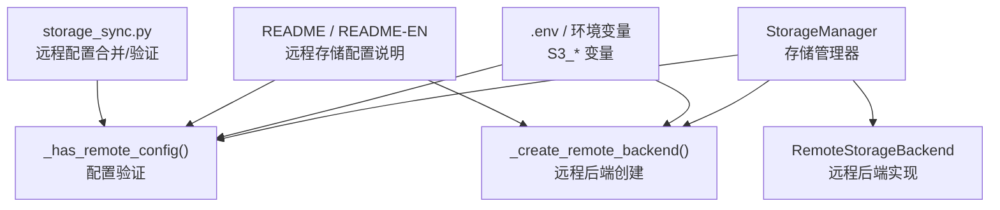
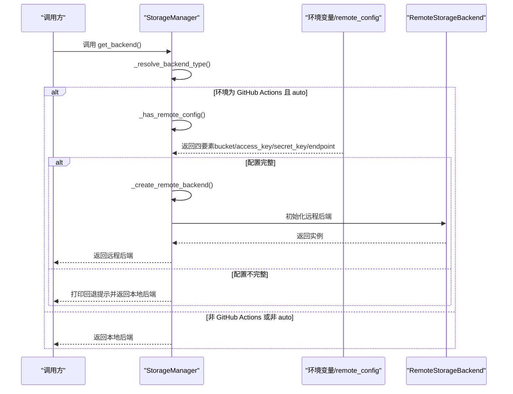
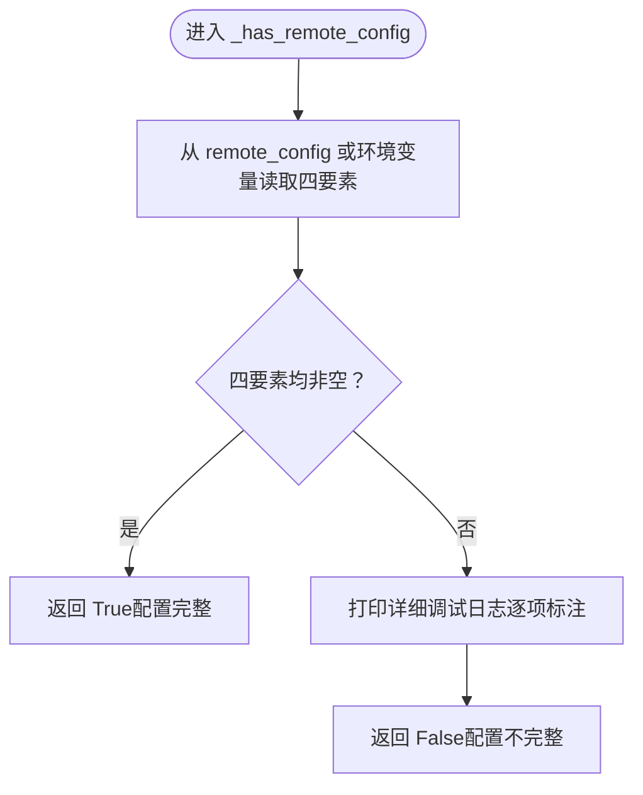
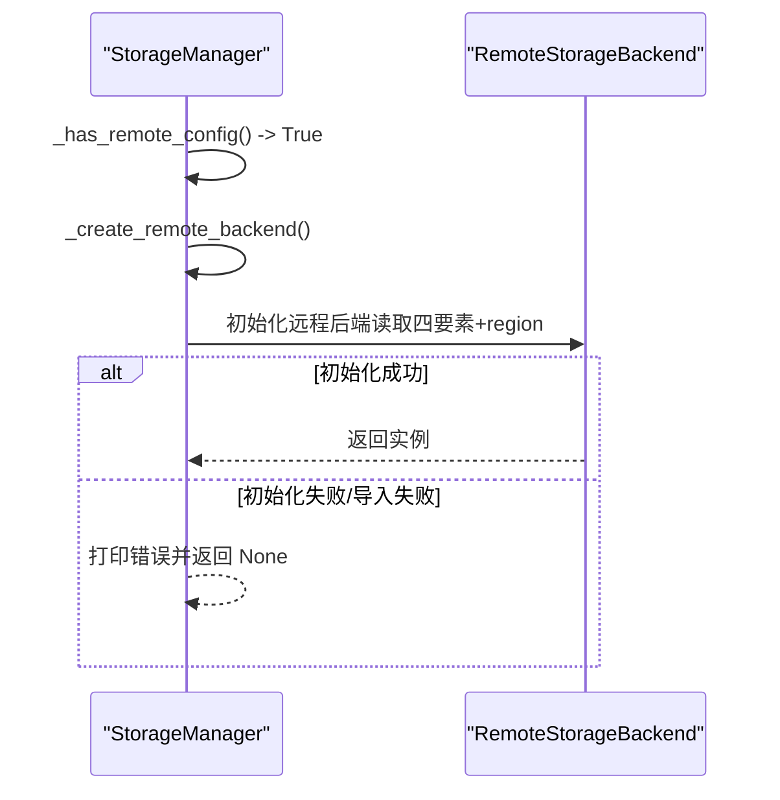
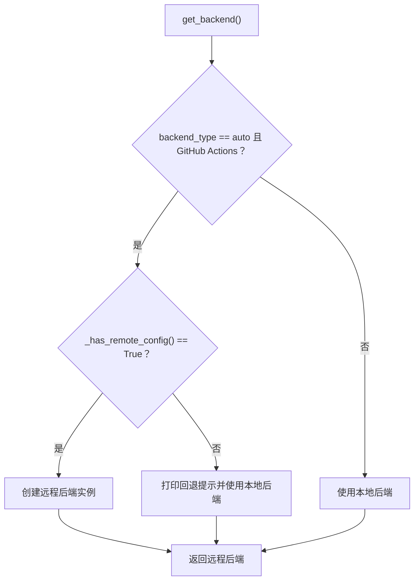
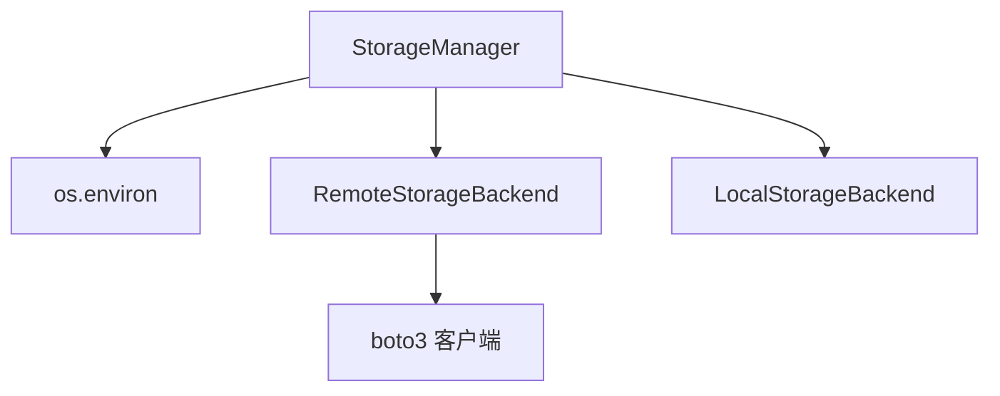

# 配置验证流程

<cite>
**本文引用的文件**
- [trendradar/storage/manager.py](file://trendradar/storage/manager.py)
- [trendradar/storage/remote.py](file://trendradar/storage/remote.py)
- [docker/.env](file://docker/.env)
- [README.md](file://README.md)
- [README-EN.md](file://README-EN.md)
- [mcp_server/tools/storage_sync.py](file://mcp_server/tools/storage_sync.py)
- [trendradar/core/loader.py](file://trendradar/core/loader.py)
</cite>

## 目录
1. [简介](#简介)
2. [项目结构](#项目结构)
3. [核心组件](#核心组件)
4. [架构总览](#架构总览)
5. [详细组件分析](#详细组件分析)
6. [依赖关系分析](#依赖关系分析)
7. [性能考量](#性能考量)
8. [故障排查指南](#故障排查指南)
9. [结论](#结论)

## 简介
本文件聚焦于 TrendRadar 存储后端选择策略中的“配置验证流程”，重点解析 StorageManager._has_remote_config() 方法的实现逻辑，阐明其如何通过 remote_config 参数与环境变量（S3_BUCKET_NAME、S3_ACCESS_KEY_ID、S3_SECRET_ACCESS_KEY、S3_ENDPOINT_URL）双重来源获取远程存储配置，并验证这四个关键参数是否全部存在且非空。同时说明当配置检查失败时，系统如何打印详细的调试日志帮助定位问题；结合 _create_remote_backend() 方法，阐述配置验证结果如何决定远程后端的创建流程，以及在配置不完整时如何触发向本地后端的优雅回退机制。

## 项目结构
围绕存储配置验证与后端选择的关键文件如下：
- trendradar/storage/manager.py：存储管理器，负责后端类型解析、远程配置验证、远程后端创建与回退逻辑
- trendradar/storage/remote.py：远程存储后端实现，封装 S3 兼容客户端初始化与数据读写
- docker/.env：Docker/本地环境变量示例，包含远程存储相关变量
- README.md / README-EN.md：远程存储配置说明与环境变量要求
- mcp_server/tools/storage_sync.py：另一处远程配置合并与验证的实现，便于对比
- trendradar/core/loader.py：配置加载器，展示如何从环境变量读取远程存储参数

图表来源
- [trendradar/storage/manager.py](file://trendradar/storage/manager.py#L93-L173)
- [trendradar/storage/remote.py](file://trendradar/storage/remote.py#L93-L122)
- [docker/.env](file://docker/.env#L110-L116)
- [README.md](file://README.md#L980-L1000)
- [README-EN.md](file://README-EN.md#L3037-L3055)
- [mcp_server/tools/storage_sync.py](file://mcp_server/tools/storage_sync.py#L54-L88)

章节来源
- [trendradar/storage/manager.py](file://trendradar/storage/manager.py#L93-L173)
- [docker/.env](file://docker/.env#L110-L116)
- [README.md](file://README.md#L980-L1000)
- [README-EN.md](file://README-EN.md#L3037-L3055)
- [mcp_server/tools/storage_sync.py](file://mcp_server/tools/storage_sync.py#L54-L88)

## 核心组件
- StorageManager._has_remote_config()：判断远程存储配置是否完整（四要素齐全且非空）
- StorageManager._create_remote_backend()：在配置完整时创建远程后端实例
- StorageManager.get_backend()：根据环境与配置解析后端类型，必要时回退到本地后端
- RemoteStorageBackend：远程存储后端实现，负责 S3 客户端初始化与数据读写
- 环境变量与配置文件：S3_BUCKET_NAME、S3_ACCESS_KEY_ID、S3_SECRET_ACCESS_KEY、S3_ENDPOINT_URL、S3_REGION

章节来源
- [trendradar/storage/manager.py](file://trendradar/storage/manager.py#L93-L173)
- [trendradar/storage/remote.py](file://trendradar/storage/remote.py#L93-L122)

## 架构总览
远程存储配置验证与后端选择的整体流程如下：

图表来源
- [trendradar/storage/manager.py](file://trendradar/storage/manager.py#L93-L173)
- [trendradar/storage/remote.py](file://trendradar/storage/remote.py#L93-L122)

## 详细组件分析

### StorageManager._has_remote_config() 方法实现逻辑
- 双重来源获取配置
  - remote_config.get("bucket_name") 或 os.environ.get("S3_BUCKET_NAME")
  - remote_config.get("access_key_id") 或 os.environ.get("S3_ACCESS_KEY_ID")
  - remote_config.get("secret_access_key") 或 os.environ.get("S3_SECRET_ACCESS_KEY")
  - remote_config.get("endpoint_url") 或 os.environ.get("S3_ENDPOINT_URL")
- 验证规则
  - 四个关键参数必须全部存在且非空，才认为配置完整
- 调试日志
  - 当配置不完整时，打印“远程存储配置检查失败”及每个字段的“已配置/未配置”状态，便于用户快速定位缺失项

图表来源
- [trendradar/storage/manager.py](file://trendradar/storage/manager.py#L107-L124)

章节来源
- [trendradar/storage/manager.py](file://trendradar/storage/manager.py#L107-L124)

### 配置验证失败时的调试日志
- 日志内容包括：
  - bucket_name：已配置/未配置
  - access_key_id：已配置/未配置
  - secret_access_key：已配置/未配置
  - endpoint_url：已配置/未配置
- 作用：帮助用户快速识别缺失的环境变量或 remote_config 字段，从而修正配置

章节来源
- [trendradar/storage/manager.py](file://trendradar/storage/manager.py#L116-L123)

### _create_remote_backend() 与远程后端创建流程
- 创建条件：_has_remote_config() 返回 True
- 创建过程：
  - 导入 RemoteStorageBackend
  - 从 remote_config 或环境变量读取 bucket_name、access_key_id、secret_access_key、endpoint_url、region
  - 初始化远程后端实例（包含 S3 客户端配置）
- 异常处理：
  - 导入失败：提示安装 boto3
  - 初始化异常：打印失败原因并返回 None

图表来源
- [trendradar/storage/manager.py](file://trendradar/storage/manager.py#L126-L147)
- [trendradar/storage/remote.py](file://trendradar/storage/remote.py#L93-L122)

章节来源
- [trendradar/storage/manager.py](file://trendradar/storage/manager.py#L126-L147)
- [trendradar/storage/remote.py](file://trendradar/storage/remote.py#L93-L122)

### 配置验证结果如何决定后端选择与回退
- get_backend() 流程要点：
  - 若 backend_type 为 auto：
    - 在 GitHub Actions 环境中，若 _has_remote_config() 为 True，则使用远程后端
    - 否则打印提示并使用本地后端
  - 若 backend_type 非 auto：直接使用本地后端
- 远程后端创建失败时：
  - 打印回退提示并切换到本地后端
- pull_from_remote() 与 cleanup_old_data()：
  - 在执行前同样会调用 _has_remote_config() 进行二次校验
  - 若配置不完整，打印“未配置远程存储，无法拉取/清理”并提前返回

图表来源
- [trendradar/storage/manager.py](file://trendradar/storage/manager.py#L93-L173)

章节来源
- [trendradar/storage/manager.py](file://trendradar/storage/manager.py#L93-L173)

### 与其它配置来源的对比（storage_sync.py 与 core/loader.py）
- storage_sync.py 的远程配置合并逻辑：
  - 合并 storage_config.remote 与环境变量，形成最终配置字典
  - 通过 _has_remote_config() 判断四要素是否齐全
- core/loader.py 的配置加载逻辑：
  - 从环境变量读取 STORAGE_BACKEND、STORAGE_TXT_ENABLED、STORAGE_HTML_ENABLED、LOCAL_RETENTION_DAYS、REMOTE_RETENTION_DAYS、PULL_ENABLED、PULL_DAYS 等
  - 从环境变量读取 S3_* 相关参数，用于构建远程存储配置字典

章节来源
- [mcp_server/tools/storage_sync.py](file://mcp_server/tools/storage_sync.py#L54-L88)
- [trendradar/core/loader.py](file://trendradar/core/loader.py#L140-L163)

## 依赖关系分析
- StorageManager 依赖：
  - os.environ：读取 S3_* 环境变量
  - RemoteStorageBackend：远程后端实现
  - LocalStorageBackend：本地后端实现（在回退时使用）
- RemoteStorageBackend 依赖：
  - boto3：S3 客户端库
  - 时区与文件路径工具：时间格式化与临时目录管理

图表来源
- [trendradar/storage/manager.py](file://trendradar/storage/manager.py#L126-L173)
- [trendradar/storage/remote.py](file://trendradar/storage/remote.py#L93-L122)

章节来源
- [trendradar/storage/manager.py](file://trendradar/storage/manager.py#L126-L173)
- [trendradar/storage/remote.py](file://trendradar/storage/remote.py#L93-L122)

## 性能考量
- 配置验证为 O(1) 操作，仅进行字典/环境变量读取与布尔判断，开销极低
- 远程后端创建涉及 boto3 客户端初始化，属于一次性成本；后续 IO 操作受网络与对象存储性能影响
- 在 GitHub Actions 环境中，若未配置远程存储，系统会直接回退到本地后端，避免不必要的初始化与错误日志

## 故障排查指南
- 常见问题与定位步骤
  - 症状：打印“远程存储配置检查失败”并回退到本地后端
  - 排查要点：
    - 确认环境变量 S3_BUCKET_NAME、S3_ACCESS_KEY_ID、S3_SECRET_ACCESS_KEY、S3_ENDPOINT_URL 是否设置
    - 确认 remote_config 参数是否传入且包含上述字段
    - 若使用 Docker/本地环境，检查 docker/.env 中的 S3_* 变量是否正确
  - 参考依据：
    - README 与 README-EN 中关于远程存储配置的要求与示例
    - StorageManager._has_remote_config() 的调试日志输出
- 进一步诊断
  - 若导入 boto3 失败：确认已安装 boto3
  - 若远程后端初始化失败：检查 endpoint_url、region、密钥权限与网络连通性
  - 若在 GitHub Actions 中使用远程存储：确认 Secrets 中已配置 S3_* 变量

章节来源
- [trendradar/storage/manager.py](file://trendradar/storage/manager.py#L116-L147)
- [docker/.env](file://docker/.env#L110-L116)
- [README.md](file://README.md#L980-L1000)
- [README-EN.md](file://README-EN.md#L3037-L3055)

## 结论
StorageManager._has_remote_config() 通过“remote_config 参数 + 环境变量”的双重来源，严格验证远程存储的四要素完整性，并在配置不完整时输出详细调试日志，帮助用户快速定位问题。配合 _create_remote_backend() 的异常处理与 get_backend() 的回退机制，系统能够在 GitHub Actions 等环境中优雅地从远程后端切换到本地后端，保证运行稳定性与可观测性。建议在生产环境中始终提供完整的 S3_* 配置，或在不需要远程存储时显式选择本地后端，以避免不必要的回退与日志干扰。