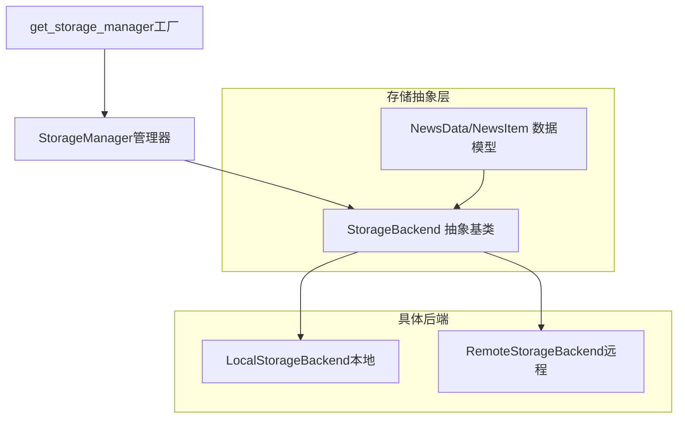
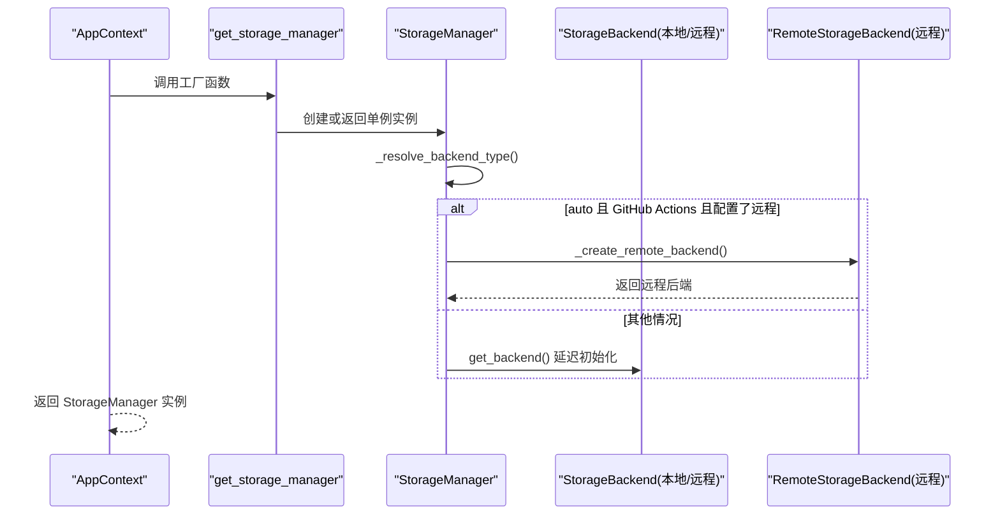
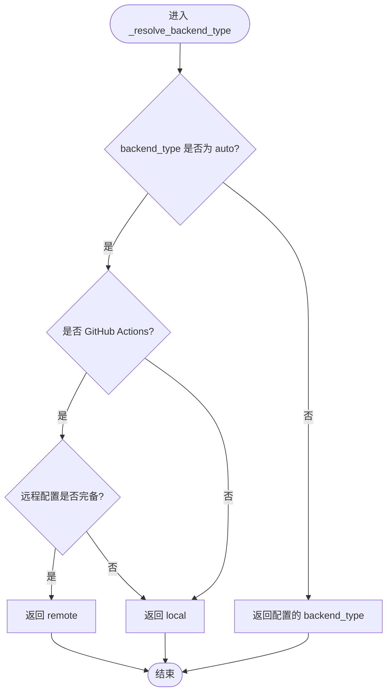
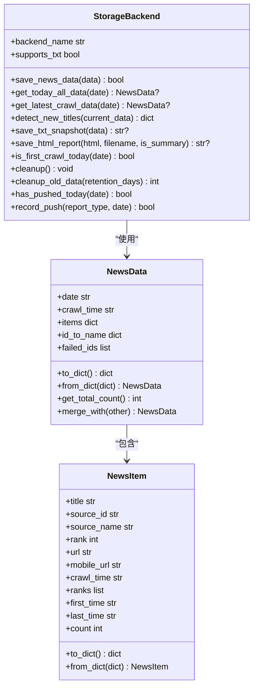
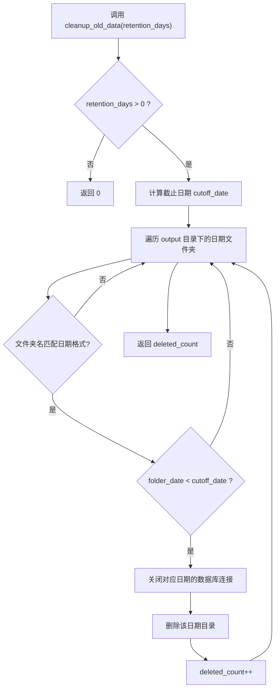
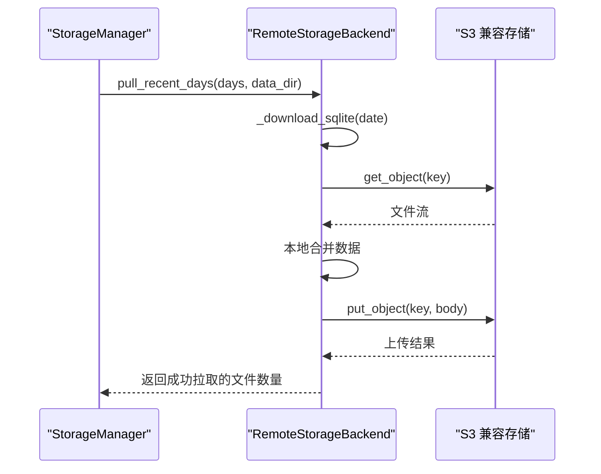
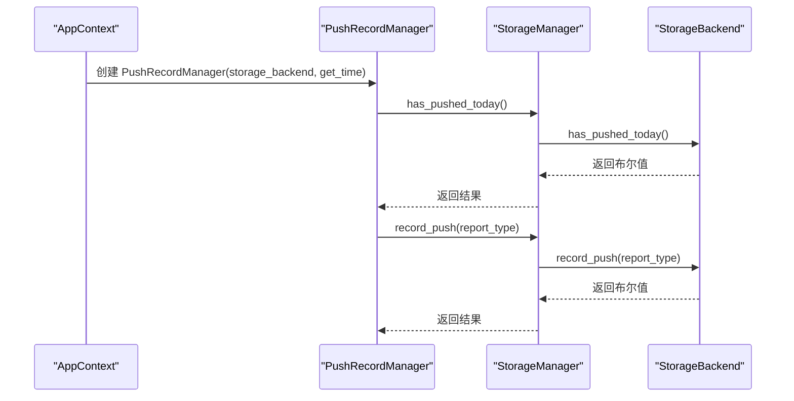
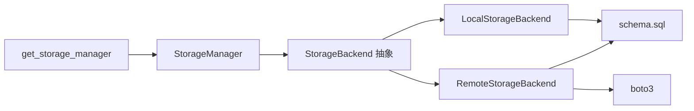

# 存储管理

<cite>
**本文引用的文件**
- [manager.py](file://trendradar/storage/manager.py)
- [base.py](file://trendradar/storage/base.py)
- [local.py](file://trendradar/storage/local.py)
- [remote.py](file://trendradar/storage/remote.py)
- [schema.sql](file://trendradar/storage/schema.sql)
- [context.py](file://trendradar/context.py)
- [push_manager.py](file://trendradar/notification/push_manager.py)
- [config.yaml](file://config/config.yaml)
</cite>

## 目录
1. [简介](#简介)
2. [项目结构](#项目结构)
3. [核心组件](#核心组件)
4. [架构总览](#架构总览)
5. [详细组件分析](#详细组件分析)
6. [依赖关系分析](#依赖关系分析)
7. [性能考量](#性能考量)
8. [故障排查指南](#故障排查指南)
9. [结论](#结论)

## 简介
本文件聚焦 TrendRadar 的存储管理子系统，系统性梳理 StorageManager 的设计与“auto”模式实现，解释其作为统一存储抽象层的作用，如何依据运行环境与配置自动选择本地或远程后端；详解 get_backend 的延迟初始化与单例模式、_create_remote_backend 对 boto3 的依赖处理；阐述 pull_from_remote 在启动时同步数据的机制、cleanup_old_data 的本地与远程过期数据清理策略，以及 has_pushed_today 与 record_push 的推送记录管理；结合 AppContext.get_storage_manager() 的调用，说明其与应用上下文的集成；最后解释 get_storage_manager() 工厂函数如何实现单例模式并处理 force_new 参数。

## 项目结构
存储管理相关代码位于 trendradar/storage 目录，核心文件包括：
- manager.py：存储管理器 StorageManager 与工厂函数 get_storage_manager
- base.py：存储后端抽象基类 StorageBackend 与数据模型 NewsData/NewsItem
- local.py：本地存储后端 LocalStorageBackend（SQLite + 可选 TXT/HTML）
- remote.py：远程存储后端 RemoteStorageBackend（S3 兼容协议，boto3）
- schema.sql：数据库表结构定义（平台、新闻、标题变更、排名历史、抓取记录、推送记录）

图表来源
- [manager.py](file://trendradar/storage/manager.py#L1-L344)
- [base.py](file://trendradar/storage/base.py#L1-L456)
- [local.py](file://trendradar/storage/local.py#L1-L800)
- [remote.py](file://trendradar/storage/remote.py#L1-L800)

章节来源
- [manager.py](file://trendradar/storage/manager.py#L1-L344)
- [base.py](file://trendradar/storage/base.py#L1-L456)
- [local.py](file://trendradar/storage/local.py#L1-L800)
- [remote.py](file://trendradar/storage/remote.py#L1-L800)
- [schema.sql](file://trendradar/storage/schema.sql#L1-L118)

## 核心组件
- StorageManager：统一的存储抽象层，负责根据运行环境与配置选择后端、延迟初始化、统一对外接口、数据清理与推送记录管理。
- StorageBackend 抽象基类：定义统一的存储接口，包括保存/读取、检测新增、快照/报告生成、首次抓取判断、资源清理、过期数据清理、推送记录接口等。
- LocalStorageBackend：基于 SQLite 的本地存储，支持可选 TXT 快照与 HTML 报告。
- RemoteStorageBackend：基于 S3 兼容协议的远程存储，支持下载/合并/上传、拉取历史数据到本地、清理临时文件。
- get_storage_manager 工厂：实现 StorageManager 单例，支持 force_new 强制重建。

章节来源
- [manager.py](file://trendradar/storage/manager.py#L1-L344)
- [base.py](file://trendradar/storage/base.py#L187-L456)
- [local.py](file://trendradar/storage/local.py#L1-L800)
- [remote.py](file://trendradar/storage/remote.py#L1-L800)

## 架构总览
StorageManager 作为门面，内部根据 backend_type 与运行环境决定使用 LocalStorageBackend 或 RemoteStorageBackend。RemoteStorageBackend 在需要时从远程下载 SQLite 至本地临时目录进行合并，再上传回远程；LocalStorageBackend 则直接在本地维护 SQLite 数据库。两者均遵循 StorageBackend 抽象接口，保证上层调用的一致性。

图表来源
- [context.py](file://trendradar/context.py#L126-L155)
- [manager.py](file://trendradar/storage/manager.py#L93-L173)
- [remote.py](file://trendradar/storage/remote.py#L1-L120)

章节来源
- [context.py](file://trendradar/context.py#L126-L155)
- [manager.py](file://trendradar/storage/manager.py#L93-L173)
- [remote.py](file://trendradar/storage/remote.py#L1-L120)

## 详细组件分析

### StorageManager 设计与 auto 模式
- 自动后端选择
  - _resolve_backend_type()：当 backend_type 为“auto”时，在 GitHub Actions 环境中检查远程配置是否完备，若完备则选择 remote，否则回退到 local；在非 GitHub Actions 环境直接选择 local。
  - is_github_actions() 与 is_docker()：通过环境变量与容器特征文件判断运行环境。
- 远程后端创建
  - _create_remote_backend()：延迟导入 RemoteStorageBackend，从 remote_config 或环境变量读取 S3 配置，构造远程后端；捕获 ImportError 提示安装 boto3，其他异常记录失败原因。
- 延迟初始化与单例
  - get_backend()：首次调用时解析后端类型并创建对应实例，缓存到 _backend；若远程创建失败则回退到本地。
  - get_storage_manager()：全局单例，支持 force_new 强制重建；与 AppContext.get_storage_manager() 协作，后者从配置中提取 STORAGE 相关参数并注入。
- 数据拉取与清理
  - pull_from_remote()：在 pull_enabled 且 pull_days > 0 且具备远程配置时，从远程拉取最近 N 天数据到本地 data_dir。
  - cleanup_old_data()：分别对本地与远程（若配置了远程保留天数且有远程配置）执行过期数据清理，返回删除的日期目录数量。
- 推送记录管理
  - has_pushed_today()/record_push()：委托给当前后端实现，用于 once_per_day 与时间窗口控制。

图表来源
- [manager.py](file://trendradar/storage/manager.py#L93-L125)

章节来源
- [manager.py](file://trendradar/storage/manager.py#L71-L173)
- [manager.py](file://trendradar/storage/manager.py#L175-L255)
- [manager.py](file://trendradar/storage/manager.py#L257-L293)
- [manager.py](file://trendradar/storage/manager.py#L295-L344)

### StorageBackend 抽象与数据模型
- 抽象接口：save_news_data/get_today_all_data/get_latest_crawl_data/detect_new_titles/save_txt_snapshot/save_html_report/is_first_crawl_today/cleanup/cleanup_old_data/backend_name/supports_txt/has_pushed_today/record_push。
- 数据模型：NewsData/NewsItem，支持合并、统计、序列化/反序列化，便于跨后端传输与持久化。

图表来源
- [base.py](file://trendradar/storage/base.py#L187-L456)

章节来源
- [base.py](file://trendradar/storage/base.py#L13-L186)
- [base.py](file://trendradar/storage/base.py#L187-L456)

### LocalStorageBackend（本地）
- 数据库：按日期组织 SQLite 文件，表结构由 schema.sql 定义，包含 platforms、news_items、title_changes、rank_history、crawl_records、crawl_source_status、push_records。
- 延迟连接：_get_connection() 缓存连接，减少 IO。
- 数据写入：save_news_data() 标准化 URL 去重，记录标题变更与排名历史，合并成功/失败来源状态。
- 读取与合并：get_today_all_data()/get_latest_crawl_data() 从数据库读取并组装 NewsData，批量查询排名历史提升效率。
- 新增检测：detect_new_titles() 基于 first_time 与当前批次时间判断新增标题。
- 快照与报告：save_txt_snapshot()/save_html_report()（可选）。
- 首次抓取：is_first_crawl_today() 基于 crawl_records 计数。
- 清理：cleanup_old_data() 遍历 output 目录，删除超过保留天数的日期目录，并关闭对应连接。

图表来源
- [local.py](file://trendradar/storage/local.py#L746-L800)
- [schema.sql](file://trendradar/storage/schema.sql#L1-L118)

章节来源
- [local.py](file://trendradar/storage/local.py#L1-L800)
- [schema.sql](file://trendradar/storage/schema.sql#L1-L118)

### RemoteStorageBackend（远程）
- 依赖：boto3（HAS_BOTO3 标记），在缺少依赖时抛出 ImportError。
- 临时目录：在本地临时目录下载/合并/上传 SQLite，完成后清理。
- 远程对象键：news/{date}.db。
- 下载/上传：_download_sqlite() 使用 get_object + iter_chunks，_upload_sqlite() 使用 put_object 并显式设置 ContentLength，避免 chunked transfer encoding 问题（尤其适配腾讯云 COS）。
- 数据合并：save_news_data() 先下载远程数据库到本地，执行插入/更新/记录变更，再上传回远程。
- 读取与合并：get_today_all_data()/get_latest_crawl_data() 与本地类似，但数据来自远程下载的本地副本。
- 新增检测：detect_new_titles() 同本地逻辑。
- 快照与报告：save_txt_snapshot()/save_html_report() 默认在本地临时目录生成（远程模式下 TXT 可选）。
- 清理：cleanup_old_data() 由于远程清理涉及对象存储 API，需在上层通过 StorageManager 调用（见下节）。

图表来源
- [manager.py](file://trendradar/storage/manager.py#L175-L199)
- [remote.py](file://trendradar/storage/remote.py#L178-L274)

章节来源
- [remote.py](file://trendradar/storage/remote.py#L1-L800)

### 推送记录管理（PushRecordManager）
- 作用：统一管理推送记录，支持 once_per_day 与时间窗口控制；通过 storage_backend 统一存储，本地/远程均可。
- 与 StorageManager 集成：AppContext.create_push_manager() 将 storage_backend 传入 PushRecordManager，从而复用 StorageManager 的 has_pushed_today()/record_push()。

图表来源
- [context.py](file://trendradar/context.py#L376-L381)
- [push_manager.py](file://trendradar/notification/push_manager.py#L1-L110)
- [manager.py](file://trendradar/storage/manager.py#L269-L293)
- [base.py](file://trendradar/storage/base.py#L327-L355)

章节来源
- [push_manager.py](file://trendradar/notification/push_manager.py#L1-L110)
- [context.py](file://trendradar/context.py#L376-L381)
- [manager.py](file://trendradar/storage/manager.py#L269-L293)
- [base.py](file://trendradar/storage/base.py#L327-L355)

### AppContext 与存储管理集成
- AppContext.get_storage_manager()：从配置中读取 STORAGE 配置（backend、formats、local、remote、pull），调用 get_storage_manager() 创建/获取单例 StorageManager。
- 与推送记录：AppContext.create_push_manager() 将 storage_backend 注入 PushRecordManager，使推送记录与存储后端一致。

章节来源
- [context.py](file://trendradar/context.py#L126-L155)
- [context.py](file://trendradar/context.py#L376-L381)
- [config.yaml](file://config/config.yaml#L12-L52)

## 依赖关系分析
- StorageManager 依赖 StorageBackend 抽象，具体依赖 LocalStorageBackend 或 RemoteStorageBackend。
- RemoteStorageBackend 依赖 boto3（HAS_BOTO3），在初始化时根据 endpoint_url 判断签名版本（COS 使用 s3，其他使用 s3v4）。
- 本地与远程均使用 schema.sql 定义的表结构，保证数据一致性。
- AppContext 通过配置驱动 StorageManager 的创建与行为。

图表来源
- [manager.py](file://trendradar/storage/manager.py#L295-L344)
- [remote.py](file://trendradar/storage/remote.py#L1-L120)
- [schema.sql](file://trendradar/storage/schema.sql#L1-L118)

章节来源
- [manager.py](file://trendradar/storage/manager.py#L295-L344)
- [remote.py](file://trendradar/storage/remote.py#L1-L120)
- [schema.sql](file://trendradar/storage/schema.sql#L1-L118)

## 性能考量
- 连接池与延迟初始化：LocalStorageBackend 的连接缓存与 StorageManager 的后端延迟初始化减少不必要的 IO 与初始化开销。
- 批量查询：本地/远程读取时批量查询排名历史，降低多次往返查询成本。
- 上传优化：RemoteStorageBackend 使用 put_object 并显式设置 ContentLength，避免 chunked transfer encoding 带来的兼容性问题与额外开销。
- 保留策略：cleanup_old_data() 仅在 retention_days > 0 时执行，避免无效扫描。

[本节为通用指导，无需特定文件来源]

## 故障排查指南
- 远程依赖缺失
  - 现象：远程后端导入失败或初始化抛出 ImportError。
  - 处理：安装 boto3；确认 endpoint_url、bucket_name、access_key_id、secret_access_key、region 配置完整。
  - 参考路径：[manager.py](file://trendradar/storage/manager.py#L126-L148)，[remote.py](file://trendradar/storage/remote.py#L1-L120)
- 远程配置检查
  - 现象：_has_remote_config() 返回 False 导致回退到本地。
  - 处理：检查 remote_config 或环境变量（S3_ENDPOINT_URL/S3_BUCKET_NAME/S3_ACCESS_KEY_ID/S3_SECRET_ACCESS_KEY/S3_REGION）。
  - 参考路径：[manager.py](file://trendradar/storage/manager.py#L107-L125)
- 启动时拉取失败
  - 现象：pull_from_remote() 返回 0。
  - 处理：确认 pull_enabled=true 且 pull_days>0，且远程配置有效；检查网络与权限。
  - 参考路径：[manager.py](file://trendradar/storage/manager.py#L175-L199)
- 本地清理无效
  - 现象：本地数据未被清理。
  - 处理：确认 local_retention_days>0，检查 output 目录命名格式（YYYY-MM-DD 或 YYYY年MM月DD日）。
  - 参考路径：[local.py](file://trendradar/storage/local.py#L746-L800)，[schema.sql](file://trendradar/storage/schema.sql#L1-L118)
- 推送记录异常
  - 现象：once_per_day 不生效。
  - 处理：确认 has_pushed_today()/record_push() 能正常读写 push_records 表；检查时区与时钟。
  - 参考路径：[base.py](file://trendradar/storage/base.py#L327-L355)，[schema.sql](file://trendradar/storage/schema.sql#L83-L94)

章节来源
- [manager.py](file://trendradar/storage/manager.py#L107-L148)
- [manager.py](file://trendradar/storage/manager.py#L175-L199)
- [local.py](file://trendradar/storage/local.py#L746-L800)
- [remote.py](file://trendradar/storage/remote.py#L1-L120)
- [base.py](file://trendradar/storage/base.py#L327-L355)
- [schema.sql](file://trendradar/storage/schema.sql#L83-L94)

## 结论
StorageManager 通过“auto”模式与运行环境检测，实现了灵活的后端选择；get_backend 的延迟初始化与单例模式保证了资源的高效利用；_create_remote_backend 对 boto3 的依赖处理体现了对第三方库的健壮性考虑。pull_from_remote 与 cleanup_old_data 提供了启动时同步与生命周期管理能力；has_pushed_today/record_push 与 PushRecordManager 的配合完善了推送控制。AppContext 将配置与存储管理解耦，使上层调用简洁可靠。整体设计在抽象、扩展性与易用性之间取得良好平衡。