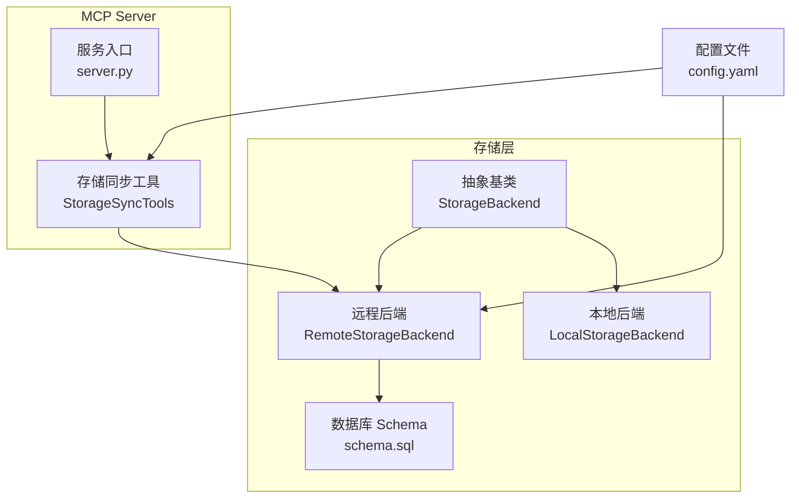
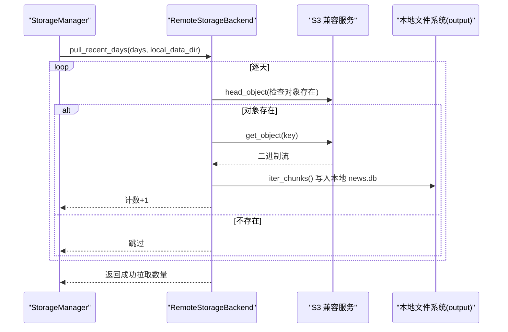
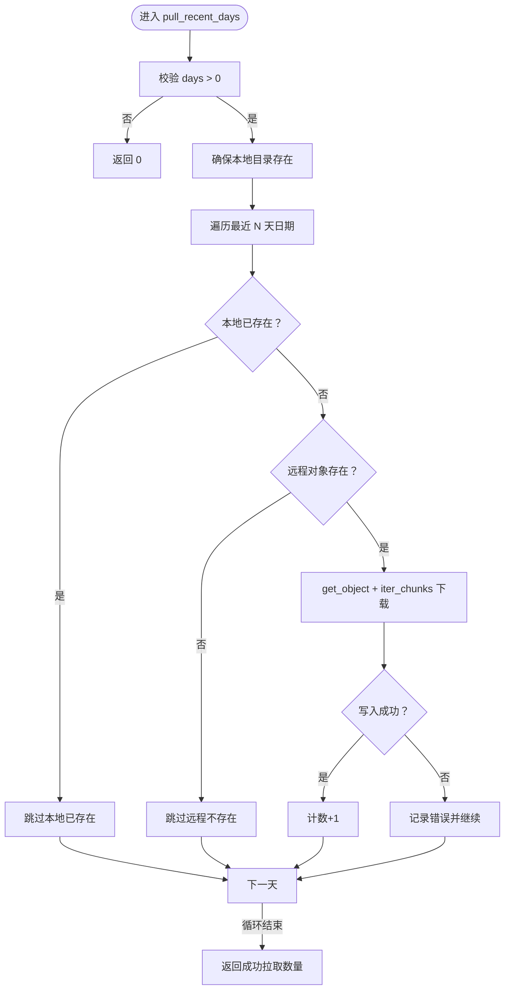
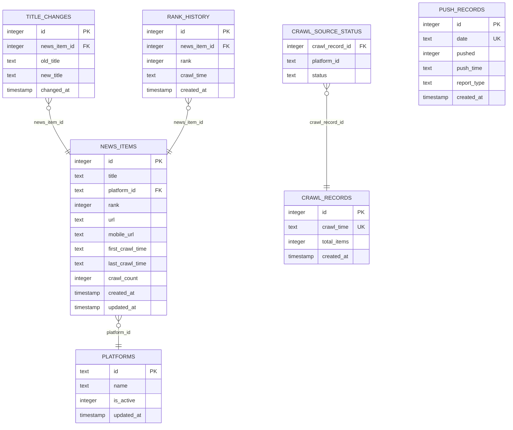
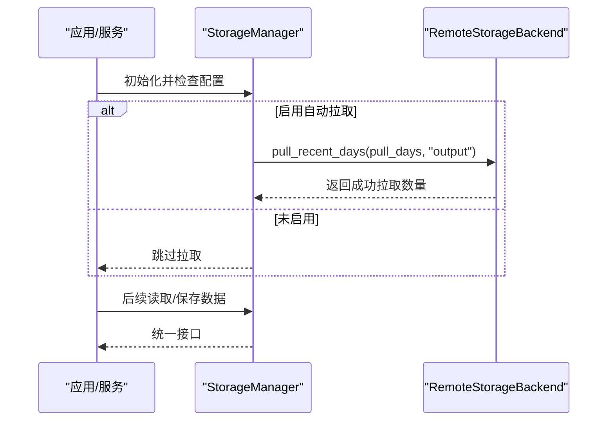
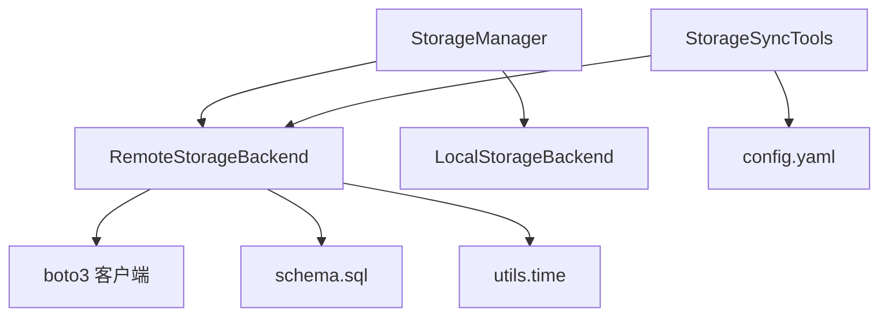

# 传输实现

<cite>
**本文引用的文件**
- [trendradar/storage/remote.py](file://trendradar/storage/remote.py)
- [trendradar/storage/manager.py](file://trendradar/storage/manager.py)
- [trendradar/storage/base.py](file://trendradar/storage/base.py)
- [trendradar/storage/schema.sql](file://trendradar/storage/schema.sql)
- [mcp_server/tools/storage_sync.py](file://mcp_server/tools/storage_sync.py)
- [config/config.yaml](file://config/config.yaml)
- [README.md](file://README.md)
</cite>

## 目录
1. [简介](#简介)
2. [项目结构](#项目结构)
3. [核心组件](#核心组件)
4. [架构概览](#架构概览)
5. [详细组件分析](#详细组件分析)
6. [依赖关系分析](#依赖关系分析)
7. [性能考量](#性能考量)
8. [故障排查指南](#故障排查指南)
9. [结论](#结论)

## 简介
本文件聚焦于 TrendRadar 数据同步机制中“文件传输实现”的关键路径，围绕 RemoteStorageBackend.pull_recent_days() 方法，系统阐述其如何通过 S3 兼容 API 从远程存储批量下载指定天数的 SQLite 数据库文件到本地 output 目录；解释其使用临时目录进行安全文件操作、处理 chunked transfer encoding 兼容性问题以及确保数据一致性的技术细节；并说明下载后的文件如何被 StorageManager 用于增量监控与当日汇总模式的数据合并。

## 项目结构
- 存储层位于 trendradar/storage，包含抽象基类、本地与远程后端、数据库 schema 等。
- MCP Server 提供存储同步工具与服务入口，负责从远程拉取数据到本地。
- 配置文件 config/config.yaml 定义了远程存储与拉取策略的开关与天数。

图表来源
- [trendradar/storage/base.py](file://trendradar/storage/base.py#L187-L456)
- [trendradar/storage/remote.py](file://trendradar/storage/remote.py#L1-L120)
- [trendradar/storage/schema.sql](file://trendradar/storage/schema.sql#L1-L118)
- [mcp_server/tools/storage_sync.py](file://mcp_server/tools/storage_sync.py#L1-L120)
- [config/config.yaml](file://config/config.yaml#L31-L51)

章节来源
- [trendradar/storage/base.py](file://trendradar/storage/base.py#L187-L456)
- [trendradar/storage/remote.py](file://trendradar/storage/remote.py#L1-L120)
- [mcp_server/tools/storage_sync.py](file://mcp_server/tools/storage_sync.py#L1-L120)
- [config/config.yaml](file://config/config.yaml#L31-L51)

## 核心组件
- RemoteStorageBackend：实现 S3 兼容 API 的远程存储后端，提供 pull_recent_days() 批量拉取、对象存在性检查、下载/上传 SQLite、数据库连接与初始化、清理过期数据等能力。
- StorageManager：统一管理存储后端，支持自动选择本地或远程后端，并在配置开启时调用远程后端的 pull_recent_days() 将数据拉取到本地 output 目录。
- StorageSyncTools：MCP Server 的存储同步工具，提供从远程拉取到本地的功能，内部同样使用 RemoteStorageBackend 的能力。
- Schema：定义 news_items、rank_history、title_changes、crawl_records、crawl_source_status、push_records 等表结构及索引，支撑数据一致性与查询效率。

章节来源
- [trendradar/storage/remote.py](file://trendradar/storage/remote.py#L93-L121)
- [trendradar/storage/manager.py](file://trendradar/storage/manager.py#L175-L200)
- [mcp_server/tools/storage_sync.py](file://mcp_server/tools/storage_sync.py#L176-L274)
- [trendradar/storage/schema.sql](file://trendradar/storage/schema.sql#L1-L118)

## 架构概览
RemoteStorageBackend.pull_recent_days() 的调用链路如下：
- StorageManager 在启动时根据配置决定是否拉取远程数据，并调用远程后端的 pull_recent_days()。
- RemoteStorageBackend 逐天计算日期，检查远程对象是否存在，若存在则使用 get_object + iter_chunks 方式下载到本地 output 目录对应日期子目录。
- 下载完成后，本地 output 目录中的 news.db 即可被后续流程（如增量监控与当日汇总）读取与合并。

图表来源
- [trendradar/storage/manager.py](file://trendradar/storage/manager.py#L175-L200)
- [trendradar/storage/remote.py](file://trendradar/storage/remote.py#L1042-L1098)

## 详细组件分析

### RemoteStorageBackend.pull_recent_days() 方法详解
- 输入参数
  - days：拉取最近 N 天的数据。
  - local_data_dir：本地数据目录，默认 "output"。
- 行为与流程
  - 参数校验：days <= 0 直接返回 0。
  - 确保本地目录存在。
  - 以当前配置时区时间为基准，向前回溯 i 天得到 date_str。
  - 计算本地目标路径 local_date_dir/local_db_path，若本地已存在则跳过。
  - 远程对象键 remote_key = "news/{date_str}.db"，先通过 head_object 检查是否存在。
  - 若存在，使用 get_object + iter_chunks(chunk_size=1MB) 逐块写入本地文件，避免 requests 使用 chunked transfer encoding 导致部分 S3 兼容服务（如腾讯云 COS）兼容性问题。
  - 统计成功拉取数量并输出日志。
- 错误处理
  - 对象不存在或检查失败时跳过并继续。
  - 下载异常捕获并打印错误，不影响整体循环。
- 输出
  - 返回本次拉取成功的数据库文件数量。

图表来源
- [trendradar/storage/remote.py](file://trendradar/storage/remote.py#L1042-L1098)

章节来源
- [trendradar/storage/remote.py](file://trendradar/storage/remote.py#L1042-L1098)

### 临时目录与安全文件操作
- 远程后端初始化时创建临时目录 temp_dir，用于存放下载的 SQLite 文件与数据库连接句柄，避免直接污染本地 output 目录。
- 下载流程采用 get_object + iter_chunks 写入本地文件，而非 download_file，从而规避某些 S3 兼容服务对 chunked transfer encoding 的兼容性问题。
- 上传流程明确设置 ContentLength，避免 requests 使用 chunked transfer encoding，进一步提升兼容性。

章节来源
- [trendradar/storage/remote.py](file://trendradar/storage/remote.py#L93-L121)
- [trendradar/storage/remote.py](file://trendradar/storage/remote.py#L178-L224)
- [trendradar/storage/remote.py](file://trendradar/storage/remote.py#L225-L274)

### chunked transfer encoding 兼容性处理
- 识别目标服务是否为腾讯云 COS（域名包含 myqcloud.com），若是，则使用签名版本 s3（SigV2），以避免 chunked encoding 问题。
- 下载时使用 get_object + iter_chunks，上传时使用 put_object 并显式设置 ContentLength，确保不触发 chunked encoding。
- 这些策略保证了与多种 S3 兼容服务（Cloudflare R2、阿里云 OSS、AWS S3、MinIO 等）的稳定交互。

章节来源
- [trendradar/storage/remote.py](file://trendradar/storage/remote.py#L93-L115)
- [trendradar/storage/remote.py](file://trendradar/storage/remote.py#L178-L224)
- [trendradar/storage/remote.py](file://trendradar/storage/remote.py#L225-L274)

### 数据一致性与 Schema 初始化
- RemoteStorageBackend 在首次访问某日期的本地 SQLite 时，若本地文件不存在，会先尝试从远程下载；随后建立 sqlite3 连接并执行 schema.sql 初始化表结构与索引，确保数据库结构一致。
- schema.sql 定义了 news_items、rank_history、title_changes、crawl_records、crawl_source_status、push_records 等核心表，以及必要的索引，支撑去重、排名历史追踪、抓取记录与推送记录等业务需求。

图表来源
- [trendradar/storage/schema.sql](file://trendradar/storage/schema.sql#L1-L118)

章节来源
- [trendradar/storage/remote.py](file://trendradar/storage/remote.py#L275-L311)
- [trendradar/storage/schema.sql](file://trendradar/storage/schema.sql#L1-L118)

### 与 StorageManager 的集成与使用
- StorageManager 在启动时根据配置判断是否启用自动拉取（pull_enabled 且 pull_days > 0），若满足条件则创建远程后端并调用 pull_recent_days()，将远程数据库文件批量拉取到本地 output 目录。
- StorageManager 还提供 get_backend()/get_today_all_data()/get_latest_crawl_data()/detect_new_titles()/save_*_snapshot()/save_html_report() 等统一接口，供上层模块使用。

图表来源
- [trendradar/storage/manager.py](file://trendradar/storage/manager.py#L175-L200)
- [trendradar/storage/manager.py](file://trendradar/storage/manager.py#L200-L234)

章节来源
- [trendradar/storage/manager.py](file://trendradar/storage/manager.py#L175-L200)
- [trendradar/storage/manager.py](file://trendradar/storage/manager.py#L200-L234)

### 与 MCP Server 存储同步工具的关系
- MCP Server 的 StorageSyncTools 也具备从远程拉取到本地的能力，其内部同样使用 RemoteStorageBackend 的 list_remote_dates() 与 s3_client.download_file()（与 pull_recent_days 的实现不同）。
- 二者在功能上互补：StorageManager 主要用于应用启动阶段的自动拉取；StorageSyncTools 提供更丰富的状态查询与同步控制，适合在 MCP Server 中按需触发。

章节来源
- [mcp_server/tools/storage_sync.py](file://mcp_server/tools/storage_sync.py#L176-L274)
- [mcp_server/tools/storage_sync.py](file://mcp_server/tools/storage_sync.py#L373-L469)

## 依赖关系分析
- RemoteStorageBackend 依赖 boto3 客户端，通过 S3 兼容 API 进行对象读写；根据 endpoint_url 判断是否为腾讯云 COS，进而选择签名版本（SigV2/SigV4）。
- RemoteStorageBackend 依赖 schema.sql 初始化数据库结构；依赖 utils.time 提供时区与时序工具。
- StorageManager 依赖 RemoteStorageBackend 与 LocalStorageBackend，依据配置与运行环境自动选择后端。
- MCP Server 的 StorageSyncTools 依赖 RemoteStorageBackend 与配置文件 config.yaml，提供远程可用日期查询与拉取控制。

图表来源
- [trendradar/storage/remote.py](file://trendradar/storage/remote.py#L93-L121)
- [trendradar/storage/remote.py](file://trendradar/storage/remote.py#L275-L311)
- [trendradar/storage/manager.py](file://trendradar/storage/manager.py#L149-L173)
- [mcp_server/tools/storage_sync.py](file://mcp_server/tools/storage_sync.py#L39-L77)
- [config/config.yaml](file://config/config.yaml#L31-L51)

章节来源
- [trendradar/storage/remote.py](file://trendradar/storage/remote.py#L93-L121)
- [trendradar/storage/remote.py](file://trendradar/storage/remote.py#L275-L311)
- [trendradar/storage/manager.py](file://trendradar/storage/manager.py#L149-L173)
- [mcp_server/tools/storage_sync.py](file://mcp_server/tools/storage_sync.py#L39-L77)
- [config/config.yaml](file://config/config.yaml#L31-L51)

## 性能考量
- 下载策略：使用 iter_chunks(1MB) 逐块写入，降低内存峰值占用，提升大文件下载稳定性。
- 上传策略：显式设置 ContentLength，避免 chunked transfer encoding，减少网络栈开销与兼容性问题。
- 本地缓存：RemoteStorageBackend 维护 sqlite3 连接池（按本地数据库路径索引），避免重复打开/初始化数据库带来的 IO 与初始化成本。
- 远程扫描：list_remote_dates 使用分页器遍历远程对象，避免一次性加载过多对象键导致内存压力。
- 时区与时序：统一使用配置时区时间，避免跨时区导致的日期边界问题与重复拉取。

章节来源
- [trendradar/storage/remote.py](file://trendradar/storage/remote.py#L1042-L1098)
- [trendradar/storage/remote.py](file://trendradar/storage/remote.py#L225-L274)
- [trendradar/storage/remote.py](file://trendradar/storage/remote.py#L275-L311)
- [trendradar/storage/remote.py](file://trendradar/storage/remote.py#L1100-L1129)

## 故障排查指南
- 未配置远程存储
  - 现象：StorageManager/pull_from_remote 返回 0 或提示未配置。
  - 处理：检查 config/config.yaml 的 storage.remote 字段或环境变量（S3_ENDPOINT_URL、S3_BUCKET_NAME、S3_ACCESS_KEY_ID、S3_SECRET_ACCESS_KEY）。
- 无法创建远程后端
  - 现象：提示无法创建远程后端或缺少 boto3。
  - 处理：确认已安装 boto3 并检查凭据与 endpoint 正确性。
- 对象不存在
  - 现象：跳过（远程不存在）。
  - 处理：确认远程确实存在对应日期的 news/{date}.db 文件；或调整拉取天数。
- 下载失败
  - 现象：拉取失败并打印错误。
  - 处理：检查网络连通性、签名版本（腾讯云 COS 使用 SigV2）、endpoint 与 region 配置；必要时重试或切换服务提供商。
- 上传失败
  - 现象：上传验证失败或异常。
  - 处理：确认本地文件存在且 ContentLength 设置正确；检查远程权限与配额。

章节来源
- [trendradar/storage/manager.py](file://trendradar/storage/manager.py#L175-L200)
- [trendradar/storage/remote.py](file://trendradar/storage/remote.py#L153-L177)
- [trendradar/storage/remote.py](file://trendradar/storage/remote.py#L225-L274)
- [config/config.yaml](file://config/config.yaml#L31-L51)
- [README.md](file://README.md#L955-L1000)

## 结论
RemoteStorageBackend.pull_recent_days() 通过 S3 兼容 API 实现了对远程 SQLite 数据库文件的批量拉取，结合临时目录的安全操作、chunked transfer encoding 的兼容性处理与 schema 初始化，确保了数据一致性与跨服务提供商的稳定性。配合 StorageManager 的自动拉取与 MCP Server 的存储同步工具，用户可以在本地 output 目录获得完整的近期数据集，为后续的增量监控与当日汇总模式提供可靠基础。